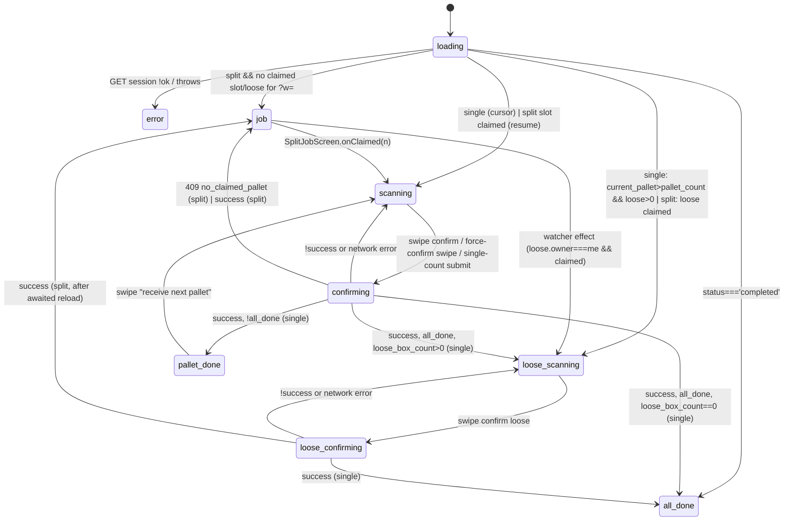
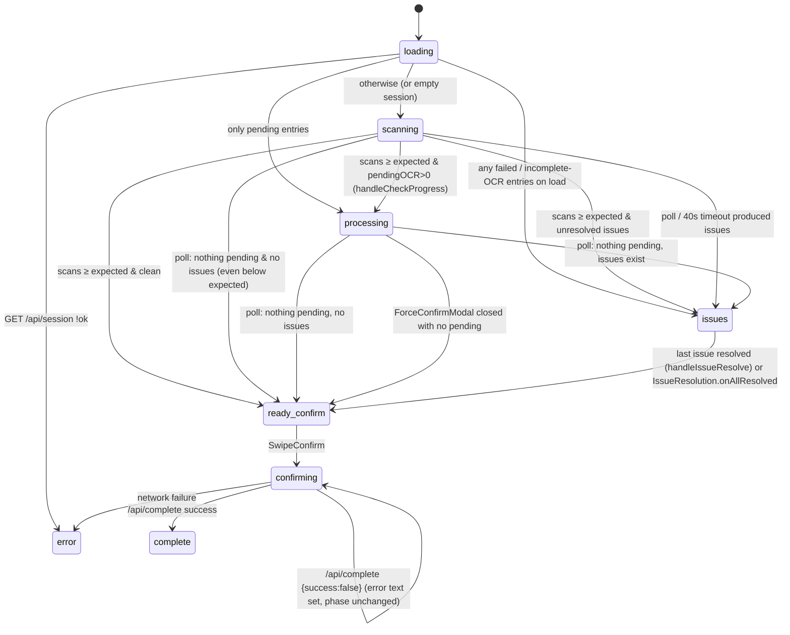
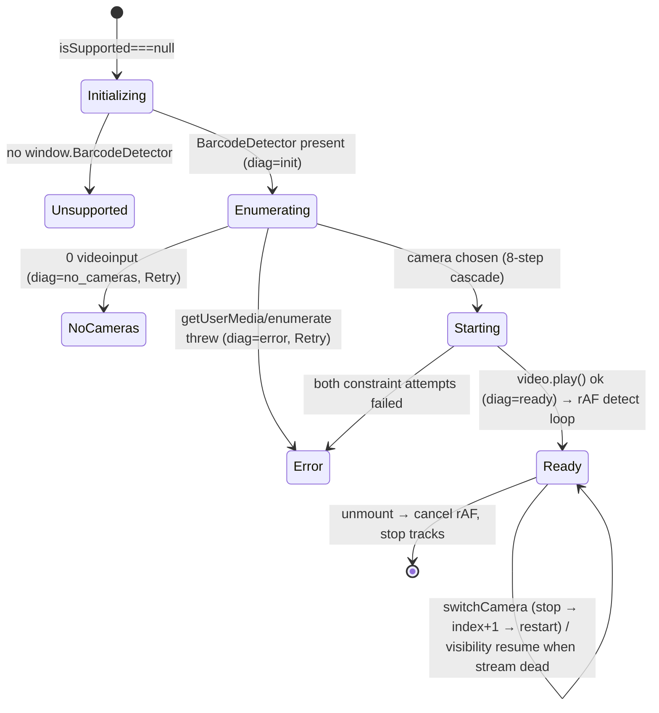
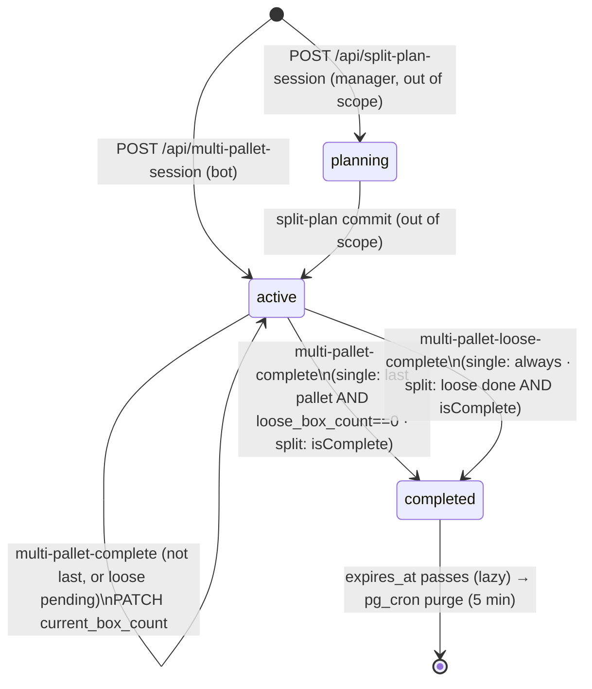
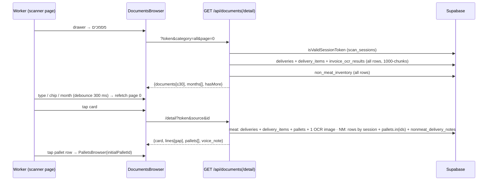
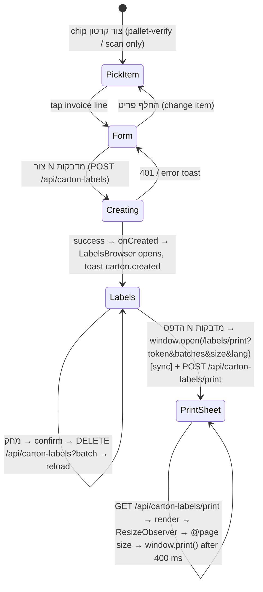
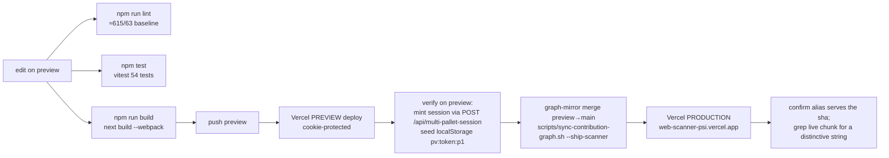

# SCANNER_REFERENCE — the web scanner, in full

**What this is.** A complete technical reference for the Next.js application the warehouse workers hold
in their hands: the camera scanner, the pallet-verification phase machine, the split-assignment board,
the API routes and the shared UI kit. It is written so that an engineer or an AI agent can work on the
scanner *without opening the source*: every page, component, hook, library function, API route, session
key and known defect is documented with a `path:line` citation. Where the older docs disagree with the
code, the disagreement is recorded — the code is the only truth.

| | |
|---|---|
| **Repo state** | scanner `preview` @ `e46d9b9`, byte-identical to production `main` @ `e12ed91` |
| **Production** | Vercel, deployed from `main` (`web-scanner-psi.vercel.app`); a push to `preview` builds a *preview* deployment only |
| **Companion state** | bot `whatsapp` @ `3621f46`, running on Railway |
| **Database** | Supabase Postgres `vkeqzvwnqkuuwurgjjkd`, schema dumped live 2026-09-05 |
| **Written** | 2026-09-08 |
| **Method** | every file in scope read in full; claims cited to `path:line`; live Vercel and database state read directly |

## How to navigate this document

- **New to the scanner?** Read Chapter 1 (the pallet-verify phase machine) — it is the screen a worker
  spends almost all their time on, and everything else orbits it.
- **Chasing a scanning problem?** Chapter 4 documents the camera engine: the native `BarcodeDetector`
  path, the ZXing fallback, the three-identical-reads rule, the cooldown and its colour states.
- **Chasing an API question?** Chapter 6 is the route-by-route reference, including request bodies,
  session mutations, database writes and the webhook fired at the bot.
- **Chasing a layout problem?** Chapter 5 covers the terminal UI kit, including the bottom-sheet drag
  maths and the camera-height invariant that has caused a production outage before.
- **Each chapter follows the same shape:** §0 scope and file map · §1 per-file symbol reference ·
  §2 flows and state machines · §3 data contracts · §4 flags/env/thresholds · §5 dead code and stale
  claims · §6 known issues · §7 cross-references · §8 open questions.

## The three documents

| Document | Covers | Path |
|---|---|---|
| **SCANNER_REFERENCE.md** (this one) | The Next.js scanner: pages, phase machines, scanning engine, API routes, UI kit | `web-scanner/docs/SCANNER_REFERENCE.md` |
| **BOT_REFERENCE.md** | The Python WhatsApp bot: handlers, services, data layer, OCR prompts, messages | `../../telegram-warehouse-bot/docs/BOT_REFERENCE.md` |
| **SYSTEM_REFERENCE.md** | Both together: end-to-end scenarios, the database, the integration contracts, deployment and operations, and the consolidated issues register | `../../telegram-warehouse-bot/docs/SYSTEM_REFERENCE.md` |

> **Read this before trusting a page count.** `docs/ARCHITECTURE.md` describes 8 pages and 25 API
> routes. The counts and several route names have drifted; Chapter 8 audits every claim in the existing
> scanner documents against the code.


> ### How much to trust this document
>
> Every chapter was written by reading the files in its scope **in full** — not sampled, not inferred from
> the older docs — and the structural facts were checked against the live database, Railway and Vercel
> rather than assumed. Where a claim could not be settled from the code it is marked `[UNVERIFIED: …]` and
> collected in the final appendix.
>
> **What did not happen:** a planned second pass, in which an independent reader re-read the same files to
> challenge every claim, ran for only one chapter before it was stopped. So treat the *prose* as reliable
> and the *precise line numbers* as good-but-unconfirmed — any edit to a file moves them anyway. If a
> citation does not land where you expect, search for the symbol name; the symbol is right even when the
> number has drifted.

## Table of contents

- [Chapter 1 — The pallet-verify page — the pallet inbound phase machine](#chapter-1-the-pallet-verify-page-the-pallet-inbound-phase-machine)
  - [0. Scope & file map](#0-scope-file-map)
  - [1. Per-file reference](#1-per-file-reference)
  - [2. Flows & state machines in this scope](#2-flows-state-machines-in-this-scope)
  - [3. Data contracts touched](#3-data-contracts-touched)
  - [4. Feature flags, env vars, roles, thresholds read in scope](#4-feature-flags-env-vars-roles-thresholds-read-in-scope)
  - [5. Dead code, legacy paths, stale-doc claims](#5-dead-code-legacy-paths-stale-doc-claims)
  - [6. Known issues & limitations visible in code](#6-known-issues-limitations-visible-in-code)
  - [7. Facts other sections need](#7-facts-other-sections-need)
  - [8. Open questions](#8-open-questions)
- [Chapter 2 — Split assignment, the non-meat Type A flow, and the meat manual-count flow](#chapter-2-split-assignment-the-non-meat-type-a-flow-and-the-meat-manual-count-flow)
  - [0. Scope & file map](#0-scope-file-map-1)
  - [1. Per-file reference](#1-per-file-reference-1)
  - [2. Flows & state machines in this scope](#2-flows-state-machines-in-this-scope-1)
  - [3. Data contracts touched](#3-data-contracts-touched-1)
  - [4. Feature flags, env vars, roles, thresholds read in scope](#4-feature-flags-env-vars-roles-thresholds-read-in-scope-1)
  - [5. Dead code, legacy paths, stale-doc claims](#5-dead-code-legacy-paths-stale-doc-claims-1)
  - [6. Known issues & limitations visible in code](#6-known-issues-limitations-visible-in-code-1)
  - [7. Facts other sections need](#7-facts-other-sections-need-1)
  - [8. Open questions](#8-open-questions-1)
- [Chapter 3 — Carton scan, the completion page, and the issue outbound page](#chapter-3-carton-scan-the-completion-page-and-the-issue-outbound-page)
  - [0. Scope & file map](#0-scope-file-map-2)
  - [1. Per-file reference](#1-per-file-reference-2)
  - [2. Flows & state machines in this scope](#2-flows-state-machines-in-this-scope-2)
  - [3. Data contracts touched](#3-data-contracts-touched-2)
  - [4. Feature flags, env vars, roles, thresholds read in scope](#4-feature-flags-env-vars-roles-thresholds-read-in-scope-2)
  - [5. Dead code, legacy paths, stale-doc claims](#5-dead-code-legacy-paths-stale-doc-claims-2)
  - [6. Known issues & limitations visible in code](#6-known-issues-limitations-visible-in-code-2)
  - [7. Facts other sections need](#7-facts-other-sections-need-2)
  - [8. Open questions](#8-open-questions-2)
- [Chapter 4 — The scanning engine — SmartScanner, barcode parsing, duplicate guard, feedback, caches, stores](#chapter-4-the-scanning-engine-smartscanner-barcode-parsing-duplicate-guard-feedback-caches-stores)
  - [0. Scope & file map](#0-scope-file-map-3)
  - [1. Per-file reference](#1-per-file-reference-3)
  - [2. Flows & state machines in this scope](#2-flows-state-machines-in-this-scope-3)
  - [3. Data contracts touched](#3-data-contracts-touched-3)
  - [4. Feature flags, env vars, roles, thresholds read in scope](#4-feature-flags-env-vars-roles-thresholds-read-in-scope-3)
  - [5. Dead code, legacy paths, stale-doc claims](#5-dead-code-legacy-paths-stale-doc-claims-3)
  - [6. Known issues & limitations visible in code](#6-known-issues-limitations-visible-in-code-3)
  - [7. Facts other sections need](#7-facts-other-sections-need-3)
  - [8. Open questions](#8-open-questions-3)
- [Chapter 5 — The terminal UI kit, shared components, styles and fonts, i18n, and the client API wrapper](#chapter-5-the-terminal-ui-kit-shared-components-styles-and-fonts-i18n-and-the-client-api-wrapper)
  - [0. Scope & file map](#0-scope-file-map-4)
  - [1. Per-file reference](#1-per-file-reference-4)
  - [2. Flows & state machines in this scope](#2-flows-state-machines-in-this-scope-4)
  - [3. Data contracts touched](#3-data-contracts-touched-4)
  - [4. Feature flags, env vars, roles, thresholds read in scope](#4-feature-flags-env-vars-roles-thresholds-read-in-scope-4)
  - [5. Dead code, legacy paths, stale-doc claims](#5-dead-code-legacy-paths-stale-doc-claims-4)
  - [6. Known issues & limitations visible in code](#6-known-issues-limitations-visible-in-code-4)
  - [7. Facts other sections need](#7-facts-other-sections-need-4)
  - [8. Open questions](#8-open-questions-4)
  - [Appendix A — i18n key families (774 keys, identical set in `en.ts` and `he.ts`)](#appendix-a-i18n-key-families-774-keys-identical-set-in-ents-and-hets)
  - [Appendix B — full key list (key → English text; "used" = referenced by a literal outside the dictionaries)](#appendix-b-full-key-list-key-english-text-used-referenced-by-a-literal-outside-the-dictionaries)
- [Chapter 6 — Pallet-flow API routes, the OCR route, storage upload, the data layer, matching libraries, shared types](#chapter-6-pallet-flow-api-routes-the-ocr-route-storage-upload-the-data-layer-matching-libraries-shared-types)
  - [0. Scope & file map](#0-scope-file-map-5)
  - [1. Per-file reference](#1-per-file-reference-5)
  - [2. Flows & state machines in this scope](#2-flows-state-machines-in-this-scope-5)
  - [3. Data contracts touched](#3-data-contracts-touched-5)
  - [4. Feature flags, env vars, roles, thresholds read in scope](#4-feature-flags-env-vars-roles-thresholds-read-in-scope-5)
  - [5. Dead code, legacy paths, stale-doc claims](#5-dead-code-legacy-paths-stale-doc-claims-5)
  - [6. Known issues & limitations visible in code](#6-known-issues-limitations-visible-in-code-5)
  - [7. Facts other sections need](#7-facts-other-sections-need-5)
  - [8. Open questions](#8-open-questions-5)
- [Chapter 7 — Drawer browsers, carton labels and Code 128, the LPN sticker pages, and printing](#chapter-7-drawer-browsers-carton-labels-and-code-128-the-lpn-sticker-pages-and-printing)
  - [0. Scope & file map](#0-scope-file-map-6)
  - [1. Per-file reference](#1-per-file-reference-6)
  - [2. Flows & state machines in this scope](#2-flows-state-machines-in-this-scope-6)
  - [3. Data contracts touched](#3-data-contracts-touched-6)
  - [4. Feature flags, env vars, roles, thresholds read in scope](#4-feature-flags-env-vars-roles-thresholds-read-in-scope-6)
  - [5. Dead code, legacy paths, stale-doc claims](#5-dead-code-legacy-paths-stale-doc-claims-6)
  - [6. Known issues & limitations visible in code](#6-known-issues-limitations-visible-in-code-6)
  - [7. Facts other sections need](#7-facts-other-sections-need-6)
  - [8. Open questions](#8-open-questions-6)
- [Chapter 8 — Build and configuration, tests, backup routes, and a staleness audit of every existing scanner document](#chapter-8-build-and-configuration-tests-backup-routes-and-a-staleness-audit-of-every-existing-scanner-document)
  - [0. Scope & file map](#0-scope-file-map-7)
  - [1. Per-file reference](#1-per-file-reference-7)
  - [2. Flows & state machines in this scope](#2-flows-state-machines-in-this-scope-7)
  - [3. Data contracts touched](#3-data-contracts-touched-7)
  - [4. Feature flags, env vars, roles, thresholds read in scope](#4-feature-flags-env-vars-roles-thresholds-read-in-scope-7)
  - [5. Dead code, legacy paths, stale-doc claims](#5-dead-code-legacy-paths-stale-doc-claims-7)
  - [6. Known issues & limitations visible in code](#6-known-issues-limitations-visible-in-code-7)
  - [7. Facts other sections need](#7-facts-other-sections-need-7)
  - [8. Open questions](#8-open-questions-7)
- [Appendix A — Complete i18n key catalogue](#appendix-a-complete-i18n-key-catalogue)
- [Appendix — Unverified statements](#appendix-unverified-statements)

---

## Chapter 1 — The pallet-verify page — the pallet inbound phase machine
_Scope:_ `scanner: app/pallet-verify/[token]/page.tsx` (2,842 lines) · _Repo state:_ scanner `preview@e46d9b9` (bot `whatsapp@3621f46`, not touched here) · _Written:_ 2026-09-08

All `path:line` citations below are `scanner:` paths unless prefixed `bot:`. Line numbers are for `app/pallet-verify/[token]/page.tsx` when no path is given.

---

### 0. Scope & file map

| file | lines | one-line purpose | key exports |
|---|---|---|---|
| `app/pallet-verify/[token]/page.tsx` | 2,842 | The meat pallet-inbound scanner screen: loads a multi-pallet session, drives the per-pallet scan → OCR → classify → confirm loop, the loose-box phase, the split-job slot screen, the damaged-sticker hand-off and the non-meat Type A hand-off. Owns the localStorage reload cache and every `/api/*` call of the inbound flow. | `default PalletVerifyPage` (Next.js client page component). Nothing else is exported. |

Sibling files in the same folder (out of scope, referenced only): `NonMeatTypeAFlow.tsx` (non-meat Type A scanner UX), `MeatManualCountFlow.tsx` (damaged-sticker declared-count form, exports `PalletCompleteResult`).

#### 0.1 Line-range map of `page.tsx`

| lines | what |
|---|---|
| 1–50 | imports (React `use/useCallback/useEffect/useRef/useState`, lucide icons, `SmartScanner`, `SwipeConfirm`, the two sibling flows, `DebugLogPanel`, the `components/terminal/*` kit, `findBarcodeConflict`, `installDebugLogCapture`, i18n, types, `group-key`, `invoice-match`, `session-mode`, `duplicate-guard`, `use-back-close`, `settings-store`, `scan-feedback`, `pallet-scan-cache`) |
| 52–56 | module-level side effect: `installDebugLogCapture()` when `window` exists |
| 58–75 | `type DetectedType`, `detectType()` |
| 77–100 | `type OcrStatus`, `interface BoxScan` |
| 102–113 | `digitsOnly()`, `isoToDdmmyyyyShort()` |
| 115–135 | `interface UniformGroup` (+ history comment) |
| 137–157 | `interface PalletScanSnapshot`, `interface LooseScanSnapshot`, `stripImage()` |
| 159–163 | `type UniformPrompt` (single mode `single_or_mix`) |
| 165–183 | constants `UNIFORM_WEIGHT_TOLERANCE`, `UNIFORM_MIN_SAMPLES` |
| 185–189 | constant `ROW_ACTION_BTN` (Tailwind class string) |
| 191–193 | `type Phase` |
| 195–200 | component signature, `token` from `use(params)` |
| 202–208 | `workerChatId` from `?w=` |
| 210–224 | core `useState`s: phase, session, currentPallet, manualMode, boxCountInput, confirmedBoxCount, scannedBoxes, detectedType, lpn, lpnUrl, error |
| 225–226 | `processedRef`, `looseBoxes` |
| 228–233 | settings-store hydrate effect |
| 235–238 | `dupFlashRef`, `looseDupFlashRef` |
| 240–256 | `language`, `useLangDir`, `tr`, `withLang` |
| 257–260 | `looseProcessedRef`, `viewingImage` |
| 261–275 | uniform state + mirror refs (`uniformGroups`, `pendingUniformPrompt`, `forcedMix` + 3 refs + 3 sync effects) |
| 276–301 | `selectedBarcode`, `editForm` |
| 302–317 | `invoiceItemsRef`, `sessionRef`, `currentPalletRef` + sync effects |
| 318–328 | `pendingSingleGroup` |
| 329–344 | AI-merge state: `acceptedMerges`, `rejectedMergePairs`, `pendingMerge` |
| 345–350 | `palletCountError`, `pendingForceConfirm` |
| 351–364 | terminal chrome: `sheetRef`, `looseSheetRef`, `drawer`, toast trio, `showPallets`, `showCartonCreator`, `showLabels`, `activeExpanded`, `pendingNextPallet` |
| 366–370 | `useBackClose` for the image viewer |
| 372–444 | **effect:** debounced AI consolidation → `POST /api/consolidate-items` |
| 446–469 | `handleAcceptMerge()`, `handleRejectMerge()` |
| 471–497 | **effect:** persist snapshot to localStorage (phase-gated) |
| 499–607 | **effect:** session loader (`GET /api/multi-pallet-session`) incl. split resume and cache restore |
| 609–624 | `reloadSession` (useCallback) |
| 626–643 | **effect:** split-job watcher `job → loose_scanning` |
| 645–714 | `handleBarcodeDetected` (useCallback) |
| 716–737 | `handleManualCapture` (useCallback) |
| 739–789 | `retryPalletOcr()`, `rescanPalletBox()` |
| 791–838 | `uploadedStickersRef`, `archiveStickerPhoto()` → `POST /api/cloudinary/upload` |
| 840–999 | `runOcr()` → `POST /api/multi-pallet-ocr` (pallet phase) |
| 1001–1030 | `uniformCandidateFrom()` |
| 1032–1048 | `restoreUniformPrompt()` |
| 1050–1072 | `maybeTriggerUniformPrompt()` |
| 1074–1114 | `handleLooseBarcodeDetected`, `handleLooseManualCapture` (useCallbacks) |
| 1116–1134 | `retryLooseOcr()`, `rescanLooseBox()` |
| 1136–1168 | `handleCompleteAsSingle()`, `handleCancelSingleConfirm()`, `handleContinueAsMix()` |
| 1170–1261 | `openEdit()`, `handleSaveEdit()` |
| 1263–1273 | `committedCount()` |
| 1275–1304 | `handleShareSummary()` (navigator.share / clipboard) |
| 1306–1327 | `buildDockChips()` |
| 1329–1358 | render fragments: `debugPanel`, `palletsBrowser`, `cartonOverlays` |
| 1360–1384 | render fragment: `imageModal` |
| 1386–1443 | render fragment: `editPanelNode` (`<EditPanel>`) |
| 1445–1546 | `runLooseOcr()` → `POST /api/multi-pallet-ocr` (loose phase) |
| 1548–1611 | `handleConfirmLooseBoxes()` → `POST /api/multi-pallet-loose-complete` |
| 1613–1667 | `handlePalletCountSubmit()` (→ `PATCH /api/multi-pallet-session` on the mix path) |
| 1669–1739 | `applyCompletion()` |
| 1741–1765 | `resetPalletUiState()` |
| 1767–1774 | `advanceToNextPallet()` |
| 1776–1790 | `handlePalletReleased()` |
| 1792–1864 | `handleConfirmPallet()` → `POST /api/multi-pallet-complete` |
| 1866–1917 | derived values: `pallet_count`, `committed`, `doneCount`, `anyProcessing`, `unresolvedWarnings`, `softWarnings`, `warningsBlock`, `canConfirm`, `canForceConfirm`, `groupedByName`/`groupedItems` |
| 1919–1954 | inner component `HeaderCount` |
| 1956–1964 | render: `phase === 'error'` |
| 1966–1974 | render: `phase === 'loading'` |
| 1976–2000 | render: `phase === 'job'` (split slot screen) — only when `session.category !== 'non_meat'` |
| 2002–2007 | render: non-meat hand-off `<NonMeatTypeAFlow>` (phase-agnostic) |
| 2009–2025 | render: `manualMode` → `<MeatManualCountFlow>` (only while `phase === 'scanning'`) |
| 2027–2114 | render: `phase === 'all_done'` |
| 2116–2342 | render: `loose_scanning` / `loose_confirming` |
| 2344–2387 | render: `pallet_done` (DoneOverlay + swipe-next) |
| 2389–2445 | `newestFirst`/`activeBox`/`restBoxes`, `palletRowActions()` |
| 2447–2454 | `statusText` |
| 2456–2597 | `mainFooter` (priority-ordered footer modes) |
| 2599–2841 | render: main scanning/confirming screen incl. AI-merge banner (2678–2711), locked-uniform card (2714–2730), active card + history rows (2732–2776), force-confirm "discrepancy" modal (2793–2838) |

---

### 1. Per-file reference

#### `app/pallet-verify/[token]/page.tsx` (2,842 lines)

**Purpose.** Client-only React page (`'use client'`, line 1) mounted at `/pallet-verify/{token}`. It is the single UI for the meat multi-pallet inbound: the worker scans carton barcodes with the phone camera, every scan is OCR'd through the bot (via `/api/multi-pallet-ocr`), boxes are grouped by OCR'd name, the pallet is classified single-uniform / single-nonuniform / mix, the worker declares a total (or the single-item shortcut multiplies it), and `POST /api/multi-pallet-complete` mints the LPN and fires the bot webhook. After the last pallet an optional loose-box phase runs. The same page also hosts the split-job slot screen (`?w=` links), the damaged-sticker declared-count mode, and hands off entirely to `NonMeatTypeAFlow` for non-meat Type A sessions.

**Internal imports (scanner repo).** `components/scanner/SmartScanner`, `components/shared/SwipeConfirm`, `components/shared/DebugLogPanel`, `components/terminal/{MI,DesignHeader,ProgressHeader,BottomSheet,ToolDock,ActiveScanCard,HistoryRow,EditPanel,DoneOverlay,Toast,DrawerHost,PalletsBrowser,CartonCreator,LabelsBrowser,SplitJobScreen}`, `lib/barcode-parser` (`findBarcodeConflict`, `BarcodeConflict`), `lib/debug-log`, `lib/i18n` (`LanguageContext`, `useLangDir`, `t`), `types` (`Language`, `MultiPalletSession`, `MultiPalletBoxScan`, `ParsedBarcode`), `lib/group-key`, `lib/invoice-match`, `lib/session-mode`, `lib/duplicate-guard`, `lib/use-back-close`, `stores/settings-store`, `lib/scan-feedback`, `lib/pallet-scan-cache`, and the two sibling flows (lines 3–50).

**Called by / reached from.** The URL is minted by `app/api/multi-pallet-session/route.ts:57` (`url: ${appUrl}/pallet-verify/${token}`) and `app/api/pallet-session/route.ts:64`; the bot sends it to the worker over WhatsApp. Split-job worker links carry `?w=<chat_id>` and are built in `bot: bot/handlers/pallet_handler.py:385` and `:808`. The LPN sticker page links back with `/pallet-verify/{token}` (`app/pallet/[lpn]/page.tsx:106`).

##### 1.1 Module-level symbols

**Module side effect** — line 54–56: `if (typeof window !== 'undefined') installDebugLogCapture();` — patches `console.log/warn/error` once (`lib/debug-log.ts:62`) so the floating `DebugLogPanel` can show logs on a phone. Idempotent.

**`type DetectedType = 'unknown' | 'single-uniform' | 'single-nonuniform' | 'mix'`** — line 60.

**`detectType(boxes: BoxScan[], mergeMap?: Map<string,string>): DetectedType`** — line 62. Pure classifier of the *current scan set*:
- `< 2` boxes → `'unknown'` (66)
- groups by `groupBoxesByName(boxes, mergeMap)` (`lib/group-key.ts:44`, name-keyed, never barcode) — `> 1` group → `'mix'` (69–70)
- weights `> 0` only; `< 2` such weights → `'unknown'` (71–72)
- `max − min < UNIFORM_WEIGHT_TOLERANCE` → `'single-uniform'`, else `'single-nonuniform'` (73–74).
Note: still-processing boxes carry an `unknown:{barcode}` key (`lib/group-key.ts:36`), so a set containing one unfinished box classifies as `'mix'` until its OCR lands. Callers: `rescanPalletBox` (760), `runOcr` success (961), `handleSaveEdit` (1236). The result only drives (a) the `palletTypeLabel` stored in the *local* `completed_pallets` mirror (1857–1858) and (b) the "N item types detected" caption (2778). The server re-classifies independently (`app/api/multi-pallet-complete/route.ts:18,68`).

**`type OcrStatus = 'processing' | 'done' | 'failed'`** — line 79.

**`interface BoxScan extends MultiPalletBoxScan`** — line 81. Adds:
| field | type | meaning |
|---|---|---|
| `ocr_status` | `OcrStatus` | OCR lifecycle for the row |
| `image_data?` | `string` | base64 JPEG frame captured at detection (kept for retry/view/edit; stripped from cache and from every server payload) |
| `captured_via?` | `'scan' \| 'manual'` | `'manual'` when the worker used "capture anyway" and identity comes from OCR'd digits |
| `needs_review?` | `boolean` | set when OCR gave no name OR no positive weight, or a manual capture's digits were unreadable — **blocks confirm** unless `session.meat_discrepancy` |
| `barcode_conflict?` | `BarcodeConflict` | 31-digit barcode vs OCR disagreement (`lib/barcode-parser.ts:212`) — warns only, never blocks (comment 93–98) |
Inherited from `types/index.ts:278–302`: `barcode, sku, item_name, item_name_hebrew?, weight, expiry, production_date?, supplier_batch?, scanned_at, image_url?`.

**`digitsOnly(s): string`** — line 105. `replace(/\D/g,'')`. Used to compare the *full* printed number between bar-scanned and OCR-captured boxes (never the 13-digit SKU).

**`isoToDdmmyyyyShort(iso): string`** — line 110. Regex `^(\d{4})-(\d{2})-(\d{2})$` → `DD/MM/YY` (two-digit year); anything else returned unchanged. Used only for the barcode-conflict toast (985–986, 1532–1533) and the EditPanel's `barcodeExpiry` chip (1419).

**`interface UniformGroup`** — line 128: `{ name_key, item_name, item_name_hebrew, avg_weight, total_count, sample_barcodes[] }`. `name_key` is the normalised-name group key (`he:…`/`en:…`), **not** a barcode (comment 123–126 explains the 2026-05-15 change from SKU keys).

**`interface PalletScanSnapshot`** — line 140: `{ v:1, scannedBoxes: BoxScan[], uniformGroups: [string,UniformGroup][], acceptedMerges: [string,string][], confirmedBoxCount, boxCountInput, forcedMix, detectedType }`. **`interface LooseScanSnapshot`** — line 150: `{ v:1, looseBoxes: BoxScan[] }`. Both are what is written to localStorage (see §3.5). `v` is never checked on read.

**`stripImage(b)`** — line 154: drops `image_data` before persisting.

**`type UniformPrompt`** — line 162: only `{ mode:'single_or_mix', name_key, item_name, item_name_hebrew, avg_weight, sample_barcodes }`. The old `mandatory_count` mode is gone (comment 159–161; see §5).

**Constants**

| name | line | value | meaning |
|---|---|---|---|
| `UNIFORM_WEIGHT_TOLERANCE` | 172 | `0.0001` (kg = 0.1 g) | "same weight" is literal equality; only absorbs float noise. Mirrored by `UNIFORM_WEIGHT_TOLERANCE_KG` in `app/api/multi-pallet-complete/route.ts:18`. |
| `UNIFORM_MIN_SAMPLES` | 183 | `2` | OCR'd same-name/same-weight boxes needed before the single-item shortcut is offered (was 4 May→Aug 2026; comment 174–182) |
| `ROW_ACTION_BTN` | 188 | Tailwind class string | shared look of the per-row edit/delete/retry/view buttons |
| deferred-count gate | 2487 | literal `4` | mix-path pallet-total input auto-appears only after **4** OCR-complete boxes (or `forcedMix`, or `pendingSingleGroup`) — a magic number not lifted to a constant |
| "Done scanning?" gate | 2566 | literal `4` and `1` | escape button shown for `1 ≤ doneCount < 4` |
| consolidation debounce | 439 | `1500` ms | wait after the last scan change before calling Gemini |
| consolidation timeout | 409 | `15_000` ms | `AbortSignal.timeout` on `/api/consolidate-items` |
| count minimum | 1628, 2503 | `Math.max(2, scannedBoxes.length)` | declared total cannot be below 2 or below what is already scanned |
| loose minimum | 2125 | `Math.min(2, declared)` | |
| conflict weight tolerance | `lib/barcode-parser.ts:210` | `0.05` kg | (out of scope; the page only consumes the result) |

**`type Phase`** — line 193: `'loading' | 'job' | 'scanning' | 'confirming' | 'pallet_done' | 'loose_scanning' | 'loose_confirming' | 'all_done' | 'error'`.

##### 1.2 Component `PalletVerifyPage({ params })` — line 195

`params` is a `Promise<{token}>` unwrapped with React `use()` (200) — Next.js 16 async params.

###### 1.2.1 State, refs and derived values

`workerChatId` (206–208) — `new URLSearchParams(window.location.search).get('w') ?? ''`, `''` during SSR. Computed on **every render** (the comment "read once" at 205 is loose wording; the value is stable because the URL never changes). Identifies the worker on split jobs; `''` on every single-scanner session.

| state (`useState`) | line | type | purpose |
|---|---|---|---|
| `phase` | 210 | `Phase` | the page state machine (§2) |
| `session` | 211 | `MultiPalletSession \| null` | server session mirror; mutated locally by `applyCompletion` |
| `currentPallet` | 212 | `number` | pallet index being scanned (cursor in single mode; claimed slot `n` in split mode) |
| `manualMode` | 216 | `boolean` | damaged-sticker declared-count mode for the current pallet |
| `boxCountInput` | 217 | `string` | the deferred pallet-total text field |
| `confirmedBoxCount` | 218 | `number` | declared pallet total (0 = not declared) |
| `scannedBoxes` | 219 | `BoxScan[]` | pallet-phase scan list (insertion order) |
| `detectedType` | 220 | `DetectedType` | last classification |
| `lpn`, `lpnUrl` | 221–222 | `string` | from the last successful complete; shown on the done overlay |
| `error` | 223 | `string \| null` | footer/banner error text |
| `looseBoxes` | 226 | `BoxScan[]` | loose-phase scan list |
| `viewingImage` | 260 | `string \| null` | full-screen frame viewer |
| `uniformGroups` | 262 | `Map<name_key, UniformGroup>` | locked single-item groups (per pallet) |
| `pendingUniformPrompt` | 263 | `UniformPrompt \| null` | the open "only this product?" question |
| `forcedMix` | 267 | `boolean` | worker said mix / used the "Done scanning?" escape; suppresses the prompt |
| `selectedBarcode` | 278 | `string \| null` | which history row is expanded to reveal its actions |
| `editForm` | 281 | object \| null | in-flight edit panel values `{barcode,name_he,name_en,weight,expiry,batch,conflict?,image_data?,isLoose?}` |
| `pendingSingleGroup` | 322 | object \| null | captured group after "Yes — only this product", waiting for the count |
| `acceptedMerges` | 332 | `Map<from,to>` | worker-accepted AI merges (originalKey → canonicalKey) |
| `rejectedMergePairs` | 336 | `Set<string>` | fingerprints (`sorted keys joined '\|\|'`) the worker declined |
| `pendingMerge` | 339 | object \| null | the one suggestion currently shown as a banner |
| `palletCountError` | 346 | `string \| null` | validation text under the count input |
| `pendingForceConfirm` | 350 | `boolean` | the amber "discrepancy" modal is open |
| `showPallets`, `showCartonCreator`, `showLabels` | 357–362 | `boolean` | tool-dock overlays |
| `activeExpanded` | 363 | `boolean` | active card expanded |
| `pendingNextPallet` | 364 | `number \| null` | the number the swipe on the done overlay advances to |

| ref (`useRef`) | line | purpose |
|---|---|---|
| `processedRef` | 225 | `Set<string>` of pallet-phase barcodes already accepted — the page-level dedupe set; also fed synchronously to SmartScanner via `isDuplicateBarcode` (2643) |
| `dupFlashRef`, `looseDupFlashRef` | 237–238 | function handed up by SmartScanner to flash its red "already scanned" state (used after a post-OCR duplicate rejection) |
| `looseProcessedRef` | 257 | loose-phase dedupe set |
| `forcedMixRef`, `uniformGroupsRef`, `pendingUniformPromptRef` | 268, 272–273 | mirrors of the three uniform states for reads inside `runOcr` callbacks (synced by effects 269, 274, 275) |
| `invoiceItemsRef` | 306 | `session.ocr_data` mirror for `runOcr` (synced 307) |
| `sessionRef`, `currentPalletRef` | 314, 316 | mirrors for the split duplicate guard inside frozen callbacks (synced 315, 317) |
| `sheetRef`, `looseSheetRef` | 353–354 | `BottomSheetHandle` (`snapTo(index)`) — the edit panel grows the sheet to snap 2 (1190) |
| `lastConsolidationFingerprintRef` | 378 | last group fingerprint sent to `/api/consolidate-items` |
| `uploadedStickersRef` | 803 | barcodes whose frame has been (or is being) uploaded |

Hooks from libraries: `useSettingsStore(s => s.hydrate)` (230) hydrates Sound/Vibration toggles from localStorage key `scanner-settings` (`stores/settings-store.ts:23`); `useLangDir(language)` (246) sets `<html dir/lang>` (`lib/i18n/index.ts:50`); `useDrawerHost(token)` (355) returns `{open, node}`; `useLockToast(tr('terminal.lockedToast'))` (356) returns `{toast, showToast(message, icon?, iconColor?), showLockToast()}` (`components/terminal/Toast.tsx:49`); `useBackClose(Boolean(viewingImage), …)` (370) makes device Back close the image viewer via a single `history.pushState` guard entry + `popstate` listener (`lib/use-back-close.ts:18,67,87,112`). The decision modals (uniform prompt, count input, force-confirm, merge banner) deliberately do **not** register with Back (comment 366–369).

`language` (245) = `session?.language` or `'English'`. `tr(key, vars)` (247) = `t(language, key, vars)`. `withLang(node)` (254) wraps a phase's return in `LanguageContext.Provider` so terminal components' `useT()` see the session language — every phase return except `error`, `loading`, `pallet_done`, the non-meat hand-off and the manual-count hand-off is wrapped (see §6 for the `pallet_done` omission).

Derived values (computed every render, 1866–1917):

| name | line | definition |
|---|---|---|
| `pallet_count` | 1868 | `session?.pallet_count \|\| 1` |
| `committed` | 1877 | `committedCount()` = every scanned box whose group key is **not** a locked uniform group (counted 1 each, **regardless of `ocr_status`**) + Σ `total_count` of locked groups (1264–1273) |
| `doneCount` | 1880 | boxes with `ocr_status==='done' && weight>0 && (item_name \|\| item_name_hebrew)` |
| `anyProcessing` | 1883 | any box `ocr_status==='processing'` |
| `unresolvedWarnings` / `hasUnresolvedWarnings` | 1884–1885 | count of `needs_review` boxes |
| `softWarnings` | 1890 | `!!session?.meat_discrepancy` (bot flag `MEAT_DISCREPANCY_ENABLED`, `types/index.ts:376`) |
| `warningsBlock` | 1891 | `hasUnresolvedWarnings && !softWarnings` |
| **`canConfirm`** | 1892 | `!pendingUniformPrompt && !pendingSingleGroup && confirmedBoxCount > 0 && committed >= confirmedBoxCount && !hasUnresolvedWarnings` |
| **`canForceConfirm`** | 1902 | `!pendingUniformPrompt && !pendingSingleGroup && confirmedBoxCount > 0 && committed >= 2 && !warningsBlock && (committed < confirmedBoxCount \|\| (hasUnresolvedWarnings && softWarnings))` |
| `groupedByName` / `groupedItems` | 1913–1917 | `groupBoxesByName(scannedBoxes, acceptedMerges)` as Map and as object |

Note `canConfirm` has **no `>= 2` term**; the 2-box floor is enforced by the count input (`min` at 1628/2503) and by `handleConfirmPallet`'s early return when `scannedBoxes.length < 2` (1800). `committed >= confirmedBoxCount` (not `===`) means over-scanning beyond the declared total is allowed.

###### 1.2.2 Effects

**Consolidation effect** — 379–444. Deps `[scannedBoxes, phase, language, acceptedMerges, rejectedMergePairs]`. Runs only when `phase==='scanning'`, ≥2 `done` boxes, and ≥2 name groups. Builds `groups[] = {key, name_he, name_en, box_count, sample_weights_kg (≤5, >0)}`; fingerprint = sorted `key#count` joined `|`; skips if equal to the last one sent. After a 1.5 s debounce: `POST /api/consolidate-items` body `{language, groups}` with a 15 s abort. Response `{suggested_merges:[{from_keys[], to_key}]}` (`app/api/consolidate-items/route.ts:66,180`). The first suggestion whose pair fingerprint is not in `rejectedMergePairs` becomes `pendingMerge` (with `sample_names[]` and `box_counts[]` derived from the current groups); otherwise `pendingMerge` is cleared. Non-OK responses and exceptions are swallowed (411, 436–438) — "Layer A grouping is the safety net".

**Persist effect** — 477–497. Deps: token, currentPallet, phase and every cached field. `phase==='scanning'` → `savePalletScans(token, currentPallet, PalletScanSnapshot)`; `phase==='loose_scanning'` → `saveLooseScans(token, LooseScanSnapshot)`. Nothing is written in any other phase, which is what makes it safe against the restore in the loader (comment 473–476). Images are stripped.

**Loader effect** — 499–607. Deps `[token]` only (workerChatId deliberately excluded, 602–606). `GET /api/multi-pallet-session?token=…`:
- `!res.ok` → `error = t(undefined,'palletVerify.sessionExpired')` ("Session not found or expired. Ask the manager to resend the link."), `phase='error'`. Language is unknown at this point so the message is always English.
- `status==='completed'` → `clearAllScans(token)`, `phase='all_done'`.
- **split session** (`isSplitSession`: `mode==='split' && Array.isArray(pallets)`, `lib/session-mode.ts:11`):
  - a slot with `owner===workerChatId && status==='claimed'` → `currentPallet=mine.n`, restore `pv:{token}:p{n}` (533–541: boxes, uniformGroups, acceptedMerges, confirmedBoxCount if >0, boxCountInput if set, forcedMix, detectedType, `restoreUniformPrompt(cached)`, repopulate `processedRef`), `phase='scanning'`;
  - else `loose.owner===workerChatId && loose.status==='claimed'` → restore `pv:{token}:loose`, `phase='loose_scanning'`;
  - else `phase='job'`.
- **single mode:** `current_pallet > pallet_count && loose_box_count > 0` → restore loose cache, `phase='loose_scanning'`; otherwise `currentPallet=data.current_pallet`, restore the pallet cache identically (575–586) **else if** `data.current_box_count > 0` → `confirmedBoxCount`/`boxCountInput` from the server (587–591); `phase='scanning'` (595).
- any exception → `error = t(undefined,'palletVerify.failedLoad')`, `phase='error'`.

**`reloadSession`** — 615–624 (useCallback, deps `[token]`): plain re-GET + `setSession`; never touches phase or caches; failures swallowed. Used by the job screen's `onRefresh` and by every branch that returns to `'job'`.

**Split loose watcher** — 633–643. Deps `[phase, session, workerChatId, token]`. When `phase==='job'` on a split session and `session.loose` is `claimed` by this worker → restore loose cache, `phase='loose_scanning'`. This is the only thing that moves a worker off the job screen after "Take loose boxes ×N" (comment 626–632). The ordering hazard it creates is handled in `handleConfirmLooseBoxes` (1584–1597).

###### 1.2.3 Scan intake (pallet phase)

**`handleBarcodeDetected(_barcode, _parsed, imageData?)`** — 648–714, `useCallback([])` (frozen closure; reads only refs). Called by SmartScanner after it confirms a decode and captures the sharpest frame.
1. `barcode = trim()`; if in `processedRef` → `scanDuplicateFeedback()` (`lib/scan-feedback.ts:99`: sound + `navigator.vibrate([130,70,130])`) and return.
2. Split duplicate guard (656–678): `findDuplicateOwner(sessionRef.current, barcode, currentPalletRef.current)` (`lib/duplicate-guard.ts:12`) — no-op unless `mode==='split'` and category meat; a hit on a *different* completed pallet's `barcodes[]` → red flash, duplicate feedback, `error = t(lang,'split.duplicateBox',{who, pallet})` ("This box is already on {who}'s pallet {pallet}. You're on the wrong pallet."), `who` from `roster[].nickname` or `split.anotherWorker`. The box is **not** added and **not** marked processed (so a rescan after reassignment re-runs the guard).
3. `processedRef.add`, `scanSuccessFeedback()` (`vibrate(45)`), `error=null`.
4. `sku` = first 13 digits of the digit string (or the digits / raw barcode when shorter) (685–686).
5. Push `BoxScan{ocr_status:'processing', image_data}` (688–700).
6. If a frame exists: `runOcr(barcode, imageData, capturedIndex)` and `archiveStickerPhoto(barcode, imageData, 'pallet')` (703–710). `capturedIndex` is computed but **unused** by `runOcr` (see §6).

**`handleManualCapture(imageData)`** — "Capture anyway" / tap-anywhere (barcode would not decode). Creates a provisional id `MANUAL-{Date.now()}-{6 base36 chars}` used as both `barcode` and `sku`, `captured_via:'manual'`, then `runOcr(provisional, imageData, 0, true)`. No archive call here — the photo is filed only after OCR resolves the real digits.

**The provisional id must never leave the page.** If OCR cannot read ≥13 printed digits the box keeps `MANUAL-…` and is flagged `needs_review`. Until 2026-09-10 the only way past that flag was Edit → Save, which cleared it *without* supplying an identity — so the carton was booked into `box_inventory.barcode` as `MANUAL-1789024548513-8jo…`: a string shaped like nothing, matching no outbound box-sticker scan, for the life of the carton. Now the editor offers the two real answers, in order of preference:

1. **Type the digits** (`barcodeEditable`) — the barcode is damaged but the number printed under it is readable, which is the common case. Validated at ≥13 digits and deduped against the rest of the pallet.
2. **"Create a barcode for this carton"** — the label is destroyed. `POST /api/carton-labels` mints the SAME warehouse sticker the New-carton screen creates (`mintCartonBarcode()` → `28` + YYMMDD + 8 digits; GS1 reserves 20–29 for internal use so it cannot collide with a supplier GTIN, and it is plain digits, so the outbound box-sticker gateway reads it like any other carton code). The worker prints it from Labels and puts it on the box; from then on the carton behaves normally. Requires an item name — the sticker has to say what it is.

`needs_review` stays set until the box has an identity, so Save can no longer clear the flag without supplying one. **Never stuck:** if the mint call fails, the error surfaces *and* a book-without-a-barcode escape appears, assigning a `NOBC-{doc}-P{n}-{i}` marker — hidden until then, because it is a worse outcome than a real sticker and must not read as an equal choice. `stripProvisionalIds()` rewrites any survivor at the payload boundary. An **empty** barcode is not an option either — the bot's `create_pallet_box_inventory` skips any box whose barcode is falsy (`if not barcode or weight <= 0`), so a blank would silently drop the carton out of inventory.

**`retryPalletOcr(barcode)`** — 741–754. Inside a `setScannedBoxes` updater: finds the row, requires `image_data`, schedules `runOcr` via `setTimeout(…,0)` preserving the `manual` flag, and marks the row `processing`. (Side effect inside an updater — see §6.)

**`rescanPalletBox(barcode)`** — 756–789. The **delete** action. Inside a `setScannedBoxes` updater: filters the box out, recomputes `detectedType`, and if the box's group key (after merges) is a locked uniform group left with `< 2` done samples, deletes that group (768–781); clears a pending prompt about the same key (783). Then `processedRef.delete(barcode)` so the sticker can be physically rescanned.

**`archiveStickerPhoto(barcode, imageData, target)`** — 805–838. Fire-and-forget `POST /api/cloudinary/upload` body `{image, barcode, document_number: sessionRef.current?.document_number, image_type:'box'}`. Response `{success, secure_url}` (`app/api/cloudinary/upload/route.ts:190–192`) → patches `image_url` on the matching box in `scannedBoxes` or `looseBoxes`. Guarded by `uploadedStickersRef` against double upload; on failure the barcode is removed from the set so a later retry can upload. The bot writes `image_url` to `box_inventory.box_image_url` (comment 796–798; per memory `box_sticker_photo_persisted`).

**`runOcr(lookupKey, imageData, capturedIndex, manual=false)`** — 842–999. `POST /api/multi-pallet-ocr` body `{image, barcode: manual ? '' : lookupKey, candidates:[{name_hebrew,name_english,code}] from invoiceItemsRef}`. The route forwards to the bot's `/webhook/process-box-ocr` (`app/api/multi-pallet-ocr/route.ts:31`) and answers `{success:true, ocr_data}` or `{success:false, error}`.
On response:
- `conflict = findBarcodeConflict(manual ? digitsOnly(ocr.barcode_digits) : lookupKey, ocr.weight_kg, ocr.expiry_date)` computed **outside** the updater so a StrictMode double-run cannot double-toast (857–868).
- Updater (870–970): if `!(success && ocr_data)` → `ocr_status:'failed'` (no `needs_review`). Otherwise:
  - `match = matchInvoiceItem(rawHe, rawEn, invoiceItems)` (`lib/invoice-match.ts:63`; exact → first-Hebrew-word prefix → Levenshtein ≥ 0.82) snaps the name to the invoice line; unmatched keeps raw.
  - manual path (891–929): digits ≥ 13 → dedupe by **full** digit string against every other box (drop the provisional row + red flash on hit), then the split guard again (this is the first moment a manual box has an identity), then `barcode=digits`, `sku=digits[0:13]`, `processedRef.add(digits)`, `error=null`; digits < 13 → `needsReview=true` (identity unknown; still counted).
  - widened gate (934–939): no name at all OR `!(weight_kg > 0)` → `needsReview=true`.
  - row becomes `done` with `item_name/item_name_hebrew` (matched or raw), `weight`, `expiry`, `production_date`, `supplier_batch`, `needs_review`, `barcode_conflict`.
  - `setDetectedType(detectType(updated, acceptedMerges))`; `maybeTriggerUniformPrompt(updated, resolvedBarcode)`; manual → `archiveStickerPhoto(resolvedBarcode, …)` (968).
- After the updater, if `conflict`: amber toast (`showToast(…, 'report_problem', '#fbbf5c')`) with `palletVerify.barcodeConflictWeight` ("{item}: barcode says {bc} kg, label read {ocr}") or `…Expiry` (dates via `isoToDdmmyyyyShort`) (975–990).
- Network/parse exception → row `failed` (992–998).

###### 1.2.4 The single-item shortcut

**`uniformCandidateFrom(done, merges=acceptedMerges)`** — 1011–1030. Returns `null` unless: `done.length >= UNIFORM_MIN_SAMPLES (2)`, exactly one distinct group key (after merges), and `max(weight) − min(weight) < UNIFORM_WEIGHT_TOLERANCE`. Otherwise `{name_key, item_name, item_name_hebrew, avg_weight (rounded to 3 dp), sample_barcodes: all done barcodes}`.

**`maybeTriggerUniformPrompt(latestBoxes, _justFinishedBarcode)`** — 1054–1072. Called from `runOcr`'s success path. Bails if `forcedMixRef` or a locked group exists. `done` = `done && weight>0 && named`. Bails while any box is still `processing`. Computes the candidate; **if a prompt is already open and the candidate is now null, retracts it** (1062–1069) — the self-retraction that makes a 2-sample prompt safe; else raises `{mode:'single_or_mix', …candidate}`. The second parameter is unused.

**`restoreUniformPrompt(cached)`** — 1037–1048. On cache restore (both split and single loaders, 540/584): returns early if `forcedMix`, a locked group exists, or `confirmedBoxCount > 0`, or any box is `processing`; otherwise re-derives the prompt from the cached boxes using the **cached** merges (the refs are not yet synced at that point).

**Worker answers** (footer 2467–2486):
- **"Yes — only this product"** (`palletVerify.uniformCompleteBtn`) → `handleCompleteAsSingle()` (1142–1155): copies the prompt into `pendingSingleGroup`, clears the prompt, empties the count input. The footer now shows the count input with `palletVerify.singleMultiplyNote` ("Every box weighs {weight} kg — we multiply by the total you enter…").
- **"No — other products too"** (`palletVerify.uniformContinueMix`) → `handleContinueAsMix()` (1165–1168): `forcedMix=true`, prompt cleared → the count input appears (mix path) and every box must be scanned.
- **"Cancel — keep scanning"** (`palletVerify.cancelSingle`, only while `pendingSingleGroup`) → `handleCancelSingleConfirm()` (1159–1163): drops the captured group; the prompt is not re-raised automatically (it only re-derives on the next OCR completion via `maybeTriggerUniformPrompt`, and only if no group is locked).

**`handlePalletCountSubmit()`** — 1621–1667. Parses `boxCountInput`; `NaN`/`<1` → `palletVerify.invalidBoxNumber`; `< max(2, scannedBoxes.length)` → `palletVerify.deferredCountTooLow` ("Total must be at least {min}…"). Then `confirmedBoxCount=count` and:
- **single path** (`pendingSingleGroup`): builds `UniformGroup{…, total_count: count}`, `nextGroups = new Map(uniformGroups).set(...)`, `setUniformGroups(nextGroups)`, clears `pendingSingleGroup`, and `setTimeout(() => handleConfirmPallet({ boxCount: count, groups: nextGroups }), 0)` — **the count and the groups are passed explicitly** because the deferred callback captures the pre-update closure; the old state-read version posted `box_count: 0` and the server's `box_count || itemBoxes.length` fallback booked the sample count ("declare 40, get 4"; comment 1651–1657; memory `uniform_shortcut_2box_and_lost_count`).
- **mix path**: `PATCH /api/multi-pallet-session {token, current_box_count: count}` fire-and-forget (errors swallowed) so a reload restores the declared total; scanning continues.

`uniform_groups` payload (1810–1814): `[{ name_key, total_count, avg_weight }]` — the server matches overrides by `name_key` (`app/api/multi-pallet-complete/route.ts:507`) and uses `total_count` for `Pallet Items.Expected Box Count`.

###### 1.2.5 Loose-phase intake

**`handleLooseBarcodeDetected`** (1076–1101), **`handleLooseManualCapture`** (1104–1114), **`retryLooseOcr`** (1118–1129), **`rescanLooseBox`** (1131–1134), **`runLooseOcr(lookupKey, imageData, manual=false)`** (1445–1546) mirror the pallet versions with these differences:
- separate dedupe set `looseProcessedRef` and flash ref `looseDupFlashRef`;
- **no split duplicate guard** on the loose path;
- `runLooseOcr` posts `{image, barcode}` **without `candidates`** (1449) and stores the **raw** OCR names — no `matchInvoiceItem` snap (1510–1511);
- no `detectType` / uniform logic; no groups; delete just filters the row;
- the same widened `needs_review` gate and the same barcode-conflict toast (1489–1497, 1522–1537).

###### 1.2.6 Edit a scan

**`openEdit(box, isLoose=false)`** — 1175–1191. Collapses any selected row, fills `editForm` (name_he/en, weight as string or `''`, expiry, batch = `supplier_batch`, `conflict`, `image_data`, `isLoose`) and snaps the relevant BottomSheet to index 2 (tall) so the keypad fits.

**`editPanelNode`** — 1390–1443. `<EditPanel>` (`components/terminal/EditPanel.tsx:74`) rendered *inside* the sheet in place of the list; the sheet footer is suppressed while it is open (2280, 2670). Props: `cartonNumber` (1-based index of the box in its list, or `'—'`), `name` (Hebrew only), `weight`, `expiry`, `barcode`, `itemChips` (one chip per invoice line with a name; `active` when the Hebrew name equals the line; picking sets both names), `imageData`/`onViewImage`, `batch`/`onBatchChange`, and the conflict affordances `barcodeWeight` (`toFixed(2)`), `barcodeExpiry` (DD/MM/YY), `onUseBarcodeWeight` (sets weight to the barcode's kg), `onUseBarcodeExpiry` (sets expiry to the barcode's ISO date), `onSave=handleSaveEdit`, `onCancel`.

**`handleSaveEdit()`** — 1198–1261. `patch(b)`: `ocr_status:'done'`, names from the form (English name is only changed via a chip or stays as loaded), `weight` = parsed if finite `> 0` else unchanged, `expiry`, `supplier_batch`, **`needs_review` cleared only when the result has a name AND a positive weight** (else left as-is), **`barcode_conflict` always cleared** (the worker has seen both readings). Loose → patch `looseBoxes` and close. Pallet → patch, recompute `detectedType`, drop any locked group left with `< 2` done samples (1238–1248), and clear a pending prompt whose key no longer has ≥2 done samples (1250–1257).

###### 1.2.7 Scan list, row actions, delete rules

Presentation is flat, newest first (2394–2396 pallet; 2131–2133 loose): the newest scan is an `<ActiveScanCard>` (index = list length, `status` reading/failed/done, `onEdit`, **`onDelete`** = `rescanPalletBox`/`rescanLooseBox` directly (2750, 2305), `onRetry` only when failed, `onViewImage` when a frame exists); every older scan is a `<HistoryRow>` whose `onClick` toggles `selectedBarcode` (2773, 2325) and whose `actions` come from `palletRowActions(box)` (2401–2445) / `looseRowActions(box)` (2138–2182):
- `ocr_status==='failed'` → [View (if frame)] [Retry] [Delete];
- otherwise → [Edit] [Delete].
All inner buttons `stopPropagation()` so they do not toggle the row. HistoryRow `status`: `processing → 'pending'`, `failed → 'failed'`, `needs_review → 'pending'`, else `'done'` (2764–2771; the loose variant at 2318–2323 is a more convoluted expression with the same result). So the delete rules are: **newest scan = one tap on the card's delete; older scans = two taps (row, then Delete)**. The dock's red "Delete" chip only shows the hint toast `terminal.deleteHint` ("Tap a row to delete it") (1317–1319).

###### 1.2.8 Confirm, completion, advance

**`handleConfirmPallet(override?)`** — 1796–1864. Early-returns silently when `scannedBoxes.length < 2`. `phase='confirming'`, `error=null`. `declaredCount = override?.boxCount ?? confirmedBoxCount`; `lockedGroups = override?.groups ?? uniformGroups`. `POST /api/multi-pallet-complete` body:
```json
{ "token": "...", "scanned_boxes": [BoxScan minus ocr_status & image_data],
  "box_count": declaredCount,
  "uniform_groups": [{"name_key","total_count","avg_weight"}],
  "merge_map": {"<fromKey>": "<toKey>"},
  "worker_chat_id": "<?w= value or ''>" }
```
Response handling: `409` + `error==='no_claimed_pallet'` → `handlePalletReleased()`; other `!success` → `error` = `tr(SPLIT_CLAIM_ERROR_KEYS[data.error])` if the code is known, else the server's (already translated) sentence, else `palletVerify.failedComplete`; `phase='scanning'`. Network exception → `palletVerify.networkError`, `phase='scanning'`. Success → `applyCompletion(data, detectedType==='single-uniform' ? 'single' : 'mix', declaredCount)`.

**`applyCompletion(data: PalletCompleteResult, palletTypeLabel, boxCount)`** — 1675–1739. Shared by the normal confirm and `MeatManualCountFlow.onComplete`. Sets `lpn`/`lpnUrl`.
- **Split:** `clearPalletScans(token, currentPallet)`, `resetPalletUiState()`, `phase='job'`, `reloadSession()` (not awaited). No cursor advance — the job screen decides what is next.
- **Single:** mirrors the server into local `session` (`current_pallet = data.next_pallet ?? prev`, appends `{pallet_number, lpn, pallet_type, box_count}` to `completed_pallets`). If `data.all_done`: `clearAllScans(token)` then `phase = loose_box_count > 0 ? 'loose_scanning' : 'all_done'` — **straight from `confirming`, bypassing `pallet_done`**. Else `phase='pallet_done'`, `PATCH /api/multi-pallet-session {token, current_box_count: 0}` (fire-and-forget), `clearPalletScans(token, currentPallet)`, `pendingNextPallet = data.next_pallet` (number) or `currentPallet + 1`.

**`resetPalletUiState()`** — 1747–1765: clears input/count/boxes/`processedRef`/type/groups/prompt/forcedMix/selection/edit/single-group/count error/merges/rejected pairs/pending merge/`manualMode`/`activeExpanded`.

**`advanceToNextPallet()`** — 1769–1774: `currentPallet = pendingNextPallet ?? currentPallet+1`, reset, `phase='scanning'`. Fired by the swipe on the done overlay (2368–2371).

**`handlePalletReleased()`** — 1784–1790 (split only): the manager released/reassigned the claimed slot mid-scan (409 from either confirm path). Clears this pallet's cache, resets UI, toast `split.palletReleased` ("This pallet was reassigned — pick another one.", red), `phase='job'`, `reloadSession()`.

**`handleConfirmLooseBoxes()`** — 1550–1611. `phase='loose_confirming'`; `POST /api/multi-pallet-loose-complete {token, scanned_boxes (minus ocr_status/image_data), worker_chat_id}`. `!success` → error mapped through `SPLIT_CLAIM_ERROR_KEYS` (`loose_not_claimed`, `not_your_loose_task` arrive raw) else server sentence else `palletVerify.failedLooseComplete`; `phase='loose_scanning'`. Success on split: clear `looseBoxes` + `looseProcessedRef` + `pv:{token}:loose`, **`await reloadSession()`** and only then `phase='job'` (the ordering comment 1584–1597 explains why: otherwise the watcher effect sees the stale `claimed` loose task and bounces the worker straight back). Success on single: `clearAllScans(token)`, `phase='all_done'`. Exception → `palletVerify.networkError`, back to `loose_scanning`.

###### 1.2.9 Misc handlers and render fragments

- **`handleAcceptMerge()`** (447–457): writes every `from_key → to_key` (skipping identity) into `acceptedMerges`; **`handleRejectMerge()`** (460–469): adds the pair fingerprint to `rejectedMergePairs`. Accepted merges are applied in `detectType`, `uniformCandidateFrom`, `committedCount`, `groupedByName`, the persist snapshot, and are sent as `merge_map`.
- **`handleShareSummary()`** (1277–1304): builds `Doc: {doc}` + one line per box `n. name · w.www kg · barcode` from the current phase's list; `navigator.share({text})` when available (AbortError silently ignored), else `navigator.clipboard.writeText` + toast `terminal.shareCopied`.
- **`buildDockChips({gap})`** (1307–1327): 8 chips — `create` (→ `CartonCreator`), `labels` (→ `LabelsBrowser`), `warehouses` (**locked**), `pallets` (→ `PalletsBrowser`), `delete` (hint toast), `share`, `assign` (**locked**), `gap` (caller-supplied). Locked chips call `onLockedPress=showLockToast` → `terminal.lockedToast` ("Locked · not available yet").
- **`cartonOverlays`** (1340–1358): `CartonCreator` gets `items=session.ocr_data`; `onCreated(count)` closes it, opens Labels and toasts `carton.created`. Rendered on the loose and main screens (2337, 2791) — not on `all_done`/`pallet_done`.
- **`imageModal`** (1362–1384): `fixed inset-0 z-[60]` viewer; tap outside or "Close" (`palletVerify.closeButton`) dismisses; device Back also dismisses (370).
- **`HeaderCount({caption,current,total,align,tone})`** (1933–1954): caption + mono `current[/total]` with `dir="ltr"`; `total <= 0` hides the denominator; tone colours `done #4ade80`, `warn #fbbf5c`, `brand #13a4ec`. **Defined inside the component body** (see §6).

###### 1.2.10 Render precedence (top-down, first match wins)

1. `phase==='error'` (1956) — XCircle + `error` text + debug panel.
2. `phase==='loading'` (1966) — spinner + `palletVerify.loadingSession`.
3. `phase==='job' && session.category !== 'non_meat'` (1988) — `<SplitJobScreen session workerChatId onClaimed={n => {setCurrentPallet(n); setPhase('scanning')}} onRefresh={reloadSession}>` + Toast. (Non-meat split sessions fall through so they never reach a slot screen whose completion would 409 — comment 1981–1987.)
4. `session.category==='non_meat'` (2005) — `<NonMeatTypeAFlow token initialSession={session}>` — **phase-agnostic**: whatever `phase` is, a non-meat session renders this component from here on, and none of the meat renders below apply.
5. `manualMode && session && phase==='scanning'` (2013) — `<MeatManualCountFlow token session lang workerChatId onComplete={applyCompletion} onCancel onReleased={handlePalletReleased}>`.
6. `phase==='all_done'` (2027).
7. `phase==='loose_scanning' || 'loose_confirming'` (2116).
8. `phase==='pallet_done'` (2344).
9. otherwise (`scanning` / `confirming`) — the main terminal screen (2599).

---

### 2. Flows & state machines in this scope

#### 2.1 The `Phase` machine


Sources: loader 499–607; watcher 633–643; `handleConfirmPallet` 1796–1864; `applyCompletion` 1675–1739; `advanceToNextPallet` 1769; `handleConfirmLooseBoxes` 1550–1611; `handlePalletReleased` 1784. `MeatManualCountFlow` posts its own `/api/multi-pallet-complete` and funnels the result into the same `applyCompletion`/`handlePalletReleased` (2020–2022), so the manual path has identical exits. Note there is no transition into `error` after loading — later failures stay in-phase with an `error` banner.

#### 2.2 Sub-modes inside `scanning` (not in `Phase`)

These are orthogonal booleans/objects that change what the sheet footer or the whole screen shows while `phase==='scanning'`:

| sub-mode | state | entered by | left by |
|---|---|---|---|
| uniform prompt | `pendingUniformPrompt` | `maybeTriggerUniformPrompt` / `restoreUniformPrompt` | Yes / No buttons; auto-retraction; delete/edit of a sample |
| count input (single) | `pendingSingleGroup` | "Yes — only this product" | count submit (→ confirm) / "Cancel — keep scanning" |
| count input (mix) | `confirmedBoxCount===0 && !anyProcessing && (doneCount>=4 \|\| forcedMix)` (2487) | 4th OCR-complete box, "No — other products too", or "Done scanning?" | count submit |
| force-confirm modal | `pendingForceConfirm` | "Create LPN anyway" button or the dock's "Report gap" chip when `canForceConfirm` (2662–2665) | swipe (→ confirm) / Cancel |
| AI merge banner | `pendingMerge` | consolidation effect | Accept / Keep separate |
| edit panel | `editForm` | Edit action / active-card edit | Save / Cancel |
| damaged-sticker manual count | `manualMode` (only when `session.meat_discrepancy`) | link `palletVerify.stickersDamaged` (2588–2595) | Cancel → back to scanner; completion → `applyCompletion` |
| needs-review block | any `needs_review` box | OCR gate / unreadable manual digits | Edit with name+weight, or Delete; or `meat_discrepancy` turns it into a soft warning routed to force-confirm |
| image viewer | `viewingImage` | View actions | tap/Close/device Back |
| tool overlays | `showPallets`/`showCartonCreator`/`showLabels` | dock chips | each overlay's `onBack` |

#### 2.3 Footer decision table (main screen, 2456–2597)

Evaluated in order:
1. `error` banner (always, when set); `statusText` caption when `!canConfirm` — `readyToConfirm` / `waitingInput` ("⏳ Waiting for your input below") / `scanToStart` (committed < 2, no total) / `setTotalBelow` / `moreBoxesToGo {count}`.
2. `pendingUniformPrompt` → `uniformChoose` ("Same product, same weight. Is this the only product on the pallet?") + **Yes — only this product** / **No — other products too** (disabled while confirming).
3. else count input when `confirmedBoxCount===0 && !anyProcessing && (doneCount>=4 || forcedMix || pendingSingleGroup)`: `deferredCountTitle` ("How many boxes on this pallet?"), hint `singleMultiplyNote` or `deferredCountHint` ("Enter the total — including the {scanned} you already scanned."), numeric input (`min=max(2,scanned)`, Enter submits, `autoFocus`), **Set** button, error line, and **Cancel — keep scanning** when `pendingSingleGroup`.
4. else: **Create LPN anyway** (amber) when `!canConfirm && canForceConfirm`; **SwipeConfirm** `swipeConfirmPallet` ("Slide to confirm · Pallet {current}") when `canConfirm && phase!=='confirming'`; otherwise a disabled button reading `confirmPalletBtn` / `warningsBlockConfirm {count}` / `scanMoreToContinue {2−committed}` / `setTotalBelow` / `boxesNeeded {declared−committed}`. Plus the **Done scanning? Enter the pallet total** escape (blue, `setForcedMix(true)`) when `confirmedBoxCount===0 && !forcedMix && !pendingSingleGroup && 1<=doneCount<4 && !anyProcessing`, and the warnings note (`unreadableSoftNote` when soft, else `warningsBlockConfirm`).
5. Below everything: **Stickers damaged? Enter counts instead** link when `softWarnings && !manualMode && phase==='scanning'`.

#### 2.4 One pallet, happy paths

**A. Single-uniform (fixed-weight product).** Scan box 1 → OCR → scan box 2 → OCR done, same name key, weights equal within 0.1 g → `maybeTriggerUniformPrompt` raises the prompt → worker taps **Yes** → count input (min 2) → **Set** → `handlePalletCountSubmit` locks the group and calls `handleConfirmPallet({boxCount, groups})` → `POST …/multi-pallet-complete` with `box_count=N`, `uniform_groups=[{name_key,N,avg}]` → `pallet_done` (or loose/all_done if last) → LPN link + swipe next.

**B. Mix / catch-weight.** Boxes 1–2 differ in name or weight → no prompt. After the 4th OCR-complete box the count input appears (or after 1–3 boxes via "Done scanning?"). Worker enters the total → `PATCH current_box_count` → keeps scanning; footer shows `boxesNeeded`; when `committed >= declared` and no warnings → swipe → `POST` with `box_count=N`, empty `uniform_groups` → server classifies.

**C. Short pallet.** Declared 12, scanned 10, cannot find more → **Create LPN anyway** (`canForceConfirm`) → amber "Discrepancy vs. delivery note" modal (Scanned/Expected/Shortfall tiles, `forceConfirmWarning`) → swipe `discrepancySwipe` → `handleConfirmPallet()` posts `box_count=12` (the declared value — see §6 #6) with 10 boxes.

**D. Unreadable carton.** Barcode will not decode → "capture anyway" → OCR resolves digits ≥ 13 → identity assigned, deduped, uploaded. Digits unreadable → `needs_review` row (`pending` status), footer blocked with `warningsBlockConfirm` unless `meat_discrepancy`, in which case `unreadableSoftNote` and force-confirm are offered. Worker fixes via Edit (name + weight clears the flag) or deletes.

#### 2.5 Split job (`?w=` links)

Loader → no claimed slot → `job` → `<SplitJobScreen>` calls `POST /api/pallet-claim {token, worker_chat_id, action}` (`components/terminal/SplitJobScreen.tsx:100–103`; actions `next|release|reassign|add|close_short|take_loose`, `app/api/pallet-claim/route.ts:15`) and on a pallet claim invokes `onClaimed(slot.n)` → page sets `currentPallet=n`, `phase='scanning'`. Scanning is the normal flow with two additions: the cross-worker duplicate guard (656–678, 902–921) and `worker_chat_id` on both completion POSTs. Success returns to `job` (never `pallet_done`), so the worker never sees the done overlay/LPN link on a split job (see §6 #9). Release mid-scan → 409 → `handlePalletReleased`. The loose task moves the worker via the watcher effect; finishing it returns to `job` after an awaited reload.

#### 2.6 Loose phase

Entered in single mode when the last pallet completes with `loose_box_count > 0` (or on reload when `current_pallet > pallet_count`). Header: `loose.title` ("Loose boxes") at the start, cartons `scanned/declared` at the end, tone `done` when `scanned >= declared` else `warn`. `canConfirmLoose = scanned >= min(2, declared) && (declared===0 || scanned >= declared) && !hasUnresolvedLooseWarnings` (2124–2127). Confirm is a warn-variant SwipeConfirm `swipeConfirmLoose` ("Slide to confirm {count} loose boxes"); the dock's Report gap chip only toasts `gapNotApplicable` here. Differences from the pallet phase are listed in §1.2.5.

#### 2.7 Header counters & progress

Main screen (2601–2626): `DesignHeader` title `Doc: {document_number}`, `leading` = `HeaderCount` "Pallet" `currentPallet/pallet_count`, `right` = `HeaderCount` "Cartons" `committed/confirmedBoxCount` (denominator hidden while 0), tone `done` when `canConfirm`; `ProgressHeader count={committed} total={confirmedBoxCount}` with no label (bare bar). Loose (2217–2241): leading = "Loose boxes" caption; right = cartons `scanned/declared`. `pallet_done` overlay stats: `currentPallet/pallet_count`, cartons (= last `completed_pallets[].box_count` or `committed`), total scanned weight (sum of `weight>0`, 1 dp). `all_done` card: pallet count, Σ `completed_pallets[].box_count`, per-pallet `/pallet/{lpn}?token=…[&lang=Hebrew]` print links, loose note, a **locked** "Close & send to Priority" button (`terminal.sendToPriority`, `showLockToast`), and `palletVerify.expiryNote` ("This page stays available for ~2 hours…").

---

### 3. Data contracts touched

#### 3.1 `GET /api/multi-pallet-session?token=` → `MultiPalletSession` (`types/index.ts:304–404`)

Fields the page reads: `token`, `pallet_count`, `loose_box_count`, `current_pallet`, `current_box_count?`, `document_number`, `ocr_data[]{item_code,item_name_english,item_name_hebrew,quantity_kg,box_count?,unit_weight_kg?,document_number?}`, `completed_pallets[]{pallet_number,lpn,pallet_type,box_count,barcodes?,worker_chat_id?}`, `status` (`planning|active|completed`), `language?`, `category?` (`meat|non_meat`), `meat_discrepancy?`, `mode?` (`single|split`), `roster?[]{chat_id,nickname,…}`, `pallets?[]{n,owner,status,…}`, `loose?{owner,status,…}|null`. Never read here: `chat_id`, `receipt_id`, `nonmeat_meta`, `nonmeat_committed`, `meat_committed`, `owner_chat_id`, `handoff_ok` (consumed by the sibling flows / routes).

#### 3.2 `PATCH /api/multi-pallet-session` body `{token, current_box_count:number}` → `{success:true}` (`route.ts:70–88`). Sent at 1661 (declared total on the mix path) and 1728 (`0` after a non-final pallet). Errors ignored.

#### 3.3 `POST /api/multi-pallet-ocr` body `{image: base64, barcode: string|'' , candidates?: [{name_hebrew,name_english,code}]}` → `{success:true, ocr_data:{product_name_hebrew, product_name_english, weight_kg, expiry_date (YYYY-MM-DD), production_date, barcode_digits, supplier_batch}}` | `{success:false, error}` (`route.ts:17,43,46`; `BoxStickerOCR` type `types/index.ts:15–30`). Loose calls omit `candidates`.

#### 3.4 `POST /api/multi-pallet-complete` (1822–1836)
Request: see §1.2.8. Each `scanned_boxes[]` element carries every `BoxScan` field except `ocr_status` and `image_data`: `barcode, sku, item_name, item_name_hebrew, weight, expiry, scanned_at, image_url?, production_date?, supplier_batch?, captured_via?, needs_review?, barcode_conflict?`. Response `{success:true, lpn, lpn_url, pallet_number, next_pallet: number|null, all_done: boolean}` (`route.ts:478–485`, split: `next_pallet=null`, `all_done=isFinal`) or `{success:false, error}` with statuses 400/404/409 (`no_claimed_pallet` at `route.ts:192`). `PalletCompleteResult` type lives in `MeatManualCountFlow.tsx:28`.

#### 3.5 `POST /api/multi-pallet-loose-complete` body `{token, scanned_boxes (same shape), worker_chat_id}` → `{success:true,…}` or `{success:false, error}`; split codes `loose_not_claimed` (409, `route.ts:77`) and `not_your_loose_task` (403, `route.ts:84`).

#### 3.6 `POST /api/consolidate-items` body `{language, groups:[{key,name_he,name_en,box_count,sample_weights_kg[]}]}` → `{suggested_merges:[{from_keys[], to_key}]}`.

#### 3.7 `POST /api/cloudinary/upload` body `{image, barcode, document_number?, image_type:'box'}` → `{success:true, secure_url, public_id, …}` (`route.ts:190–192`).

#### 3.8 localStorage keys (`lib/pallet-scan-cache.ts`)

| key | writer | shape | cleared by | TTL |
|---|---|---|---|---|
| `pv:{token}:p{n}` | persist effect while `phase==='scanning'` (489) | `PalletScanSnapshot` (images stripped) | `clearPalletScans` after a non-final confirm (1733), split confirm (1694), release (1785); `clearAllScans` on final confirm / completed session | **none** — no expiry field is written or checked; a snapshot only disappears when cleared, or when the browser evicts storage |
| `pv:{token}:loose` | persist effect while `phase==='loose_scanning'` (492) | `LooseScanSnapshot` | `clearLooseScans` (split, 1600); `clearAllScans` (1605, 510, 1720) | none |
| `scanner-settings` | `stores/settings-store.ts:23,30` | sound/vibration toggles | never by this page | none |
All reads/writes are try/catch'd (`pallet-scan-cache.ts:27–54`); quota errors degrade silently to "reload-restore lost".

Restore logic (loader 531–541, 575–591): only when `cached.scannedBoxes.length > 0`; restores boxes, groups, merges, count (if >0), input (if set), `forcedMix`, `detectedType`, re-derives the prompt, repopulates `processedRef` from `b.barcode`. A restored box has **no `image_data`**, so View/Retry are unavailable for it and the edit panel shows no photo. The `uploadedStickersRef` is not restored, but since the frame is gone no re-upload can happen anyway.

#### 3.9 URL contracts produced
- `/pallet/{lpn}?token={token}[&lang=Hebrew]` from `all_done` (2070) — legacy sticker alias, no `?sig=`.
- `{lpn_url}?token={token}[&lang=Hebrew]` from `pallet_done` (2375) — `lpn_url` is `${NEXT_PUBLIC_APP_URL}/pallet/${lpn}` (`route.ts:481`).

#### 3.10 i18n keys used (with English text, `lib/i18n/en.ts`)

`palletVerify.*`: `sessionExpired`, `failedLoad`, `networkError`, `failedComplete`, `failedLooseComplete`, `invalidBoxNumber`, `closeButton`, `loadingSession`, `printSticker`, `looseBoxesNote` ("{count} loose boxes recorded — no physical sticker…"), `expiryNote`, `barcodeConflictWeight`, `barcodeConflictExpiry`, `docPrefix` ("Doc: {doc}"), `savingLoose`, `savingPallet`, `confirmLooseBtn`, `scanMoreLoose`, `scanAtLeast2`, `boxCountPlaceholder` ("e.g. 10"), `readyToConfirm`, `waitingInput`, `moreBoxesToGo`, `uniformItemsHeader`, `uniformLockedItem` ("{name} — {count} boxes locked ({weight} kg/box)"), `itemTypesDetected`, `uniformChoose`, `uniformCompleteBtn`, `uniformContinueMix`, `doneScanning`, `uniformSet` ("Set"), `confirmPalletBtn`, `scanMoreToContinue`, `boxesNeeded`, `forceCreateBtn` ("Create LPN anyway"), `forceConfirmWarning`, `swipeConfirmPallet`, `swipeConfirmLoose`, `discrepancyTitle` ("Discrepancy vs. delivery note"), `discrepancySubtitle`, `discrepancyScanned`, `discrepancyExpected`, `discrepancyShortfall`, `discrepancySwipe`, `scanToStart`, `setTotalBelow`, `cancelSingle`, `deferredCountTitle`, `deferredCountHint`, `singleMultiplyNote`, `deferredCountTooLow`, `editScan` ("Edit"), `warningsBlockConfirm`, `aiMergeBanner` ("Are these the same item?"), `aiMergeAccept`, `aiMergeReject`, `stickersDamaged`, `unreadableSoftNote`.
`terminal.*`: `lockedToast`, `toolCreateCarton`, `toolLabels`, `toolWarehouses`, `toolPallets`, `toolDelete`, `toolShare`, `toolAssign` ("Send task"), `toolGap` ("Report gap"), `palletDoneTitle`, `allDoneTitle`, `statPallet`, `statCartons`, `statWeight`, `swipeNextPallet`, `issuePalletLabels`, `sendToPriority`, `shareCopied`, `deleteHint`, `gapNotApplicable`.
`split.*`: `palletReleased`, `duplicateBox`, `anotherWorker`, plus every `split.error.*` reachable through `SPLIT_CLAIM_ERROR_KEYS` (`SplitJobScreen.tsx:40–64`).
Others: `common.cancel`, `common.delete`, `common.kg`, `loose.title`, `ocr.retry`, `ocr.view`, `pallet.stickers.title`, `pallet.tapOutsideToClose`, `carton.created`. All checked keys exist in both `en.ts` and `he.ts`.

#### 3.11 Browser / platform APIs used
`window.location.search` + `URLSearchParams` (206–208); `localStorage` (via `pallet-scan-cache`, `settings-store`); `navigator.share`, `navigator.clipboard.writeText` (1290–1299); `navigator.vibrate` and `AudioContext` (via `lib/scan-feedback.ts:28,80`); `window.history.pushState/back` + `popstate` (via `lib/use-back-close.ts`); `document.documentElement.dir/lang` (via `useLangDir`); `console.*` monkey-patch (`installDebugLogCapture`); `fetch`, `AbortSignal.timeout` (409); `setTimeout` (deferred OCR retry, deferred confirm, debounce); `<a target="_blank" rel="noopener noreferrer">` for sticker pages. `BarcodeDetector`, `getUserMedia`, `requestAnimationFrame` and canvas capture live inside `SmartScanner` (`components/scanner/SmartScanner.tsx:484,707`) — the page only passes callbacks and the synchronous `isDuplicateBarcode` predicate.

---

### 4. Feature flags, env vars, roles, thresholds read in scope

| name | where read | default | effect |
|---|---|---|---|
| `session.meat_discrepancy` (bot `MEAT_DISCREPANCY_ENABLED`) | 1890 | falsy | soft warnings + force-confirm for unreadable boxes; "Stickers damaged" link → `MeatManualCountFlow` |
| `session.category` | 1988, 2005 | `'meat'` | `'non_meat'` → whole page hands off to `NonMeatTypeAFlow`; also suppresses the split job screen |
| `session.mode` + `pallets[]` (`isSplitSession`) | 521, 634, 1579, 1683 | single | split-job branches everywhere |
| `session.language` | 245 | `'English'` | RTL/Hebrew UI, `&lang=Hebrew` on sticker links |
| `?w=` query | 206 | `''` | worker identity for split jobs; sent as `worker_chat_id` |
| `UNIFORM_WEIGHT_TOLERANCE` | 172 | 0.0001 kg | see §1.1 |
| `UNIFORM_MIN_SAMPLES` | 183 | 2 | see §1.1 |
| deferred-count / escape gates | 2487, 2566 | 4 / 1 | see §1.1 |
| count minimum | 1628, 2503 | `max(2, scanned)` | |
| loose minimum | 2125 | `min(2, declared)` | |
| consolidation debounce / timeout | 439 / 409 | 1500 ms / 15000 ms | |
| `scanner-settings` localStorage | via settings-store | on | sound/vibration for scan feedback |
No `process.env.*` is read in this file; no role check exists in this file (roles are decided by the bot before the link is sent).

---

### 5. Dead code, legacy paths, stale-doc claims

1. **CLAUDE.md** ("Mix pallet awareness") says "`canComplete` checks per-item: uniform → ≥2 scans; non-uniform → all expected scans". The page has no per-item gate and no symbol named `canComplete`; the gate is the global `canConfirm` on `committed >= confirmedBoxCount` (1892–1897). Per-item uniform overrides come only from explicitly locked `uniformGroups`.
2. **CLAUDE.md** ("Scanning technology") says "3 consecutive identical reads required before confirming". `SmartScanner` requires **2** identical reads within 3 s (`components/scanner/SmartScanner.tsx:761–774`). The 3-second cooldown claim is correct (`:786`).
3. **CLAUDE.md** says "Manual override via `/api/pallet-assign`". `page.tsx` never calls `/api/pallet-assign`; the only reassignment mechanism on this page is the edit panel's invoice-item chips (1401–1408) and the AI merge banner.
4. **CLAUDE.md** ("Loose box scanning phase") says the confirm button is enabled "when `scanned >= declared`" and describes an "orange-themed UI"; code adds the `min(2, declared)` floor and the `needs_review` block (2124–2127) and uses the `warn` (amber) tone.
5. **CLAUDE.md / memory** (`scanner_sheet_camera_variable`, "Web Scanner" section) state `MIN_CAMERA_PX = 190`; `components/terminal/BottomSheet.tsx:42` has `const MIN_CAMERA_PX = 240` (out of scope; noted because the page's layout depends on it).
6. **docs/ARCHITECTURE.md:471–473** gives `canConfirm = !pendingUniformPrompt && committed >= max(2, confirmedBoxCount)`. Code: `!pendingUniformPrompt && !pendingSingleGroup && confirmedBoxCount > 0 && committed >= confirmedBoxCount && !hasUnresolvedWarnings` (1892–1897) — the doc omits the `pendingSingleGroup`, `confirmedBoxCount > 0` and warnings terms and the 2-floor is elsewhere.
7. **docs/ARCHITECTURE.md:403–413** phase transitions say `pallet_done → loose_scanning | all_done`. Code goes **`confirming → loose_scanning | all_done`** directly when `data.all_done` (1719–1725); `pallet_done` is only reached for non-final pallets. The doc also omits `confirming → job` (split), `confirming → scanning` (errors), `loose_confirming → job` (split) and `job → loose_scanning`.
8. **docs/ARCHITECTURE.md:329–330** (older flow list) repeats the per-item `canComplete` claim — stale as in #1.
9. **In-file stale comments**: 118–119 "Worker scans 4 samples", 159–160 "shown after >=4 OCR'd boxes", 264–265 "the 'fewer than 4 boxes' escape", 1878–1879 "`>=4 boxes, OCR done`" — the prompt fires at 2 (`UNIFORM_MIN_SAMPLES`), though the **mix-path count input still uses a literal 4** (2487), so the comments are half-right. Line 1919 heading "── Type badge ──" precedes `HeaderCount`; the `TypeBadge` was deleted (memory `scanner_header_counters_and_scan_frame`). Line 1585 references "the watcher effect above (~line 571)" — it is at 633. Line 1619 "persist the count to Redis" and 932 "ship to Airtable as blanks" predate the Supabase migration (the session store is Postgres `scan_sessions`, the ledger is `box_inventory`).
10. **Memory `scanner_mixe_and_delete.md`** documents `handleScanEachIndividually`, `individualKeys`/`individualKeysRef`, a `mandatory_count` prompt mode, `committedExcludingPending`, and a `palletVerify.deleteScan` red button. None of these symbols exist in the current file; the prompt has one mode (162–163) and delete is the row/card action of §1.2.7. `palletVerify.deleteScan` is still defined in `en.ts:248` but unused by this page.
11. **Memory `scanner_uniform_pair_fix.md`** (gating `mandatory_count` on `confirmedBoxCount > 0`) — superseded; no `mandatory_count` branch remains.
12. **Unused i18n keys** defined for this page but no longer referenced from it: `palletVerify.uniformInvalidCount`, `allDoneTitleSimple`, `allDoneTitleWithLoose`, `palletEntry`, `looseHeader`, `readingLabel`, `reading`, `viewWithIcon`, `retryWithIcon`, `rescanWithIcon`, `palletDoneTitle`, `lpnLabel`, `viewPrintSticker`, `howManyBoxes`, `totalOnPallet`, `startScanning`, `palletHeaderShort`, `palletHeaderWithCount`, `scan2Detect`, `singleUniformBadge`, `singleNonuniformBadge`, `mixBadge`, `committed`, `boxesUnit`, `avgWeightLine`, `totalWeightLine`, `confirmOrKeep`, `uniformPlaceholder`, `palletTypeSingle`, `palletTypeMix`, `scannedSoFar`, `deleteScan`, `needsReview`, `tapToFix`, `tapToZoom`, `editTitle`, `editPickItem`, `editTypeManually`, `editWeight`, `editExpiry`, `editSave`, `editCancel` (`en.ts:153–262`). [UNVERIFIED whether other components consume some of them — only this page was checked.]
13. **Dead parameters**: `runOcr`'s `capturedIndex` (842) is never read; `maybeTriggerUniformPrompt`'s `_justFinishedBarcode` (1054) is never read; `handleBarcodeDetected` computes `capturedIndex` (704) for nothing.
14. **Dead branch**: in the loose footer the `declared === 0 → scanAtLeast2` text (2202–2204) is unreachable in practice because the loose phase is only entered when `loose_box_count > 0` (561, 1721) or a loose task exists.
15. `scannedBarcodes={new Map()}` / `ocrResults={new Map()}` are passed to `SmartScanner` as fresh empty maps every render (2644–2645, 2257–2258) — legacy props the page does not use.

---

### 6. Known issues & limitations visible in code

1. **(NEW finding) OCR-`failed` boxes are not gated.** A box whose OCR call errored (`ocr_status:'failed'`, 876/996) gets **no `needs_review`**, is counted by `committedCount` (1264–1273 counts every box regardless of status), and therefore passes `canConfirm`. It is posted to `/api/multi-pallet-complete` with empty names and `weight: 0`; a manual capture in this state even ships its `MANUAL-…` provisional id as `barcode`. Only a *successful* OCR with blank data is blocked (934–939). Impact: a pallet can be booked with nameless, weightless `box_inventory` rows. Fix direction: treat `failed` like `needs_review` in the gate, or drop failed boxes from `committed`.
2. **(NEW finding) Loose-phase OCR skips the invoice catalogue and the name snap.** `runLooseOcr` posts no `candidates` (1449) and stores raw names (1510–1511), while the pallet phase biases the prompt and snaps to invoice lines (845–853, 884). Loose boxes therefore reach the bot with drift-prone names, and the bot's name-based Stock-Batch matching has to cope.
3. **(NEW finding) `HeaderCount` is declared inside the component** (1933) so React sees a new component type every render and unmounts/remounts both counters on each state change. Harmless visually today; a perf/animation smell and a hazard if it ever gains state.
4. **State updates and side effects inside `setState` updaters**: `rescanPalletBox` calls `setDetectedType`/`setUniformGroups`/`setPendingUniformPrompt` inside a `setScannedBoxes` updater (760–783); `retryPalletOcr`/`retryLooseOcr` schedule OCR from inside an updater (749, 1124); `runOcr` calls `archiveStickerPhoto`, `processedRef.add`, `dupFlashRef`, `setError` inside its updater (898–925, 968); `handleSaveEdit` nests two `set*` calls inside the updater (1236–1257). React may invoke updaters twice in StrictMode (the file acknowledges this at 858–859 for the toast). The upload is guarded by `uploadedStickersRef`; the retry `setTimeout` is not, so a dev-mode double OCR call is possible. (smell, not a production bug as far as the code shows)
5. **Stale `acceptedMerges` inside `runOcr`** (961, 1013): `runOcr` is a plain closure created per render but invoked asynchronously; a merge accepted while OCR is in flight is not seen by that response's `detectType`/`uniformCandidateFrom`. Self-corrects on the next scan/edit.
6. **Force-confirm posts the declared count, not the scanned count.** The modal says "The pallet will be created with {committed} box(es)" (`forceConfirmWarning`, 2821) and the swipe calls `handleConfirmPallet()` with no override (2827), which sends `box_count: confirmedBoxCount` (1804, 1828). Whether the server books `committed` or `box_count` depends on `app/api/multi-pallet-complete/route.ts` (`box_count || itemBoxes.length` per comment 1656) — [UNVERIFIED which value the bot ends up with; the docs say the shortfall is "recorded as a shortfall" (`discrepancySubtitle`)]. Flagging because the UI copy and the payload disagree on their face.
7. **Loader error messages are always English** (`t(undefined, …)` at 504, 597) because the language arrives with the session that failed to load. Inherent; note for Hebrew-only workers.
8. **Split loose finish depends on `reloadSession` succeeding** (1601–1602): `reloadSession` swallows a failed GET, so if it fails the page still flips to `job` with the stale session where `loose.status==='claimed'`, and the watcher (633–643) immediately re-enters `loose_scanning` with an empty list — exactly the bounce the comment set out to prevent, now with no boxes. Low likelihood.
9. **Split workers never see the LPN/print link.** `applyCompletion`'s split branch (1683–1698) sets `lpn`/`lpnUrl` and returns to `job` without rendering `pallet_done`. [UNVERIFIED whether `SplitJobScreen` shows sticker links from `completed_pallets`.]
10. **`all_done` sticker links use the legacy `/pallet/{lpn}` alias without `?sig=`** (2070) while the QR sticker uses `/sticker/v1/{lpn}?sig=WHPL-…` (CLAUDE.md). Works via the alias; inconsistent.
11. **`pallet_done` and the two hand-offs are not wrapped in `withLang`** (2350, 2006, 2015): `DoneOverlay`, `SwipeConfirm` and any `useT()` inside them fall back to the English default for Hebrew sessions unless they take a language prop (the manual flow receives `lang` explicitly; `NonMeatTypeAFlow` derives it from the session; `DoneOverlay`/`SwipeConfirm` are given already-translated strings, so the visible impact is limited to any internal strings they translate themselves). [UNVERIFIED whether those two components call `useT()`.]
12. **Extra fields leak to the server**: `captured_via`, `needs_review`, `barcode_conflict` and `sku` ride along in `scanned_boxes` (1827, 1562). The complete route's own mapping (`route.ts:565–575`) picks fields explicitly, so they are dropped at the webhook boundary; harmless but undocumented.
13. **Duplicate-clash banner persists** (`setError` at 675/918) until the next successful scan, a confirm attempt, or a manual box commit; it is not cleared by deleting a box or changing pallets (except via `resetPalletUiState`, which does not touch `error`, and `applyCompletion`, which never resets it either — `handleConfirmPallet` does at 1802).
14. **Hard-coded hex colours** (`#fbbf5c`, `#4ade80`, `#13a4ec`, `#ef8a8a`, `#f8a3a3`, `#33b1f0`, `#f6b45a`, `#1e3a2e`, `#35516a`, `#d8c9a0`, `#cbd5e1`, `#e8eef2`) bypass the theme tokens used elsewhere (`text-warn`, `bg-ok` …) — cosmetic maintainability.
15. **Reload loses photos** (known — see memory `scanner_reload_and_force_lpn`): `image_data` is stripped from the cache, so restored boxes cannot be retried/viewed and edit shows no picture.
16. **The mix-path count input needs 4 OCR-complete boxes or the escape** (2487, 2566) — a 3-box mix pallet must use "Done scanning?"; the comment block says the escape exists precisely for "a handful of boxes". Also `anyProcessing` hides the input while any OCR is in flight, so a permanently `failed` box does not block it but a stuck `processing` one would (only if the fetch never settles).
17. **`committed >= confirmedBoxCount`** allows over-scanning; the header then reads e.g. `13/12`. The server receives `box_count = 12` with 13 boxes. [UNVERIFIED how the route reconciles.]
18. **Known (memory `uniform_shortcut_2box_and_lost_count`)**: the declared-count-lost-in-closure bug is fixed by the explicit override (1658, 1796); the design leaves `handleConfirmPallet()` callable without override from the swipe (2545) and the force modal (2827), which is correct only because those paths read settled state.
19. **Known (memory `scanner_frontend_fixes_2026_08_11`)**: the footer/sheet/camera invariant lives in `BottomSheet`; this page contributes nothing to it beyond hiding the footer while the edit panel is open (2280, 2670).

---

### 7. Facts other sections need

- **Route contracts consumed by this page** (request → response, see §3): `GET/PATCH /api/multi-pallet-session`, `POST /api/multi-pallet-ocr` (with `candidates` on the pallet path only), `POST /api/multi-pallet-complete` (`box_count`, `uniform_groups[{name_key,total_count,avg_weight}]`, `merge_map`, `worker_chat_id`; expects `lpn, lpn_url, pallet_number, next_pallet, all_done`; treats `409 no_claimed_pallet` specially), `POST /api/multi-pallet-loose-complete` (`worker_chat_id`; raw codes `loose_not_claimed`, `not_your_loose_task`), `POST /api/consolidate-items`, `POST /api/cloudinary/upload` (`image_type:'box'`, returns `secure_url` → `image_url` → bot `box_inventory.box_image_url`).
- **`scanned_boxes[]` fields the bot can rely on**: `barcode, sku, item_name, item_name_hebrew, weight, expiry, scanned_at, image_url?, production_date?, supplier_batch?` — the last three were added in 2026-09 (comment 952–956). Names on the pallet path are invoice-snapped (`matchInvoiceItem`); on the loose path they are raw OCR.
- **Grouping key** is `groupKeyForBox` (`lib/group-key.ts:28`): `he:<normalized>` → `en:<normalized>` → `unknown:<barcode>`. `uniform_groups[].name_key` and `merge_map` keys are in this namespace. The server must apply `merge_map` before matching `uniform_groups` (`route.ts:492–511`).
- **The declared total is `box_count`; locked totals are `uniform_groups[].total_count`.** The client never counts `box_inventory` rows — the bot must not either (CLAUDE.md rule).
- **`session.meat_discrepancy`** is the only flag the page reads for the short-shipment/damaged-sticker feature; `session.category==='non_meat'` diverts the whole page to `NonMeatTypeAFlow`; `session.mode==='split'` + `pallets[]` enables the job screen; `session.language` drives RTL.
- **Split identity** is the `?w=` query param, stamped by `bot: bot/handlers/pallet_handler.py:385,808`; the page sends it as `worker_chat_id` and uses it to find "my" slot (`pallets[].owner`) / loose task (`loose.owner`). `findDuplicateOwner` needs `completed_pallets[].barcodes[]` populated by the complete route.
- **localStorage namespace** `pv:{token}:p{n}` / `pv:{token}:loose` (no TTL) and `scanner-settings`; `clearAllScans(token)` wipes every `pv:{token}:*` key.
- **Sticker deep links**: `/pallet/{lpn}?token={token}[&lang=Hebrew]`; the sticker page uses `token` for its Back link to `/pallet-verify/{token}` (`app/pallet/[lpn]/page.tsx:106`).
- **Phase-agnostic hand-offs**: `NonMeatTypeAFlow` is rendered for any phase once `category==='non_meat'`; `MeatManualCountFlow` only while `phase==='scanning'`; both report back through `applyCompletion` / `handlePalletReleased`.
- **Thresholds shared with the server**: `UNIFORM_WEIGHT_TOLERANCE` 0.0001 kg here == `UNIFORM_WEIGHT_TOLERANCE_KG` in `app/api/multi-pallet-complete/route.ts:18`; barcode-vs-OCR weight tolerance 0.05 kg (`lib/barcode-parser.ts:210`), 31-digit only (`:185`).
- **SmartScanner contract used**: `onBarcodeDetected(barcode, parsed, imageData?)`, `onManualCapture(imageData)`, `onDuplicateFlash(fn)`, `isDuplicateBarcode(b)` (synchronous, from `processedRef`/`looseProcessedRef`), `frame="corner"`, distinct `key`s (`pallet-scanner-{n}`, `loose-scanner`) to force remounts between phases/pallets (2634, 2250).

---

### 8. Open questions

1. What does `/api/multi-pallet-complete` (and the bot's `/webhook/pallet-complete`) do with an OCR-`failed` box that arrives with empty names and `weight: 0` — is it rejected, booked as an `unknown:` item, or silently dropped? (§6 #1)
2. On a force-confirm the client posts `box_count = confirmedBoxCount` (declared) while the modal promises the pallet "will be created with {committed} box(es)". Which number reaches `pallet_items.expected_box_count`, and how is the shortfall recorded when `MEAT_DISCREPANCY_ENABLED` is off? (§6 #6)
3. How does the route reconcile over-scanning (`committed > box_count`)? (§6 #17)
4. Does `SplitJobScreen` surface the LPN/print link for a pallet a split worker just finished, given the page never shows `pallet_done` in split mode? (§6 #9)
5. Do `DoneOverlay`/`SwipeConfirm` call `useT()` internally (which would make the un-wrapped `pallet_done` render English-only for Hebrew sessions)? (§6 #11)
6. Is the CLAUDE.md `/api/pallet-assign` route still present anywhere in the scanner, or is it fully retired? (§5 #3)
7. Which of the unused `palletVerify.*` i18n keys (§5 #12) are consumed by other components vs. truly dead?
8. The mix-path count input's literal `4` (2487) vs `UNIFORM_MIN_SAMPLES = 2`: is the 4-box gate intentional product behaviour (it is undocumented in CLAUDE.md, which says "Done scanning?" is for pallets "the scanner can't classify") or a leftover from the 4-sample era?


---

## Chapter 2 — Split assignment, the non-meat Type A flow, and the meat manual-count flow
_Scope:_ `scanner: lib/pallet-slots.ts`, `lib/pallet-slots.test.ts`, `app/api/split-plan-session/route.ts`, `app/api/split-plan/route.ts`, `app/api/pallet-claim/route.ts`, `app/assign/[token]/page.tsx`, `components/terminal/SplitPlanner.tsx`, `components/terminal/SplitBoard.tsx`, `components/terminal/SplitJobScreen.tsx`, `app/pallet-verify/[token]/NonMeatTypeAFlow.tsx`, `app/pallet-verify/[token]/MeatManualCountFlow.tsx` · _Repo state:_ bot `whatsapp@3621f46` · scanner `preview@e46d9b9` · _Written:_ 2026-09-08

All paths below are relative to the scanner repo root (`/Users/tonmoybishwas/Downloads/Tonmoy/0_n8n/web-scanner`) unless prefixed `bot:`. Out-of-scope files were read only as far as a claim required; those citations are marked as such.

---

### 0. Scope & file map

| file | lines | one-line purpose | key exports |
|---|---|---|---|
| `lib/pallet-slots.ts` | 218 | Pure, I/O-free slot/reservation state machine for split deliveries. Every function takes a `SplitState` and returns a new one. | types `SlotStatus`, `PalletSlot`, `RosterEntry`, `LooseTask`, `SplitState`; fns `buildSlots`, `openCount`, `unmetReservation`, `poolAvailableFor`, `canClaim`, `claimNext`, `releaseSlot`, `reassignSlot`, `addSlot`, `markDone`, `closeShort`, `claimLoose`, `isComplete` |
| `lib/pallet-slots.test.ts` | 314 | 29 vitest cases pinning every invariant of `pallet-slots.ts`. | (tests only) |
| `app/api/split-plan-session/route.ts` | 65 | `POST` — bot creates a `planning` multi-pallet session for the manager; returns the `/assign/{token}` URL. | `POST` |
| `app/api/split-plan/route.ts` | 285 | `GET` (read session), `POST` (commit the plan → slots, `active`, bot handoff, `handoff_ok`), `PATCH` (owner-only live edits of total / roster). | `GET`, `POST`, `PATCH` |
| `app/api/pallet-claim/route.ts` | 191 | `POST` — six worker/manager slot actions (`next`, `release`, `reassign`, `add`, `close_short`, `take_loose`) under the session mutex; fires bot webhooks for four of them; stamps `status='completed'` + `is_final`. | `POST` |
| `app/assign/[token]/page.tsx` | 133 | Manager entry page. Fetches `GET /api/split-plan`; renders `SplitPlanner` while `status==='planning'`, otherwise `SplitBoard`. | default `AssignPage` |
| `components/terminal/SplitPlanner.tsx` | 337 | Manager plan form: total pallets, loose boxes, tick workers, optional quota each, pin/pool loose owner, Send. | default `SplitPlanner` |
| `components/terminal/SplitBoard.tsx` | 675 | Manager live board: 5 s poll, per-slot Release / Reassign, roster editor + total editor (PATCH), Resend banner. | default `SplitBoard` |
| `components/terminal/SplitJobScreen.tsx` | 307 | Worker slot picker on `/pallet-verify/{token}?w=`: own pallets, pool count, Take next / Refresh / Take loose / + Add pallet / No more pallets. | default `SplitJobScreen`; `splitErrorKey`; `SPLIT_CLAIM_ERROR_KEYS` |
| `app/pallet-verify/[token]/NonMeatTypeAFlow.tsx` | 606 | Weight-based non-meat scanner: scan ONE box per invoice item per pallet, count pre-filled with remaining, finish → `nonmeat_items` payload → `NM-LPN`. | `NonMeatTypeAFlow` |
| `app/pallet-verify/[token]/MeatManualCountFlow.tsx` | 251 | Damaged-sticker declared-count form for ONE meat pallet → `manual_declared` payload. | `MeatManualCountFlow`; type `PalletCompleteResult` |

Supporting files consulted (out of scope, cited where used): `lib/session-mode.ts` (39 lines — `isSplitSession`, `splitStateOf`, `applySplitState`), `lib/redis.ts` (221 — `getRedisClient`, `sessionStorage.withLock`), `lib/nonmeat-key.ts` (20), `lib/invoice-match.ts` (104), `lib/duplicate-guard.ts` (28), `types/index.ts` (`MultiPalletSession`, lines 304–404), `app/api/multi-pallet-complete/route.ts` (742), `app/api/multi-pallet-loose-complete/route.ts` (140), `app/api/multi-pallet-session/route.ts` (120), `app/pallet-verify/[token]/page.tsx` (2 842), `lib/i18n/{en,he}.ts`; `bot: bot/handlers/pallet_handler.py`, `bot/handlers/receive_goods.py`, `bot/services/pallet_service.py`, `bot/utils/split_assignment.py`, `app.py`, `config.py`.

---

### 1. Per-file reference

#### `lib/pallet-slots.ts`  (218 lines)

**Purpose.** The entire split-assignment domain model, with **no I/O** (header comment `lib/pallet-slots.ts:1-13`). Every function is `(state, …) → new state`; input is never mutated (pinned by tests at `lib/pallet-slots.test.ts:125-129` and `:289-293`). The design sentence that governs everything: *"A quota is a RESERVATION OF CAPACITY, not a set of pre-numbered pallets. Slots start unowned; owners are stamped on claim."* (`lib/pallet-slots.ts:8-12`).

**Imports (internal).** None.
**Imported by.** `app/api/split-plan/route.ts:3` (`buildSlots`), `app/api/pallet-claim/route.ts:3-5` (`claimNext, releaseSlot, reassignSlot, addSlot, closeShort, claimLoose, isComplete`), `app/api/multi-pallet-complete/route.ts:8` (`markDone, isComplete`), `app/api/multi-pallet-loose-complete/route.ts:5` (`isComplete`), `lib/session-mode.ts:8` (type `SplitState`), `types/index.ts:1-2` (re-exports `PalletSlot, RosterEntry, LooseTask, SlotStatus`).

##### Types

| type | line | shape |
|---|---|---|
| `SlotStatus` | 15 | `'open' \| 'claimed' \| 'done'` |
| `PalletSlot` | 17-24 | `{ n: number; owner: string \| null; status: SlotStatus; claimed_at?: string; lpn?: string; box_count?: number }` — `n` is the 1-based slot number and the eventual pallet number in the LPN. `owner` is a WhatsApp chat_id string. |
| `RosterEntry` | 26-31 | `{ chat_id: string; nickname: string; quota: number \| null }` — `quota === null` means **pool-only** (comment `:29`). |
| `LooseTask` | 33-37 | `{ count: number; owner: string \| null; status: SlotStatus }` — no `claimed_at`, hence no staleness marker for loose (see `claimLoose` doc `:198-202`). |
| `SplitState` | 39-43 | `{ roster: RosterEntry[]; pallets: PalletSlot[]; loose: LooseTask \| null }` |
| `Ok<T>` / `Err` | 45-46 | Result union: `{ ok: true } & T` or `{ ok: false; reason: string }`. Every `reason` string becomes an HTTP error code in `/api/pallet-claim` and is translated client-side (see §3). |

##### Functions

`buildSlots(total: number): PalletSlot[]` — `:48-55`. `Math.max(0, Math.floor(total))` slots numbered `1..n`, `owner: null`, `status: 'open'`. Caller: `split-plan` POST `:111`. Test: `lib/pallet-slots.test.ts:64-70`.

`openCount(state): number` — `:57-59`. Count of `status === 'open'`.

`heldBy(state, chatId)` *(private)* — `:62-66`. Pallets whose `owner === chatId` **and** status is `claimed` **or** `done`. Finished pallets still count against a reservation — a worker's quota is "how many they will do in total", not "how many they hold right now".

`unmetReservation(state, chatId): number` — `:69-73`. `max(0, quota − heldBy)`; `0` when the worker is not on the roster or has `quota === null`.

`poolAvailableFor(state, chatId): number` — `:76-81`. `max(0, openCount − Σ unmetReservation(other workers))`. This is the whole fairness rule: the pool visible to me is what remains once every **other** worker's unmet reservation is set aside.

`canClaim(state, chatId): boolean` — `:83-86`. False if nothing open; else `unmetReservation > 0 || poolAvailableFor > 0`. **Not roster-gated** — an unknown chat_id has `unmetReservation = 0` and gets whatever unreserved pool exists; the roster membership gate lives in the route (`pallet-claim/route.ts:67-72`), not here.

`claimNext(state, chatId, nowISO)` — `:88-110`. Returns `Err('no_open_slots')` when `openCount === 0`, `Err('reserved_for_others')` when open slots exist but `canClaim` is false (`:94`). Otherwise takes the **lowest-numbered open slot** (`:96-98`), stamps `owner`, `status: 'claimed'`, `claimed_at: nowISO`, returns `{ state, slot }`. No ownership limit here — the one-pallet-at-a-time rule is enforced in the route (`pallet-claim/route.ts:86-95`).

`releaseSlot(state, n, _nowISO)` — `:112-122`. `Err('no_such_slot')` / `Err('not_claimed')` (a `done` slot cannot be released — test `:153-160`). Resets `owner: null, status: 'open', claimed_at: undefined`. **Takes no chatId** — it does not check who is releasing (see §6, NEW finding #1).

`reassignSlot(state, n, toChatId, nowISO)` — `:124-139`. Only a `claimed` slot may be moved (`:136`); an open slot is refused precisely so that reassign cannot become a back door around the reservation formula (comment `:132-135`, test `:172-181`). Re-stamps `claimed_at` to now (`:137`) — the staleness clock restarts on hand-off.

`addSlot(state, chatId, nowISO)` — `:141-154`. Appends `n = max(n) + 1` already `claimed` by `chatId`. Never fails (`Ok` only). No `canClaim` check — an added pallet is beyond the plan by definition. Test `:210-229`.

`markDone(state, n, lpn, boxCount)` — `:156-170`. Only a `claimed` slot may go `done` (`:167`) — guards "a completed pallet nobody scanned" with `owner: null` (comment `:164-166`, test `:190-197`). Stamps `lpn`, `box_count`. Callers: `multi-pallet-complete/route.ts:424` (manual branch) and `:669` (scan branch) — **not** `pallet-claim`.

`closeShort(state)` — `:172-196`. Refuses while any slot is `claimed` (`pallet_still_claimed`, `:175-177`) and — the idempotency guard — when **no** slot is `open` (`nothing_to_close`, `:187-189`); comment `:178-186` explains this exists because a retried/double-tapped call would otherwise return `ok:true, dropped:[]`, re-fire the bot's `split-closed-short` webhook with `is_final` still true, and double-finalize stock. Returns `dropped: number[]` (the open slot numbers) and a state keeping **only `done`** slots (`:194`). Tests `:231-261`.

`claimLoose(state, chatId)` — `:203-211`. `Err('no_loose_task')` when `state.loose === null`; `Err('loose_unavailable')` unless `status === 'open'`. Stamps `owner`, `status: 'claimed'`. Tests `:263-294`.

`isComplete(state): boolean` — `:213-218`. `pallets.length > 0 && every done` **and** (`loose === null || loose.status === 'done'`). Note the `length > 0` — see §6 finding #5 (close-short with zero done pallets can never be complete).

##### Constants / thresholds
None in this file. All numbers (TTL, retries, staleness) live in the routes/components.

##### Which test pins which invariant

| invariant | test (`lib/pallet-slots.test.ts`) |
|---|---|
| slots numbered from 1, unowned, open | `:65-69` |
| reserved worker may claim while capacity fully reserved | `:73-75` |
| worker who met quota is blocked when every open slot is reserved by others | `:77-82` |
| finished worker keeps pulling **unreserved** capacity | `:84-88` |
| quota-less (pool-only) worker sees only unreserved capacity, blocked once it's gone | `:90-96` |
| removing a no-show from the roster releases their reservation to the pool | `:98-104` |
| nothing open → cannot claim | `:106-111` |
| claimNext stamps owner/status/time on the **lowest** open slot | `:115-123` |
| claimNext does not mutate input | `:125-129` |
| two workers get different slots | `:131-139` |
| release returns a claimed slot to the pool | `:143-151` |
| release refuses a done slot | `:153-160` |
| reassign moves a claimed slot | `:162-170` |
| reassign refuses an **open** slot (`not_claimed`) | `:172-181` |
| reassign refuses a done slot | `:183-186` |
| markDone refuses an unclaimed slot (`not_claimed`) | `:190-197` |
| markDone records lpn + box_count | `:199-207` |
| addSlot appends next number, already claimed | `:211-218` |
| two adds don't collide | `:220-228` |
| closeShort drops open slots, reports them, result isComplete | `:232-239` |
| closeShort refuses while a pallet is claimed | `:241-245` |
| closeShort refuses a second call (`nothing_to_close`) | `:247-260` |
| claimLoose claims an open task | `:268-273` |
| claimLoose refuses when another worker holds it | `:275-280` |
| claimLoose refuses when no loose task | `:282-287` |
| claimLoose does not mutate input | `:289-293` |
| isComplete false while any pallet open/claimed | `:297-299` |
| isComplete true when all done and no loose | `:301-304` |
| isComplete waits for the loose task | `:306-313` |

Fixtures: `tenPallets()` `:11-21` (Yossi 5 / David 3 / Manager 2 = 10, fully reserved), `withSpareCapacity()` `:24-28` (no manager → 2 unreserved), `soloWorker()` `:36-42` (one pool-only worker, needed because `tenPallets` correctly blocks Yossi at his 6th claim — comment `:30-35`).

**Not pinned by any test:** the `no_open_slots` vs `reserved_for_others` reason split of `claimNext` (`:94`); that a non-roster chat_id gets pool access from `canClaim`; `releaseSlot` ignoring who releases.

**Run:** `npm test` → `vitest run` (`package.json:10`), config `vitest.config.ts` (`environment: 'node'`, `include: ['lib/**/*.test.ts']`, `@` alias). Sibling suites: `code128.test.ts` (7), `duplicate-guard.test.ts` (7), `session-mode.test.ts` (5), `smoke.test.ts` (1) → 49 total today; memory's "42/42 scanner" predates `code128.test.ts`.

---

#### `app/api/split-plan-session/route.ts`  (65 lines)

**Purpose.** Creates the manager's **planning** session. Called by the bot only (`bot: bot/services/pallet_service.py:137-175 create_split_plan_session`, invoked from `bot: bot/handlers/receive_goods.py:848 _start_split_planning`).
**Imports.** `nanoid`, `getRedisClient` (`lib/redis.ts`), types.

`POST(request)` — `:18-65`.
- Body destructured `:21`: `{ chat_id, document_number, ocr_data, roster, language, category, receipt_id, meat_discrepancy }`.
- Validation `:23-25`: `chat_id` truthy and `roster` a non-empty array, else `400 { error: 'Missing required fields' }`. No shape validation of roster entries or `ocr_data`.
- Session written `:28-54` (key `pallet:multi:{token}` → `scan_sessions` row `kind='multi_pallet'`, TTL `SESSION_TTL = 7200` s `:6`):

| field | value | note |
|---|---|---|
| `token` | `nanoid()` | |
| `chat_id`, `owner_chat_id` | `String(chat_id)` | both = the manager |
| `mode` | `'split'` | what `isSplitSession` keys on (`lib/session-mode.ts:11-13`, together with `Array.isArray(pallets)`) |
| `pallet_count` | `0` | unknown until the plan is committed |
| `loose_box_count` | `0` | |
| `current_pallet` | `1` | legacy cursor; never advanced for split sessions |
| `document_number` | `document_number \|\| ''` | |
| `ocr_data` | `ocr_data \|\| []` | invoice lines (shape `types/index.ts:312-327`) |
| `receipt_id` | `receipt_id \|\| undefined` | **the bot never sends it** (`bot: pallet_service.py:159-167` payload has no `receipt_id`) — always undefined here |
| `completed_pallets` | `[]` | |
| `status` | `'planning'` | |
| `language` | `'Hebrew'` iff `language === 'Hebrew'`, else `'English'` | |
| `category` | `'non_meat'` iff `category === 'non_meat'`, else `'meat'` | bot hard-codes `"meat"` (`bot: receive_goods.py:854`) |
| `roster` | `roster as RosterEntry[]` | the FULL eligible list; quotas all `null` at this point (`bot: receive_goods.py:822-831`) |
| `pallets` | `[]` | |
| `loose` | `null` | |
| `meat_committed` | `{}` | |
| `meat_discrepancy` | `Boolean(meat_discrepancy)` | comment `:48-52`: mirrors `/api/multi-pallet-session`; without it split workers would silently lose damaged-sticker mode and force-confirm |

- Response `:59-60`: `{ token, url: \`${NEXT_PUBLIC_APP_URL || request.nextUrl.origin}/assign/${token}\` }`.
- Errors `:61-64`: any throw → `500 { error: 'Internal server error' }`, logged `[split-plan-session] POST error`.

Note `nonmeat_committed` is **not** initialised here (it is on `/api/multi-pallet-session/route.ts:45`) — harmless because `NonMeatTypeAFlow` reads it with `?? 0` and split is meat-only.

---

#### `app/api/split-plan/route.ts`  (285 lines)

**Purpose.** Read the session; commit the plan; owner-only live edits.
**Imports.** `getRedisClient, sessionStorage` (`lib/redis.ts`), `buildSlots`, `applySplitState` (`lib/session-mode.ts:26-39`), types.
**Constants.** `SESSION_TTL = 7200` (`:7`); `sessionKey(token) = \`pallet:multi:${token}\`` (`:9-11`).
`load(token)` `:13-17` — `get` + JSON-parse-if-string (the shim returns a jsonb object; `lib/redis.ts:111-116`).

##### `GET` — `:19-25`
`?token=` required (`400 { error: 'Missing token' }`); missing/expired session → `404 { error: 'Session not found' }`; else the **entire session JSON** (roster chat_ids, ocr_data, owner_chat_id, …). No identity check — the token is the credential. Callers: `app/assign/[token]/page.tsx:99`, `SplitBoard.tsx:142` (5 s poll), `bot: pallet_service.py:209 get_split_plan_session`.

##### `POST` — commit the plan — `:27-199`
Body (TS-cast only, `:30-35`): `{ token, pallet_count, loose_box_count = 0, assignments = [], loose_owner = null }` with `assignments: Array<{ chat_id: string; quota: number | null }>`.

Pre-lock validation (order matters; the planner mirrors it — `SplitPlanner.tsx:13-23`):
1. `totalPallets = Number(pallet_count)` `:41`; `!token || !isFinite || < 1` → `400 invalid_plan` `:42-44`. Comment `:37-40` explains the explicit coercion: the body is never runtime-validated, and string quotas would concatenate (`"1"+"2"+"3"` → `"0123"` → 123).
2. `assignments.length === 0` → `400 no_workers` `:45-47`.
3. `quotaSum = Σ Number(a.quota ?? 0)` `:51`; non-finite → `400 invalid_plan`; `> totalPallets` → `400 quotas_exceed_total` `:55-57`. Less than total is fine — the remainder is the pool.

Inside `sessionStorage.withLock(token, …)` `:62-123` (Postgres `acquire_lock` RPC, 10 s TTL, 20 × 250 ms retries — `lib/redis.ts:180-220`):
4. No session → `404 session_not_found` `:64`.
5. **Re-entry after a failed handoff** `:70-74`: `status === 'active' && handoff_ok !== true` → returns `200 { success: true, session, resent: true }` and sets `needsHandoff = true` **without re-committing** (comment `:65-69`: commit-before-webhook is the ordering invariant; `handle_split_plan_ready` is idempotent). The client body is ignored here beyond having passed steps 1–3.
6. `status !== 'planning'` → `409 already_committed` `:75-77`.
7. Roster = session roster **filtered to the ticked chat_ids**, each carrying `quota: null` (pool) or `Number(q)` `:84-89`. Comment `:79-83`: `null` must survive as null (pool) vs `0` (a real zero reservation).
8. `roster.length !== assignments.length` → `400 unknown_workers` `:97-99`; comment `:91-96` — an empty roster would produce a job nobody can ever claim, since PATCH can only filter, never re-add.
9. `loose_owner` set but not on the (ticked) roster → `400 loose_owner_not_on_this_job` `:103-105`.
10. Session mutation `:107-118`: `applySplitState(session, { roster, pallets: buildSlots(totalPallets), loose })` — `loose` is `{ count, owner: loose_owner, status: loose_owner ? 'claimed' : 'open' }` when `looseCount > 0`, else `null`; plus `loose_box_count: looseCount`, `status: 'active'`. `applySplitState` also sets `pallet_count = pallets.length` (`lib/session-mode.ts:37`). Saved with 2 h TTL `:120`.

After the lock `:125-129`: `result` null → `500 lock_failed` (dead — see §6 #11); non-200 or no handoff → return as-is.

Bot handoff `:131-192` (only if `TELEGRAM_BOT_WEBHOOK_URL` is set; otherwise the route silently returns success without telling the bot — see §6 #10):
- `POST {botUrl}/webhook/split-plan-ready` with `{ token, owner_chat_id, pallet_count: session.pallets.length, loose_box_count, roster }` `:143-154`, 15 s `AbortController` timeout `:140-141`.
- `!res.ok` (fetch doesn't throw on 4xx/5xx — comment `:155-157`) or throw → `502 { success: false, error: 'bot_unreachable' }` `:158-164`. The session is **already `active`** at this point; the planner treats `bot_unreachable` as "committed, not notified" and swaps to the board (`SplitPlanner.tsx:163-170`), whose Resend banner re-POSTs and hits step 5.
- On 2xx: second `withLock` sets `handoff_ok: true` `:179-188`; a failure to persist the flag is logged and **not** reported (comment `:173-178` — the Delivery exists and workers were messaged; worst case a later resend re-notifies, which the bot tolerates).
- Returns `r.body` (`{ success: true, session }`) `:194`.
- Outer catch → `500 internal` `:195-198`.

**What the bot does with `split-plan-ready`** (for context, `bot: app.py:646-680` + `bot: pallet_handler.py:216-480`): requires `owner_chat_id` and `token` (`400` otherwise; comment `bot: app.py:657-663` — a missing token would produce `…/pallet-verify/None?w=…` links); reads the owner's pending OCR (expired → sends `SESSION_EXPIRED_INVOICE` and returns False → **`422`**, `bot: app.py:669-676`); idempotency = an existing `pallet_plan` temp-data with `mode=='split'` and the same `token` skips Delivery creation (`bot: pallet_handler.py:253-266`); creates the Delivery once (`_create_delivery_for`), stores the owner-keyed `pallet_plan` `{pallet_count, loose_box_count, completed_pallets: [], category:'meat', mode:'split', token}` (`:275-283`); per roster entry: busy-worker defer prompt (`:319-369`), else `save_pending_ocr` + `multi_pallet_token` + `split_owner_chat_id` + state `WAITING_PALLET_VERIFICATION` (`:371-374`) and the worker link **`{WEB_SCANNER_API_URL}/pallet-verify/{token}?w={worker_chat_id}`** (`:385`); deferred workers' quotas are released to the pool via `PATCH /api/split-plan` with the FULL roster (`:426-436`, `bot: pallet_service.py:177-207`); owner gets `SPLIT_PLAN_CONFIRMED` with the board link `{WEB_SCANNER_API_URL}/assign/{token}` (`:470-479`).

##### `PATCH` — live board edits — `:201-285`
Body: `{ token, worker_chat_id, pallet_count?, assignments? }` `:204-207`. `!token` → `400 missing_token`.
Under `withLock`:
- No session → `404 session_not_found`.
- **Owner gate** `:221-224`: `worker_chat_id !== session.owner_chat_id` → `403 owner_action_only` (comment `:216-220` — every worker holds the same token in their `?w=` link, so without this any of them could rewrite the roster; "I7 in the final review").
- **No status guard** — PATCH works on `planning`, `active` and `completed` sessions alike (see §6 #7).
- Total change `:226-244`, only when `typeof pallet_count === 'number' && > 0` (a numeric string silently no-ops — `SplitBoard.tsx:371-372` warns about this): grow appends `{ n, owner: null, status: 'open' }` above the current highest `n`; shrink removes the highest-numbered **open** slots only, `slice(0, highest − pallet_count)` — claimed/done slots are never removed, so the result may still exceed the requested total (see §6 #8).
- Roster change `:249-271`, only when `assignments` is present: same filter/coerce as POST; `unknown_workers` (400) if any assignment names a non-roster chat_id; `no_workers` (400) if it would empty the roster; `409 worker_still_holds_a_pallet` if a dropped worker owns a `claimed` slot (`:263-269`). Checks pallets only — **not** the loose task (§6 #9).
- Save via `applySplitState(session, { roster, pallets, loose: session.loose ?? null })` `:273-274` → `200 { success: true, session }`.
- `lock_failed` / `internal` as in POST.

Callers: `SplitBoard.saveRoster` (`:329-333`, roster only), `SplitBoard.updateTotal` (`:368-378`, total only), `bot: pallet_service.py:177-207 patch_split_plan` (roster only, busy-worker defer).

---

#### `app/api/pallet-claim/route.ts`  (191 lines)

**Purpose.** The single mutation endpoint for slot state after commit. Load → pure fn → save under the lock → fire-and-forget bot notify.
**Imports.** `lib/redis.ts`, the seven `pallet-slots` functions, `isSplitSession / splitStateOf / applySplitState`.
**Constants.** `SESSION_TTL = 7200` `:9`; `sessionKey` `:11-13`; `type Action = 'next' | 'release' | 'reassign' | 'add' | 'close_short' | 'take_loose'` `:15`.

`POST(request)` — `:17-191`. Body `{ token, worker_chat_id, action, pallet_n?, to_chat_id? }` `:19-23`. `!token || !action` → `400 missing_fields`.

Inside `withLock(token)` `:31-182`, in order:
1. Load; none → `404 session_not_found` `:33-37`.
2. `!isSplitSession(session)` → `400 not_a_split_session` `:41-44`.
3. `session.status === 'completed'` → `409 session_already_completed` `:53-56`. Comment `:45-52`: without this, `add` (which never checked status) could mint a new claimed slot on a finished session, pass `multi-pallet-complete`'s own guard and re-run the bot's finalize — "double-booking the delivery's stock. See C2 in the final review."
4. **Identity gate** `:67-72`: `isOwner = worker_chat_id === session.owner_chat_id`; `known = isOwner || roster.some(chat_id === worker_chat_id)`; unknown → `403 not_on_this_job`. Comment `:57-66`: the token is a bearer credential; the owner always qualifies even when not on the roster (a manager who kept no pallets for themselves), so the board never has to impersonate the slot's holder — which would misattribute the action in the bot's notification.
5. `reassign` when `!isOwner` → `403 owner_action_only` `:75-78`. (`release`, `add`, `close_short`, `take_loose`, `next` are open to any known identity.)
6. `state = splitStateOf(session)`, `now = ISO` `:80-81`.
7. **One pallet at a time** `:89-95`: for `next`/`add`, if this worker already owns a `claimed` slot → `409 already_holding_a_pallet` (comment: two claims make "which slot is this worker finishing?" ambiguous for the completion route, which resolves by `owner + status==='claimed'`).
8. Dispatch `:97-139`:

| action | pure fn | extra route checks | error codes (all 409 unless noted) |
|---|---|---|---|
| `next` | `claimNext(state, worker_chat_id, now)` | — | `no_open_slots`, `reserved_for_others` |
| `release` | `releaseSlot(state, Number(pallet_n), now)` | **none — not owner- or holder-checked** | `no_such_slot`, `not_claimed` |
| `reassign` | `reassignSlot(state, Number(pallet_n), to_chat_id, now)` | `to_chat_id` required (`400 missing_to_chat_id`); target must be on the roster (`400 target_not_on_this_job`, `:113-116`) — the owner is NOT a valid target unless also on the roster | `no_such_slot`, `not_claimed` |
| `add` | `addSlot(state, worker_chat_id, now)` | — (client-only gating that the pool is exhausted; server allows any time) | never fails |
| `close_short` | `closeShort(state)` | — (any known identity) | `pallet_still_claimed`, `nothing_to_close` |
| `take_loose` | `claimLoose(state, worker_chat_id)` | — | `no_loose_task`, `loose_unavailable` |
| other | — | | `400 unknown_action` |

9. Persist `:141-150`: `updated = applySplitState(session, next)`; **if `isComplete(next)` → `updated.status = 'completed'`** (only `close_short` can reach this here — comment `:142-146`); save with 2 h TTL.
10. `result = 200 { success: true, slot, dropped, session: updated }` `:151` — `slot` only for `next`/`add`; `dropped` only for `close_short`.
11. **Bot notify** `:153-181`, fire-and-forget (`fetch().catch(console.error)`, not awaited — comment `:153-155`: a worker who already completed the claim must never see it fail because a WhatsApp notification timed out). Only for `release | reassign | add | close_short`; **`next` and `take_loose` send nothing**.
   - `close_short` → `POST {botUrl}/webhook/split-closed-short` with `{ owner_chat_id, actor_chat_id: worker_chat_id, document_number, done_count, planned_count: state.pallets.length (pre-drop), is_final: isComplete(next), all_completed_pallets: updated.completed_pallets, roster_chat_ids }` `:159-168`.
   - the other three → `POST {botUrl}/webhook/pallet-released` with `{ owner_chat_id, actor_chat_id, pallet_number: pallet_n ?? slot.n, action, former_owner_chat_id (from the PRE-action state), to_chat_id (reassign only) }` `:169-175`.
   Note the notify `fetch` is issued **inside** the lock callback but not awaited, so the lock is released as soon as the save returns.

After the lock: `lock_failed` (dead) / `r.body` with `r.status`; outer catch → `500 internal`.

**What the bot does** (`bot: app.py:683-704` → `bot: pallet_handler.py:840-980`): `pallet-released` with `action=='add'` → owner gets `SPLIT_PALLET_ADDED_OWNER`; `reassign` → three isolated sends (former holder `SPLIT_PALLET_TAKEN_FROM_YOU`, new holder `SPLIT_PALLET_REASSIGNED_TO_YOU`, owner `SPLIT_PALLET_REASSIGNED_OWNER`); `release` → former holder `SPLIT_PALLET_RELEASED_WORKER`, owner `SPLIT_PALLET_RELEASED_OWNER` (skipped if owner == former). `split-closed-short` → owner gets `SPLIT_CLOSED_SHORT_OWNER` and, **iff `is_final`**, `_finalize_delivery(owner, done_count, plan.completed_pallets || all_completed_pallets, split_roster_chat_ids)` (`bot: pallet_handler.py:968-980`). Both bot routes return 200 even if the handler raised nothing; exceptions → 500 (which the scanner ignores).

---

#### `app/assign/[token]/page.tsx`  (133 lines)

**Purpose.** The manager's URL. Two modes chosen purely by `session.status` (header `:8-12`): `planning` → `SplitPlanner`; anything else → `SplitBoard`. Carries **no identity query param** (`:14-16`); the board acts as `session.owner_chat_id`.

Components:
- `LoadingScreen` `:29-39`, `ExpiredScreen` `:41-50` (`split.page.expiredTitle` "This link has expired" / `split.page.expiredBody` "Ask for a fresh link from WhatsApp."), `ErrorScreen({onRetry})` `:52-66` (`split.page.errorBody`, `common.retry`).
- `AssignContent({session, onSent})` `:68-74` — the status switch.
- `AssignPage` (default) `:76-133`: `token` from `useParams()`; state `session`, `phase: 'loading'|'ready'|'expired'|'error'`, `reloadKey` (bumped by retry and by a child's `onSent`, `:83-85`). Language = `session.language || 'English'` → `useLangDir` + `LanguageContext.Provider` `:87-88, :126`. Fetch effect `:95-121` keyed `[token, reloadKey]` with a `cancelled` guard: `GET /api/split-plan?token=`; `404` → `expired`; other non-OK or throw → `error`; else `ready`.

Every re-load (planner Send success, `bot_unreachable`, `already_committed`, `session_not_found`) goes through `reload` `:123` → refetch → `AssignContent` re-decides planner vs board.

---

#### `components/terminal/SplitPlanner.tsx`  (337 lines)

**Purpose.** Manager plan form, rendered while `status==='planning'`. `session.roster` here is the FULL eligible list with nobody ticked (`:6-12`). Validation deliberately mirrors `/api/split-plan` POST's guards in the same order with the same codes (`:14-23`).

Props `:35-46`: `session`, `onSent()` — called after any POST whose result may have moved the session off `planning` (plain success, `bot_unreachable`, `already_committed`, `session_not_found`).

Constants:
- `PROBLEM_KEYS` `:50-54`: `enterTotal → split.plan.hint.enterTotal` ("Enter how many pallets are on this delivery."), `pickSomeone → split.plan.hint.pickSomeone` ("Tick at least one worker."), `quotasExceedTotal → split.plan.hint.quotasExceedTotal`.
- `SEND_ERROR_KEYS` `:59-65`: `invalid_plan`, `no_workers`, `quotas_exceed_total`, `unknown_workers`, `loose_owner_not_on_this_job` → `split.plan.error.*`; anything else → `split.error.generic` ("Something went wrong. Please try again." / Hebrew `משהו השתבש. נסה שוב.`) via `sendErrorKey` `:73-78`.
- `NEEDS_REFRESH = {'already_committed','session_not_found'}` `:71`.
- `digitsOnly(v)` `:82-84` strips non-digits (number inputs can still emit `e`, `-`, `.`).

`SplitPlanner` `:86-337`:
- State: `palletCountInput`, `looseInput` (strings), `checked: Record<chat_id, boolean>`, `quotas: Record<chat_id, string>` (**raw strings** so `""` = untouched = pool/null vs `"0"` = typed zero — comment `:94-98`), `looseOwner` (`'pool'` or a chat_id), `sending`, `error: TranslationKey | null`.
- Derived: `ticked` = roster filtered by `checked`; `quotaSum` = Σ `Number(quotas[id])` over ticked (`:110-113`; empty string counts 0); `total = Number(palletCountInput) || 0`; `looseCount`; `poolCount = max(0, total − quotaSum)`; `problem` = first failing of `total < 1` / no ticked / `quotaSum > total` `:118-122`; `canSend = problem === null && !sending`.
- Effect `:128-132`: if the pinned loose owner is unticked, fall back to `'pool'`.
- `send()` `:138-177`: `POST /api/split-plan` with `{ token, pallet_count: total, loose_box_count: looseCount, assignments: ticked.map(({chat_id, quota: quotas[id] ? Number : null})), loose_owner: looseOwner === 'pool' ? null : looseOwner }`. Note `quota` becomes `null` for both `""` **and** `"0"` (`quotas[r.chat_id] ? … : null` — `"0"` is truthy as a string, so `"0"` → `Number("0") = 0` — the string check keeps the distinction the comment wants; verified: `"0"` is a non-empty string → truthy → sent as `0`). `res.ok && data.success` → `onSent()`; `bot_unreachable` or `NEEDS_REFRESH` code → `onSent()` (comment `:163-166`: the board's Resend banner owns that state); other code → `setError(sendErrorKey(code))`; throw → generic.
- Render: header `split.plan.title` ("Plan this delivery" / `תכנון המשלוח`), document number, `terminal.palletsTypeNonMeat` badge when non-meat (unreachable today — split is meat-only), invoice summary `split.plan.invoiceSummary` (`{items} items · {kg} kg`, `totalKg` = Σ `quantity_kg` `:179`); two number inputs (`split.plan.totalPalletsLabel` "Total pallets", `split.plan.looseBoxesLabel` "Loose boxes"); roster list (`split.plan.rosterHeader` "Who's on this job" / `מי במשימה`; empty → `split.plan.noRoster`) each with a tick button (`aria-pressed`) and a quota input disabled until ticked (`split.plan.quotaPlaceholder` "Quota" / `מכסה`); readout `split.plan.assignedReadout` ("assigned {assigned} / {total} · pool {pool}" / `הוקצו … בריכה …` — `בריכה` = "pool"); `problem` hint; loose-owner `<select>` only when `looseCount > 0` (`split.plan.looseOwnerPool` "Pool (anyone can take it)" + ticked workers); Send button (`split.plan.send` / `split.plan.sending`).

No localStorage; no polling.

---

#### `components/terminal/SplitBoard.tsx`  (675 lines)

**Purpose.** Manager live board once `status !== 'planning'`. Polls `GET /api/split-plan` every 5 s; Release/Reassign → `/api/pallet-claim`; roster + total → `PATCH /api/split-plan` (header `:3-9`). Identity: sends `session.owner_chat_id` as `worker_chat_id` (header `:11-21`) — so **whoever holds the `/assign/{token}` URL is the manager**. The stale marker is display-only; nothing auto-releases (`:23-27`).

Constants: `POLL_MS = 5000` `:40`; `STALE_AFTER_MS = 20 * 60 * 1000` `:41`; `staleMinutes(slot, nowMs)` `:43-47` → whole minutes idle if `claimed` and `claimed_at` ≥ 20 min ago, else `null`; `digitsOnly` `:50-52`.
Error maps: `PLAN_ERROR_KEYS` `:56-74` (split-plan POST/PATCH codes incl. `session_not_found`, `already_committed`, `worker_still_holds_a_pallet → split.board.error.stillHoldsPalletGeneric`, `owner_action_only → split.board.error.ownerOnly`) with `planErrorKey` `:75-78`; `CLAIM_ERROR_KEYS` `:82-101` (pallet-claim codes reachable from Release/Reassign: `not_claimed → split.board.error.notClaimed` "That pallet isn't claimed anymore — refresh…", `target_not_on_this_job → …targetNotOnJob`, `not_on_this_job | not_a_split_session | no_such_slot | unknown_action | missing_to_chat_id | missing_fields | session_already_completed → split.board.error.staleAction` "That action no longer applies. Refresh and try again.", `owner_action_only → split.board.error.ownerActionOnly`) with `claimErrorKey` `:102-105`.

`SplitBoard({ session: initialSession })` `:107-675`:
- State: `session`, `nowMs: number | null` (set only with a poll/write response, never `Date.now()` during render → hydration-safe, `:23-27`), `expired`, `error: TranslationKey|null`, `busyKey: string|null` (`'release-N'`, `'reassign-N'`, `'resend'`, `'roster-save'`, `'total'`), `editingRoster`, `rosterChecked`, `totalEditInput`.
- Refs: `seqRef` request ticket counter `:126` — every request (poll and writes) takes `++seqRef.current` and applies its result only if still the highest (comment `:118-125`: otherwise an in-flight poll could revert a just-applied Release); `busyKeyRef` mirrors `busyKey` for `poll` `:131-132`; `pollIntervalRef` `:133`.
- `poll()` `:135-162`: skipped entirely while a write is in flight (`busyKeyRef !== null`); `404` → `expired = true` and **the interval is cleared forever** (`:143-153`); non-OK → keep last board; success (and not superseded) → `setSession`, `setNowMs(Date.now())`. Effect `:164-171` runs it immediately and every 5 s. The poll continues on a `completed` session until the row's TTL 404s (≤ 2 h).
- Derived: `roster`, `pallets` (sorted by `n`), `nickOf(chatId)` (nickname or chat_id), `doneCount`, `notNotified = status==='active' && handoff_ok !== true` `:186`.
- `doClaimAction(body, key)` `:188-215`: `POST /api/pallet-claim` with `{ token, ...body }`; error → `claimErrorKey`; success → `setSession(data.session)`.
- `release(slot)` `:217-226` → `{ worker_chat_id: owner_chat_id, action: 'release', pallet_n }`; `reassign(slot, to)` `:228-237` → `{ …, action: 'reassign', pallet_n, to_chat_id }`. Both error `staleAction` locally if `owner_chat_id` is missing.
- `resend()` `:239-289`: `POST /api/split-plan` with a body that merely passes the route's pre-lock checks (`pallet_count: pallets.length || session.pallet_count || 0`, `loose_box_count`, `assignments` = current roster with quotas, `loose_owner` = current loose owner) — comment `:249-253`: ignored server-side once `active`, but the top-of-function guard runs first. `bot_unreachable` → `split.board.error.stillNotNotified` ("Still couldn't reach the workers. The plan is saved — try resending."). Comment `:269-280` documents why it must NOT call `poll()` from the success branch (it would advance `seqRef` before `finally`, skip `setBusyKey(null)`, and deadlock every action until reload — git `822945a`).
- Roster editor: `openRosterEditor` `:291-299` seeds all ticked; `toggleRosterEntry`; `removedStillHolding` `:308-316` = unticked workers who own a `claimed` slot (mirrors the server 409 proactively); `rosterKeptCount`; `canSaveRoster` `:318` = editing && nobody-blocking && ≥1 kept && idle; `saveRoster()` `:320-352` → `PATCH { token, worker_chat_id: owner_chat_id, assignments: kept.map({chat_id, quota}) }` — **quotas cannot be edited on the board**, only workers removed (hint `split.board.rosterEditHint`: "Untick a no-show to free their quota to the pool. Can't add someone who wasn't on the original plan.").
- Total editor: `canUpdateTotal` `:355-360` (non-empty, finite, ≥1, ≠ current length, idle); `updateTotal()` `:362-397` → `PATCH { token, worker_chat_id, pallet_count: Number }` (must be a number, `:371-372`).
- Render: expired → `split.page.expired*`; header `split.board.title` ("Live board" / `לוח חי`), doc number, `doneCount/pallets.length` + `split.board.progress`, Edit-roster toggle (`split.board.editRoster` / `common.close`); error banner; `notNotified` amber banner `split.board.notNotifiedBanner` ("Plan saved — workers haven't been notified yet.") + Resend button; `completed` → green `split.board.completeBanner` ("Delivery complete."); roster editor (per worker: tick, nickname, `split.board.quotaLabel` "quota {quota}" or `split.plan.looseOwnerPool` for null, warning glyph if blocking; `split.board.error.stillHoldsPallet` "{names} still hold a pallet — release it before removing them."; `split.board.error.noWorkersLeft`; Save; total input + `split.board.updateTotal` "Update"); otherwise the slot list — `P{n}`, owner nickname or `split.board.slotOpen` ("Open"), LPN when done, status glyph (`check_circle` green / `schedule` blue / `radio_button_unchecked`), `split.board.stale` ("Idle {minutes}m" / `ללא פעילות {minutes} דק׳`), and for `claimed` slots a Release button (`split.board.release` "Release to pool") and a Reassign `<select>` (`split.board.reassignTo` "Reassign ▾", options = roster minus current owner, disabled if `roster.length < 2`); `split.board.noPallets` when empty; loose task card (`split.board.looseTaskLabel` "Loose boxes ×{count}", owner or pool, status glyph) — **no release/reassign for the loose task**.

---

#### `components/terminal/SplitJobScreen.tsx`  (307 lines)

**Purpose.** Worker's slot picker, rendered by `pallet-verify/[token]/page.tsx:1988-2000` when `phase === 'job'` (a split session where this `?w=` identity holds no claimed pallet and no claimed loose task — `page.tsx:521-556`). Owns only the bookends (claim in, confirm out); scanning itself is the unchanged meat path (header `:3-20`).

Props `:28-33`: `session`, `workerChatId` (from `?w=`), `onClaimed(slotN)`, `onRefresh()`.

Exports:
- `CLAIM_ERROR_KEYS` `:41-63` (also exported as `SPLIT_CLAIM_ERROR_KEYS` `:67`) — every reason `/api/pallet-claim` and the two completion routes can return → translation key: `reserved_for_others` ("The remaining pallets are reserved for other workers on this job."), `no_open_slots`, `not_on_this_job`, `pallet_still_claimed` ("A teammate is still scanning a pallet — try again once they finish."), `loose_unavailable`, `no_loose_task`, `already_holding_a_pallet` ("Finish or release your current pallet first."), `loose_not_claimed`, `not_your_loose_task`, `no_claimed_pallet → split.palletReleased` ("This pallet was reassigned — pick another one."), `nothing_to_close`, `target_not_on_this_job`, `session_already_completed` ("This delivery is already complete.").
- `splitErrorKey(reason)` `:69-74` → key or `split.error.generic`. Consumers: `page.tsx:31` (`SPLIT_CLAIM_ERROR_KEYS` for the two completion routes' raw codes, `:1574`, `:1848`), `MeatManualCountFlow.tsx:25`.

`SplitJobScreen` `:76-307`:
- Derived from `session.pallets`: `mine`, `myDone`, `open`, `doneAll`, `iHoldOne` `:81-86`; `canAdd = open === 0 && !iHoldOne` `:90`; `canCloseShort = open > 0 && !iHoldOne` `:93`; `looseOpen = session.loose?.status === 'open'` `:94`.
- `act(action)` `:96-126`: `POST /api/pallet-claim { token, worker_chat_id, action }` (never sends `pallet_n`/`to_chat_id` — this screen does no release/reassign). Failure → `setError(data.error ?? 'internal')` (raw code kept in state, translated at render); `next`/`add` success with `data.slot` → `onClaimed(slot.n)` **without refreshing the session** (page then sets `currentPallet = n`, phase `scanning`; the page's `session.pallets` stays stale until the next `reloadSession`); other success → `await onRefresh()`; throw → `'network_error'` (falls to generic copy, comment `:116-122`).
- `refresh()` `:136-148` clears `error` then `onRefresh()`; polled every **12 s** `:153-158` so a worker stuck on `reserved_for_others` recovers without tapping.
- `nextDisabled` `:166-167` = busy || `open === 0` || last error was `reserved_for_others`/`no_open_slots`.
- Render: header `split.jobTitle` ("Your job" / `המשימה שלך`), doc number, `doneAll/slots.length` + `split.deliveryProgress` ("Delivery"), `myDone` + `split.yoursDone`; error banner via `splitErrorKey`; own pallets list (`split.yourPallets`; empty → `split.noOwnPallets` "You haven't taken a pallet yet"; each row: `n`, LPN if done else `split.palletInProgress`, pill `split.palletDone` / `split.palletInProgress`); pool heading `split.poolAvailable` ("{count} pallets available"); **Take next pallet** (`split.takeNext`, `act('next')`); **Refresh** (always tappable — comment `:260-262`); **Take loose boxes ×{count}** (`split.takeLoose`, `act('take_loose')`, only while `looseOpen`); **+ Add pallet** (`split.addPallet`, only when `canAdd`); **No more pallets** (`split.closeShort`, Hebrew `אין יותר משטחים`, only when `canCloseShort`).

There is no callback for the loose claim: after `take_loose` succeeds the screen calls `onRefresh()`, and the page's watcher effect (`page.tsx:633-643`) moves the worker to `loose_scanning` once `session.loose.owner === workerChatId && status === 'claimed'`.

---

#### `app/pallet-verify/[token]/NonMeatTypeAFlow.tsx`  (606 lines)

**Purpose.** Weight-based non-meat (Type A) scanner. Every box of an item weighs the same and the invoice prints per-carton weight + carton count, so the worker scans **one box per invoice item per pallet**; total = unit weight × per-pallet count; an item may span pallets, so the count pre-fills with *remaining* (invoice − committed earlier). One `NM-LPN` per pallet (header `:3-15`). Rendered by `page.tsx:2005-2007` whenever `session.category === 'non_meat'`, **unconditionally and before every other phase branch** except the `job` gate (`page.tsx:1988` excludes non-meat from the job screen precisely because this component has no `worker_chat_id` wiring, `:1981-1987`).

Imports (internal): `SmartScanner`, `LanguageContext/useLangDir/t`, `matchInvoiceItem` (`lib/invoice-match.ts:63`), `nonMeatItemKey` (`lib/nonmeat-key.ts:13`), `scanSuccessFeedback/scanDuplicateFeedback` (`lib/scan-feedback`).

Types: `Phase = 'scanning'|'saving'|'pallet_done'|'all_done'|'error'` `:36` (`'error'` is never set — dead value); `NmLine` `:40-47`; `Capture` `:50-68` = `{ item_key, item_code, name_he, name_en, unit_weight_kg, remaining, count, sample_barcode, scanned_weight, expiry_date, supplier_batch }`; `PendingPick` `:71-78`.

Constants: `CAPTURE_CACHE_PREFIX = 'nm-captures'` `:80`; `WEIGHT_MISMATCH_RATIO = 0.1` `:81` (>10 % off the invoice unit weight → soft warning only).
localStorage: key **`nm-captures:{token}:{pallet}`** (`cacheKey` `:83-85`); `saveCaptures` / `loadCaptures` / `clearCaptures` `:86-107`, all try/catch-wrapped.

`NonMeatTypeAFlow({ token, initialSession })` `:109-606`:
- `lang` from `initialSession.language` `:116`; `tr` bound `:117-120`; `useLangDir`.
- State: `session` (starts as `initialSession`, refreshed by `refetchSession`), `phase`, `captures` (initialised from cache for `initialSession.current_pallet` `:125-127`), `pendingPick`, `reading` (OCR in flight), `error`, `lastLpn`.
- Refs: `processedRef: Set<string>` of sample barcodes seen this pallet `:134` (re-seeded from restored captures `:145-148`); `dupFlashRef` (SmartScanner's red flash) `:135`; `invoiceRef` mirror of `session.ocr_data` `:137-138`.
- Effect `:151-153`: persist captures to cache while `phase === 'scanning'`.
- `committedFor(key)` `:155-158` = `session.nonmeat_committed?.[key] ?? 0`; `remainingFor(key, invoiceBoxCount)` `:161-164` = `max(0, invoice − committed)`.
- `addCapture(line, pick)` `:166-205`: `key = nonMeatItemKey(line)`; already captured on this pallet → red flash + duplicate sound, return silently; `remaining <= 0` (fully accounted for on earlier pallets) → same silent rejection (no text — see §6 #17); unit weight = `line.unit_weight_kg` if > 0 else `quantity_kg / box_count` else 0 `:181-186`; pushes a Capture with `count: remaining` (pre-fill = everything left, comment `:196`) and the sample's `expiry_date` / `supplier_batch` (comment `:60-65`: the sample sticker speaks for the whole lot — the only way this ledger gets shelf-life data).
- `runOcr(sampleBarcode, imageData)` `:207-246`: `POST /api/multi-pallet-ocr { image, barcode, candidates }` where `candidates` = invoice lines as `{name_hebrew, name_english, code}` `:209-213` (the OCR route forwards them to the bot's `/webhook/process-box-ocr` — `app/api/multi-pallet-ocr/route.ts:10-13,31`); reads `ocr_data.product_name_hebrew/english`, `weight_kg`, `expiry_date`, `supplier_batch`; `matchInvoiceItem(he, en, invoice)` (exact normalized → first Hebrew word prefix → Levenshtein ≥ 0.82, `lib/invoice-match.ts:10-16,31`) → `addCapture`, else `setPendingPick` (manual picker). Network/JSON failure → `pendingPick` with empty names and `scanned_weight: 0`.
- `handleBarcodeDetected(barcode, _parsed, imageData?)` `:248-265`: trim; already in `processedRef` → duplicate feedback; else add + success feedback; with a frame → `runOcr`, without → manual picker.
- `handleManualCapture(imageData)` `:267-275`: provisional barcode **`MANUAL-{pallet}-{n}`** → `runOcr`. That string then travels as `sample_barcode` to the server and bot (see §3).
- `setCount(key, value)` `:277-285`: clamps to `[1, remaining]` (client only).
- `removeCapture(cap)` `:287-290` also frees the sample barcode from `processedRef`; `cancelPick` `:292-295` likewise.
- `refetchSession()` `:297-305`: `GET /api/multi-pallet-session?token=` (**not** `/api/split-plan`).
- `finishPallet()` `:307-344`: `POST /api/multi-pallet-complete { token, nonmeat_items: captures.map({ item_key, box_count: count, sample_barcode, expiry_date, supplier_batch }) }` — **no `worker_chat_id`**; `!data.success` → `setError(data.error || palletVerify.failedComplete)`; success → `lastLpn = { lpn, url: lpn_url }`, clear cache, `all_done` → refetch + `all_done` phase, else `pallet_done`.
- `goNextPallet()` `:346-352`: refetch session (this is where `nonmeat_committed` and `current_pallet` advance), reset captures/dedup/lastLpn, back to `scanning`.
- Render (`:356-604`): `totalKg` = Σ unit × count; `canFinish` = ≥1 capture, all counts ≥ 1. Phases: `all_done` (`nonmeatTypeA.allDone` "All {count} pallets complete!", list of `completed_pallets` linking to **`/pallet/{lpn}`** with `nonmeatTypeA.viewSticker`); `pallet_done` (`nonmeatTypeA.palletDone`, `nonmeatTypeA.lpn`, sticker link to `lastLpn.url`, `nonmeatTypeA.nextPallet` button); otherwise the scanning screen — header `nonmeatTypeA.palletHeader` ("Pallet {current} of {total}"), `palletVerify.docPrefix`, badge `nonmeatTypeA.badge` ("Non-meat · weight" / `לא-בשר · משקל`), instruction `nonmeatTypeA.instruction` ("Scan one box per item on this pallet — the invoice does the math."), `SmartScanner` (`frame="corner"`, keyed per pallet, `scannedBarcodes`/`ocrResults` passed as fresh empty Maps — so the scanner's own duplicate predicate never fires; dedup is this component's), overlay while `reading`/`saving`, error banner, capture cards (`nonmeatTypeA.perCarton` "{weight} kg/carton", `nonmeatTypeA.remainingLeft` "{count} left on invoice", count input `min=1 max=remaining`, `nonmeatTypeA.subtotal`, mismatch warning `nonmeatTypeA.weightMismatch` "Scanned {scanned} kg ≠ invoice {invoice} kg — check the item." when `|scanned − unit| / unit > 0.1`, remove button), footer (`totalKg` or `nonmeatTypeA.needItem`; Finish `nonmeatTypeA.finish` "Finish pallet {current}"); item picker sheet when `pendingPick` (`nonmeatTypeA.pickTitle` "Which item is this?", each invoice line disabled if `remaining <= 0` (`nonmeatTypeA.itemDone`) or already on the pallet (`nonmeatTypeA.alreadyOnPallet`)).

Weight is **never** taken from the barcode (`_parsed` ignored `:249`); it comes from OCR and is used only as a soft cross-check.

---

#### `app/pallet-verify/[token]/MeatManualCountFlow.tsx`  (251 lines)

**Purpose.** Damaged-sticker declared-count form for ONE meat pallet: list invoice items, type how many boxes of each are on this pallet, finish → `manual_declared` payload. Counts default 0 and cap at invoice remaining (invoice `box_count` − `meat_committed`) (header `:3-17`).

**When it appears.** `page.tsx:2013-2025` renders it in place of the scanner when `manualMode && session && phase === 'scanning'`. `manualMode` is set only by the underline button `palletVerify.stickersDamaged` ("Stickers damaged? Enter counts instead" / `מדבקות פגומות? הזן כמויות במקום`) at `page.tsx:2588-2595`, which itself renders only when `softWarnings && !manualMode && phase === 'scanning'`, and `softWarnings = !!session?.meat_discrepancy` (`page.tsx:1890`). `meat_discrepancy` on the session comes from the bot: `Config.MEAT_DISCREPANCY_ENABLED and category != 'non_meat'` (`bot: pallet_handler.py:1044`; split: `bot: receive_goods.py:859`). **`MEAT_DISCREPANCY_ENABLED` is NOT SET on Railway** (`railway_env_masked.txt:14`) → this component is unreachable in production today. It is reset on every pallet advance (`resetPalletUiState`, `page.tsx:1763`).

Exports: `PalletCompleteResult` `:28-36` = `{ success?, lpn?, lpn_url?, pallet_number?, next_pallet?, all_done?, error? }` (the `/api/multi-pallet-complete` response shape; also used by `page.tsx:14`).
`Row` `:38-45` = `{ item_key, name, invoice_boxes, remaining, capped, count }`.

Props `:47-73`: `token`, `session`, `lang`, `workerChatId?` (split only; without it a split submit 409s `no_claimed_pallet`), `onComplete(data, palletType: 'single'|'mix', totalBoxes)`, `onCancel()`, `onReleased?()` (split only: manager released/reassigned mid-count).

- `initialRows` `:79-95` (computed **once**, `useMemo([])`): per `session.ocr_data` line: `key = nonMeatItemKey(line)`; `invoice = floor(Number(box_count) || 0)`; `done = meat_committed[key] || 0`; `remaining = invoice > 0 ? max(0, invoice − done) : Number.MAX_SAFE_INTEGER` (no invoice box count → uncapped, `capped: false`); `name` = Hebrew if `lang==='Hebrew'`, falling back English → Hebrew → code → `'—'`; `count: 0`.
- `setCount` `:101-109` clamps `[0, remaining]`.
- `totalBoxes`, `withCounts` (rows with `count > 0`), `canFinish = withCounts.length > 0 && !saving` `:111-113`.
- `finish()` `:115-157`: `POST /api/multi-pallet-complete { token, manual_declared: true, manual_items: withCounts.map({ item_key, box_count: count }), worker_chat_id }` — **no `sample_barcode`** is ever sent (see §6 #14). `409 no_claimed_pallet` with `onReleased` wired → `onReleased()` (nothing was written server-side, comment `:132-139`); other `!success` → `setError(tr(splitErrorKey(data.error)))` (comment `:141-147`: raw codes never reach the worker); success → `onComplete(data, withCounts.length > 1 ? 'mix' : 'single', totalBoxes)`; throw → `meatManual.failed` ("Could not save. Please try again.").
- Render: back link `meatManual.cancel` ("Back to scanning" / `חזרה לסריקה`), title `meatManual.title` ("Stickers damaged — enter counts" / `מדבקות פגומות — הזנת כמויות`), `meatManual.pallet` ("Pallet {current} of {total}" — uses `session.current_pallet`, which for a split session is always `1`; see §6 #16), `meatManual.instruction` ("Enter how many boxes of each item are on THIS pallet. Leave 0 if the item is not here."), error banner, per-row card (`meatManual.invoiceBoxes` "Invoice: {count} boxes" · `meatManual.remaining` "{count} left" when capped; − / number input / + with `+` disabled at cap), `meatManual.noItems` when no invoice lines, footer `meatManual.totalBoxes`, `meatManual.needCount`, Finish `meatManual.finish`.

**What the parent does with `onComplete`.** `page.tsx:1675-1699 applyCompletion`: sets LPN state; split → clear pallet cache, `resetPalletUiState`, phase `job`, `reloadSession`; single → the normal pallet_done / loose / all_done advance.

**What the server does** (`app/api/multi-pallet-complete/route.ts:335-487`): resolves each `manual_items[].item_key` against `session.ocr_data` via `nonMeatItemKey`; `cartons = max(0, floor(Number(box_count)))` — **no cap against remaining**; unit = `quantity_kg / box_count` (invoice), `calculated_total_weight = unit × cartons`, `sticker_damaged: true`; unknown keys / zero counts dropped; none left → `400 errors.serverError`; `mScannedBoxes` = items with a `sample_barcode` (always empty from this client); webhook `/webhook/pallet-complete` with `{ token, chat_id, pallet_number, lpn (meat prefix), category:'meat', manual_declared:true, pallet_type, scale_weight:0, document_number, verified_scan_count: 0, items, scanned_boxes: [], worker_chat_id, owner_chat_id, is_final, all_completed_pallets?, roster_chat_ids? }`; session: `meat_committed[key] += cartons`; split → `markDone(slot, lpn, totalBoxes)` (409 on `not_claimed`/`no_such_slot`), `status='completed'` iff `isComplete`; single → cursor advance, `is_final = allPalletsDone && loose_box_count === 0`; response `{ success, lpn, lpn_url: /pallet/{lpn}, pallet_number, next_pallet (null for split), all_done (is_final for split) }`.

**What the bot does** (`bot: pallet_handler.py:1170-1175` → `_handle_manual_pallet_complete` `:1872+`): writes the meat ledger — pallet row, `pallet_items` with `expected_box_count = scanned_count = declared`, `sticker_damaged: True` (`:1940-1946`), received-line increment — and `box_inventory` rows only for sample boxes (`:1955+`), i.e. **none** from this client.

---

### 2. Flows & state machines in this scope

#### 2.1 Split assignment — end to end

```mermaid
sequenceDiagram
  participant M as Manager (WhatsApp)
  participant B as Bot
  participant S as Scanner API
  participant P as /assign/{token}
  participant W as Worker /pallet-verify/{token}?w=
  M->>B: invoice photo → assignment Flow → "Split between workers"
  Note over B: should_offer_split: SPLIT_ASSIGNMENT_ENABLED && meat && ≥2 workers
  B->>S: POST /api/split-plan-session {chat_id, roster (all eligible, quota null), ocr_data, language, category:'meat', meat_discrepancy}
  S-->>B: {token, url:/assign/{token}}  (session status='planning')
  B-->>M: planner link
  M->>P: open → GET /api/split-plan → SplitPlanner
  M->>S: POST /api/split-plan {pallet_count, loose_box_count, assignments[{chat_id, quota|null}], loose_owner}
  Note over S: withLock: buildSlots, roster=ticked subset, status='active' (commit BEFORE webhook)
  S->>B: POST /webhook/split-plan-ready {token, owner_chat_id, pallet_count, loose_box_count, roster} (15 s timeout)
  Note over B: create Delivery once; owner pallet_plan{mode:'split',token}; per worker: state WAITING_PALLET_VERIFICATION + link ?w=
  B-->>W: "assigned … quota N / pool" + link
  B-->>M: SPLIT_PLAN_CONFIRMED + /assign/{token}
  S-->>S: withLock: handoff_ok=true
  S-->>P: 200 → page reloads → SplitBoard (5 s poll)
  W->>S: POST /api/pallet-claim {action:'next', worker_chat_id}
  S-->>W: {slot:{n}} → page phase 'scanning' on pallet n
  W->>S: POST /api/multi-pallet-complete {…, worker_chat_id}
  Note over S: withLock: markDone(n) → completed_pallets += {…worker_chat_id, barcodes}; is_final = isComplete
  S->>B: POST /webhook/pallet-complete {…, worker_chat_id, owner_chat_id, is_final, all_completed_pallets?, roster_chat_ids?}
  Note over B: plan read from OWNER; finalize iff is_final (never by counting)
  W->>W: back to SplitJobScreen (phase 'job')
```

Branch conditions and the status machine on the session:

```mermaid
stateDiagram-v2
  [*] --> planning : POST /api/split-plan-session (bot)
  planning --> active : POST /api/split-plan (commit) — pallets=buildSlots, roster=ticked
  active --> active : POST /api/split-plan again while handoff_ok!==true (resend webhook only)
  active --> active : PATCH (owner) grow/shrink open slots, drop workers
  active --> active : pallet-claim next/release/reassign/add/take_loose
  active --> completed : pallet-claim close_short when isComplete(next)
  active --> completed : multi-pallet-complete markDone when isComplete
  active --> completed : multi-pallet-loose-complete loose→done when isComplete
  completed --> completed : pallet-claim → 409 session_already_completed ; multi-pallet-complete → 400 ; PATCH still allowed (no guard)
```

Per-slot machine (`lib/pallet-slots.ts`): `open —claimNext/addSlot→ claimed —markDone→ done`; `claimed —releaseSlot→ open`; `claimed —reassignSlot→ claimed (new owner, new claimed_at)`; `open —closeShort→ (removed)`. `done` is terminal. Loose: `open —claimLoose→ claimed —(loose-complete route)→ done`; **no release/reassign for loose** anywhere.

Worker page phase transitions that touch this scope (`page.tsx`): mount with a split session → `scanning` if this `?w=` owns a claimed slot (restores the `pv:` cache for slot `n`, `:521-543`), `loose_scanning` if it owns the claimed loose task (`:544-552`), else `job` (`:553-555`). `job` → `scanning` via `onClaimed(n)` (`:1994`). `job` → `loose_scanning` via the watcher effect (`:633-643`). `scanning` → `job` after a successful confirm (`applyCompletion`, `:1683-1698`) or on `409 no_claimed_pallet` (`handlePalletReleased`, `:1784-1790`, toast `split.palletReleased`). `loose_scanning` → `job` after loose confirm (`:1579-1600`, reload awaited first to avoid the watcher bouncing the worker back).

#### 2.2 The claim rule, worked

With `tenPallets()` (Yossi 5, David 3, Manager 2 — fully reserved): Yossi claims and finishes 5 → `openCount = 5`, others' unmet = 3 + 2 = 5 → `poolAvailableFor(yossi) = 0`, `unmetReservation(yossi) = 0` → `reserved_for_others`. Remove the manager from the roster (PATCH) → unmet others = 3 → pool for Yossi = 2 → he may continue. A pool-only worker (`quota: null`) always has `unmetReservation = 0` and sees only `openCount − Σ others' unmet`. This is what the bot relies on when it nulls a deferred (busy) worker's quota via PATCH (`bot: pallet_handler.py:419-436`): their reservation vanishes and the crew can absorb their share.

#### 2.3 Close-short and the two "end" signals

Only three code paths can set `status='completed'` and `is_final=true`: `pallet-claim close_short` (`:147-149, :165`), `multi-pallet-complete` (`:434-435, :678-679`), `multi-pallet-loose-complete` (`:89-90`). Each computes `isComplete` **under the session lock** and stamps the result into its bot webhook. The bot finalizes **only** on `is_final` for split plans (`bot: pallet_handler.py:968-980`, `:2035-2045`), never by counting — the memory memo's stated reason for the design (`memory_all.md` split memo, "finalize fires on an is_final flag stamped under that lock — never by counting, which double-books stock").

#### 2.4 Non-meat Type A per-pallet loop

`session.category==='non_meat'` → `NonMeatTypeAFlow` (single-scanner only). Per pallet: scan (or manual capture) → `/api/multi-pallet-ocr` with invoice candidates → `matchInvoiceItem` → capture with `count = remaining` → optional manual pick → Finish → `POST /api/multi-pallet-complete { nonmeat_items }` → server computes `unit × cartons` from `session.ocr_data`, mints `NM-LPN-…-P{n}` (`generateLPN(doc, n, 'non_meat')`, `route.ts:36,202`), fires `/webhook/pallet-complete` with `category:'non_meat'`, accumulates `nonmeat_committed`, advances `current_pallet`, `status='completed'` when `next > pallet_count` (loose is forced 0 for Type A upstream — CLAUDE.md, `process_delivery_data`). Bot → `_handle_nonmeat_pallet_complete` (`bot: pallet_handler.py:1151-1160, 1678+`) → `pallets(category='non_meat')` + `non_meat_inventory` lots; no `stock_batches`/`box_inventory`.

#### 2.5 Meat damaged-sticker per-pallet branch

`scanning` phase + `session.meat_discrepancy` → underline button → `manualMode` → `MeatManualCountFlow` → `POST { manual_declared, manual_items, worker_chat_id }` → server manual branch (§1) → bot `_handle_manual_pallet_complete` → `pallet_items.sticker_damaged=true`. Cancel (`onCancel`) simply sets `manualMode=false` and returns to the scanner with all scans intact.

---

### 3. Data contracts touched

#### 3.1 `MultiPalletSession` split-only fields (`types/index.ts:380-404`)

| field | type | producer | consumer |
|---|---|---|---|
| `mode` | `'single' \| 'split'` (absent = single) | `split-plan-session` (`'split'`) | `isSplitSession` (`lib/session-mode.ts:11-13`), `findDuplicateOwner` (`lib/duplicate-guard.ts:18`), bot `token_mismatch` (`bot: bot/utils/split_assignment.py:65`) |
| `owner_chat_id` | string | `split-plan-session` | `split-plan` PATCH gate, `pallet-claim` gate, `SplitBoard` identity, completion routes' `owner_chat_id` webhook field |
| `roster` | `RosterEntry[]` | `split-plan-session` (all eligible, quota null) → `split-plan` POST (ticked subset with quotas) → PATCH / bot defer PATCH (filter / null quotas) | `pallet-slots` reservation math, `pallet-claim` membership + reassign target, board/planner/job-screen nicknames, `page.tsx:671` duplicate-box "who", completion routes' `roster_chat_ids` |
| `pallets` | `PalletSlot[]` | `split-plan` POST (`buildSlots`), PATCH, `pallet-claim`, `multi-pallet-complete` (`markDone`) | everything split-aware |
| `loose` | `LooseTask \| null` | `split-plan` POST | `pallet-claim take_loose`, `loose-complete` route, page watcher, board card |
| `handoff_ok` | boolean | `split-plan` POST after a 2xx from the bot | `split-plan` POST re-entry branch; `SplitBoard.notNotified` |
| `pallet_count` | number | kept `= pallets.length` by `applySplitState` (`lib/session-mode.ts:37`) | legacy readers (`MeatManualCountFlow` header, `NonMeatTypeAFlow`, summaries) |
| `completed_pallets[].worker_chat_id` | string | completion routes | bot per-worker close-out |
| `completed_pallets[].barcodes` | string[] | scan branch of `multi-pallet-complete:659` (meat only; **not** the manual branch) | `findDuplicateOwner` |
| `meat_discrepancy` | boolean | both session routes from the bot flag | `page.tsx:1890 softWarnings` |
| `meat_committed` | `Record<item_key, number>` | manual branch of `multi-pallet-complete:398-399` | `MeatManualCountFlow.initialRows` |
| `nonmeat_committed` | `Record<item_key, number>` | non-meat branch `:292-293` | `NonMeatTypeAFlow.committedFor` |

Storage: `scan_sessions` row, `kind='multi_pallet'`, `data` jsonb = the whole object, `expires_at = now + 7200 s` on every write (`lib/redis.ts:79-101`). The table's own `status` column is never touched by these routes — the app-level status lives inside `data`.

#### 3.2 HTTP contracts

**`POST /api/split-plan-session`** — request `{ chat_id (req), roster (req, non-empty), document_number?, ocr_data?, language?, category?, receipt_id?, meat_discrepancy? }` → `200 { token, url }` | `400 { error }` | `500 { error }`.

**`GET /api/split-plan?token=`** → `200 MultiPalletSession` | `400 { error:'Missing token' }` | `404 { error:'Session not found' }`.

**`POST /api/split-plan`** — `{ token, pallet_count (≥1), loose_box_count?=0, assignments: [{chat_id, quota: number|null}] (non-empty), loose_owner?: chat_id|null }` → `200 { success:true, session }` | `200 { success:true, session, resent:true }` (re-entry) | `400 invalid_plan | no_workers | quotas_exceed_total | unknown_workers | loose_owner_not_on_this_job` | `404 session_not_found` | `409 already_committed` | `502 bot_unreachable` | `500 lock_failed | internal`. All errors `{ success:false, error }`.

**`PATCH /api/split-plan`** — `{ token, worker_chat_id (must equal owner_chat_id), pallet_count?: number, assignments?: […] }` → `200 { success:true, session }` | `400 missing_token | unknown_workers | no_workers` | `403 owner_action_only` | `404 session_not_found` | `409 worker_still_holds_a_pallet` | `500`.

**`POST /api/pallet-claim`** — `{ token, worker_chat_id, action, pallet_n? (release/reassign), to_chat_id? (reassign) }` → `200 { success:true, slot?, dropped?, session }` | `400 missing_fields | not_a_split_session | missing_to_chat_id | target_not_on_this_job | unknown_action` | `403 not_on_this_job | owner_action_only` | `409 session_already_completed | already_holding_a_pallet | <pure-fn reason>` | `500`.

**`POST /api/multi-pallet-complete`** additions relevant here (full route is another section's): `worker_chat_id?` (split; `409 no_claimed_pallet` if this identity holds no claimed slot, `:191-194`); `nonmeat_items?: [{ item_key, box_count, sample_barcode?, expiry_date?, supplier_batch? }]` (Type A); `manual_declared?: true` + `manual_items?: [{ item_key, box_count, sample_barcode? }]`. Response `PalletCompleteResult` (`MeatManualCountFlow.tsx:28-36`); for split sessions `next_pallet` is always `null` and `all_done` = `is_final` (`:483-484`, `:728-729`).

**`POST /api/multi-pallet-loose-complete`** additions: `worker_chat_id?`; split → `409 loose_not_claimed` / `403 not_your_loose_task` (`:70-86`).

#### 3.3 Bot webhooks produced in scope

| webhook | fired by | body | awaited? |
|---|---|---|---|
| `POST /webhook/split-plan-ready` | `split-plan` POST `:143-154` | `{ token, owner_chat_id, pallet_count, loose_box_count, roster }` | yes, 15 s abort; non-2xx → `502 bot_unreachable` |
| `POST /webhook/pallet-released` | `pallet-claim` for `release \| reassign \| add` `:169-175` | `{ owner_chat_id, actor_chat_id, pallet_number, action, former_owner_chat_id, to_chat_id? }` | no (fire-and-forget) |
| `POST /webhook/split-closed-short` | `pallet-claim` for `close_short` `:159-168` | `{ owner_chat_id, actor_chat_id, document_number, done_count, planned_count, is_final, all_completed_pallets, roster_chat_ids }` | no |
| `POST /webhook/pallet-complete` (non-meat) | `multi-pallet-complete:281-288` | `{ token, chat_id, pallet_number, lpn:'NM-…', category:'non_meat', nonmeat_meta, scale_weight:0, document_number, verified_scan_count, scanned_boxes:[{barcode: sample, sku:'', weight: unit, expiry, item_name, item_name_hebrew, supplier_batch}], pallet_type, items? (mix) \| item_code/item_name/item_name_hebrew/box_count/ocr_box_weight/calculated_total_weight/expiry_date/supplier_batch (single) }` | no |
| `POST /webhook/pallet-complete` (manual) | `multi-pallet-complete:461-468` | see §1 MeatManualCountFlow "What the server does" | no |

The bot resolves `plan_chat_id = owner_chat_id || chat_id`, `message_chat_id = worker_chat_id || chat_id`, `is_final` via `resolve_completion_targets` (`bot: bot/utils/split_assignment.py:73-88`) and drops stale webhooks whose `token` disagrees with the owner's plan (`token_mismatch`, `:49-70`). Note the non-meat and manual **pallet-complete** payloads carry `token` only in the manual/scan branches (`:696`) — the non-meat payload at `:253-264` has `token: session.token` too (`:254`). The `pallet-released` / `split-closed-short` bodies carry **no `token`** (the memory memo notes `handle_split_closed_short` has no stale-plan guard).

#### 3.4 Client identity and URLs

| URL | identity | built by |
|---|---|---|
| `{NEXT_PUBLIC_APP_URL}/assign/{token}` | none in URL; board acts as `session.owner_chat_id` | `split-plan-session:59-60`; bot echoes `{WEB_SCANNER_API_URL}/assign/{token}` (`bot: pallet_handler.py:477`) |
| `{WEB_SCANNER_API_URL}/pallet-verify/{token}?w={chat_id}` | `?w=` read once at mount (`page.tsx:206-208`) | bot (`bot: pallet_handler.py:385`, `:808`) |

#### 3.5 localStorage keys in scope

| key | writer | reader | cleared |
|---|---|---|---|
| `nm-captures:{token}:{pallet}` | `NonMeatTypeAFlow` save effect `:151-153` | `loadCaptures` at mount `:125-127` | `clearCaptures` after a successful finish `:333` |

(`SplitPlanner`, `SplitBoard`, `SplitJobScreen`, `MeatManualCountFlow` use no browser storage. The worker page's `pv:{token}:p{n}` cache is keyed by the **claimed slot number** for split sessions — `page.tsx:526-531` — out of scope.)

#### 3.6 i18n keys introduced by this scope

`split.*` (job screen, errors, duplicate-box), `split.plan.*`, `split.board.*`, `split.page.*`, `nonmeatTypeA.*`, `meatManual.*`, `palletVerify.stickersDamaged`, `palletVerify.unreadableSoftNote` — all present in both `lib/i18n/en.ts` (`:523-561`, `:704-791`) and `lib/i18n/he.ts` (`:526-564`, `:703-790`). Key Hebrew glosses: `המשימה שלך` = "Your job"; `קח משטח הבא` = "Take next pallet"; `קח קרטונים בודדים` = "Take loose boxes"; `אין יותר משטחים` = "No more pallets"; `לוח חי` = "Live board"; `שחרר לבריכה` = "Release to pool"; `שייך מחדש` = "Reassign"; `ערוך צוות` = "Edit roster"; `מכסה` = "quota"; `בריכה` = "pool"; `מדבקות פגומות` = "damaged stickers".

---

### 4. Feature flags, env vars, roles, thresholds read in scope

| name | where read | default | effect |
|---|---|---|---|
| `TELEGRAM_BOT_WEBHOOK_URL` | `split-plan/route.ts:135`, `pallet-claim/route.ts:156` (also both completion routes) | unset → **no webhook fired**, route still succeeds | bot base URL |
| `NEXT_PUBLIC_APP_URL` | `split-plan-session/route.ts:59` (also completion routes for `lpn_url`) | `request.nextUrl.origin` | base for `/assign/{token}` |
| `SPLIT_ASSIGNMENT_ENABLED` | **bot only**: `bot: config.py:136`, `bot: receive_goods.py:620, 816` | `false`; **`true` on Railway** (`railway_env_masked.txt:13`) | whether the assignment Flow offers "Split" (`should_offer_split`: flag && meat && ≥2 workers, `bot: bot/utils/split_assignment.py:9-19`). The scanner never reads it — all split routes/pages are live regardless. |
| `MEAT_DISCREPANCY_ENABLED` | **bot only**: `bot: pallet_handler.py:1044`, `bot: receive_goods.py:859` → `session.meat_discrepancy` | `false`; **NOT SET on Railway** (`railway_env_masked.txt:14`) | gates the damaged-sticker button (`page.tsx:1890, 2588`) and soft warnings; `MeatManualCountFlow` unreachable in prod |
| `NON_MEAT_ENABLED` | bot only (routing) | `true` on Railway | whether a `category:'non_meat'` session can exist → `NonMeatTypeAFlow` |
| `WEB_SCANNER_API_URL` | bot (`bot: pallet_handler.py:286`) | `https://web-scanner-psi.vercel.app` | base for worker `?w=` and board links |
| `SESSION_TTL = 7200` | all three routes `:6/:7/:9` | — | 2 h sliding TTL on every write |
| lock: 10 s TTL, 20 × 250 ms | `lib/redis.ts:180-220` | — | `withLock` throws after ~5 s → route `500 internal` |
| `POLL_MS = 5000` | `SplitBoard.tsx:40` | — | board refresh |
| `STALE_AFTER_MS = 20 min` | `SplitBoard.tsx:41` | — | "Idle {m}m" marker |
| 12 000 ms | `SplitJobScreen.tsx:156` | — | job-screen refresh |
| 15 000 ms | `split-plan/route.ts:141` | — | bot handoff abort |
| `WEIGHT_MISMATCH_RATIO = 0.1` | `NonMeatTypeAFlow.tsx:81` | — | soft warning threshold |
| `FUZZY_THRESHOLD = 0.82` | `lib/invoice-match.ts:31` | — | name-snap similarity floor |
| Roles | none in scope. "Owner" = `session.owner_chat_id` (whoever the bot created the planning session for); "worker" = any roster chat_id. The bot decides who sees Split by `users.role` upstream (out of scope). | | |

---

### 5. Dead code, legacy paths, stale-doc claims

1. **Docs/memory say the split routes are "behind `SPLIT_ASSIGNMENT_ENABLED`"** (`docs/ARCHITECTURE.md:192, 266`; `docs/API_REFERENCE.md:502`; CLAUDE.md `/assign/[token] … (SPLIT_ASSIGNMENT_ENABLED)`). The scanner has **no** read of that variable (`grep` over `app/ lib/ components/` finds it only in comments/docs). The flag gates only whether the bot ever *offers* Split (`bot: receive_goods.py:816`, `bot/utils/split_assignment.py:15`). `/api/split-plan-session`, `/api/split-plan`, `/api/pallet-claim`, `/assign/{token}` are always callable.
2. **`docs/ARCHITECTURE.md:271`** says `/api/pallet-claim` lets a worker "claim, release, or close-short"; the code has six actions including `reassign` (owner-only), `add`, and `take_loose` (`pallet-claim/route.ts:15`).
3. **`docs/API_REFERENCE.md:522`** lists PATCH body as `{ token, worker_chat_id, pallet_count, assignments }`; in code both `pallet_count` and `assignments` are optional and independently applied (`split-plan/route.ts:227, 250`).
4. **Memory `split_pallet_assignment_design.md`** says "42/42 scanner" tests; today `lib/*.test.ts` holds 49 cases (29 in `pallet-slots.test.ts`; `code128.test.ts` added later). Also "Nothing pushed … worktrees" is superseded by its own later update (deployed 2026-08-11; flag observed ON 2026-08-14 — consistent with `railway_env_masked.txt:13`).
5. **Memory `meat_shortshipment_damaged_sticker.md`**: "sample-only `box_inventory`" for damaged pallets — the server supports `manual_items[].sample_barcode` (`multi-pallet-complete/route.ts:154, 358, 369-379`) but `MeatManualCountFlow.finish` never sends it (`:126`), so `scanned_boxes` is always `[]`, `verified_scan_count` always `0`, and the bot creates zero `box_inventory` rows for a damaged pallet. The "sample" path is dead from the only client.
6. **`docs/API_REFERENCE.md:514-516` / route comment** claim `meat_discrepancy` must be carried through for split workers — true in code (`split-plan-session:53`, `bot: receive_goods.py:859`), but with the Railway flag unset it is `false` everywhere today.
7. `NonMeatTypeAFlow` `Phase` includes `'error'` (`:36`) which is never assigned — dead enum member. Errors are shown via the `error` string inside `scanning`.
8. `split-plan-session` accepts `receipt_id` (`:21, :38`) but the bot's `create_split_plan_session` never sends it (`bot: pallet_service.py:159-167`); the split Delivery is created later by `split-plan-ready` and its `receipt_id` lives in the bot's temp-data, not the session. Dead input on this route.
9. `lock_failed` (`split-plan/route.ts:126, 279`; `pallet-claim/route.ts:185`) is unreachable: `withLock` either runs the callback (which always sets `result`) or throws (caught → `internal`).
10. `releaseSlot`'s `_nowISO` parameter (`lib/pallet-slots.ts:115`) is unused — kept for signature symmetry.
11. `CLAUDE.md` describes `/assign/[token]` as "manager's split-assignment planner/board" — accurate. It does not mention the worker `?w=` identity model or that `/assign` carries no identity; this section does.
12. `SplitJobScreen` header comment (`:15-19`) refers to "Task 5 / Task 14 briefs" and `PalletsBrowser.tsx` styling — internal build-ledger references, not behaviour.

---

### 6. Known issues & limitations visible in code

1. **Any roster member can release any claimed pallet, including a teammate's mid-scan** (NEW finding). `pallet-claim/route.ts:103-106` calls `releaseSlot(state, pallet_n, now)` with no holder check; the only gates are `known` (`:67-72`) and the owner-only check which covers `reassign` alone (`:75-78`). The route comment `:73-74` ("A worker may hand their own pallet back") states an intent the code does not enforce. `SplitJobScreen` never sends `release` (it has no release button, `:35-63` comment "this screen never sends…"), so this is reachable only by a crafted request — but the token + a roster chat_id (both in every worker's link) are all that's needed. Fix direction: require `target.owner === worker_chat_id || isOwner` for `release`.
2. **Identity is client-supplied and spoofable** (known — see memory `split_pallet_assignment_design.md` "the board's identity gate is client-supplied"). `?w=` is a URL query param (`page.tsx:206-208`); `/api/pallet-claim` trusts `worker_chat_id` after a roster/owner membership check; `/assign/{token}` acts as the owner with no credential beyond the URL. Anyone with the manager's board URL is the manager; anyone with one worker's link can act as any other roster member (change `w=`).
3. **`close_short` can be triggered by any roster member and finalizes the delivery** (`pallet-claim/route.ts:126-130`, `:147-149`, `:165`; bot `handle_split_closed_short` finalizes on `is_final`). By design (the job screen offers "No more pallets" to every worker, `SplitJobScreen.tsx:294-302`) but worth stating: a single worker's tap ends the whole crew's delivery once no slot is claimed.
4. **`add` is not gated server-side to an exhausted pool** (NEW finding, minor). `SplitJobScreen` shows "+ Add pallet" only when `open === 0 && !iHoldOne` (`:90`), but `pallet-claim` accepts `add` whenever the worker holds nothing (`:89-95, :121-125`). A crafted request can inflate the plan while open slots exist.
5. **Close-short with zero done pallets strands the job** (NEW finding). `closeShort` drops every open slot; if none were `done`, the resulting `pallets` is `[]`, and `isComplete` requires `pallets.length > 0` (`lib/pallet-slots.ts:214-215`) → `false` → status stays `active`, `is_final=false` → the bot is told "closed short 0/N" but never finalizes; the job screen then shows 0 open, `canAdd` true, and nothing else. Only "+ Add pallet" (then scan + confirm) can complete it; the Delivery otherwise never finalizes. Impact: a delivery that turns out to contain no pallets at all cannot be closed. Fix direction: treat "no open, no claimed, none done" as complete (or refuse close-short when nothing is done and message the manager).
6. **Fire-and-forget webhooks from a serverless route** (NEW finding, platform-dependent). `pallet-claim/route.ts:176-180` and the completion routes issue `fetch(...).catch(...)` without awaiting, then return the response. On Vercel's Node runtime a function may be frozen after the response is sent unless the promise is kept alive; a dropped notification means the bot never hears about a release/reassign/add/close-short (and, for `close_short`, never finalizes — there is no retry, and the scanner's session is already `completed`). `[UNVERIFIED: whether Vercel's current runtime lets these complete; no `waitUntil`/`after()` is used.]`
7. **PATCH has no `status` guard** (NEW finding, minor). `split-plan/route.ts:202-285` mutates `planning`, `active` and `completed` sessions alike (contrast `pallet-claim:53-56`). Growing a completed session's total appends `open` slots the board will display, though `pallet-claim` then rejects every action on it.
8. **Shrinking the total can silently under-deliver** (NEW finding, minor). `split-plan/route.ts:234-243` removes at most the open slots; when `highest − pallet_count` exceeds the open count the session ends with more slots than requested but still returns `200 { success: true }`. The board shows the real count, so the manager can see it, but no error says the request was only partly honoured.
9. **Roster removal ignores the loose task** (NEW finding, minor). `droppedWithWork` (`split-plan/route.ts:264-266`) checks pallets only; a worker who holds the `claimed` loose task can be dropped from the roster. They can still finish it (`loose-complete` checks `loose.owner === worker_chat_id`, not roster membership, `:80-86`), but every pallet action for them then 403s `not_on_this_job`, and the board keeps showing their nickname as the loose owner via `nickOf` fallback to the raw chat_id (`SplitBoard.tsx:178-184`).
10. **A missing `TELEGRAM_BOT_WEBHOOK_URL` makes the plan commit "succeed" with no Delivery and no worker told** (NEW finding). `split-plan/route.ts:135-136` skips the handoff entirely when the var is unset, returns `200 { success: true, session }`, and never sets `handoff_ok` — the board then shows the "not notified / Resend" banner forever while Resend keeps "succeeding" the same way. Only a misconfiguration, but it fails silently.
11. `lock_failed` unreachable — see §5 #9. A lock timeout surfaces as `500 internal`, which every UI maps to the generic message.
12. **Pending-OCR expiry dead end.** If the owner's pending invoice OCR expired between planning and Send, the bot returns `422` (`bot: app.py:669-676`) → scanner `502 bot_unreachable` → session is already `active` → board shows Resend, but every resend hits the same `422` (`bot: pallet_handler.py:241-244` sends `SESSION_EXPIRED_INVOICE` to the owner each time). The session cannot be returned to `planning`; the manager must start over with a new invoice photo, and the stale `active` session lingers up to 2 h.
13. **`reassign` cannot target the owner unless they are on the roster** (`pallet-claim/route.ts:113-116`), while the owner may `release`/`reassign` without being on it. A manager who kept no quota cannot take a pallet from the board; they'd have to `next`-claim from a `?w=` link, which the bot only sends them if they ticked themselves (`bot: pallet_handler.py:386-400`).
14. **Damaged pallets create no `box_inventory` rows** (known — memory `meat_shortshipment_damaged_sticker.md` "fully-damaged pallets create no per-box box_inventory"; here sharpened): the client never sends `sample_barcode` (§5 #5), so it is not "only sample boxes" — it is **never**. Consequences downstream: LPN "take entire" outbound has nothing to mark Issued; the duplicate-box guard cannot see these pallets (`completed_pallets[].barcodes` is only written by the scan branch, `multi-pallet-complete:659`).
15. **Server does not cap declared/Type A counts to the invoice remaining** (NEW finding). Both branches take `cartons = max(0, floor(Number(box_count)))` (`multi-pallet-complete:209, :343`) with no comparison against `box_count − committed`. The clamps exist only client-side (`NonMeatTypeAFlow.setCount:281`, `MeatManualCountFlow.setCount:105`); a stale tab (another pallet committed meanwhile) or a crafted body can over-commit, and `nonmeat_committed`/`meat_committed` will exceed the invoice. `remainingFor` then floors at 0 so the UI shows "Done", hiding the overrun.
16. **`MeatManualCountFlow` header shows the wrong pallet number on split jobs** (NEW finding, cosmetic). `meatManual.pallet` uses `session.current_pallet` (`:174`), which a split session never advances (always `1`), and `session.pallet_count` (kept in step). The scanner's normal header uses the claimed slot `n` (`page.tsx:530`). The LPN minted is correct (server uses the claimed slot, `route.ts:195`).
17. **Silent rejections in `NonMeatTypeAFlow`** (known — `docs/ARCHITECTURE.md:113` mentions item-level dedupe). `addCapture` returns with only a red flash + duplicate sound when the item is already on this pallet **or** fully accounted for on earlier pallets (`:169-180`); no text tells the worker which. A worker scanning a second box of the same item sees the same cue as a genuine duplicate.
18. **`NonMeatTypeAFlow` has no split wiring** (by design, documented at `page.tsx:1981-1987`): no `worker_chat_id` in its completion POST (`:315-324`) and `refetchSession` hits `/api/multi-pallet-session`. If a non-meat split session ever existed, every finish would 409 `no_claimed_pallet`. Today `should_offer_split` rejects non-meat, so unreachable.
19. **Provisional `MANUAL-{pallet}-{n}` barcodes reach the bot** (NEW finding, minor). `handleManualCapture` (`:267-275`) sends that string as `sample_barcode`; the server passes it through as `scanned_boxes[].barcode` in the non-meat webhook (`route.ts:243-251`). `[UNVERIFIED: whether `_handle_nonmeat_pallet_complete` persists `scanned_boxes[].barcode` anywhere — it writes the non-meat ledger, which has no barcode column per CLAUDE.md.]`
20. **`SplitJobScreen.onClaimed` leaves the page's session stale** (NEW finding, minor). After `next`/`add` the screen calls `onClaimed(n)` without `onRefresh` (`:110-113`); `page.tsx:1994` switches to `scanning` with `session.pallets` still showing the slot as `open`. Nothing in the scanning phase reads the worker's own slot from the session (the confirm route re-resolves it server-side), so it is harmless, but `findDuplicateOwner` and any board-like display would be one poll behind until the next `reloadSession`.
21. **Board polls forever on a completed job** (minor). `SplitBoard.poll` stops only on `404` (`:143-153`); a `completed` session keeps being fetched every 5 s for up to 2 h.
22. **`GET /api/split-plan` exposes the whole session** (NEW finding, information exposure). Roster chat_ids (WhatsApp phone numbers), owner chat_id, invoice lines, and `completed_pallets[].barcodes` are returned to anyone holding the token, which is in every worker's URL.
23. **Duplicate-box guard blind spots** (known — memory: "only sees confirmed pallets and can't cover damaged-sticker pallets"): `findDuplicateOwner` reads `completed_pallets[].barcodes` (`lib/duplicate-guard.ts:21-26`) — two workers scanning the same pallet concurrently are only caught once one of them confirms; manual pallets have no barcodes.
24. **Roster quota is not editable after commit** — `SplitBoard.saveRoster` sends existing quotas (`:326-328`); the only way to change a worker's quota post-commit is the bot's defer path (nulls it) or dropping and… nothing (PATCH cannot re-add, `split-plan/route.ts:94-96`). Limitation, by design.
25. **`take_loose` and `next` fire no bot notification** (`pallet-claim/route.ts:157`). The manager learns who took the loose task only from the board poll; the bot's plan never records the loose owner until `loose-boxes-complete`.
26. **`split-plan` POST validates the client body even on the resend path** (`:41-57` run before the lock). `SplitBoard.resend` compensates by echoing the committed values (`:254-257`); a resend with a roster whose every quota is `null` and `pallet_count` from `pallets.length` passes, but if `pallets.length` were 0 (see #5) the resend would be rejected `invalid_plan` before ever reaching the re-entry branch.

---

### 7. Facts other sections need

- **Split identity model.** Worker = `?w={chat_id}` on `/pallet-verify/{token}`; manager = holder of `/assign/{token}` acting as `session.owner_chat_id`. Both are unauthenticated bearer URLs. Routes accept `worker_chat_id` in the body; `pallet-claim` and `split-plan PATCH` gate on roster membership / owner equality.
- **`isSplitSession(s) = s.mode === 'split' && Array.isArray(s.pallets)`** (`lib/session-mode.ts:11-13`); `applySplitState` always resets `pallet_count = pallets.length` (`:37`). Any code reading `pallet_count` on a split session gets the live slot count (grows with `add`, shrinks with `close_short`/PATCH).
- **Completion routes must send `worker_chat_id` on split sessions** or they 409 `no_claimed_pallet` / 403 `not_your_loose_task` (`multi-pallet-complete:184-194`, `loose-complete:62-86`). The pallet number for a split completion is the claimed slot's `n`, never `current_pallet`.
- **Only three places set `status='completed'` / `is_final=true` for split jobs** (§2.3). The bot must finalize on `is_final` only. `pallet-claim close_short` is the one completing action that carries no `token` to the bot.
- **Bot webhook contracts produced here**: `split-plan-ready`, `pallet-released` (`action ∈ release|reassign|add`), `split-closed-short` — bodies in §3.3. Bot receivers: `bot: app.py:646-704` → `bot: pallet_handler.py:216 handle_split_plan_ready` (returns False → 422), `:840 handle_pallet_released`, `:949 handle_split_closed_short`.
- **`handoff_ok`** distinguishes "committed" from "committed and the bot confirmed". A second `POST /api/split-plan` on an `active` session with `handoff_ok !== true` re-fires the bot webhook and returns `resent: true`; the bot's handler is idempotent on `(mode:'split', token)` in the owner's `pallet_plan` temp-data.
- **Bot-side PATCH use**: busy-worker defer nulls the deferred workers' quota by PATCHing the FULL roster as the owner (`bot: pallet_handler.py:419-436`, `bot: pallet_service.py:177-207`). A partial `assignments` list would drop the rest of the crew.
- **`nonMeatItemKey(line)`** = `item_code` trimmed, else `'he:' + normalizeString(item_name_hebrew)` (`lib/nonmeat-key.ts:13-20`; `normalizeString` lowercases and strips everything but `a-z0-9` and Hebrew `֐-׿`, `lib/string-utils.ts:9-16`). It keys `nonmeat_committed`, `meat_committed`, `nonmeat_items[].item_key`, `manual_items[].item_key`, and the bot's `items[].name_key` in both webhooks. Client and server must agree byte-for-byte.
- **Type A invoice line fields** the bot must supply in `ocr_data`: `box_count`, `unit_weight_kg` (fallback `quantity_kg / box_count`), plus names/code (`types/index.ts:312-327`; bot builds them at `bot: receive_goods.py:833-845` for split and in `_send_scanner_link` for single).
- **Non-meat webhook shape** (`category:'non_meat'`, `NM-` LPN, `nonmeat_meta` echoed, `items[]` for mix or flat fields for single, `expiry_date` + `supplier_batch` from the sample carton) — §3.3. Loose is forced 0 for Type A upstream, and the non-meat branch computes `all_done` from `pallet_count` alone (`route.ts:297`).
- **Manual (damaged) webhook shape**: `manual_declared: true`, `items[].sticker_damaged: true`, `scanned_boxes: []`, `verified_scan_count: 0` from the real client. Bot writes `pallet_items.expected_box_count = scanned_count = declared`.
- **`SPLIT_CLAIM_ERROR_KEYS` / `splitErrorKey`** (`SplitJobScreen.tsx:41-74`) is the shared translation table for every raw split reason code; `page.tsx` and `MeatManualCountFlow` import it. New reason codes must be added there or they fall to `split.error.generic`.
- **Flag reality (2026-09-08 env dump)**: `SPLIT_ASSIGNMENT_ENABLED=true` (split is live), `MEAT_DISCREPANCY_ENABLED` unset (damaged-sticker mode dark), `NON_MEAT_ENABLED=true` (Type A live).
- **Test command**: `npm test` (vitest, `lib/**/*.test.ts`, 49 cases; 29 here).

---

### 8. Open questions

1. Does the Vercel runtime reliably complete the un-awaited `fetch` to the bot after the response is returned (`pallet-claim/route.ts:176-180` and the completion routes)? If not, `close_short`'s finalize can be lost with no retry (§6 #6). `[UNVERIFIED]`
2. Has the "both workers confirm their last pallet simultaneously → exactly one summary and one stock booking" property (memory trial step 3.2) ever been exercised on a real delivery? Code enforces it via `markDone` + `isComplete` under `withLock`, but the memory memo says the manual E2E was never run.
3. What does `_handle_nonmeat_pallet_complete` do with `scanned_boxes[].barcode` when it is a provisional `MANUAL-{pallet}-{n}` string (§6 #19)? Needs the bot handler body (out of scope here).
4. Is the `bot: pallet_handler.py:806-808` link (`?w={chat_id}` at `:808`) the busy-worker "finish first / take it" resume path, and does it also stamp `split_owner_chat_id`? Only the `:385` path was read in full.
5. Was the `release`-by-any-roster-member behaviour (§6 #1) a deliberate ruling in the build ledger (`.superpowers/sdd/2026-08-05-split-pallet-assignment/progress.md`, not in this scratchpad), or an oversight? The route comment suggests the latter.
6. Should a close-short with zero done pallets (§6 #5) be allowed at all? Product decision; the memory memo already lists "a pallet arriving after a close-short has no path" as an open product question, and this is its mirror image.


---

## Chapter 3 — Carton scan, the completion page, and the issue outbound page

_Scope:_ `scanner: app/scan/[token]/page.tsx`, `app/complete/[token]/page.tsx`, `app/issue/[token]/page.tsx`, `components/issue/IssuedBoxList.tsx`, `components/issue/BoxDetailModal.tsx`, `components/progress/ItemProgress.tsx`, `components/progress/ScannedList.tsx`, `components/progress/IssueResolution.tsx`, `app/api/scan/route.ts`, `app/api/session/route.ts`, `app/api/complete/route.ts`, `app/api/resolve/route.ts`, `app/api/consolidate-items/route.ts`, `app/api/manual-entry/route.ts`, `app/api/issue-lookup/route.ts`, `app/api/issue-confirm/route.ts`, `app/api/issue-complete/route.ts`, `lib/session-mode.ts`, `lib/session-mode.test.ts`, `lib/invoice-match.ts` · _Repo state:_ bot `whatsapp@3621f46` · scanner `preview@e46d9b9` (production `main@e12ed91` is tree-identical) · _Written:_ 2026-09-08

> **Headline — liveness of this scope (established from the bot, §5.1):**
>
> | Surface | Who would create the session | Reachable in production today? |
> |---|---|---|
> | `/scan/[token]` with `operation_type=RECEIVE` (carton inbound) | bot `WebScanHandler.start_web_scan` / `handle_assign_scan_callback` (`bot/handlers/web_scan.py:192`, `:82`) ← `show_scan_assignment_options` ← `ReceiveGoodsHandler.handle_box_counts_input` (`bot/handlers/receive_goods.py:1273`) ← state `WAITING_BOX_COUNTS_INPUT` | **NO — dead since commit `38714af` (WhatsApp migration).** Nothing in the bot sets `WAITING_BOX_COUNTS_INPUT` any more (`git grep` at `38714af^` shows the last setter at `receive_goods.py:185`; at `HEAD` only the reader `menu.py:107` remains). Every invoice confirm now goes to the pallet flow (`confirmation.py:89` → `WAITING_DELIVERY_TYPE`, or the WhatsApp Flows). |
> | `/issue/[token]` with `operation_type=ISSUE` (web outbound, box by box) | (a) `WebScanHandler.start_web_issue_scan` (`web_scan.py:255`) ← callback `issue_method_web_scanner` — **no code sends a button with that payload** (`grep ISSUE_METHOD_WEB_SCANNER` → only `states.py:118`, `issue_goods.py:61`, `app.py:342`); `start_issue_flow` (`issue_goods.py:34`) goes straight to the LPN flow. (b) `PalletIssueHandler._start_mix_web_issue` (`pallet_issue_handler.py:975`) ← button "📱 Open Web Scanner" on a Mix pallet — **always answers `WEB_SCANNER_NOT_CONFIGURED`** because `app.py:122-126` constructs `PalletIssueHandler` without `web_scan_api_service` (only the dead Telegram entry `main.py:136` injects it). | **NO — unreachable / not configured.** |
> | `/complete/[token]` | nothing links to it (`grep "/complete/"` in `app components lib` → 0 hits outside the page itself); `/scan` renders its own inline "Scan Complete" card | **orphan page** |
> | `POST /api/consolidate-items` | `app/pallet-verify/[token]/page.tsx:405` | **LIVE** (pallet inbound) |
> | `lib/invoice-match.ts` | `app/api/multi-pallet-complete/route.ts:6`, `app/pallet-verify/[token]/page.tsx:36`, `NonMeatTypeAFlow.tsx:32` | **LIVE** |
> | `lib/session-mode.ts` | `split-plan`, `multi-pallet-complete`, `pallet-claim`, `multi-pallet-loose-complete`, `pallet-verify` page | **LIVE** (split assignment) |
>
> Everything in `/scan`, `/issue`, `/complete` and the nine carton/issue routes is therefore **deployed, compiled, callable, and exercised only by seeded `scan_sessions` rows** (the memory notes describe exactly that verification recipe — see §5). The data-layer claims below still matter: the routes write real `box_inventory` / `transactions` / `stock_batches` rows the moment anyone POSTs a valid token.

---

### 0. Scope & file map

| file | lines | one-line purpose | key exports |
|---|---|---|---|
| `app/scan/[token]/page.tsx` | 1386 | Carton scanning page (camera → `/api/scan` → background OCR → issue resolution → swipe-confirm → `/api/complete`). Terminal-design chrome. | `default ScanPage`, local `ForceConfirmModal` |
| `app/complete/[token]/page.tsx` | 201 | Static post-scan summary read from `GET /api/session` (orphan — nothing navigates here). | `default CompletePage` (+ local `CompleteContent`, `LoadingScreen`, `NotFoundScreen`) |
| `app/issue/[token]/page.tsx` | 601 | Web outbound page: scan box → lookup → confirm (writes DB immediately) → Done → bot webhook. | `default IssuePage` (+ local `IssueRender`) |
| `components/issue/IssuedBoxList.tsx` | 46 | List of boxes issued in this session with running kg total. | `IssuedBoxList` |
| `components/issue/BoxDetailModal.tsx` | 96 | Bottom-sheet confirm card for one looked-up box. | `BoxDetailModal` (+ local `DetailRow`) |
| `components/progress/ItemProgress.tsx` | 131 | Per-invoice-line progress bars (weight based). Used inside `InvoiceDrawer`. | `ItemProgress`, `OCRStatusIndicator` (no importers) |
| `components/progress/ScannedList.tsx` | 143 | Newest-first list of scanned barcodes with thumbnail, OCR status, two-step delete. | `ScannedList` |
| `components/progress/IssueResolution.tsx` | 217 | Cards to manually fix OCR gaps (name / weight / both). | `IssueResolution` (+ local `IssueCard`) |
| `app/api/scan/route.ts` | 192 | `POST` add a scan entry (dedupe by barcode); `DELETE` remove one. | `POST`, `DELETE` |
| `app/api/session/route.ts` | 192 | `POST` create carton session (RECEIVE/ISSUE); `GET` read; `PUT` atomic status patch or full overwrite. | `POST`, `GET`, `PUT` |
| `app/api/complete/route.ts` | 358 | Finalise RECEIVE session: re-aggregate scans with 5-layer name matching (incl. LLM), POST bot `/webhook/scan-complete`, mark COMPLETED (24h TTL). | `POST` (+ local `findMatchingInvoiceItem`) |
| `app/api/resolve/route.ts` | 119 | Save manual name/weight/expiry for one scan; sets `ocr_status='manual'`. | `POST` |
| `app/api/consolidate-items/route.ts` | 193 | Ask an LLM whether two OCR name-groups are one product (pallet-verify only). | `POST` (+ local `buildPrompt`, `MODELS`) |
| `app/api/manual-entry/route.ts` | 141 | Add a barcode-less manual scan entry (`manual-<ts>-<idx>`). **No caller.** | `POST` |
| `app/api/issue-lookup/route.ts` | 122 | Find `box_inventory` row by barcode for the issue page; validate ISSUE session + `Available`. | `POST` |
| `app/api/issue-confirm/route.ts` | 165 | Issue one box: insert OUT `transactions`, update `box_inventory`, decrement `stock_batches`, append to `session.issued_boxes`. | `POST` |
| `app/api/issue-complete/route.ts` | 155 | Finalise ISSUE session → bot `/webhook/scan-complete` (`operation_type: 'ISSUE'`). | `POST` |
| `lib/session-mode.ts` | 39 | Single-vs-split multi-pallet session shape bridge. | `isSplitSession`, `splitStateOf`, `applySplitState` |
| `lib/session-mode.test.ts` | 46 | 5 vitest cases for the above. | — |
| `lib/invoice-match.ts` | 104 | Snap an OCR'd sticker name to an invoice line (exact → Hebrew-prefix → Levenshtein ≥ 0.82). | `matchInvoiceItem`, `InvoiceItem` |

Out-of-scope files read to substantiate claims (not documented symbol-by-symbol here): `lib/redis.ts` (session store + lock), `lib/supabase.ts` (the five DB helpers `issue-*` use), `types/index.ts`, `lib/api.ts`, `lib/offline-queue.ts`, `lib/string-utils.ts`, `lib/llm-matcher.ts`, `app/api/ocr/route.ts` (the background OCR that mutates carton sessions), `lib/i18n/*`, `stores/settings-store.ts`, `components/shared/InvoiceDrawer.tsx`, prop interfaces of the terminal kit; bot `bot/handlers/web_scan.py`, `bot/services/web_scan_api_service.py`, `app.py` (`/webhook/scan-complete`, `/webhook/process-box-ocr`, routers), `bot/handlers/menu.py`, `receive_goods.py:1273-1330`, `issue_goods.py:34-68`, `pallet_issue_handler.py:73-83, 425-445, 605-620, 975-1018`, `bot/services/airtable_service.py` (`save_web_scan_inventory`, `undo_transaction`, `revert_box_issue`, `_match_web_scan_batch`), `bot/constants/states.py`, `bot/constants/messages.py`, `config.py`.

---

### 1. Per-file reference

#### `scanner: lib/redis.ts` — the store every route in scope uses (context, 221 lines)

Not in scope, but every claim about "session mutation" below depends on it:

- `sessionStorage.get(token)` (`lib/redis.ts:142`) → `SELECT data FROM scan_sessions WHERE token=? AND kind='carton' AND expires_at > now()` (`readSession`, `:64-77`). A multi-pallet token returns `null` here.
- `sessionStorage.set(token, data, {ex})` (`:146`) → `UPSERT scan_sessions {token, kind:'carton', data, expires_at: now+ex, updated_at}` on conflict `token` (`writeSession`, `:79-101`). Default `CARTON_TTL = 3600` s (`:21`). **Every write re-arms the TTL** — the `scan_sessions.status` column (enum `active|completed|cancelled`) is never written by the scanner; the JSON's own `data.status` (`ACTIVE|COMPLETED`) is the truth.
- `sessionStorage.withLock(token, op, retries=20, delay=250)` (`:180-220`) → RPC `acquire_lock(p_token='lock:'+token, p_locker=randomUUID, p_ttl_seconds=10)`; on `true` runs `op` then `release_lock`; otherwise sleeps 250 ms, up to 20 tries (5 s) then throws `Could not acquire lock…` (`:219`). Release failure is logged, not thrown (`:208-211`). `acquire_lock` body is in `db_misc_live.md` (insert-or-steal-if-expired).
- `pg_cron purge-sessions` deletes expired rows every 5 min; `purge-locks` every minute (`db_misc_live.md`).

#### `scanner: app/scan/[token]/page.tsx`  (1386 lines)

**Purpose.** The carton scanning UI for a `kind='carton'` session created by `POST /api/session` with `operation_type` ≠ `ISSUE` (the bot only ever sends `RECEIVE`). Worker scans one barcode per box; each scan uploads a frame, records the entry, kicks off background OCR, and the page polls until OCR is done, then forces manual resolution of missing name/weight, then a swipe-to-confirm posts `/api/complete`.

**Imports (internal).** `SmartScanner`, `ScannedList`, `IssueResolution`, `ImageModal`, `SessionTimer`, `UndoToast` (**unused**), `InvoiceDrawer`, `OfflineBanner`, `SwipeConfirm`, `PhotoGallery`, terminal kit (`DesignHeader`, `ProgressHeader`, `BottomSheet`, `ToolDock`, `PalletIcon`, `Toast`/`useLockToast`, `useDrawerHost`, `PalletsBrowser`, `CartonCreator`, `LabelsBrowser`), `useSettingsStore`, `scanSuccessFeedback`/`scanDuplicateFeedback`, `queueScan`/`getQueue`/`replayQueue`, lucide icons (`Check` **unused**), types, `useLangDir`/`LanguageContext`/`t` (`:3-46`).

**Called by.** Next.js route `/scan/[token]`. URL is minted by `POST /api/session` (`app/api/session/route.ts:65-68`) and delivered by the bot (`web_scan.py:177`, `:244`).

##### Types & symbols

- `type ScanPhase` — `:49-57` — `'loading' | 'scanning' | 'processing' | 'issues' | 'ready_confirm' | 'confirming' | 'complete' | 'error'`. Only `scanning` and `ready_confirm` render the camera (`:1099`).

- `export default function ScanPage({ params })` — `:59` — `params: Promise<{token}>`, unwrapped with React `use()` (`:64`).

  **State (all `useState`, `:70-132`):** `session: ScanSession|null`; `phase` (init `loading`); `error`; `scannedBarcodes: Map<string, ParsedBarcode>` (insertion-ordered → drives list order and counters); `ocrResults: Map<string, BoxStickerOCR>`; `ocrImageUrls: Map<string,string>`; `boxesExpected` (Σ `invoice_items[].expected_boxes`, `:181-185`); `pendingOCR: Set<string>`; `ocrIssues: OCRIssue[]`; `allIssuesResolved` (init `true`); `showForceConfirm`; `selectedImage`; `showPallets`, `showCartonCreator`, `showLabels`; `manualEntries: ManualEntryData[]` (**written at `:770`, never read**); `showInvoiceDrawer`, `showPhotoGallery`; `undoBarcode` (**only ever set to `null` at `:602`; `UndoToast` never rendered**); `selectedScanBarcode`; `offlineQueueCount`, `isSyncing`; `showDebugPanel`, `errorLog: {time,msg}[]`; `scannerType` (**set via `onScannerTypeDetected`, never read**); `flashColor` (**set at `:145`, never rendered**), `showToast` (**never used**), `counterBounce` (**set, never rendered**).

  **Derived:** `language = session?.language || 'English'` (`:71`); `useLangDir(language)` flips `<html dir/lang>` (`:72`); `tr(key, vars)` = `t(language, …)` (`:74-77`). Terminal chrome: `drawer = useDrawerHost(token, <SessionTimer createdAt=… />)` (`:98-101`, timer default `ttlMs=3600000` = `CARTON_TTL`); `useLockToast(tr('terminal.lockedToast'))` → `infoToast`, `showInfoToast`, `showLockToast` (`:102`).

  **Refs:** `pollIntervalRef`, `processedBarcodesRef: Set<string>` (synchronous dedupe source of truth), `redFlashTriggerRef` (SmartScanner's red-hold trigger), `resolvedBarcodesRef` (barcodes the worker resolved; poll ignores them) (`:162-165`).

- `addErrorLog(msg)` — `:134-138` — appends `{time, msg}` and `console.error`s. This is the page's only user-visible diagnostic channel (Debug chip appears once `errorLog.length > 0`, `:1022-1027`).

- `triggerSuccessFeedback()` — `:144-152` — green flash state (unrendered), `scanSuccessFeedback()` (sound/haptic honouring settings-store toggles), bounce state.
- `triggerDuplicateFeedback()` — `:154-159` — fires SmartScanner's red hold via `redFlashTriggerRef` + `scanDuplicateFeedback()`.

- **Effect: hydrate settings** — `:168-170` — `useSettingsStore.hydrate()` reads `localStorage['scanner-settings']` (`stores/settings-store.ts:23`).

- **Effect: load session** — `:173-279` — `GET /api/session?token=…` (`:176`); non-OK → `session.notFound` error phase. Rebuilds client state from `sessionData.scanned_barcodes` (`:187-271`): every entry becomes an `id-only` `ParsedBarcode` (`:195-202`); `image_url` → `ocrImageUrls`; `ocr_status`:
  - `failed` → `OCRIssue{type:'missing_both', inferred_weight: entry.inferred_weight}` (`:208-214`; the server never sets `inferred_weight`, so it is always `undefined`);
  - `pending` → `pendingOCR`;
  - `complete` + `ocr_data` → `ocrResults`; issue classification on the **legacy `product_name`** field and `weight_kg`: both missing → `missing_both`; no name → `missing_name`; no weight → `missing_weight` with `inferWeight()` (`:217-243`);
  - `manual` → synthesised `BoxStickerOCR` from `resolved_*` (`:245-252`).
  Then `processedBarcodesRef` gets every barcode (`:262`) and phase = `issues` if any issue, else `processing` if any pending, else `scanning` (`:264-270`). **If `scanned_barcodes` is absent the phase never leaves `loading`** (no `else`; `:187`). Neither `operation_type` nor `status==='COMPLETED'` is checked — a completed session re-opens as a scanner whose every `/api/scan` returns 400.

- **Effect: offline queue sync** — `:282-302` — on mount and on `window 'online'`: counts `getQueue()` items for this token (`localStorage['scanner-offline-queue']`, `lib/offline-queue.ts:1`), and if online calls `replayQueue(token)` (re-POSTs each item to `/api/scan`, then **drops every queued item for the token whether it synced or failed**, `lib/offline-queue.ts:62-67`).

- `uploadToCloudinary(imageData)` — `:305-327` — `POST /api/cloudinary/upload` with `{image, barcode: 'capture_<ts>', document_number}` (the object key therefore carries a timestamp, not the barcode); returns `{url: secure_url, publicId: public_id}` or `null` (logged). Name is historical — the route writes Supabase Storage bucket `warehouse-images`.

- `triggerOCR(barcode, imageUrl)` — `:330-347` — adds to `pendingOCR`, records the URL, `POST /api/ocr {token, barcode, image_url}`; errors only `console.error`ed (the entry then sits `pending` until the 40 s client timeout).

- `pollForResults()` — `:350-432` — only when `pendingOCR.size > 0`; `GET /api/session?token&t=<ts>` (`cache:'no-store'`); `setSession`; walks `scanned_barcodes` skipping `resolvedBarcodesRef` entries; rebuilds `stillPending`, merges `ocrResults`, rebuilds `issues` with the same classification as the loader (`:370-413`; `failed` → `missing_both`). Sets `pendingOCR`; if any issues → `setOcrIssues(issues)` + `allIssuesResolved=false`; phase → `issues` when nothing pending and issues exist, `ready_confirm` when nothing pending and no issues (`:424-428`). Note it can move a `scanning` page straight to `ready_confirm` once its first OCR returns clean, even if `scannedBarcodes.size < boxesExpected` — see §6.

- `inferWeight(entry, session)` — `:435-457` — plain function (not memoised). Requires `entry.ocr_data.product_name` **exactly equal** (no normalisation) to an invoice `item_name_hebrew` (`:438-440`); sums weights of other completed scans with the same name; `remaining = quantity_kg − scanned`; `remainingBoxes = expected_boxes − sameProductEntries.length − 1`; returns `remaining/(remainingBoxes+1)` or, if none remain, `remaining` when positive (`:452-456`).

- **Effect: poll interval** — `:460-467` — `setInterval(pollForResults, 3000)` while `pendingOCR.size > 0`; cleared on change.

- **Effect: client OCR timeout** — `:470-563` — `setInterval(checkStuckOCR, 5000)` for the page's lifetime regardless of phase. Each tick `GET`s the session, finds `pending` entries older than `TIMEOUT_MS = 40000` (`:482`) by `scanned_at`, and `PUT /api/session?token` `{updates:[{barcode, ocr_status:'failed', ocr_error:'Client timeout (40s)'}]}` (`:506-510`). Then re-`GET`s and, for every `failed` entry, removes it from `pendingOCR` and appends an `OCRIssue{type:'missing_both', error_type:'blur'}` (`:536-545`; `scanned_at`/`error_type` are not in the `OCRIssue` type — the object is cast `as const` only on `type`); if any `failed` exists → `allIssuesResolved=false`, phase `issues` (`:549-552`). The server has its own 30 s abort (`app/api/ocr/route.ts:111`), so this is a belt-and-braces path; the two can race (§6.9).

- `handleUndoScan(barcode)` — `:566-603` — `DELETE /api/scan {token, barcode}`; on `success` removes the barcode from `processedBarcodesRef`, `scannedBarcodes`, `ocrResults`, `ocrImageUrls`, `pendingOCR`. Does not touch `ocrIssues` (a resolved/failed issue card for a deleted scan survives until the next poll rebuild). `setUndoBarcode(null)`.

- `handleBarcodeDetected(barcode, data, imageData?)` — `:606-701` — SmartScanner callback (after its 3-identical-reads gate and sharpest-frame capture).
  1. Reject anything not `/^[A-Za-z0-9]+$/` (`:611`).
  2. Duplicate if in `processedBarcodesRef` → red feedback, return (`:618-622`).
  3. Add to ref + `scannedBarcodes`, green feedback (`:624-626`).
  4. Offline (`!navigator.onLine`) → `queueScan({… image_url:'', scan_method:'barcode'})`, return (`:635-648`) — **the frame is dropped**, so a replayed scan can never be OCR'd (§6.12).
  5. Upload frame (if any) → `imageUrl/publicId` (`:653-662`).
  6. `POST /api/scan {token, barcode, parsed_data, image_url, image_public_id, detected_at, scan_method:'barcode'}` (`:666-678`). `is_duplicate` → log only; other failure → log only (the barcode **stays** in local state even though the server rejected it, e.g. expired session).
  7. If `imageUrl` → `triggerOCR` (`:692-697`), else the entry stays `pending` server-side with no OCR ever triggered (→ 40 s → failed → manual issue).

- `handleManualCapture(imageData)` — `:704-736` — SmartScanner's manual shutter: `tempBarcode = 'manual_<ts>'`; upload; `POST /api/scan {…, scan_method:'manual_capture'}` **without `parsed_data`** (server then calls `parseIsraeliBarcode('manual_123')` → `sku` = digits only, `raw_barcode` = `'manual_123'`); `triggerOCR`. Note the local `scannedBarcodes` map is **not** updated here — the entry appears only after the next poll rebuilds… actually the poll never rebuilds `scannedBarcodes` (only `pendingOCR`/`ocrResults`/issues), so a manual capture is invisible in the list and counters until reload (§6.13).

- `handleForceConfirmEntry(entry: ManualEntryData)` — `:739-774` — for each row of `ForceConfirmModal`: `tempBarcode = 'force_<ts>_<rand>'`; uploads `entry.image_url` if present (the modal never sets one); `POST /api/scan {token, barcode: tempBarcode, image_url, image_public_id, detected_at, scan_method:'force_confirm'}` — **the typed `item_name`/`weight`/`expiry` are not sent anywhere**; they are only pushed into the local `manualEntries` state (`:770`) which nothing reads. `/api/manual-entry` (which would persist `manual_entry`) is never called (§6.1).

- `handleIssueResolve(barcode, {item_name?, weight?, expiry?})` — `:777-825` — adds to `resolvedBarcodesRef`; `POST /api/resolve {token, barcode, resolved_item_name, resolved_weight, resolved_expiry}` (`:784-794`); merges into `ocrResults` (`:796-805`); filters `ocrIssues`; when the list becomes empty → `allIssuesResolved=true` and, if nothing pending, phase `ready_confirm` (`:807-814`); removes from `pendingOCR`.

- `handleConfirm()` — `:828-848` — phase `confirming`; `POST /api/complete {token}`; `success` → `complete`; else `setError(result.error || scan.failedComplete)` **without changing phase** (stays `confirming` spinner forever, §6.14); network error → `error` phase with `errors.networkErrorConfirm`.

- `handleCheckProgress()` + effect — `:851-866` — in `scanning` phase, when `scannedBarcodes.size >= boxesExpected > 0`: pending → `processing`; unresolved issues → `issues`; else `ready_confirm`.

- `scannedItems` — `:869` — `Object.values(session.scanned_items)` for `InvoiceDrawer` (the server's incremental tallies, see §3.2).

- **Render branches** — loading `:874-883`; error `:886-901` (Retry = `location.reload()`); complete `:904-919` (`scan.boxesScannedAndSubmitted`, `scan.dataSent`); processing `:922-945` (full-screen spinner, progress bar `completed/totalScanned`, **no camera**); confirming `:948-957`.

- `isReadyToConfirm` — `:960-961` — `phase==='ready_confirm' || (scannedBarcodes.size >= boxesExpected && pendingOCR.size===0 && allIssuesResolved)`. With `boxesExpected===0` this is true immediately.
- `canForceConfirm` — `:963` — `0 < scannedBarcodes.size < boxesExpected`.

- `handleShareScan()` — `:966-987` — builds `Doc: <n>` + one line per scan (`name · barcode · kg`), `navigator.share` else clipboard + `terminal.shareCopied` toast.

- `scanDockChips: ToolChip[]` — `:991-1028` — ids: `invoice` (Document drawer), `photos` (only when images exist), `create` (CartonCreator), `labels` (LabelsBrowser), `warehouses` (**locked**), `pallets` (PalletsBrowser), `delete` (shows hint toast `terminal.deleteHint` — actual delete is on the row), `share`, `assign` (**locked**), `gap` (opens `ForceConfirmModal` when `canForceConfirm && phase==='scanning'`, else toast `terminal.gapNotApplicable`), `debug` (only when `errorLog` non-empty). Hebrew labels via `terminal.tool*`: מסמך (Document), צור קרטון (New carton), מדבקות (Labels), מחסנים (Warehouses), משטחים (Pallets), מחק (Delete), שיתוף (Share), שלח משימה (Send task), דיווח פער (Report gap).

- `scanFooter` — `:1030-1055` — amber "Force Confirm (N boxes remaining)" button (same gate as the gap chip), `SwipeConfirm` when `isReadyToConfirm` (label `scan.slideToConfirm` "Slide to Confirm All Scans" / החלק לאישור כל הסריקות), and a boxes-scanned line with OCR-pending count.

- **Main render** — `:1057-1250` — `LanguageContext.Provider`; `OfflineBanner{queueCount,isSyncing}`; `DesignHeader{title: scan.docPrefix, subtitle: scan.scanningAs(nickname), onMenu: drawer.open, right: OCR-pending pill}`; `ProgressHeader{label: terminal.progressLabelCartons ("Receiving · cartons" / קליטה · קרטונים), count, total: boxesExpected, tone: done|brand}`; `issues` phase → `<IssueResolution>` with `onAllResolved` → `ready_confirm` (`:1084-1096`); `scanning|ready_confirm` → `<SmartScanner frame="corner" onBarcodeDetected onManualCapture scannedBarcodes ocrResults onScannerTypeDetected onDuplicateFlash isDuplicateBarcode={b => processedBarcodesRef.current.has(b)}>` (`:1102-1117`, `holdClaim` defaults to `'saved'`) inside `<BottomSheet toolbar={ToolDock} footer={scanFooter}>` containing `<ScannedList … onDelete={handleUndoScan} selectedBarcode onSelect>` (`:1120-1134`); `Toast`, `drawer.node`, `PalletsBrowser`, `CartonCreator{items: session.invoice_items, onCreated → open Labels + toast carton.created}`, `LabelsBrowser`, `InvoiceDrawer{items, scannedItems, ocrResults, ocrPending}`, debug panel (`:1170-1210`, copy-all → `alert(scan.debugCopied)`), `ForceConfirmModal` (`:1213-1229`; `onClose` → `processing` if pending else `ready_confirm`), `PhotoGallery`, `ImageModal`.

- `function ForceConfirmModal({session, boxesScanned, boxesExpected, tr, onAddEntry, onClose})` — `:1253-1386` — `remaining = boxesExpected − boxesScanned`; one row per remaining box `{item_name, weight, expiry, submitted}` (`:1269-1281`); `<select>` of invoice items keyed by **`item_name_english`** (`:1341`), numeric weight (`step 0.001`), `<input type=date>`; `handleSubmitAll` (`:1285-1300`) awaits `onAddEntry({token, item_name, weight: parseFloat, expiry})` per filled row then `onClose()`; submit enabled only when every row has name+weight (`:1302`). Strings: `scan.manualEntryTitle` "Manual Entry ({count} boxes)", `scan.manualEntryDesc`, `scan.boxNumber`, `scan.selectItem`, `scan.itemOption`, `scan.submitManualEntries`.

**Constants / thresholds**

| what | value | line |
|---|---|---|
| OCR poll interval | 3000 ms | `:462` |
| stuck-OCR checker interval | 5000 ms | `:561` |
| client OCR timeout | 40000 ms | `:482` |
| barcode charset | `/^[A-Za-z0-9]+$/` | `:611` |
| synthetic barcodes | `manual_<ts>`, `force_<ts>_<rand36>` | `:705`, `:740` |
| upload pseudo-barcode | `capture_<ts>` | `:312` |
| session timer TTL | 3600000 ms (component default) | `SessionTimer.tsx:11` |

**Gotchas.** `pollForResults` never rebuilds `scannedBarcodes` — only the loader does, so anything that lands in the session from elsewhere (manual capture, offline replay) is invisible until reload. The page uses the legacy `ocr_data.product_name` for issue detection; `/api/ocr` populates it (`= product_name_hebrew || product_name`, `app/api/ocr/route.ts:164`) so this works, but `/api/resolve` and `/api/complete` also read `product_name_hebrew/english`.

---

#### `scanner: app/complete/[token]/page.tsx`  (201 lines)

**Purpose.** Read-only summary of a carton session: total scans, total kg, per-item progress, "return to WhatsApp" instructions, share/close. **Orphan** — no link in the codebase; `/scan` shows its own inline completion card.

- `function CompleteContent({session})` — `:10-139` — `scannedItems = Object.values(session.scanned_items)` (`:15`, the server's incremental tallies, not the fresh summary sent to the bot); `totalScans = scanned_barcodes.length` (`:16`); `totalWeight = Σ scanned_weight` (`:17`). `handleShare()` (`:19-46`): text summary via `navigator.share`, else clipboard + toast (2400 ms). Per item: `percentage = scanned/expected*100` (`:83`, **`Infinity`/`NaN` for unmatched items whose `expected_weight` is 0**), `isComplete = scanned >= expected` (`:84`, true for 0≥0). Buttons: `complete.shareButton`, `complete.closeButton` (`window.close()` `:123`). Strings: `complete.title` "Scanning Complete!" / הסריקה הושלמה!, `complete.returnToWhatsApp`, `complete.step1..3`.
- `LoadingScreen` `:141-151`, `NotFoundScreen` `:153-163` (`session.notFoundShort`).
- `export default function CompletePage()` — `:165-201` — `useParams().token`; `scannerAPI.getSession(token)` (`lib/api.ts:51`, `GET /api/session`) — the only live use of `lib/api.ts`; errors → `NotFoundScreen`. Language from `session.language`.

---

#### `scanner: app/issue/[token]/page.tsx`  (601 lines)

**Purpose.** Web outbound: each scanned barcode is looked up in `box_inventory`; the worker confirms in a bottom sheet; the route writes the OUT immediately; "Done (N)" finalises and notifies the bot.

- `type IssuePhase` — `:29-35` — `loading | scanning | box_detail | completing | complete | error`.
- `export default function IssuePage({params})` — `:37-345`.
  **State:** `session`, `phase`, `error`, `scannedBarcodes` (dedupe map, seeded from `issued_boxes`), `ocrResults` (always empty; passed to SmartScanner), `currentBox: BoxLookupResult['box']|null`, `isConfirming`, `issuedBoxes: IssuedBox[]`, `flashColor`, `toastMessage`; ref `lookupInProgress` (`:66`) serialises lookups.
  - hydrate settings `:70-73`; `playSuccessSound` `:78-80`; `redFlashTriggerRef` + `playErrorSound` (red hold + duplicate feedback) `:85-89`; `showToast(msg, type)` 2500 ms `:91-98`.
  - **Effect: load session** `:101-150` — `GET /api/session?token=`; 404 → `session.notFound`; `operation_type !== 'ISSUE'` → `session.notIssue` ("This is not an issue session" / זה לא סשן הוצאה) (`:112-117`); `status==='COMPLETED'` → phase `complete` with `issued_boxes` (`:119-124`); otherwise seed `scannedBarcodes` from `issued_boxes` (`:130-141`) and phase `scanning`.
  - `handleBarcodeDetected(barcode)` `:153-201` — ignored unless `scanning` and no lookup in flight; local duplicate → red + `issue.alreadyIssuedToast`; `POST /api/issue-lookup {token, barcode}` (`:167-171`); `!found` → red + toast by `result.error` (`not_found` → `issue.boxNotFoundToast`; `already_issued` → server `message` or `issue.boxAlreadyIssuedToast`; else `message` or `issue.lookupFailedToast`); found → green, `currentBox`, phase `box_detail`; fetch error → `issue.lookupErrorToast`.
  - `handleConfirmIssue()` `:204-283` — `POST /api/issue-confirm` with the **client-echoed** box fields `{token, box_record_id: record_id, batch_id, barcode, weight, sku, item_name, supplier, invoice_number, expiry}` (`:210-225`); failure → red toast (`result.error` is already localised by the server); success → push `IssuedBox{…, transaction_id: result.transaction_id, issued_at: now}` (`:237-251`), add barcode to dedupe map, green toast `issue.issuedToast` "Issued: {item} ({weight} kg)", back to `scanning`.
  - `handleCancelDetail()` `:286-289`; `handleComplete()` `:292-321` — refuses with `issue.noBoxesYet` when nothing issued; phase `completing`; `POST /api/issue-complete {token}`; failure → toast + back to `scanning`; success → `complete`.
- `interface IssueRenderProps` `:347-365`; `function IssueRender(props)` `:367-601` — lives under `LanguageContext.Provider` so `useT()` resolves the session language. `useDrawerHost(token)` (no footer/timer here), `useLockToast()`, `showPallets`, `showLabels`. Branches: loading `:397-406`; error `:409-419` (`session.errorTitle`); complete `:422-467` (`issue.completeTitle` "Issue Complete!" / ההוצאה הושלמה!, `issue.completeSummary[Single]`, per-box list, `issue.doneNote` "…You can undo this operation from the WhatsApp chat", Close = `window.close()`); completing `:470-479`. `shareIssued()` `:482-494`. `issueDockChips` `:496-508`: `create` **locked** (comment `:391-393`: labelling goods against an invoice line is inbound-only), `labels` (LabelsBrowser), `warehouses` locked, `pallets`, `delete` locked, `share`, `assign` locked, `gap` (toast only). Main `:510-600`: flash overlay (`:513-519`), toast (`:522-526`), `DesignHeader{title: issue.title "Issue to Production" / הוצאה לייצור, subtitle: issue.scanningAs|issue.headerSubtitle}`, `ProgressHeader{label: terminal.progressLabelIssue "Issuing · boxes" / ניפוק · קרטונים, count: issuedBoxes.length, total: 0}`, `<SmartScanner frame="corner" holdClaim="captured" isDuplicateBarcode={b => scannedBarcodes.has(b)} onDuplicateFlash>` (`:548-560`; `captured` because a decode only *starts* a lookup), `<BottomSheet toolbar footer={Done button, disabled when 0}>` with `<IssuedBoxList>`; `Toast`, drawer, `PalletsBrowser`, `LabelsBrowser`; `<BoxDetailModal>` only in `box_detail` (`:591-598`).

---

#### `scanner: components/issue/IssuedBoxList.tsx`  (46 lines)

- `export function IssuedBoxList({issuedBoxes: IssuedBox[]})` — `:10-46` — `totalWeight = Σ weight` (`:12`); empty → card with `components.issuedBoxList.emptyHint` ("No boxes issued yet. Scan a barcode to begin." / טרם הוצאו קופסאות. סרוק ברקוד כדי להתחיל.); otherwise header `components.issuedBoxList.issuedHeader` "Issued: {count} boxes" + `kg` total, then rows `item_name` / `weight kg` in a `max-h-48` scroll (`:31`), key `barcode+idx`. Pure display; no callbacks.

#### `scanner: components/issue/BoxDetailModal.tsx`  (96 lines)

- `export function BoxDetailModal({box, onConfirm, onCancel, isLoading})` — `:13-70` — fixed bottom sheet, title `components.boxDetail.issueThisBoxQ` ("Issue This Box?" / להוציא את הקופסה?). Rows via `DetailRow`: Item Name, SKU (mono), Weight (`"{weight} kg"`, highlighted), Expiry (`box.expiry || 'N/A'`), Supplier, Invoice, Received, Production (only if present) (`:32-41`). Buttons: `common.cancel` and `components.boxDetail.confirmIssue` "Confirm Issue" / אשר הוצאה (spinner + `components.boxDetail.issuing` while `isLoading`); both disabled while loading.
- `function DetailRow({label, value, highlight?, mono?})` — `:72-96` — label/value row; `dir="ltr"` for mono values.

#### `scanner: components/progress/ItemProgress.tsx`  (131 lines)

- `export function ItemProgress({items, scanned, ocrResults = new Map(), ocrPending = new Set()})` — `:14-97` — `ocrResults`/`ocrPending` are accepted but **never used** in the body. Overall bar: `Σ scanned_weight / Σ quantity_kg` (`:22-24`, capped at 100 % visually). Per invoice line: `scannedMap[item_index]` → count/weight, `itemProgress = scannedWeight/quantity_kg*100` (`:54`, no zero guard), `isComplete = scannedWeight >= quantity_kg` (`:56`); shows `item_name_english`, `item_code`, `components.itemProgress.boxesAndWeight` "{count} boxes • {scanned} kg / {expected} kg". Rendered by `components/shared/InvoiceDrawer.tsx:49` (the Document chip on `/scan`).
- `export function OCRStatusIndicator({ocrPending, ocrResults})` — `:100-131` — "Product Data (OCR) · Processing N · N enriched" card. **No importers anywhere** (dead export).

#### `scanner: components/progress/ScannedList.tsx`  (143 lines)

- `export function ScannedList({scannedBarcodes, ocrResults, ocrImageUrls, pendingOCR, onImageClick?, onDelete?, selectedBarcode?, onSelect?})` — `:20-143` — `entries = keys reversed` (newest first, `:31`); `interactive = onSelect && onDelete` (`:32`); empty → `components.scannedList.empty2` "Scan a box to begin" / סרוק קופסה כדי להתחיל. Per row: thumbnail (click → `onImageClick(url)`, `stopPropagation`) or "No img"; `#<last 6 of barcode>`; status icon: ✓ if `ocrResult`, spinner if pending, ⚠ if `ocrFailed = !pending && !result && hasImage` (`:48`); text: `product_name || product_name_hebrew || common.unknown` + `weight kg`, or `analyzing`, or `ocrFailedManual` ("OCR failed — needs manual entry"), or `awaitingImage` (a scan that never got an image stays here forever). Tapping a row toggles selection; a selected row reveals a full-width red **Delete** button (`palletVerify.deleteScan` "Delete this scan" / מחק סריקה זו) → `onDelete(barcode)` + deselect (`:124-137`). Newest row gets `animate-slideInUp`.

#### `scanner: components/progress/IssueResolution.tsx`  (217 lines)

- `export function IssueResolution({issues, invoiceItems, onResolve, onAllResolved})` — `:20-66` — returns `null` when no issues. Keeps a **local `resolvedCount`** (`:27`); `handleResolve` (`:33-44`) calls `onResolve`, increments, and fires `onAllResolved()` when `newCount >= issues.length` — evaluated against the *current* prop length, which the parent shrinks after every resolve (see §6.2 for why this fires early). Title `components.issueResolution.foundTitle` "Issues Found ({count} remaining)" with `count = issues.length − resolvedCount`. Renders one `IssueCard` per issue, `key=barcode`, `index=idx`.
- `function IssueCard({issue, index, invoiceItems, onResolve})` — `:79-217` — state: `selectedItem` (init `''`), `weight` (init `inferred_weight ?? ocr_data.weight_kg ?? ''`, `:82-84`), `expiry` (init `ocr_data.expiry_date`), `resolved`, `showImageModal`. `needsName = missing_name|missing_both`, `needsWeight = missing_weight|missing_both` (`:98-99`). Shows the sticker photo (tap → `ImageModal`), a `<select>` of invoice items whose **value is `item_name_hebrew`** (`:151`; label "English (Hebrew)"), a numeric weight input with "(Smart inference: X kg)" hint when `inferred_weight` set, and an always-optional `<input type=date>`. Resolve button (`components.issueResolution.resolveBtn` "Resolve Issue" / פתור בעיה) disabled until required fields are filled; on click sets `resolved` (card collapses to "Issue #n resolved") and calls `onResolve(barcode, {item_name: needsName ? selectedItem : ocr_data.product_name, weight: parseFloat|undefined, expiry|undefined})` (`:197-214`). Descriptions: `descNameMissing` "Product name not readable", `descWeightMissing`, `descBothMissing`.

---

#### `scanner: app/api/scan/route.ts`  (192 lines)

Imports `sessionStorage` (`@/lib/redis`), `parseIsraeliBarcode` (`@/lib/barcode-parser`).

- `export async function DELETE(request)` — `:10-55` — body `{token, barcode}` (400 if missing). Under `withLock(token)`: `get` session; if missing or `status !== 'ACTIVE'` → silently `success:false` (200); find index by `barcode`; splice; `set(…, {ex:3600})`; `success = true`. Lock failure → 503 `System busy, please try again`. **Does not adjust `scanned_items`** (§6.6). Caller: `/scan` `handleUndoScan`.
- `export async function POST(request)` — `:64-192` — body `ScanRequest {token, barcode, parsed_data?, image_url?, image_public_id?, detected_at, document_number?, scan_method='barcode'}`; 400 if `token`/`barcode` missing. Under lock: session missing/not ACTIVE → 400 `Invalid or expired session`; duplicate barcode → 200 `{success:false, is_duplicate:true, message}` (`:106-117`); `boxData = parsed_data || parseIsraeliBarcode(barcode)` (`:120-123`, the parser is id-only: `sku` = digits, `weight 0`, `lib/barcode-parser.ts:15-32`); pushes `ScanEntry{barcode: boxData.raw_barcode || barcode, scanned_at: detected_at||now, image_url: image_url||'', image_public_id||'', ocr_status:'pending', scan_method}` (`:126-133`); `set(…, {ex:3600})`; computes `overall_progress` from `invoice_items` and the incremental `scanned_items` (`:144-170`). Lock failure → 503; other → 500. **Every new entry is `pending`** — even `force_confirm` ones that will never get OCR. Callers: `/scan` page (3 call sites), `lib/offline-queue.ts:45`, `lib/api.ts:65` (unused).

#### `scanner: app/api/session/route.ts`  (192 lines)

- `POST` — `:10-80` — body `{chat_id, operation_type, invoice_items, document_number, invoice_image_url, user_info, language}`; 400 unless `chat_id` and `operation_type`; 400 unless `invoice_items` is an array when `operation_type !== 'ISSUE'` (`:32-37`). `token = nanoid()` (21-char URL-safe, `:40`; docs say "UUID v4" — wrong). Session (`:43-58`): `document_number||''`, `invoice_items||[]`, `scanned_barcodes:[]`, `scanned_items:{}`, `created_at`, `expires_at = now+1h`, `status:'ACTIVE'`, `invoice_image_url`, `issued_boxes:[]` only for ISSUE, `user_info` if given, `language = language==='Hebrew' ? 'Hebrew' : 'English'`. `set(token, session, {ex:3600})`. Response `{token, scan_url: `${NEXT_PUBLIC_APP_URL || request.nextUrl.origin}/${issue|scan}/${token}`, expires_at}` (`:64-70`). **No authentication; `pallet_record_id` (sent by the bot's Mix path) is silently dropped.**
- `GET` — `:86-115` — `?token=`; 400 missing; `sessionStorage.get` (carton kind only) → 404 `Session not found`; else the **whole session JSON** (incl. `chat_id`, `user_info`, `issued_boxes`).
- `PUT` — `:125-192` — `?token=`; **mode 1** `{updates:[{barcode, ocr_status, ocr_error?}]}` under lock: for each matching entry whose status is not already `complete`, set `ocr_status` (+`ocr_error`); save if changed; `{success:true, mode:'atomic'}`; lock/other error → 500 `Lock failed`. **Mode 2** (`:170-183`): any other body with `scanned_barcodes` and `invoice_items` is written verbatim **without lock or validation** (`console.warn` "PERFORMING FULL SESSION OVERWRITE"); no caller in the codebase.

#### `scanner: app/api/complete/route.ts`  (358 lines)

Imports `sessionStorage`, `normalizeString` (`lib/string-utils.ts:9`: lowercase, strip everything but `a-z0-9֐-׿`), `validateMatchWithLLM` (`lib/llm-matcher.ts:37`).

- `async function findMatchingInvoiceItem(hebName, engName, invoiceItems)` — `:12-133` — returns `{match, confidence:'high'|'medium'|<llm>|'none', reasoning}`:
  1. exact normalised Hebrew (`:26-39`) → high; 2. exact normalised English (`:43-56`) → high; 3. Hebrew substring either way with invoice name length > 3, **only if exactly one candidate** (`:60-75`) → medium; 4. same for English (`:79-94`); 5. `validateMatchWithLLM` — `google/gemini-2.5-flash-lite` via OpenRouter, `temperature 0.1`, **no timeout** (`lib/llm-matcher.ts:47-65`), accepted when `confidence !== 'none'` and `matched_index` exists (`:98-124`; `low` confidence is accepted). Otherwise `none`.
- `export async function POST(request)` — `:139-358` — body `{token}`. Under lock: session missing → 404; already `COMPLETED && webhook_sent` → idempotent `{success, summary: scanned_items, scanned_barcodes}` (`:169-177`). Otherwise **re-aggregates from scratch** over `validScans = scanned_barcodes.filter(ocr_status ∈ {complete, manual})` (`:196-198`): names by priority `manual_entry.item_name` → `resolved_item_name` → `ocr_data.product_name_hebrew|product_name` / `product_name_english|product_name` (`:209-220`); weight `manual_entry.weight` → `resolved_weight` → `ocr_data.weight_kg` (`:223-226`); nameless → `"Unknown Item"`; per scan `await findMatchingInvoiceItem` (**sequential; may hit the LLM once per unmatched scan while holding the 10 s lock**, §6.4); matched → `freshSummary[item_index]` `{item_index, item_name: english||hebrew, scanned_count, scanned_weight, expected_weight: quantity_kg, expected_boxes}`; unmatched → key `unmatched_<name with _>` with `item_index:-1`, `item_name: "[Unmatched] <name>"` (`:249-280`). Webhook payload (§3.6) POSTed to `${TELEGRAM_BOT_WEBHOOK_URL}/webhook/scan-complete` (`:300-313`; no fetch timeout; env missing → throw → 500); non-2xx → throw → 500 `Failed to notify bot. Please try again.` and the session stays ACTIVE (retry-safe on the scanner side — but see §6.5 for the bot's dedupe). Success → `status='COMPLETED'`, `webhook_sent=true`, `completed_at`, `set(…, {ex:86400})` (24 h). Response `{success:true, summary: session.scanned_items (the incremental one, not freshSummary), scanned_barcodes}` (`:331-335`).

#### `scanner: app/api/resolve/route.ts`  (119 lines)

- `POST` — `:10-119` — body `{token, barcode, resolved_item_name?, resolved_weight?, resolved_expiry?}`; 400 if token/barcode missing. Under lock (errors are thrown out of the lock and mapped: message containing `Invalid`/`found` → 400, else 500, `:112-117`): session missing/not ACTIVE → `Invalid or expired session`; entry missing → `Barcode not found in session`. If `resolved_item_name`: set it; find invoice item by **raw equality** on Hebrew or English name (`:48-52`, no normalisation — the page sends `item_name_hebrew` verbatim so this works); create `scanned_items[idx]` if absent and `scanned_count += 1` (`:54-67`, **even if `/api/ocr` already counted this scan** → double count in the incremental tallies). If `resolved_weight` non-null: set it; match by **normalised** name (`resolved_item_name || ocr_data.product_name || entry.resolved_item_name`) and `scanned_weight += resolved_weight` **only if the item already exists** (`:70-91`). `resolved_expiry` stored (`:93-96`). Always `ocr_status = 'manual'` (`:99`) and save (`ex:3600`). Returns `{success:true}`.

#### `scanner: app/api/consolidate-items/route.ts`  (193 lines)

- `MODELS` — `:22-28` — `google/gemini-3.1-flash-lite` → `google/gemini-2.5-flash-lite` → `google/gemini-3-flash-preview` → `anthropic/claude-haiku-4.5` → `x-ai/grok-4.1-fast` (comment says "same chain the bot uses"; the bot's invoice chain in CLAUDE.md lacks the leading 3.1-flash-lite — the memory `1175` line confirms the scanner chain was modernised alongside the bot's sticker chain). `OPENROUTER_URL` `:30`.
- `interface IncomingGroup {key, name_he?, name_en?, box_count, sample_weights_kg[]}` `:32-38`; `interface SuggestedMerge {from_keys, to_key, reason_he, reason_en}` `:40-45`.
- `buildPrompt(groups)` — `:47-107` — lists up to 5 sample weights per group; rules: merge only OCR-variant names of the same product within ~10 % weight; never merge different pack sizes/forms (fresh טרי vs frozen קפוא, packaged מאורז vs loose תפזורת, "עם רוטב" with sauce vs "ללא רוטב" without), radically different weight ranges, or anything uncertain; strict JSON `{suggested_merges:[…]}`; keys must be echoed verbatim.
- `POST` — `:109-193` — body `{groups, language?}` (**`language` ignored**); `< 2` groups or no `OPENROUTER_API_KEY` → `{suggested_merges: []}`; tries each model with `AbortSignal.timeout(12000)` (`:145`), headers `HTTP-Referer: https://web-scanner.warehouse.local`, `X-Title: Hebrew Warehouse Scanner`; strips ``` fences; **sanitises**: each merge needs ≥ 2 real `from_keys`, a real `to_key` that is itself in `from_keys` (`:161-175`); first model that answers wins; all failures → empty list; the outer catch also returns an empty list with 200. **No token / session check at all** — an unauthenticated endpoint that spends OpenRouter credit (§6.16). Caller: `pallet-verify` page (`:405`).

#### `scanner: app/api/manual-entry/route.ts`  (141 lines)

- `POST` — `:10-141` — body `ManualEntryData {token, item_name, weight, expiry?, notes?, image_url?, image_public_id?}`; 400 unless `token`, `item_name`, truthy `weight` (a `0` weight is rejected). Under lock: session missing/not ACTIVE → 400; invoice item by raw equality on English or Hebrew name (`:45-49`) else 400 `Item "<x>" not found in invoice`; entry `{barcode: 'manual-<ts>-<idx>', scanned_at, image_url, image_public_id, ocr_status:'manual', manual_entry:{item_name, weight, expiry||'', notes}, scan_method:'force_confirm'}` (`:62-75`); creates/updates `scanned_items[idx]` count + weight (`:81-93`); save (`ex:3600`); returns `{success, is_duplicate:false, matched_item, overall_progress}`. **Zero callers** (`lib/api.ts:123 submitManualEntry` is itself uncalled). This is the route the Force-Confirm modal *should* be using (§6.1).

#### `scanner: app/api/issue-lookup/route.ts`  (122 lines)

Imports `findBoxByBarcode`, `getInventoryRecord` (`@/lib/supabase`), server `t`.

- `POST` — `:12-122` — body `{token, barcode}`; 400 `{found:false, error:'error', message: errors.missingTokenOrBarcode}`. **No lock.** `sessionStorage.get(token)`; 404 `errors.sessionNotFound`; `operation_type !== 'ISSUE'` → 400 `errors.notIssueSession`; `status !== 'ACTIVE'` → 400 `errors.sessionInactive`; already in `session.issued_boxes` → 200 `{found:false, error:'already_issued', message: errors.boxAlreadyIssuedSession}` (`:48-55`). `findBoxByBarcode(barcode)` — `SELECT id, barcode, box_sku, box_weight, box_expiry, box_expiry_raw, status, invoice_number, inventory_batch_id, received_date, production_date, created_at FROM box_inventory WHERE barcode = ? LIMIT 1` (`lib/supabase.ts:68-76`; duplicate barcodes → arbitrary row) → null → `{found:false, error:'not_found', message: errors.boxNotFound}`; `status !== 'Available'` → `{found:false, error:'already_issued', message: errors.boxStatusNotAvailable("Box status is "{status}" — not available for issue")}` (`:70-76`). If `inventory_batch_id` present: `getInventoryRecord` (`stock_batches` `id, item_code, item_name_english, item_name_hebrew, supplier_english, supplier_hebrew, quantity_kg`, `lib/supabase.ts:106-113`) → `itemName = english||hebrew`, `supplier = english||hebrew` (errors swallowed → blanks, `:87-93`). Result (`:96-112`): `{found:true, box:{record_id: id, barcode, sku: box_sku||'', weight: box_weight||0, expiry: box_expiry ?? box_expiry_raw || '', status, batch_id, item_name, supplier, invoice_number, received_date||'', production_date}}`. **No pallet restriction of any kind** (the documented `wrong_pallet` error does not exist; `pallet_id` is not even selected). Also never checks `session.chat_id` vs anything.

#### `scanner: app/api/issue-confirm/route.ts`  (165 lines)

Imports `findBoxByBarcode`, `getInventoryRecord`, `createIssueTransaction`, `issueBox`, `updateInventoryQuantity`.

- `POST` — `:18-165` — body `{token, box_record_id, batch_id, barcode, weight, sku, item_name, supplier, invoice_number, expiry}` (all but the first three optional); 400 `errors.missingFields` unless `token`, `box_record_id`, `barcode`. Under `withLock(token)`: session 404 `errors.sessionNotFound`; not ISSUE or not ACTIVE → 400 `errors.invalidSessionState`; **race guard** re-reads the box by `barcode` and requires `status==='Available'` → else 409 `errors.boxNoLongerAvailable` (`:66-73`; note it checks by *barcode* while it later updates by `box_record_id` — two different rows if barcodes are duplicated). Batch enrichment from `stock_batches` when `batch_id` (`:82-93`, errors swallowed). Then three **non-transactional** writes:
  1. `createIssueTransaction` → `INSERT transactions {type:'OUT', item_code, item_name_english, item_name_hebrew, supplier_english, supplier_hebrew, quantity_kg: weight||0, document_number: 'ISSUE-'+barcode.slice(0,8), chat_id: bigint(session.chat_id) or null, batch_id: batch_id||null, is_undone:false, box_barcode: barcode}` (`lib/supabase.ts:190-206`) — **`performed_by` is not written** (stays NULL; the bot always writes it).
  2. `issueBox(box_record_id, tx.id)` → `UPDATE box_inventory SET status='Issued', issued_date = <UTC date>, transaction_id = <tx uuid> WHERE id = box_record_id` (`lib/supabase.ts:136-152`; `todayISODate()` is UTC, `:50-52`).
  3. if `batch_id && weight`: `updateInventoryQuantity(batch_id, weight)` → read `quantity_kg`, write `quantity_kg = current − weight` (read-modify-write, may go negative, `lib/supabase.ts:224-257`).
  4. push `IssuedBox{barcode, sku||'', item_name: enriched english, weight||0, expiry||'', supplier, invoice_number||'', box_record_id, batch_id||'', transaction_id, issued_at}` onto `session.issued_boxes` (created if absent) and save (`ex:3600`).
  Response `{success:true, transaction_id}`; lock/other errors → 500 `errors.lockFailed` / `errors.serverError`. **Pallet status is never recomputed** (`pallets.status` stays `In Stock`/`Partially Issued` regardless), unlike the bot's `issue_single_box` (§6.18).

#### `scanner: app/api/issue-complete/route.ts`  (155 lines)

- `POST` — `:9-155` — body `{token}`; 400 `Missing token`. Under lock: 404 `Session not found`; already `COMPLETED && webhook_sent` → `{success:true, message:'Already completed'}` (`:36-39`); no `issued_boxes` → 400 `No boxes have been issued in this session`. Builds `totalWeight` and `itemBreakdown` keyed by `item_name || 'Unknown'` (`:52-66`); webhook payload (§3.7) → `${TELEGRAM_BOT_WEBHOOK_URL}/webhook/scan-complete` (`:93-109`; env missing → throw; non-2xx → throw → 500 `Failed to complete. Please try again.`, session stays ACTIVE). Success → `status='COMPLETED'`, `webhook_sent`, `completed_at`, `set(…, {ex:86400})`; response `{success:true, summary:{total_boxes, total_weight, item_breakdown}}`.

#### `scanner: lib/session-mode.ts`  (39 lines)

- `isSplitSession(session: MultiPalletSession): boolean` — `:11-13` — `mode === 'split' && Array.isArray(pallets)`. A session with no `mode` (every pre-split session) is single.
- `splitStateOf(session): SplitState` — `:15-24` — throws `session <token> is not a split session` unless split; returns `{roster: roster ?? [], pallets: pallets ?? [], loose: loose ?? null}` (`SplitState` from `lib/pallet-slots.ts:39-43`).
- `applySplitState(session, state): MultiPalletSession` — `:26-39` — spreads `roster/pallets/loose` back and **keeps `pallet_count = state.pallets.length`** so legacy readers (completion summary, the bot's plan) see a truthful count (`:35-37`).

#### `scanner: lib/session-mode.test.ts`  (46 lines)

Vitest (`npm test` = `vitest run`, `package.json:10`). `base()` `:6-12` builds a legacy single session. Cases: legacy session with no mode is single (`:15`), explicit `'single'` is single (`:19`), `'split'` + `pallets` is split (`:23`), `splitStateOf`/`applySplitState` round-trip updates `pallet_count` 3→4 (`:30-41`), `splitStateOf` throws on a single session (`:43-45`). Uses `buildSlots` from `pallet-slots` (`:3`).

#### `scanner: lib/invoice-match.ts`  (104 lines)

- `interface InvoiceItem {item_code, item_name_hebrew, item_name_english, quantity_kg?, document_number?}` — `:20-27` (a *different* shape from `types/index.ts` `InvoiceItem`, which has `item_index`/`expected_boxes` — same name, different file).
- `FUZZY_THRESHOLD = 0.82` — `:31`.
- `levenshtein(a, b)` `:34-48` (two-row DP); `similarity(a,b) = 1 − dist/maxLen` `:51-56` (`1` when both empty).
- `export function matchInvoiceItem(nameHebrew?, nameEnglish?, invoiceItems?): InvoiceItem|null` — `:63-104` — `null` for no items. 1) exact normalised Hebrew over all lines, then exact normalised English (`:74-79`); 2) **first Hebrew word** `nameHebrew.match(/[֐-׿]{3,}/)?.[0]` (U+0590–U+05FF run of ≥ 3, `:82`) normalised must be a **prefix** of a line's normalised Hebrew name — first line in invoice order wins (`:83-88`; "חזה" (breast) would snap "חזה הודו" (turkey breast) onto an earlier "חזה עוף" (chicken breast) line — §7 note for the pallet section); 3) best `max(similarity(he), similarity(en))` `>= 0.82`, ties → **later** line (`>=`, `:98`). Pure/deterministic so client (pallet-verify) and server (multi-pallet-complete) agree.

---

#### Bot-side counterparts (context, `bot/…`)

- `WebScanAPIService` (`bot/services/web_scan_api_service.py:8`) — `base_url = Config.WEB_SCANNER_API_URL` (`config.py:84`, default `http://localhost:3000`; Railway: `https://web-scanner-psi.vercel.app`), timeout 30 s. `create_session(chat_id, operation_type, invoice_items, document_number, invoice_image_url=None, user_info=None, pallet_record_id=None, language=None)` (`:15-59`) POSTs `/api/session` with `{chat_id, operation_type, invoice_items, document_number, language: language or 'English', [invoice_image_url], [user_info], [pallet_record_id]}` and raises on HTTP error. `get_session(token)` (`:61-74`), `complete_session(token)` (`:76-87`) — **no callers** in the bot. Module singleton `web_scan_api_service` (`:91`).
- `WebScanHandler` (`bot/handlers/web_scan.py:17`) — constructed `app.py:79-82`.
  - `show_scan_assignment_options(client, msg, ocr_data, box_counts)` `:28-66` — stores `temp_data.pending_box_counts`; if no other active users → `start_web_scan`; else a SectionList "📦 Who will scan the boxes?" with row `scan_myself` and rows `assign_scan_<chat_id>`.
  - `handle_scan_myself_callback` `:68-80` → `start_web_scan`.
  - `handle_assign_scan_callback` `:82-190` — busy-assignee guard; builds `invoice_items[{item_index, item_code, item_name_english, item_name_hebrew, quantity_kg, expected_boxes: box_counts.get(idx, 1)}]`; `create_session(chat_id=assignee, 'RECEIVE', …, language=assignee.language)`; writes assignee temp_data `web_scan_token`, `web_scan_document`, `invoice_image_url`, `pending_box_counts`, `assigned_by_chat_id`; state `WAITING_WEB_SCAN_COMPLETE`; messages both parties; clears the assigner's state.
  - `start_web_scan(client, chat_id, ocr_data, box_counts, operation_type='RECEIVE')` `:192-253` — same payload for self; temp `web_scan_token`, `web_scan_document`; state `WAITING_WEB_SCAN_COMPLETE`; sends `Messages.WEB_SCAN_READY` (`messages.py:333`, "🔗 Web Scanner Ready! … {scan_url}") with `[❌ Cancel → web_scan_cancel]`.
  - `start_web_issue_scan(client, btn)` `:255-298` — `create_session(chat_id, 'ISSUE', [], '', user_info, language)`; temp `web_issue_token`; state `WAITING_WEB_ISSUE_SCAN`; `Messages.WEB_ISSUE_READY` (`:395`).
  - `handle_web_issue_undo(client, btn)` `:300-343` — reads temp `web_issue_results.issued_items`; per item `airtable_service.undo_transaction(tx_id)` and, on success, `revert_box_issue(box_record_id)`; reports `WEB_ISSUE_UNDO_SUCCESS` / `_PARTIAL` / `_FAILED`; clears temp data; state IDLE. **No elapsed-time check of its own** — relies on `undo_transaction`'s 60 s check; and see §6.3 for why it "succeeds" without undoing anything.
  - `confirm_web_scan(client, btn)` `:345-370` — reads temp `web_scan_results` and `assigned_by_chat_id`; `_save_to_inventory`; on exception `WEB_SCAN_ERROR` + IDLE. **On success sends nothing and leaves the state unchanged** (§6.7).
  - `cancel_web_scan` `:372-377` — clears temp data, IDLE, `WEB_SCAN_CANCELLED` + main menu.
  - `_save_to_inventory(chat_id, summary, scanned_barcodes, assigned_by_chat_id)` `:379-420` — pulls `web_scan_document`, pending OCR supplier names and an `invoice_items_lookup[idx]`, then `airtable_service.save_web_scan_inventory(...)`.
- `AirtableService.save_web_scan_inventory` (`airtable_service.py:1901-2004`) — one `db.tx()`: for each summary key (numeric keys → `item_index`, non-numeric `unmatched_*` keys → index 0 and therefore **attributed to invoice line 0's code/Hebrew name**, `:1927-1931`): `INSERT stock_batches(item_code, item_name_english, item_name_hebrew, supplier_english, supplier_hebrew, quantity_kg = scanned_weight, created_by = assigner-or-self uuid)` + `INSERT transactions(type 'IN', …, document_number, batch_id, is_undone false, performed_by = scanner uuid)`; then for **every** `scanned_barcodes` entry (including `pending`/`failed` ones): weight = `resolved_weight` → `ocr_data.weight_kg` → `manual_entry.weight` → `inferred_weight` → 0; expiry similarly; `production_date`, `supplier_batch` from OCR; batch link via `_match_web_scan_batch` (`:115-148`: resolved name → OCR `product_name` exact/substring/EN → manual name → **first batch**); `INSERT box_inventory(barcode, box_sku = scan.sku or barcode, box_weight, box_expiry_raw, box_expiry = _parse_expiry, status 'Available', inventory_batch_id, received_date = today, scanned_by, invoice_number, box_image_url = scan.image_url, production_date, supplier_batch)`. Returns `{inventory, boxes}`.
- `AirtableService.undo_transaction(tx_id)` (`:1580-1640`) — loads the row; refuses if `is_undone` or older than `Config.UNDO_TIMEOUT_SECONDS = 60` (`config.py:106`); then, in a tx, selects siblings with `document_number = ?, chat_id IS NOT DISTINCT FROM ?, type = 'IN', NOT is_undone, created_at ± 30 s FOR UPDATE`, writes a counter `OUT` (`document_number 'UNDO-<doc>'`), marks them undone, **deletes their `stock_batches`**; returns `{success: True}` regardless of how many siblings were found.
- `app.py:514 scan_complete_webhook` — see §2.5/§2.7.
- `app.py:707 process_box_ocr` — body `{image, barcode, candidates?}`; `box_sticker_ocr_service.extract_from_base64` → `{status:'success', ocr_data}`; `ValueError` → 400, other → 500.

---

### 2. Flows & state machines in this scope

#### 2.1 Who creates carton sessions (and why nobody does today)

```
main menu "Receive Goods" ──► menu._handle_receive_goods (menu.py:192)
    └─ _handle_receive_method_web: temp_data.scan_method='web', state IDLE (menu.py:267-270)
       text RECEIVE_METHOD_WEB_PREFIX "🔲 Browser Barcode Scanner Selected!" + "Please send the delivery note…"
invoice photo ──► receive_goods (classifier → meat OCR) ──► _send_confirmation
    ├─ Admin/Manager: assign_scanning Flow          ─┐
    ├─ Worker: Delivery-Details Flow                 ├─► PALLET flow (multi-pallet session, S-other)
    └─ no WA_FLOW_DELIVERY_ID: Confirm/Edit/Retry ──┘   confirmation._handle_confirm → WAITING_DELIVERY_TYPE (confirmation.py:89)

      ✗ nothing sets WAITING_BOX_COUNTS_INPUT any more, so:
ReceiveGoodsHandler.handle_box_counts_input (receive_goods.py:1273)   ← menu.handle_text only when state == WAITING_BOX_COUNTS_INPUT (menu.py:107)
    ├─ scan_method == 'web' → WebScanHandler.show_scan_assignment_options → start_web_scan / handle_assign_scan_callback → POST /api/session (RECEIVE)
    └─ else → BoxVerificationHandler.start_verification (photo-by-photo carton verification, state WAITING_BOX_SCAN)
```

`git grep WAITING_BOX_COUNTS_INPUT 38714af^` finds the setter `receive_goods.py:185 save_pending_ocr(chat_id, ocr_data, state=States.WAITING_BOX_COUNTS_INPUT)`; the same grep at `38714af` (the Telegram→WhatsApp migration) and at `HEAD` finds only the `menu.py` reader. The `temp_data.scan_method` value is still written on every "Receive Goods" tap, and read by nothing reachable.

ISSUE creators: `issue_goods.handle_method_selection` needs a button payload `issue_method_web_scanner` that no message builds; `pallet_issue_handler._start_mix_web_issue` (`:975-1018`) needs `self.web_scan_api_service`, which `app.py:122-126` never injects (`PalletIssueHandler(state_service, airtable_service, ocr_service)` — the `web_scan_api_service=None` default at `pallet_issue_handler.py:78` applies), so the Mix-pallet "📱 Open Web Scanner" button (`:438`, callback `mix_open_web_scanner`, `:613`) always replies `Messages.WEB_SCANNER_NOT_CONFIGURED` "❌ Web scanner service not configured." (`messages.py:832`). Only the dead Telegram entry `main.py:136` passes the service.

#### 2.2 `/scan` page phase machine



Camera is mounted only in `scanning`/`ready_confirm`; `processing` and `issues` replace it with a spinner / the resolution list. `ready_confirm` keeps the camera, so extra scans after the swipe button appears are possible; `isReadyToConfirm` stays true because `phase==='ready_confirm'` short-circuits the pending check (§6.8).

#### 2.3 Per-box OCR lifecycle (`ScanEntry.ocr_status`)

```
POST /api/scan            → 'pending'                       (scan/route.ts:131)
POST /api/ocr  (lock)     → 'pending' (re-affirmed), image_url backfilled if empty   (ocr/route.ts:53-59)
   ├─ bot 2xx + ocr_data → 'complete' + ocr_data + ocr_processed_at; scanned_items[idx or unmatched_*] += 1 / += weight   (ocr/route.ts:155-244)
   ├─ bot non-2xx        → 'failed', ocr_error 'Webhook returned <status>'          (ocr/route.ts:127-128)
   └─ abort/timeout 30 s → 'failed' only if still 'pending', ocr_error 'Gemini timeout (30s)'   (ocr/route.ts:269-271)
client 40 s checker  PUT /api/session {updates} → 'failed', 'Client timeout (40s)' unless already 'complete'   (session/route.ts:149-153)
POST /api/resolve         → 'manual' + resolved_item_name/_weight/_expiry            (resolve/route.ts:99)
POST /api/manual-entry    → new entry born 'manual' with manual_entry{}              (manual-entry/route.ts:67-73)
DELETE /api/scan          → entry removed                                            (scan/route.ts:34)
```

`/api/complete` counts only `complete` + `manual`; the bot's `save_web_scan_inventory` inserts a `box_inventory` row for **every** entry regardless of status.

#### 2.4 Issue resolution + Force Confirm

- `issues` phase renders `IssueResolution`; each `IssueCard` posts `/api/resolve`. The parent removes the card from `ocrIssues`; the child also counts resolves (§6.2).
- "Report gap" chip / amber footer button (only while `scanning` and `0 < scanned < expected`) opens `ForceConfirmModal`; each row → `handleForceConfirmEntry` → `POST /api/scan {scan_method:'force_confirm'}` with **no item data** → entry is `pending` with no image → after 40 s becomes a `missing_both` issue → the worker retypes name/weight in an `IssueCard` → `/api/resolve`. Only then does the typed data reach the session (§6.1).

#### 2.5 Completion → bot (RECEIVE)

1. Swipe → `POST /api/complete {token}`.
2. Route re-aggregates (§1) and POSTs `/webhook/scan-complete` (§3.6) **while holding the session lock** (comment `complete/route.ts:307-308`).
3. Bot `app.py:514`: requires `chat_id` + `token`; dedupes via `user_state.temp_data.processed_tokens` list (`:532-538`); RECEIVE branch (`:580-618`) stores temp `web_scan_token`, `web_scan_document`, `web_scan_results{token, document_number, summary, scanned_barcodes}`; formats `Messages.WEB_SCAN_SUMMARY` ("✅ Web Scan Complete! Document … Total Boxes Scanned … Total Weight … Items … per-item lines") and sends buttons `[✅ Confirm & Save → web_scan_confirm] [❌ Cancel → web_scan_retry]`; **state unchanged** (still `WAITING_WEB_SCAN_COMPLETE`); returns 200.
4. Scanner marks the session `COMPLETED` (24 h) and the page shows "Scan Complete!".
5. Worker taps Confirm → `_route_button` `app.py:368` → `confirm_web_scan` → `save_web_scan_inventory` (stock_batches + IN transactions + box_inventory) — silent on success (§6.7). Cancel/`web_scan_retry` → `cancel_web_scan`.

#### 2.6 `/issue` page flow

```mermaid
sequenceDiagram
  participant W as Worker (/issue)
  participant S as Scanner API
  participant DB as Supabase
  participant B as Bot
  W->>S: GET /api/session?token
  S-->>W: session (operation_type ISSUE, issued_boxes[])
  loop each box
    W->>S: POST /api/issue-lookup {token, barcode}
    S->>DB: box_inventory by barcode (+ stock_batches by inventory_batch_id)
    S-->>W: {found, box} | {found:false, error}
    W->>S: POST /api/issue-confirm {token, box_record_id, batch_id, barcode, weight, sku, item_name, supplier, invoice_number, expiry}
    S->>DB: INSERT transactions(OUT) ; UPDATE box_inventory(Issued) ; UPDATE stock_batches(quantity_kg -= weight)
    S-->>W: {success, transaction_id}
  end
  W->>S: POST /api/issue-complete {token}
  S->>B: POST /webhook/scan-complete {operation_type:'ISSUE', summary{issued_items…}}
  B-->>W: WhatsApp "📤 Issue to Production Complete!" + [↩️ Undo All (60s) → web_issue_undo_<token>]
  S-->>W: {success, summary}
```

Page phases: `loading → scanning ⇄ box_detail → completing → complete`, `error` from load. Every rejection path also fires SmartScanner's red hold (`:85-89`).

#### 2.7 Bot side of ISSUE completion and undo

`app.py:541-577`: stores temp `web_issue_results{token, issued_items}`; sends `Messages.WEB_ISSUE_SUMMARY` ("📤 Issue to Production Complete! Boxes Issued … Total Weight … Items: • name: n boxes, kg") with button `↩️ Undo All (60s)` → `web_issue_undo_<token>`; state → IDLE; `_maybe_resume_deferred_split_job`. Undo (`_route_button` `app.py:372` → `handle_web_issue_undo`): for each `issued_items[i]` → `undo_transaction(transaction_id)` → `revert_box_issue(box_record_id)`. The 60 s is enforced only inside `undo_transaction` (`:1600-1603`). What actually gets undone is covered in §6.3.

---

### 3. Data contracts touched

#### 3.1 `scan_sessions` row for a carton session (`kind='carton'`, `data` jsonb = `ScanSession`, `types/index.ts:89-114`)

| key | type | set by | read by |
|---|---|---|---|
| `token` | string (nanoid) | `POST /api/session` | everyone |
| `chat_id` | string (WhatsApp wa_id, digits) | bot via `/api/session` | `/api/complete`, `/api/issue-complete` webhook payloads; `createIssueTransaction` → `transactions.chat_id` bigint |
| `operation_type` | `'RECEIVE' | 'ISSUE'` (string) | bot | `/issue` page, `issue-lookup`, `issue-confirm`; webhook payload |
| `document_number` | string | bot (`ocr_data.documentNumber`; `''` for issue; LPN for the dead Mix path) | `/scan` header, upload folder, webhook payload |
| `invoice_items[]` | `InvoiceItem{item_index, item_code, item_name_english, item_name_hebrew, quantity_kg, expected_boxes}` | bot | `/scan` (expected total, selects), `/api/scan` progress, `/api/resolve`, `/api/manual-entry`, `/api/complete` matching, `/api/ocr` matching |
| `scanned_barcodes[]` | `ScanEntry` (below) | `/api/scan`, `/api/ocr`, `/api/resolve`, `/api/manual-entry`, `PUT /api/session` | `/scan` loader/poll, `/api/complete`, bot `save_web_scan_inventory` |
| `scanned_items{}` | `Record<string, ScannedItem{item_index, item_name, scanned_count, scanned_weight, expected_weight, expected_boxes}>` keyed by `item_index` or `unmatched_<name>` | `/api/ocr`, `/api/resolve`, `/api/manual-entry` (incremental; never decremented) | `InvoiceDrawer`/`ItemProgress`, `/complete` page, `/api/scan` progress, `/api/complete` *response* (not its webhook) |
| `created_at`, `expires_at` | ISO | `POST /api/session` (`expires_at` = +1 h, informational — the real TTL is the row's `expires_at` column) | `SessionTimer` |
| `status` | `'ACTIVE' | 'COMPLETED' | 'CANCELLED'` | `POST /api/session`, `/api/complete`, `/api/issue-complete` | every mutating route (`ACTIVE` required) |
| `completed_at`, `webhook_sent` | ISO / bool | `/api/complete`, `/api/issue-complete` | idempotency checks |
| `invoice_image_url` | string? | bot | nothing in scope |
| `issued_boxes[]` | `IssuedBox` (ISSUE only) | `POST /api/session` (`[]`), `/api/issue-confirm` | `/issue` page, `issue-lookup` dedupe, `issue-complete` |
| `user_info` | `{chat_id, nickname, role, phone?}` | bot (`get_user_by_chat_id` dict) | headers "Scanning as: {nickname}" |
| `language` | `'English' | 'Hebrew'` | `POST /api/session` (anything but `'Hebrew'` → English) | pages (`useLangDir`), server `t()` in issue routes |

`ScanEntry` (`types/index.ts:42-76`): `barcode`, `scanned_at`, `image_url`, `image_public_id`, `ocr_status ∈ pending|complete|failed|manual`, `ocr_data?: BoxStickerOCR{product_name?, product_name_hebrew?, product_name_english?, weight_kg, production_date, expiry_date, barcode_digits, supplier_batch?}`, `ocr_processed_at?`, `ocr_error?` (written by `/api/ocr` and `PUT /api/session`, **not declared in the type**), `manual_entry?{item_name, weight, expiry, notes?}`, `resolved_item_name?`, `resolved_weight?`, `resolved_expiry?`, `inferred_weight?` (never written server-side), `scan_method ∈ barcode|manual_capture|force_confirm`.

#### 3.2 `POST /api/session` (bot → scanner)

Request (`web_scan_api_service.py:34-47`): `{chat_id: str, operation_type: 'RECEIVE'|'ISSUE', invoice_items: [...], document_number: str, language: 'English'|'Hebrew', invoice_image_url?: str, user_info?: {chat_id, nickname, role, language, …}, pallet_record_id?: str}` — `pallet_record_id` ignored by the route. Response `SessionResponse {token, scan_url, expires_at}` (`types/index.ts:116-120`); the bot reads `token` and `scan_url`.

#### 3.3 `POST /api/scan` / `DELETE /api/scan`

Request `ScanRequest` (`types/index.ts:122-131`); response `ScanResponse {success, is_duplicate, overall_progress?{total_items, total_weight_scanned, total_weight_expected, completion_rate, total_boxes_scanned, total_boxes_expected}, error?, message?}` (`:145-159`). DELETE `{token, barcode}` → `{success}`.

#### 3.4 `POST /api/ocr` (page → scanner) and `POST /webhook/process-box-ocr` (scanner → bot)

`{token, barcode, image_url}` → `{success:true, message:'OCR processing started'}` immediately. Bot call `{image: 'data:image/jpeg;base64,…', barcode}` (no `candidates` from this route) → `{status:'success', ocr_data:{product_name_hebrew, product_name_english, weight_kg, production_date, expiry_date, barcode_digits, supplier_batch, product_name?}}`.

#### 3.5 `POST /api/resolve`, `POST /api/manual-entry`, `PUT /api/session`

- resolve: `{token, barcode, resolved_item_name?: <item_name_hebrew from the select>, resolved_weight?: number, resolved_expiry?: 'YYYY-MM-DD'}` → `{success:true}` | 400 `{success:false, error}`.
- manual-entry: `ManualEntryData {token, item_name, weight, expiry, notes?, image_url?, image_public_id?, document_number?}` → `ScanResponse`-shaped body with `matched_item`.
- session PUT: `{updates:[{barcode, ocr_status, ocr_error?}]}` → `{success, mode:'atomic'}`; or a full `ScanSession` → `{success, mode:'overwrite'}`.

#### 3.6 Webhook `POST {TELEGRAM_BOT_WEBHOOK_URL}/webhook/scan-complete` — RECEIVE (producer `complete/route.ts:285-297`; consumer `app.py:514`)

```json
{ "chat_id": "<session.chat_id>", "token": "<token>", "document_number": "<doc>",
  "operation_type": "RECEIVE",
  "summary": { "total_items": <keys in freshSummary>, "total_scans": <validScans.length>,
               "total_weight_scanned": <number>,
               "scanned_items": { "<item_index>|unmatched_<name>": { "item_index": n|-1, "item_name": "...", "scanned_count": n, "scanned_weight": kg, "expected_weight": kg, "expected_boxes": n } } },
  "scanned_barcodes": [ <every ScanEntry, all statuses> ] }
```

Bot reads `summary.scanned_items` (iterates `item_name`, `scanned_count`, `scanned_weight`), `summary.total_scans`, `summary.total_weight_scanned`, and later `scanned_barcodes[]` (`barcode`, `sku`?, `resolved_*`, `ocr_data.*`, `manual_entry.*`, `inferred_weight`, `image_url`).

#### 3.7 Webhook — ISSUE (producer `issue-complete/route.ts:69-90`; consumer `app.py:541-577`)

```json
{ "chat_id": "...", "token": "...", "operation_type": "ISSUE",
  "summary": { "total_boxes": n, "total_weight": kg,
               "item_breakdown": [ { "item_name": "...", "boxes": n, "weight": kg } ],
               "issued_items": [ { "barcode", "sku", "item_name", "weight", "expiry", "supplier",
                                   "invoice_number", "transaction_id", "box_record_id", "batch_id" } ] } }
```

Bot stores `issued_items` verbatim in `temp_data.web_issue_results` and later reads `transaction_id` + `box_record_id` for undo.

#### 3.8 `POST /api/issue-lookup` → `BoxLookupResult` (`types/index.ts:210-228`); `POST /api/issue-confirm` → `{success, transaction_id?, error?}`; `POST /api/issue-complete` → `{success, summary?{total_boxes, total_weight, item_breakdown}, message?, error?}`.

#### 3.9 Rows written by `issue-confirm` (live schema, `schema_live.md`)

| table | columns written | value |
|---|---|---|
| `transactions` | `type` | `'OUT'` |
| | `item_code`, `item_name_english`, `item_name_hebrew`, `supplier_english`, `supplier_hebrew` | from `stock_batches` if `batch_id`, else client `item_name`/`supplier`, blanks otherwise |
| | `quantity_kg` | client `weight` (echo of `box_inventory.box_weight`) or 0 |
| | `document_number` | `'ISSUE-' + barcode[0:8]` |
| | `chat_id` | `session.chat_id` as bigint (null if non-numeric) |
| | `batch_id` | `batch_id` or NULL |
| | `is_undone` | `false` |
| | `box_barcode` | barcode |
| | *(not written)* | `performed_by`, `invoice_id`, `airtable_id`, `batch_id_airtable` |
| `box_inventory` (by `id = box_record_id`) | `status` | `'Issued'` |
| | `issued_date` | UTC `YYYY-MM-DD` |
| | `transaction_id` | new tx uuid |
| `stock_batches` (by `id = batch_id`, only if `batch_id && weight`) | `quantity_kg` | `current − weight` |

Undo in the bot (`revert_box_issue`, `airtable_service.py:1805`): `box_inventory.status='Available', issued_date=NULL, transaction_id=NULL`.

#### 3.10 Bot `user_state.temp_data` keys in this scope

| key | written | read |
|---|---|---|
| `scan_method` (`'web'|'sequential'`) | `menu.py:268/273` on every Receive tap | `receive_goods.py:1315` (unreachable) |
| `pending_box_counts` | `web_scan.py:38-41`, `:161` | `:73`, `:119` |
| `web_scan_token`, `web_scan_document` | `web_scan.py:158-159`, `:238-239`; `app.py:580-581` | `_save_to_inventory` (`:387`) |
| `invoice_image_url`, `assigned_by_chat_id` | `web_scan.py:160-162` | `:121`, `:355` |
| `web_scan_results{token, document_number, summary, scanned_barcodes}` | `app.py:582-587` | `confirm_web_scan` `:349` |
| `web_issue_token` | `web_scan.py:281`, `pallet_issue_handler.py:1003` | nothing |
| `web_issue_results{token, issued_items}` | `app.py:547-550` | `handle_web_issue_undo` `:304` |
| `processed_tokens[]` | `app.py:537-538` | `:532` (dedupe; lives until any `clear_temp_data`) |

States: `WAITING_WEB_SCAN_COMPLETE` (set `web_scan.py:163/240`, never routed on — the webhook, not the worker, advances it), `WAITING_WEB_ISSUE_SCAN` (`:282`, `pallet_issue_handler.py:1004`), `WAITING_BOX_COUNTS_INPUT` (read only). Callback ids: `web_scan_confirm`, `web_scan_cancel`, `web_scan_retry`, `web_issue_undo_<token>`, `scan_myself`, `assign_scan_<chat_id>`, `issue_method_web_scanner`, `mix_open_web_scanner` (`states.py:113-123, 182`).

#### 3.11 Browser storage

| key | writer | reader |
|---|---|---|
| `localStorage['scanner-offline-queue']` (`QueuedScan[]`) | `queueScan`, `replayQueue` (`lib/offline-queue.ts:1,17,64`) | `/scan` sync effect |
| `localStorage['scanner-settings']` (`{soundEnabled, vibrationEnabled, tapCaptureEnabled, hardwareTriggerEnabled, cameraSwitchEnabled}`) | settings store | `hydrate()` on both pages |

No `localStorage` cache of scans on `/scan` or `/issue` (the reload-persist cache described in memory is pallet-verify only).

---

### 4. Feature flags, env vars, roles, thresholds read in scope

| name | where read | default | effect |
|---|---|---|---|
| `TELEGRAM_BOT_WEBHOOK_URL` (Vercel) | `complete/route.ts:300`, `issue-complete/route.ts:93`, `ocr/route.ts:81` | none → throw / 500 | Railway bot base URL (`https://web-production-f2759.up.railway.app` per `railway_env_masked.txt`) |
| `NEXT_PUBLIC_APP_URL` (Vercel) | `session/route.ts:64`, `lib/api.ts:14`, `lib/llm-matcher.ts:52` | `request.nextUrl.origin` / `''` | base of `scan_url` |
| `OPENROUTER_API_KEY` (Vercel) | `consolidate-items/route.ts:119`, `lib/llm-matcher.ts:50` | unset → consolidate returns `[]`; matcher sends `Bearer undefined` and fails to `none` | LLM calls |
| `SUPABASE_URL`, `SUPABASE_SERVICE_ROLE_KEY` (Vercel) | `lib/supabase.ts:25-26` (lazy) | throw on first use | all DB access incl. sessions/locks |
| `WEB_SCANNER_API_URL` (Railway) | `config.py:84` | `http://localhost:3000` | bot → `/api/session` |
| `Config.UNDO_TIMEOUT_SECONDS` | `config.py:106` (hard-coded 60) | 60 | `undo_transaction` window used by web-issue undo |
| `user.language` (`users.language` enum) | `web_scan.py:151/232/275` | English | session `language` |
| `users.role` | not read in scope | — | the scan/issue pages have **no role gating**; the only role logic is the assignment list (any active user can be assigned) |
| `CARTON_TTL` | `lib/redis.ts:21` | 3600 s | every carton write; 86400 s on completion |
| lock | `lib/redis.ts:190-194` | 10 s TTL, 20 × 250 ms | all mutating carton routes except `issue-lookup`, `PUT` overwrite mode, `consolidate-items` |
| OCR server timeout | `ocr/route.ts:111` | 30 s | mark `failed` |
| client OCR timeout | `scan page:482` | 40 s | mark `failed` via PUT |
| consolidate per-model timeout | `consolidate-items/route.ts:145` | 12 s | next model |
| `FUZZY_THRESHOLD` | `lib/invoice-match.ts:31` | 0.82 | invoice snap |
| substring-match minimum name length | `complete/route.ts:63,82` | `> 3` normalised chars | layers 3/4 |
| LLM matcher model / temperature | `lib/llm-matcher.ts:56,63` | `google/gemini-2.5-flash-lite`, 0.1 | layer 5 |

No feature flag gates anything in this scope (`NON_MEAT_ENABLED`, `SPLIT_ASSIGNMENT_ENABLED`, etc. are not consulted).

---

### 5. Dead code, legacy paths, stale-doc claims

#### 5.1 Dead / unreachable

1. **The whole carton RECEIVE flow** — `/scan` page, `/api/scan`, `/api/resolve`, `/api/manual-entry`, `/api/complete` (RECEIVE), bot `WebScanHandler.show_scan_assignment_options/handle_scan_myself_callback/handle_assign_scan_callback/start_web_scan/confirm_web_scan/_save_to_inventory`, `AirtableService.save_web_scan_inventory`, bot webhook RECEIVE branch, `receive_goods.handle_box_counts_input`, `menu._handle_receive_method_*`'s `scan_method` temp key. Evidence: no setter of `WAITING_BOX_COUNTS_INPUT` since commit `38714af` (§2.1). `docs/ARCHITECTURE.md:397` ("Carton Inbound (legacy, still used)") and CLAUDE.md's `BoxVerificationHandler` row are therefore wrong about "still used"; `docs/HOW_IT_WORKS.md` (2026-08-20, written against live flags) contains no carton-scan scenario at all — consistent with dead.
2. **The web ISSUE flow** — `/issue` page, `issue-lookup/confirm/complete`, bot `start_web_issue_scan`, `_start_mix_web_issue`, `handle_web_issue_undo`, webhook ISSUE branch: unreachable (no `issue_method_web_scanner` sender) or auto-refused (`web_scan_api_service` never injected — `app.py:122-126`). CLAUDE.md's "Mix pallet → box sticker photo → …" path is what actually runs; the "📱 Open Web Scanner" button on the Mix prompt (`pallet_issue_handler.py:438`) is a decoy that always says "not configured".
3. `app/complete/[token]/page.tsx` — orphan page (no navigation, `/scan` renders its own completion card).
4. `app/api/manual-entry/route.ts` — zero callers (`lib/api.ts:123 submitManualEntry` also uncalled). The Force-Confirm modal bypasses it (§6.1).
5. `lib/api.ts` — only `getSession` is used (by the orphan complete page); `createSession`, `submitScan`, `completeSession`, `getInvoiceItems`, `submitOCR`, `submitManualEntry` are dead.
6. `components/progress/ItemProgress.tsx:100 OCRStatusIndicator` — no importers. `ItemProgress`'s `ocrResults`/`ocrPending` props are dead parameters.
7. `app/api/complete/route_bk.ts` (104 lines), `app/api/scan/route_bk.ts` (124), `app/api/ocr/route_bk.ts` (191) — pre-`c44fce6` backups. Not routes (Next only serves `route.ts`) but **compiled by `tsc`** (`tsconfig.json:25-33` includes `**/*.ts`) and shipped in the repo; `complete/route_bk.ts` is the version without the 5-layer matcher.
8. `PUT /api/session` full-overwrite mode (`session/route.ts:170-183`) — no caller; labelled "Legacy/Dangerous" in its own comment.
9. `/scan` page dead state: `UndoToast` import + `undoBarcode` (`:9`, `:116`, `:602`), `manualEntries` (`:109`, `:770`), `scannerType` (`:127`), `flashColor`/`showToast`/`counterBounce` (`:130-132`), lucide `Check` import (`:32`).
10. Bot: `bot/handlers/web_scan_webhook.py` (FastAPI + `python-telegram-bot` imports — neither is in `requirements.txt`; only self-referenced) and `main.py` (Telegram entry; `Procfile` runs `app.py`). Bot constants never used outside `constants/`: `Messages.WEB_SCAN_SUCCESS`, `WEB_SCAN_TIMEOUT`, states `WAITING_WEB_SCAN_INIT`, `WEB_SCAN_COMPLETE`, `WEB_SCAN_CONFIRMATION` (only in the dead webhook handler), `WEB_SCAN_CANCELLED`, `WAITING_SCAN_ASSIGNMENT`, `WAITING_RECEIVE_METHOD`. `WebScanAPIService.get_session/complete_session` — no callers. `web_scan_api_service.create_session`'s `pallet_record_id` arg — dropped by the scanner.
11. Bot: `bot/handlers/box_verification.py` — the photo-by-photo carton verification (`WAITING_BOX_SCAN`) is reachable only from the same dead `handle_box_counts_input` branch (`receive_goods.py:1321-1322`) — dead too (outside this section's scope but the same root cause).

#### 5.2 Stale doc / memory claims vs code

| claim | reality |
|---|---|
| `docs/API_REFERENCE.md:11` "Token is a UUID v4" | `nanoid()` (`session/route.ts:40`) |
| `docs/API_REFERENCE.md:168` issue-lookup "validates … (if LPN-restricted) belongs to the correct pallet", `:198` error `wrong_pallet`, `:204` "`wrong_pallet` only fires when `session.pallet_record_id` is set"; `docs/ARCHITECTURE.md:248` "validate pallet restriction"; `:305-306` "Optional: pallet_record_id for LPN-restricted sessions" | **`pallet_record_id` appears nowhere in the scanner** (`grep -rn pallet_record_id` → 0). `POST /api/session` drops it; `issue-lookup` has no pallet logic. The bot's Mix path (`pallet_issue_handler.py:997`) sends it in vain. |
| `docs/API_REFERENCE.md:190` example `"expiry": "311226"` (DDMMYY) | `box_expiry ?? box_expiry_raw` — a Postgres `date` (`YYYY-MM-DD`) whenever it exists (`lib/supabase.ts:91`) |
| `docs/API_REFERENCE.md:215-233` issue-confirm body has `item_name_hebrew`, `quantity_to_subtract` | Route reads `weight`, `sku`, `expiry`, `invoice_number`; no `item_name_hebrew`/`quantity_to_subtract` (`issue-confirm/route.ts:21-32`) |
| `docs/API_REFERENCE.md:5` "All mutations … use `withLock`" | `PUT /api/session` overwrite mode and `consolidate-items` don't; `issue-lookup` (read) doesn't either |
| `docs/API_REFERENCE.md:62-63` `/api/scan` response shows `matched_item` | `/api/scan` never returns `matched_item` (only `manual-entry` does) |
| `docs/API_REFERENCE.md:142-146` `/api/complete` response `summary: {scanned_items…, total_weight}` | Response `summary` is `session.scanned_items` (flat map), no `total_weight` (`complete/route.ts:331-335`) |
| `docs/ARCHITECTURE.md:397` "Carton Inbound (legacy, still used)"; CLAUDE.md `BoxVerificationHandler` "Verify box barcodes vs invoice (carton inbound)" | Unreachable since `38714af` (§2.1) |
| `docs/ARCHITECTURE.md:130` (bot) "WebScanHandler … scan-complete webhook handling" | Webhook handling is in `app.py:514`, not the handler; `web_scan_webhook.py` is dead |
| CLAUDE.md `WebScanHandler` "Web scanner issue session + undo" | Also owns the (dead) RECEIVE session creation/confirm path |
| CLAUDE.md "Both apps write Supabase directly … the scanner via `lib/supabase.ts` for `issue-confirm` (box issue)" | True in code; but the only route that reaches it is unreachable from the bot, so in practice the scanner's direct DB writes today come from `pallet-complete` only |
| `docs/ARCHITECTURE.md:301` "Scan → POST /api/scan + POST /api/ocr (async, bot OCR webhook)" | Correct, plus the page's own 40 s `PUT` timeout path and the `DELETE` |
| `consolidate-items/route.ts:21` comment "Same OpenRouter fallback chain the bot uses for OCR" | The scanner list starts with `google/gemini-3.1-flash-lite`; CLAUDE.md's invoice chain starts at `gemini-2.5-flash-lite` (memory line 1175 says the bot's *sticker* chain was modernised to 3.1 — the invoice chain text in CLAUDE.md may itself be stale) |
| `types/index.ts:50` "image_url … (required)" | Optional everywhere (`scan/route.ts:86`, `:129`) |
| memory `documents_archive_unlocked` "seeded `scan_sessions` jsonb must be the real ScanSession shape … else `/scan/{token}` crashes on `.reduce`" | Confirmed: `scan page:181` reduces `invoice_items` unguarded; a missing `scanned_barcodes` instead hangs on `loading` (`:187`) |

---

### 6. Known issues & limitations visible in code

All **(NEW finding)** unless marked. Ordered by impact; the first three would bite immediately if either flow were revived.

1. **Force Confirm loses everything the worker typed.** `handleForceConfirmEntry` (`scan page:739-774`) POSTs `/api/scan` with a synthetic `force_<ts>` barcode and no item fields; the typed name/weight/expiry go only into the unread `manualEntries` state (`:770`). The server entry is `pending` with no image, nobody triggers OCR, the 40 s checker flips it to `failed`, and the worker must re-enter the same data in an `IssueCard`. `/api/manual-entry` — which stores `manual_entry{}` and marks the entry `manual` — exists for exactly this and has no caller. Fix: call `/api/manual-entry` (or `scannerAPI.submitManualEntry`) instead of `/api/scan`.

2. **`IssueResolution` fires `onAllResolved` too early with ≥ 3 issues.** The child counts resolves locally (`IssueResolution.tsx:27,39-43`) while the parent shrinks the `issues` prop after each resolve (`scan page:807-814`). With 3 issues: resolve #1 → prop length 2, count 1 (title says "1 remaining", wrong); resolve #2 → `2 >= 2` → `onAllResolved()` → phase `ready_confirm` while one issue is still open; the component unmounts and that scan is completed with missing fields (or, if `failed`, dropped from the summary). The parent already handles the "list empty" transition, so the child's counter is redundant. Fix: delete `resolvedCount`/`onAllResolved`, or count against the original length.

3. **Web-issue "Undo All" reports success but only flips box status.** `handle_web_issue_undo` (`web_scan.py:317-330`) calls `undo_transaction(tx_id)` on the scanner's **OUT** transaction. `undo_transaction` (`airtable_service.py:1580-1640`) only finds siblings with `type = 'IN'` (`:1612-1618`), finds none, writes nothing, and still returns `{"success": True}` (`:1635`) — so the OUT row stays `is_undone=false`, `stock_batches.quantity_kg` stays decremented, but `revert_box_issue` then sets the box back to `Available`. Ledger and box status diverge, and the bot says "✅ All web issue transactions undone. Stock restored." This is the same absolute-vs-relative undo bug class recorded in memory `nonmeat_outbound_first_run_and_undo_fix.md` for the non-meat path, but for the web-issue path it is unfixed (and unreachable). Fix direction: an OUT-specific undo that marks the OUT undone and adds `quantity_kg` back, mirroring `undo_single_box_issue`.

4. **`/api/complete` can hold the 10 s lock far longer than 10 s.** It awaits one `findMatchingInvoiceItem` per valid scan, each of which may call OpenRouter with **no timeout** (`lib/llm-matcher.ts:47`), then the bot webhook with no timeout (`complete/route.ts:309`), all inside `withLock`. When the lock's TTL lapses, a retry from the same page (worker re-swipes after a spinner) can acquire it and double-send; the bot's `processed_tokens` dedupe (`app.py:532`) mitigates only if the first send got as far as storing the token.

5. **Bot dedupe can swallow a legitimate retry.** `scan_complete_webhook` appends the token to `processed_tokens` *before* doing the work (`app.py:537-538`); if the WhatsApp send at `:565`/`:608` then throws (→ 500 → scanner leaves the session ACTIVE), the worker's retry is answered "Already processed" (200) and the scanner marks COMPLETED — the summary message is never delivered and (RECEIVE) `web_scan_results` may be stale/missing. `processed_tokens` is also wiped by any `clear_temp_data` and grows without bound otherwise.

6. **Incremental `scanned_items` drift.** `DELETE /api/scan` never decrements counts (`scan/route.ts:34`); `/api/resolve` increments `scanned_count` for a name even when `/api/ocr` already counted the same scan (`resolve/route.ts:66`) and only adds weight if the item already exists (`:86`); an OCR that completes after a client-side `failed` mark counts again (`ocr/route.ts:213`). The webhook payload is immune (recomputed), but `InvoiceDrawer`, `/complete/[token]`, `/api/scan`'s `overall_progress`, and `/api/complete`'s **response** all show the drifted numbers.

7. **`confirm_web_scan` is silent on success** (`web_scan.py:357-363`): no `WEB_SCAN_SUCCESS` message, no menu, and the state stays `WAITING_WEB_SCAN_COMPLETE` (a state `menu.handle_text` has no branch for, so the next text just re-renders the menu). Only failures speak.

8. **Confirm allowed with OCR still pending.** In `ready_confirm` the camera stays live and `isReadyToConfirm` is true by phase alone (`scan page:960`); a new scan's `pending` entry is then excluded from the bot summary by `/api/complete` (`:196`) but **inserted as a weight-0 `box_inventory` row** by `save_web_scan_inventory` (`airtable_service.py:1960-2000`, which iterates all `scanned_barcodes`), linked to the first batch by the `_match_web_scan_batch` fallback (`:147`). Same for `failed` entries the worker never resolved.

9. **Client 40 s vs server OCR race.** The client marks `failed` and creates a `missing_both` issue; if the bot's OCR then returns (the server abort is 30 s but `AbortSignal.timeout` only covers the fetch, and the success handler does not check the current status, `ocr/route.ts:167-168`), the entry flips to `complete` and gets counted; if the worker had already resolved it (`manual`), the status is overwritten to `complete` while `resolved_*` remain (the completion priority still honours `resolved_*`, so the summary is right; the status label is wrong).

10. **`issue-confirm` is neither atomic nor cross-session safe.** Three sequential writes (`:96-114`) with no transaction — a failure after the `INSERT transactions` leaves an OUT with the box still `Available`. The "race guard" (`:66-73`) runs under a **per-session** lock, so two different ISSUE sessions can both see `Available` and both issue the same box (two OUT rows, one `Issued` update wins). `updateInventoryQuantity` is an unguarded read-modify-write across sessions and can go negative (`lib/supabase.ts:238-243`). The guard also checks by `barcode` but updates by `box_record_id` — if legacy duplicate barcodes exist, the check and the update can target different rows.

11. **Scanner-written OUT rows are missing `performed_by`** (`lib/supabase.ts:190-206` writes `chat_id` only), so `transactions.performed_by → users.id` is NULL for every web issue while the bot's rows always carry it (CLAUDE.md schema note). `issued_date` is the **UTC** date (`todayISODate`, `:50-52`) — an evening issue in Israel is stamped with yesterday's date in summer/today-1 near midnight. `document_number` is `ISSUE-<first 8 barcode chars>` (the bot's box path uses `PALLET-OUT-*` per memory `supabase_test_invoice_cleanup`), so any grouping by document prefix must know both.

12. **Offline queue is lossy by design.** Offline scans are queued with `image_url: ''` (`scan page:640`), so a replayed scan never gets OCR; `replayQueue` deletes failed replays too (`lib/offline-queue.ts:62-67`); the replay POSTs `parsed_data` from the queue but the entry's `scanned_at` is the original `detected_at`, so the 40 s checker marks it `failed` immediately → issue card. `HOW_IT_WORKS.md:676` says "No offline scanning" — true for what a worker can rely on.

13. **Manual capture is invisible until reload.** `handleManualCapture` never adds `manual_<ts>` to `scannedBarcodes`/`processedBarcodesRef` (`:704-736`); the poll never rebuilds that map, so the row, the counter, and `boxesExpected` gating ignore it until the page reloads.

14. **`/api/complete` `{success:false}` leaves the page on the `confirming` spinner** (`scan page:837-841` sets `error` but not phase). Only a thrown fetch error reaches the error screen. (`/api/complete` only returns `success:false` with HTTP 404/500, which `res.json()` still parses — so a 500 "Failed to notify bot" hangs the UI.)

15. **`PUT /api/session` overwrite mode is an unauthenticated whole-session write** (`session/route.ts:170-183`): anyone holding a token can replace `chat_id`, `invoice_items`, or `scanned_barcodes` with no lock. Nothing uses it; it should be removed. Relatedly `GET /api/session` returns `user_info` (may include `phone`) and `chat_id` to any token holder — tokens are 21-char nanoids, so guessing is impractical, but links are pasted into WhatsApp.

16. **`POST /api/consolidate-items` has no token/session check** (`:109-123`) — any client can burn OpenRouter credit up to 5 models × 12 s per call. (Everything else in scope at least requires a live token.) `language` in the body is accepted and ignored.

17. **`POST /api/session` is open.** No shared secret between bot and scanner; anyone can mint sessions and, via `/issue`, issue real boxes (given a barcode) — the only "auth" is knowing a barcode string. (known in spirit — CLAUDE.md notes RLS protects the DB, not the routes)

18. **Web issue never recomputes pallet status.** `issue-confirm` updates the box only; the bot's `issue_single_box` (`airtable_service.py:2266`) recomputes `pallets.status` after a box issue, the scanner does not — a pallet fully emptied through `/issue` stays `In Stock`. `issue-lookup` does not even select `pallet_id`.

19. **Weight inference almost never fires.** `inferWeight` needs `ocr_data.product_name === item_name_hebrew` verbatim (`scan page:438-440`), no normalisation; OCR names differ by punctuation/whitespace as a rule (that is why `normalizeString` exists).

20. **`/scan` header/OCR name uses the deprecated `product_name`** while `ScannedList` and the share text prefer `product_name_hebrew`; both are populated by `/api/ocr` today, but a session seeded or produced by any other writer with only `product_name_hebrew` would show every scan as `missing_name`.

21. **Unmatched items land on invoice line 0 in the bot.** `save_web_scan_inventory` converts non-numeric summary keys (`unmatched_<name>`) to `item_index = 0` (`airtable_service.py:1928`) and therefore books the `[Unmatched] …` batch under line 0's `item_code`/Hebrew name (English name = "[Unmatched] …").

22. **`/api/resolve` matches by raw string; `/api/manual-entry` too** (`resolve/route.ts:48-52`, `manual-entry/route.ts:45-49`) whereas the weight branch of resolve normalises (`:79-81`). Works today only because the UI feeds `item_name_hebrew` verbatim.

23. **`complete/[token]` page shows `Infinity%`/`NaN%` and a ✓ for unmatched items** (`expected_weight` 0; `:83-84`). Cosmetic, orphan page.

24. **`checkStuckOCR` runs every 5 s forever**, including on the complete/error screens and when nothing is pending (`scan page:561-563`), each tick a `GET /api/session` — harmless load, but the effect re-subscribes on every `ocrImageUrls` change.

25. **`invoice-match` prefix rule can mis-snap** (`lib/invoice-match.ts:82-88`): the first Hebrew word (≥ 3 letters) of the OCR name matched as a prefix against invoice lines in order — "חזה הודו" (turkey breast) OCR'd without its second word snaps to an earlier "חזה עוף" (chicken breast) line. Relevant to the pallet section, noted here because the file is in scope.

26. **`issued_boxes` seeded dedupe only** — `/issue` blocks re-issuing within one session, but a box issued in another session is caught only by `status !== 'Available'` on lookup; a box reverted by the bot's undo (`Available` again) can be re-issued from the same still-ACTIVE session? No — `session.issued_boxes` still lists it, so lookup returns `already_issued` for that session even though the box is legitimately available again. Minor.

27. Minor: `scan/route.ts:132` casts `scan_method` without validation; `ScanEntry.ocr_error` is written but not in the type; `session/route.ts:165-167` returns "Lock failed" for a missing session in atomic mode; `issue-lookup` uses `LIMIT 1` on a non-unique `barcode` column (65 legacy rows have NULL barcodes per CLAUDE.md; duplicates would be arbitrary).

---

### 7. Facts other sections need

- **Nothing in production creates `kind='carton'` sessions.** `scan_sessions` row count 0 at dump time (`db_misc_live.md`) is consistent. The pallet-verify section owns the live inbound path; the outbound section owns the live `PalletIssueHandler` paths. Anything documenting "Issue to Production via web scanner" or "Scan Myself / assign to worker (carton)" is describing dead code.
- The **assignment list** for carton scanning (`web_scan.py:28-66`, `scan_myself` / `assign_scan_<chat_id>`) is distinct from the pallet assignment selection (`pallet_scan_myself` / `pallet_assign_<chat_id>`, `app.py:437-440`) and from the `assign_scanning` WhatsApp Flow — three assignment mechanisms with only the latter two alive.
- `POST /webhook/scan-complete` (`app.py:514`) accepts both `operation_type` values; payload shapes in §3.6/§3.7. It dedupes by `temp_data.processed_tokens` and, for ISSUE, sets state IDLE and calls `_maybe_resume_deferred_split_job` (split-assignment section).
- `POST /webhook/process-box-ocr` (`app.py:707`) is shared with the pallet OCR route (`multi-pallet-ocr`); this scope's `/api/ocr` calls it **without `candidates`**, so the closed-set name snapping the pallet flow gets is absent here.
- `lib/redis.ts` semantics (lazy TTL, upsert re-arms `expires_at`, `withLock` = `acquire_lock` RPC 10 s / 20×250 ms) apply to every session kind; `sessionStorage.*` is carton-only, `getRedisClient()` parses legacy keys for pallet kinds.
- `lib/supabase.ts` helpers (`findBoxByBarcode`, `getInventoryRecord`, `issueBox`, `revertBoxIssue`, `createIssueTransaction`, `updateInventoryQuantity`) return Airtable-shaped `{record_id, fields{'Box SKU', 'Inventory Batch': [uuid], …}}`; `revertBoxIssue` has no caller in the scanner (the bot has its own).
- OUT transactions written by the scanner: `document_number = 'ISSUE-<barcode8>'`, `chat_id` bigint, `performed_by` NULL, `box_barcode` set. Bot-written OUTs differ (`PALLET-OUT-*`, `performed_by` set). Any Priority-bridge or purge query that filters on those columns must account for both (the client's `wb_*` functions start from `deliveries`, which the carton/issue flows never create — so none of this reaches Priority).
- `lib/invoice-match.ts` (`FUZZY_THRESHOLD 0.82`, Hebrew-prefix step, later-line-wins ties) and `lib/session-mode.ts` (`pallet_count` mirrored from `pallets.length`) are consumed by `multi-pallet-complete`, `pallet-claim`, `split-plan`, `multi-pallet-loose-complete`, `pallet-verify`, `NonMeatTypeAFlow`.
- `POST /api/consolidate-items` contract: `{groups:[{key, name_he?, name_en?, box_count, sample_weights_kg[]}]}` → `{suggested_merges:[{from_keys[], to_key, reason_he, reason_en}]}`; always 200; `to_key ∈ from_keys` guaranteed; unauthenticated.
- `SmartScanner` props used here: `holdClaim='captured'` on `/issue` (hold says "captured", not "saved"), `isDuplicateBarcode` synchronous predicate on both pages, `onDuplicateFlash` red-hold trigger, `onManualCapture` only on `/scan` (memory `scanner_scan_feedback_states`).
- Bot `users.language` reaches the scanner as `session.language`; `t(undefined, …)` and anything not exactly `'Hebrew'` renders English.

---

### 8. Open questions

1. **Was the carton flow retired on purpose?** Commit `38714af` (Telegram→WhatsApp) removed the only `WAITING_BOX_COUNTS_INPUT` setter and nothing replaced it; no doc or memory note records a decision to retire carton scanning, and `docs/ARCHITECTURE.md:397` still calls it "still used". [UNVERIFIED: intent — the bot's `RECEIVE_METHOD_WEB_PREFIX` text "🔲 Browser Barcode Scanner Selected!" is still shown to every worker on "Receive Goods".]
2. **Is the Mix-pallet "📱 Open Web Scanner" button meant to work?** `PalletIssueHandler` accepts `web_scan_api_service` but `app.py` never passes it; `POST /api/session` never honoured `pallet_record_id`. Either the button should go or the injection + a real pallet restriction should be built. [UNVERIFIED: whether any worker has tapped it and received "not configured".]
3. **Vercel env names** could not be listed (`railway_env_masked.txt` note); this section asserts `TELEGRAM_BOT_WEBHOOK_URL`, `NEXT_PUBLIC_APP_URL`, `OPENROUTER_API_KEY`, `SUPABASE_URL`, `SUPABASE_SERVICE_ROLE_KEY` from code + `.env.local.example` only.
4. **PostgREST numeric serialisation.** `issue-lookup` passes `box_weight` (Postgres `numeric`) straight through as `weight` and the page sums it with `+`; supabase-js returns `numeric` as a JSON number in current PostgREST versions, but this was not exercised. [UNVERIFIED]
5. Whether any historical `transactions` rows with `document_number LIKE 'ISSUE-%'` exist (i.e. whether the web-issue path ever ran in production before the WhatsApp migration) — a read-only `SELECT` would settle it; not run (no DB access for this agent).
6. `consolidate-items` model list vs the bot's current sticker/invoice chains — which is authoritative is a bot-section question (CLAUDE.md's invoice chain omits `gemini-3.1-flash-lite`; memory line 1175 says it leads both).


---

## Chapter 4 — The scanning engine — SmartScanner, barcode parsing, duplicate guard, feedback, caches, stores
_Scope:_ `scanner: components/scanner/SmartScanner.tsx`, `components/scanner/EnvExposer.tsx`, `lib/barcode-parser.ts`, `lib/duplicate-guard.ts`, `lib/duplicate-guard.test.ts`, `lib/scan-feedback.ts`, `lib/debug-log.ts`, `lib/offline-queue.ts`, `lib/pallet-scan-cache.ts`, `lib/use-back-close.ts`, `stores/scan-store.ts`, `stores/settings-store.ts`, `components/shared/DebugLogPanel.tsx`, `components/shared/OfflineBanner.tsx` · _Repo state:_ scanner `preview@e46d9b9` (bot `whatsapp@3621f46` not touched by this section) · _Written:_ 2026-09-08

All paths below are relative to the **scanner** repo (`/Users/tonmoybishwas/Downloads/Tonmoy/0_n8n/web-scanner`) unless prefixed `bot:`. Every claim was read from the code; hints from CLAUDE.md / `docs/ARCHITECTURE.md` / `memory_all.md` are called out in §5 when they disagree.

---

### 0. Scope & file map

| file | lines | one-line purpose | key exports |
|---|---|---|---|
| `components/scanner/SmartScanner.tsx` | 1,249 | The only live camera/barcode component. Native `BarcodeDetector` over a `<video>` + hidden `<canvas>`, 8-step lens selection, 2-read confirmation, 3 s post-scan hold, sharpest-frame OCR capture, manual "capture anyway", hardware trigger, corner/square target frame. | `SmartScanner` (React component); module-private `sharpnessScore`, `captureSharpestFrame`, `CORNER_W/H`, `CORNER_BAND_PX`, `CAMERA_PREFERENCE_KEY` |
| `components/scanner/EnvExposer.tsx` | 9 | Placeholder that renders `null`; leftover from a removed Scandit SDK integration. Still mounted in `app/layout.tsx:61`. | `EnvExposer` |
| `lib/barcode-parser.ts` | 241 | "Barcode = ID" parser (`parseIsraeliBarcode` returns `weight: 0`), legacy expiry formatters, and the 2026-09-04 **31-digit cross-check** (`parseCartonBarcode`, `findBarcodeConflict`, `BARCODE_WEIGHT_TOLERANCE_KG`). | `parseIsraeliBarcode`, `formatExpiry8Digit`, `formatExpiry6Digit`, `formatExpiry`, `isValidBarcodeFormat`, `extractGTIN`, `isDuplicateBarcode`, `getBarcodeTypeDescription`, `needsOcrForExpiry`, `needsOcrForWeight`, `CartonBarcodeData`, `parseCartonBarcode`, `BARCODE_WEIGHT_TOLERANCE_KG`, `BarcodeConflict`, `findBarcodeConflict` |
| `lib/duplicate-guard.ts` | 28 | Cross-worker duplicate-box guard for **split** deliveries, **meat only**. | `findDuplicateOwner` |
| `lib/duplicate-guard.test.ts` | 72 | 7 vitest cases for `findDuplicateOwner`. | — |
| `lib/scan-feedback.ts` | 109 | WebAudio tones + `navigator.vibrate` for success/duplicate, gated by the settings store. | `scanSuccessFeedback`, `scanDuplicateFeedback` |
| `lib/debug-log.ts` | 147 | Ring buffer (300 entries) that wraps `console.log/warn/error` + unhandled errors for the in-page bug panel. | `installDebugLogCapture`, `getDebugLogs`, `clearDebugLogs`, `subscribeDebugLogs`, `formatLogsForExport`, `LogLevel`, `LogEntry` |
| `lib/offline-queue.ts` | 70 | localStorage queue of carton scans made while `navigator.onLine === false`; replayed to `POST /api/scan`. **Used only by `/scan/[token]`.** | `QueuedScan`, `queueScan`, `getQueue`, `clearQueue`, `replayQueue` |
| `lib/pallet-scan-cache.ts` | 97 | localStorage snapshot of in-progress pallet-verify scans (`pv:{token}:p{n}` / `pv:{token}:loose`), no TTL. | `savePalletScans`, `loadPalletScans`, `clearPalletScans`, `saveLooseScans`, `loadLooseScans`, `clearLooseScans`, `clearAllScans` |
| `lib/use-back-close.ts` | 122 | Android/browser Back closes the top overlay instead of unloading the page — one re-armable `history.pushState` guard for the whole overlay stack. | `useBackClose` |
| `stores/scan-store.ts` | 56 | zustand store `useScanStore` (scannedBarcodes Map + scannedItems). **Dead — zero importers.** | `useScanStore` |
| `stores/settings-store.ts` | 99 | zustand store `useSettingsStore`: sound / vibration / hardware-trigger / camera-switch toggles, persisted to localStorage key `scanner-settings`. | `SettingsState`, `useSettingsStore` |
| `components/shared/DebugLogPanel.tsx` | 171 | Floating bug button → fullscreen log list with Copy / Clear / Close. Mounted only by pallet-verify. | `DebugLogPanel` |
| `components/shared/OfflineBanner.tsx` | 75 | Banner for offline / syncing / back-online states; mounted only by `/scan/[token]`. | `OfflineBanner` |

**Consumers (from grep, outside scope):** `SmartScanner` is mounted in 6 places — `app/scan/[token]/page.tsx:1102`, `app/issue/[token]/page.tsx:548`, `app/pallet-verify/[token]/page.tsx:2249` (loose phase) and `:2633` (pallet phase), `app/pallet-verify/[token]/NonMeatTypeAFlow.tsx:440`, `components/terminal/PalletsBrowser.tsx:408` (LPN lookup scanner, `frame="square"`).

---

### 1. Per-file reference

#### `components/scanner/SmartScanner.tsx`  (1,249 lines)

**Purpose.** The single camera + barcode component for every scanning surface. It owns the `MediaStream`, picks the lens, runs a `requestAnimationFrame` detection loop on the native `window.BarcodeDetector`, confirms a barcode after **2 consecutive identical reads**, enters a **3-second hold** during which it captures the sharpest full frame for OCR and calls `onBarcodeDetected(barcode, parsed, jpegDataUrl)`. It also exposes a "capture anyway" manual path (`onManualCapture(jpegDataUrl)`) reachable three ways — **tap anywhere on the camera (default ON)**, the on-screen button, and an opt-in BT-remote keystroke — plus a camera-switch chip, and the terminal-design corner frame that centres itself in the camera strip left visible by the `BottomSheet`.

**Imports (internal).** `@/types` (`ParsedBarcode`, `BoxStickerOCR`), `@/lib/barcode-parser` (`parseIsraeliBarcode`), `@/lib/i18n` (`useT`), `@/stores/settings-store` (`useSettingsStore`). No barcode library is imported: there is **no html5-qrcode / ZXing fallback** in this component or anywhere else in `app/`/`components/` (grep: the only `@zxing` import in code is `lib/code128.test.ts:9`, a test-only decoder for the Code128 *writer*). An unsupported browser gets a static "Browser Not Supported" panel (`:912-922`).

**Called by.** See consumer table in §0. Props actually passed by each caller:

| caller | `frame` | `holdClaim` | `isDuplicateBarcode` | `onManualCapture` | `onDuplicateFlash` | `key` | `onScannerTypeDetected` |
|---|---|---|---|---|---|---|---|
| `/scan/[token]` `:1102` | corner | (saved) | `processedBarcodesRef.current.has(b)` | yes | ref-capture | — | `setScannerType` |
| `/issue/[token]` `:548` | corner | **captured** | `scannedBarcodes.has(b)` (a `Map` in React state, rebuilt from `issued_boxes` on load `:129-140`) | no | ref-capture | — | — |
| pallet-verify pallet phase `:2633` | corner | (saved) | `processedRef.current.has(b.trim())` | yes | `dupFlashRef` | `pallet-scanner-${currentPallet}` | — |
| pallet-verify loose phase `:2249` | corner | (saved) | `looseProcessedRef.current.has(b.trim())` | yes | `looseDupFlashRef` | `"loose-scanner"` | — |
| `NonMeatTypeAFlow` `:440` | corner | (saved) | **omitted** (dedupe is by OCR'd item, not barcode) | yes | `dupFlashRef` | `nm-scanner-${currentPallet}` | — |
| `PalletsBrowser` `:408` | **square** | (saved) | omitted | no | no | — | — |

##### Props — `SmartScannerProps` (`:10-47`)

| prop | type | required | meaning |
|---|---|---|---|
| `onBarcodeDetected` | `(barcode: string, data: ParsedBarcode, imageData?: string) => void` | yes | Called once per confirmed scan, **after** `captureSharpestFrame` (~330 ms+). `imageData` is a `data:image/jpeg` URL (quality 0.9, ≤1280 px wide) or, if capture threw, the cropped detection canvas at 0.9. |
| `onManualCapture` | `(imageData: string) => void` | no | Enables the "Capture anyway" button, the capture hint, the tap-anywhere layer and the remote trigger. Absent ⇒ none of those render (which is why `/issue` has no manual path). |
| `scannedBarcodes` | `Map<string, ParsedBarcode>` | yes (type) | **Never read inside the component** — destructured at `:153` and unused. Callers pass real maps or `new Map()`. |
| `ocrResults` | `Map<string, BoxStickerOCR>` | yes (type) | **Never read** (`:154`). Same. |
| `onError` | `(error: string) => void` | no | Called from `enumerateCameras` catch (`:474`) and `startNativeScanning` catch (`:695`). No caller passes it. |
| `onScannerTypeDetected` | `(type: 'native' \| 'fallback') => void` | no | Called with `'native'` only (`:487`). `'fallback'` is never emitted. |
| `onDuplicateFlash` | `(triggerFn: () => void) => void` | no | Parent receives `triggerRedFlash` (`:521-525`) and stores it in a ref to call on late rejections. |
| `isDuplicateBarcode` | `(barcode: string) => boolean` | no | Synchronous "already got it?" asked at confirmation time (`:801`) so the hold can paint red immediately. Read through `isDupRef` (`:211-214`) because `detect` is a long-lived closure. |
| `holdClaim` | `'saved' \| 'captured'` | no, default `'saved'` | What the green hold label says: `scanner.boxSaved` ("Box {n} saved") vs `scanner.boxCaptured` ("Captured"); and its red label: `scanner.alreadyScanned` vs `scanner.scanRejected`. Also gates whether `savedCount` increments (`:804-807`, `:510-513`). |
| `className` | string | no | Applied to the root; default `aspect-square` when absent (`:905`, `:914`, `:926`). Pages pass `h-full`. |
| `frame` | `'square' \| 'corner'` | no, default `'square'` | Target-frame geometry (see below). |

##### Module constants

| constant | line | value | meaning |
|---|---|---|---|
| `CORNER_W` | `:60` | 320 | corner frame width (CSS px); frame is `w-full` with `maxWidth: 320` (`:1048`) |
| `CORNER_H` | `:61` | 196 | corner frame height |
| `CORNER_BAND_PX` | `:62` | 240 | shortest camera strip the frame will centre itself in (frame + label + padding). Must stay ≤ `BottomSheet.MIN_CAMERA_PX` (= 240 at `components/terminal/BottomSheet.tsx:42`). |
| `CAMERA_PREFERENCE_KEY` | `:75` | `'pallet-scanner:preferred-camera-device-id'` | localStorage key holding the worker's chosen `deviceId` |
| `TRIGGER_KEYS` (inside effect) | `:567-571` | `Enter`, `' '`, `Spacebar`, `ArrowUp`, `ArrowDown`, `AudioVolumeUp`, `AudioVolumeDown`, `VolumeUp`, `VolumeDown`, `MediaPlayPause` | keys that fire a manual capture when the hardware trigger is on |
| BarcodeDetector formats | `:707-718` | `code_128, code_39, ean_13, ean_8, upc_a, upc_e, qr_code, data_matrix` | the only formats detected |
| reads to confirm | `:774` | **2** (`pending.count < 2` continues) | identical consecutive reads required |
| pending-read window | `:764` | 3000 ms | a read older than this resets the pending counter |
| cooldown | `:786`, `:812`, `:815` | 3000 ms / countdown 3→0 at 1 s ticks | confirmed scans inside it are dropped silently |
| flash | `:829-830` | green 420 ms / red 200 ms | fullscreen tint overlay |
| duplicate indicator | `:517` | 1000 ms | `isDuplicate` auto-clears |
| capture hint | interval 1000 ms, shows after 3500 ms without a decode | "Barcode won't scan? Tap anywhere on the camera to capture the label" |
| manual capture busy | `:556` | 1200 ms | debounce after a manual capture |
| `captureSharpestFrame` defaults | `:116-121` | `maxWidth=1280`, `frames=4`, `intervalMs=110`, JPEG q 0.9 | ~330 ms minimum wall time (3 waits) |
| `sharpnessScore` sample | `:82` | 320 px wide grayscale | gradient-energy proxy |
| camera constraints attempt 1 | `:649-656` | `deviceId: {exact}`, `width ideal 1920`, `height ideal 1080`, `audio:false` | |
| camera constraints attempt 2 | `:668-675` | `facingMode: {ideal}`, `1280×720` | fallback if deviceId fails |
| zoom-capable threshold | `:301`, `:322` | `caps.zoom.max >= 2` | "is this the main lens?" heuristic |

There is **no torch/flashlight control** and **no zoom control** in this file. `zoom` appears only in `getCapabilities()` probes used to *choose* a lens. `[UNVERIFIED: whether any other component applies torch/zoom constraints — grep of `torch` was not run; nothing in scope does.]`

##### Module-level functions

**`sharpnessScore(source: CanvasImageSource, srcW, srcH, sample = 320): number`** — `:82-106`. Draws `source` into a temporary canvas downscaled to `min(320, srcW)` wide (aspect preserved), reads pixels with `willReadFrequently`, computes Rec.601 luma for each pixel and sums squared horizontal differences of adjacent pixels; returns `energy / (w*h)`. Returns 0 for zero dimensions or a missing 2D context. Pure; no side effects other than a throwaway canvas.

**`captureSharpestFrame(video, maxWidth = 1280, frames = 4, intervalMs = 110): Promise<string>`** — `:116-144`. Creates one canvas of `min(1280, videoWidth)` × proportional height, then loops 4 times: draw the **full** current video frame, score it, keep the JPEG (`toDataURL('image/jpeg', 0.9)`) of the best score so far, sleep 110 ms between frames (not after the last). Returns the best data URL. If `getContext` returns null it returns `video as unknown as string` (`:130`, commented "unreachable; satisfies types" — a type lie, would hand a `HTMLVideoElement` to the caller as a string). Fallback for `videoWidth==0`: uses `maxWidth × 0.75`. The JPEG is re-encoded only when a frame beats the current best, so the worst case is 4 encodes.

Rationale (comment `:108-115` and memory 1177): the old capture was the cropped barcode canvas at the confirmation instant (motion-blurred, name cut off); this captures the whole sticker during the hold.

##### Component `SmartScanner(props)` — `:150-1249`

State and refs (`:163-235`):

| name | kind | purpose |
|---|---|---|
| `tapCaptureEnabled`, `hardwareTriggerEnabled`, `cameraSwitchEnabled` | settings-store selectors | gate the tap layer / the keydown trigger effect / the camera-switch chip |
| `isSupported` | `boolean\|null` | `null` = initializing, `false` = no `BarcodeDetector` |
| `cameras`, `currentCameraIndex`, `currentCameraLabel` | state | enumerated `videoinput` devices, chosen index, chip label (default `'Back Camera'`) |
| `videoRef`, `canvasRef`, `streamRef`, `animationFrameRef` | refs | DOM + stream + rAF id |
| `lastScannedRef` | ref | written at `:793`, **never read** (dead) |
| `lastScanTimeRef` | ref | cooldown clock |
| `isMountedRef` | ref | re-armed `true` on every mount effect (`:482`), `false` on cleanup |
| `flashColor` | `'green'\|'red'\|null` | fullscreen tint |
| `isInCooldown`, `cooldownTimeLeft`, `inCooldownRef` | state/ref | the 3 s hold |
| `captureCount` | 0..3 (comment) — in practice 0,1,2 | progress trail |
| `isDuplicate`, `duplicateTimerRef` | state/ref | 1 s red "Already scanned" outside a hold |
| `scanOutcome`, `outcomeRef` | `'saved'\|'duplicate'` | what the hold paints; ref for synchronous reads by `triggerRedFlash` |
| `savedCount`, `savedCountRef` | number | "Box N" label; per-instance (pallet-verify keys per pallet, so it reads as box-on-this-pallet) |
| `isDupRef`, `holdClaimRef` | refs mirroring props | avoid stale closure in `detect` |
| `lastActivityRef`, `showCaptureHint`, `captureBusy` | | manual-capture nudge |
| `diag` | `{state:'init'}\|{state:'ready'}\|{state:'no_cameras'}\|{state:'error';message}` | visible camera diagnostics overlay |
| `pendingReadsRef` | `{barcode,count,timestamp}\|null` | multi-read confirmation |

**`validateGS1Checksum(barcode): boolean`** — `:238-255`. Local arrow function computing a mod-10 check digit for 25/31-digit strings. **Defined but never called** (grep: only its definition at `:238`). Dead code; commit history shows it was demoted to "warning only" (`97bef34`, 2026-02-16) and then dropped from the path (`0ea39d0`, 2026-04-27) without removing the function.

**`enumerateCameras()`** — `useCallback`, `:288-476`, deps `[onError]`.
1. `probeHasZoom(deviceId)` helper `:291-307`: opens a stream on that exact device, reads `getCapabilities().zoom.max >= 2`, always stops tracks. Any failure ⇒ `false`.
2. Step 1 `:312-326`: `getUserMedia({video:{facingMode:{ideal:'environment'}}})` to trigger the permission prompt (so labels populate), record the OS-default `deviceId` and whether it has zoom ≥ 2; stops the stream. A failure is only `console.warn`ed.
3. Step 2 `:329-346`: `enumerateDevices()` filtered to `videoinput`; logs every camera; **zero devices ⇒ `setDiag({state:'no_cameras'})` and return** (no `onError`).
4. Selection cascade (first hit wins), each recorded in `pickedBy` for the log line at `:465`:
   1. `saved-preference` — localStorage `CAMERA_PREFERENCE_KEY` matches a current `deviceId` (`:354-365`).
   2. `lowest-back-number(camera N)` — ≥2 labels matching `/back|rear|environment|traseira/i` **and** `/\bcamera\s*(\d+)/i`; picks the lowest number (`:375-391`). Rationale in comment: Samsung's Camera2 HAL puts the main lens at `camera 0` while `facingMode:environment` returns the ultrawide `camera 2`, which also reports zoom ≥ 2.
   3. `os-default-with-zoom` (`:394-400`).
   4. `probe-zoom-capable` — sequentially probes every non-front (`/front|user|face/i`) non-OS-default device, ~500 ms each, first with zoom wins (`:404-421`).
   5. `os-default-fallback` (`:424-430`).
   6. `label-heuristic` — back label and not `/ultra|tele|macro|wide-?angle|2\s*x|3\s*x|5\s*x/i` (`:433-445`).
   7. `any-back` (`:448-456`).
   8. `first-device` (`:459-462`).
5. `setCurrentCameraIndex`, `setCurrentCameraLabel(label || 'Camera')`.
6. catch ⇒ `setDiag({state:'error', message})` + `onError?.(message)`.

**Mount effect** — `:478-498`, deps `[onScannerTypeDetected, enumerateCameras]`. Re-arms `isMountedRef`, checks `'BarcodeDetector' in window` ⇒ `setIsSupported(true)`, `onScannerTypeDetected?.('native')`, `enumerateCameras()`; else `setIsSupported(false)`. Cleanup: `isMountedRef=false`, `stopNativeScanning()`. Because `enumerateCameras` depends on `onError` and the effect depends on `onScannerTypeDetected`, a caller passing a **new inline function** for either prop on every render would re-run enumeration (and the permission probe) on every render; the current callers pass either nothing or a stable setter, so this is latent, not live.

**`triggerRedFlash()`** — `useCallback`, `:506-518`. If a hold is active and currently painted `saved`, flips it to `duplicate` and (when `holdClaim==='saved'`) decrements `savedCount` (floor 0). Always sets `isDuplicate=true` and (re)arms a 1000 ms timer to clear it. Exposed to the parent through `onDuplicateFlash` in an effect at `:521-525`.

**Capture-hint effect** — `:529-534`. A 1 s interval sets `showCaptureHint = !isInCooldown && now - lastActivity > 3500`. Cleared on unmount / when `isInCooldown` changes.

**`handleManualCaptureClick()`** — `useCallback`, `:540-558`. Bails when in cooldown, busy, or no `onManualCapture`. Sets busy, flashes green 200 ms, awaits `captureSharpestFrame(video)` (fallback: current detection canvas at q0.9, or `''`), calls `onManualCapture(imageData)` if non-empty, resets `lastActivityRef` + hint, and clears busy after 1200 ms. Note the manual path **does not** enter the 3 s hold and does not touch `savedCount`/`scanOutcome`; the parent's own feedback (`scanSuccessFeedback`, or `dupFlashRef` after OCR) covers it.

**Hardware trigger effect** — `:565-586`. Only when `hardwareTriggerEnabled && onManualCapture`. A `window` `keydown` listener ignores events whose target is `INPUT`/`TEXTAREA`/contentEditable, and for keys in `TRIGGER_KEYS` calls `preventDefault()` + `handleManualCaptureClick()`. Volume keys are listed but memory (`scanner_hardware_trigger.md`, commit `278d558`) records that Android does not deliver them to the page; the practical triggers are a BT remote (Enter/Space/media keys) and the tap-anywhere layer, which is now a separate, default-ON setting (`tapCaptureEnabled`) rather than part of this one.

**`stopNativeScanning()`** — `:588-596`. Cancels the rAF and stops all tracks on `streamRef`. Does **not** clear the cooldown countdown interval or pending flash timeouts (see §6).

**`switchCamera()`** — `useCallback`, `:598-631`. Stops scanning, advances `currentCameraIndex` modulo `cameras.length`, **persists the new `deviceId` to localStorage** (`:614`), derives a label (parenthesised IDs stripped, `(i/n)` suffix). The restart is triggered indirectly by the effect at `:861-869` reacting to `currentCameraIndex`.

**`startNativeScanning()`** — `:633-697`. Attempt 1: `getUserMedia` with `deviceId:{exact}` at ideal 1920×1080; on failure, attempt 2 with `facingMode:{ideal: 'user' | 'environment'}` (front decided by label containing `front|user|face`) at 1280×720. Assigns `srcObject`, `await video.play()`, `setDiag({state:'ready'})`, then `scanContinuously()`. Errors ⇒ `diag=error` + `onError`.

**`scanContinuously()`** — `:699-859`. Creates one `BarcodeDetector` with the 8 formats and defines the async `detect()` loop:
- Waits (rAF) until `video.readyState >= 2`.
- Crops the video to the **container's aspect ratio** (`video.parentElement.clientWidth/Height`, `:729-747`) into the hidden canvas — so the detector sees exactly what the worker sees (object-cover), not the full sensor frame.
- `await barcodeDetector.detect(canvas)`; if any result, takes `barcodes[0].rawValue`.
- **Multi-read rule** (`:761-777`): if there is no pending read, or the pending barcode differs, or the pending timestamp is >3000 ms old ⇒ start a new pending `{barcode, count:1}` and `setCaptureCount(1)`. Otherwise increment; if `count < 2` keep looping. So confirmation = **2 consecutive identical reads within 3 s** (the 2-step trail at `:1148-1151` matches: offsets 1 → 0.5 → 0).
- **Cooldown check** (`:785-790`) happens *after* confirmation: if `now - lastScanTime < 3000` the confirmed barcode is logged and **dropped** — the parent is never told, even when it is a *different* barcode. Frames read while the app is inside `captureSharpestFrame`'s awaits continue to be processed because `detect` is only re-scheduled after `onBarcodeDetected` returns; but the rAF loop is single-flight (one `detect` in flight), so during the ~330 ms capture no new frames are examined.
- On acceptance (`:792-849`): stamps `lastScanTimeRef`/`lastActivityRef`; asks `isDupRef.current?.(barcode) ?? false`; sets `scanOutcome`; increments `savedCount` only if not dup and `holdClaim==='saved'`; enters cooldown (`inCooldownRef`, `isInCooldown`, `cooldownTimeLeft=3`) with a 1 s `setInterval` countdown that clears itself at 0; flashes green 420 ms or red 200 ms; builds `parsedData = parseIsraeliBarcode(barcode) || {type:'unknown', …}` (the `||` branch is effectively unreachable — `parseIsraeliBarcode` returns null only for an empty string, and `rawValue` from a detection is non-empty); awaits `captureSharpestFrame(video)` (fallback: cropped canvas q0.9); calls `onBarcodeDetected(barcode, parsedData, imageData)`.
- Any throw inside (detector error **or** an exception thrown synchronously by the parent's `onBarcodeDetected`) is caught and logged as `[SmartScanner] Detection error:` (`:851-853`); the loop continues.
- Vibration/sound are explicitly **not** done here ("handled by parent", `:832`).

**Start/stop effect** — `:861-869`, deps `[isSupported, currentCameraIndex, cameras.length]`. Starts when supported and cameras exist; cleanup stops. This is why `key`-remounting the component (pallet-verify per pallet, loose phase) is required: the `detect` closure captured the `onBarcodeDetected` of the render in which `scanContinuously` ran, and nothing in the deps re-creates it when the callback prop changes (see comments at pallet-verify `:2246-2248` and `docs/ARCHITECTURE.md:50`).

**Background-resume effect** — `:877-900`, deps `[isSupported, cameras.length]`. On `visibilitychange` / `pageshow`, if visible and the stream is provably dead (a track no longer `live`, or the `<video>` is paused) it stops and restarts scanning; otherwise no flicker.

##### Render (`:902-1248`)

- `isSupported === null` ⇒ "Initializing scanner…" (`scanner.initializing`) panel.
- `!isSupported` ⇒ warning panel `scanner.notSupportedTitle` / `scanner.notSupportedDesc` ("…Please use Chrome or Edge on Android…"). There is no retry and no fallback engine.
- Otherwise the camera surface:
  - `<video playsInline muted object-cover>` + hidden `<canvas>`.
  - **Tap-anywhere capture layer** — a transparent full-area `div` rendered when `tapCaptureEnabled && onManualCapture && !isInCooldown` (`tapCaptureEnabled` defaults to **true**). It is a sibling *before* the control buttons, so those receive their own taps and cannot double-fire this. It discriminates a tap from a drag itself: `pointerdown` arms only a primary pointer, and `pointerup` fires the capture only if travel ≤ `TAP_MAX_MOVE_PX` (12) and elapsed ≤ `TAP_MAX_MS` (600). A swipe, a pinch (non-primary pointer), a long press and a `pointercancel` all capture nothing — verified by dispatching each gesture against the live page. `aria-hidden` and not focusable; the "Capture anyway" button is the accessible equivalent.
  - Flash overlay (`:952-961`) — `bg-ok/70` or `bg-danger/70`, `cameraFlash 0.2s` keyframe (opacity 1→0) — note the keyframe is 0.2 s while the green flash element stays mounted 420 ms, so it is invisible for the last ~220 ms.
  - Diagnostic overlay (`:964-1013`) whenever `diag.state !== 'ready'`: `init` spinner + `scanner.requestingPermission`/`permissionHint`; `no_cameras` + `noCamerasTitle`/`noCamerasDesc` + Retry (`common.retry`, resets to `init` and re-enumerates); `error` shows the raw `diag.message` in monospace LTR + `cameraErrorHint` + Retry.
  - **Target frame wrapper** (`:1018-1040`). `square`: centred `240×240`. `corner`: `absolute inset-x-0 top-0` column, with inline style `bottom: min(var(--sheet-h, 0px), calc(100% - 240px))` and `transition: bottom var(--sheet-h-dur, 0s)`. `--sheet-h`/`--sheet-h-dur` are written by `BottomSheet` onto its `offsetParent` (`components/terminal/BottomSheet.tsx:231-237`: `--sheet-h = height px`, `--sheet-h-dur = dragging ? '0s' : '.26s'`; removed on unmount `:241-245`). So the frame centres in the strip *above* the sheet; at the tall snap the `min()` keeps 240 px of band and the frame stays top-anchored. Without a sheet the var is absent ⇒ centred in the full container.
  - In corner mode a label `terminal.tapToScan` ("Tap to scan · auto detect", Hebrew `הקש לסריקה · זיהוי אוטומטי`) above the frame (`:1041-1045`).
  - Frame box (`:1046-1160`): corner ⇒ `w-full maxWidth 320, height 196`; square ⇒ `240×240`. Three mutually exclusive contents:
    1. **Hold** (`isInCooldown`, `:1052-1095`): `saved` ⇒ `border-ok bg-ok/10`, a `Check` icon with `scanSavedPop .28s`, label `scanner.boxSaved` ("Box {n} saved", Hebrew `קופסה {n} נשמרה`) or `scanner.boxCaptured` ("Captured", `נקלט`); `duplicate` ⇒ `border-danger`, label `scanner.alreadyScanned` ("Already scanned", `כבר נסרק`) or `scanner.scanRejected` ("Rejected", `נדחה`). Below either, a small monospace countdown.
    2. **Duplicate outside a hold** (`!isInCooldown && isDuplicate`, `:1098-1105`): red border + "Already scanned" — reached only via `triggerRedFlash` after the hold ended (e.g. a manual capture rejected after OCR).
    3. **Idle/capturing** (`:1108-1158`): corner ⇒ faint brand fill + four L-corners; square ⇒ dim `border-ok/25`. Over it an SVG `<rect pathLength=1>` progress trail stroked in `var(--brand)` (corner) or `var(--ok)` (square) with `strokeDashoffset` 1 / 0.5 / 0 for `captureCount` 0 / 1 / ≥2, `0.25s ease-out` transition while counting.
  - **Status chip** top-left (`:1166-1181`): dot is `bg-danger` when `isDuplicate || (isInCooldown && scanOutcome==='duplicate')`, else `bg-ok animate-pulse`; text = `{cooldownTimeLeft}s` in hold, `scanner.duplicateBadge` ("Duplicate", `כפילות`) when duplicate, else a `ScanLine` icon.
  - **Camera-switch chip** top-right (`:1183-1199`) only when `cameraSwitchEnabled && cameras.length > 1` (setting default OFF since commit `7f35b80`, 2026-09-01: workers kept knocking it onto the ultrawide/front lens).
  - **Capture anyway** when `onManualCapture && !isInCooldown`: a flex column holding the optional hint pill `scanner.captureHint` ("Barcode won't scan? Tap anywhere on the camera to capture the label", `הברקוד לא נסרק? הקש בכל מקום על המצלמה לצילום המדבקה`) above the button (`scanner.captureAnyway`, "Capture anyway", `צלם בכל זאת`), amber + pulsing when the hint is on, plus a `scanner.hardwareTriggerOn` suffix ("Remote on") when the BT trigger is on.

    **Positioning.** The column is anchored to the top of the bottom sheet — `bottom: min(calc(var(--sheet-h, 0px) + 12px), calc(100% - CONTROL_BAND_PX))` — not to the bottom of this element. Until 2026-09-10 it sat at `bottom-3`, and because the camera runs full height *behind* the floating sheet on every page that wires `onManualCapture`, both the button and its hint were off screen at every sheet snap: the documented fallback for a damaged barcode had no reachable UI. Note this is deliberately **not** the corner frame's `min(sheet, 100% - band)` clamp — that clamp exists to let a tall sheet cover the frame, which for this control would put it straight back under the sheet.
  - `<style jsx>` defines `cameraFlash` and `scanSavedPop` keyframes (`:1237-1246`).

**Gotchas (SmartScanner).**
- `scannedBarcodes` / `ocrResults` are required by the type but unused; every caller allocates maps just to satisfy the prop (`NonMeatTypeAFlow:448-449` and pallet-verify `:2257-2258`, `:2644-2645` allocate a fresh `new Map()` each render — harmless because unused).
- The cooldown countdown `setInterval` (`:816`) and the flash `setTimeout`s (`:546`, `:830`) are not tracked in refs and are **not cleared on unmount**; a remount inside the 3 s hold (pallet-verify advances the `key` after confirm) leaves the old instance's interval running its `setState`s on an unmounted component for up to 3 s. React 18+ no longer warns; no functional impact observed.
- `lastScannedRef` is dead.
- The hold ignores *any* confirmed barcode for 3 s (`:786`), so a worker who sweeps two cartons within 3 s loses the second silently (log only). By design ("zero duplicate tolerance", memory `scanner_hardware_trigger.md`).
- The detector runs on a canvas cropped to the *container* aspect, so a barcode visible in the sensor but outside the on-screen crop is not detected — consistent with what the worker sees.
- `onScannerTypeDetected('fallback')` can never fire; the `'fallback'` union member is vestigial.

---

#### `components/scanner/EnvExposer.tsx`  (9 lines)

`EnvExposer()` — `:7-9` — returns `null`. Comment: "Scandit SDK has been removed, no env vars need exposing." Still rendered in `app/layout.tsx:61` before `ThemeProvider`. Pure dead weight; safe to delete together with the import at `app/layout.tsx:5`.

---

#### `lib/barcode-parser.ts`  (241 lines)

**Purpose.** Two eras in one file. Lines 1-154: the "barcode is only an ID" API used by `SmartScanner` and `/api/scan`. Lines 156-241 (added 2026-09-04, commit `60ba808`): a deterministic **31-digit** decoder used *only to warn* when it disagrees with the OCR.

**Called by.** `parseIsraeliBarcode` ← `components/scanner/SmartScanner.tsx:834`, `app/api/scan/route.ts:122` (and the backup file `app/api/scan/route_bk.ts:68`). `findBarcodeConflict` + type `BarcodeConflict` ← `app/pallet-verify/[token]/page.tsx:24, :863, :1455`. **Every other export has no importer** (grep §0 script): `formatExpiry8Digit`, `formatExpiry6Digit`, `formatExpiry`, `isValidBarcodeFormat`, `extractGTIN`, `isDuplicateBarcode` (the lib function; the identically named *prop* on SmartScanner is unrelated), `getBarcodeTypeDescription`, `needsOcrForExpiry`, `needsOcrForWeight`, `parseCartonBarcode` (only via `findBarcodeConflict`), `BARCODE_WEIGHT_TOLERANCE_KG` (only internal).

| symbol | line | behaviour |
|---|---|---|
| `parseIsraeliBarcode(barcodeString): ParsedBarcode \| null` | `:15-33` | `null` for empty input; else strips non-digits into `sku` and returns `{type:'id-only', sku, weight:0, expiry:'', raw_barcode, expiry_source:'ocr_required'}`. **Never parses weight/expiry.** |
| `formatExpiry8Digit(expiry)` | `:40-50` | `DDMMYYYY` → `DD/MM/YYYY`; passthrough if length ≠ 8. Unused. |
| `formatExpiry6Digit(expiry)` | `:58-71` | `DDMMYY` → `DD/MM/20YY`. Unused. |
| `formatExpiry(expiry)` | `:77-91` | dispatches on length 8/6. Unused. |
| `isValidBarcodeFormat(s)` | `:97-100` | ≥1 digit. Unused. |
| `extractGTIN(s)` | `:105-108` | digits or null. Unused. |
| `isDuplicateBarcode(barcode, map)` | `:113-118` | `map.has(barcode)`. Unused. |
| `getBarcodeTypeDescription(type)` | `:123-138` | labels for the 5 `ParsedBarcode.type` values (`'31-digit'`→"All-in-One (31-digit)", `'25-digit'`→"Jerusalem Poultry (25-digit)"…). Unused; the only type ever produced is `'id-only'`. |
| `needsOcrForExpiry` / `needsOcrForWeight` | `:144-154` | always `true`. Unused. |
| `interface CartonBarcodeData {weight: number\|null; expiry: string\|null}` | `:176-181` | |
| `parseCartonBarcode(barcodeString): CartonBarcodeData \| null` | `:183-207` | Digits-only; **returns null unless exactly 31 digits**. Weight = `Number(digits.slice(13,19)) / 1000` (0-based `[13:19]`, i.e. 1-based chars 14-19), nulled unless finite and `0.5 < w ≤ 100`, rounded to 3 dp. Expiry = `digits.slice(23,31)` read as `DDMMYYYY` with `2020 ≤ yyyy ≤ 2099`, `1..12`, `1..31`, then a `Date.UTC` round-trip rejects impossible dates (31/02). Returns null if both are null. Comment block `:156-174` records the 264-row measurement (65/67 weights within 20 g, 67/67 valid expiries, 64 agree with OCR, all 3 disagreements barcode-right). |
| `BARCODE_WEIGHT_TOLERANCE_KG` | `:210` | `0.05` kg — gap below which a weight difference is treated as label rounding. |
| `interface BarcodeConflict {weight?: {barcode, ocr}; expiry?: {barcode, ocr}}` | `:212-215` | |
| `findBarcodeConflict(barcodeString, ocrWeightKg, ocrExpiryIso): BarcodeConflict \| null` | `:224-241` | `null` when not 31-digit, when the OCR value is absent/≤0 (a blank OCR is `needs_review`'s job, never filled from the barcode), or when they agree. Weight conflict iff `|bc − ocr| ≥ 0.05`; expiry conflict iff both present and the ISO strings differ. |

**Consumer behaviour (for context, pallet-verify `:857-990` and `:1453-1535`):** the conflict is computed *outside* the state updater (StrictMode double-run would double-toast), stored as `box.barcode_conflict` (deliberately *not* folded into `needs_review`, which would block closing the pallet — `BoxScan` comment `:93-99`), surfaced as an amber toast `palletVerify.barcodeConflictWeight` ("{item}: barcode says {bc} kg, label read {ocr}") / `…Expiry`, and offered as a one-tap value in the EditPanel (`:1416-1436`). **It never overrides and never blocks.**

**Relationship to the bot.** `bot/services/barcode_service.py` (out of scope) is documented in CLAUDE.md as reading weight at `[19:25]` and expiry `DDMMYY` at `[25:31]` for "Format 1"; this scanner parser uses `[13:19]` and `DDMMYYYY` at `[23:31]`, which CLAUDE.md's own 2026-09-04 measurement section calls the truth. The two repos therefore disagree; the bot's version is only reachable from the dead `BarcodeIssueHandler`.

---

#### `lib/duplicate-guard.ts`  (28 lines)

**`findDuplicateOwner(session: MultiPalletSession, barcode: string, currentSlotN: number): {pallet_n: number; owner: string | null} | null`** — `:12-28`.

Rules, in order:
1. blank barcode ⇒ null (`:17`) — guards against `''` recorded in `completed_pallets[].barcodes`.
2. `session.mode !== 'split'` ⇒ null (`:18`).
3. `(session.category ?? 'meat') !== 'meat'` ⇒ null (`:19`) — Type A non-meat repeats one SKU barcode on every box by design; a legacy session without `category` counts as meat.
4. For each `completed_pallets[]` entry whose `pallet_number !== currentSlotN` and whose `barcodes` includes the barcode, return `{pallet_n, owner: session.pallets.find(p => p.n === pallet_number)?.owner ?? null}`.

**Data it reads:** `MultiPalletSession.mode`, `.category`, `.completed_pallets[].pallet_number/.barcodes`, `.pallets[].n/.owner` (`types/index.ts:304-341`; `barcodes` is documented there at `:334-336` as "meat only, where catch-weight barcodes are unique"). `[UNVERIFIED in this section: which API route writes `completed_pallets[].barcodes` — expected `/api/multi-pallet-complete`; belongs to the API section.]`

**Called by.** `app/pallet-verify/[token]/page.tsx:668` (bar-scan path, *before* the box is added to `processedRef`, so a later legitimate rescan re-runs the guard) and `:911` (manual-capture path, at the first moment the OCR'd digit string gives the box an identity). On a hit the page fires `dupFlashRef` + `scanDuplicateFeedback()` and shows `split.duplicateBox` ("This box is already on {who}'s pallet {pallet}. You're on the wrong pallet." — Hebrew `הקופסה כבר נסרקה — היא נמצאת על משטח {pallet} של {who}.`), `{who}` = roster nickname or `split.anotherWorker` ("another worker", `עובד אחר`). Not applied on the loose-box path (`:1473-1485` has only the local dedupe).

#### `lib/duplicate-guard.test.ts`  (72 lines)

vitest (`vitest.config.ts`: node env, `lib/**/*.test.ts`). Fixture `session()` `:5-23` = split, meat, roster `yossi`, pallets 1 (done, owner yossi) and 2 (claimed, david), `completed_pallets` = pallet 1 with two barcodes. Seven cases (`:26-71`): hit on another pallet; miss; ignores current slot; non-meat ⇒ null; single mode ⇒ null; missing `category` defaults to meat (explicit "potency" note); blank barcode never matches even when `''` was recorded.

---

#### `lib/scan-feedback.ts`  (109 lines)

`'use client'`. Module-singleton `AudioContext` (`_ctx`, `:21`).

| symbol | line | behaviour |
|---|---|---|
| `getCtx()` | `:23-42` | Lazily constructs `AudioContext` / `webkitAudioContext`; if `state==='suspended'` calls `resume()` (mobile autoplay policy — the camera-permission tap counts as the gesture); null on SSR or failure. |
| `tone(ctx, freq, type, start, dur, peak)` | `:46-67` | one oscillator → gain → destination with a 12 ms exponential attack and decay to `0.0001` at `t0+dur`, stopped at `+0.02`. |
| `prefs()` | `:69-75` | `{sound: soundEnabled \|\| !_hydrated, vibe: vibrationEnabled \|\| !_hydrated}` from `useSettingsStore.getState()` — **before hydration both default ON**. |
| `vibrate(pattern)` | `:77-85` | `navigator.vibrate` guarded; iOS Safari no-op. |
| `scanSuccessFeedback()` | `:88-95` | 880 Hz sine, 120 ms, peak 0.3 + `vibrate(45)`. |
| `scanDuplicateFeedback()` | `:99-109` | 330 Hz square 100 ms then 220 Hz square 140 ms starting at +120 ms, peak 0.18 + `vibrate([130,70,130])`. |

**Called by.** `/scan` `:148,:158`; `/issue` `:79,:88`; pallet-verify `:652,:674,:681,:899,:917,:1080,:1084,:1479`; `NonMeatTypeAFlow` `:171,:178,:252,:256,:271`. `SmartScanner` itself never calls it (`:832`). Note the sound plays from the parent's handler, i.e. **after** `captureSharpestFrame` (~330 ms after the visual hold started) for a bar-scan.

---

#### `lib/debug-log.ts`  (147 lines)

| symbol | line | behaviour |
|---|---|---|
| `MAX_LOGS` | `:18` | 300 entries; `push` shifts the oldest (`:34-38`). |
| `buffer`, `listeners`, `installed` | `:20-22` | module state. |
| `notify()` | `:24-32` | calls every listener, swallowing listener errors. |
| `formatArgs(args)` | `:40-54` | strings verbatim, `Error` → `name: message`, else `JSON.stringify` (fallback `String`). |
| `installDebugLogCapture()` | `:62-121` | idempotent; wraps `console.log/warn/error` (pushes then calls the original), adds `window` `error` and `unhandledrejection` listeners; pushes `[debug-log] capture installed`, the **user agent**, and `innerWidth×innerHeight, dpr`. |
| `getDebugLogs()` | `:123-125` | returns the live array (readonly type, same reference). |
| `clearDebugLogs()` | `:127-130` | `buffer.length = 0` + notify. |
| `subscribeDebugLogs(fn)` | `:132-137` | returns unsubscribe. |
| `formatLogsForExport()` | `:140-147` | `[HH:MM:SS.mmm] LEVEL msg` lines. |

**Called by.** `installDebugLogCapture` ← `app/pallet-verify/[token]/page.tsx:55` at **module load** (guarded by `typeof window`), so it is active only after the pallet-verify bundle loads; `/scan` and `/issue` have no capture (they keep their own `addErrorLog` UI list instead — out of scope). The panel's exports ← `components/shared/DebugLogPanel.tsx`.

Everything `SmartScanner` logs with the `[SmartScanner]` prefix (camera list with truncated ids, `pickedBy`, constraints fallback, "Barcode confirmed: <barcode>", "Cooldown active…", "Detection error") lands here, so a copied log contains **full barcodes** and the UA string.

---

#### `lib/offline-queue.ts`  (70 lines)

| symbol | line | behaviour |
|---|---|---|
| `QUEUE_KEY` | `:1` | localStorage `'scanner-offline-queue'` (single key for all tokens). |
| `interface QueuedScan` | `:3-11` | `{token, barcode, parsed_data: any, image_url, image_public_id, detected_at, scan_method}` — the body of `POST /api/scan`. |
| `queueScan(data)` | `:13-19` | append + save; errors swallowed. |
| `getQueue()` | `:21-27` | parse or `[]`. |
| `clearQueue()` | `:29-33` | remove key. |
| `replayQueue(token)` | `:35-70` | for every item **of this token**, `POST /api/scan` with the item as body; counts `synced` when `result.success \|\| result.is_duplicate`, else `failed` (network errors also `failed`). Then **removes every item of this token from storage regardless of outcome** (`:62-67`), keeping only other tokens' items. |

**Is it used?** Yes, but by exactly one page: `app/scan/[token]/page.tsx` imports `queueScan, getQueue, replayQueue` (`:26`). `handleBarcodeDetected` queues when `!navigator.onLine` (`:635-648`) with `image_url: ''`, `image_public_id: ''`, `scan_method: 'barcode'` — i.e. the captured frame is **discarded** for an offline scan and can never be OCR'd later. An effect (`:282-302`) replays on mount and on `window` `online`, driving `offlineQueueCount`/`isSyncing` for `OfflineBanner`. `/api/scan` returns `{success:false, is_duplicate:true}` for a barcode already in the session (`app/api/scan/route.ts:110-116`), which `replayQueue` counts as synced. Not used by pallet-verify, issue, or non-meat (a pallet-verify scan offline simply fails its OCR fetch and is marked `ocr_status:'failed'`).

---

#### `lib/pallet-scan-cache.ts`  (97 lines)

| symbol | line | behaviour |
|---|---|---|
| `PREFIX` | `:17` | `'pv'` |
| `palletKey(token, pallet)` | `:19-21` | `pv:{token}:p{pallet}` |
| `looseKey(token)` | `:23-25` | `pv:{token}:loose` |
| `read/write/remove` | `:27-54` | JSON in localStorage; SSR-safe; every failure swallowed (quota, private mode). |
| `savePalletScans(token, pallet, snapshot)` / `loadPalletScans<T>(token, pallet)` / `clearPalletScans(token, pallet)` | `:56-66` | |
| `saveLooseScans(token, snapshot)` / `loadLooseScans<T>(token)` / `clearLooseScans(token)` | `:68-81` | `clearLooseScans` leaves per-pallet caches (split job: another worker may still be mid-pallet on this phone? — no, per-phone; the comment's point is the loose task finishing must not wipe a pallet cache on the same device). |
| `clearAllScans(token)` | `:84-97` | iterates `localStorage.key(i)` and removes every key starting `pv:{token}:`. |

**No TTL.** Entries live until `clearPalletScans`/`clearAllScans` (pallet confirmed `:1694,:1733`; all done `:1605,:1720`; session already completed on load `:510`; pallet released `:1785`) or manual site-data clearing. An abandoned session leaves its `pv:` keys forever.

**Snapshot shapes (producer/consumer pallet-verify `:140-153`, `:477-497`, `:531-542`, `:575-582`):**

```ts
PalletScanSnapshot { v: 1; scannedBoxes: BoxScan[] /* image_data stripped */;
  uniformGroups: [string, UniformGroup][]; acceptedMerges: [string, string][];
  confirmedBoxCount: number; boxCountInput: string; forcedMix: boolean; detectedType: DetectedType }
LooseScanSnapshot  { v: 1; looseBoxes: BoxScan[] }
```
`stripImage` (`:154-157`) drops the base64 frame before saving (localStorage ~5 MB quota), so after a reload the sticker photo is gone locally (the fire-and-forget upload at detection is what preserves it server-side — memory `box_sticker_photo_persisted.md`). On restore the page also re-seeds `processedRef` from the cached barcodes (`:541`) and re-derives the uniform prompt (`restoreUniformPrompt`, `:1037-1048`). The writer effect only runs while `phase === 'scanning' | 'loose_scanning'`, which is what prevents it from overwriting the cache before the loader has restored it (`:473-476`).

`NonMeatTypeAFlow` does **not** use this module; it has its own key `nm-captures:{token}:{pallet}` (`NonMeatTypeAFlow.tsx:80-105`).

---

#### `lib/use-back-close.ts`  (122 lines)

**`useBackClose(active: boolean, onClose: () => void): void`** — `:18-31`. Keeps `onClose` in a ref (refreshed every render, `:22-25`) and, while `active`, registers the overlay (`:27-30`).

Module state (`:53-59`): `stack: OverlayEntry[]`, `listening`, `guardArmed`, `disarmTimer`, `selfPops`, `selfPopTimer`.

| fn | line | behaviour |
|---|---|---|
| `arm()` | `:61-69` | cancels a pending disarm; if not armed, `history.pushState({__overlayGuard:true}, '')`. **One** entry for the whole stack. |
| `scheduleDisarm()` | `:71-89` | deferred `setTimeout(…, 0)`: if the stack refilled (StrictMode remount, or moving straight to another screen) keep the guard; else mark disarmed, `selfPops++`, arm a 500 ms release timer, `history.back()`. |
| `onPopState()` | `:91-104` | if `selfPops > 0` it is the echo of our own `back()` → decrement, ignore. Else a real Back consumed the guard: close the top overlay; if more remain, `arm()` again. |
| `registerOverlay(close)` | `:107-122` | push entry, attach the `popstate` listener once, `arm()`; cleanup removes the entry and schedules a disarm when the stack empties. |

Design rationale in the comment `:33-47` and memory 1692-1698: one entry per overlay cascaded closes and raced StrictMode's mount→cleanup→mount against the async `history.back()`.

**Called by.** pallet-verify `:370` (fullscreen image viewer only — decision modals deliberately do not register, `:366-369`), `DocumentsBrowser:213-214`, `SideDrawer:28`, `ScreenOverlay:19` (always active while mounted), `PalletsBrowser:215-216`.

**Edge:** if the page was opened as the first history entry, the deferred `history.back()` produces no `popstate`; the 500 ms `selfPopTimer` resets `selfPops` so the next real Back is not swallowed (`:81-86`).

---

#### `stores/scan-store.ts`  (56 lines)

`useScanStore = create<ScanStoreState>(…)` — zustand, not persisted. State `scannedBarcodes: Map`, `scannedItems: ScannedItem[]`, `isScanning`, `error`; actions `addScan(barcode, data, matchedItem)` (upserts by `item_index`), `isDuplicate(barcode)`, `setScanning`, `setError`, `clear`. Types from `types/index.ts:408-420`.

**Dead code.** Grep finds no importer of `useScanStore` or `scan-store` anywhere in `app/`, `components/`, `lib/`. Every page keeps its own `useState`/refs for scanned barcodes.

---

#### `stores/settings-store.ts`  (99 lines)

`STORAGE_KEY = 'scanner-settings'`. Persisted JSON: `{soundEnabled, vibrationEnabled, tapCaptureEnabled, hardwareTriggerEnabled, cameraSwitchEnabled}`. A blob written before `tapCaptureEnabled` existed has no such key, and `hydrate()` gives it the new default (`?? true`) rather than inheriting the old combined toggle.

| field / action | default | meaning |
|---|---|---|
| `soundEnabled` | `true` | scan-feedback tones |
| `vibrationEnabled` | `true` | scan-feedback haptics |
| `tapCaptureEnabled` | **`true`** | SmartScanner tap-anywhere capture layer |
| `hardwareTriggerEnabled` | `false` | SmartScanner BT-remote keydown trigger (tap-anywhere was split out of this on 2026-09-10) |
| `cameraSwitchEnabled` | `false` | SmartScanner camera-switch chip (hidden since `7f35b80`) |
| `_hydrated` | `false` | set `true` by `hydrate()` whether or not a saved value existed (`:47-66`, including on parse error) |
| `toggleSound/Vibration/HardwareTrigger/CameraSwitch` | | flip + `saveSettings(next)` |
| `hydrate()` | | reads localStorage with `?? default` per key |

**Called by.** `hydrate` ← `components/shared/ThemeProvider.tsx:7-12` (root layout, so every page hydrates once), plus redundantly `/scan:67-170`, `/issue:70`, pallet-verify `:230-233`. Selectors ← `SmartScanner:164-167`. Toggles ← `components/terminal/DrawerHost.tsx:17-50` (`SettingsScreen`, 4 rows with icons `volume_up`, `vibration`, `center_focus_strong`, `cameraswitch`). Imperative `getState()` ← `lib/scan-feedback.ts:70`.

---

#### `components/shared/DebugLogPanel.tsx`  (171 lines)

`DebugLogPanel()` — `:21-171`. State: `open`, `logs` (copied from the buffer on mount and on every `subscribeDebugLogs` notification, `:23-30`), `copyState` (`idle|copied|failed`, auto-reset after 2.5 s `:33-37`). `handleCopy` (`:39-64`): `navigator.clipboard.writeText(formatLogsForExport())`; on rejection focuses/selects the fallback `<textarea>` and tries `document.execCommand('copy')`; else `failed` ⇒ chip "Long-press text below to copy". UI: a fixed bottom-left 36 px `Bug` button (safe-area inset, `:72-80`); when open, a `fixed inset-0 z-50` panel with header (count, Copy all / Clear / Close), a monospace list coloured by level, and a read-only 96 px `<textarea value={formatLogsForExport()}>` that selects itself on click. All strings are **English only** (no `useT`). Mounted only in pallet-verify (`:1331`, rendered in each phase via `debugPanel`).

---

#### `components/shared/OfflineBanner.tsx`  (75 lines)

`OfflineBanner({queueCount, isSyncing})` — `:12-75`. Tracks `navigator.onLine` via `offline`/`online` events (effect keyed on `queueCount`, `:17-33`); on `online` with `queueCount > 0` sets `showReconnected`, which auto-hides 3 s after `!isSyncing && queueCount === 0` (`:35-40`). Renders one of: offline (warn, `components.offlineSavedLocally` "You're offline — scans will be saved locally", Hebrew `אין חיבור — הסריקות יישמרו מקומית`, with the count pill), syncing (info, `components.offlineSyncing` "Syncing {count} scans…", `מסנכרן {count} סריקות…`), back online (ok, `components.offlineBackOnline` "Back online", `חזרת לרשת`), or null. Mounted only at `/scan/[token]:1061`.

---

### 2. Flows & state machines in this scope

#### 2.1 SmartScanner lifecycle



#### 2.2 Per-frame detection → confirmation → hold

```mermaid
sequenceDiagram
  participant D as detect() (rAF)
  participant BD as BarcodeDetector
  participant P as parent page
  D->>BD: detect(cropped canvas)
  BD-->>D: [barcode] or []
  alt first read / different / >3s old
    D->>D: pending={barcode,count:1}; captureCount=1 (trail 50%)
  else same barcode again (2nd read)
    D->>D: pending=null; captureCount=0
    alt now - lastScanTime < 3000
      D->>D: drop silently (log "Cooldown active")
    else
      D->>P: isDuplicateBarcode?(barcode)  [sync]
      D->>D: scanOutcome=saved|duplicate; savedCount++ if saved&&holdClaim=saved
      D->>D: hold ON 3s (countdown 3→0); flash green 420ms | red 200ms
      D->>D: captureSharpestFrame (4×110ms, q0.9, ≤1280px)
      D->>P: onBarcodeDetected(barcode, {type:'id-only',sku,weight:0,…}, jpeg)
      P->>P: own dedupe / duplicate-guard / OCR…; may call triggerRedFlash() late
    end
  end
  D->>D: requestAnimationFrame(detect)
```

Late rejection (`triggerRedFlash`, `:506-518`): if it lands inside a hold painted `saved` the hold flips to `duplicate` and the "Box N" count is un-incremented; in every case `isDuplicate` is raised for 1 s (visible only once the hold has ended).

#### 2.3 Manual capture ("Capture anyway")

> **Editor (rebuilt 2026-09-10).** `EditPanel` is now a **full-screen overlay**
> (`fixed inset-0 z-[80]`), not a card inside the bottom sheet, and the caller
> passes `paused` to `SmartScanner` while it is open — the detection loop stops
> and the preview pauses, but the `MediaStream` stays, so returning is instant
> and the per-pallet scan state survives. Layout: header, then the sticker photo
> taking every pixel the controls do not need (`flex-1 min-h-0`, floor 132px —
> it was a 112×86 thumbnail, too small to read Hebrew off a label), then the
> tabs / keypad / calendar / batch / barcode in a `max-h-[62vh]` scroller. The
> zoom modal moved to `z-[90]`; at its old `z-[60]` it opened *behind* the
> editor. `barcode_reader` is **not in the self-hosted Material Icons Round
> font** — a missing ligature renders as the literal words, so that block uses
> `qr_code_scanner`.

1. Tap anywhere on the camera (default), the on-screen button, or a BT-remote key → `handleManualCaptureClick` (guards: no cooldown, not busy, `onManualCapture` present).
2. Green flash 200 ms, `captureSharpestFrame`, `onManualCapture(jpeg)`.
3. Parent (pallet-verify `:720-…`, loose `:1104-…`, NonMeatTypeA `:267-275`, `/scan:704-…`) pushes a **provisional** box `MANUAL-{Date.now()}-{rand}` (or `MANUAL-{pallet}-{n}` in Type A), OCRs the frame, and resolves its real identity from `ocr_data.barcode_digits` (≥13 digits); duplicates found then (local set or `findDuplicateOwner`) drop the provisional box and call `dupFlashRef` → red frame outside a hold.
4. `captureBusy` clears after 1200 ms.

#### 2.4 Cross-worker duplicate guard (split, meat)

`handleBarcodeDetected` (pallet-verify `:648-682`): local `processedRef` dedupe → `findDuplicateOwner(sessionRef.current, barcode, currentPalletRef.current)` → on clash: red flash + duplicate buzz + `split.duplicateBox` error, box **not** added and **not** marked processed → else add + `scanSuccessFeedback`. Same check on the manual path at OCR-resolution time (`:909-921`). Both use refs because the handler is captured by the SmartScanner `detect` closure.

#### 2.5 Offline queue (carton `/scan` only)

online-lost → each confirmed barcode is queued (`image_url:''`) and counted; banner shows offline + count → `online` event → `replayQueue(token)` posts each, counts success/duplicate as synced, drops everything for the token → banner "Syncing N…" then "Back online" for 3 s.

#### 2.6 Back-button overlay guard

open overlay → `registerOverlay` pushes one `__overlayGuard` history entry (if not armed) → Back → `popstate` → top overlay's `onClose()` → re-arm if others remain → UI close instead → deferred `history.back()` counted as a self-pop.

---

### 3. Data contracts touched

#### 3.1 `ParsedBarcode` (`types/index.ts:5-12`) — produced by `parseIsraeliBarcode`, passed to `onBarcodeDetected` and `POST /api/scan.parsed_data`

| field | type | value in practice |
|---|---|---|
| `type` | `'id-only'\|'31-digit'\|'25-digit'\|'short'\|'unknown'` | always `'id-only'` |
| `sku` | string | digits-only barcode |
| `weight` | number | always `0` |
| `expiry` | string | always `''` |
| `raw_barcode` | string | as decoded |
| `expiry_source` | `'ocr_required'` | constant |

#### 3.2 `onBarcodeDetected(barcode, data, imageData?)`
`barcode` = `BarcodeDetector` `rawValue` (untrimmed; pallet-verify trims); `imageData` = `data:image/jpeg;base64,…` at q0.9 — always present on the native path unless `captureSharpestFrame` threw (then the cropped canvas). Callers: `/scan` validates `/^[A-Za-z0-9]+$/` (`:611`), pallet-verify derives `sku = first 13 digits` (`:685-686`).

#### 3.3 `BoxStickerOCR` (`types/index.ts:15-30`) — consumed by `findBarcodeConflict` via `weight_kg` (kg) and `expiry_date` (`YYYY-MM-DD`), and by the manual path via `barcode_digits`.

#### 3.4 `CartonBarcodeData` / `BarcodeConflict` — see §1; `BarcodeConflict` is stored on `BoxScan.barcode_conflict` (pallet-verify `:99`) and copied into the edit form (`:1184`). `[UNVERIFIED here: whether `barcode_conflict` is sent to `/api/multi-pallet-complete` or stays client-only — API section.]`

#### 3.5 `QueuedScan` → `POST /api/scan` body
`{token, barcode, parsed_data, image_url:'', image_public_id:'', detected_at ISO, scan_method:'barcode'}`. Response fields read: `success`, `is_duplicate`.

#### 3.6 localStorage keys owned by this scope

| key | writer | reader | shape | lifetime |
|---|---|---|---|---|
| `pallet-scanner:preferred-camera-device-id` | `SmartScanner.switchCamera` `:614` | `enumerateCameras` `:355` | `deviceId` string | forever |
| `scanner-settings` | `settings-store.saveSettings` | `hydrate` | `{soundEnabled,vibrationEnabled,tapCaptureEnabled,hardwareTriggerEnabled,cameraSwitchEnabled}` | forever |
| `scanner-offline-queue` | `offline-queue` `:17,:64` | `:23` | `QueuedScan[]` (all tokens) | until replay |
| `pv:{token}:p{n}` | `savePalletScans` | `loadPalletScans` | `PalletScanSnapshot` | until confirm/all-done |
| `pv:{token}:loose` | `saveLooseScans` | `loadLooseScans` | `LooseScanSnapshot` | until loose done/all-done |
| (related, out of scope) `nm-captures:{token}:{pallet}` | `NonMeatTypeAFlow:88` | `:95` | `Capture[]` | until pallet saved |

#### 3.7 CSS variables consumed
`--sheet-h` (px) and `--sheet-h-dur` — set by `BottomSheet` on its `offsetParent` (`BottomSheet.tsx:235-236`), read by the corner-frame wrapper (`SmartScanner:1035-1036`). `--brand`, `--ok` colour tokens for the trail stroke.

#### 3.8 `MultiPalletSession` fields read by `findDuplicateOwner`
`mode` (`'split'`), `category` (`'meat'` default), `completed_pallets[].pallet_number`, `completed_pallets[].barcodes?: string[]`, `pallets[].n`, `pallets[].owner`.

#### 3.9 i18n keys used in scope (English → Hebrew)

| key | en | he |
|---|---|---|
| `scanner.initializing` | Initializing scanner… | מאתחל סורק… |
| `scanner.notSupportedTitle` / `Desc` | Browser Not Supported / This browser does not support the BarcodeDetector API… | הדפדפן לא נתמך / דפדפן זה אינו תומך ב-BarcodeDetector API… |
| `scanner.requestingPermission` / `permissionHint` | Requesting camera permission… / Tap "Allow"… | מבקש הרשאת מצלמה… / הקש "אישור"… |
| `scanner.noCamerasTitle` / `Desc` | No cameras detected / …If you opened this link inside WhatsApp, tap "Open in browser"… | לא זוהו מצלמות / … |
| `scanner.cameraErrorTitle` / `Hint` | Camera error / Common fixes: open the link in Chrome/Safari… | שגיאת מצלמה / … |
| `scanner.boxSaved` | Box {n} saved | קופסה {n} נשמרה |
| `scanner.boxCaptured` | Captured | נקלט |
| `scanner.scanRejected` | Rejected | נדחה |
| `scanner.alreadyScanned` | Already scanned | כבר נסרק |
| `scanner.duplicateBadge` | Duplicate | כפילות |
| `scanner.captureAnyway` | Capture anyway | צלם בכל זאת |
| `scanner.hardwareTriggerOn` | Remote on | שלט פעיל |
| `scanner.captureHint` | Barcode won't scan? Tap anywhere on the camera to capture the label | הברקוד לא נסרק? הקש בכל מקום על המצלמה לצילום המדבקה |
| `scanner.switchCamera` / `tapToSwitch` / `cameraGeneric` | Switch camera / Tap to switch camera / Camera | החלף מצלמה / הקש להחלפת מצלמה / מצלמה |
| `terminal.tapToScan` | Tap to scan · auto detect | הקש לסריקה · זיהוי אוטומטי |
| `common.retry` | Retry | (see i18n section) |
| `components.offlineSavedLocally` / `offlineSyncing` / `offlineBackOnline` | You're offline — scans will be saved locally / Syncing {count} scans… / Back online | אין חיבור — הסריקות יישמרו מקומית / מסנכרן {count} סריקות… / חזרת לרשת |

---

### 4. Feature flags, env vars, roles, thresholds read in scope

No `process.env` is read by any file in scope. No role checks. Runtime toggles are all localStorage-backed user settings:

| name | where read | default | effect |
|---|---|---|---|
| `soundEnabled` | `scan-feedback.ts:72` | true (and ON until hydrated) | tones |
| `vibrationEnabled` | `scan-feedback.ts:73` | true | haptics |
| `hardwareTriggerEnabled` | `SmartScanner:164`, `:566`, `:941`, `:1224` | false | keydown + tap-anywhere capture |
| `cameraSwitchEnabled` | `SmartScanner:167`, `:1183` | false | camera-switch chip |
| `MultiPalletSession.mode === 'split'`, `.category` | `duplicate-guard.ts:18-19` | — | guard active only for split + meat |

Thresholds: reads-to-confirm 2 (`:774`); read window 3000 ms (`:764`); cooldown 3000 ms (`:786`); flash 420/200 ms (`:830`); duplicate 1000 ms (`:517`); hint 3500 ms (`:531`); busy 1200 ms (`:556`); burst 4×110 ms, ≤1280 px, q0.9 (`:116-121,:139`); zoom ≥ 2 (`:301,:322`); `BARCODE_WEIGHT_TOLERANCE_KG = 0.05` (`barcode-parser:210`); weight band `0.5 < w ≤ 100` kg (`:190`); year band 2020-2099 (`:198`); `MAX_LOGS = 300`; corner 320×196, band 240 (`:60-62`); `MIN_CAMERA_PX = 240` (`BottomSheet:42`).

---

### 5. Dead code, legacy paths, stale-doc claims

**Dead code in scope**
- `stores/scan-store.ts` — entire file; no importer.
- `components/scanner/EnvExposer.tsx` — renders null; still mounted in `app/layout.tsx:61`.
- `SmartScanner.validateGS1Checksum` (`:238-255`) — never called.
- `SmartScanner` props `scannedBarcodes`, `ocrResults` (`:153-154`) — never read; `onScannerTypeDetected('fallback')` never emitted; `lastScannedRef` (`:176`, `:793`) never read.
- `lib/barcode-parser.ts` exports `formatExpiry8Digit`, `formatExpiry6Digit`, `formatExpiry`, `isValidBarcodeFormat`, `extractGTIN`, `isDuplicateBarcode`, `getBarcodeTypeDescription`, `needsOcrForExpiry`, `needsOcrForWeight` — no importers.
- `package.json` dependencies `html5-qrcode` (^2.3.8) and `@zxing/browser` (^0.1.5) — not imported anywhere in `app/`, `components/`, `lib/` (`@zxing/library` is used only by `lib/code128.test.ts`). The fallback scanners (`Html5QrcodeScanner`, `NativeBarcodeScanner`) were deleted on 2026-05-31 (memory 2289, 2355) and the "remove fallback scanner" commit `b712715` dates to 2026-02-15.
- 18 `scanner.*` i18n keys have no consumer: `cameraInit`, `noCameras`, `unsupportedBrowser`, `permissionDenied`, `starting`, `processingOcr`, `scanComplete`, `scanningAs`, `tapToScan` (the live label uses `terminal.tapToScan`), `holdSteady`, `manualCapture`, `diagnosticTitle`, `diagnosticEnabled`, `fps`, `detector`, `lastScan`, `cameraStarted`, `cameraStopped` (`lib/i18n/en.ts:64-84`).
- `app/api/scan/route_bk.ts` — a backup copy importing `parseIsraeliBarcode` (out of scope; noted as an importer).

**Stale doc / memory claims vs code**

| claim | source | code |
|---|---|---|
| "3 consecutive identical reads required before confirming" | root `CLAUDE.md` (Scanning technology); `docs/ARCHITECTURE.md:44` says "3 consecutive identical reads within 2 seconds" | **2** reads within **3000 ms** — `SmartScanner.tsx:764,:774`; commit `0ea39d0` (2026-04-27) "Multi-read confirmation reduced 3→2 reads, timeout extended 2s→3s". Memory 1859 and 2096 already say 2. |
| "Fallback: html5-qrcode (@zxing/browser)" | root `CLAUDE.md`; `docs/ARCHITECTURE.md:28` | No fallback exists; unsupported browsers get a static message (`:912-922`). The packages are unused dependencies. |
| "GS1-128 format validation (25 or 31 digit barcodes)" | `docs/ARCHITECTURE.md:45` | `validateGS1Checksum` is dead; the length filter was removed in `0ea39d0` because it "was silently dropping all barcodes that aren't exactly GS1-128 length". |
| "3rd arg is `canvas.toDataURL('image/jpeg', 0.8)` captured at detection time" | `docs/ARCHITECTURE.md:48` | Sharpest of a 4-frame full-video burst at **0.9** (`:139`, `:846`); the cropped canvas at 0.9 is only the catch fallback (`:847`). |
| "Scanner Visual States (3-state system)… Cooldown (red)… `text-6xl` red countdown… status badge `bg-red-600/80`" | `docs/ARCHITECTURE.md:123-163` | Superseded by the same doc's own §"Post-scan hold" (`:92-121`) and by code: the hold is green when `scanOutcome==='saved'` (`:1056`), countdown is an 11 px muted numeral (`:1087-1092`), chip is a glass pill with a coloured dot (`:1166-1181`). Trail offsets are 1/0.5/0 (`:1149-1150`), not 1/0.667/0.333/0. |
| "`MIN_CAMERA_PX = 190`" and "the camera always wins — `MIN_CAMERA_PX = 190`", corner frame "276×150" | root `CLAUDE.md` (Web Scanner → SmartScanner `frame` prop and UI paragraph); memory 1658 | `MIN_CAMERA_PX = 240` (`BottomSheet.tsx:42`), `CORNER_W/H = 320×196`, `CORNER_BAND_PX = 240` (`SmartScanner.tsx:60-62`); memory 2239-2240 and `docs/ARCHITECTURE.md:83,:199` are current. |
| "All three scanner pages use `corner`" | root `CLAUDE.md` | True for `/scan`, `/issue`, pallet-verify (both phases) and `NonMeatTypeAFlow`; `PalletsBrowser` deliberately uses `square` (`:412`). |
| CLAUDE.md "Barcode Parsing (GS1-128)" section: Format 1 weight `digits[19:25]`, expiry `DDMMYY` at `[25:31]`; Format 2 white label weight `[13:19]`/`[12:18]` | root `CLAUDE.md` | Describes the bot's `barcode_service.py` (which CLAUDE.md elsewhere calls wrong). The scanner's `parseCartonBarcode` uses `[13:19]` weight and `DDMMYYYY` at `[23:31]` for 31-digit only, and treats 25-digit as carrying nothing (`barcode-parser.ts:185-194`). |
| "Only one capture/emit site (native BarcodeDetector path; html5-qrcode fallback emits no image)" | memory 1177 | The second half is moot — there is no fallback path. |
| `docs/ARCHITECTURE.md:42` "back camera preferred by label detection" | | Label heuristics are steps 2, 6, 7 of an 8-step cascade that starts with saved preference and zoom-capability probing (`:288-462`). |

---

### 6. Known issues & limitations visible in code

1. **No barcode engine on non-Chromium browsers.** `BarcodeDetector` absent ⇒ hard stop (`SmartScanner.tsx:484-492`, `:912-922`). iOS Safari exposes it only behind a flag / newer versions, so the "Safari on iOS" advice in `scanner.noCamerasDesc`/`cameraErrorHint` leads to the unsupported panel. (NEW finding as a doc gap; the behaviour itself is intentional — commit `b712715`.)
2. **Silent drop of a second carton inside the 3 s hold** (`:785-790`). A different barcode confirmed within 3 s of the previous one is discarded with only a console log; the worker gets no cue. Consistent with the zero-duplicate policy, but it is a throughput ceiling of ~1 box / 3 s. (known — memory `scanner_hardware_trigger.md` rationale; the specific "different barcode dropped silently" is NEW.)
3. **Timers not cleaned up on unmount** (`:546`, `:556`, `:816-824`, `:830`). A key-driven remount during a hold leaves the previous instance's countdown interval running. Low impact. (NEW)
4. **`captureSharpestFrame` can return a non-string** (`:130`) when `getContext('2d')` is null — cast hides it; would pass an `HTMLVideoElement` to `onBarcodeDetected`/`onManualCapture`. Practically unreachable. (NEW)
5. **Dead props/exports/deps** listed in §5 — `scannedBarcodes`/`ocrResults` mislead readers into thinking the scanner dedupes; it does not, the parent does (via `isDuplicateBarcode` for painting and its own sets for logic). (NEW)
6. **Unused `html5-qrcode` / `@zxing/browser` dependencies** inflate install and imply a fallback that does not exist. (NEW)
7. **Offline queue discards the captured frame** (`/scan:636-644` writes `image_url:''`) so offline carton scans can never be OCR'd, and **`replayQueue` deletes failed items** (`offline-queue.ts:62-67`) — a scan whose replay failed for a reason other than duplicate is lost without a trace (only `failed` count returned; `/scan:293-295` logs only `synced`). (NEW)
8. **Offline queue is a single key across tokens**; `replayQueue` filters by token but `clearQueue` (unused by pages) would wipe all. Minor. (NEW)
9. **`pallet-scan-cache` has no TTL** — abandoned sessions leave `pv:` keys forever; `clearAllScans` needs the token. Quota pressure is bounded because images are stripped. (NEW, low)
10. **Feedback timing:** the success sound fires from the parent *after* `captureSharpestFrame` (~330 ms after the green hold started); the visual and audio cues are therefore not simultaneous. Duplicate sound arrives at the same delay while the frame already went red synchronously. (NEW, cosmetic)
11. **Pre-hydration defaults ON** (`scan-feedback.ts:72-73`): a worker who disabled sound may hear one tone if a scan lands before `hydrate()` — `ThemeProvider` hydrates on mount, so the window is tiny. (known design — memory `scan_feedback_module.md`)
12. **Debug log captures full barcodes and UA** and the panel copies them to the clipboard; it is always visible on pallet-verify (`:1331`). No PII beyond device/UA; noted for completeness. (NEW)
13. **`enumerateCameras` probes lenses by opening streams** (`:291-307`, `:404-421`) — on a phone with several back lenses and no saved preference this adds ~0.5 s per probe before the first frame; the saved-preference key avoids it after the first switch. (known — commit history `897b941`, `b347373`)
14. **Duplicate guard is not applied on the loose-box path** (pallet-verify `:1473-1485` has only the local dedupe). For a split job a loose box already registered on a teammate's pallet is accepted. `[UNVERIFIED whether the server rejects it — API section.]` (NEW)
15. **`useBackClose` global singleton stack** — overlays from different React roots share one guard; and `ScreenOverlay` registers unconditionally (`ScreenOverlay.tsx:19`), so nested screens all rely on the same one-entry guard (by design). If an overlay unmounts without going through `onClose` (route change) the deferred `history.back()` still fires and can pop a real entry. (NEW, edge)
16. **Ready-state race on `switchCamera`**: `stopNativeScanning()` runs synchronously and the restart is triggered by the `[currentCameraIndex]` effect, so during the gap `diag` stays `ready` and the video element shows a frozen last frame. Cosmetic. (NEW)

---

### 7. Facts other sections need

- **Confirmation rule is 2 identical reads ≤3 s apart, then a 3 s hold** during which *all* confirmed barcodes are dropped (`SmartScanner.tsx:764-790`). Anything documenting "3 reads" is wrong.
- **`onBarcodeDetected` fires ~330 ms+ after the hold begins** (4×110 ms burst); the `isDuplicateBarcode` prop is what lets the hold paint correctly before that. Pages must answer it synchronously from a ref/Map.
- **The scanner never dedupes and never plays sound**; parents do both. The only in-scanner feedback is the frame colour, the flash, and the "Box N" counter (per instance ⇒ per pallet on pallet-verify because of the `key`).
- **`ParsedBarcode.weight` is always 0 and `type` always `'id-only'`** — nothing downstream may read weight/expiry from it. The 31-digit `parseCartonBarcode` is only a *warning* source (`findBarcodeConflict` → `BoxScan.barcode_conflict` → toast + EditPanel offer); it never fills a blank and never blocks.
- **`imageData` is a full-frame JPEG (≤1280 px, q0.9)** — this is what pallet-verify uploads fire-and-forget at detection and posts to `/api/process-box-ocr`; the offline queue on `/scan` throws it away.
- **`completed_pallets[].barcodes`** must be written by the pallet-complete route for the split duplicate guard to work; the guard is meat-only and split-only (`duplicate-guard.ts:17-19`).
- **`key` remount contract:** any parent that changes `onBarcodeDetected` identity between phases must remount `SmartScanner` with a new `key` (pallet-verify does: `pallet-scanner-${n}`, `loose-scanner`, `nm-scanner-${n}`).
- **localStorage keys** (§3.6) — anyone purging a phone or writing a test harness must know `scanner-settings`, `pallet-scanner:preferred-camera-device-id`, `scanner-offline-queue`, `pv:{token}:p{n}`, `pv:{token}:loose`, `nm-captures:{token}:{pallet}`.
- **Corner-frame contract with `BottomSheet`:** `CORNER_BAND_PX (240) ≤ MIN_CAMERA_PX (240)`; the frame reads `--sheet-h` / `--sheet-h-dur` from the camera region's `offsetParent`. Raising the frame means raising both and re-checking the mid snap on a 640 px-tall screen.
- **Camera lens memory** persists across pallets and reloads via `pallet-scanner:preferred-camera-device-id`; the switch chip is hidden unless `cameraSwitchEnabled` (Settings screen in the drawer).
- **Debug logs** exist only on pallet-verify (module-load install `:55`); `/scan` and `/issue` have none of this capture.
- **Test harness recipe** (memory `scanner_scan_feedback_states.md`): stub `getUserMedia` with `canvas.captureStream`, stub `enumerateDevices` with one `videoinput`, stub `window.BarcodeDetector.detect` to return `window.__bc`; set `__bc` for ~400 ms (two reads) then clear it.

---

### 8. Open questions

1. Which server route writes `completed_pallets[].barcodes` and `worker_chat_id`, and does the server reject a cross-pallet duplicate independently of `findDuplicateOwner` (needed to judge issue §6.14)? — API section.
2. Is `BoxScan.barcode_conflict` transmitted in the `/api/multi-pallet-complete` payload or purely client-side? — API section.
3. Are `html5-qrcode` / `@zxing/browser` kept deliberately (e.g. planned iOS support) or just never pruned? Nothing in code or memory says.
4. `[UNVERIFIED]` whether any other component applies `torch`/`zoom` `applyConstraints` — nothing in scope does; a repo-wide `torch` grep was not run.
5. `[UNVERIFIED]` whether the `/scan` offline replay path has ever been exercised in production (no memory note mentions it; the carton `/scan` flow itself is described in CLAUDE.md as secondary to pallet-verify).
6. The `common.retry` Hebrew string was not read (belongs to the i18n section).


---

## Chapter 5 — The terminal UI kit, shared components, styles and fonts, i18n, and the client API wrapper
_Scope:_ `scanner/components/terminal/{BottomSheet,ToolDock,EditPanel,DrawerHost,SideDrawer,LockedScreen,DesignHeader,ProgressHeader,ActiveScanCard,HistoryRow,DoneOverlay,ScreenOverlay,Toast,Keypad,CalendarPicker,MI}.tsx` · `scanner/components/shared/{SwipeConfirm,UndoToast,SessionTimer,ImageModal,PhotoGallery,InvoiceDrawer,ThemeProvider}.tsx` · `scanner/app/{globals.css,layout.tsx,page.tsx}` · `scanner/lib/i18n/{index,server,en,he}.ts` · `scanner/lib/api.ts` · `scanner/public/` · _Repo state:_ scanner `preview@e46d9b9` (bot `whatsapp@3621f46`, not touched here) · _Written:_ 2026-09-08

All paths below are relative to `/Users/tonmoybishwas/Downloads/Tonmoy/0_n8n/web-scanner` unless prefixed `bot:`. Every file in scope was read in full. Out-of-scope files were only grepped/peeked to establish callers, and are cited as such.

---

### 0. Scope & file map

| file | lines | last commit | one-line purpose | key exports |
|---|---|---|---|---|
| `components/terminal/BottomSheet.tsx` | 396 | `4ead75e` 2026-09-04 | Draggable 3-snap sheet floating over the live camera; publishes `--sheet-h` | `BottomSheet` (forwardRef), `BottomSheetHandle` |
| `components/terminal/ToolDock.tsx` | 72 | `b800489` 2026-08-03 | Horizontal chip row inside the sheet (live + locked chips) | `ToolDock`, `ToolChip`, `ToolTint` |
| `components/terminal/EditPanel.tsx` | 322 | `60ba808` 2026-09-04 | In-sheet scan editor: weight/name/expiry tabs, keypad, calendar, BATCH row, barcode suggestion strip | `EditPanel`, `EditItemChip` |
| `components/terminal/DrawerHost.tsx` | 112 | `7f35b80` 2026-09-01 | Hosts the side drawer + its 3 destinations (Documents / Warehouses(locked) / Settings) | `useDrawerHost` |
| `components/terminal/SideDrawer.tsx` | 76 | `5012eb1` 2026-08-11 | 272px inline-start drawer with scrim, "scan mode" chip, screens list, footer slot | `SideDrawer`, `DrawerNavItem` |
| `components/terminal/LockedScreen.tsx` | 53 | `b800489` 2026-08-03 | "Locked · not available yet" surface (dimmed sample or stub) | `LockedScreen` |
| `components/terminal/DesignHeader.tsx` | 60 | `4ead75e` 2026-09-04 | 56px header: hamburger, centred title/subtitle, optional leading/right slots | `DesignHeader` |
| `components/terminal/ProgressHeader.tsx` | 49 | `4ead75e` 2026-09-04 | Optional caption + 6px gradient progress bar (indeterminate when total ≤ 0) | `ProgressHeader` |
| `components/terminal/ActiveScanCard.tsx` | 152 | `36a40f2` 2026-08-14 | The newest scan: status dot, big mono weight, details expander, edit/delete/retry/view actions | `ActiveScanCard` |
| `components/terminal/HistoryRow.tsx` | 80 | `36a40f2` 2026-08-14 | One older scan row; optional actions row below the summary line | `HistoryRow` |
| `components/terminal/DoneOverlay.tsx` | 63 | `b800489` 2026-08-03 | Pallet-done modal card with stat tiles + children slot (swipe-next lives there) | `DoneOverlay`, `DoneStat` |
| `components/terminal/ScreenOverlay.tsx` | 32 | `5012eb1` 2026-08-11 | Full-screen z-90 nav destination with 56px sub-header; owns a Back-button guard | `ScreenOverlay` |
| `components/terminal/Toast.tsx` | 56 | `7a5f450` 2026-08-03 | Bottom-centre pill toast + `useToast` (2.4s) + `useLockToast` preset | `Toast`, `ToastState`, `useToast`, `useLockToast` |
| `components/terminal/Keypad.tsx` | 28 | `b800489` 2026-08-03 | LTR 3×4 numeric keypad (`0-9`, `.`, `back`) | `Keypad` |
| `components/terminal/CalendarPicker.tsx` | 191 | `b800489` 2026-08-03 | z-81 day/month/year picker, locale from `LanguageContext`, Sunday-first | `CalendarPicker` |
| `components/terminal/MI.tsx` | 45 | `b800489` 2026-08-03 | Material Icons Round ligature `<span class="mi">` + SVG `PalletIcon` | `MI`, `PalletIcon` |
| `components/shared/SwipeConfirm.tsx` | 142 | `c1ad452` 2026-07-28 | RTL-aware slide-to-confirm track (touch + mouse handlers on the track) | `SwipeConfirm` |
| `components/shared/UndoToast.tsx` | 67 | `ddd2f2f` 2026-07-20 | Fixed undo toast with auto-dismiss — **imported but never rendered (dead)** | `UndoToast` |
| `components/shared/SessionTimer.tsx` | 55 | `ddd2f2f` 2026-07-20 | mm:ss countdown from `created_at + ttlMs` (default 1h) | `SessionTimer` |
| `components/shared/ImageModal.tsx` | 38 | `9814a5d` 2026-02-12 | z-100 full-screen `` viewer | `ImageModal` |
| `components/shared/PhotoGallery.tsx` | 103 | `ddd2f2f` 2026-07-20 | z-80 grid of captured sticker photos with OCR overlay | `PhotoGallery` |
| `components/shared/InvoiceDrawer.tsx` | 59 | `ddd2f2f` 2026-07-20 | z-55/56 bottom drawer wrapping `ItemProgress` (carton scan page) | `InvoiceDrawer` |
| `components/shared/ThemeProvider.tsx` | 22 | `46518d3` 2026-07-20 | Hydrates settings store from localStorage; forces `html.dark` | `ThemeProvider` |
| `app/globals.css` | 343 | `5012eb1` 2026-08-11 | Design tokens (CSS vars → Tailwind v4 `@theme inline`), utilities, keyframes | (CSS) |
| `app/layout.tsx` | 68 | `8d7815c` 2026-08-03 | Root layout: Heebo + Roboto Mono (next/font/google), Material Icons Round (next/font/local), viewport, ThemeProvider | `metadata`, `viewport`, `RootLayout` |
| `app/page.tsx` | 27 | `ddd2f2f` 2026-07-20 | Landing page (static English; still says "Telegram") | `Home` |
| `lib/i18n/index.ts` | 64 | `0f428e6` 2026-05-05 | Client i18n: `LanguageContext`, `useT`, `useLangDir`; re-exports server helpers | `LanguageContext`, `useT`, `useLangDir`, `t`, `isRtl`, `TranslationKey` |
| `lib/i18n/server.ts` | 42 | `0f428e6` 2026-05-05 | React-free `t(language,key,vars)` + `isRtl` | `t`, `isRtl`, `TranslationKey` |
| `lib/i18n/en.ts` | 863 | `60ba808` 2026-09-04 | Canonical English dictionary (`as const`) — the type source | `en`, `TranslationKey` |
| `lib/i18n/he.ts` | 860 | `60ba808` 2026-09-04 | Hebrew dictionary typed `Record<TranslationKey,string>` | `he` |
| `lib/api.ts` | 139 | `af59dce` 2026-02-09 | Thin `fetch` wrapper class for 6 legacy carton-scan routes; only `getSession` has a caller | `ScannerAPIClient`, `scannerAPI` |
| `public/` | 37 files | — | **No fonts here.** 5 stock Next.js SVGs (unused) + `sdc-lib/` = 36 MB of Scandit SDK left over after Scandit was removed | — |

Fonts actually live at `app/fonts/material-icons-round.woff2` (173,620 bytes, only file in `app/fonts/`); Heebo and Roboto Mono are fetched by `next/font/google` at build time (`app/layout.tsx:9-24`), not self-hosted in `public/`.

---

### 1. Per-file reference

#### `components/terminal/BottomSheet.tsx` (396 lines)

**Purpose.** The floating panel that every scanner page (`/scan`, `/issue`, `/pallet-verify`) draws over the lower part of the live camera. Three height snaps, a pointer-captured drag handle, a tap that cycles the snaps, keyboard support, a fixed `toolbar` slot (the `ToolDock`), a scrolling body, and a fixed `footer` slot that is *hidden* whenever the sheet is too short to show it. It also publishes its live height onto its `offsetParent` as the CSS variable `--sheet-h` so the scan frame in `SmartScanner` can centre itself in the camera strip that remains visible.

**Imports (internal).** `useT` from `@/lib/i18n` (`:13`, only for the handle's `aria-label`).

**Called by.** `app/scan/[token]/page.tsx:1120` (toolbar + footer, no ref), `app/issue/[token]/page.tsx:563` (toolbar + a single "Done (N)" footer button), `app/pallet-verify/[token]/page.tsx:2270` (loose phase, `ref={looseSheetRef}`, footer suppressed while `editForm?.isLoose`) and `:2657` (main phase, `ref={sheetRef}`). No caller overrides `snapFractions` or `initialSnap`. The only `snapTo` call is `openEdit` → `(isLoose ? looseSheetRef : sheetRef).current?.snapTo(2)` at `app/pallet-verify/[token]/page.tsx:1190`. `components/scanner/SmartScanner.tsx:58,1029` only *mentions* it in comments (consumer of `--sheet-h`).

**Symbols.**

- `interface BottomSheetHandle { snapTo(index: number): void }` — `:15-18`. 0 = peek, 1 = mid, 2 = tall.
- `interface BottomSheetProps` — `:20-31`: `snapFractions?: [number,number,number]` (fractions of the *container* height; design 86/340/706 of 812), `initialSnap?: number` (default 1 = mid), `toolbar?: ReactNode` (fixed region under the handle), `footer?: ReactNode` (fixed region under the scroll area), `children`.
- `DEFAULT_SNAPS = [0.106, 0.419, 0.87]` — `:33`.
- `MIN_CAMERA_PX = 240` — `:42`. Camera height the sheet must never eat into at peek/mid. Comment ties it to `SmartScanner`'s `CORNER_BAND_PX` (196px frame + label + padding). Verified: `components/scanner/SmartScanner.tsx:62` has `CORNER_BAND_PX = 240`, and the invariant `CORNER_BAND_PX ≤ MIN_CAMERA_PX` holds (equal).
- `FLICK_VELOCITY = 0.35` px/ms — `:45`. `TAP_SLOP = 8` px — `:47`.
- `useIsoLayoutEffect` — `:51`: `useLayoutEffect` in the browser, `useEffect` under SSR (avoids the one-frame full-height flash on mount).
- `BottomSheet = forwardRef(...)` — `:57-396`.
  - Refs: `rootRef` (sheet root), `hostRef` (cached `offsetParent`, needed because it is `null` by unmount), `grabRef`, `toolbarRef`, `footerRef`, `scrollRef` (`:62-69`).
  - State: `height: number|null` (`:71`), `dragging` (`:72`), `footerHidden` (`:76`), `snapIndex` (mirror for `aria-valuenow`, `:79`).
  - Refs for synchronous gesture state: `snapIndexRef`, `containerHRef`, `baseChromeRef` (chrome **excluding** the footer — the comment at `:83-88` records that flooring at chrome *including* the ~200px footer was the 2026-08-11 outage), `footerHRef` (last laid-out footer height; a hidden footer measures 0), `dragRef` `{startY,startH,moved,lastY,lastT,velocity}` (`:97-104`; deliberately a ref — gating on the `dragging` *state* dropped the first pointermoves of every gesture).
  - `snapPx(i)` — `:109-131`. The whole layout policy is here:
    ```ts
    const base = Math.min(baseChromeRef.current, container);
    const roomCap = Math.max(base, container - MIN_CAMERA_PX);
    const withFooter = Math.min(baseChromeRef.current + footerHRef.current, roomCap, container);
    const floor = idx === 0 ? base : withFooter;
    const raw = Math.round(container * snapFractions[idx]);
    return Math.max(floor, Math.min(container, raw));
    ```
    Peek is floored at base chrome only; mid/tall are floored at chrome+footer but that floor is capped at `container − 240`. **The `raw` value is not capped by `roomCap`** — at tall (0.87×container) the camera can drop to 13% of the container; that is why `SmartScanner` clamps the frame with `calc(100% - CORNER_BAND_PX)` (`SmartScanner.tsx:1035`).
  - `measure()` — `:133-161`. `container = offsetParent.offsetHeight || window.innerHeight`; `scrollPad` = scroll area's computed top+bottom padding; `rootBorders = root.offsetHeight − root.clientHeight`; footer height cached only when > 0; `baseChrome = handle + toolbar + scrollPad + rootBorders`. Comment: summing only the three chrome blocks left the confirm button "a few px past the clipped edge" (`min-h-0` zeroes the content box, never the padding).
  - `settle(i)` — `:163-171`: clamps 0..2, writes `snapIndexRef` + state, `setHeight(snapPx(i))`.
  - `nearestSnap(h)` — `:173-187`: index of the snap whose px is closest to `h`.
  - Layout effect `:194-219`: `applyMeasured` = `measure()` + `setHeight(snapPx(snapIndexRef))` unless a drag is in flight. Observed via `ResizeObserver` on the offsetParent, handle, toolbar, footer, plus `window` `resize`/`orientationchange` and `visualViewport.resize`. Deps `[measure, snapPx, hasToolbar, hasFooter]`.
  - Layout effect `:231-237`: **publishes `--sheet-h: <height>px` and `--sheet-h-dur: 0s | .26s`** on the offsetParent (0s while dragging so the frame tracks the finger). Effect `:241-245` removes both on unmount using `hostRef`.
  - Effect `:249-253`: `fits = height >= baseChrome + footerH − 1` → `setFooterHidden(!fits)`. This is the **footer-hide rule** — at peek (and mid-drag downwards) the footer is `display:none`, never clipped.
  - `useImperativeHandle` → `{ snapTo: settle }` (`:255`).
  - `onPointerDown` — `:257-275`: ignores non-primary mouse buttons; `measure()`; seeds `dragRef` with `startH = root.offsetHeight`; `setDragging(true)`; `e.currentTarget.setPointerCapture(e.pointerId)` (on the handler's element, not `e.target`, because the visual pill is a valid target).
  - `onPointerMove` — `:277-295`: `delta = startY − clientY` (up = grow); `moved` once `|delta| > TAP_SLOP`; velocity is an EMA `v = v*0.7 + instant*0.3` (px/ms, positive = growing); `setHeight(clamp(startH + delta, snapPx(0), snapPx(2)))`.
  - `onPointerUp` (also `onPointerCancel`) — `:297-325`: releases capture; **tap** (not moved) cycles `1→2`, `2→0`, else `→1` (mid → tall → peek → mid); **flick** (`|velocity| > 0.35`) moves one snap from `nearestSnap(startH)` in the direction of travel; otherwise settles at `nearestSnap(currentHeight)`.
  - `onKeyDown` — `:328-342`: `ArrowUp`/`ArrowDown` ±1 snap, `Enter`/`Space` cycles like a tap (for BT keypads / accessibility).
  - Render `:344-396`: root `absolute left-0 right-0 bottom-0 bg-raised border-t-2 border-line rounded-t-[20px] … z-30 overflow-hidden`, inline `height` and `transition: height .26s cubic-bezier(.4,0,.2,1)` (none while dragging). Handle: `role="slider"`, `tabIndex=0`, `aria-label=tr('terminal.sheetHandle')`, `aria-valuemin/max/now`, `h-11` (44px grab band — comment: a ~20px strip was unusable with gloves), `touchAction:'none'`, `WebkitTouchCallout:'none'`, pill `w-12 h-[5px] bg-[#e8edf2]`. Toolbar wrapper `flex-none`. Scroll area `flex-1 min-h-0 overflow-y-auto overscroll-contain no-scrollbar flex flex-col gap-[10px] px-4 pb-3`, `touchAction:'pan-y'`. Footer `flex-none px-4 pt-2 pb-3 safe-bottom border-t border-line bg-raised`, `display:none` when hidden.

**Gotchas.** (1) Anything with `overflow-hidden` placed in the scroll area must also be `shrink-0`, else it is squashed and clipped (see `EditPanel:150-155`). (2) The sheet is `absolute` and its `offsetParent` is assumed to be the camera region — mount it inside a `relative` container that fills the camera area (`:56`); otherwise `--sheet-h` lands on the wrong element and `container` is wrong. (3) `snapFractions` changes recompute `snapPx` but the three snaps are always 0..2 — no support for 2- or 4-snap sheets.

#### `components/terminal/ToolDock.tsx` (72 lines)

**Purpose.** The chip strip rendered in the sheet's `toolbar` slot. Each chip is a 60px column: 44×44 rounded-13 tinted tile with a Material glyph (or a custom node) and a 9.5px bold label. Locked chips keep the design look, gain an amber lock badge and route taps to `onLockedPress`.

**Imports.** `MI` (`:4`).
**Called by.** `app/scan/[token]/page.tsx:1121`, `app/issue/[token]/page.tsx:564`, `app/pallet-verify/[token]/page.tsx:2273,2660` (both sheets use `buildDockChips`).

**Symbols.**
- `type ToolTint = 'blue'|'neutral'|'red'|'green'|'amber'` — `:6`.
- `interface ToolChip` — `:8-19`: `id`, `icon: string | ReactNode` (ligature name or e.g. `<PalletIcon/>`), `label`, `tint`, `iconColor?` (design: blue add `#33b1f0`, amber `#fbbf5c`), `locked?`, `onPress?`, `flip?` (mirrors the glyph via `MI flip`, used for `send` in RTL).
- `TINT_BG` — `:21-27`: blue `rgba(19,164,236,.2)`, neutral `#243444`, red `rgba(239,68,68,.18)`, green `rgba(34,197,94,.18)`, amber `rgba(245,158,11,.18)`.
- `ToolDock({chips, onLockedPress})` — `:39-72`. Container `dir="ltr"` + `flex-row-reverse` so the first chip sits at the RTL start regardless of document direction (`:41-45`); `overflow-x-auto no-scrollbar`, `touchAction:'pan-x'`. `onClick = chip.locked ? onLockedPress : chip.onPress` (`:49`). Lock badge `:61-65`: 17px square at top-right, `bg-[#1a2530] border-[#3a4a57]`, `MI lock` 11px `#f6b45a`. A chip with neither `locked` nor `onPress` is inert.

**Chip inventory per page** (established from the three callers; label keys glossed in Appendix B):

| id | icon | label key | tint | `/scan` (`scan/page.tsx:991-1028`) | `/issue` (`issue/page.tsx:496-508`) | `/pallet-verify` (`buildDockChips`, `pallet-verify/page.tsx:1307-1327`) |
|---|---|---|---|---|---|---|
| `invoice` | `description` | `terminal.toolInvoice` ("Document") | blue | opens `InvoiceDrawer` | — | — |
| `photos` | `photo_library` | `scan.photosButton` | neutral | only when `ocrImageUrls.size>0` → `PhotoGallery` | — | — |
| `create` | `add` | `terminal.toolCreateCarton` ("New carton") | blue | `CartonCreator` | **locked** (outbound has no invoice) | `CartonCreator` |
| `labels` | `label` | `terminal.toolLabels` ("Labels") | neutral | `LabelsBrowser` | `LabelsBrowser` | `LabelsBrowser` |
| `warehouses` | `warehouse` | `terminal.toolWarehouses` | neutral | **locked** | **locked** | **locked** |
| `pallets` | `<PalletIcon/>` | `terminal.toolPallets` ("Pallets") | neutral | `PalletsBrowser` | `PalletsBrowser` | `PalletsBrowser` |
| `delete` | `delete_sweep` | `terminal.toolDelete` | red | info toast `terminal.deleteHint` ("Tap a row to delete it") | **locked** | info toast `terminal.deleteHint` |
| `share` | `ios_share` | `terminal.toolShare` | blue | `handleShareScan` | `shareIssued` | `handleShareSummary` |
| `assign` | `send` (flip) | `terminal.toolAssign` ("Send task") | green | **locked** | **locked** | **locked** |
| `gap` | `report_problem` | `terminal.toolGap` ("Report gap") | amber | force-confirm dialog if `canForceConfirm && phase==='scanning'`, else toast `terminal.gapNotApplicable` | toast `terminal.gapNotApplicable` | main: `setPendingForceConfirm(true)` if `canForceConfirm` else toast; loose sheet: always the toast |
| `debug` | `bug_report` | `scan.debugButton` | red | only when `errorLog.length>0` → toggles `DebugLogPanel` | — | — |

So the **only permanently locked chips on every page are `warehouses` and `assign`**; `create`/`delete` are locked on `/issue` only. (CLAUDE.md's "ToolDock of chips … locked chips" and memory's 2026-08-03 list are stale — see §5.)

#### `components/terminal/EditPanel.tsx` (322 lines)

**Purpose.** The in-sheet editor for one scanned carton on `/pallet-verify`. Blue-bordered card: top bar (back / "Carton #N" / Save pill), a **tab strip** carrying the three product values (weight, name, expiry — tap to switch the active field), a **context input** that swaps per field (numeric keypad / item chips + free text / calendar button), an optional amber **barcode suggestion strip** when the carton's 31-digit barcode disagrees with the OCR, a **BATCH** free-text row, and a read-only barcode line. The panel owns no data: every value is a controlled prop, every change is a callback, and Save/Cancel are callbacks.

**Imports.** `next/image`, `MI`, `Keypad`, `CalendarPicker`, `useT`.
**Called by.** Only `app/pallet-verify/[token]/page.tsx:1391` (rendered as `editPanelNode` inside the sheet in place of the card + history while `editForm` is set; the footer is suppressed at `:2280`).

**Symbols.**
- `interface EditItemChip { label; active; onPick }` — `:10-14`.
- `interface EditPanelProps` — `:16-47`: `cartonNumber: number|string`; `name`; `weight: string` (raw editable text, e.g. `"18.45"`); `expiry: string` (free text `DD/MM/YYYY`); `batch: string`; `barcodeWeight?`/`barcodeExpiry?` (the barcode's reading when it disagrees with OCR — "Undefined = agree, or the format carries nothing"); `onUseBarcodeWeight?`/`onUseBarcodeExpiry?`; `barcode` (read-only); `itemChips?`; `imageData?`; `onViewImage?`; `onNameChange/onWeightChange/onExpiryChange/onBatchChange: (v:string)=>void`; `onSave`; `onCancel`.
- `type Field = 'weight'|'name'|'expiry'` — `:49`.
- `ddmmyyyyToIso(v)` — `:51-55`: `/^(\d{1,2})\/(\d{1,2})\/(\d{4})$/` → `YYYY-MM-DD` (zero-padded) or `''`.
- `isoToDdmmyyyy(iso)` — `:56-60`: `/^(\d{4})-(\d{2})-(\d{2})$/` → `DD/MM/YYYY`, otherwise returns input unchanged.
- `EditPanel(...)` — `:74-322`.
  - State: `field` (default `'weight'`, `:81`), `calOpen` (`:82`). **`field` is component-local and resets to weight every time the panel mounts** (every `openEdit`).
  - `tabStyle(sel)` — `:84-87` (selected = brand tint + 2px `#13a4ec` border + glow).
  - `handleKey(k)` — `:89-94`: `'back'` → drop last char; a second `'.'` is ignored; **max 5 digits excluding the dot** (`weight.replace('.','').length >= 5` → ignore), so `"999.99"` / `"99.999"` are the longest inputs; otherwise appends.
  - `tab(f,label,value,mono,grow)` — `:96-112`: label 8px + value 14px; mono values get `dir="ltr"`.
  - `suggestion(value,onUse)` — `:116-133`: amber strip `qr_code_scanner` + `tr('terminal.barcodeSays',{value})` + pill `tr('terminal.useBarcodeValue')` ("Use"). Comment: amber not red, "nothing is wrong yet and nothing is blocked — the worker decides."
  - `photo` — `:136-147`: 112×86 button with `next/image` (`unoptimized`, `object-contain`) and a `search` badge; only when both `imageData` and `onViewImage` exist.
  - Root `:156`: `shrink-0 border-2 border-brand rounded-[14px] overflow-hidden bg-header flex flex-col` — the comment at `:150-155` records the clipping bug that `shrink-0` fixes.
  - Top bar `:158-175`: back = `arrow_forward_ios` (points "back" in RTL), `document_scanner` + `tr('terminal.editCarton',{n})`, Save pill `check` + `tr('terminal.save')` → `onSave`.
  - Tab strip `:179-188`: weight `flex-[1.15]` mono (`${weight||'0'} kg`), name `flex-1`, expiry `flex-1` mono (`expiry||'—'`).
  - Context input `:192-273`:
    - **weight**: suggestion strip (if `barcodeWeight && onUseBarcodeWeight`, value shown as `"<w> kg"`) → row of `photo` + LTR readout (`font-mono 30px`, `weight||'0'`, unit `common.kg`) → `<Keypad onKey={handleKey}/>`.
    - **name**: full-width 104px photo (no keypad, so there is room) → wrapping `itemChips` (active = brand tint, `#7cc9f2` text) → `<input dir="rtl" type="text">` bound to `name`.
    - **expiry**: suggestion strip (if `barcodeExpiry && onUseBarcodeExpiry`) → row of `photo` + a button (`calendar_month`, `tr('terminal.expiryDate')`, mono `expiry || 'DD/MM/YYYY'`, hint `tr('terminal.openCalendar')`) that sets `calOpen`.
  - **BATCH row** `:284-297`: tag `tr('terminal.batchTag')` ("BATCH" / Hebrew "מנה" = batch), `<input dir="ltr" maxLength={24} placeholder=tr('terminal.batchHint')>` bound to `batch`. Comment `:275-283`: deliberately not a fourth tab (three tabs already hit legibility limits at 360px; batch is rarely printed; blank is valid; nothing gates on it). The 24-char cap matches the bot's `_clean_supplier_batch` rejection threshold quoted in CLAUDE.md.
  - Barcode row `:300-310`: tag literal `BC_SCAN`, LTR mono ellipsised `barcode`. Read-only — the barcode is the row's identity/dedup key.
  - `CalendarPicker` `:312-319`: `value=ddmmyyyyToIso(expiry)`, `fieldTitle=tr('terminal.expiryDate')`, `onPick(iso) → onExpiryChange(isoToDdmmyyyy(iso)); setCalOpen(false)`.

**Save semantics (in the caller, `app/pallet-verify/[token]/page.tsx`).** `openEdit(box,isLoose)` `:1175-1191` seeds `editForm = {barcode, name_he, name_en, weight: box.weight>0 ? String(box.weight) : '', expiry: box.expiry||'', batch: box.supplier_batch||'', conflict: box.barcode_conflict, image_data, isLoose}` and snaps the sheet to tall. Wiring `:1391-1435`: `cartonNumber` = 1-based index in `looseBoxes`/`scannedBoxes` (or `'—'`); `itemChips` = every `session.ocr_data` line with a name (`active` when `name_he` equals the line's Hebrew name; `onPick` sets both `name_he` and `name_en`); `barcodeWeight = conflict.weight.barcode.toFixed(2)`; `barcodeExpiry = isoToDdmmyyyyShort(conflict.expiry.barcode)`; `onUseBarcodeWeight` writes `String(conflict.weight.barcode)` into `weight`. `handleSaveEdit()` `:1198-1259`: parses `weight` with `parseFloat` (keeps the old weight if not finite/≤0), trims `expiry`/`batch`, patches the box: `ocr_status:'done'`, `item_name`/`item_name_hebrew`, `weight`, `expiry`, `supplier_batch`, **`needs_review` cleared only when both a non-empty name AND a positive weight exist**, `barcode_conflict: undefined` (the worker has chosen). Loose boxes: patch only. Pallet boxes: patch, then `setDetectedType(detectType(...))`, drop uniform groups with <2 done samples, clear a pending uniform prompt whose item no longer has ≥2 samples. `setEditForm(null)` closes the panel. **Nothing is sent to the server on Save** — the edit is local until pallet confirm.

#### `components/terminal/DrawerHost.tsx` (112 lines)

**Purpose.** Bundles the hamburger drawer and its three destinations for the scanner pages. Exposed as a hook so a page can render `{drawer.node}` *inside* its `LanguageContext.Provider` and call `drawer.open()` from the header.

**Imports.** `MI`, `SideDrawer`, `LockedScreen`, `DocumentsBrowser` (out of scope), `ScreenOverlay`, `useSettingsStore` (`@/stores/settings-store`), `useT`.
**Called by.** `app/scan/[token]/page.tsx:98` (with a `<SessionTimer>` footer), `app/issue/[token]/page.tsx:388`, `app/pallet-verify/[token]/page.tsx:355`; all three pass `onMenu={drawer.open}` to `DesignHeader` and render `{drawer.node}`.

**Symbols.**
- `type Screen = 'docs'|'warehouses'|'settings'|null` — `:12`.
- `SettingsScreen({onBack})` — `:17-50`. A `ScreenOverlay` titled `tr('terminal.settingsTitle')` with four 52px toggle rows built by `row(icon,label,on,onToggle)` (`:24-38`; switch colours `#13a4ec` on / `#2a3a47` off):

  | icon | label key | store field / toggle | default (`stores/settings-store.ts:41-44`) |
  |---|---|---|---|
  | `volume_up` | `components.settings.sound` | `soundEnabled` / `toggleSound` | `true` |
  | `vibration` | `components.settings.vibration` | `vibrationEnabled` / `toggleVibration` | `true` |
  | `touch_app` | `components.settings.tapCapture` | `tapCaptureEnabled` / `toggleTapCapture` | **`true`** |
  | `settings_remote` | `components.settings.hardwareTrigger` | `hardwareTriggerEnabled` / `toggleHardwareTrigger` | `false` |
  | `cameraswitch` | `components.settings.cameraSwitch` | `cameraSwitchEnabled` / `toggleCameraSwitch` | `false` |

  Every toggle persists to **localStorage key `scanner-settings`** (`stores/settings-store.ts:23,30`).
- `DrawerHostView({token, drawerOpen, screen, onCloseDrawer, onGo, onCloseScreen, footer})` — `:56-87`. Comment `:52-55`: *all* translation happens here because this component renders under the page's provider, whereas the hook runs above it. Renders `SideDrawer` with items `docs` (`description`, `terminal.menuDocs`), `warehouses` (`warehouse`, `terminal.menuWarehouses`), `settings` (`settings`, `terminal.menuSettings`); then, by `screen`: `'docs'` → `<DocumentsBrowser token onBack/>` (**live, not locked**), `'warehouses'` → `<LockedScreen title stubIcon="warehouse"/>`, `'settings'` → `<SettingsScreen/>`.
- `useDrawerHost(token, footer?) : { open(): void; node: ReactNode }` — `:95-112`. State `drawerOpen`, `screen`. `onGo(s)` closes the drawer and opens the screen; `onCloseScreen` clears it.

**Gotcha.** The hook holds no translation; if a page ever calls `useT()` inside the hook's return it would resolve English (memory 2026-08-03 gotcha, still true in code).

#### `components/terminal/SideDrawer.tsx` (76 lines)

**Purpose.** The design drawer: full-screen scrim (`z-[60]`, `bg-black/55`) + a 272px panel anchored at `inline-start` (right in RTL) at `z-[61]`, `bg-header`, `safe-top`.
**Imports.** `MI`, `useT`, `useBackClose` (`@/lib/use-back-close`).
**Called by.** `DrawerHost.tsx:70` only.

- `interface DrawerNavItem { id; icon; label; onPress }` — `:8-13`.
- `SideDrawer({open, onClose, items, footer})` — `:25-76`. `useBackClose(open, onClose)` is called **before** the `if (!open) return null` (`:28-30`) so hooks run on every render; when open, the device Back button closes the drawer instead of leaving the page. Layout: close button (`close`, `ms-auto`); an always-active "scan mode" chip (`qr_code_scanner`, `tr('terminal.menuScanMode')`, brand tint) whose tap just closes the drawer (`:44-51`); divider; eyebrow `tr('terminal.menuScreens')` ("Screens"); one 52px row per item with `MI item.icon` and a trailing `chevron_left`; optional `footer` pinned with `mt-auto pt-4 safe-bottom` (`:72`) — `/scan` puts the `SessionTimer` there.

#### `components/terminal/LockedScreen.tsx` (53 lines)

**Purpose.** The "not built yet" surface. Two variants: with `children` the designed sample content renders dimmed (`opacity-40 pointer-events-none select-none aria-hidden`) under a centred lock chip; without children a stub with a 74px icon tile, the title, `tr('terminal.underConstruction')` and the lock chip.
**Imports.** `MI`, `ScreenOverlay`, `useT`.
**Called by.** `DrawerHost.tsx:82` only, always **without children** and with `stubIcon="warehouse"`. The dimmed-children variant (`:26-37`) has no caller today (the docs-locked screen it was built for was replaced by `DocumentsBrowser`).

- `LockedScreen({title, onBack, children?, stubIcon='settings'})` — `:21-53`. Lock chip text is `tr('terminal.lockedToast')` = "Locked · not available yet" (Hebrew "נעול · לא זמין עדיין").

#### `components/terminal/DesignHeader.tsx` (60 lines)

**Purpose.** 56px (`h-14`, `box-content` + `safe-top`) `bg-header` header with hairline `#101821` bottom border, `z-30`.
**Imports.** `MI`.
**Called by.** `app/scan/[token]/page.tsx:1064`, `app/issue/[token]/page.tsx:528`, `app/pallet-verify/[token]/page.tsx:2217,2601` — all with `onMenu={drawer.open}`.

- `DesignHeader({title, subtitle?, onMenu?, onBack?, leading?, right?})` — `:19-60`. Leading group (`:25-34`): hamburger `menu` 23px `tap-target` when `onMenu`, else a `w-12` spacer, then `leading`. Comment: grouping keeps `justify-between` centring the title. Centre column (`:39-48`): `flex-1 min-w-0`, title 13px extrabold + optional 10.5px subtitle, both nowrap/ellipsis (comment: the old `max-w-[220px]` caps were removed). Trailing (`:49-57`): `right` if given, else `arrow_back_ios` button when `onBack`, else a spacer. Note the header's decorative back arrow is `arrow_back_ios` while `ScreenOverlay`/`EditPanel` use `arrow_forward_ios` for functional back in RTL.

#### `components/terminal/ProgressHeader.tsx` (49 lines)

**Purpose.** Progress strip under the header: optional caption row (label + LTR mono `count / total unit`) and a 6px rounded bar with a gradient fill.
**Called by.** `app/scan/[token]/page.tsx:1075` (label `terminal.progressLabelCartons`, `total=boxesExpected`), `app/issue/[token]/page.tsx:537` (label `terminal.progressLabelIssue`, **`total=0`** → indeterminate), `app/pallet-verify/[token]/page.tsx:2237` (loose phase, no label, tone `warn`/`done`) and `:2626` (main phase, no label — the counters live in the header corners since 2026-09-04).

- `ProgressHeader({label?, count, total, unitLabel?, tone='brand'})` — `:18-49`. `pct = total>0 ? min(100, count/total*100) : min(60, count*8)` (`:21`) — with no declared total the bar grows 8% per scan up to 60%. Gradients: done `#16a34a→#22c55e`, warn `#b45309→#f59e0b`, brand `#0e86c2→#13a4ec`; count colour `#4ade80`/`#fbbf5c`/`#13a4ec`. `total` is only printed when `> 0`; `unitLabel` is wrapped in `<bdi class="font-sans">` so a Hebrew unit inside an LTR counter keeps its own direction. Width transition 400ms.

#### `components/terminal/ActiveScanCard.tsx` (152 lines)

**Purpose.** The card for the *newest* scan, pinned above the history list. Comment `:31-34`: every metric is one step below the design spec because the card must leave the camera room.
**Imports.** `MI`, `useT`.
**Called by.** `app/pallet-verify/[token]/page.tsx:2287` (loose, `tone='warn'`) and `:2733` (main); both pass `unit={tr('common.kg')}`.

- Props `:6-25`: `index`, `name`, `value` (pre-formatted weight), `unit`, `barcode?`, `expiry?`, `status?: 'reading'|'done'|'failed'` (default `done`), `expanded`, `onToggleExpand`, `onEdit?`, `onDelete?` (comment `:18-19`: must be reachable here — the newest scan is the one a worker realises they mis-scanned), `onRetry?` (failed only), `onViewImage?`, `tone?: 'brand'|'warn'`.
- `ActiveScanCard(...)` — `:35-152`. Border: failed `#ef4444`, warn `#f59e0b`, else `#13a4ec`; badge tint / accent ink per tone. Status line: 6px dot (`animate-shim` while `reading`; red when failed) + `tr('terminal.notRecognized')` ("⚠ Not recognized") or `tr('terminal.scanningNow')`. Big LTR value 23px mono. Action row (`:81-127`): details toggle (`expand_more`/`expand_less`, `tr('terminal.details')`); when failed: view (`image`, `ocr.view`) and retry (`refresh`, `ocr.retry`); delete (`delete`, `common.delete`, danger tint); edit (`edit`, `terminal.edit`). Expanded block (`:129-149`): barcode (LTR mono, ellipsised) and expiry rows with `terminal.barcode` / `terminal.expiry` labels.

#### `components/terminal/HistoryRow.tsx` (80 lines)

**Purpose.** One older scan: 40px mono index tile, status glyph + name, LTR mono barcode (ellipsised — comment `:52-53`: 31-digit barcodes pushed the weight off the row), 17px mono weight, expander chevron, optional `actions` row rendered *below* the summary line (`:15-19`).
**Called by.** `app/pallet-verify/[token]/page.tsx:2311,2757` (both pass `unitLabel={tr('common.kg')}`).

- Props `:6-22`: `index: number|string`, `name`, `barcode?`, `weight?` (omit to hide), `unitLabel?` (**default is the Hebrew literal `'ק"ג'` = "kg"**, `:27` — harmless today because both callers override it), `status?: 'done'|'pending'|'failed'`, `onClick?`, `actions?`, `dimmed?`.
- Status glyph map `:30-31`: failed → `error` `#ef4444`, pending → `hourglass_empty` `#fbbf5c`, done → `check_circle` `#22c55e`. `open = Boolean(actions)` switches the border to `border-line-strong` and the chevron to `expand_less`.

#### `components/terminal/DoneOverlay.tsx` (63 lines)

**Purpose.** Pallet-done modal: `absolute inset-0 z-[70]` blurred scrim (`rgba(5,8,10,.74)`, `backdrop-blur-[3px]`), centred 330px card (`bg-overlay-card`, green hairline `#1e3a2e`, `animate-doneRise`), 64px icon circle (`animate-donePop`), 19px title, optional subtitle, up to N stat tiles (`bg-sunken`, `flex: wide ? 1.3 : 1`), then `children`.
**Called by.** `app/pallet-verify/[token]/page.tsx:2352` — title `terminal.palletDoneTitle {n}`, subtitle `LPN <lpn>`, stats `[pallet x/n (LTR), cartons, weight (wide)]`, children = `<SwipeConfirm onConfirm={advanceToNextPallet} label={tr('terminal.swipeNextPallet')}/>` (`:2368-2371`) followed by a print link to `${lpnUrl}?token=…(&lang=Hebrew)` labelled `terminal.issuePalletLabels` (`:2373-2382`). `advanceToNextPallet()` (`pallet-verify/page.tsx`, found via grep) sets `currentPallet = pendingNextPallet ?? currentPallet+1`, clears `pendingNextPallet`, resets pallet UI state and sets `phase='scanning'` — this swipe **replaced the old 4-second auto-advance** (memory 2026-08-03).

- `interface DoneStat { value: ReactNode; label: string; wide?: boolean }` — `:6-11`.
- `DoneOverlay({icon='check_circle', iconColor='#4ade80', iconBg='rgba(34,197,94,.14)', title, subtitle?, stats?, children?})` — `:26-63`. Note it is `absolute`, not `fixed` — it fills its positioned parent (`h-dvh relative` at `pallet-verify/page.tsx:2351`).

#### `components/terminal/ScreenOverlay.tsx` (32 lines)

**Purpose.** Full-screen destination (`fixed inset-0 z-[90] bg-canvas flex flex-col`): 56px sub-header with an `arrow_forward_ios` back button + 15px title, then a `flex-1 min-h-0 flex flex-col relative` body.
**Imports.** `MI`, `useBackClose`.
**Called by.** `LockedScreen`, `DrawerHost` (SettingsScreen), and out-of-scope `CartonCreator`, `DocumentsBrowser`, `LabelsBrowser`, `PalletsBrowser`.
- `ScreenOverlay({title, onBack, children})` — `:15-32`. `useBackClose(true, onBack)` (`:19`) — the component only exists while open, so it always registers a Back-button guard.

#### `components/terminal/Toast.tsx` (56 lines)

**Purpose.** Pill toast (`fixed z-[120] left-1/2 bottom-[26px] -translate-x-1/2 max-w-[84%]`, `bg-overlay-card border-line-strong`, `animate-doneRise`, `role="status"`) plus two hooks.
**Called by.** `Toast` rendered in `app/scan`, `app/issue`, `app/pallet-verify` (multiple phase returns), `CartonCreator`, `DocumentsBrowser`, `LabelsBrowser`, `PalletsBrowser`. `useToast` used by the four browsers; `useLockToast` by the three pages.

- `interface ToastState { message; icon; iconColor }` — `:7-11`.
- `Toast({toast})` — `:14-25`; returns `null` when `toast` is null.
- `useToast()` — `:27-43`: `showToast(message, icon='check_circle', iconColor='#22c55e')` replaces any pending toast and auto-clears after **2400 ms** (`:39`); the timer is cleared on unmount.
- `useLockToast(lockedMessage?)` — `:49-56`: `showLockToast()` → `showToast(lockedMessage ?? tr('terminal.lockedToast'), 'lock', '#f6b45a')`. Comment `:46-48`: pages that own the provider must pass the pre-translated message because the hook runs above it. `/scan:102` and `/pallet-verify:356` pass `tr('terminal.lockedToast')` where `tr` is a `useCallback` bound directly to `session.language` (`scan/page.tsx:74-77`, `pallet-verify/page.tsx:247-250`) — correct. `/issue:389` calls `useLockToast()` with no argument, but `IssueRender` is itself rendered under the provider (`issue/page.tsx:324,386`) — also correct.

#### `components/terminal/Keypad.tsx` (28 lines)

- `KEYS = ['1'..'9', '.', '0', 'back']` — `:10`. `Keypad({onKey})` — `:14-28`: `dir="ltr"` 3-column grid of 54px keys (`bg-tile border-line`, mono 21px, active state brand), `'back'` renders `MI backspace`. Only consumer: `EditPanel:207`.

#### `components/terminal/CalendarPicker.tsx` (191 lines)

**Purpose.** Modal date picker (`fixed inset-0 z-[81]`, scrim click closes, card click stops propagation) with a day/month/year segmented control, localized names, "Today" and "OK".
**Imports.** `MI`, `LanguageContext`, `useT`.
**Called by.** `EditPanel:313` and out-of-scope `CartonCreator`.

- Props `:7-13`: `value` (ISO `YYYY-MM-DD` or empty), `fieldTitle`, `onPick(iso)`, `onClose`.
- `toParts(value)` — `:17-22`: parses ISO or falls back to today.
- `CalendarPicker(...)` — `:28-191`. `locale = language==='Hebrew' ? 'he' : 'en'` (`:31`) read from **`LanguageContext`** (so a page must render it under its provider for Hebrew month names). `monthNames` via `toLocaleDateString(locale,{month:'long'})`; `dowNames` via `weekday:'narrow'` from 2023-01-01 (a Sunday — week starts Sunday, `:46`). `years = today−2 … today+9` (12 values, `:59-62`). `commit()` `:64-67` clamps the day to the chosen month's length and emits ISO. Month pick returns to the day tab; year pick moves to the month tab (`:142,159`). Header shows `DD/MM/YYYY` LTR. Buttons: `tr('terminal.today')`, `tr('terminal.ok')`.

#### `components/terminal/MI.tsx` (45 lines)

- `MI({name, size=22, className='', style, flip=false})` — `:19-33`: `<span aria-hidden class="mi …" style={{fontSize:size, transform: flip?'scaleX(-1)':…}}>{name}</span>`. The `.mi` utility (`globals.css:207-221`) sets `font-family: var(--font-app-icons)`, `font-feature-settings:"liga"`, `direction:ltr`, `display:inline-block`, `white-space:nowrap`, `user-select:none`. Colour inherits.
- `PalletIcon({size=24, stroke='#fff'})` — `:36-45`: hand-drawn stacked-boxes SVG (no Material equivalent). Used as the `pallets` chip icon on all three pages.

**The missing-ligature caveat.** The glyph is chosen by *ligature substitution of the text content*. If the name is not a ligature in the loaded font, the browser renders the **literal word in the icon font's fallback**, at `fontSize` — a 120px-wide "barcode_scanner" once nearly shipped (memory). `display:"block"` on the font (`layout.tsx:33`) only hides text *while the font loads*; it does nothing for names the font lacks. The self-hosted file is **Material Icons Round, build `2022-08-02T22:00:44`, 2188 glyphs, 2200 ligatures** (read with fontTools from `app/fonts/material-icons-round.woff2`). Every icon name used in the app was cross-checked against that ligature table (Appendix C). **Present:** 53 names. **Absent:** `pallet` — used at `components/terminal/DocumentsBrowser.tsx:522`, `PalletsBrowser.tsx:341`, `SplitJobScreen.tsx:209`, `SplitBoard.tsx:632` (all out of scope; these render the word "pallet" instead of a glyph — §6). Also absent, for reference: `barcode`, `barcode_scanner`, `forklift` (the memory note about `barcode` is confirmed; `density_medium` is present).

#### `components/shared/SwipeConfirm.tsx` (142 lines)

**Purpose.** Slide-to-confirm track (54px, 48px thumb). Direction-aware: in RTL the thumb starts at inline-start (right) and is dragged leftwards.
**Imports.** `lucide-react` `Check`, `ChevronLeft`, `ChevronRight` (not Material).
**Called by.** `app/scan/[token]/page.tsx:1042` (sheet footer, `scan.slideToConfirm`), `app/pallet-verify/[token]/page.tsx:2188` (loose footer), `:2368` (DoneOverlay next-pallet), `:2544`, `:2824` (pallet confirm / discrepancy variants). `DoneOverlay.tsx` only mentions it in a comment.

- Props `:6-12`: `onConfirm`, `label='Slide to Confirm'` (**English literal default**; every caller passes a translated label), `disabled=false`, `variant: 'brand'|'warn'`.
- Constants `:36-38`: `THUMB_SIZE=48`, `EDGE=3`, `THRESHOLD=0.72` (fraction of max travel).
- State: `dragX`, `isDragging`, `confirmed`, `rtl` (lazy-initialised from `document.documentElement.dir==='rtl'`, refreshed on every drag start `:49-50`), `trackWidth` (mirrored into state so render-time maths never reads a ref — `react-hooks/refs` rule, `:29-31`). Refs: `startXRef`, `trackWidthRef`, `rtlRef`.
- `getMaxDrag()` `:40-42` = `trackWidth − 48 − 6`.
- `handleStart(clientX)` `:44-52`: no-op when `disabled || confirmed`; captures start X, measures the track (`offsetWidth || 300`), sets `isDragging`.
- `handleMove(clientX)` `:54-59`: **gated on the `isDragging` state** — moves that arrive before React commits the start are dropped (memory note: tests need an `await` gap after `touchstart`). `delta = rtl ? startX − clientX : clientX − startX`, clamped to `[0,max]`.
- `handleEnd()` `:61-75`: `progress = dragX/max`; `≥ 0.72` → snap to max, `confirmed=true`, `navigator.vibrate(200)` if available, `setTimeout(onConfirm, 300)`; else spring back to 0.
- Handlers are attached **to the track div** (`:97-103`): `onTouchStart/Move/End`, `onMouseDown/Move/Up`, and `onMouseLeave` ends an in-flight mouse drag. No pointer events, no window listeners.
- Render: fill layer whose opacity = progress; label fades with `1 − progress*2`; on confirm the label is replaced by a `Check` (`animate-scaleIn`) and the thumb disappears; thumb positioned with `insetInlineStart: dragX + EDGE` and a spring transition when not dragging; chevron = `ChevronLeft` in RTL else `ChevronRight`.
- **`confirmed` never resets** — the component must be unmounted/remounted (or keyed) to be reused; callers that keep it mounted after a failed server confirm would keep it in the confirmed state ([UNVERIFIED for each caller — the pallet-verify sliders re-render per phase]).

#### `components/shared/UndoToast.tsx` (67 lines) — **dead**

- `UndoToast({barcode, onUndo, onDismiss, durationMs=5000})` — `:14-67`. Fixed `bottom-20 z-[60]` bar: `tr('scanner.scanned')` + `tr('scan.boxLabelShort',{id: barcode.slice(-6)})`, an Undo button (`issue.undo`, lucide `Undo2`) and an X. Auto-dismiss after `durationMs` (sets `exiting`, then `onDismiss` 300 ms later). `handleUndo` calls `onUndo()` then hides itself without calling `onDismiss`.
- **Callers: none.** `app/scan/[token]/page.tsx:9` imports it but never renders `<UndoToast` (verified by grep). The `components.undoToast.*` i18n keys are likewise unused.

#### `components/shared/SessionTimer.tsx` (55 lines)

- `SessionTimer({createdAt, ttlMs=3600000})` — `:11-55`. Remaining = `Date.parse(createdAt)+ttlMs − now`, ticked every second; colour `text-ink-muted` → `text-warn-weak-ink` under 10 min → `text-danger-weak-ink` under 5 min; at 0 renders the **English literal "Expired"** (`:44`, not i18n). Rendered LTR mono `mm:ss` with a lucide `Clock`.
- **Caller:** `app/scan/[token]/page.tsx:100` as the drawer footer (`SessionTimer createdAt={session.created_at}`), i.e. only the carton-scan session. The 1h default matches the carton session's pre-finalize TTL described in CLAUDE.md (`scan_sessions` carton 1h → 24h on finalize); the timer does not know about the extension.

#### `components/shared/ImageModal.tsx` (38 lines)

- `ImageModal({imageUrl, altText='Full size image', onClose})` — `:9-38`. `fixed inset-0 z-[100] bg-black/90`, click-outside closes, inline SVG close button, plain `` (`max-h-[90vh] object-contain`). Returns `null` for an empty URL. Callers: `app/scan/[token]/page.tsx:1242`, `PhotoGallery:96`, `components/progress/IssueResolution.tsx:132`. No `useBackClose` (§6).

#### `components/shared/PhotoGallery.tsx` (103 lines)

- `PhotoGallery({images: Map<string,string>, ocrResults: Map<string,BoxStickerOCR>, onClose})` — `:15-103`. `fixed inset-0 z-[80] bg-canvas`; header `tr('components.photoGallery.galleryTitle',{count})`; 2-column grid of `images` entries **reversed** (newest first, `:19`) — each tile shows `#<last 6 of barcode>`, the OCR name (`product_name || product_name_hebrew || common.unknown`) and `weight_kg kg`, or `components.photoGallery.processing` while OCR is pending; broken images are hidden via `onError`. Tap → `ImageModal`. Empty state `components.photoGallery.empty2`. Caller: `app/scan/[token]/page.tsx:1233` (`images={ocrImageUrls}`). No `useBackClose` (§6).

#### `components/shared/InvoiceDrawer.tsx` (59 lines)

- `InvoiceDrawer({open, onClose, items: InvoiceItem[], scannedItems: ScannedItem[], ocrResults, ocrPending})` — `:17-59`. Scrim `z-[55]`, drawer `z-[56]` bottom sheet (`max-height 70vh`, `rounded-t-[20px]`, `animate-slideInUp`), title `components.invoiceDrawer.overviewTitle`, body = `<ItemProgress items scanned ocrResults ocrPending/>` (`components/progress/ItemProgress.tsx:14`). Caller: `app/scan/[token]/page.tsx:1159` via the `invoice` chip. No drag, no `useBackClose`.

#### `components/shared/ThemeProvider.tsx` (22 lines)

- `ThemeProvider({children})` — `:6-22`. On mount: `useSettingsStore.hydrate()` (reads localStorage `scanner-settings`, `stores/settings-store.ts:47-66`), then `document.documentElement.classList.remove('light'); add('dark')`. Comment: dark-only since the RTL redesign; clears a stale `light` class a returning user might carry. Used once in `app/layout.tsx:62`. There is no light palette anywhere in `globals.css`, so the class is effectively decorative.

#### `app/globals.css` (343 lines)

**Purpose.** Tailwind v4 entry (`@import "tailwindcss"`, `:1`) + the design token layer + utilities + keyframes. Dark-only by design (`:7`); sticker/print pages opt out locally.

**Tokens (`:root`, `:11-79`)** — all hex/rgba literals:

| group | variables |
|---|---|
| Surfaces | `--surface-canvas #090d10`, `--surface-raised #101c22`, `--surface-sunken #0c141a`, `--surface-hover #16242c`, `--surface-header #0a0f14`, `--surface-tile #101821` |
| Borders | `--border-subtle #1e2a35`, `--border-strong #2a3a47` |
| Ink | `--ink-strong #eef4f7`, `--ink-body #b8c6cd`, `--ink-muted #9fb2c2`, `--ink-inverse #ffffff` |
| Brand | `--brand #13a4ec`, `--brand-hover #0e86c2`, `--brand-active #0b6da0`, `--brand-weak rgba(19,164,236,.14)`, `--brand-weak-ink #7cc9f2`, `--brand-ring rgba(19,164,236,.4)` |
| Status | ok `#22c55e` / weak `.15` / ink `#7ee2a8`; warn `#f59e0b` / `.15` / `#fbc45c`; danger `#ef4444` / `.16` / `#f8a3a3`; info (violet) `#a78bfa` / `.14` / `#c9b8fc` |
| Camera glass | `--cam-scrim rgba(5,8,10,.84)`, `--cam-chip rgba(12,20,26,.74)`, `--cam-chip-hover rgba(22,36,44,.8)`, `--cam-ink #f4f7f6`, `--cam-ink-muted #b9c2c0`, `--cam-border rgba(255,255,255,.18)` |
| Terminal additions | `--paper #f4f1ea`, `--paper-line #d8d2c4`, `--paper-line-soft #e2ddd0`, `--paper-ink #1a1a1a`, `--search-bg #243a50`, `--search-border #4d6d8a`, `--search-ink #9fb8cf`, `--tool-tile #243444`, `--amber-card #1a1408`, `--amber-well #120d04`, `--overlay-card #0d171d`, `--sheet-grad linear-gradient(180deg,#101c22,#0b1218)` |

**`@theme inline` (`:82-149`)** maps every token to a Tailwind colour utility name: `canvas, raised, sunken, hover, header, tile, line, line-strong, ink, ink-body, ink-muted, ink-inverse, brand(-hover/-active/-weak/-weak-ink), ok(-weak/-weak-ink), warn(…), danger(…), info(…), cam-scrim, cam-chip, cam-chip-hover, cam-ink, cam-ink-muted, cam-border, paper, paper-line, paper-line-soft, paper-ink, search-bg, search-border, search-ink, tool-tile, amber-card, amber-well, overlay-card`, plus **legacy aliases** `app, fg, muted, err, err-weak, err-weak-ink` (`:140-145`), and `--font-sans: var(--font-app-sans)`, `--font-mono: var(--font-app-mono)` (`:147-148`) so `font-sans`/`font-mono` resolve to Heebo / Roboto Mono.

**Base rules.** `html, body { overscroll-behavior: none }` (`:155-158`; comment: pull-to-refresh at the top of a list used to reload the page mid-pallet). `body` background/colour/font `var(--font-app-sans), system-ui, sans-serif`, `word-spacing: .03em` (`:160-165`). `:focus-visible` 2px brand outline (`:168-172`, "IS 5568" = Israeli accessibility standard).

**Utilities (`@utility`).** `safe-bottom` (`env(safe-area-inset-bottom) + .5rem`, `:176`), `safe-top` (`:180`), `tap-target` (48×48 min, `:185`), `no-scrollbar` (`:191`), `eyebrow` (10px/800/1px tracking, brand-weak-ink, `:199`), `mi` (`:207-221`, see MI).

**Keyframes** `slideInUp, fadeIn, scaleIn, pulseGlow, cameraFlash, fadeUp, toastIn, shim, donePop, doneRise, markerPulse` (`:224-302`) with matching `animate-*` utilities for all but `cameraFlash` (`:305-343`): slideInUp .3s, fadeIn .2s, scaleIn .3s spring, pulseGlow 2s ∞, fadeUp .24s, toastIn .2s, shim 1.4s ∞, donePop .3s spring, doneRise .3s, markerPulse 1.6s ∞. (`animate-in fade-in duration-200` used by `ImageModal:14` is *not* defined here — it is Tailwind-animate vocabulary that does nothing unless that plugin is present; the modal still renders, just without the fade. [UNVERIFIED whether any plugin provides it — `package.json` lists none.])

**RTL.** There are **no direction-specific rules** in `globals.css`. RTL is achieved by (a) `useLangDir` setting `<html dir="rtl" lang="he">` (`lib/i18n/index.ts:50-64`), (b) Tailwind logical utilities (`ms-*`, `me-*`, `start-*`, `end-*`, `text-start`, `border-e`) in components, (c) explicit `dir="ltr"` on numeric/barcode/keypad content and `dir="rtl"` on the name input, and (d) the `.mi` utility forcing `direction:ltr` so ligature text is never bidi-reordered.

#### `app/layout.tsx` (68 lines)

- Fonts: `Heebo({variable:'--font-app-sans', subsets:['latin','hebrew'], weight:[400,500,700,800,900], display:'swap'})` (`:9-15`); `Roboto_Mono({variable:'--font-app-mono', subsets:['latin'], weight:[400,500,700], display:'swap'})` (`:19-24`); `localFont({src:'./fonts/material-icons-round.woff2', variable:'--font-app-icons', weight:'400', display:'block'})` (`:29-34`; comment: `next/font/google` excludes icon fonts; `display:block` hides raw ligature text until the font loads). `next/font` hashes family names — `font-family:'Heebo'` written literally is invalid; use the variables (memory gotcha, consistent with code).
- `metadata` `:36-39`: title "Warehouse Barcode Scanner". `viewport` `:41-49`: `width=device-width, initialScale 1, maximumScale 1, userScalable false, viewportFit 'cover'` (zoom locked; safe-area insets enabled).
- `RootLayout` `:51-68`: `<html lang="en" className="dark">` (lang is later overwritten client-side by `useLangDir`), body gets the three font variables + `antialiased`, then `<EnvExposer/>` (a `null` placeholder — `components/scanner/EnvExposer.tsx:7-9`, "Scandit SDK has been removed") and `<ThemeProvider>`.

#### `app/page.tsx` (27 lines)

- `Home()` — `:3-27`. Static server component landing card: "Warehouse Scanner", **"This scanner works through your Telegram bot. Please scan the QR code or open the link sent to you on Telegram."** and a 5-step "How to use" list starting with "Open Telegram". Not i18n'd, not RTL. The product has been WhatsApp since 2026-04 — stale user-visible copy (§6).

#### `lib/i18n/index.ts` (64 lines) — client entry

- `LanguageContext = createContext<Language>('English')` — `:22`. `Language = 'English' | 'Hebrew'` (`types/index.ts:87`).
- `useT()` — `:30-38`: returns a memoised `(key: TranslationKey, vars?) => t(lang, key, vars)` bound to the context value. **Anything calling `useT()` above a page's `LanguageContext.Provider` gets English.**
- `useLangDir(language)` — `:50-64`: effect sets `html.dir = 'rtl'|'ltr'` and `html.lang = 'he'|'en'` for `'Hebrew'` vs anything else; restores the previous values on unmount so a non-i18n page does not inherit RTL. Called by every session page (`/scan:72`, `/issue:47`, `/pallet-verify:246`, `/complete`, `/assign`, `NonMeatTypeAFlow`).
- Re-exports `t`, `isRtl`, `TranslationKey` (`:18-19`). `isRtl` has **no consumer anywhere** (grep) — dead export.

#### `lib/i18n/server.ts` (42 lines) — React-free

- `format(template, vars?)` — `:19-24`: replaces `\{(\w+)\}`; an unknown placeholder is left verbatim (`match`), a missing `vars` returns the template untouched.
- `t(language, key, vars?)` — `:30-37`: `dict = language === 'Hebrew' ? he : en`. **Only the exact string `'Hebrew'` selects Hebrew**; `'he'`, `''`, `undefined`, `'hebrew'` all fall back to English (documented `:27-29`). `dict[key]` is not guarded — an unknown key would return `undefined` and `format` would throw on `.replace`; the `TranslationKey` type prevents this at compile time.
- `isRtl(language)` — `:40-42`: `=== 'Hebrew'`. Unused.
- Server consumers (grep): `app/api/multi-pallet-complete/route.ts:161,172,177,239,364,740`, `app/api/multi-pallet-loose-complete/route.ts:26,39,48,54,138`, `app/api/issue-lookup/route.ts:18,28` (+ `issue-confirm`), `app/pallet/[lpn]/page.tsx`. Pattern: `t(undefined, 'errors.…')` (English) before the session is loaded, `t(lang, …)` with `lang = session.language` afterwards.

#### `lib/i18n/en.ts` (863 lines) — canonical dictionary

- `export const en = { … } as const;` (`:9-861`) and `export type TranslationKey = keyof typeof en;` (`:863`). **774 keys**, flat `'family.sub.name'` strings, values are plain strings with `{name}` placeholders. Header comment `:1-8`: add keys here AND in `he.ts`; TypeScript fails the build if `he.ts` misses one.
- Family layout (with line ranges): common `:11-27`, session/errors `:30-61`, scanner `:64-103`, pallet `:106-146`, palletVerify `:147-262` + `:265-269` (AI merge) + `:549-550`, ocr `:272-284`, loose `:287-292`, issue `:295-339`, complete `:342-362`, scan `:365-408`, lpn `:411-432`, components.* `:435-520`, nonmeatTypeA `:523-546`, meatManual `:551-561`, terminal `:564-701`, split `:704-791`, carton `:794-822`, labels `:825-860`.
- Quoting: 18 values use double quotes because they contain an apostrophe (e.g. `'scanner.captureHint': "Barcode won't scan? …"`, `:101`); no template literals.

#### `lib/i18n/he.ts` (860 lines)

- `export const he: Record<TranslationKey, string> = { … }` (`:13-860`), importing the type from `./en` (`:11`). 774 keys, same order. **The TS guard works in both directions**: a missing key fails `Record<TranslationKey,string>`; an *extra* key fails the object-literal excess-property check. Placeholders are **not** type-checked — a script comparison of `{…}` sets across all 756 single-quoted pairs found **zero mismatches** today.
- Header comment `:1-10`: numbers, kg, OCR names, supplier names, document numbers, LPNs and barcodes stay in source form; only structural labels are translated. `'common.kg'` is `'kg'` in both languages (`en:24`, `he:28`).

#### `lib/api.ts` (139 lines) — legacy client wrapper

- `API_BASE = process.env.NEXT_PUBLIC_APP_URL || ''` (`:14`) — the only env var read in scope. Relative URLs when unset.
- `class ScannerAPIClient` (`:19-136`), `constructor(baseUrl = API_BASE)`. Methods, all `fetch` + `JSON` with `Content-Type: application/json`, **throw `Error('Failed to …: ' + response.statusText)` on non-2xx and discard the response body** (so the server's `error` message never reaches the caller); no timeout, retry, or auth header:

  | method | HTTP | route | request type (`types/index.ts`) | response type |
  |---|---|---|---|---|
  | `createSession(params)` `:29-46` | POST | `/api/session` | `{chat_id, operation_type, invoice_items: InvoiceItem[], document_number}` | `SessionResponse {token, scan_url, expires_at}` (`:116`) |
  | `getSession(token)` `:51-59` | GET | `/api/session?token=` | — | `ScanSession` (`:89`) |
  | `submitScan(req)` `:64-76` | POST | `/api/scan` | `ScanRequest` (`:122`) | `ScanResponse` (`:145`) |
  | `completeSession(req)` `:81-93` | POST | `/api/complete` | `CompleteRequest {token}` (`:161`) | `CompleteResponse` (`:165`) |
  | `getInvoiceItems(token)` `:98-101` | (calls `getSession`) | — | — | `InvoiceItem[]` |
  | `submitOCR(req)` `:106-118` | POST | `/api/ocr` | `OCRRequest {token, image?, image_url?, barcode}` (`:173`) | `OCRResponse` (`:180`) |
  | `submitManualEntry(req)` `:123-135` | POST | `/api/manual-entry` | `ManualEntryData` (`:134`) | `ScanResponse` |
- `export const scannerAPI = new ScannerAPIClient()` (`:139`).
- **Callers:** exactly one — `app/complete/[token]/page.tsx:179` `scannerAPI.getSession(token)`. Every other page/component calls `fetch('/api/…')` directly (40+ sites: `scan/page.tsx` 13×, `pallet-verify/page.tsx` 11×, `NonMeatTypeAFlow` 2×, the four browsers, split components, `lib/offline-queue.ts:45`). The bot creates sessions through its own `WebScanAPIService`, not through this class. `createSession`, `submitScan`, `completeSession`, `getInvoiceItems`, `submitOCR`, `submitManualEntry` have **zero callers** (dead). Whether `createSession`'s parameter shape still matches `app/api/session/route.ts` is [UNVERIFIED — route out of scope].

#### `public/` (37 files)

- `file.svg, globe.svg, next.svg, vercel.svg, window.svg` — create-next-app defaults, referenced nowhere in `app/ components/ lib/` (grep).
- `sdc-lib/` — **36 MB**, 32 git-tracked files: Scandit Data Capture web SDK (`scandit-datacapture-sdk-barcode*.js/.wasm`, 4 build variants), 26 `.model` files (barcode, MRZ, ID-OCR, price-label models), and a licence text. Scandit was removed in commit `4c15c64` ("Scandit removal"); `EnvExposer` is the surviving stub. Nothing references `sdc-lib` or `scandit` outside that comment. `next.config.ts`'s `asyncWebAssembly` + `.wasm` webpack rule is the other leftover ([UNVERIFIED that no other WASM consumer exists — `@zxing/browser` is JS]).
- **No fonts** in `public/` — contrary to CLAUDE.md ("self-hosted Heebo/Roboto Mono/Material Icons in public/").

---

### 2. Flows & state machines in this scope

#### 2.1 BottomSheet gesture state machine

```mermaid
stateDiagram-v2
    [*] --> Idle: mount (measure, height = snapPx(initialSnap=1))
    Idle --> Dragging: pointerdown on handle (primary button)\nmeasure(); dragRef={startY,startH}; setPointerCapture
    Dragging --> Dragging: pointermove\nheight = clamp(startH + (startY-clientY), snapPx(0), snapPx(2))\nvelocity EMA; moved when |delta|>8
    Dragging --> Idle: pointerup / pointercancel, !moved\nTAP: 1→2, 2→0, else→1
    Dragging --> Idle: pointerup, |velocity|>0.35\nFLICK: nearestSnap(startH) ± 1
    Dragging --> Idle: pointerup otherwise\nnearestSnap(currentHeight)
    Idle --> Idle: ArrowUp/ArrowDown ±1 · Enter/Space cycles · ref.snapTo(i)
    Idle --> Idle: ResizeObserver / resize / orientationchange / visualViewport.resize\nre-measure, re-apply snapPx(current) (skipped mid-drag)
```

Every `height` change (state) runs the `--sheet-h` layout effect; `--sheet-h-dur` is `0s` while `Dragging`, `.26s` in `Idle`. Every `height` change also re-evaluates `footerHidden = height < baseChrome + footerH − 1`.

Worked example (numbers from memory's live measurement, consistent with the formula): container 355px, base chrome ≈ 201, footer ≈ 170 → `roomCap = max(201, 115) = 201`, `withFooter = min(371, 201, 355) = 201`; peek = max(201, 38) = 201, mid = max(201, 149) = 201, tall = max(201, 309) = 309. Footer hidden at peek/mid (201 < 370), visible at tall. Camera at mid = 154px — below `MIN_CAMERA_PX`, but the *floor* is base chrome, which cannot shrink; the scan frame's own `calc(100% - 240px)` clamp keeps it top-anchored.

#### 2.2 Drawer navigation

```
DesignHeader ▸ hamburger → drawer.open() → drawerOpen=true
  SideDrawer (z-60/61, Back-guard armed)
    ├ "Scan mode" chip → onClose
    ├ Documents  → onGo('docs')       → drawer closes, <DocumentsBrowser> (ScreenOverlay z-90, its own Back-guard)
    ├ Warehouses → onGo('warehouses') → <LockedScreen stub warehouse>
    └ Settings   → onGo('settings')   → <SettingsScreen> (4 toggles → localStorage 'scanner-settings')
  ScreenOverlay back arrow / device Back → onCloseScreen → screen=null
```

The Back-button guard (`lib/use-back-close.ts`, out of scope, read for this claim): a single `history.pushState({__overlayGuard:true})` entry is armed while any overlay is registered; `popstate` closes the **top** overlay and re-arms if others remain; a UI close disarms on a deferred tick that a re-registration cancels (StrictMode-safe). Components in scope that register: `SideDrawer` (when open), `ScreenOverlay` (always). Components that do **not**: `ImageModal`, `PhotoGallery`, `InvoiceDrawer`, `CalendarPicker`, `DoneOverlay`.

#### 2.3 EditPanel field switching

```
openEdit(box) ─► editForm seeded, sheet.snapTo(2), panel mounts with field='weight'
  tab[weight] ─► suggestion? + photo + readout + Keypad (handleKey: back / '.' once / ≤5 digits)
  tab[name]   ─► big photo + invoice chips (onPick sets he+en) + rtl text input
  tab[expiry] ─► suggestion? + photo + calendar button ─► CalendarPicker(z-81) ─► OK → DD/MM/YYYY
  BATCH input (≤24 chars, ltr) · barcode read-only
  Save ─► handleSaveEdit (local patch, regroup, clear conflict) ─► editForm=null (panel unmounts)
  Back ─► onCancel ─► editForm=null (edits discarded — the form was a copy)
```

#### 2.4 SwipeConfirm

`idle → (touchstart|mousedown) start → isDragging → moves clamp dragX → (touchend|mouseup|mouseleave) end → progress ≥ 0.72 ? confirmed (vibrate 200ms, onConfirm after 300ms; terminal) : dragX=0`.

#### 2.5 Toast lifecycle

`showToast(msg, icon, color)` → replaces state, clears the prior timer, sets a 2400 ms timer → `toast=null`. `useLockToast().showLockToast()` is the preset every locked chip uses.

#### 2.6 i18n resolution

```
bot writes scan_sessions.data.language ('English'|'Hebrew')
  → page fetches session → language = session.language || 'English'
  → useLangDir(language): <html dir lang>
  → tr = useCallback(t.bind(language)) for page-scope strings
  → <LanguageContext.Provider value={language}> wraps the tree
      → kit components call useT() → t(lang, key, vars)
API routes: t(session.language, key) after load, t(undefined, key)=English before.
Sticker/print pages (/pallet/[lpn], /sticker/v1): ?lang=he|Hebrew query, appended by pallet-verify:2031,2375, PalletsBrowser:251, LabelsBrowser:158.
```

`pallet-verify` wraps every phase return with `withLang()` (`:254-256`) because the terminal kit translates via context.

---

### 3. Data contracts touched

#### 3.1 CSS custom properties published by BottomSheet (consumed by SmartScanner)

| var | set at | value | consumer |
|---|---|---|---|
| `--sheet-h` | `BottomSheet.tsx:235` on the sheet's `offsetParent` | live sheet height, `"<n>px"` (`0px` before first measure) | `SmartScanner.tsx:1035`: `bottom: min(var(--sheet-h, 0px), calc(100% - 240px))` |
| `--sheet-h-dur` | `:236` | `'0s'` while dragging, `'.26s'` otherwise | `SmartScanner.tsx:1036`: `transition: bottom var(--sheet-h-dur, 0s) …` |

Both removed on unmount (`:241-245`). Fallback `0px` means a page with no sheet centres the frame in the whole container.

#### 3.2 Browser storage / history

| key | where | shape |
|---|---|---|
| localStorage `scanner-settings` | `stores/settings-store.ts:23` (written by the 4 toggles, read by `ThemeProvider → hydrate`) | `{soundEnabled, vibrationEnabled, hardwareTriggerEnabled, cameraSwitchEnabled}` booleans |
| `history.state.__overlayGuard` | `lib/use-back-close.ts:67` (armed by `SideDrawer`/`ScreenOverlay`) | `{ __overlayGuard: true }` |

No component in scope reads `pv:<token>:p<n>` or any other scan cache key; those belong to the pages.

#### 3.3 Component prop contracts other sections rely on

- `ToolChip` (`ToolDock.tsx:8-19`) — the page-side chip arrays are the *only* place feature gating for the dock lives; `locked:true` is a UI-only lock (no server check).
- `EditPanelProps` (`EditPanel.tsx:16-47`) — value strings, not numbers: `weight` is text until `handleSaveEdit` parses it; `expiry` is `DD/MM/YYYY` text, converted to ISO only for the calendar; `batch` ≤ 24 chars.
- `BottomSheetHandle.snapTo(0|1|2)`.
- `ToastState {message, icon, iconColor}`.
- `DoneStat {value: ReactNode, label, wide?}`.
- `SessionTimer` expects `createdAt` parseable by `new Date()` (ISO from `scan_sessions.data.created_at`).

#### 3.4 i18n contract

- Key: `TranslationKey = keyof typeof en` (774 literal strings). Placeholder syntax `{word}` (`\w+`), substituted by `String(vars[key])`; unknown placeholders survive verbatim. Language discriminator: the exact string `'Hebrew'`.
- `ScanSession.language?: Language` (`types/index.ts:113`) and the multi-pallet session's `language?` (`:345`) — "Set by the bot when creating the session" — is the producer; every page is a consumer.

#### 3.5 `lib/api.ts` payloads

See the table in §1 — request/response types are the `types/index.ts` interfaces cited there. Only `GET /api/session?token=` → `ScanSession` is exercised in production (by `/complete`).

---

### 4. Feature flags, env vars, roles, thresholds read in scope

| name | where read | default | effect |
|---|---|---|---|
| `NEXT_PUBLIC_APP_URL` | `lib/api.ts:14` | `''` (relative) | base URL for `ScannerAPIClient` (only `/complete` uses it) |
| `MIN_CAMERA_PX` | `BottomSheet.tsx:42` | 240 | camera height mid/tall footer-floor may not eat; must be ≥ `SmartScanner.CORNER_BAND_PX` (240) |
| `DEFAULT_SNAPS` | `BottomSheet.tsx:33` | `[0.106, 0.419, 0.87]` | peek/mid/tall as fractions of the camera region |
| `FLICK_VELOCITY` | `:45` | 0.35 px/ms | flick threshold |
| `TAP_SLOP` | `:47` | 8 px | tap vs drag |
| sheet height transition | `:350` | `.26s cubic-bezier(.4,0,.2,1)` | mirrored by `--sheet-h-dur` |
| footer fit rule | `:251` | `height ≥ base + footerH − 1` | footer `display:none` otherwise |
| toast duration | `Toast.tsx:39` | 2400 ms | |
| swipe threshold | `SwipeConfirm.tsx:38` | 0.72 | confirm when ≥ 72 % of travel |
| swipe thumb / edge | `:36-37` | 48 px / 3 px | |
| swipe confirm delay / haptic | `:70-71` | 300 ms / `vibrate(200)` | |
| keypad weight length | `EditPanel.tsx:92` | 5 digits (excl. dot) | |
| batch max length | `EditPanel.tsx:292` | 24 chars | matches bot `_clean_supplier_batch` |
| calendar year window | `CalendarPicker.tsx:59-62` | today−2 … today+9 | |
| session timer TTL | `SessionTimer.tsx:11` | 3 600 000 ms | warn <10 min, danger <5 min |
| undo toast duration | `UndoToast.tsx:14` | 5000 ms | dead component |
| indeterminate progress | `ProgressHeader.tsx:21` | `min(60, count×8)` % | when `total ≤ 0` |
| viewport | `layout.tsx:41-49` | zoom locked, `viewportFit:cover` | enables `safe-*` utilities |
| settings defaults | `stores/settings-store.ts:41-44` | sound on, vibration on, hardware trigger off, camera switch off | Settings screen toggles |

No roles and no server-side feature flags are read by any file in scope; chip locking is hard-coded per page (§1 ToolDock).

---

### 5. Dead code, legacy paths, stale-doc claims

**Dead code (evidence: grep for callers):**
1. `components/shared/UndoToast.tsx` — imported at `app/scan/[token]/page.tsx:9`, never rendered. Its 3 i18n keys (`components.undoToast.*`) are unused.
2. `lib/api.ts` — 6 of 7 methods have no callers; only `getSession` is used (`app/complete/[token]/page.tsx:179`).
3. `isRtl` (`lib/i18n/server.ts:40`, re-exported `index.ts:18`) — no consumer.
4. `LockedScreen` children variant (`LockedScreen.tsx:26-37`) — sole caller passes no children.
5. `public/sdc-lib/` (36 MB Scandit SDK) + 5 stock SVGs — unreferenced; `EnvExposer` is a `null` stub kept only so `layout.tsx:61` compiles.
6. 236 of 774 i18n keys have no string-literal reference outside the dictionaries (Appendix B, column "used"). Memory (`scanner_header_counters…`) records that some were left deliberately because deleting from `en.ts` breaks the `he.ts` type if a caller is missed; the list here is the full measured set, not the 9 named there.
7. `@keyframes cameraFlash` (`globals.css:260-263`) has no `animate-*` utility and no grep hit as a raw animation name in `app/components` ([UNVERIFIED: could be referenced by class string composition]).

**Stale doc / memory claims vs code:**
- CLAUDE.md ("UI is the WMS Receiving Terminal design… self-hosted Heebo/Roboto Mono/Material Icons in public/") and the task brief: **only Material Icons is self-hosted, and it lives in `app/fonts/`, not `public/`**; Heebo and Roboto Mono come from `next/font/google` (`layout.tsx:2-24`). `public/` has no font files.
- CLAUDE.md "a draggable `BottomSheet` … `MIN_CAMERA_PX = 190`" and memory `scanner_frontend_fixes_2026_08_11` ("190px, = the 150px corner frame"): the code is **240** (`BottomSheet.tsx:42`), raised together with `CORNER_BAND_PX` when the frame grew to 320×196 (memory `scanner_sheet_camera_variable` has the current value).
- CLAUDE.md "`SmartScanner` … `'corner'` (the terminal design's 276×150 corner frame)": current frame is **320×196** (`SmartScanner.tsx:60-61`).
- Memory `scanner_terminal_rebuild_2026_08_03` "Locked (no backend): צור קרטון, מדבקות (during scan), מחסנים, משטחים, שלח משימה, ERP finalize, drawer מסמכים": today `create`, `labels`, `pallets` and drawer `docs` are **live** on `/scan` and `/pallet-verify`; only `warehouses` and `assign` (and `create`/`delete` on `/issue`) remain locked (`scan/page.tsx:991-1028`, `issue/page.tsx:496-508`, `pallet-verify/page.tsx:1307-1327`, `DrawerHost.tsx:80`). Memory notes `documents_archive_unlocked` / `pallets_browser_unlocked` say "on preview, NOT shipped" (2026-08-04/05) while `carton_labels_unlocked` (2026-09-03) says shipped; the *code on preview* is what is documented here — whether prod `main` carries all of it is [UNVERIFIED here].
- Memory `scanner_terminal_rebuild` "DocsScreenLocked" component: does not exist on `preview` (no such file in `components/terminal/`).
- docs/ARCHITECTURE.md:23-24 "**a missing key renders the raw key on screen**": not what the code does — a missing key is a **compile error** (`TranslationKey`), and at runtime `t()` would throw inside `format` (`server.ts:36` → `undefined.replace`), not print the key.
- docs/ARCHITECTURE.md:184 "ToolDock … (share / delete / pallets / locked stubs)": incomplete — see the chip table.
- Task brief "i18n: … language is chosen (session.language, not ?lang)": true for the three scanner pages, `/complete` and `/assign`; **false for the sticker pages** `/pallet/[lpn]` and `/sticker/v1/[lpn]`, which resolve `?lang=he|Hebrew` (`app/pallet/[lpn]/page.tsx:62-70`) — the scanner appends it.
- `app/page.tsx` copy says "Telegram" — stale since the WhatsApp migration (2026-04).
- CLAUDE.md "`SmartScanner` … All three scanner pages use `corner`" — consistent with code (`issue/page.tsx:549` and the pallet-verify/scan mounts).
- `EditPanel` comment `:27-30` cites "67 cartons from two suppliers" for the barcode-vs-OCR evidence — matches CLAUDE.md's 31-digit measurement (67/67).

---

### 6. Known issues & limitations visible in code

1. **`<MI name="pallet">` renders the word "pallet", not a glyph** (NEW finding). The self-hosted Material Icons Round build (2022-08-02, 2188 glyphs) has no `pallet` ligature (checked with fontTools). Sites: `components/terminal/DocumentsBrowser.tsx:522` (20px, brand-weak ink), `PalletsBrowser.tsx:341` (34px empty-state), `SplitJobScreen.tsx:209` (26px), `SplitBoard.tsx:632` (26px). At 34px the fallback text is ~100px wide. Fix direction: use `<PalletIcon/>` (already exists, `MI.tsx:36`) or a present ligature such as `inventory_2`. `barcode`/`barcode_scanner`/`forklift` are also absent — never use them.
2. **Tall snap ignores `MIN_CAMERA_PX`** (known — memory `scanner_sheet_camera_variable`): `snapPx` caps only the *floor* by `roomCap`; the raw `0.87×container` is not capped (`BottomSheet.tsx:127-128`), so at tall the camera strip can be 13 %. Mitigated by the scan frame's `calc(100% - 240px)` clamp, not by the sheet.
3. **`SwipeConfirm.handleMove` is gated on the `isDragging` state** (`SwipeConfirm.tsx:55`) — the same class of bug fixed in `BottomSheet` (state not yet committed drops the first move events). Memory records the test-side symptom ("needs a real await gap after touchstart"); in the field the first `touchmove` after `touchstart` may be ignored. (known — memory `priority_capture_fields` gotchas list; fix direction: mirror into a ref like `BottomSheet.dragRef`.)
4. **`SwipeConfirm.confirmed` never resets** (`:22`, only ever set true) — a slider that stays mounted after `onConfirm` (e.g. if the server call fails and the phase does not change) shows the check mark and ignores further input until remounted. (NEW; impact depends on callers — [UNVERIFIED whether any caller keeps it mounted after a failed confirm].)
5. **Overlays without a Back-button guard**: `ImageModal`, `PhotoGallery`, `InvoiceDrawer`, `CalendarPicker`, `DoneOverlay` do not call `useBackClose`, so on Android the hardware Back leaves the page (unloading the session) while they are open — exactly the failure `use-back-close.ts:9-13` was written to stop. pallet-verify registers its *own* image viewer (`page.tsx:366`), but the shared `ImageModal` used by `/scan:1242` and `PhotoGallery:96` does not. (NEW.)
6. **`lib/api.ts` discards server error bodies** (`:41-45` etc.): callers see only `statusText` ("Not Found"), never the route's `error` string. Only `/complete` is affected today.
7. **`HistoryRow` default `unitLabel` is a Hebrew literal** (`HistoryRow.tsx:27`) and **`SwipeConfirm` default label / `SessionTimer` "Expired" / `ImageModal` altText / `app/page.tsx` are English literals** — none flow through i18n. Harmless where callers override (both `HistoryRow` callers do), user-visible for `SessionTimer`'s expired state and the landing page. (NEW, cosmetic.)
8. **`EditPanel` weight keypad accepts `"0"`, `"."`, `"00.1"`** etc.; validation is deferred to `handleSaveEdit`'s `parseFloat` which silently keeps the *old* weight when the text is not a positive finite number (`pallet-verify/page.tsx:1211`) — the worker gets no feedback that their entry was ignored. (NEW.)
9. **Calendar year window is fixed at today−2…today+9** (`CalendarPicker.tsx:59-62`) — a frozen product with a 3-year-old production date cannot be entered via the calendar (typing is not offered in the expiry tab). (NEW, edge case.)
10. **`ProgressHeader` with `total=0` on `/issue`** shows a bar that grows 8 %/box and stalls at 60 % — by design, but the bar can never reach "done" even though the tone turns green (`issue/page.tsx:537-543`).
11. **`ThemeProvider` forces `dark` but `globals.css` defines no light theme** — the `light`/`dark` class is inert; the `components.settings.theme*` keys are dead (5 keys).
12. **`public/sdc-lib` ships 36 MB of unused Scandit assets** to every Vercel deploy and is publicly fetchable; `next.config.ts` still carries the WASM webpack rule. (NEW as a size/attack-surface note; removal noted in memory as "Scandit removal" commit but assets remained.)
13. **`app/page.tsx` says "Telegram"** (NEW, user-visible stale copy).
14. **`BottomSheet` assumes `offsetParent` is the camera region**; a caller that wraps it in another positioned element would publish `--sheet-h` onto the wrong node and mis-size the container. Documented only in a comment (`:56`).
15. **`useLockToast` / `useDrawerHost` above the provider** (known — memory 2026-08-03): still a live footgun; `/scan` and `/pallet-verify` avoid it by passing a pre-bound `tr(...)` string, `/issue` by placing the hooks in a child under the provider.
16. **Placeholder parity between `en.ts` and `he.ts` is not type-checked** — zero mismatches today, but a future edit can silently ship `{count}` in one language and `{n}` in the other (the unknown placeholder would print literally). Fix direction: a unit test in `lib/*.test.ts` (none exists for i18n; `lib/smoke.test.ts` is unrelated [UNVERIFIED contents]).
17. **`ImageModal` uses `animate-in fade-in duration-200`** (`:14`) — not defined in `globals.css` and no animation plugin is in `package.json`; harmless no-op.

---

### 7. Facts other sections need

- **Sheet/camera contract:** `BottomSheet` publishes `--sheet-h` / `--sheet-h-dur` on its `offsetParent`; `SmartScanner` (S-section for the scanner component) consumes them with `CORNER_BAND_PX = 240`; **`CORNER_BAND_PX ≤ MIN_CAMERA_PX (240)` must hold** — raise both together.
- **Footer visibility:** anything a page puts in `footer` (SwipeConfirm, count input, Done button) is **invisible at the peek snap** and, on short screens, at mid; the pallet-verify sections should not assume the confirm control is always on screen. `openEdit` snaps to tall for this reason.
- **Locked chips are UI-only**: `warehouses` and `assign` everywhere; `create` + `delete` on `/issue`. No API route enforces any of this.
- **Drawer destinations:** Documents = `DocumentsBrowser` (live), Warehouses = stub, Settings = the 4 real toggles persisted at localStorage `scanner-settings` (`soundEnabled`, `vibrationEnabled`, `hardwareTriggerEnabled`, `cameraSwitchEnabled`) — the scanner-behaviour section should read these names.
- **EditPanel is stateless w.r.t. the warehouse:** Save only patches page state (`handleSaveEdit`); persistence happens at pallet confirm. `needs_review` is cleared only when both name and positive weight are present; `barcode_conflict` is always cleared on Save.
- **Barcode suggestion strip** appears only when the page passes `barcodeWeight`/`barcodeExpiry` (from `box.barcode_conflict`, produced by `lib/barcode-parser.ts` — out of scope); it never auto-applies.
- **i18n rules for every section:** keys are `TranslationKey` literals; add to `en.ts` and `he.ts` together; `'Hebrew'` is the only value that selects Hebrew; server routes use `t(session.language, …)`; sticker pages take `?lang=`. `useT()` must be called *under* a `LanguageContext.Provider`; page-scope code uses a `tr` bound to `session.language` instead.
- **Back button:** any new full-screen overlay must call `useBackClose(open, onClose)` or be built on `ScreenOverlay`, or Android Back unloads the session.
- **Z-index ladder** (fixed/absolute layers, highest first): Toast 120 · ImageModal 100 · ScreenOverlay 90 · CalendarPicker 81 · PhotoGallery 80 · DoneOverlay 70 (absolute) · SideDrawer 60/61, UndoToast 60, pallet-verify image viewer 60 · InvoiceDrawer 55/56 · issue flash overlay 40 · BottomSheet 30 (absolute) & DesignHeader 30.
- **Icon names:** only ligatures present in the 2022-08-02 Round build render (Appendix C). `pallet` is not one of them; use `<PalletIcon/>`.
- **Fonts:** CSS variables `--font-app-sans` (Heebo), `--font-app-mono` (Roboto Mono), `--font-app-icons` (Material Icons Round); Tailwind `font-sans`/`font-mono` map to the first two. Never write `font-family:'Heebo'` literally.
- **`lib/api.ts` is not the integration surface** — the bot's `WebScanAPIService`/`PalletService` and the pages' raw `fetch` calls are; only `/complete` reads a session through the wrapper.
- **Landing page (`/`)** is static, English, and references Telegram.

---

### 8. Open questions

1. Is the `preview` state of the dock (create/labels/pallets/docs live) fully deployed on `main`/Vercel prod? Memory says the Pallets and Documents browsers were "NOT shipped" on 2026-08-04/05 but Labels (2026-09-03) shipped from a later tree; cannot be settled from the working tree alone.
2. Does `app/api/session/route.ts` still accept the `createSession` body shape in `lib/api.ts:29-34`? (Route out of scope; the method has no callers, so it may be silently incompatible.)
3. Is `next.config.ts`'s `asyncWebAssembly` rule needed by anything after the Scandit removal (`@zxing/browser` is pure JS)? If not, `public/sdc-lib` + the rule can be deleted together.
4. Does any caller keep `SwipeConfirm` mounted after a failed `onConfirm` (issue #4)? Requires reading the pallet-verify confirm error paths.
5. Is the Tailwind `animate-in` vocabulary in `ImageModal` provided by any plugin in the build (no plugin in `package.json`)?
6. Was the `pallet` ligature ever verified visually on a device? All four sites are inside screens (Documents/Pallets browsers, split screens) that a manager rather than a worker sees; no memory note mentions a "pallet" text artefact.
7. Does the bot ever write a `language` value other than exactly `'English'`/`'Hebrew'` into `scan_sessions.data`? `t()` treats anything else as English (`server.ts:35`), which would silently give a Hebrew worker an English UI.

---

### Appendix A — i18n key families (774 keys, identical set in `en.ts` and `he.ts`)

| family | keys | notes |
|---|---|---|
| `common` | 17 | generic buttons/units; `common.kg` is `'kg'` in both languages |
| `session` | 7 | session-load errors |
| `errors` | 25 | API route error strings (`t(lang, 'errors.…')`) |
| `scanner` | 39 | `SmartScanner` camera/permission/diagnostic/hold-state strings |
| `pallet` | 41 | pre-terminal pallet-verify strings — **all 41 unused** today |
| `palletVerify` | 100 | current pallet-verify page (incl. AI-merge banner, discrepancy modal, barcode-conflict warnings, damaged-sticker entry) |
| `ocr` | 13 | OCR retry/failed UI |
| `loose` | 6 | loose-box phase — 5 of 6 unused |
| `issue` | 45 | `/issue` page |
| `complete` | 21 | `/complete` page |
| `scan` | 44 | `/scan` carton page |
| `lpn` | 20 | sticker pages (`/pallet/[lpn]`, `/sticker/v1`) |
| `components` | 86 | `components.{offline*, invoiceDrawer, photoGallery, settings, undoToast, swipeConfirm, scannedList, itemProgress, issueResolution, boxDetail, issuedBoxList}` |
| `nonmeatTypeA` | 24 | `NonMeatTypeAFlow` |
| `meatManual` | 11 | `MeatManualCountFlow` (damaged stickers) |
| `terminal` | 126 | the design kit: sheet, dock, drawer, done overlays, edit panel, docs/pallets browsers, settings, share/delete/gap hints |
| `split` | 84 | split-assignment worker screen, planner, board, page errors |
| `carton` | 29 | `CartonCreator` (New carton) |
| `labels` | 36 | `LabelsBrowser` + print sheet |

Unused-key count by family (no string-literal reference in `app/`, `components/`, `lib/`, `stores/` outside the dictionaries): common 9 · session 2 · errors 10 · scanner 18 · pallet 41 · palletVerify 45 · ocr 9 · loose 5 · issue 21 · complete 6 · scan 15 · lpn 7 · components 38 · nonmeatTypeA 0 · meatManual 0 · terminal 12 · split 0 · carton 4 · labels 4 = **236**. Dynamic key construction (`tr(\`…\`)`) was searched for and not found, so the count is exact for literal usage; keys held in variables (e.g. `errorKey` in the browsers) are still string literals somewhere and are therefore counted as used.

### Appendix B — full key list (key → English text; "used" = referenced by a literal outside the dictionaries)


---

## Chapter 6 — Pallet-flow API routes, the OCR route, storage upload, the data layer, matching libraries, shared types
_Scope:_ `app/api/multi-pallet-session/route.ts`, `app/api/multi-pallet-complete/route.ts`, `app/api/multi-pallet-loose-complete/route.ts`, `app/api/multi-pallet-ocr/route.ts`, `app/api/pallet-session/route.ts`, `app/api/pallet-scan/route.ts`, `app/api/pallet-complete/route.ts`, `app/api/ocr/route.ts`, `app/api/cloudinary/upload/route.ts`, `lib/supabase.ts`, `lib/redis.ts`, `lib/session-guard.ts`, `lib/llm-matcher.ts`, `lib/group-key.ts`, `lib/nonmeat-key.ts`, `lib/string-utils.ts`, `lib/lpn-constants.ts`, `lib/lpn-signature.ts`, `types/index.ts` (all under `web-scanner/`) · _Repo state:_ bot `whatsapp@3621f46` · scanner `preview@e46d9b9` · _Written:_ 2026-09-08

All paths below are relative to `web-scanner/` unless prefixed `bot:` (then relative to `telegram-warehouse-bot/`). Every route here is a Next.js 16 App Router route handler (`export async function POST/GET/PATCH(request: NextRequest)`), runs server-side only, and returns `NextResponse.json(...)`.

---

### 0. Scope & file map

| file | lines | one-line purpose | key exports |
|---|---|---|---|
| `types/index.ts` | 460 | Shared TypeScript vocabulary for every session/box/OCR/webhook shape used by the scanner pages and API routes; re-exports the split-slot types | `ParsedBarcode`, `BoxStickerOCR`, `InvoiceItem`, `ScanEntry`, `ScannedItem`, `Language`, `ScanSession`, `SessionResponse`, `ScanRequest`, `ManualEntryData`, `ScanResponse`, `CompleteRequest`, `CompleteResponse`, `OCRRequest`, `OCRResponse`, `OCRIssue`, `IssuedBox`, `BoxLookupResult`, `PalletBoxScan`, `PalletSession`, `PalletVerificationResult`, `MultiPalletBoxScan`, `MultiPalletSession`, `ScanStoreState`, `LabelSize`, `CartonLabel`; re-exported `PalletSlot`, `RosterEntry`, `LooseTask`, `SlotStatus` |
| `lib/string-utils.ts` | 16 | Normalise a name for fuzzy matching (lower-case, strip everything but `a-z0-9` and Hebrew) | `normalizeString` |
| `lib/group-key.ts` | 57 | Derive the "same item?" key for a scanned box from its OCR'd name (never the barcode) and group boxes by it | `GroupableBox`, `groupKeyForBox`, `groupBoxesByName` |
| `lib/nonmeat-key.ts` | 20 | Stable per-invoice-line key (`item_code` or `he:<normalised>`) for Type A non-meat / damaged-sticker carton accounting | `nonMeatItemKey` |
| `lib/lpn-constants.ts` | 14 | The LPN sticker magic marker and the `WHPL-` signature prefix (mirrors bot constants) | `LPN_STICKER_MARKER`, `LPN_SIGNATURE_PREFIX` |
| `lib/lpn-signature.ts` | 28 | `sha256(LPN_SECRET + lpn)[:8]` signature for the sticker QR payload | `computeLpnSignature` |
| `lib/supabase.ts` | 257 | Lazily built service-role Supabase client + the 6 legacy-shaped data helpers used by the issue flow | `supabase`, `findBoxByBarcode`, `getInventoryRecord`, `issueBox`, `revertBoxIssue`, `createIssueTransaction`, `updateInventoryQuantity` |
| `lib/redis.ts` | 221 | Session storage (`scan_sessions`) and the distributed mutex (`locks` + `acquire_lock`/`release_lock`), presented behind the old Redis-shaped API | `palletKey`, `sessionKey`, `getRedisClient`, `sessionStorage` (`get/set/delete/exists/withLock`) |
| `lib/session-guard.ts` | 63 | Token guard for warehouse-wide read APIs: "is this an unexpired `scan_sessions` row?" (+ delivery context) | `isValidSessionToken`, `SessionContext`, `getSessionContext` |
| `lib/llm-matcher.ts` | 168 | OpenRouter/Gemini semantic match of an OCR'd box name against invoice items (carton flow only) | `MatchResult`, `validateMatchWithLLM` |
| `app/api/multi-pallet-session/route.ts` | 120 | Mint (POST), patch `current_box_count` (PATCH) and read (GET) a `multi_pallet` session | `POST`, `PATCH`, `GET` |
| `app/api/multi-pallet-complete/route.ts` | 742 | Finalise ONE pallet of a multi-pallet session: classify single/mix, build the bot webhook payload, advance the cursor/slot, save under lock | `POST` |
| `app/api/multi-pallet-loose-complete/route.ts` | 140 | Close the loose-box phase: fire `/webhook/loose-boxes-complete`, mark the session/loose task done | `POST` |
| `app/api/multi-pallet-ocr/route.ts` | 55 | Synchronous proxy to the bot's `/webhook/process-box-ocr` (30 s) | `POST` |
| `app/api/ocr/route.ts` | 295 | Carton-flow asynchronous OCR: mark entry pending under lock, call bot OCR in the background, write result + invoice match back under lock | `POST` |
| `app/api/cloudinary/upload/route.ts` | 206 | Image upload to Supabase Storage bucket `warehouse-images` (path kept from the Cloudinary era) | `CloudinaryUploadRequest`, `POST` |
| `app/api/pallet-session/route.ts` | 96 | **Legacy** single-pallet session mint/read (`pallet` kind) — dead end-to-end | `POST`, `GET` |
| `app/api/pallet-scan/route.ts` | 153 | **Legacy** single-pallet box scan with inline bot OCR — dead | `POST` |
| `app/api/pallet-complete/route.ts` | 187 | **Legacy** single-pallet finalise: inserts `pallets` row directly + webhook — dead | `POST` |

Repo facts used for "dead" verdicts (grep across `app components lib hooks`, `bot`, `app.py`): nothing in the scanner calls `/api/pallet-session`, `/api/pallet-scan` or `/api/pallet-complete`; the bot's `PalletService.create_pallet_session` (`bot: bot/services/pallet_service.py:230`, URL at `:250`) has **no callers** (`grep create_pallet_session` → only the definition), whereas `create_multi_pallet_session` (`:77`) is called from `bot: bot/handlers/pallet_handler.py:1034`.

---

### 1. Per-file reference

#### `types/index.ts`  (460 lines)

**Purpose.** The single shared type module. Pages, components and API routes import from `@/types`; there is no runtime code. Line 1 re-exports `PalletSlot`, `RosterEntry`, `LooseTask`, `SlotStatus` from `@/lib/pallet-slots` (out of scope, definitions quoted below because `MultiPalletSession` embeds them) and line 2 imports them for local use.

**Imports (internal).** `@/lib/pallet-slots` (types only).

**Consumers** (grep of `app components lib hooks`, excluding `types/`): see the per-type "used by" notes. `ScanStoreState` (L408) is used by **nothing** — dead type.

##### Barcode / OCR types

`ParsedBarcode` — L5–12. Output of `lib/barcode-parser.ts` (out of scope). Fields: `type: 'id-only' | '31-digit' | '25-digit' | 'short' | 'unknown'`; `sku: string` (comment: "Just the ID"); `weight: number` (comment: "Always 0 - comes from OCR only"); `expiry: string` (always empty); `raw_barcode: string`; `expiry_source: 'ocr_required'`. Used by `app/scan/[token]/page.tsx`, `app/issue/[token]/page.tsx`, `app/api/scan/route.ts`, `app/pallet-verify/[token]/page.tsx`, `NonMeatTypeAFlow.tsx`, `components/scanner/SmartScanner.tsx`, `components/terminal/PalletsBrowser.tsx`, `components/progress/ScannedList.tsx`, `lib/barcode-parser.ts`.

`BoxStickerOCR` — L15–30. What the bot's box-sticker OCR returns (see `/api/ocr`, `/api/multi-pallet-ocr`). Fields: `product_name?: string|null` (DEPRECATED legacy), `product_name_hebrew?: string|null` (primary), `product_name_english?: string|null`, `weight_kg: number|null`, `production_date: string|null` (`YYYY-MM-DD`), `expiry_date: string|null` (`YYYY-MM-DD`), `barcode_digits: string|null`, `supplier_batch?: string|null` (L23–29 doc: supplier's own lot printed under an explicit `מנה`/`אצווה`/`לוט` (batch / batch / lot) /Batch/Lot heading; the bot's parser rejects dates or barcode slices). Used by `app/scan`, `app/issue`, `app/api/ocr`, `components/progress/*`, `components/terminal/PalletsBrowser.tsx`, `components/shared/PhotoGallery.tsx`, `components/shared/InvoiceDrawer.tsx`, `components/scanner/SmartScanner.tsx`.

##### Carton (RECEIVE / ISSUE) session types

`InvoiceItem` — L33–40: `item_index: number`, `item_code: string`, `item_name_english: string`, `item_name_hebrew: string`, `quantity_kg: number`, `expected_boxes: number`. (Note: `lib/invoice-match.ts:20` defines a *different* `InvoiceItem` for pallet sessions — no `item_index`, optional `quantity_kg`, optional `document_number`. Same name, two shapes.)

`ScanEntry` — L42–76: `barcode: string` (dedup ID only); `scanned_at: string`; `image_url: string` (comment says "Cloudinary URL (required)" — now a Supabase Storage URL); `image_public_id: string`; `ocr_data?: BoxStickerOCR`; `ocr_processed_at?: string`; `ocr_status: 'pending'|'complete'|'failed'|'manual'`; `manual_entry?: {item_name, weight, expiry, notes?}`; `resolved_item_name?`, `resolved_weight?`, `resolved_expiry?`; `inferred_weight?: number`; `scan_method: 'barcode'|'manual_capture'|'force_confirm'`. **Not declared but written at runtime:** `ocr_error: string` (`app/api/ocr/route.ts:128,271`, `app/api/session/route.ts:151`, `app/scan/[token]/page.tsx:498`) — the routes type the session as `any`, so the compiler never sees it.

`ScannedItem` — L78–85: `item_index`, `item_name`, `scanned_count`, `scanned_weight`, `expected_weight`, `expected_boxes` (all numbers except `item_name`). `item_index: -1` is the sentinel for an unmatched product (`app/api/ocr/route.ts:227`).

`Language` — L87: `'English' | 'Hebrew'`.

`ScanSession` — L89–114 (the `kind='carton'` payload): `token`, `chat_id: string`, `operation_type: string` (`'RECEIVE'`/`'ISSUE'` in practice — `app/api/session/route.ts:32,55`), `document_number`, `invoice_items: InvoiceItem[]`, `scanned_barcodes: ScanEntry[]`, `scanned_items: Record<string, ScannedItem>` (keyed by `item_index` as a string, or `unmatched_<name>`), `created_at`, `expires_at`, `status: 'ACTIVE'|'COMPLETED'|'CANCELLED'` (**upper-case**, unlike the pallet sessions' lower-case statuses), `completed_at?`, `webhook_sent?: boolean`, `invoice_image_url?`, `issued_boxes?: IssuedBox[]`, `user_info?: {chat_id, nickname, role, phone?}`, `language?: Language` (L110–113: set by the bot at session creation, page renders in it, defaults English).

`SessionResponse` — L116–120: `{token, scan_url, expires_at}` (produced by `POST /api/session`).
`ScanRequest` — L122–131: `{token, barcode, parsed_data?, image_url?, image_public_id?, detected_at, document_number?, scan_method?}`.
`ManualEntryData` — L134–143: `{token, item_name, weight, expiry, notes?, image_url?, image_public_id?, document_number?}`.
`ScanResponse` — L145–159: `{success, is_duplicate, matched_item?, overall_progress?{total_items,total_weight_scanned,total_weight_expected,completion_rate,total_boxes_scanned,total_boxes_expected}, error?, message?}`.
`CompleteRequest` — L161–163: `{token}`. `CompleteResponse` — L165–170: `{success, summary: Record<string,ScannedItem>, scanned_barcodes: ScanEntry[], error?}`.
`OCRRequest` — L173–178: `{token, image?: string (base64, deprecated), image_url?: string (preferred), barcode}`. `OCRResponse` — L180–184: `{success, ocr_data?, error?}`.
`OCRIssue` — L187–193: `{barcode, image_url, type: 'missing_name'|'missing_weight'|'missing_both', inferred_weight?, ocr_data?}` (used by `app/scan` + `components/progress/IssueResolution.tsx`).

##### Issue (outbound) types

`IssuedBox` — L196–208: `{barcode, sku, item_name, weight, expiry, supplier, invoice_number, box_record_id, batch_id, transaction_id, issued_at}` — all strings except `weight: number`; `*_id` are Postgres uuids. Produced by `app/api/issue-confirm/route.ts:117`.
`BoxLookupResult` — L210–228: `{found, box?{record_id, barcode, sku, weight, expiry, status, batch_id, item_name, supplier, invoice_number, received_date, production_date?}, error?: 'not_found'|'already_issued'|'error', message?}` — produced by `app/api/issue-lookup/route.ts`.

##### Legacy single-pallet types (used only by the dead routes)

`PalletBoxScan` — L232–241: `{barcode, item_name, item_name_hebrew?, sku, weight, expiry, image_url, scanned_at}`. Used only by `app/api/pallet-scan/route.ts`.
`PalletSession` — L243–260 (`kind='pallet'`): `{token, chat_id, pallet_number, pallet_count, scale_weight, expected_box_count, invoice_document_number, ocr_data: Array<{item_code, item_name_english, item_name_hebrew, quantity_kg}>, scanned_boxes: PalletBoxScan[], status: 'active'|'verified'|'completed', created_at}`. Used only by the three legacy routes.
`PalletVerificationResult` — L262–274: `{verified, lpn, item_name, item_code, ocr_box_weight, calculated_total_weight (= ocr_box_weight × expected_box_count), scale_weight, box_count, verified_scan_count, mismatches: string[]}`. Used only by `app/api/pallet-complete/route.ts`.

##### Multi-pallet types (the live inbound contract)

`MultiPalletBoxScan` — L278–302. One scanned box as the client sends it to `/api/multi-pallet-complete` and `/api/multi-pallet-loose-complete`:

| field | type | note |
|---|---|---|
| `barcode` | string | dedup identity; passes to `box_inventory.barcode` via the bot |
| `sku` | string | legacy — barcode digits; stored as `box_inventory.box_sku` "for dedup queries" (route comment L571) |
| `item_name` | string | English OCR name (or invoice-snapped canonical name) |
| `item_name_hebrew?` | string | Hebrew OCR name — **the grouping key source** |
| `weight` | number | OCR kg; 0 when OCR failed |
| `expiry` | string | `YYYY-MM-DD` or `''` |
| `production_date?` | string | L285–291: read by OCR since day one, discarded on the pallet path until 2026-09; now → `box_inventory.production_date` |
| `supplier_batch?` | string | L292–293: worker-editable lot; → `box_inventory.supplier_batch` |
| `scanned_at` | string | ISO |
| `image_url?` | string | L295–301: public Supabase Storage URL of the sticker photo, uploaded fire-and-forget at detection; absent if upload failed → `box_inventory.box_image_url` |

The page's own `BoxScan extends MultiPalletBoxScan` (`app/pallet-verify/[token]/page.tsx:81–100`) adds `ocr_status`, `image_data` (base64 frame), `captured_via: 'scan'|'manual'`, `needs_review?: boolean`, `barcode_conflict?` — the client strips only `ocr_status` and `image_data` before POSTing (`page.tsx:1827,1562`), so `captured_via`/`needs_review`/`barcode_conflict` **do** reach the routes (and, for loose boxes, the bot — see §1 loose route).

`MultiPalletSession` — L304–404 (`kind='multi_pallet'` payload; also the shape of split sessions):

| field | type | set by | read by |
|---|---|---|---|
| `token` | string | `POST /api/multi-pallet-session:28` (nanoid) / `split-plan-session` | everything |
| `chat_id` | string | session POST (`String(chat_id)`) | webhook payloads (`chat_id`), `session-guard.getSessionContext` |
| `pallet_count` | number | session POST; `applySplitState` keeps it = `pallets.length` (`lib/session-mode.ts:37`) | completion rule `newCurrentPallet > pallet_count` |
| `loose_box_count` | number | session POST (`Number(x) || 0`) | `isFinal = allPalletsDone && loose_box_count === 0` (`multi-pallet-complete:683`) |
| `current_pallet` | number | POST → 1; advanced by complete | single-mode cursor |
| `current_box_count?` | number | `PATCH /api/multi-pallet-session:85` | page restore after refresh |
| `document_number` | string | session POST | LPN docShort, webhook `document_number`, guard context |
| `ocr_data[]` | `{item_code, item_name_english, item_name_hebrew, quantity_kg, box_count?, unit_weight_kg?, document_number?}` | bot via session POST | `findInvoiceItemCode`/`findInvoiceDoc`, Type A math, manual-declared math, OCR `candidates` |
| `receipt_id?` | string | session POST | loose webhook only (`loose-complete:108`) |
| `completed_pallets[]` | `{pallet_number, lpn, pallet_type, box_count, barcodes?, worker_chat_id?}` | complete routes | duplicate guard (`lib/duplicate-guard.ts:21–23` reads `barcodes`), `all_completed_pallets` echo |
| `status` | `'planning'|'active'|'completed'` | POST → `active`; `split-plan-session` → `planning`; complete/loose → `completed` | guards in complete/loose |
| `created_at` | string | POST | — |
| `language?` | Language | POST (`=== 'Hebrew' ? 'Hebrew' : 'English'`) | `t(lang, …)` error strings |
| `category?` | `'meat'|'non_meat'` | POST (`=== 'non_meat' ? … : 'meat'`) | Type A branch, NM- LPN prefix, webhook `category` |
| `nonmeat_meta?` | `{supplier_he?, supplier_en?, invoice_number?, invoice_date?, invoice_url?, session_id?} \| null` | POST | echoed verbatim on the webhook |
| `nonmeat_committed?` | `Record<string, number>` | POST `{}`; accumulated by the NM branch | Type A "remaining" pre-fill |
| `meat_discrepancy?` | boolean | POST `Boolean(x)` | page: damaged-sticker mode + never-block |
| `meat_committed?` | `Record<string, number>` | POST `{}`; accumulated by the manual branch | manual-count "remaining" pre-fill |
| `mode?` | `'single'|'split'` | absent = single; `split-plan-session` sets `split` | `isSplitSession` (`lib/session-mode.ts:11`) requires `mode==='split' && Array.isArray(pallets)` |
| `owner_chat_id?` | string | split only | webhook `owner_chat_id` (fallback `chat_id`) |
| `roster?` | `RosterEntry[]` = `{chat_id, nickname, quota: number\|null}` (`lib/pallet-slots.ts:26–31`) | split | `roster_chat_ids` on final webhook |
| `pallets?` | `PalletSlot[]` = `{n, owner: string\|null, status: 'open'\|'claimed'\|'done', claimed_at?, lpn?, box_count?}` (`pallet-slots.ts:17–24`) | split | `claimedSlot` lookup, `markDone`, `isComplete` |
| `loose?` | `LooseTask \| null` = `{count, owner, status}` (`pallet-slots.ts:33–37`) | split | loose route ownership + done |
| `handoff_ok?` | boolean | split-plan | not read in scope |

`ScanStoreState` — L408–420: a Zustand-style store interface (`scannedBarcodes: Map<string,ParsedBarcode>`, `scannedItems`, `isScanning`, `error`, `addScan`, `isDuplicate`, `setScanning`, `setError`, `clear`). **Unused anywhere** (grep) — dead.

`LabelSize` — L425: `'10x10' | '10x15' | 'a4'`. `CartonLabel` — L434–460: one warehouse-minted sticker row (`carton_labels` table): `id`, `batch_id`, `barcode` (16-digit, GS1 prefix 28), `serial` (e.g. `C-260903-4F2A`), `session_token|null`, `document_number|null`, `item_code|null`, `item_name_hebrew|null`, `item_name_english|null`, `weight_kg|null`, `quantity`, `production_date|null`, `expiry_date|null`, `notes|null`, `print_barcode: boolean`, `label_size: LabelSize`, `status: 'created'|'printed'`, `print_count`, `printed_at|null`, `created_at`. Doc (L427–433): "books no stock". Used by `lib/carton-labels.ts`, `components/terminal/{LabelsBrowser,CartonSticker,CartonCreator}.tsx`, `app/labels/print/LabelSheet.tsx`.

---

#### `lib/string-utils.ts`  (16 lines)

**Purpose.** The one normaliser every name comparison in the scanner uses.

`normalizeString(str: string | null | undefined): string` — L9. Returns `''` for falsy input; otherwise `str.toLowerCase().replace(/[^a-z0-9֐-׿]/g, '')` (L13–15). Strips spaces, punctuation, quotes, hyphens, *and every non-Latin non-Hebrew letter* (e.g. Cyrillic, accented Latin like `é` → dropped). Examples from the header: `"Meatballs - Red Base"` → `meatballsredbase`; `"קציצות ברוטב. אדום"` (meatballs in red sauce) → `קציצותברוטבאדום`.

**Callers.** `lib/group-key.ts`, `lib/nonmeat-key.ts`, `lib/invoice-match.ts`, `app/api/ocr/route.ts`, `app/api/resolve/route.ts`, `app/api/complete/route.ts`, `components/terminal/CartonCreator.tsx`.

**Gotchas.** Because digits survive, `"חזה עוף 2"` and `"חזה עוף"` normalise differently; because Hebrew niqqud (U+05B0–U+05C7) lies inside `֐-׿`, vowel points are *kept* and would break equality if one side is pointed. Last touched 2026-02-12 (`a1d27be`).

---

#### `lib/group-key.ts`  (57 lines)

**Purpose.** The authoritative "are these two boxes the same item?" key for the pallet-verify page and `/api/multi-pallet-complete` (both must agree, header L18–21). The header (L4–11) records the domain rule from the user (2026-05-15): the barcode exists only to detect double scans; grouping must use the OCR'd Hebrew name; weight is only a secondary signal for the uniform detector. The bot does not import this — it reads `item_name`/`item_name_hebrew` off the webhook.

`GroupableBox` — L26: `Pick<MultiPalletBoxScan, 'barcode' | 'item_name' | 'item_name_hebrew'>`.

`groupKeyForBox(box: GroupableBox): string` — L28. Algorithm:
1. `heb = normalizeString(box.item_name_hebrew)`; if non-empty → `` `he:${heb}` `` (L29–30).
2. else `en = normalizeString(box.item_name)`; if non-empty → `` `en:${en}` `` (L31–32).
3. else → `` `unknown:${box.barcode || 'anon'}` `` (L36) so OCR-pending/failed boxes never collapse into one bucket.

`groupBoxesByName<T extends GroupableBox>(boxes: T[], mergeMap?: Map<string,string>): Map<string, T[]>` — L44. Pure; insertion-ordered `Map` keyed by `mergeMap.get(rawKey) ?? rawKey` (L50–51) so a worker-accepted AI merge (originalKey → canonicalKey, from `/api/consolidate-items`) folds two drift-spelled groups into one.

**Callers.** `app/api/multi-pallet-complete/route.ts:60,503,572,593,631`; `app/pallet-verify/[token]/page.tsx:69,384,767,772,1016,1242,1253,1267,1913`.

**Gotcha.** Two boxes with `item_name_hebrew` set but *different* English names group together (Hebrew wins); a box with only an English name never groups with a Hebrew-named box of the same product (key prefixes differ) — the invoice snap in the page (`matchInvoiceItem`) is what normally prevents that.

---

#### `lib/nonmeat-key.ts`  (20 lines)

`nonMeatItemKey(item: {item_code?: string; item_name_hebrew?: string}): string` — L13. `code = (item.item_code || '').trim()`; if non-empty return it verbatim; else `'he:' + normalizeString(item.item_name_hebrew)` (L17–19). Header (L4–12): keys the "already committed cartons" map identically on the client (pre-fill remaining) and in `/api/multi-pallet-complete` (commit accumulation). Despite the name it is also the key for the **meat damaged-sticker** manual-count branch (`multi-pallet-complete:338`, `MeatManualCountFlow.tsx:82`).

**Callers.** `multi-pallet-complete/route.ts:204,338`; `NonMeatTypeAFlow.tsx:168,572`; `MeatManualCountFlow.tsx:82`.

**Gotcha.** An `item_code` key is *not* prefixed, so an invoice line whose code happens to equal `he:…` is impossible in practice but the two namespaces are not formally separated; an invoice line with neither code nor Hebrew name keys to the literal string `he:`.

---

#### `lib/lpn-constants.ts`  (14 lines)

`LPN_STICKER_MARKER = '🏭 WAREHOUSE-LPN ⬢'` — L10. Printed verbatim at the top of the sticker (`app/pallet/[lpn]/page.tsx:144`, with a comment not to translate it) and is what the bot's Gemini classifier looks for (`bot: bot/services/ocr_service.classify_sticker_or_invoice`, per header L6–8). Mirror of `bot: bot/services/sticker_image_service.py`.

`LPN_SIGNATURE_PREFIX = 'WHPL-'` — L14. Visible sentinel prefix of the QR `sig` param.

---

#### `lib/lpn-signature.ts`  (28 lines)

`computeLpnSignature(lpn: string): string` — L19. `secret = (process.env.LPN_SECRET ?? '').trim()`; if empty → `''` (fail-soft: header L13–15 says the bot accepts unsigned URLs during rollout). Else `sha256(secret + lpn)` hex (`createHash('sha256').update(\`${secret}${lpn}\`, 'utf8')`, L24–26), take the first 8 hex chars, upper-case, prefix `WHPL-` (L27). Must equal the bot's `compute_lpn_signature` (`bot: bot/services/pallet_service.py`, referenced at `:60`).

**Caller.** `app/pallet/[lpn]/page.tsx:98` → QR payload `` `${appUrl}/sticker/v1/${encodeURIComponent(lpn)}?sig=WHPL-…[&lang=Hebrew]` `` (`page.tsx:99–104`). The bot builds the same URL shape in `bot: pallet_service.py:51–67`.

**Env.** `LPN_SECRET` (Vercel; the Railway value is set, 64 chars — `railway_env_masked.txt:10`; Vercel value cannot be listed, see §8).

---

#### `lib/supabase.ts`  (257 lines)

**Purpose.** Server-only Supabase client (service-role key → bypasses RLS; header L10–11: never import into browser code) plus the six data helpers that replaced `lib/airtable.ts` in the 2026-06-29 migration (`a5ca2ba`). Each helper keeps the old export name and reconstructs the **Airtable display-name keys** (`'Box SKU'`, `'Quantity KG'`…) so `app/api/issue-*` routes that read `fields['…']` were untouched (header L4–8).

`getClient(): SupabaseClient` — L22 (module-private). Reads `SUPABASE_URL` + `SUPABASE_SERVICE_ROLE_KEY` (L25–26); throws `Missing Supabase configuration…` if either is absent (L27–31); caches one `createClient(url, key, {auth: {persistSession: false}})` (L33).

`export const supabase` — L42. A `Proxy` whose `get` trap builds the client on first property access and binds functions to it (L43–47), so `next build` never needs credentials (L17–21, L37–41).

`todayISODate()` — L50: `YYYY-MM-DD` slice of `new Date().toISOString()` (UTC date).

`toChatIdBigint(chatId: unknown): number | null` — L55. `''`/null/undefined → null; must match `/^-?\d+$/`; returns `Number(s)` if finite. (A 15-digit WhatsApp id fits in a JS number; duplicate copy exists in `app/api/pallet-complete/route.ts:25`.)

`findBoxByBarcode(barcode)` — L68. `box_inventory` select `id, barcode, box_sku, box_weight, box_expiry, box_expiry_raw, status, invoice_number, inventory_batch_id, received_date, production_date, created_at` `.eq('barcode', barcode).limit(1).maybeSingle()` (L69–76). Throws `Supabase findBoxByBarcode error: …` on error; returns `null` when not found; else `{record_id: id, fields: {Barcode, 'Box SKU', 'Box Weight', 'Box Expiry': box_expiry ?? box_expiry_raw, Status, 'Invoice Number', 'Inventory Batch': [inventory_batch_id] | [], 'Received Date', 'Production Date'}, createdTime: created_at}` (L85–100). L94 comment: the 1-element array keeps `inventoryBatchIds[0]` working. Callers: `app/api/issue-lookup/route.ts:58`, `app/api/issue-confirm/route.ts:66`.

`getInventoryRecord(recordId)` — L106. `stock_batches` select `id, item_code, item_name_english, item_name_hebrew, supplier_english, supplier_hebrew, quantity_kg` `.eq('id').single()` → throws on error (including not-found, because `.single()`); returns `{record_id, fields: {'Item Code','Item Name English','Item Name Hebrew','Supplier English','Supplier Hebrew','Quantity KG'}}` (L119–129). Callers: `issue-lookup:88`, `issue-confirm:84`.

`issueBox(boxRecordId, transactionId)` — L136. `box_inventory.update({status:'Issued', issued_date: today, transaction_id}).eq('id').select().single()` (L137–146); throws on error; returns the row. Caller: `issue-confirm:109`.

`revertBoxIssue(boxRecordId)` — L157. `update({status:'Available', issued_date:null, transaction_id:null})` (L159–163). **No callers in the repo** (grep) — exported but dead (the undo path lives in the bot).

`createIssueTransaction(params)` — L179. Inserts into `transactions`: `type:'OUT'`, `item_code`, `item_name_english`, `item_name_hebrew`, `supplier_english`, `supplier_hebrew`, `quantity_kg: params.quantity`, `` document_number: `ISSUE-${boxBarcode.slice(0,8)}` `` (L200), `chat_id: toChatIdBigint(chatId)`, `batch_id: params.batchId || null` (L203 — `''` must become NULL for the uuid FK), `is_undone: false`, `box_barcode` (L190–208). Returns `{transaction_id: data.id, fields: data}`. Caller: `issue-confirm:96`.

`updateInventoryQuantity(batchId, quantityToSubtract)` — L224. Read `stock_batches.quantity_kg` (`.single()`), compute `newQty = (Number(current.quantity_kg)||0) - quantityToSubtract`, update (L228–246). Read-modify-write; header L222 says callers run under the session lock (the *session* lock, i.e. `withLock(token)` — it does not serialise two different sessions issuing from the same batch). Returns `{previous_quantity, new_quantity, fields}`. Caller: `issue-confirm:113`. No floor at 0 — quantity can go negative.

**Other consumers of `supabase`:** `lib/redis.ts`, `lib/session-guard.ts`, `lib/carton-labels.ts:12`, `lib/pallet-browser.ts:12`, `lib/documents.ts:17`, `app/pallet/[lpn]/page.tsx:7`, `app/api/pallet-complete/route.ts:3`, `app/api/cloudinary/upload/route.ts:2` (`.storage`).

**Tables/columns touched (live schema, `schema_live.md`):** `box_inventory(id, barcode, box_sku, box_weight, box_expiry date, box_expiry_raw, status enum Available|Issued|Pending Review, invoice_number, inventory_batch_id, received_date, issued_date, production_date, transaction_id, created_at)`; `stock_batches(id, item_code, item_name_*, supplier_*, quantity_kg numeric NOT NULL default 0)`; `transactions(type enum IN|OUT, item_code, item_name_*, supplier_*, quantity_kg, document_number, chat_id int8, batch_id uuid, is_undone, box_barcode)`.

---

#### `lib/redis.ts`  (221 lines)

**Purpose.** Postgres-backed replacement for the Upstash Redis module, keeping the filename and the four exports so routes still `import … from '@/lib/redis'` (header L1–18). Storage model: `scan_sessions(token PK, kind enum, data jsonb, expires_at)`; locks: `locks(token PK, locker_id, expires_at)` through the `acquire_lock`/`release_lock` SQL functions.

**Constants.** `CARTON_TTL = 3600` s (L21), `PALLET_TTL = 7200` s (L22). `type SessionKind = 'carton' | 'pallet' | 'multi_pallet'` (L24) = the live enum `scan_session_kind` (`db_misc_live.md:13`).

`palletKey(token)` → `` `pallet:${token}` `` — L27; `sessionKey(token)` → `` `session:${token}` `` — L30. Comment L26: "kept exported for parity; routes also define locals". **No route imports them** (every `palletKey(`/`sessionKey(` hit is a local definition) — dead exports.

`parseKey(key)` — L38 (private). Legacy key → `{kind, token}`: `pallet:multi:` → `multi_pallet` (tested first, L39), `pallet:` → `pallet` (L42), `session:` → `carton` (L45), anything else → `carton` with the whole string as token (L49).

`defaultTtlForKind(kind)` — L52: carton → 3600, else 7200. `nowISO()` — L56. `expiresAtISO(ttlSeconds)` — L60: `now + ttl`.

`readSession(kind, token)` — L64 (private). `scan_sessions.select('data').eq('token').eq('kind').gt('expires_at', nowISO()).maybeSingle()` (L65–71). **This `.gt('expires_at', now)` is the lazy TTL** — an expired row is invisible to the app until `pg_cron` `purge-sessions` deletes it every 5 minutes (`db_misc_live.md:56`). Throws `scan_sessions read failed (kind:token): …` on error; returns the parsed jsonb object or `null`.

`writeSession(kind, token, payload, ttlSeconds)` — L79 (private). `upsert({token, kind, data, expires_at: now+ttl, updated_at: now}, {onConflict: 'token'})` (L85–96). Consequences: (a) **sliding TTL** — every save pushes `expires_at` a full TTL into the future, so an active session never expires while it is being written to; (b) the upsert can change `kind` for an existing token (only theoretical — tokens are 21-char nanoids); (c) the `status` **column** of `scan_sessions` (enum `active|completed|cancelled`, default `active`) is **never written** by this module or by anything else in the scanner (grep `from('scan_sessions')` → only `lib/redis.ts` and `lib/session-guard.ts`), nor by the bot (grep `scan_sessions` in bot → comments only). Session lifecycle lives solely inside `data.status`.

`getRedisClient()` — L109. Returns a three-method shim used by all pallet routes:
- `get(key)` → `readSession(parseKey(key))` (L111–116); returns an object, so callers' `typeof raw === 'string' ? JSON.parse(raw) : raw` (present in every route) always takes the object branch.
- `set(key, value, {ex?})` (L118–125): TTL = `options.ex ?? defaultTtlForKind(kind)`; a JSON string is parsed back to an object before storing (routes do `JSON.stringify(session)` then this parses it again — a round-trip that costs CPU but guarantees valid JSON).
- `del(key)` (L127–134): `delete().eq('token', token)` — ignores `kind`.

`sessionStorage` — L141. Carton-kind API:
- `get(token)` → `readSession('carton', token)` (L142). Returns `any`.
- `set(token, data, {ex?})` → `writeSession('carton', …, ex ?? 3600)` (L146).
- `delete(token)` → delete where token AND kind='carton' (L150–159).
- `exists(token)` → select `token` with the same expiry filter (L161–173).
- `withLock(token, operation, retries = 20, delay = 250)` — L180. The distributed mutex used by every mutating route regardless of kind:
  1. `lockToken = \`lock:${token}\``, `lockerId = crypto.randomUUID()` (L186–187; global `crypto`, no import).
  2. Up to 20 times: `supabase.rpc('acquire_lock', {p_token, p_locker, p_ttl_seconds: 10})` (L190–194). The SQL (`db_misc_live.md:22–25`): `insert into locks … on conflict (token) do update set locker_id=…, expires_at=… where locks.expires_at < now() returning true` — returns `true` when inserted or when the previous holder had expired, and **no row (null)** when held. An RPC *error* throws immediately (`Lock acquisition error…`, L196–198) — no retry on transport errors.
  3. On `acquired === true` (L200): run `operation()` inside `try/finally`; `finally` calls `release_lock(p_token, p_locker)` (`delete from locks where token=… and locker_id=…`, value-checked so a late release cannot drop someone else's lock); a release error is only `console.error`'d (L208–211) because the 10 s TTL guarantees eventual release. Returns after the operation.
  4. Otherwise sleep 250 ms (L216) and retry; after 20 misses throw `Could not acquire lock for session ${token} after 20 attempts` (L219) — worst case ≈ 5 s + 20 RPC round-trips.
  Operations longer than **10 s** run past their own lock (the lock silently becomes acquirable by the next caller) — relevant to `/api/pallet-scan`, which awaits a 30 s OCR inside the lock (§6). `pg_cron purge-locks` deletes expired rows every minute (`db_misc_live.md:55`), independent of the app.

**Callers of `withLock`.** `multi-pallet-complete:169`, `multi-pallet-loose-complete:34`, `pallet-scan:49`, `pallet-complete:80`, `ocr:28,120,144,263`, and out-of-scope `scan`, `manual-entry`, `resolve`, `complete`, `issue-confirm`, `issue-complete`, `session` (PATCH), `split-plan`, `pallet-claim`.

---

#### `lib/session-guard.ts`  (63 lines)

**Purpose.** Cheap authorisation for the read-only drawer APIs (pallets/documents browsers, carton labels): the caller must hold *any* live session token (header L3–7). Added 2026-08-04 (pallets browser) and extended 2026-09-03 (`ab1b7d9`, `getSessionContext`).

`isValidSessionToken(token: string | null): Promise<boolean>` — L10. `null`/`''` → false. `scan_sessions.select('token').eq('token').gt('expires_at', now).maybeSingle()` (L13–18) — any `kind`. Throws on DB error; returns `data !== null`. Callers: `app/api/pallets/route.ts:25`, `app/api/pallets/detail/route.ts:16`, `app/api/documents/route.ts:19`, `app/api/documents/detail/route.ts:17` (each returns 401 on false).

`SessionContext` — L26: `{documentNumber: string | null; chatId: number | null}`.

`getSessionContext(token): Promise<SessionContext | null>` — L41. Same query but selects `data` (L44–49); `null` when unknown/expired (caller treats as 401); else reads `payload.document_number` (string and non-empty, else null) and `payload.chat_id` (`Number(chat) || null`) (L56–62). Works for every kind because all three payload shapes carry `document_number` on the jsonb root (an ISSUE carton session simply has none). Callers: `app/api/carton-labels/route.ts:28,63,127`, `app/api/carton-labels/print/route.ts:23,49`.

**Gotcha.** A token is a bearer credential with no binding to the calling user; any expired-but-not-yet-purged row is correctly rejected by the `expires_at` filter.

---

#### `lib/llm-matcher.ts`  (168 lines)

**Purpose.** Semantic "does this OCR'd box name mean this invoice line?" cross-check via an LLM, for the **carton** flow only (header L1–10). The pallet flow uses the deterministic `lib/invoice-match.ts` instead and never calls this.

Types: `MatchCandidate` — L12 `{item_index, item_name_hebrew, item_name_english, confidence?}`; `MatchRequest` — L19 `{product_name_hebrew?, product_name_english?, invoice_items: MatchCandidate[]}`; `MatchResult` — L25 `{matched_index: number|null, confidence: 'high'|'medium'|'low'|'none', reasoning: string}`.

`validateMatchWithLLM(request): Promise<MatchResult>` — L37. Builds the prompt (L43), then `POST https://openrouter.ai/api/v1/chat/completions` (L47) with headers `Authorization: Bearer ${OPENROUTER_API_KEY}`, `HTTP-Referer: NEXT_PUBLIC_APP_URL || 'https://scanner.vercel.app'`, `X-Title: 'Warehouse Scanner - Invoice Matching'` (L49–54) and body `{model: 'google/gemini-2.5-flash-lite', messages: [{role:'user', content: prompt}], temperature: 0.1}` (L55–64). **No timeout** on the fetch. Non-OK → `{matched_index:null, confidence:'none', reasoning:'LLM API call failed: …'}` (L67–74); any throw (network, `result.choices[0]` undefined, JSON error) → `'LLM matching failed: …'` (L85–92). Never throws.

`buildMatchingPrompt(he?, en?, items)` — L98. Lists items as `N. Index <item_index>: Hebrew="…", English="…"` (L103–105) and asks for JSON `{matched_index, confidence, reasoning}`; rules L118–124 map exact → high, semantic → medium, partial → low, none → none (L107–133).

`parseMatchResponse(content)` — L139. Strips ```` ```json ```` / ```` ``` ```` fences (L143–151), `JSON.parse`, defaults `matched_index ?? null`, `confidence || 'none'`, `reasoning || 'No reasoning provided'` (L155–159); parse failure → `confidence:'none'` (L160–167).

**Caller.** `app/api/complete/route.ts:99` — "Layer 5" of the carton completion matcher, reached only after four string-matching layers fail (`complete/route.ts:96–118`); a `matched_index` with confidence ≠ `'none'` is accepted.

**Env.** `OPENROUTER_API_KEY` (scanner-side; whether it is set on Vercel is unknown — §8; if unset the call fails soft with 401 → `'none'`), `NEXT_PUBLIC_APP_URL`.

---

#### `app/api/multi-pallet-session/route.ts`  (120 lines)

**Purpose.** Mint the `multi_pallet` session the bot hands to the worker as the `/pallet-verify/{token}` link; let the page persist the declared per-pallet count; let the page (and the Type A / split screens) poll the whole session.

**Imports.** `nanoid`, `getRedisClient` (`@/lib/redis`), `MultiPalletSession` type. Constants: `SESSION_TTL = 7200` (L6); `sessionKey(token)` = `` `pallet:multi:${token}` `` (L8–10).

`POST(request)` — L19. **Auth: none** (only the bot is meant to call it; nothing verifies that). Body (L22): `chat_id` (required, any truthy), `pallet_count` (required, `>= 1`), `loose_box_count = 0`, `document_number`, `ocr_data`, `receipt_id`, `language`, `category`, `nonmeat_meta`, `meat_discrepancy`. Validation L24–26: `!chat_id || !pallet_count || pallet_count < 1` → 400 `{error: 'Missing required fields'}`. Token = `nanoid()` (L28; 21 URL-safe chars — *not* a UUID). Session object (L30–48): `chat_id: String(chat_id)`, `pallet_count: Number(..)`, `loose_box_count: Number(..) || 0`, `current_pallet: 1`, `document_number || ''`, `ocr_data || []`, `receipt_id || undefined`, `completed_pallets: []`, `status: 'active'`, `created_at`, `language: === 'Hebrew' ? 'Hebrew' : 'English'`, `category: === 'non_meat' ? 'non_meat' : 'meat'`, `nonmeat_meta || null`, `nonmeat_committed: {}`, `meat_discrepancy: Boolean(..)`, `meat_committed: {}`. Saved with `redis.set(key, JSON.stringify(session), {ex: 7200})` (L51). Response 200 `{token, url: \`${NEXT_PUBLIC_APP_URL || request.nextUrl.origin}/pallet-verify/${token}\`}` (L53–58). Any throw → 500 `{error: 'Internal server error'}` (L59–62).

Producer of the body: `bot: bot/services/pallet_service.py:77–135` (`create_multi_pallet_session`) posts exactly `{chat_id, pallet_count, loose_box_count, document_number, ocr_data, receipt_id, language, category, nonmeat_meta, meat_discrepancy}` (`:108–123`) with a 30 s httpx timeout and re-raises HTTP errors.

`PATCH(request)` — L70. Body `{token, current_box_count}`; 400 `Missing token`; 404 `Session not found` when `get` returns null; sets `session.current_box_count = Number(x) || 0` and re-saves with a fresh 2 h TTL (L85–86); 200 `{success: true}`. **Not under `withLock`** — a full read-modify-write of the session (§6). Callers: `app/pallet-verify/[token]/page.tsx:1661` (mix/non-uniform path persists the entered count) and `:1728` (resets to 0 after a pallet completes).

`GET(request)` — L99. `?token=` required (400); 404 when absent/expired; else returns the **whole** session JSON (roster chat ids, owner, ocr_data included). Callers: `page.tsx:502,617`, `NonMeatTypeAFlow.tsx:298`.

**Sibling producer of the same key namespace.** `app/api/split-plan-session/route.ts` (out of scope) writes `pallet:multi:{token}` with `mode: 'split'`, `status: 'planning'` and, per commit `cbb2a30`, also stores `meat_discrepancy` — so every route in this section can receive a split-shaped session.

---

#### `app/api/multi-pallet-complete/route.ts`  (742 lines)

**Purpose.** The heart of inbound: one POST per physical pallet. Loads the session under the mutex, decides which of four branches applies (Type A non-meat → damaged-sticker manual → mix → single), mints the LPN, builds and fires the bot webhook, advances the session (cursor or split slot) and answers the page.

**Imports.** `getRedisClient`, `sessionStorage` (`@/lib/redis`); `t` (`@/lib/i18n/server` — `t(language, key, vars?)` returns Hebrew only when `language === 'Hebrew'`, else English, `lib/i18n/server.ts:30–37`); `MultiPalletSession`, `MultiPalletBoxScan`, `Language`; `groupKeyForBox`, `groupBoxesByName`; `matchInvoiceItem` (`@/lib/invoice-match`); `nonMeatItemKey`; `markDone`, `isComplete` (`@/lib/pallet-slots`); `isSplitSession`, `splitStateOf`, `applySplitState` (`@/lib/session-mode`).

**Constants.**

| name | line | value | meaning |
|---|---|---|---|
| `SESSION_TTL` | 11 | 7200 | seconds; every save re-extends |
| `UNIFORM_WEIGHT_TOLERANCE_KG` | 18 | 0.0001 | 0.1 g — float-noise epsilon, **not** a grace band (comment L12–17: changed from 0.5 kg on 2026-05-31; mirrors the page constant) |
| `sessionKey` | 20 | `pallet:multi:${token}` | |

`getSession(token)` — L24: `redis.get(sessionKey)` → object or null.

`generateLPN(documentNumber, palletNumber, category?)` — L31. `date = new Date().toISOString().slice(0,10)` without dashes (**UTC date of the Vercel function**); `docShort = documentNumber.replace(/[^a-zA-Z0-9]/g,'').slice(0,8) || 'DOC'`; prefix `'NM-'` when `category === 'non_meat'` (L34–36); result `` `${prefix}LPN-${date}-${docShort}-P${palletNumber}` ``. Same rule as the bot's `generate_lpn` (`bot: pallet_service.py:278–288`, which uses local `datetime.now()`).

`detectPalletType(boxes, mergeMap?)` — L54 → `{pallet_type: 'single'|'mix', uniform_weight: boolean}`:
- no boxes → `single/true` (L58);
- `groupBoxesByName` → more than one name group → `mix/false` (L60–61);
- one group: `weights = boxes.map(w).filter(w > 0)`; fewer than 2 positive weights → `single/true` (L64–65);
- `range = max − min`; `range < 0.0001` → `single/true`, else `mix/false` (L67–70).
Doc comment L40–52 names the four domain configurations: (1) one item, exactly equal weights → single; (2a) one item, weights differ even by 10 g → mix; (2b/2c) 2+ items → mix. Pre-2026-05-15 it was keyed on `box.sku` (barcode) and misclassified.

`findInvoiceItemCode(groupKey, sampleHe, sampleEn, invoiceItems)` — L79. Ignores `groupKey` (`void groupKey`, L85); returns `matchInvoiceItem(he, en, items)?.item_code || ''`. The matcher ladder (`lib/invoice-match.ts:63–104`): exact normalised Hebrew → exact normalised English → first Hebrew word (`/[֐-׿]{3,}/`) prefix → Levenshtein similarity ≥ 0.82. Empty string is safe downstream: the bot's `_find_stock_batch_for_item` falls back to name matching (L76–77).

`findInvoiceDoc(sampleHe, sampleEn, invoiceItems, fallback)` — L97. `matchInvoiceItem(...)?.document_number || fallback`. On a normal delivery `ocr_data[].document_number` is absent → always the session doc; on a multi-invoice delivery (flag `MULTI_INVOICE_ENABLED`, bot-side, currently unset) each line carries its own invoice number so every box is stamped with *its* invoice (L89–96).

`UniformGroupOverride` — L122: `{name_key?: string, sku?: string, total_count: number, avg_weight?: number}` (`sku` accepted for pre-2026-05-15 clients).

##### `POST(request)` — L131

Body (L134–158), all optional at the type level except `token`:

| field | type | used by branch |
|---|---|---|
| `token` | string | all — 400 `errors.missingToken` ("Missing token" / `חסר אסימון`) when falsy (L160–162), evaluated with `t(undefined, …)` = English because no session is loaded yet |
| `scanned_boxes` | `MultiPalletBoxScan[]` | mix/single (**not validated**: `undefined` → `boxes.length` TypeError → 500; `[]` → single/uniform with zero scans) |
| `box_count` | number | single/uniform: declared total |
| `uniform_groups?` | `UniformGroupOverride[]` | mix: per-name-key declared totals |
| `merge_map?` | `Record<string,string>` | mix/single grouping |
| `nonmeat_items?` | `{item_key, box_count, sample_barcode?, expiry_date?, supplier_batch?}[]` | Type A |
| `manual_declared?` | boolean | damaged-sticker branch selector |
| `manual_items?` | `{item_key, box_count, sample_barcode?}[]` | damaged-sticker |
| `worker_chat_id?` | string | split jobs only; ignored on single sessions (L155–157) |

The whole body of work runs inside `sessionStorage.withLock(token, …)` (L169–731); results are passed out via `errorResult`/`okResult` (L164–165) and returned after the lock (L733–737). Any throw → 500 `errors.serverError` (L738–741).

**Common prologue (L170–195).** `getSession` → 404 `errors.sessionNotFound` (`הסשן לא נמצא`, "the session was not found") (L171–174). `lang = session.language`. `status === 'completed'` → 400 `errors.sessionAlreadyCompleted` (`הסשן כבר הושלם`, "the session is already completed") (L176–179) — the idempotency guard for the *last* pallet; note it does **not** reject `status === 'planning'`. `split = isSplitSession(session)`; `workerChatId = split ? String(worker_chat_id ?? '') : session.chat_id` (L184–185); on split find the slot `p.owner === workerChatId && p.status === 'claimed'` (L186–190) or answer **409 `{error: 'no_claimed_pallet'}`** (raw code — the page maps it via `SPLIT_CLAIM_ERROR_KEYS`, `page.tsx:1839–1841`, and hands the worker back to the job screen) (L191–194). `palletNumber = split ? claimedSlot.n : session.current_pallet` (L195).

**Branch 1 — Type A non-meat (`session.category === 'non_meat'`, L201–327).** Invoice-authoritative: scanned weights are never trusted (L197–200).
1. `nmLpn = generateLPN(doc, palletNumber, 'non_meat')` → `NM-LPN-…` (L202).
2. Index `session.ocr_data` by `nonMeatItemKey(line)` (L203–204).
3. For each `nonmeat_items[i]`: look up the line; `cartons = max(0, floor(Number(box_count)||0))`; drop entries with no line or `cartons <= 0` (L206–210). `unit = line.unit_weight_kg > 0 ? it : (line.box_count && line.quantity_kg ? quantity_kg/box_count : 0)` (L211–216). Item = `{item_code, item_name (= english), item_name_english, item_name_hebrew, name_key: item_key, box_count: cartons, calculated_total_weight: round3(unit×cartons), ocr_box_weight: round3(unit), uniform_weight: true, sample_barcode, expiry_date: ni.expiry_date || '', supplier_batch: ni.supplier_batch || ''}` (L218–234; L230–232: the sample sticker's dates speak for the whole lot; before 2026-09 the NM ledger had no shelf-life data).
4. No surviving items → **400 `errors.serverError`** ("Internal server error." / `שגיאת שרת פנימית.`) (L238–241) — a client-input problem reported as a server error (§6).
5. `nmScannedBoxes` = one synthetic box per item `{barcode: sample_barcode, sku:'', weight: unit, expiry, item_name, item_name_hebrew, supplier_batch}` (L243–251) — no `image_url`, `production_date`, `document_number`, `name_key`.
6. Payload (L253–279): `{token, chat_id, pallet_number, lpn, category:'non_meat', nonmeat_meta, scale_weight:0, document_number, verified_scan_count: items.length, scanned_boxes}` plus, for >1 items, `pallet_type:'mix', items`; for one item, `pallet_type:'single', item_code, item_name, item_name_hebrew, box_count, ocr_box_weight, calculated_total_weight, expiry_date, supplier_batch`.
7. Webhook `POST ${TELEGRAM_BOT_WEBHOOK_URL}/webhook/pallet-complete` fire-and-forget, `.catch` → `console.error` (L281–288); **skipped silently if the env var is unset**.
8. `nonmeat_committed[name_key] += box_count` (L292–293); `nmNextPallet = palletNumber+1`; `nmAllDone = nmNextPallet > pallet_count` (L296–297, comment: "loose is 0 for Type A" — the bot forces `loose_box_count=0` for Type A; `loose_box_count` is *not* consulted here).
9. Save `{…session, current_pallet: nmNextPallet, status: nmAllDone ? 'completed' : 'active', nonmeat_committed, completed_pallets + {pallet_number, lpn, pallet_type, box_count: totalCartons}}` (L299–315) — **no `worker_chat_id`, no `barcodes`, and split slots are never `markDone`'d** (this branch ignores `split` entirely; unreachable today because the bot offers Split for meat only — §6).
10. Respond `{success:true, lpn, lpn_url: \`${appUrl}/pallet/${lpn}\`, pallet_number, next_pallet: nmAllDone ? null : nmNextPallet, all_done: nmAllDone}` (L317–325).

Client: `NonMeatTypeAFlow.tsx:312–324` posts `{token, nonmeat_items:[{item_key, box_count, sample_barcode, expiry_date, supplier_batch}]}` — no `worker_chat_id`.

**Branch 2 — meat damaged-sticker manual counts (`manual_declared`, L335–487).** Worker declared per-item box counts because stickers were unreadable; the bot writes the meat ledger with `sticker_damaged=true` (L329–334).
1. `mLpn = generateLPN(doc, palletNumber)` (meat prefix even if… it is only reachable for meat sessions since branch 1 returned first).
2. Same key index; per `manual_items[i]`: `unit = line.box_count && line.quantity_kg ? quantity_kg/box_count : 0` (no `unit_weight_kg` fallback here, L345); item = `{…as branch 1…, uniform_weight: true, sticker_damaged: true, sample_barcode}` (L347–359). Empty → 400 `errors.serverError` (L363–366).
3. `mScannedBoxes` = only items with a `sample_barcode` → `{barcode, sku:'', name_key, weight: unit, expiry:'', item_name, item_name_hebrew}` (L368–379) — no image/date/batch/doc.
4. Payload (L381–394): `{token, chat_id, pallet_number, lpn, category:'meat', manual_declared:true, pallet_type: items.length>1?'mix':'single', scale_weight:0, document_number, verified_scan_count: mScannedBoxes.length, items, scanned_boxes}`. Note: unlike branch 1, the single-item case still ships `items[]` (no top-level `item_code/box_count`).
5. `meat_committed[name_key] += box_count` (L398–399). `mCompletedEntry = {pallet_number, lpn, pallet_type, box_count: totalBoxes (declared), worker_chat_id}` (L410–418).
6. Split: `markDone(splitStateOf(session), palletNumber, mLpn, totalBoxes)` — fails 409 with `marked.reason` (`no_such_slot` / `not_claimed`, `lib/pallet-slots.ts:163–167`) (L423–428); `mUpdated = applySplitState(...) + meat_committed + completed_pallets`; `mIsFinal = isComplete(state)` (all slots done AND loose null-or-done, `pallet-slots.ts:213–218`); status → `completed` when final (L429–435). Single: `mIsFinal = allPalletsDone && loose_box_count === 0`; cursor advances; status accordingly (L436–451).
7. Payload extras (L453–459): `worker_chat_id`, `owner_chat_id: session.owner_chat_id ?? session.chat_id`, `is_final`, `all_completed_pallets` (only when final), `roster_chat_ids` (only when final; `roster[].chat_id`).
8. Webhook fire-and-forget (L461–468); save with 2 h TTL (L470–471); respond `{success, lpn, lpn_url, pallet_number, next_pallet: split ? null : (allDone ? null : next), all_done: split ? mIsFinal : mAllPalletsDone}` (L478–485; comment L474–477 explains why split answers differ: the worker who closes the highest slot is not necessarily the one who finishes).

Client: `MeatManualCountFlow.tsx:120–130` posts `{token, manual_declared:true, manual_items:[{item_key, box_count}], worker_chat_id}` (no `sample_barcode` from this component — so `mScannedBoxes` is empty and the bot gets **no** `box_inventory` rows for a manual pallet unless another caller supplies samples).

**Branch 3/4 — normal meat scan (L489–730).**
- `lpn = generateLPN(doc, palletNumber, session.category)` (L489). `mergeMap = new Map(Object.entries(merge_map ?? {}))` (L492). `{pallet_type, uniform_weight} = detectPalletType(scanned_boxes, mergeMap)` (L494) — **server re-classifies independently of what the client believed**.

*Mix (L499–590).* `grouped = groupBoxesByName(scanned_boxes, mergeMap)`. Per group `[nameKey, itemBoxes]`:
  - `override = uniform_groups.find(g => g.name_key === nameKey) ?? uniform_groups.find(g => g.sku && itemBoxes.some(b => b.sku === g.sku))` (L506–511).
  - `weights` (>0), `weightRange` (0 if <2), `isUniform = override !== undefined || weightRange < 0.0001` (L512–514) — **an override forces uniform even when the two samples differ**.
  - `avgWeight = override?.avg_weight ?? scannedAvg`; `totalBoxCount = override?.total_count ?? itemBoxes.length` (L516–519) — `??`, so an explicit `total_count: 0` is honoured as zero; `calcWeight = isUniform ? round3(avg×total) : round3(Σweights)` (L520–522).
  - `item_code = findInvoiceItemCode(...)` using the first non-empty English/Hebrew names in the group (L526–534).
  - Item = `{item_code, item_name, item_name_hebrew, name_key, box_count: totalBoxCount, calculated_total_weight, uniform_weight: isUniform, sample_barcode: itemBoxes[0].barcode, document_number: findInvoiceDoc(...)}` (L536–552).
  - Payload (L555–590): `{chat_id, pallet_number, lpn, pallet_type:'mix', category: session.category ?? 'meat', nonmeat_meta, scale_weight:0, document_number, verified_scan_count: scanned_boxes.length, items, scanned_boxes: [...]}` where each box is `{barcode, sku, name_key (merge-applied groupKeyForBox), weight, expiry, item_name, item_name_hebrew, document_number: findInvoiceDoc(box names…), image_url: b.image_url ?? null, production_date: b.production_date || null, supplier_batch: b.supplier_batch || null}` (L569–589). The comment L566–568 says `item_code` is deliberately **dropped** from boxes: barcode digits are not a product id; the bot resolves the parent Pallet Item by `name_key` (`bot: pallet_handler.py:1212–1216` — `pallet_item_ids.get(box.name_key) or pallet_item_ids.get(box.item_code)`), and stamps `box.document_number or pallet doc` (`:1225`).

*Single (L591–645).* `itemBoxes` = the only group (or all boxes); names from first non-empty; `avgWeight = round3(mean of positive weights)` (0 when none); **`totalBoxes = uniform_weight ? (box_count || itemBoxes.length) : itemBoxes.length`** (L601) — the documented trap: a falsy `box_count` (0/undefined) on a uniform single pallet silently books the **sample** count (the client-side cause was fixed 2026-08-14, the server fallback remains); `calcWeight = uniform ? round3(avg×total) : round3(Σ)` (L602–604); `item_code` via matcher (L605–610). Payload (L612–644): `{chat_id, pallet_number, lpn, pallet_type:'single', category, nonmeat_meta, scale_weight:0, document_number, verified_scan_count: itemBoxes.length, item_code, item_name, item_name_hebrew, box_count: totalBoxes, ocr_box_weight: avgWeight, calculated_total_weight, scanned_boxes: [same per-box shape as mix]}`.

*Advance (L647–690).* `completedEntry = {pallet_number, lpn, pallet_type, box_count: scanned_boxes.length, barcodes: scanned_boxes.map(barcode).filter(Boolean), worker_chat_id}` (L652–663) — **`box_count` here is the scan count, not the declared total** (a 40-box uniform pallet records 2; contrast branches 1–2 which store the declared total — §6). Split: `markDone(state, palletNumber, lpn, scanned_boxes.length)` → 409 on failure; `isFinal = isComplete`; single: `isFinal = allPalletsDone && loose_box_count === 0`, cursor +1, `status: isFinal ? 'completed' : 'active'` (L668–690). While loose boxes are pending the session stays `active` (so a refresh can restore the loose phase).

*Payload extras (L696–703):* `token` (lets the bot ignore a stale plan — `bot: pallet_handler.py:1138 token_mismatch`), `worker_chat_id`, `owner_chat_id`, `is_final`, `all_completed_pallets` (final only), `roster_chat_ids` (final only).

*Webhook (L705–712):* `POST ${TELEGRAM_BOT_WEBHOOK_URL}/webhook/pallet-complete`, JSON body, not awaited, errors only logged; **nothing happens when the env var is missing** — the session still advances and the page still shows success (§6). *Save* (L714–715) with 2 h TTL. *Respond* (L723–730) `{success:true, lpn, lpn_url: ${NEXT_PUBLIC_APP_URL||origin}/pallet/${lpn}, pallet_number, next_pallet: split ? null : (allPalletsDone ? null : newCurrentPallet), all_done: split ? isFinal : allPalletsDone}`.

Client: `page.tsx:1822–1835` posts `{token, scanned_boxes (minus ocr_status/image_data), box_count: declaredCount, uniform_groups: [{name_key, total_count, avg_weight}], merge_map, worker_chat_id}`; `page.tsx:1800` refuses to submit fewer than 2 boxes (server does not).

**Bot consumer** (`bot: app.py:625–643` → `bot: pallet_handler.py:1075 handle_pallet_complete_webhook`): requires `chat_id` (400 otherwise); reads `pallet_number, lpn, pallet_type, scale_weight, document_number, verified_scan_count, scanned_boxes` (`:1097–1103`); resolves owner/worker/is_final via `resolve_completion_targets` (`:1088`); ignores a stale `token` (`:1138–1144`); derives `category` from the plan or an `NM-` prefix (`:1148–1150`); dispatches `manual_declared` (`:1170`), Type A (`_handle_nonmeat_pallet_complete`, `:1678`, reads `nonmeat_meta`, per-box `expiry`/`supplier_batch`, item `expiry_date`/`supplier_batch`), mix (`items[]`, box `name_key`/`item_code`/`document_number`, item `calculated_total_weight`/`box_count`, `:1192–1238`) or single (`item_code`, `calculated_total_weight`, `box_count`, `ocr_box_weight`, `:1231–1299`); on split finalises only when `is_final`, preferring its own `completed_pallets` over the echoed `all_completed_pallets` (`:1438–1454`), and uses `roster_chat_ids` for per-worker close-outs. It answers `{"status":"success"}` synchronously (the handler runs on the request thread — a slow Supabase write delays the reply, but the scanner never waits for it).

---

#### `app/api/multi-pallet-loose-complete/route.ts`  (140 lines)

**Purpose.** Ends the loose-box phase (single-mode) or the loose task (split) and hands the boxes to the bot.

**Imports.** `getRedisClient`, `sessionStorage`, `t`, types, `isComplete`, `isSplitSession`/`splitStateOf`/`applySplitState`. `SESSION_TTL = 7200` (L8); `sessionKey` (L10).

`POST(request)` — L19. Body `{token, scanned_boxes, worker_chat_id}` (L23). 400 `errors.missingToken` (L25–27). Under `withLock` (L34–129):
1. Load; 404 `errors.sessionNotFound` (L38–41).
2. `status !== 'active'` → **409** `errors.sessionAlreadyCompleted` (L47–50) — also rejects a `planning` split session.
3. `TELEGRAM_BOT_WEBHOOK_URL` unset → **500** `errors.botWebhookNotConfigured` ("Bot webhook not configured" / `webhook של הבוט לא מוגדר`) (L52–56) — unlike `multi-pallet-complete`, this route refuses to proceed without the bot.
4. Split (L68–90): `state.loose` must exist with `status === 'claimed'` else **409 `loose_not_claimed`** (L70–79; comment: a refresh/double-submit would otherwise re-fire the webhook because the session legitimately stays `active` when loose finishes before the last pallet); `worker_chat_id` must equal `state.loose.owner` else **403 `not_your_loose_task`** (L80–86; closing loose can finalise the whole delivery, so only its owner may); mark loose `done`, `isFinal = isComplete(next)`, status `completed` when final. Single (L91–94): unconditionally `status: 'completed'`, `isFinal = true` — **no check that all pallets were completed** (the page only reaches this phase after them).
5. Webhook `POST ${botUrl}/webhook/loose-boxes-complete` fire-and-forget (L98–123) with body `{token, chat_id, document_number, receipt_id, scanned_boxes: boxes (verbatim, `scanned_boxes || []`), worker_chat_id, owner_chat_id, is_final, all_completed_pallets (final only), roster_chat_ids (final only)}`. Because boxes are forwarded **verbatim**, everything the client left on them reaches the bot — `image_url`, `production_date`, `supplier_batch`, but also `captured_via`, `needs_review`, `barcode_conflict` (the client strips only `ocr_status`/`image_data`, `page.tsx:1562`).
6. Save (L126); respond `{success: true}` (L128).

Client: `page.tsx:1554–1567` posts `{token, scanned_boxes, worker_chat_id}`; raw split codes are translated via `SPLIT_CLAIM_ERROR_KEYS` (`:1574`).

**Bot consumer.** `bot: app.py:743–765` requires `chat_id`, spawns a daemon thread for `pallet_handler.handle_loose_boxes_complete_webhook` (`bot: pallet_handler.py:1482`; stale-token check at `:1533`; reads `receipt_id` at `:1502`) and answers `{"status":"ok"}` immediately.

---

#### `app/api/multi-pallet-ocr/route.ts`  (55 lines)

**Purpose.** Blocking OCR for one sticker frame in the pallet/loose/Type A flows (contrast `/api/ocr`, which is asynchronous and session-coupled). **No token, no auth** (§6).

`POST(request)` — L15. Body `{image (base64 data URL, required), barcode?, candidates?: {name_hebrew, name_english, code}[]}` (L17); 400 `Missing image` (L19–21); 500 `OCR service not configured` when `TELEGRAM_BOT_WEBHOOK_URL` is unset (L23–26). `POST ${botUrl}/webhook/process-box-ocr` with `{image, barcode: barcode || 'multi-pallet', candidates: candidates || undefined}` and `AbortSignal.timeout(30000)` (L28–33). Non-2xx → **502** `OCR service error` (L35–38). Bot `{status:'success', ocr_data}` → 200 `{success:true, ocr_data}` (L42–44); otherwise 200 `{success:false, error: result.error || 'OCR returned no data'}` (L46). Timeout/abort → 500 `OCR timed out (30s)`; other throw → 500 `Internal error` (L47–54). English-only messages (no `t()`).

**Callers.** `page.tsx:850` (`runOcr`: `{image, barcode: manual ? '' : lookupKey, candidates}` — the invoice lines as a closed set), `page.tsx:1446` (`runLooseOcr`: **no** `candidates` — loose boxes are not on the invoice), `NonMeatTypeAFlow.tsx:215` (`{image, barcode, candidates}`).

**What the bot does with it (hint, out of scope).** `bot: app.py:707–740 process_box_ocr` → `BoxStickerOCRService.extract_from_base64(image, barcode, candidates)` (`bot: box_sticker_ocr_service.py:120`). Model chain (`:19–23`): `google/gemini-3.1-flash-lite` → `google/gemini-2.5-flash` → `anthropic/claude-haiku-4.5` via OpenRouter. Prompt (`:214–300`): when `candidates` are given, a "KNOWN ITEMS ON THIS DELIVERY (closed set)" block asks the model to return the matching invoice Hebrew name verbatim (`:232–240`); rules: both-language product name; `weight_kg` = the LARGER of net/tare, `null` if the largest number is < 1.0 kg (`:259–263`); `production_date`/`expiry_date` labelled `מיוצר`/`ייצור` (produced/production) vs `לשימוש עד`/`תוקף`/`טוב לשימוש` (use by / valid until / good for use), earlier vs later when unclear, output `YYYY-MM-DD` (`:265–269`); `barcode_digits` (`:271–273`); `supplier_batch` only under an explicit `מנה`/`אצווה`/`לוט`/Batch/Lot label, never inferred (`:275–283`). Returned keys (`:368–378`): `product_name_hebrew`, `product_name_english`, `weight_kg` (string → float), `production_date`, `expiry_date`, `barcode_digits`, `supplier_batch` (post-cleaned by `_clean_supplier_batch`, `:311`), legacy `product_name`. The route replies `{status:'success', ocr_data}`, 400 on `ValueError`, 500 otherwise. **`needs_review` is not an OCR output** — it is derived client-side (`page.tsx:930–939`): flagged when OCR returned no Hebrew *and* no English name, or no positive weight; a flagged box blocks pallet completion (`page.tsx:1874–1884`) unless the worker force-confirms.

---

#### `app/api/ocr/route.ts`  (295 lines)

**Purpose.** Carton-flow (RECEIVE/ISSUE `/scan/{token}`) OCR trigger: returns immediately, performs OCR in the background, and writes `ocr_data` plus invoice matching into the `carton` session under the lock. Header comment (L8) still says "Gemini 2.5 Flash Lite"; the bot's chain now starts at `gemini-3.1-flash-lite` (§5).

**Imports.** `sessionStorage`, `OCRRequest`/`OCRResponse`/`ScanEntry`/`BoxStickerOCR`, `normalizeString`.

`POST(request)` — L11. Body `OCRRequest` `{token, image?, image_url?, barcode}`; 400 `Missing required fields` unless `token && barcode && (image || image_url)` (L17–22).

*Phase 1, under `withLock` (L28–62).* Load carton session (`sessionStorage.get`); `!session || status !== 'ACTIVE'` → 400 `Invalid or expired session` (L31–34). Find `scanned_barcodes[barcode]` else 400 `Barcode not found in session` (L37–44) — the scan must have been recorded by `/api/scan` first. If `ocr_status === 'complete'` set `{success:true, ocr_data}` and return (L47–50). Store `image_url` on the entry if it had none (L53–55); `ocr_status = 'pending'`; save with `ex: 3600` (L58–59); `{success:true, session}`.

*Result handling (L64–75).* `if (validationResult && !validationResult.success)` → if it carries `ocr_data` return it, else return the error with its status. **Because the "already complete" result has `success: true`, that inner `ocr_data` return is unreachable and execution falls through to phase 2 — a repeat call for a finished barcode re-runs OCR and overwrites the stored result** (§6). `!validationResult` → 500 `Session lock failed`.

*Phase 2 (outside the lock).* `TELEGRAM_BOT_WEBHOOK_URL` unset → 500 `OCR service not configured` (L81–88). Image: prefer `image_url`; if given without `image`, the **server fetches the URL** and re-encodes it as `data:image/jpeg;base64,…` (L94–104; falls back to `image`, i.e. `undefined`, on fetch failure). `fetch(${botWebhookUrl}/webhook/process-box-ocr, {image, barcode}, timeout 30 s)` (L107–112) — **no `candidates`** in this flow. The promise is not awaited; the route answers 200 `{success:true, message:'OCR processing started'}` at once (L283–286).

*Background `.then` (L115–256).*
- Non-OK: under lock, mark the entry `ocr_status:'failed'`, `ocr_error: 'Webhook returned <status>'`, save (L117–138) — unconditionally, even if `/api/resolve` set `manual` meanwhile.
- OK with `status==='success' && ocr_data`: under lock re-fetch the latest session (L146, "CRITICAL" comment), find the entry, store `ocr_data` mapped to `BoxStickerOCR` (`product_name_hebrew: he || product_name || null`, `product_name_english`, `weight_kg || null`, `production_date`, `expiry_date`, `barcode_digits`, `supplier_batch`, legacy `product_name`) (L155–165), `ocr_status:'complete'`, `ocr_processed_at` (L167–169). Then match `productName = he || en` against `invoice_items`: Hebrew equal **or either-way substring** on normalised strings, else exact normalised English (L181–199) — first invoice line wins. Matched → `scanned_items[item_index]` created/incremented (`scanned_count += 1`, `scanned_weight += weight_kg`) (L201–218; L217–218 duplicate log line). Unmatched → `scanned_items['unmatched_<name with spaces→_>']` with `item_index: -1` (L219–240). Save with `ex: 3600` (L244). Entry missing → warn (L246–249). Lock failure → `console.error` (L252–254). A bot reply with `status !== 'success'` leaves the entry **`pending` forever** (no branch handles it — §6).
- `.catch` (L257–280): timeout (`TimeoutError`/`AbortError`) or error → under lock mark `failed` with `ocr_error: 'Gemini timeout (30s)' | message`, **only if still `pending`** (L269).

**Callers.** `app/scan/[token]/page.tsx:335` (`{token, barcode, image_url}` after `uploadToCloudinary`) and `lib/api.ts:106 submitOCR(OCRRequest)`. The page polls the session and applies its own 40 s client timeout (`page.tsx:498` writes `ocr_error: 'Client timeout (40s)'` via `PATCH /api/session` atomic updates, `app/api/session/route.ts:150–151`).

**Session keys touched.** `scanned_barcodes[].{image_url, ocr_status, ocr_data, ocr_processed_at, ocr_error}`, `scanned_items[<index>|unmatched_<name>]`.

---

#### `app/api/cloudinary/upload/route.ts`  (206 lines)

**Purpose.** The single image-upload endpoint for both apps; writes to Supabase Storage bucket `warehouse-images` (public; allowed mime `image/jpeg,image/png,image/webp` — `db_misc_live.md:60`). Path kept from Cloudinary (header L4–15; rewritten 2026-07-09, `ba96ab3`). Response shape kept: `secure_url`/`public_id`/`folder`/`created_at`.

**Constants/types.** `BUCKET = 'warehouse-images'` (L18). `CloudinaryUploadRequest` — L20: `{image?: data-URL | raw base64 | http(s) URL, image_url?: URL, image_base64?: raw base64 (the bot's invoice field), barcode: string, document_number?: string, image_type?: 'box'|'invoice'|'lpn_sticker'}`.

`sanitizeSegment(value)` — L30: trim, replace runs of anything outside `[A-Za-z0-9._-]` with `-`, strip leading/trailing `-`, cap at 120 chars, `'unknown'` if empty.

`resolveImage(source, defaultMime): Promise<{buffer, contentType}>` — L48. `^https?://` → **server-side `fetch`** of the URL (throws `Failed to fetch image from URL: …` on non-OK), content-type from the response or default (L53–61); `^data:([^;,]+)?(;base64)?,(.*)$` → mime + base64/percent-decoded payload (L64–73); anything else → treated as raw base64 (L76; `Buffer.from(x,'base64')` is lenient, so garbage input yields a non-empty garbage buffer).

`POST(request)` — L89. **No token/auth.** `rawSource = image || image_base64 || image_url` (L101); 400 unless `barcode && rawSource` (L104–113); `defaultMime = image_type === 'lpn_sticker' ? 'image/png' : 'image/jpeg'` (L115); resolve (400 `Failed to load image: …` on failure, L117–130); 400 `Decoded image is empty` (L132–137). Object key (L140–165), `ext = contentType.includes('png') ? 'png' : 'jpg'`, `rand = crypto.randomUUID().slice(0,8)`:

| `image_type` | `document_number` | folder | key | upsert |
|---|---|---|---|---|
| `lpn_sticker` | ignored | `lpn-stickers` | `lpn-stickers/sticker-{barcodeSan}.png` (always `.png`) | **true** (re-render overwrites in place) |
| `invoice` | set | `invoices/{docSan}` | `invoices/{doc}/invoice-{Date.now()}-{rand}.{ext}` | false |
| `box` (default / any other value) | set | `boxes/{docSan}` | `boxes/{doc}/box-{barcodeSan}-{ts}-{rand}.{ext}` | false |
| `box`/`invoice` | absent | `boxes` | `boxes/box-{barcodeSan}-{ts}-{rand}.{ext}` | false |

(An `invoice` upload **without** `document_number` lands under `boxes/` — the `image_type` check is nested inside the `document_number` branch, L153–161.) Upload via `supabase.storage.from(BUCKET).upload(key, buffer, {contentType, upsert})` (L171–176); failure → 500 `{error: message, details}` (L178–184). Then `getPublicUrl(key)` (L186–188) and 200 `{success:true, secure_url: publicUrl, public_id: key, folder, created_at}` (L190–196). Any throw → 500 (L197–205). No size cap in the route (bucket limit is 10 MB per the storage memo; the platform request-body limit is [UNVERIFIED], §8).

**Callers.**
- Scanner `page.tsx:816–825` `archiveStickerPhoto`: `{image: <frame data URL>, barcode, document_number, image_type: 'box'}`, fire-and-forget at detection; `secure_url` patched onto the box as `image_url`; a Set keyed by barcode prevents duplicate uploads (L803–814).
- Scanner `app/scan/[token]/page.tsx:307–314`: `{image, barcode: \`capture_${Date.now()}\`, document_number}` (default `box`).
- Bot `bot: bot/services/cloudinary_service.py:22–59 upload_invoice_image_base64`: `{image_base64, barcode: document_number, document_number, image_type:'invoice'}` → `invoices/{doc}/…`; `:61–104 upload_lpn_sticker`: `{image: data:image/png;base64,…, barcode: lpn, image_type:'lpn_sticker'}` → `lpn-stickers/sticker-{lpn}.png`. Both 60 s timeout, both swallow failures (return None).

---

#### `app/api/pallet-session/route.ts`  (96 lines) — LEGACY, dead

**Evidence of death.** Only the bot's `create_pallet_session` targets it, and that method has no callers (see §0). Created 2026-02-25 (`e50b1bb`), the pre-multi-pallet "iteration 1".

`POST` — L21. Body `{chat_id, pallet_number, pallet_count, scale_weight, expected_box_count, document_number, ocr_data}` (L24–32); 400 unless `chat_id && pallet_number && pallet_count && scale_weight != null && expected_box_count` (L34–39). Session (`PalletSession`, L43–55): `invoice_document_number: document_number || ''`, `scanned_boxes: []`, `status: 'active'`; saved under `pallet:{token}` (kind `pallet`) with `ex: 7200` (L6, L58). Returns `{token, url: …/pallet-verify/${token}}` (L62–65) — note the URL points at the *multi-pallet* page, which polls `/api/multi-pallet-session` and would 404 for a `pallet`-kind token. The bot's producer also sends `pallet_type`, `mix_items`, `receipt_id`, `language` (`bot: pallet_service.py:252–264`) which this route ignores.

`GET ?token=` — L76: 400/404/200 whole session.

---

#### `app/api/pallet-scan/route.ts`  (153 lines) — LEGACY, dead

No caller in the repo (grep). Kept as the single-pallet scan endpoint.

`getPalletSession`/`savePalletSession` — L11/L18 (`pallet:{token}`, TTL 7200).

`POST` — L34. Body `{token, barcode, image_url}`; 400 `Missing token or barcode`. Under `withLock` (L49–142): session must exist and be `active` (else `errorResult`, returned as **400**, L144–146); duplicate barcode → 200 `{success:false, is_duplicate:true, message:'Barcode already scanned'}` (L57–61). If `TELEGRAM_BOT_WEBHOOK_URL && image_url`: server fetches `image_url`, base64-encodes it (falls back to the URL string on failure), and **awaits** `POST /webhook/process-box-ocr {image, barcode}` with a 30 s timeout **inside the 10 s lock** (L67–95; OCR errors swallowed → `ocrData = null`). Box record (L98–107): `item_name: en || he || product_name || ''`, `item_name_hebrew`, **`sku: barcode_digits || barcode`**, `weight: weight_kg ?? 0`, `expiry`, `image_url`, `scanned_at`; pushed. Uniformity vs the first box (L111–128): differing `sku` → `mismatches:['sku']`, `unified=false`; weight difference **> 0.5 kg** → `mismatches:['weight']` (warning only). Save; respond `{success:true, is_duplicate:false, scan_result, unified, mismatches, scanned_count, expected_count: expected_box_count, can_complete: scanned_boxes.length >= 2}` (L132–141).

Both the `sku`-based grouping and the 0.5 kg band are the rules the live flow abandoned (`d89c769` 2026-05-15, `3f56e30` 2026-05-31).

---

#### `app/api/pallet-complete/route.ts`  (187 lines) — LEGACY, dead

No caller. Notable because it is the **only scanner code that inserts into `pallets`** (the live flow lets the bot write pallets).

`generateLPN(doc, n)` — L19: meat-only variant of the multi-pallet function. `toChatIdBigint` — L25: copy of `lib/supabase.ts:55`.

`savePalletToSupabase(lpn, session, firstBox, verifiedScanCount)` — L33. `supabase.from('pallets').insert({lpn, item_code: firstBox.sku, item_name: item_name || item_name_hebrew || '', document_number: invoice_document_number, box_count: expected_box_count, ocr_box_weight_kg: firstBox.weight, calculated_total_weight_kg: weight × expected_box_count, scale_weight_kg, verified_scan_count, status: 'Verified', chat_id: toChatIdBigint(chat_id)})` (L41–53) — `item_code` receives **barcode digits** (from `pallet-scan`'s `sku`), contradicting the barcode-is-ID-only rule; `status: 'Verified'` is a live enum value (`db_misc_live.md:11`). Errors are logged, never thrown (L55–60).

`POST` — L69. Body `{token}`. Under `withLock`: not found / not `active` / fewer than 2 boxes → `errorResult` → **400** (L81–96, L162–164); sku mismatch vs the first box → `mismatches:['sku']`, `verified=false` (L102–107); `lpn`, `calcWeight = firstBox.weight × expected_box_count` (L109–110); save to `pallets` (non-fatal); `status='completed'`, save session (L120–122); build `PalletVerificationResult` (L125–136); webhook `POST /webhook/pallet-complete` with `{chat_id, pallet_number, lpn, item_code: firstBox.sku, item_name, box_count: expected_box_count, ocr_box_weight, calculated_total_weight, scale_weight, document_number, verified_scan_count, mismatches}` (L139–159 — no `pallet_type`, `token`, `category`, `scanned_boxes`). Response 200 `{success:true, verified, lpn, item_name, item_code, ocr_box_weight, calculated_total_weight, scale_weight, box_count, verified_scan_count, mismatches, lpn_url}` (L169–182).

The memo `mixed_invoice_and_lpn_sticker_fix.md` (memory_all.md:795) notes the sticker page was built for this dead route's `pallets` writes, which is why multi-pallet stickers showed `0 boxes` until the bot started backfilling the display columns.

---

### 2. Flows & state machines in this scope

#### 2.1 Session lifecycle (`scan_sessions` row, `kind = multi_pallet`)



Every write re-arms `expires_at = now + 7200 s`. `completed` is terminal for `multi-pallet-complete` (400) and `loose-complete` (409). A `pallet`-kind or `carton`-kind row never reaches these routes (kind is part of the read key).

#### 2.2 One pallet through `/api/multi-pallet-complete`

```mermaid
sequenceDiagram
    participant W as Worker page (pallet-verify)
    participant R as /api/multi-pallet-complete
    participant L as locks (acquire_lock RPC)
    participant S as scan_sessions
    participant B as Bot /webhook/pallet-complete
    W->>R: POST {token, scanned_boxes, box_count, uniform_groups, merge_map, worker_chat_id}
    R->>L: acquire_lock(lock:token, uuid, 10s) ×≤20 / 250 ms
    R->>S: read data where token+kind, expires_at>now
    alt session missing / completed / no claimed slot (split)
        R-->>W: 404 / 400 / 409 no_claimed_pallet
    else category=non_meat
        R->>R: unit×cartons from ocr_data; NM-LPN
    else manual_declared
        R->>R: invoice per-box weight × declared; sticker_damaged
    else scanned
        R->>R: detectPalletType (0.0001 kg) → mix|single; LPN
    end
    R--)B: POST payload (fire-and-forget; skipped if TELEGRAM_BOT_WEBHOOK_URL unset)
    R->>S: upsert data (cursor+1 or slot done), expires_at=now+2h
    R->>L: release_lock
    R-->>W: {success, lpn, lpn_url, pallet_number, next_pallet, all_done}
    B->>B: pallets/pallet_items/box_inventory/... (bot side)
```

#### 2.3 Branch selection order (L201 → L335 → L494)

1. `session.category === 'non_meat'` — Type A, regardless of what else is in the body.
2. else `manual_declared` truthy — damaged-sticker declared counts (meat).
3. else `detectPalletType(scanned_boxes)`: >1 name group or one group with a weight spread ≥ 0.1 g → **mix** (per-group uniform detection with `uniform_groups` overrides); else **single** (multiply `box_count` when uniform).

#### 2.4 Completion / finality rules

| mode | rule | where |
|---|---|---|
| single, pallet | `isFinal = (palletNumber+1 > pallet_count) && loose_box_count === 0` | L683, L443 |
| single, loose | always final | L92–93 |
| single, Type A | `nmNextPallet > pallet_count` (loose ignored; bot forces 0) | L297 |
| split, pallet | `markDone` must succeed on the claimed slot; `isFinal = isComplete(state)` = every slot `done` AND (`loose === null` OR `loose.status === 'done'`) | L669–679, L424–435; `lib/pallet-slots.ts:213–218` |
| split, loose | loose must be `claimed` by `worker_chat_id`; `isFinal = isComplete` after marking done | L68–90 |

`is_final` is stamped **under the lock**, so two workers finishing simultaneously produce exactly one `is_final: true` (the bot finalises only on that flag in split mode — `bot: pallet_handler.py:1438–1454`).

#### 2.5 Carton OCR (`/api/ocr`) entry state machine

`ScanEntry.ocr_status`: `pending` (set under lock at L58) → `complete` (L168) | `failed` (L127 on non-OK, L270 on timeout/error) ; `manual` is set elsewhere (`/api/resolve`). The "non-OK" transition ignores the current state; the timeout transition requires `pending`. A bot reply `status !== 'success'` leaves `pending` (client-side 40 s timeout then marks it failed through `PATCH /api/session`).

#### 2.6 Image upload folder decision

`image_type==='lpn_sticker'` → `lpn-stickers/sticker-{lpn}.png` (upsert) · else `document_number` set → (`invoice` → `invoices/{doc}/…`, else `boxes/{doc}/…`) · else `boxes/…`.

---

### 3. Data contracts touched

#### 3.1 `POST /api/multi-pallet-session` (bot → scanner)

Request: see §1 table (producer `bot: pallet_service.py:108–123`). Response `{token: string, url: string}`; 400 `{error}`; 500 `{error}`.

#### 3.2 `GET /api/multi-pallet-session?token=` → the full `MultiPalletSession`. `PATCH` `{token, current_box_count}` → `{success:true}`.

#### 3.3 `POST /api/multi-pallet-complete` request (page/Type A/manual → scanner)

| field | type | req | producer | consumer |
|---|---|---|---|---|
| `token` | string | yes | all clients | lock key + session key |
| `scanned_boxes[]` | `MultiPalletBoxScan` (+ `captured_via?`, `needs_review?`, `barcode_conflict?` leak through) | for scanned pallets | `page.tsx:1827` | `detectPalletType`, payload boxes |
| `box_count` | number | single-uniform | `page.tsx:1828` (`declaredCount`) | L601 |
| `uniform_groups[]` | `{name_key, total_count, avg_weight}` (`sku` legacy) | mix | `page.tsx:1810–1814` | L506–519 |
| `merge_map` | `{[originalKey]: canonicalKey}` | optional | `page.tsx:1818–1819` | L492 |
| `nonmeat_items[]` | `{item_key, box_count, sample_barcode?, expiry_date?, supplier_batch?}` | Type A | `NonMeatTypeAFlow.tsx:317–323` | L206–236 |
| `manual_declared` | boolean | manual | `MeatManualCountFlow.tsx:123` | L335 |
| `manual_items[]` | `{item_key, box_count, sample_barcode?}` | manual | `MeatManualCountFlow.tsx:124` (no sample_barcode) | L340–361 |
| `worker_chat_id` | string | split | page/manual | L185 |

Response 200: `{success: true, lpn, lpn_url, pallet_number, next_pallet: number|null, all_done: boolean}` (typed client-side as `PalletCompleteResult`, `MeatManualCountFlow.tsx:27–37`). Errors: 400 `{success:false, error: <translated>}` (missing token, completed, empty NM/manual items → "Internal server error."), 404 not found, 409 `{error: 'no_claimed_pallet' | 'no_such_slot' | 'not_claimed'}`, 500.

#### 3.4 Webhook `POST {TELEGRAM_BOT_WEBHOOK_URL}/webhook/pallet-complete` (scanner → bot)

Common (all branches): `chat_id: string`, `pallet_number: number`, `lpn: string`, `pallet_type: 'single'|'mix'`, `category: 'meat'|'non_meat'`, `scale_weight: 0`, `document_number: string`, `verified_scan_count: number`, `scanned_boxes: []`, `token: string`. Meat branches add `worker_chat_id`, `owner_chat_id`, `is_final: boolean`, `all_completed_pallets?: completed_pallets[]` (final only), `roster_chat_ids?: string[]` (final only). Per branch:

| branch | extra top-level | `items[]` element | `scanned_boxes[]` element |
|---|---|---|---|
| scanned **mix** | `nonmeat_meta` | `{item_code, item_name, item_name_hebrew, name_key, box_count, calculated_total_weight, uniform_weight, sample_barcode, document_number}` | `{barcode, sku, name_key, weight, expiry, item_name, item_name_hebrew, document_number, image_url|null, production_date|null, supplier_batch|null}` |
| scanned **single** | `nonmeat_meta, item_code, item_name, item_name_hebrew, box_count, ocr_box_weight, calculated_total_weight` | — | same as mix |
| **manual_declared** | `manual_declared: true` | `{…mix fields…, ocr_box_weight, sticker_damaged: true}` (no `document_number`) | `{barcode, sku:'', name_key, weight, expiry:'', item_name, item_name_hebrew}` (samples only) |
| **non_meat** (Type A) | `nonmeat_meta`; single: `item_code, item_name, item_name_hebrew, box_count, ocr_box_weight, calculated_total_weight, expiry_date, supplier_batch`; mix: `items` | `{…, ocr_box_weight, uniform_weight:true, sample_barcode, expiry_date, supplier_batch}` | `{barcode: sample, sku:'', weight: unit, expiry, item_name, item_name_hebrew, supplier_batch}` — **no `is_final`/`worker_chat_id`/`owner_chat_id`** |

Bot reads (hint): `bot: pallet_handler.py:1097–1103, 1138, 1148, 1170, 1193, 1214–1225, 1231–1237, 1293–1299, 1427, 1450–1452, 1696, 1721–1738`.

#### 3.5 `POST /api/multi-pallet-loose-complete`

Request `{token, scanned_boxes: MultiPalletBoxScan[] (verbatim), worker_chat_id?}`. Response `{success:true}`; 400 missing token; 404; 409 completed / `loose_not_claimed`; 403 `not_your_loose_task`; 500 no bot URL. Webhook `POST /webhook/loose-boxes-complete` body: `{token, chat_id, document_number, receipt_id, scanned_boxes, worker_chat_id, owner_chat_id, is_final, all_completed_pallets?, roster_chat_ids?}`.

#### 3.6 `POST /api/multi-pallet-ocr`

Request `{image: dataURL, barcode?: string, candidates?: {name_hebrew, name_english, code}[]}` → bot `{image, barcode|'multi-pallet', candidates}`. Response `{success:true, ocr_data: BoxStickerOCR-like}` | `{success:false, error}` (200 for "no data", 502 bot non-2xx, 500 timeout/other).

#### 3.7 `POST /api/ocr`

Request `OCRRequest {token, barcode, image_url? | image?}`. Response `{success:true, message:'OCR processing started'}`; 400/500 `{success:false, error}`. Side effects on the carton session: §1.

#### 3.8 `POST /api/cloudinary/upload`

Request `CloudinaryUploadRequest`. Response `{success:true, secure_url, public_id (= object key), folder, created_at}`; 400/500 `{success:false, error, details?}`.

#### 3.9 `scan_sessions` row

`token text PK`, `kind` (`carton|pallet|multi_pallet`), `data jsonb` (one of `ScanSession` / `PalletSession` / `MultiPalletSession`), `status` (column, **always default `active`** — never written), `expires_at`, `created_at`, `updated_at` (written by `writeSession`), `tenant_id` (default). Index `scan_sessions_expires_idx`.

#### 3.10 `locks` row

`token = 'lock:' + session token`, `locker_id = uuid`, `expires_at = now + 10 s`.

#### 3.11 LPN / signature strings

`[NM-]LPN-{YYYYMMDD UTC}-{docShort ≤8 alnum | 'DOC'}-P{n}` (`multi-pallet-complete:31–38`); QR payload `${NEXT_PUBLIC_APP_URL}/sticker/v1/{lpn}?sig=WHPL-{8 hex upper}[&lang=Hebrew]` (`app/pallet/[lpn]/page.tsx:98–104`); sticker marker `🏭 WAREHOUSE-LPN ⬢`.

---

### 4. Feature flags, env vars, roles, thresholds read in scope

| name | where read | default | effect |
|---|---|---|---|
| `SUPABASE_URL` | `lib/supabase.ts:25` | — (throws) | Supabase project URL |
| `SUPABASE_SERVICE_ROLE_KEY` | `lib/supabase.ts:26` | — (throws) | service-role key; bypasses RLS for every query, upload and RPC in this section |
| `TELEGRAM_BOT_WEBHOOK_URL` | `multi-pallet-complete:281,461,705`; `loose-complete:52`; `multi-pallet-ocr:23`; `ocr:81`; `pallet-scan:64`; `pallet-complete:139` | unset | Bot base URL. Unset ⇒ pallet-complete/pallet-scan/pallet-complete(legacy) **silently skip** the bot; loose-complete 500; ocr/multi-pallet-ocr 500 |
| `NEXT_PUBLIC_APP_URL` | `multi-pallet-session:53`; `multi-pallet-complete:317,473,717`; `pallet-session:60`; `pallet-complete:166`; `llm-matcher:52` | `request.nextUrl.origin` (routes) / `https://scanner.vercel.app` (matcher) | link/URL base |
| `OPENROUTER_API_KEY` | `lib/llm-matcher.ts:50` | undefined → 401 → fail-soft | carton Layer-5 LLM match |
| `LPN_SECRET` | `lib/lpn-signature.ts:20` | `''` → unsigned QR | sticker signature; must equal Railway's |
| `UNIFORM_WEIGHT_TOLERANCE_KG` | `multi-pallet-complete:18` | 0.0001 kg | single-vs-mix and per-group uniform |
| `SESSION_TTL` / `PALLET_TTL` / `PALLET_SESSION_TTL` | `multi-pallet-session:6`, `multi-pallet-complete:11`, `loose-complete:8`, `redis.ts:22`, `pallet-session:6`, `pallet-scan:5`, `pallet-complete:6` | 7200 s | sliding TTL for pallet/multi sessions |
| `CARTON_TTL` / `ex: 3600` | `redis.ts:21`, `ocr:59,130,244,272` | 3600 s | carton session TTL (24 h on finalize lives in `app/api/complete/route.ts:329`) |
| lock TTL / retries / delay | `redis.ts:193,183–184` | 10 s / 20 / 250 ms | mutex |
| OCR timeout | `multi-pallet-ocr:32`, `ocr:111`, `pallet-scan:83` | 30 s | `AbortSignal.timeout` |
| weight band (legacy) | `pallet-scan:123` | 0.5 kg | dead |
| LLM model / temperature | `llm-matcher:56,63` | `google/gemini-2.5-flash-lite` / 0.1 | |
| `docShort` length | `multi-pallet-complete:33`, `pallet-complete:21` | 8 | LPN |
| `sanitizeSegment` cap | `upload:35` | 120 chars | object key |
| `session.category` | `multi-pallet-complete:201,489,560,617` | `'meat'` | Type A branch + `NM-` prefix |
| `session.meat_discrepancy` | stored only (`multi-pallet-session:46`) | false | read by the page, not by routes |
| `session.mode === 'split'` | via `isSplitSession` in complete/loose | single | slot logic vs cursor |
| `session.language` | complete/loose `t(lang, …)` | English | error-string language |
| Roles | — | — | **No role checks anywhere in scope**; identity is the session token (+ `worker_chat_id`, client-supplied, for split ownership) |

---

### 5. Dead code, legacy paths, stale-doc claims

**Dead code**
- `app/api/pallet-session`, `app/api/pallet-scan`, `app/api/pallet-complete` — no scanner caller; bot's only producer (`create_pallet_session`) has no caller. Their session kind `pallet` is therefore never minted.
- `lib/redis.ts` exports `palletKey`/`sessionKey` — imported by nobody (routes define locals).
- `lib/supabase.ts revertBoxIssue` — no caller.
- `types/index.ts ScanStoreState` — no consumer. `PalletBoxScan`, `PalletSession`, `PalletVerificationResult` — used only by the dead routes.
- `app/api/ocr/route.ts:64–67` — unreachable "already complete" early return (see §6-1).
- Sibling backup files outside scope but worth knowing: `app/api/ocr/route_bk.ts`, `app/api/scan/route_bk.ts`, `app/api/complete/route_bk.ts` exist (Next.js ignores non-`route.ts` files, so they are inert).
- `findInvoiceItemCode`'s `groupKey` parameter (`multi-pallet-complete:85 void groupKey`) — vestigial.

**Stale-doc claims (docs/memory say X; code does Y)**
1. `docs/API_REFERENCE.md:11` "Token is a UUID v4" — tokens are `nanoid()` (21 chars) (`multi-pallet-session:28`, `pallet-session:41`, `app/api/session/route.ts:40`).
2. `docs/API_REFERENCE.md:10` "All routes require a valid session token" — `/api/multi-pallet-ocr`, `/api/cloudinary/upload`, `POST /api/multi-pallet-session`, `POST /api/pallet-session` require none.
3. `docs/API_REFERENCE.md:259–281` documents the multi-pallet-session POST body with `pallet_number`, `scale_weight`, `expected_box_count`, `invoice_document_number`, `pallet_type`, `mix_items` — the route reads none of those (`multi-pallet-session:22`); the real body is `{chat_id, pallet_count, loose_box_count, document_number, ocr_data, receipt_id, language, category, nonmeat_meta, meat_discrepancy}`.
4. `docs/API_REFERENCE.md:289–308` (§12 pallet-scan) says it "Triggers OCR automatically via `/api/multi-pallet-ocr`" and responds `{success, scan_count, unified}` — the code calls the bot's `/webhook/process-box-ocr` directly (`pallet-scan:79`) and responds `{success, is_duplicate, scan_result, unified, mismatches, scanned_count, expected_count, can_complete}` (`:132–141`). It is also dead.
5. `docs/API_REFERENCE.md:310–341` (§13) omits `candidates` from the multi-pallet-ocr body (`multi-pallet-ocr:17,31`).
6. `docs/API_REFERENCE.md:369–391` shows `uniform_groups[]` keyed by `sku`; code prefers `name_key` and only falls back to `sku` (`multi-pallet-complete:506–511`, `page.tsx:1810–1814` sends `name_key`).
7. `docs/API_REFERENCE.md:406–441` webhook example: includes `pallet_count` (never sent) and `scanned_boxes[].item_code` (deliberately dropped, `:566–568`); omits `token, category, nonmeat_meta, name_key, document_number, image_url, production_date, supplier_batch, sample_barcode, worker_chat_id, owner_chat_id, is_final, all_completed_pallets, roster_chat_ids`.
8. `docs/API_REFERENCE.md:468–471` loose webhook body `{chat_id, document_number, receipt_id, scanned_boxes}` — code sends ten fields (`loose-complete:101–122`); 409/403 split codes undocumented.
9. `docs/API_REFERENCE.md:496–500` (§19) names `/api/pallet-ocr` as a legacy route — no such directory exists (`ls app/api`); the actual legacy trio is `pallet-session`/`pallet-scan`/`pallet-complete`.
10. `docs/API_REFERENCE.md:75–90` (§3) says `/api/ocr` responds `{success:true}` — code adds `message:'OCR processing started'` (`ocr:283–286`).
11. `app/api/ocr/route.ts:8` header "Gemini 2.5 Flash Lite" — the bot chain is `gemini-3.1-flash-lite → gemini-2.5-flash → claude-haiku-4.5` (`bot: box_sticker_ocr_service.py:19–23`). Similarly `lib/llm-matcher.ts:4` says "Gemini 2.5 Flash" while the request uses `google/gemini-2.5-flash-lite` (`:56`).
12. `types/index.ts:50–51` comments "Cloudinary URL (required)" / "Cloudinary public ID"; `OCRRequest` L176 "Cloudinary URL (preferred)" — storage is Supabase since 2026-07-09 (`upload/route.ts:5`).
13. Root `CLAUDE.md` "Web Scanner … 25 API routes" vs `docs/API_REFERENCE.md:3` "27 route files" — `ls app/api` shows 27 `route.ts` files (25 top-level dirs, two with nested `detail`/`print`).
14. `docs/ARCHITECTURE.md:293` and `docs/API_REFERENCE.md:5` "20×250ms = 5s timeout" — accurate as a floor; each attempt also waits for an RPC round-trip (`redis.ts:190–216`).
15. Memory `supabase_migration.md` (memory_all.md:2555–2558) "`palletKey`/`sessionKey` exports kept" — kept but unused (see dead code).
16. `docs/API_REFERENCE.md:445` "Bot creates … IN_PALLET Transaction" — bot-side claim, not verifiable here; flagged for the bot sections.
17. Memory `box_sticker_photo_persisted.md` (memory_all.md:104–108) says "Loose passes boxes verbatim" — confirmed (`loose-complete:97,109`), which also means the extra client-only fields leak (§6-13).

---

### 6. Known issues & limitations visible in code

1. **`/api/ocr` re-runs OCR for an already-complete barcode** (NEW finding). `route.ts:47–50` returns `{success:true, ocr_data}` for a completed entry, but the only early-return for `ocr_data` sits inside `if (!validationResult.success)` (`:64–69`), so execution continues to `:107` and fires the bot again; the fresh result overwrites the stored one and re-increments `scanned_items[…].scanned_count` (`:213`) — a double-count of that box's weight in the carton summary on any client retry. Fix: return when `validationResult.ocr_data` is set regardless of `success`.
2. **Server-side `box_count || itemBoxes.length` fallback remains** (known — memory `uniform_shortcut_2box_and_lost_count.md`). `multi-pallet-complete:601`: a uniform single pallet posted with `box_count: 0`/absent books the sample count. The client bug was fixed 2026-08-14; the server still cannot tell "declared 0" from "not declared".
3. **`completed_pallets[].box_count` and split `slot.box_count` hold the scan count, not the declared total, for scanned pallets** (NEW). `multi-pallet-complete:656,669` use `scanned_boxes.length` while branches 1–2 store declared totals (`:311,414`). The bot prefers its own list for the summary (`bot: pallet_handler.py:1450`), so stock is unaffected, but the echoed `all_completed_pallets` fallback and anything reading `pallets[].box_count` from the session (split board/job screen) see "2" for a 40-box uniform pallet.
4. **No validation of `scanned_boxes`** (NEW). `undefined` → `boxes.length` TypeError inside the lock → 500 `serverError`; `[]` → `detectPalletType` says single/uniform (`:58`) and the route happily mints an LPN with `box_count` from the body and zero boxes, firing the webhook. Only the page's `scannedBoxes.length < 2` guard (`page.tsx:1800`) prevents it.
5. **Type A branch ignores split mode and the loose count** (NEW). `multi-pallet-complete:296–313` advances `current_pallet`, never calls `markDone`, sends no `is_final`/`worker_chat_id`/`owner_chat_id`, and `nmAllDone` ignores `loose_box_count`. Harmless today only because the bot offers Split for meat invoices only (memory `split_pallet_assignment_design.md`) and forces `loose_box_count = 0` for Type A; the route does not enforce either assumption.
6. **`uniform_groups[].total_count` of 0 is honoured** (NEW, edge). `:519` uses `??`, so a group override with `total_count: 0` books zero boxes and 0 kg while `isUniform` is forced true (`:514`). The page never sends 0 in practice.
7. **An override forces `isUniform` even when the two sample weights differ** (`:514`) — by design (worker declared it), but it means the 0.0001 kg rule is only advisory once the prompt is accepted.
8. **Webhook is fire-and-forget with no retry and no persistence** (NEW as a stated limitation). `multi-pallet-complete:705–712` (and `:281–288`, `:461–468`): if the bot is down, returns 5xx, or `TELEGRAM_BOT_WEBHOOK_URL` is unset, the session still advances, the page shows the LPN, and **the pallet never reaches the ledger**; the only trace is a Vercel function log line. The loose route at least refuses when the URL is unset (`loose-complete:52–56`).
9. **Misleading error for empty Type A / manual item lists** (NEW). `:239,364` answer 400 with `errors.serverError` ("Internal server error." / `שגיאת שרת פנימית.`) when every submitted line failed to map to an invoice line or had a zero count. The worker sees a server error for a client-input problem.
10. **Manual-declared and Type A sample boxes carry no photo/date/lot/invoice** (partly known — memory `box_sticker_photo_persisted.md` "not covered on purpose"). `:243–251,369–379` build synthetic boxes without `image_url`, `production_date`, `document_number` (Type A keeps `supplier_batch`/`expiry` at item level). `MeatManualCountFlow.tsx:124` sends no `sample_barcode` at all, so a damaged-sticker pallet produces **zero** `box_inventory` rows.
11. **`PATCH /api/multi-pallet-session` is not locked** (NEW). `:77–86` does a read-modify-write of the whole session outside `withLock`; concurrent with a `multi-pallet-complete` on the same token it can resurrect the pre-completion `completed_pallets`/`status`/`current_pallet`. The page's call ordering (PATCH after the complete response, `page.tsx:1728`; or during scanning, `:1661`) makes the race unlikely but not impossible (two tabs).
12. **`scan_sessions.status` column is never maintained** (NEW). `redis.ts:85–96` never sets it; every row stays `active` at the column level even when `data.status === 'completed'`. Any SQL/ops query filtering on the column is wrong; the truth is `data->>'status'`.
13. **Loose route forwards client-only fields to the bot** (NEW, minor). `loose-complete:97,109` sends `scanned_boxes` verbatim, so `captured_via`, `needs_review`, `barcode_conflict` (and any future page-only field) reach `/webhook/loose-boxes-complete`; the bot ignores unknown keys today.
14. **Upload route: unauthenticated, SSRF-capable, public bucket** (NEW). `upload/route.ts:53–61` fetches any `http(s)` URL the caller supplies (`image`/`image_url`), and `:104` requires only a `barcode` string; anyone who can reach the deployment can write objects into the public `warehouse-images` bucket or make the server fetch internal URLs. `/api/ocr:96` and `pallet-scan:72` also fetch caller-supplied `image_url`s server-side.
15. **`/api/multi-pallet-ocr` has no token check** (NEW). Any caller can spend the bot's OpenRouter credit at 30 s per call (`multi-pallet-ocr:15–33`).
16. **`POST /api/multi-pallet-session` has no caller authentication** (NEW). Anyone can mint sessions with arbitrary `chat_id`/`ocr_data`; the resulting webhooks would be rejected by the bot only if it finds no matching `pallet_plan` (`bot: pallet_handler.py:1110–1112`).
17. **Lock TTL shorter than a legacy operation** (NEW, dead route). `pallet-scan:67–95` awaits up to 30 s of OCR inside a 10 s lock, so a second scan can acquire the "held" lock and both write the session.
18. **`/api/ocr` failure transitions are asymmetric** (NEW, minor). `:127` marks `failed` unconditionally (can clobber a `manual` resolution made meanwhile); `:269` only if `pending`. A bot reply with `status !== 'success'` leaves the entry `pending` (`:142` has no else).
19. **`/api/ocr` matching uses two-way substring on Hebrew** (NEW, minor). `:184–188`: a short OCR name (e.g. one word) `includes`-matches the first invoice line containing it; with several similar lines the first wins silently.
20. **`ocr_error` is undeclared on `ScanEntry`** (NEW, minor). Written at `ocr:128,271`, `session:151`, read by the page; `types/index.ts:42–76` lacks it, so TypeScript cannot check the field.
21. **`createIssueTransaction` document number** — `lib/supabase.ts:200` stamps `ISSUE-{first 8 barcode digits}`; memory `supabase_test_invoice_cleanup.md` records that outbound transactions are not stamped with the invoice number, which complicates purges (known).
22. **`updateInventoryQuantity` can go negative and is not batch-serialised** (NEW, minor). `lib/supabase.ts:238–239`: no floor; the enclosing lock is per session token, so two sessions issuing from one batch interleave read-modify-write.
23. **LPN date is UTC on the scanner, local time on the bot** (NEW, [UNVERIFIED impact]). `multi-pallet-complete:32` uses `toISOString()`; the bot's `generate_lpn` (`bot: pallet_service.py:285`) and LOOSE LPN use `datetime.now()`. If Railway's TZ is not UTC, a delivery straddling midnight can get pallet LPNs and a LOOSE LPN with different dates.
24. **`detectPalletType` treats all-zero weights as uniform** (NEW, edge). `:64–65`: two OCR-failed boxes of one name → `single/uniform` → `box_count × 0 kg`. The page blocks `needs_review` boxes from completing unless force-confirmed, so this needs the "Create LPN anyway" path.
25. **An `invoice` upload without `document_number` is filed under `boxes/`** (NEW, minor). `upload/route.ts:153–165`.
26. **`writeSession` upsert on `token` only** (theoretical). `redis.ts:87–96` would overwrite a row of another `kind` with the same token; `del` (`:130`) ignores kind. Tokens are 21-char nanoids, so collisions are not a practical risk.
27. **Duplicate log line** `ocr:217–218` — cosmetic.
28. **`llm-matcher` has no timeout** (NEW, minor). `:47` — a hung OpenRouter call blocks `/api/complete` until the platform kills the function.
29. **A `planning` split session is not rejected by `multi-pallet-complete`** (NEW, edge). `:176` only checks `completed`; a planning session has `mode:'split'` but may lack `pallets`, so `isSplitSession` is false and `palletNumber = current_pallet` (undefined) → LPN `…-Pundefined`. Only reachable by posting against a planning token by hand.

---

### 7. Facts other sections need

- **Session storage primitive.** Every scanner route stores session state in `scan_sessions.data` through `lib/redis.ts`; key prefixes `session:`→`carton`, `pallet:`→`pallet`, `pallet:multi:`→`multi_pallet`. Reads filter `expires_at > now()`; writes re-arm the TTL (carton 1 h, pallet/multi 2 h). The `status` column is never written; use `data->>'status'`. The bot never touches `scan_sessions` (it only receives the token).
- **Mutex.** `sessionStorage.withLock(token, fn)` = `acquire_lock('lock:'+token, uuid, 10)` ×20 every 250 ms, value-checked `release_lock`. Split routes (`pallet-claim`, `split-plan`) and all mutating routes share it. `is_final` is decided inside it — the bot must trust the flag, never count.
- **`MultiPalletSession` / `MultiPalletBoxScan` (types/index.ts:278–404)** are the shared vocabulary between the pallet-verify page, the split screens, these routes and (as JSON) the bot webhooks.
- **Webhook contracts** (`/webhook/pallet-complete`, `/webhook/loose-boxes-complete`): §3.4–3.5 field tables; boxes carry `name_key` (grouping key), per-box `document_number`, `image_url`, `production_date`, `supplier_batch`; items carry `box_count` (declared or override), `calculated_total_weight`, `uniform_weight`, `sample_barcode`. `scale_weight` is always 0.
- **Grouping key** `groupKeyForBox`: `he:<normalizeString(hebrew)>` → `en:<…>` → `unknown:<barcode>`; `normalizeString` keeps only `[a-z0-9֐-׿]` after lower-casing. The bot's Hebrew first-word matching is a *different* algorithm.
- **Item key for committed-count maps** `nonMeatItemKey`: `item_code` verbatim, else `he:<normalized hebrew>`; used for `nonmeat_committed` (Type A) and `meat_committed` (damaged-sticker).
- **Single vs mix**: one name group with all positive weights within 0.0001 kg → single (multiply declared `box_count`); anything else → mix (per-group uniform via override or spread; `calculated_total_weight` = avg×total or Σ). The server decides independently of the client.
- **LPN**: `[NM-]LPN-YYYYMMDD-docShort(≤8 alnum)-Pn`, UTC date; `lpn_url` returned to the page is `/pallet/{lpn}`; the QR on the printed sticker points at `/sticker/v1/{lpn}?sig=WHPL-<sha256(LPN_SECRET+lpn)[:8] upper>`.
- **Image upload** (`/api/cloudinary/upload`): accepts `image` (data-URL / base64 / URL), `image_base64`, or `image_url`; folders `lpn-stickers/sticker-{lpn}.png` (upsert), `invoices/{doc}/…`, `boxes/[{doc}/]…`; returns a public URL. The bot uses it for invoices and LPN stickers; the pallet page for sticker photos (→ `box_inventory.box_image_url` via the bot).
- **OCR proxies**: `/api/multi-pallet-ocr` (sync, 30 s, forwards `candidates` = invoice lines as a closed set) and `/api/ocr` (async carton flow, no candidates). Both call the bot's `/webhook/process-box-ocr`; the OCR result shape is `BoxStickerOCR`. `needs_review` is a client-derived flag, not an OCR output.
- **Supabase helpers** used by the outbound web-issue flow (`issue-lookup`/`issue-confirm`): `findBoxByBarcode` → `box_inventory`; `getInventoryRecord` → `stock_batches`; `createIssueTransaction` → `transactions` OUT with `document_number = 'ISSUE-<8 digits>'`; `issueBox` → `box_inventory` Issued; `updateInventoryQuantity` → `stock_batches.quantity_kg -= weight`.
- **Guard for drawer APIs**: `isValidSessionToken`/`getSessionContext` accept any unexpired session token of any kind.
- **Env names actually read in scope**: `SUPABASE_URL`, `SUPABASE_SERVICE_ROLE_KEY`, `TELEGRAM_BOT_WEBHOOK_URL`, `NEXT_PUBLIC_APP_URL`, `OPENROUTER_API_KEY`, `LPN_SECRET`. No `SPLIT_ASSIGNMENT_ENABLED`/`MEAT_DISCREPANCY_ENABLED` on the scanner — those arrive inside the session from the bot.
- **Legacy trio** (`pallet-session`/`pallet-scan`/`pallet-complete`) is dead; the only scanner-side `pallets` INSERT lives there. The live flow's `pallets` rows are written by the bot.

---

### 8. Open questions

1. Which env vars are actually set on Vercel (`OPENROUTER_API_KEY`, `LPN_SECRET`, `TELEGRAM_BOT_WEBHOOK_URL`, `NEXT_PUBLIC_APP_URL`) — the CLI could not list them (`railway_env_masked.txt:41`). If `LPN_SECRET` is unset on Vercel, every printed QR is unsigned while the bot's is set.
2. Railway/Vercel time zones — whether the scanner's UTC LPN date and the bot's local-time LOOSE LPN date can diverge in practice (§6-23).
3. The Vercel request-body size limit for these route handlers (relevant to base64 frames posted to `/api/multi-pallet-ocr` and `/api/cloudinary/upload`) — [UNVERIFIED: not established from code].
4. Whether the bot can ever create a `category: 'non_meat'` session in split mode (the route does not guard it; memory says Split is meat-only).
5. What the `scan_sessions.status` column was intended for (no writer anywhere) and whether any ops query relies on it.
6. Whether any client still sends `uniform_groups[].sku` (pre-2026-05-15 shape) — the fallback at `multi-pallet-complete:511` may be removable.
7. Whether `revertBoxIssue` (`lib/supabase.ts:157`) is intentionally kept for a future web-issue undo, or is leftover.
8. Behaviour of the bot when `scanned_boxes` is empty but `box_count > 0` on a single pallet (route allows it — §6-4): does `create_pallet_box_inventory` tolerate zero rows while `pallet_items.expected_box_count` is set?


---

## Chapter 7 — Drawer browsers, carton labels and Code 128, the LPN sticker pages, and printing
_Scope:_ `scanner: lib/documents.ts`, `lib/pallet-browser.ts`, `lib/carton-labels.ts`, `lib/code128.ts`, `lib/code128.test.ts`, `app/api/documents/route.ts`, `app/api/documents/detail/route.ts`, `app/api/pallets/route.ts`, `app/api/pallets/detail/route.ts`, `app/api/carton-labels/route.ts`, `app/api/carton-labels/print/route.ts`, `app/labels/print/page.tsx`, `app/labels/print/LabelSheet.tsx`, `app/pallet/[lpn]/page.tsx`, `app/pallet/[lpn]/PrintButton.tsx`, `app/sticker/v1/[lpn]/page.tsx`, `components/terminal/DocumentsBrowser.tsx`, `components/terminal/PalletsBrowser.tsx`, `components/terminal/LabelsBrowser.tsx`, `components/terminal/CartonCreator.tsx`, `components/terminal/CartonSticker.tsx`, `components/terminal/Barcode128.tsx` · _Repo state:_ bot whatsapp@3621f46 · scanner preview@e46d9b9 · _Written:_ 2026-09-08

All paths below are relative to the **scanner** repo (`web-scanner/`) unless prefixed `bot:`. Every file in scope was read in full. Out-of-scope files were consulted only to establish callers and contracts (`lib/session-guard.ts`, `lib/lpn-signature.ts`, `lib/lpn-constants.ts`, `types/index.ts`, `components/terminal/DrawerHost.tsx`, `LockedScreen.tsx`, `Toast.tsx`, `lib/use-back-close.ts`, the three scanner pages' dock-chip arrays, `lib/i18n/{en,he}.ts`, `vitest.config.ts`, `bot: pallet_service.py`, `bot: pallet_issue_handler.py`, `bot: pallet_handler.py`).

This section covers three independent "drawer / tool-dock" features that share one architectural pattern, plus the two LPN sticker routes:

| feature | Hebrew chip / menu | opener | read/write |
|---|---|---|---|
| **Documents archive** | `מסמכים` (Documents) — hamburger side drawer | `DrawerHost` → `DocumentsBrowser` | read-only over `deliveries`, `delivery_items`, `pallets`, `invoice_ocr_results`, `non_meat_inventory`, `nonmeat_delivery_notes` |
| **Pallets browser** | `משטחים` (Pallets) — tool-dock chip | `PalletsBrowser` (all 3 scanner pages) | read-only over `pallets`, `pallet_items`, `box_inventory`, `non_meat_inventory`, `stock_batches` |
| **New carton + Labels** | `צור קרטון` (New carton) + `מדבקות` (Labels) — tool-dock chips | `CartonCreator`, `LabelsBrowser`, `/labels/print` | read **and write** `carton_labels` only — **books no stock** |
| **LPN sticker page** | — (opened from WhatsApp QR / scanner "Pallet stickers" list / Pallets browser) | `/pallet/[lpn]` (implementation), `/sticker/v1/[lpn]` (re-export alias) | read-only `pallets` display columns |

The pattern: every API route is guarded by a **live `scan_sessions` token** (any kind — carton / pallet / multi_pallet), not by user role; the UI is a full-screen `ScreenOverlay` layered over the scanner page as React state (never a route change), with the device Back button intercepted by `useBackClose`; all strings come from `lib/i18n` keyed `terminal.docs*`, `terminal.pallets*`, `carton.*`, `labels.*`, `lpn.*`.

---

### 0. Scope & file map

| file | lines | one-line purpose | key exports |
|---|---|---|---|
| `lib/documents.ts` | 426 | Server-only aggregation for the documents archive: merges meat deliveries and non-meat sessions into "document" cards; detail view with lines/gaps/pallets/voice note | `DOCS_PAGE_SIZE`, `DocSource`, `CategoryFilter`, `DocumentCard`, `DocumentLine`, `DocumentPalletRef`, `DocumentVoiceNote`, `DocumentDetail`, `listDocuments()`, `getDocumentDetail()` |
| `lib/pallet-browser.ts` | 382 | Server-only floor-lookup queries for the pallets browser with the bot's remaining-box arithmetic | `PALLETS_PAGE_SIZE`, `StatusFilter`, `PalletCard`, `PalletDetailItem`, `PalletDetail`, `listPallets()`, `findPalletByBoxBarcode()`, `getPalletDetail()` |
| `lib/carton-labels.ts` | 205 | Server-side data layer for warehouse-minted carton stickers (`carton_labels` table): mint barcode/serial, create batch, list, mark printed, delete | `LABEL_SIZES`, `mintCartonBarcode()`, `mintCartonSerial()`, `CreateCartonBatchInput`, `createCartonBatch()`, `ListCartonLabelsOptions`, `listCartonLabels()`, `getCartonLabelsByIds()`, `getCartonLabelsByBatches()`, `markCartonLabelsPrinted()`, `deleteCartonBatch()`; re-exports types `CartonLabel`, `LabelSize` |
| `lib/code128.ts` | 123 | Hand-rolled Code 128 encoder (subset C for digit pairs, subset B otherwise, mod-103 checksum) → run-length module widths | `encodeCode128Values()`, `encodeCode128()`, `code128ModuleCount()` |
| `lib/code128.test.ts` | 107 | Vitest suite: hand-computed symbol sequences + a **real decode round-trip** through `@zxing/library` | (tests only) |
| `app/api/documents/route.ts` | 43 | `GET /api/documents` — paged archive list | `GET` |
| `app/api/documents/detail/route.ts` | 48 | `GET /api/documents/detail` — one document | `GET` |
| `app/api/pallets/route.ts` | 56 | `GET /api/pallets` — paged list / find-by-barcode / find-by-LPN | `GET` |
| `app/api/pallets/detail/route.ts` | 35 | `GET /api/pallets/detail` — one pallet with per-item breakdown | `GET` |
| `app/api/carton-labels/route.ts` | 141 | `GET` list / `POST` mint batch / `DELETE` batch | `GET`, `POST`, `DELETE` |
| `app/api/carton-labels/print/route.ts` | 73 | `GET` labels for the print sheet / `POST` mark printed | `GET`, `POST` |
| `app/labels/print/page.tsx` | 21 | `/labels/print` route shell (force-dynamic) wrapping `LabelSheet` in `Suspense` | `default`, `dynamic`, `revalidate` |
| `app/labels/print/LabelSheet.tsx` | 183 | Client print sheet: fetches labels by batch, renders `CartonSticker`s at real mm sizes, measures tallest sticker via `ResizeObserver`, sets `@page` size, auto-fires `window.print()` | `LabelSheet` |
| `app/pallet/[lpn]/page.tsx` | 242 | Server-rendered LPN sticker page: reads `pallets` display columns, builds signed `/sticker/v1/...` QR payload, prints at 90 mm | `default` (`PalletStickerPage`), `generateMetadata`, `dynamic`, `revalidate` |
| `app/pallet/[lpn]/PrintButton.tsx` | 14 | Client `window.print()` button | `PrintButton` |
| `app/sticker/v1/[lpn]/page.tsx` | 16 | Alias route: re-exports `/pallet/[lpn]` page + repeats the force-dynamic segment config | `default`, `generateMetadata`, `dynamic`, `revalidate` |
| `components/terminal/DocumentsBrowser.tsx` | 577 | `מסמכים` overlay: search / category chips / month picker / paged list / detail / pallet hand-off | `DocumentsBrowser` |
| `components/terminal/PalletsBrowser.tsx` | 530 | `משטחים` overlay: search / status chips / scan-to-find / paged list / detail / sticker link | `PalletsBrowser` |
| `components/terminal/LabelsBrowser.tsx` | 387 | `מדבקות` overlay: size picker, scope + status chips, per-batch selection, print, delete | `LabelsBrowser` |
| `components/terminal/CartonCreator.tsx` | 363 | `צור קרטון` overlay: pick invoice item → form (qty/weight/dates/barcode toggle/note) → live preview → `POST /api/carton-labels` | `CartonCreator`, `CartonItemOption` |
| `components/terminal/CartonSticker.tsx` | 152 | The printed face of a carton sticker (em-scaled, RTL, barcode hard against the text) | `CartonSticker` |
| `components/terminal/Barcode128.tsx` | 64 | Inline-SVG Code 128 renderer (module-unit viewBox, quiet zones) | `Barcode128` |

Total in scope: 4,188 lines.

---

### 1. Per-file reference

#### `lib/documents.ts` (426 lines)

**Purpose.** Server-only data access for the `מסמכים` (Documents) archive. A "document" is a **completed delivery**, from two sources merged into one list (`lib/documents.ts:4-8`):
- **meat** → one document per `deliveries` row; lines are `delivery_items` by `receipt_id`; pallets are `pallets` by `receipt_id`.
- **non_meat** → one document per distinct `non_meat_inventory.session_id`; the rows themselves are the lines; pallets via each row's `pallet_id`; Type B voice note via `voice_note_id`.

`invoice_ocr_results` is used **only** as an invoice-photo fallback for old meat deliveries that predate `deliveries.invoice_image_url` (`:9-11`). Abandoned / retried OCR attempts never appear as documents.

**Design note stated in code** (`:13-15`): the archive is ~40 documents, so **both sources are fully fetched on every request** and search/category/month filtering happens in JS; only the response is paginated.

**Imports (internal):** `supabase` from `./supabase` (service-role client).
**Called by:** `app/api/documents/route.ts` (`listDocuments`), `app/api/documents/detail/route.ts` (`getDocumentDetail`). Nothing else imports it (grep).

##### Exported types and constants
| symbol | line | shape |
|---|---|---|
| `DOCS_PAGE_SIZE` | 19 | `30` |
| `DocSource` | 21 | `'meat' \| 'non_meat'` |
| `CategoryFilter` | 22 | `'all' \| 'meat' \| 'non_meat'` |
| `DocumentCard` | 24-38 | `{source, id, document_number, supplier_hebrew, supplier_english, invoice_date: string\|null, received_at: string, image_url: string\|null, line_count: number, has_voice_note: boolean}` — `id` is `deliveries.id` (meat) or `non_meat_inventory.session_id` (non-meat) (`:26`). Meat deliveries have no invoice-date column → `invoice_date` is always `null` for meat (`:31`). |
| `DocumentLine` | 40-53 | `{name_hebrew, name_english, invoice_qty: number, unit: string, invoice_boxes: number\|null, received_qty: number\|null, received_boxes: number\|null, discrepancy: string\|null}` — `received_*` are set **only when the line has a discrepancy** (`:48`). |
| `DocumentPalletRef` | 55-61 | `{id, lpn, pallet_type, status, box_count}` |
| `DocumentVoiceNote` | 63-69 | `{transcript, pallet_count, box_count, solo_count, other_notes}` |
| `DocumentDetail` | 71-76 | `{card, lines, pallets, voice_note: DocumentVoiceNote\|null}` |

##### Internal helpers
- `fail(context, message): never` — `:78` — throws `Error(\`${context}: ${message}\`)`; every Supabase error is re-raised this way, caught by the route's outer `try/catch` → HTTP 500.
- `FETCH_CHUNK = 1000` — `:87` — chunk size for `fetchAllRows`.
- `fetchAllRows<T>(context, build)` — `:89-101` — pages a read 1000 rows at a time using `.range(from, to)`, stopping when a chunk comes back short. Rationale (`:82-86`): PostgREST silently caps a request at `max-rows` (default 1000), which would truncate the archive as `delivery_items` / `invoice_ocr_results` grow. Every full-table read in this file goes through it, each `.order('id')` for stable paging.
- `DocEntry` — `:104-107` — `{card, searchText}`; `searchText` is the pre-computed lowercase haystack (doc number + suppliers + every line's he/en names).
- `DeliveryRow` / `DELIVERY_COLUMNS` — `:109-119` — `'id, document_number, supplier_hebrew, supplier_english, invoice_image_url, created_at'`.
- `buildMeatCard(d, lineNames, ocrFallbackImage)` — `:121-147` — builds a meat `DocEntry`. `image_url = d.invoice_image_url ?? ocrFallbackImage` (`:134`); `received_at = d.created_at`; `has_voice_note` always `false`; `invoice_date` always `null`.
- `fetchMeatEntries()` — `:149-194` — three parallel full reads: `deliveries` (all rows, ordered by id), `delivery_items` (`receipt_id, item_name_hebrew, item_name_english`), and `invoice_ocr_results` with `delivery_id IS NOT NULL AND invoice_image_url IS NOT NULL`. Builds `linesByDelivery` (Map receipt_id → names) and `ocrImageByDelivery` (first image per delivery wins, `:186`). **Every `deliveries` row becomes a document** — there is no filter on `deliveries.status` (`In Progress | Complete | Has Discrepancy`), so an in-progress delivery also appears (see §6).
- `NonMeatRow` / `NM_COLUMNS` — `:196-216` — 16 columns incl. `invoice_quantity`, `has_discrepancy`, `discrepancy_reason`, `pallet_id`, `voice_note_id`.
- `fetchNonMeatRows(sessionId?)` — `:218-224` — full read of `non_meat_inventory` (optionally `.eq('session_id', sessionId)`), chunked.
- `buildNonMeatEntry(sessionId, rows)` — `:226-250` — `first = rows[0]` (rows are id-ordered, i.e. arbitrary; the supplier/invoice fields are replicated on every row so it does not matter). `received_at` = the **earliest** `created_at` among the rows (`:228`); `image_url` = first non-null `invoice_image_url`; `line_count = rows.length`; `has_voice_note = rows.some(voice_note_id !== null)`.
- `fetchNonMeatEntries()` — `:252-262` — groups all rows by `session_id`; rows with null `session_id` are dropped (`:256`).

##### `listDocuments(params)` — `:264-292`
Input `{q?, category?, month?, page?}`. Output `{documents: DocumentCard[], months: string[], hasMore: boolean}`.
1. Fetches meat + non-meat entries in parallel, concatenates, sorts **newest first by `received_at`** (string compare on ISO timestamps, `:271-273`).
2. `months` = distinct `received_at.slice(0,7)` (`YYYY-MM`) from the **full, unfiltered** archive, in newest-first order (`:276`). Not narrowed by `category`/`q`.
3. Filters: `category !== 'all'` → by `source`; `month` → exact `YYYY-MM` match; `q` → trimmed lowercase substring test against `searchText` (`:279-283`).
4. Pagination: `page` clamped ≥ 0; slice `[page*30, page*30+30)`; `hasMore = start + 30 < entries.length` (`:285-291`).

##### Detail
- `PALLET_REF_COLUMNS` / `PalletRefRow` / `toPalletRef` — `:294-312` — `'id, lpn, pallet_type, status, box_count'`; `pallet_type ?? 'Single'`, `status ?? ''`, `box_count ?? 0`.
- `getMeatDetail(id)` — `:314-368` — `deliveries` by id via `.maybeSingle()` (`:315-321`; a malformed uuid makes PostgREST return an error → `fail` → 500 rather than 404 — known, memory `documents_archive_unlocked.md`). Then in parallel: `delivery_items` by `receipt_id` (`item_name_hebrew, item_name_english, invoice_qty_kg, invoice_box_count, received_qty_kg, received_box_count, discrepancy_status, discrepancy_note`), `pallets` by `receipt_id`, and one `invoice_ocr_results.invoice_image_url` by `delivery_id` (`.limit(1)`).
  **The gap (`פער`) computation for meat** (`:342-354`):
  ```ts
  const flagged = r.discrepancy_status === 'Short' || r.discrepancy_status === 'Over';
  invoice_qty: r.invoice_qty_kg ?? 0, unit: 'kg', invoice_boxes: r.invoice_box_count,
  received_qty: flagged ? r.received_qty_kg : null,
  received_boxes: flagged ? r.received_box_count : null,
  discrepancy: flagged ? r.discrepancy_note || r.discrepancy_status : null,
  ```
  i.e. a line is "gapped" purely from the enum `delivery_items.discrepancy_status ∈ {Short, Over}` written by the bot's `finalize_receipt`; the UI never recomputes invoice-vs-received itself. The badge text falls back to the raw enum word `'Short'`/`'Over'` when `discrepancy_note` is empty — **unlocalized** (known, memory).
- `getNonMeatDetail(sessionId)` — `:370-419` — rows by session (404 if none); pallets = `pallets.in('id', distinct pallet_id)` (Type A pallets only; Type B rows have `pallet_id NULL` → empty list); lines (`:387-396`):
  ```ts
  invoice_qty: r.invoice_quantity ?? r.quantity ?? 0, unit: r.unit ?? '', invoice_boxes: null,
  received_qty: r.has_discrepancy ? r.quantity : null,
  discrepancy: r.has_discrepancy ? r.discrepancy_reason || 'discrepancy' : null,
  ```
  For non-meat the **actual** received amount lives in `quantity` and the invoice figure in `invoice_quantity` (Type B voice-intake convention), so `received_qty = quantity` when flagged. Fallback text `'discrepancy'` is also unlocalized.
  Voice note: the first non-null `voice_note_id` → `nonmeat_delivery_notes` (`raw_transcript, pallet_count, box_count, solo_count, other_notes`) via `.maybeSingle()` (`:398-416`).
- `getDocumentDetail(source, id)` — `:421-426` — dispatcher.

**Error handling:** every Supabase error → throw; the routes turn it into a generic 500 and `console.error`. Nothing is swallowed inside this file.

**Tables/columns read:** `deliveries(id, document_number, supplier_hebrew, supplier_english, invoice_image_url, created_at)`, `delivery_items(receipt_id, item_name_hebrew, item_name_english, invoice_qty_kg, invoice_box_count, received_qty_kg, received_box_count, discrepancy_status, discrepancy_note)`, `invoice_ocr_results(delivery_id, invoice_image_url)`, `pallets(id, lpn, pallet_type, status, box_count, receipt_id)`, `non_meat_inventory(NM_COLUMNS)`, `nonmeat_delivery_notes(id, raw_transcript, pallet_count, box_count, solo_count, other_notes)`. All exist in `schema_live.md`. No writes.

---

#### `lib/pallet-browser.ts` (382 lines)

**Purpose.** Server-only, read-only queries for the `משטחים` (Pallets) floor-lookup browser, reproducing the bot's availability arithmetic (`:4-10`):
- uniform items store only ~2 sample `box_inventory` rows → remaining = `expected_box_count − issued rows` (never the stored-row count);
- non-uniform items → count of `Available` rows;
- boxes with no `pallet_item` (Loose pallets) → count `Available` directly;
- non-meat pallets → `non_meat_inventory.remaining_box_count`.

**Imports:** `supabase`. **Called by:** `app/api/pallets/route.ts` (`listPallets`, `findPalletByBoxBarcode`, `getPalletDetail`), `app/api/pallets/detail/route.ts` (`getPalletDetail`).

##### Constants
| symbol | line | value / note |
|---|---|---|
| `PALLETS_PAGE_SIZE` | 14 | `30` |
| `ACTIVE_STATUSES` | 18 | `['In Stock', 'Partially Issued', 'Verified']` — comment `:16-17`: the Postgres `pallet_status` enum is `In Stock \| Partially Issued \| Empty \| Verified`; **"Receiving" from the old Airtable lifecycle was never migrated into the enum** (confirmed in `schema_live.md` `pallets.status`). |
| `StatusFilter` | 20 | `'active' \| 'in_stock' \| 'partial' \| 'empty' \| 'all'` |
| `STATUS_FILTERS` | 22-27 | `active → ACTIVE_STATUSES`, `in_stock → ['In Stock']`, `partial → ['Partially Issued']`, `empty → ['Empty']` |
| `PALLET_COLUMNS` | 110-111 | `'id, lpn, status, pallet_type, category, item_name, document_number, box_count, calculated_total_weight_kg, scale_weight_kg, created_at'` |

Row interfaces: `PalletRow` (`:29-41`), `PalletItemRow` (`:43-53`, incl. `expected_box_count`, `ocr_avg_box_weight_kg`, `calculated_total_weight_kg`, `uniform_weight`), `BoxRow` (`:55-63`, `pallet_id, pallet_item_id, status, box_sku, box_weight, box_expiry, inventory_batch_id`), `NonMeatRow` (`:65-75`).

Exported output types: `PalletCard` (`:77-89`: `id, lpn, status, pallet_type, category, item_name, document_number, expected_boxes, remaining_boxes, total_weight_kg, created_at`), `PalletDetailItem` (`:91-103`: `name_hebrew, name_english, expected_boxes, remaining_boxes, issued_boxes, avg_box_weight_kg, total_weight_kg, earliest_expiry, remaining_quantity, unit`), `PalletDetail` (`:105-108`: `{card, items}`).

##### Functions
- `fail` — `:113` — same throw helper as documents.ts.
- `itemCounts(item, boxes)` — `:118-126` — the bot's per-item math:
  ```ts
  const issued = mine.filter(b => b.status === 'Issued').length;
  const available = mine.filter(b => b.status === 'Available').length;
  const expected = item.expected_box_count ?? 0;
  const remaining = item.uniform_weight && expected > 0 ? Math.max(expected - issued, 0) : available;
  return { expected: expected || mine.length, remaining, issued };
  ```
  Note `expected` falls back to the stored-row count when `expected_box_count` is null/0.
- `orphanBoxes(boxes, items)` — `:129-132` — boxes whose `pallet_item_id` is null or not among this pallet's items.
- `buildCard(pallet, items, boxes, nonMeat)` — `:134-169` — `expected` starts as `pallets.box_count`; **non-meat branch** (`category === 'non_meat'` and NM rows exist): `remaining = Σ remaining_box_count`, `expected` falls back to `Σ box_count`; **meat branch**: remaining = Σ `itemCounts().remaining` over the pallet's items + Available orphan boxes; `expected` falls back to `Σ expected_box_count || myBoxes.length`. `status ?? 'Unknown'`, `pallet_type ?? 'Single'`, `category ?? 'meat'`, `total_weight_kg = calculated_total_weight_kg || scale_weight_kg || 0` (`:166`).
- `fetchAggregates(palletIds)` — `:171-204` — three parallel `.in('pallet_id', ids)` reads: `pallet_items`, `box_inventory`, `non_meat_inventory`. Empty list short-circuits.
- `sanitizeSearch(q)` — `:207-209` — strips `, ( ) %` (characters that break a PostgREST `.or()` filter expression) and trims.
- `listPallets({q, status, page})` — `:211-253` — `pallets` ordered `created_at DESC`, `.range(start, start + 30)` = **31 rows so the extra one yields `hasMore`** (`:223, :239`); `status` default `'active'` → `.in('status', …)` unless `'all'`; `q` → `.or('lpn.ilike.%q%,item_name.ilike.%q%,document_number.ilike.%q%')` (`:232`). Then `fetchAggregates` for the page's ids and `buildCard` per row.
- `findPalletByBoxBarcode(barcode)` — `:256-273` — `box_inventory` `.or('barcode.eq.X,box_sku.eq.X')` with `pallet_id IS NOT NULL`, `.limit(1).maybeSingle()`; then `getPalletDetail({id}).card`. The input is only `trim()`med — **not** `sanitizeSearch`ed (see §6).
- `getPalletDetail({id?, lpn?})` — `:275-382` — one pallet by `id` or exact `lpn` (`:279-282`), aggregates, `buildCard`.
  - **non-meat**: items are the NM rows (`expected = box_count`, `remaining = remaining_box_count`, `issued = max(box_count − remaining, 0)`, `avg_box_weight_kg = avg_box_weight`, `total_weight_kg = 0`, `earliest_expiry = null`, `remaining_quantity`, `unit`) (`:292-308`).
  - **meat**: one detail item per `pallet_items` row; `earliest_expiry` = lexicographically smallest `box_expiry` among **Available** rows of that item (`:312-315`; `box_expiry` is a real `date` column so ISO string order is chronological).
  - **Loose / orphans** (`:330-379`): orphan boxes are grouped by `inventory_batch_id` (names from `stock_batches(id, item_name_hebrew, item_name_english)`) else by `box_sku` (`key = 'batch:…' | 'sku:…'`); per group `expected = boxes.length`, `remaining = Available.length`, `issued = Issued.length`, `total_weight_kg = Σ box_weight`, `earliest_expiry` among Available.

**Tables/columns read:** `pallets(PALLET_COLUMNS)`, `pallet_items(id, pallet_id, item_code, item_name_english, item_name_hebrew, expected_box_count, ocr_avg_box_weight_kg, calculated_total_weight_kg, uniform_weight)`, `box_inventory(pallet_id, pallet_item_id, status, box_sku, box_weight, box_expiry, inventory_batch_id, barcode)`, `non_meat_inventory(pallet_id, item_name_hebrew, item_name_english, quantity, remaining_quantity, unit, avg_box_weight, remaining_box_count, box_count)`, `stock_batches(id, item_name_hebrew, item_name_english)`. No writes.

---

#### `lib/carton-labels.ts` (205 lines)

**Purpose.** Server-side data layer for warehouse-minted carton stickers (`צור קרטון` New carton / `מדבקות` Labels). **Deliberately isolated from the receiving flow** (`:5-8`): creating a label books **no stock** and touches no delivery / pallet / box table. The worker prints the sticker, applies it to the unlabelled carton, and scans it through the normal inbound path — which is why every label carries a real, scannable barcode.

**Imports:** `supabase`; types `CartonLabel`, `LabelSize` from `@/types` (`types/index.ts:425-460`), re-exported (`:15`).
**Called by:** `app/api/carton-labels/route.ts`, `app/api/carton-labels/print/route.ts`. Nothing in the bot reads `carton_labels` (grep of `bot/` for `carton_labels` → no hits).

##### Table `carton_labels` (from `schema_live.md:31-54`, `db_misc_live.md:66`; rows≈4, RLS on)
`id uuid PK`, `barcode text NOT NULL UNIQUE`, `serial text NOT NULL UNIQUE`, `session_token text`, `document_number text`, `item_code text`, `item_name_hebrew text`, `item_name_english text`, `weight_kg numeric`, `quantity int4 NOT NULL default 1`, `production_date date`, `expiry_date date`, `notes text`, `print_barcode bool NOT NULL default true`, `label_size text NOT NULL default '10x15'`, `status text NOT NULL default 'created'`, `print_count int4 NOT NULL default 0`, `printed_at timestamptz`, `created_by_chat_id int8`, `created_at timestamptz NOT NULL default now()`, `batch_id uuid NOT NULL default gen_random_uuid()`. Indexes: `UNIQUE(barcode)`, `UNIQUE(serial)`, plain indexes on `session_token`, `document_number`, `batch_id`. **No foreign keys at all** (memory `supabase_test_invoice_cleanup.md`).

##### Symbols
- `LABEL_SIZES: LabelSize[] = ['10x10', '10x15', 'a4']` — `:17`.
- `COLUMNS` — `:20-21` — the 20 columns the UI and print sheet read (everything except `created_by_chat_id`).
- `yymmdd(d)` — `:23-26` — `YYMMDD` from the **server's local clock** (Vercel = UTC).
- `mintCartonBarcode(now = new Date())` — `:36-40` — **`'28' + YYMMDD + 8 random digits` = 16 digits** (`Math.random`). Rationale (`:29-34`): GS1 reserves prefixes 20–29 for internal / restricted distribution, so a minted code can never collide with a supplier GTIN, and it is still plain digits — what the bot's outbound box-sticker gateway looks for (≥13-digit numeric payload → box flow) when it decides a photo is a box rather than a pallet LPN.
- `mintCartonSerial(now)` — `:43-47` — `'C-' + YYMMDD + '-' + 4 chars` from the 34-char alphabet `0123456789ABCDEFGHJKLMNPQRSTUVWXYZ` (no `I`, no `O`); e.g. `C-260903-4F2A`. Printed under the barcode as the human-readable id.
- `CreateCartonBatchInput` — `:49-63` — `{sessionToken, documentNumber?, itemCode?, itemNameHebrew?, itemNameEnglish?, weightKg?, quantity, productionDate?, expiryDate?, notes?, printBarcode, labelSize, createdByChatId?}`.
- `createCartonBatch(input)` — `:72-106` — `quantity` clamped to `[1, 500]` after rounding (`:73`). **One row per physical carton** (`:66-70`): the inbound scan path dedupes on barcode, so five cartons sharing a code would read as one box scanned five times; `batch_id` keeps them together for the Labels list. Builds all rows with **one** `batchId = crypto.randomUUID()` and per-row fresh `barcode`/`serial`; the `quantity` column stores the **batch size on every row** (`:90`). Single `insert(rows).select(COLUMNS)`. On Postgres error `23505` (unique violation) the **whole batch is regenerated once** (new batch_id, new barcodes); any other error, or a second collision, throws `carton_labels insert failed: …` (`:77-104`). Empty strings for dates/notes become `null` (`||`), while item fields use `??`.
- `ListCartonLabelsOptions` — `:108-121` — `sessionToken?` (**default view**: only the stickers minted by ONE scanner session — comment `:110-115`: re-scanning the same invoice creates a new session, so scoping by delivery is not enough — it would resurrect the previous run's stickers under the same document number), `documentNumber?`, `status?: 'created'|'printed'|'all'`, `limit?`.
- `listCartonLabels(opts)` — `:123-139` — `limit` default 500, clamped `[1, 1000]`; ordered `created_at DESC`; optional `eq(session_token)`, `eq(document_number)`, `eq(status)`.
- `getCartonLabelsByIds(ids)` — `:141-150` — `.in('id', ids.slice(0, 1000))`, `created_at ASC`.
- `getCartonLabelsByBatches(batchIds)` — `:152-162` — `.in('batch_id', batchIds.slice(0, 200))`, ordered `created_at ASC, serial ASC`.
- `markCartonLabelsPrinted(ids, labelSize?)` — `:171-194` — re-reads the rows, then **one `update` per row** (`status='printed'`, `printed_at=now (same timestamp for all)`, `print_count = existing + 1`, optionally `label_size`), because `print_count` is per-row (`:179`). Not transactional — a failure mid-loop leaves earlier rows updated and throws. Records "sent to the printer", not "paper came out" (`:164-170`); a reprint simply increments the count again.
- `deleteCartonBatch(batchId)` — `:197-205` — `delete().eq('batch_id', id).select('id')` → number deleted. The undo for a mis-typed New-carton submission.

---

#### `lib/code128.ts` (123 lines)

**Purpose.** Minimal Code 128 encoder: string → alternating bar/space module widths. Why hand-rolled (`:5-9`): the scanner ships no barcode **writer** (`@zxing/browser` is a reader only), and a warehouse-minted sticker must carry a barcode the same cameras can read back; Code 128 is what the supplier GS1-128 stickers already use, so the existing `BarcodeDetector` / ZXing paths decode it with no configuration. Scope is deliberately narrow (`:11-13`): subset C for digit pairs, subset B for anything else — covers every barcode the app mints (16 digits).

**Called by:** `components/terminal/Barcode128.tsx` (`encodeCode128`, `code128ModuleCount`), `lib/code128.test.ts`.

- `PATTERNS` — `:21-33` — the 107 Code 128 symbol patterns, indexed by symbol value. Each is a 6-digit run-length string bar,space,bar,space,bar,space summing to 11 modules; value **106** is the 7-run, 13-module stop pattern `'2331112'` (trailing bar).
- Constants `:35-39`: `START_B = 104`, `START_C = 105`, `CODE_B = 100` (switch to B, read from C), `CODE_C = 99` (switch to C, read from B), `STOP = 106`.
- `digitRunLength(text, i)` — `:42-46` — count of consecutive ASCII digits from `i`.
- `encodeCode128Values(text): number[] | null` — `:53-102`:
  1. `null` for empty text or any char outside ASCII 32–126 (`:54-58`).
  2. Start in **C** when the payload opens with ≥4 digits, or is all-digit with even length; else start in **B** (`:63-65`).
  3. Loop: in C, consume digit pairs as `Number(text.slice(i, i+2))` (value 0–99); on a run < 2 (odd tail or non-digit) emit `CODE_B` and drop to B (`:69-81`). In B, switch to C only for a run ≥ 6 **and even** (`:83-89`), else emit `charCode − 32`.
  4. **Checksum** (`:94-98`): `sum = values[0]` (start) `+ Σ_{p≥1} values[p] * p`, then `sum % 103`; push it, then `STOP`.
- `encodeCode128(text): number[] | null` — `:108-118` — expands each value's pattern into individual module widths (a flat array alternating bar/space, starting with a bar and ending with the stop's trailing bar). **Quiet zones are the renderer's job** (`:116`).
- `code128ModuleCount(widths)` — `:121-123` — sum of widths = total modules (the renderer's width unit).

Notes: the subset-switch heuristic is valid-but-not-optimal (a 7-digit run inside text stays in B rather than using C for 6 of them); every emitted symbol sequence is nonetheless spec-conformant, which the round-trip test proves.

---

#### `lib/code128.test.ts` (107 lines)

Vitest (`vitest.config.ts`: `environment: 'node'`, `include: ['lib/**/*.test.ts']`, alias `@`); run with `npm test` (`package.json:10` = `vitest run`). Uses `@zxing/library ^0.21.3` (`package.json:16`). **12 tests**, three groups:

1. `encodeCode128Values` (`:18-42`, 4 tests) — hand-computed sequences: `'12345678'` → `[105, 12, 34, 56, 78, 47, 106]` (check `= (105 + 12·1 + 34·2 + 56·3 + 78·4) % 103 = 665 % 103 = 47`); `'AB'` → `[104, 33, 34, 102, 106]`; `'1234567'` drops C→B for the odd tail (`[105,12,34,56,100]` then `23` = `'7'`); Hebrew `'קרטון'` (carton) and `''` → `null`.
2. `encodeCode128` (`:44-64`, 3 tests) — module count `6·11 + 13` for 8 digits; odd-length widths array (starts and ends on a bar) for `'280903000000000'`; a 16-digit minted code has `10·11 + 13` modules.
3. **Round-trip through a real Code 128 decoder** (`:72-107`, 5 cases via `it.each`): `decode(text, scale=3)` renders the widths into a **one-byte-per-pixel** luminance bitmap (`Uint8ClampedArray`, white 255, bars 0, `quiet = 12` modules each side, `h = 40`) — comment `:79-80`: `RGBLuminanceSource` treats a `Uint8ClampedArray` as one luminance byte per pixel; an RGBA buffer silently decodes as noise — then `MultiFormatReader` with `POSSIBLE_FORMATS = [CODE_128]` over `HybridBinarizer(RGBLuminanceSource)` and asserts `getText() === text`. Cases: `'2826090312982430'` (a minted carton barcode), `'2800000000000000'` (the preview placeholder), `'12345678'`, `'1234567'`, `'C-260903-GN81'` (a serial — the subset-B path).

Rationale stated (`:12-17`, `:66-71`): a wrong checksum or subset switch renders fine and simply never decodes — exactly the failure a printed sticker must not have; the encoder's real contract is "a camera reads back exactly what we minted".

---

#### `app/api/documents/route.ts` (43 lines)

`GET /api/documents?token&q&category&month&page` — `GET` at `:14`.
- Guard: `isValidSessionToken(token)` (`lib/session-guard.ts:10-24`: `scan_sessions` row with that `token` and `expires_at > now()`, any `kind`) → else `401 {success:false, error:'Invalid or expired session'}` (`:19-24`).
- Params: `category` must be one of `CATEGORY_VALUES = ['all','meat','non_meat']` else `'all'` (`:5, :26-28`); `month` must match `/^\d{4}-\d{2}$/` else ignored (`:29-30`); `page = max(parseInt(page)||0, 0)` (`:31`); `q` raw string.
- Response `200 {success:true, documents, months, hasMore}`; any throw → `console.error('[api/documents] error:')` + `500 {success:false, error:'Failed to load documents'}` (`:36-41`).

#### `app/api/documents/detail/route.ts` (48 lines)

`GET /api/documents/detail?token&source&id` — `GET` at `:12`. Same guard. `source ∉ {meat, non_meat}` or missing `id` → `400 'source and id are required'` (`:24-31`). `getDocumentDetail` null → `404 'Document not found'` (`:33-39`). Success `200 {success:true, card, lines, pallets, voice_note}` (spread of `DocumentDetail`, `:40`). Errors → `500 'Failed to load document'`.

#### `app/api/pallets/route.ts` (56 lines)

`GET /api/pallets?token&q&status&barcode&lpn&page` — `GET` at `:20`. Same 401 guard (`:25-27`). **Precedence** (`:29-50`):
1. `barcode` present → `findPalletByBoxBarcode(barcode)` → `{success:true, pallets:[card] | [], hasMore:false}`.
2. else `lpn` present → `getPalletDetail({lpn})` → `{pallets:[detail.card] | [], hasMore:false}`.
3. else list: `status ∈ STATUS_VALUES = ['active','in_stock','partial','empty','all']` else `'active'` (`:10, :45-46`); `page` clamped; `q` raw → `listPallets` → `{success:true, pallets, hasMore}`.
Errors → `500 'Failed to load pallets'` (`:52-55`).

#### `app/api/pallets/detail/route.ts` (35 lines)

`GET /api/pallets/detail?token&id` — `GET` at `:11`. 401 guard; missing `id` → `400 'Missing pallet id'` (`:20-23`); not found → `404 'Pallet not found'` (`:25-28`); success `200 {success:true, card, items}` (`:30`); errors → `500 'Failed to load pallet'`.

#### `app/api/carton-labels/route.ts` (141 lines)

All three handlers use `getSessionContext(token)` (`lib/session-guard.ts:41-63`) instead of the boolean guard: it resolves the live token to `{documentNumber: data.document_number (string, non-empty) | null, chatId: Number(data.chat_id) | null}` read off the `scan_sessions.data` jsonb; null (unknown/expired) → `unauthorized()` = `401 'Invalid or expired session'` (`:11-12`).

- **`GET /api/carton-labels?token&scope&status`** — `:25-50`. `scope = 'all'` only if literally `'all'`, else `'session'` (`:31`); `status ∈ {'created','printed'}` else `'all'` (`:32-33`). Calls `listCartonLabels({sessionToken: scope==='session' ? token : null, status})` (`:35-38`) — i.e. **`scope=session` filters on `carton_labels.session_token = token`**, never on document number; `scope=all` returns the 500 most recent warehouse-wide (the "reprint something from an earlier job" escape hatch, `:22-23`). Response `{success:true, labels, document_number: context.documentNumber, scope}`. Errors → `500 'Failed to load labels'`.
- **`POST /api/carton-labels`** — `:59-115`. JSON body; `token` from body (`:62-64`). Validation: `quantity` finite and `1 ≤ q ≤ 500` else `400 'quantity must be between 1 and 500'` (`:66-72`); at least one of `item_name_hebrew`/`item_name_english` non-blank else `400 'an item must be selected'` (`:74-81`); `weight_kg` null/undefined/'' → `null`, else `Number()` must be finite, `> 0` and `≤ 2000` else `400 'invalid weight_kg'` (`:83-90`); `label_size ∈ LABEL_SIZES` else `'10x15'` (`:92`); `item_code`/`production_date`/`expiry_date` accepted only if `typeof string` (**no date-format check** — a bad string reaches the `date` column and surfaces as a 500); `notes` truncated to 500 chars (`:104`); `print_barcode` defaults **true** unless literally `false` (`:105`). Calls `createCartonBatch` with `sessionToken = token`, `documentNumber = context.documentNumber`, `createdByChatId = context.chatId` (`:94-108`). Response `{success:true, labels: CartonLabel[], batch_id: labels[0]?.batch_id ?? null}` (`:110`). Errors → `500 'Failed to create labels'`.
- **`DELETE /api/carton-labels?token&batch`** — `:124-140`. Missing `batch` → `400 'batch is required'`; else `deleteCartonBatch` → `{success:true, deleted: n}`. **No ownership check** — any live token can delete any batch (see §6). Comment `:120-122`: safe because a label row owns no stock; worst case is a printed sticker with no ledger entry — exactly the situation the feature exists to fix.

#### `app/api/carton-labels/print/route.ts` (73 lines)

- `splitCsv(v)` — `:11` — comma-split, trim, drop empties.
- **`GET /api/carton-labels/print?token&batches|ids`** — `:20-37`. `getSessionContext` guard. If `batches` non-empty → `getCartonLabelsByBatches` (≤200 batch ids); else `getCartonLabelsByIds(splitCsv(ids))` (≤1000; empty → `[]`, i.e. **no 400** for a bare request). Response `{success:true, labels}`. Rationale `:16-18`: selection on the Labels screen is per batch, so the sheet is addressed by `batches` — a URL carrying 200 label ids would blow past what some browsers accept.
- **`POST /api/carton-labels/print`** — `:46-73`. Body `{token, batch_ids?: string[], ids?: string[], label_size?}`. `batch_ids` (strings only) win: resolved to ids via `getCartonLabelsByBatches`; else `ids`. Empty → `400 'ids or batch_ids is required'` (`:59-61`). `label_size` applied only if in `LABEL_SIZES` (`:63-65`). `markCartonLabelsPrinted(ids, labelSize)` → `{success:true, updated: n}`. Errors → `500 'Failed to update labels'`.

#### `app/labels/print/page.tsx` (21 lines)

`/labels/print` route: `export const dynamic = 'force-dynamic'; export const revalidate = 0;` (`:12-13`); default export wraps `<LabelSheet />` in `<Suspense fallback={null}>` (required because `LabelSheet` uses `useSearchParams`). Doc comment `:4-11`: opened in a new tab from the Labels screen with `?token&batches&size&lang`; renders the selected stickers at real-world dimensions and hands them to the **browser's own print dialog** — there is no printer integration; the device's print target is whatever the worker has paired.

#### `app/labels/print/LabelSheet.tsx` (183 lines) — client component

- `SHEETS: Record<LabelSize, {margin, w, maxH, cols, font}>` — `:21-25`:

  | size | margin | cell width | `maxH` (mm, stock height = ceiling) | cols | root font |
  |---|---|---|---|---|---|
  | `10x10` | `0` | `100mm` | 100 | 1 | `3.4mm` |
  | `10x15` | `0` | `100mm` | 150 | 1 | `4mm` |
  | `a4` | `6mm` | `96mm` | 67 | 2 | `2.6mm` |

  10×10 / 10×15 print **one sticker per page** for a dedicated label printer; A4 is a 2-column grid on ordinary paper (or an 8-up label sheet) — "what a warehouse without a label printer actually has" (`:12-14`). `maxH` is a ceiling, not the printed height (`:16-19`).
- `pxToMm(px) = px / 96 * 25.4` — `:28` (1 CSS px = 1/96 in by definition).
- `isLabelSize(v)` — `:30-32`.
- `LabelSheet()` — `:34-183`:
  - Query: `token`, `batches` (CSV), `size` (default `'10x15'`, `:39`), `lang` (`'English'` → English, **anything else → Hebrew**, `:40`).
  - State: `labels: CartonLabel[] | null` — starts `[]` when the URL carries nothing to print so the empty state renders without an effect (`:43-45`); `failed`; `pageHeightMm: number | null` (measured printed page height for one-per-page sizes, `:47-51`); `gridRef`; `printedRef` (the print dialog must fire once and only after stickers are on screen, `:53-55`).
  - Fetch effect (`:57-69`): `GET /api/carton-labels/print?token&batches` → `labels` or `failed`; cancellation flag on unmount.
  - `autoHeight = sheet.cols === 1` (`:72`).
  - **Measurement effect** (`:74-99`): a `ResizeObserver` on the grid **and every `.sheet-cell`** — rather than a one-shot read, because webfonts land after first paint and change the height; a page sized from the fallback face would either clip the barcode or leave the blank strip back (`:75-80`). Callback: tallest cell height (px) → `mm = min(max(ceil(pxToMm(tallest)), 30), sheet.maxH)` — **rounded up to a whole mm, floored at 30 mm (so a half-laid-out first measurement can never eject a sliver), capped at the stock height** (`:90-93`); state set only if changed.
  - **Print effect** (`:101-111`): fires once when `labels.length > 0` and (for auto-height sizes) `pageHeightMm != null` — otherwise the dialog would open against the pre-measurement layout and print the blank strip just removed (`:103-104`); then `setTimeout(window.print, 400)` — "a beat for the webfonts" (`:106-109`).
  - `pageSize = autoHeight ? \`${sheet.w} ${pageHeightMm ?? sheet.maxH}mm\` : 'A4'` (`:113-115`).
  - Rendered CSS (`:119-147`): `@page { size: <pageSize>; margin: <sheet.margin>; }`; white body/page; `print-color-adjust: exact` on cells (browsers drop background paint when printing — the sticker's rules, dividers and barcode quiet zones are exactly that, `:123-125`); `.sheet-grid` = CSS grid `repeat(cols, w)`, centred, no gap; `.sheet-cell` = `width: w`, `height: maxH mm` **only for the A4 grid** (auto-height otherwise, `:134`), `break-inside: avoid`, `overflow: hidden`; for 1-col sizes `break-after: page` on every cell except the last (`:140-141`); on screen a dashed border + 4 px margin; `.no-print` hidden in print.
  - DOM: a "Print" button (`labels.sheetPrint` = `הדפס` "Print") that calls `window.print()` manually; loading text (`labels.sheetLoading` = `מכין מדבקות…` "Preparing stickers…"); empty/failed text (`labels.sheetEmpty` = `אין מדבקות להדפסה.` "No stickers to print."); the grid of `<div class="sheet-cell"><CartonSticker label fontSize={sheet.font} /></div>` keyed by label id (`:174-180`).

#### `app/pallet/[lpn]/page.tsx` (242 lines) — server component (the real LPN sticker page)

- Segment config (`:16-17`): `dynamic = 'force-dynamic'`, `revalidate = 0`. The comment (`:9-15`) records why: `supabase-js` reads through `fetch`, so any segment `revalidate` also caches the Supabase response in Next's Data Cache; the bot INSERTs the `pallets` row with lifecycle fields only and backfills the display columns a moment later, so a read landing in that window returns an all-zero row — and a cached zero row gets printed onto a physical label.
- `PalletRecord` — `:19-30` — `{lpn, item_name, item_code, document_number, box_count, ocr_box_weight, calc_weight, scale_weight, status, created_at}`.
- `fetchPalletRecord(lpn)` — `:32-59` — `pallets.select('lpn, item_name, item_code, document_number, box_count, ocr_box_weight_kg, calculated_total_weight_kg, scale_weight_kg, status, created_at').eq('lpn', lpn).maybeSingle()`; **any error or no row → `null`** (the whole call is wrapped in `try/catch` that returns null, `:56-58`); nulls coalesced to `''`/`0`/`'Unknown'`. It reads the **denormalised display columns straight off `pallets`** — it does not aggregate `pallet_items` — so the bot's `update_pallet_display_fields` backfill (all 5 pallet-creation paths) is what makes the sticker non-zero (memory `mixed_invoice_and_lpn_sticker_fix.md`).
- `resolveLanguage(raw)` — `:66-70` — `'he'`/`'hebrew'` (case-insensitive) → Hebrew, else English. Comment: the pallet-verify scanner appends `&lang=Hebrew` when the session is Hebrew.
- `generateMetadata` — `:72-79` — title `Pallet {lpn}`.
- `PalletStickerPage({params, searchParams})` — `:81-242`. Reads `params.lpn`, `searchParams.token` and `.lang` (`:86-89`). **It does not read `sig`** — the `?sig=WHPL-…` on QR URLs is ignored by this page entirely; signature verification happens only in the bot (`bot/handlers/pallet_issue_handler.py:145,228` via `verify_lpn_signature`).
  - `appUrl = process.env.NEXT_PUBLIC_APP_URL || 'https://scanner.vercel.app'` (`:93`).
  - `signature = computeLpnSignature(lpn)` (`lib/lpn-signature.ts:19-28`: `'' ` if `LPN_SECRET` unset, else `'WHPL-' + sha256(secret + lpn).hex[:8].toUpperCase()`).
  - QR payload `palletUrl = ${appUrl}/sticker/v1/${encodeURIComponent(lpn)}?sig=…&lang=Hebrew` (`sig` only if non-empty; `lang` only if Hebrew) (`:99-103`) — the **new `/sticker/v1/` namespace** so the bot can uniquely identify printed stickers; the legacy `/pallet/{lpn}` URL stays alive (this page) for old physical stickers (`:94-97`).
  - `qrUrl = https://api.qrserver.com/v1/create-qr-code/?size=160x160&data=<encoded palletUrl>` (`:104`) — the QR is an **external ``** from a third-party service.
  - `backHref = token ? /pallet-verify/{token} : '/'`; label `lpn.backToScanner` (`חזור לסורק` "Back to scanner") or `lpn.back` (`חזור` "Back") (`:105-107`).
  - `displayDate` = `created_at` (or now) in `en-GB` `DD/MM/YYYY` (`:110-113`).
  - Markup: outer `#pallet-page` (`lang`, `dir`); `.no-print` row with `<PrintButton/>` + Back link; `#pallet-sticker` card (monospace, white): header with the literal `LPN_STICKER_MARKER` = `🏭 WAREHOUSE-LPN ⬢` (`lib/lpn-constants.ts:10`; the bot's Gemini classifier looks for exactly this text — don't translate it, `:139-141`), `lpn.warehousePallet` (`משטח מחסן` "Warehouse Pallet"), the LPN; then if the pallet exists the rows Item (`lpn.itemLabelShort` `פריט`), SKU (`lpn.skuLabel` `מק״ט`, only when `item_code`), Boxes (`lpn.boxesLabelShort` `קופסאות`), Weight `calc_weight kg` (`lpn.weightLabelShort` `משקל`), Scale `scale_weight kg` (`lpn.scaleLabel` `משקל מאזניים` "scale weight"), Doc (`lpn.docLabel` `מסמך`), Date (`lpn.dateLabelShort` `תאריך`), Status (`lpn.statusLabel` `סטטוס`; green pill only for `'Verified'`, yellow otherwise, `:190-198`); else `lpn.notFound` (`רשומת המשטח לא נמצאה במסד הנתונים.` "Pallet record not found in database.") + `LPN: {lpn}`. Footer: the QR `` 160×160, the visible signature text (when present), and the full `palletUrl` in 9 px (`:209-225`).
  - Print CSS (`:229-239`): hide `.no-print`; force white on `html, body, #pallet-page`; `#pallet-sticker { width: 90mm; margin: 0 auto; page-break-inside: avoid }`.
- Uses the **server** i18n `t` from `@/lib/i18n/server` (`:3`).

#### `app/pallet/[lpn]/PrintButton.tsx` (14 lines) — client

`PrintButton()` — `:5-14` — `<button onClick={() => window.print()}>` with a lucide `Printer` icon and the **hard-coded English label `"Print Sticker"`** (`:11`); it does not use i18n even though `lpn.printButton` (`הדפס מדבקה`) exists in both dictionaries (`lib/i18n/en.ts:432`, `he.ts:435`).

#### `app/sticker/v1/[lpn]/page.tsx` (16 lines)

`export { default, generateMetadata } from '../../../pallet/[lpn]/page'` (`:10`) plus its own `dynamic = 'force-dynamic'; revalidate = 0` (`:15-16`) — route segment config is **not** inherited through a re-export, so it must be repeated in lockstep (`:12-14`). This is the URL embedded in new printed-sticker QR payloads (post `LPN_SECRET` rollout); `/pallet/{lpn}` remains for old physical stickers (`:1-8`).

**Who links where** (grep): the pallet-verify "Pallet stickers" list links to **`/pallet/{lpn}?token=…&lang=…`** (`app/pallet-verify/[token]/page.tsx:2070`) and `NonMeatTypeAFlow.tsx:375` to `/pallet/{lpn}`; the bot's WhatsApp card link `_lpn_url` is `{WEB_SCANNER_API_URL}/pallet/{lpn}` (`bot: bot/handlers/pallet_handler.py:2309-2312`); the QR payload (both the bot's composite PNG sticker and this page's QR) is `/sticker/v1/{lpn}?sig=WHPL-…[&lang=Hebrew]` (`bot: bot/services/pallet_service.py:48-67`); `PalletsBrowser.openSticker` opens `/sticker/v1/{lpn}?lang=…` **without a token** (`components/terminal/PalletsBrowser.tsx:251`). Legacy API routes still emit `lpn_url: ${appUrl}/pallet/${lpn}` (`app/api/pallet-complete/route.ts:181`, `app/api/multi-pallet-complete/route.ts:321,481,726`). The bot's outbound QR gate accepts either path (`bot: pallet_issue_handler.py:35-38`, regex `^/(?:sticker/v1|pallet)/((?:NM-)?LPN-\d{8}-[A-Za-z0-9]{1,12}-P\d+)/?$`).

#### `components/terminal/DocumentsBrowser.tsx` (577 lines) — client

**Purpose** (`:3-13`): `מסמכים` (Documents) overlay opened from the side drawer: paged document list with category chips (All / Meat / Non-meat), text search over doc number / supplier / item names, a month picker, and a read-only detail (invoice photo, lines with discrepancy flags, pallets created, Type B voice note). Pallet rows hand off to `PalletsBrowser`.
**Imports:** `MI` (Material icon), `ScreenOverlay`, `Toast`/`useToast`, `PalletsBrowser`, `useT`, `useBackClose`.
**Called by:** `components/terminal/DrawerHost.tsx:80` (`screen === 'docs'`), which is mounted by all three scanner pages via `useDrawerHost(token, footer?)`.

Local mirror types `DocumentCard`, `DocumentLine`, `DocumentPalletRef`, `DocumentVoiceNote`, `DocumentDetail`, `CategoryFilter` (`:23-70`) — duplicates of the server shapes.

- `FILTERS` — `:72-76` — `all → terminal.docsAll` (`הכל` "All"), `meat → terminal.docsMeat` (`בשר` "Meat"), `non_meat → terminal.docsNonMeat` (`לא-בשר` "Non-meat").
- `BADGE_STYLE` — `:78-81` — blue for meat, green for non-meat.
- `DocThumb()` — `:86-98` — a CSS-drawn cream invoice thumbnail 46×58 used when no photo exists (moved from the deleted `DocsScreenLocked` mock, `:83-84`).
- `formatDate(iso)` → `DD/MM/YYYY` (`:100-106`); `formatMonth('YYYY-MM')` → `MM/YYYY` (`:109-111`); `formatQty(qty, unit)` → 1-decimal locale number + unit (`:113-116`).
- `DocumentsBrowser({token, onBack})` — `:123-577`:
  - State (`:127-142`): `query`, `debouncedQuery` (300 ms debounce, `:145-148`), `category` (`'all'`), `month: string|null`, `showMonthPicker`, `documents`, `months`, `page`, `hasMore`, `loading`, `loadingMore`, `errorKey` (`'terminal.docsError' | 'terminal.docsSessionExpired'`), `detail`, `detailLoading`, `palletId` (hand-off). `requestSeq` ref guards against out-of-order responses (`:143, :152, :160`).
  - `fetchPage(pageNum, append)` — `:150-182` — `GET /api/documents?token&category&page[&q][&month]`; **401 → `errorKey = 'terminal.docsSessionExpired'`** (`פג תוקף החיבור — פתחו קישור סריקה חדש` "Session expired — open a fresh scanner link"); other failure → `'terminal.docsError'` (`שגיאה בטעינת המסמכים` "Failed to load documents"); success replaces or appends `documents`, sets `months`, `hasMore`, `page`. Re-runs from page 0 whenever `token/category/month/debouncedQuery` change (`:184-186`).
  - `openDetail(card)` — `:188-208` — `GET /api/documents/detail?token&source&id`; 401 → session-expired error state; other failure → error **toast** (`terminal.docsError`), the list stays.
  - Back handling (`:210-214`): `useBackClose(showMonthPicker, close)` and `useBackClose(detail||detailLoading, close detail)`; the overlay itself is closed by `ScreenOverlay` (which registers `useBackClose(true, onBack)`, `ScreenOverlay.tsx:19`); the pallet hand-off brings its own overlay.
  - Render: header with search input (`terminal.docsSearch` = `חיפוש חשבונית או ת. משלוח` "Search invoice or delivery note"), a calendar button (highlighted when a month is set), the category chips, and an extra "MM/YYYY ×" chip to clear the month (`:231-286`). List states: error (with a retry button reusing `terminal.docsLoadMore` `טען עוד` "Load more"), loading (`terminal.docsLoading` `טוען…`), empty (`terminal.docsEmpty` `לא נמצאו מסמכים` "No documents found"), or cards (`:289-364`). Each card: photo or `DocThumb`, category badge, doc number (LTR mono), a mic icon when `has_voice_note`, supplier (he → en → doc number), received date, `terminal.docsLines` (`{count} שורות` "{count} lines"), chevron. "Load more" appends `page+1`.
  - Month picker (`:367-410`): bottom sheet listing `terminal.docsMonthAll` (`כל החודשים` "All months") + each `months` entry as `MM/YYYY`.
  - Detail overlay (`:413-567`, `z-30`): header `terminal.docsDetailTitle` (`מסמך` "Document") with back arrow; header card (badge, doc number, supplier, `terminal.docsInvoiceDate` `תאריך חשבונית` when present, `terminal.docsReceived` `התקבל` "Received"); invoice photo button → `window.open(image_url, '_blank')` with `terminal.docsOpenImage` (`פתח בגודל מלא` "Open full size"); `terminal.docsItemsHeader` (`שורות החשבונית` "Invoice lines") then one card per line: name (he → en), amber **`terminal.docsGap`** chip (`פער` "Discrepancy") when `line.discrepancy`, `terminal.docsInvoiceQty` (`חשבונית: {qty}`), `terminal.docsBoxes` (`{count} קרטונים`) when `invoice_boxes > 0`, and when gapped the amber block `terminal.docsReceivedQty` (`התקבל: {qty}`) + received boxes + the discrepancy text; `terminal.docsPalletsHeader` (`משטחים שנוצרו` "Pallets created") with tappable rows (LPN, type, boxes) → `setPalletId(p.id)`; `terminal.docsVoiceHeader` (`הקלטת משלוח` "Delivery voice note") with `terminal.docsVoiceCounts` (`משטחים: {pallets} · קרטונים: {boxes} · בודדים: {solo}` "Pallets · Boxes · Solo") — nulls rendered as 0 — the transcript (pre-wrap) and `other_notes`.
  - Pallet hand-off (`:570-573`): `<PalletsBrowser token initialPalletId={palletId} onBack={() => setPalletId(null)} />`.

#### `components/terminal/PalletsBrowser.tsx` (530 lines) — client

**Purpose** (`:3-12`): `משטחים` (Pallets) floor-lookup overlay from the tool-dock chip: paged list with status filters + text search, camera scan-to-find (box barcode or LPN QR), and a read-only per-pallet detail with a sticker link.
**Imports:** `MI`, `ScreenOverlay`, `Toast`, `SmartScanner` (`components/scanner/SmartScanner`), `LanguageContext`/`useT`, `useBackClose`, types `ParsedBarcode`, `BoxStickerOCR`.
**Called by:** `app/scan/[token]/page.tsx:1140`, `app/issue/[token]/page.tsx:585`, `app/pallet-verify/[token]/page.tsx:1335` (chip `pallets` → `setShowPallets(true)`), and `DocumentsBrowser.tsx:571` (with `initialPalletId`).

- `FILTERS` — `:57-63` — `active` (`terminal.palletsFilterActive` `פעילים` "Active"), `in_stock` (`במלאי` "In stock"), `partial` (`נופק חלקית` "Partially issued"), `empty` (`ריקים` "Empty"), `all` (`הכל`).
- `STATUS_STYLE` — `:65-70` — chip colours/keys for `Verified` (`מאומת`), `In Stock` (`במלאי`), `Partially Issued` (`נופק חלקית`), `Empty` (`ריק`); unknown statuses render the raw status string in grey (`:263-273`).
- `lpnFromPayload(payload)` — `:73-84` — extracts an LPN from a scanned QR: first `/(?:sticker\/v1|pallet)\/([^/?#]+)/` (URL-decoded), else the bare pattern `/(?:NM-)?(?:LPN|LOOSE)-[A-Za-z0-9-]+/`. **No signature check** (the browser only looks the pallet up; it never issues).
- `formatDate`, `formatKg` (1 decimal) — `:86-96`.
- `PalletsBrowser({token, onBack, initialPalletId?})` — `:105-530`:
  - State (`:110-121`): `query`/`debouncedQuery` (300 ms), `statusFilter` (`'active'`), `pallets`, `page`, `hasMore`, `loading`, `loadingMore`, `errorKey` (`terminal.palletsError` `שגיאה בטעינת משטחים` / `terminal.palletsSessionExpired` `פג תוקף החיבור — פתח קישור סריקה חדש מהוואטסאפ` "Session expired — open a fresh scan link from WhatsApp"), `detail`, `detailLoading`, `showScanner`. `emptyScans`/`emptyOcr` are stable empty Maps because `SmartScanner` only uses them for duplicate checks (`:123-125`).
  - `fetchPage` — `:134-168` — `GET /api/pallets?token&status&page[&q]` with the same seq/401 handling as documents.
  - `openDetail(id)` — `:174-193` — `GET /api/pallets/detail?token&id`; failure → error toast.
  - Initial open (`:195-202`): when `initialPalletId` is given, `openDetail` once (ref-guarded).
  - `closeDetail` — `:204-211` — if opened straight into a pallet from the documents archive, Back returns **to the document** (`onBack()`), not to the pallet list "the worker never asked to be in".
  - `useBackClose(showScanner, …)`, `useBackClose(detail||detailLoading, closeDetail)` (`:215-216`).
  - `handleScanPayload(payload)` — `:218-246` — closes the scanner; `lpn = lpnFromPayload(payload)`; `digits = payload.replace(/\D/g,'')`; **LPN → `?lpn=`; else `digits.length >= 13` → `?barcode=<payload.trim()>`** (the raw trimmed payload, not `digits`); else toast `terminal.palletsNotFound` (`לא נמצא משטח לברקוד שנסרק` "No pallet found for the scanned barcode"). Then `GET /api/pallets` and `openDetail(pallets[0].id)` or the not-found toast.
  - `openSticker(lpn)` — `:248-254` — `window.open('/sticker/v1/{lpn}?lang=Hebrew|English', '_blank')`.
  - `typeBadge(card)` — `:256-261` — `non_meat` category → `terminal.palletsTypeNonMeat` (`לא-בשר`); `Mix` → `מיקס`; `Loose` → `בודדים` ("Loose"/"singles"); else `Single` → `אחיד` ("uniform").
  - Render: header (search `terminal.palletsSearch` `חיפוש LPN, פריט או תעודה` "Search LPN, item or document", a QR-scanner button, status chips); list (error/loading `terminal.palletsLoading` `טוען משטחים…`/empty `terminal.palletsEmptyList` `לא נמצאו משטחים`/cards). Card: status chip, type badge, LPN (LTR mono), title `item_name || document_number || lpn`, `terminal.palletsBoxes` (`{remaining}/{expected} קרטונים`), weight (`terminal.palletsWeight` `{kg} ק"ג`) when > 0, date, doc number. Load-more.
  - Scan-to-find modal (`:398-417`, `z-20`): `terminal.palletsScanHint` (`סרוק ברקוד של קרטון או QR של משטח` "Scan a box barcode or a pallet QR"); `<SmartScanner onBarcodeDetected frame="square" className="h-full" />` (the legacy 240×240 square frame, not the corner frame).
  - Detail overlay (`:420-525`, `z-30`): title `terminal.palletsDetailTitle` (`פרטי משטח` "Pallet details"); header card (status, type, LPN, `terminal.palletsDoc` `תעודה`, `terminal.palletsReceived` `התקבל`, `terminal.palletsTotalWeight` `משקל כולל`, boxes); `terminal.palletsItemsHeader` (`פריטים` "Items") then per item: name, `terminal.palletsRemaining` (`נותרו`) `remaining/expected`, `terminal.palletsIssued` (`נופקו`) when > 0, `terminal.palletsAvgBox` (`ממוצע לקרטון` "avg per box"), total weight, `terminal.palletsExpiry` (`תפוגה`), `terminal.palletsRemainingQty` (`כמות נותרת`) `+ unit` for NM lots; finally the sticker button `terminal.palletsOpenSticker` (`פתח מדבקה` "Open sticker") **hidden for `pallet_type === 'Loose'`** (loose pallets have no printed sticker, `:512-521`).

#### `components/terminal/LabelsBrowser.tsx` (387 lines) — client

**Purpose** (`:3-13`): `מדבקות` (Labels) — the print queue for stickers minted by New carton: pick a label size, select batches, hand them to the browser print dialog, see which were printed. Read/write limited to `carton_labels`; printing moves no stock. Selection is per **batch** (one New-carton submission), matching the client's design grouping ("×N").
**Imports:** `MI`, `ScreenOverlay`, `CartonSticker`, `Toast`, `LanguageContext`/`useT`, types.
**Called by:** the three scanner pages' `labels` chip (`scan:1154`, `issue:587`, `pallet-verify:1355`) and by `CartonCreator.onCreated` (the pages flip `showLabels` on after a batch is created).

- `StatusFilter = 'all'|'created'|'printed'`, `Scope = 'session'|'all'` (`:23-24`).
- `SIZES` — `:26-30` — `10x10 → '10×10'`, `10x15 → '10×15'`, `a4 → 'A4'`.
- `LabelBatch` — `:32-38` — `{batch_id, sample: CartonLabel, count, printedCount, maxPrintCount}`.
- `groupBatches(labels)` — `:41-60` — collapses per-carton rows back into submissions; `sample` = first row seen (rows arrive `created_at DESC`).
- `shortDate(iso)` → `DD/MM/YY` (`:62-66`).
- `LabelsBrowser({token, onBack})` — `:73-387`:
  - State (`:78-90`): `size` default `'10x15'`; `scope` default **`'session'`** (comment `:79-83`: opens on THIS job's stickers — re-scanning an invoice mints a new session, and showing both runs side by side is how a worker reprints yesterday's label onto today's carton); `status` `'all'`; `labels`; `loading`; `errorKey` (`labels.error` `טעינת המדבקות נכשלה.` / `labels.sessionExpired` `הפעילות פגה. בקש קישור חדש.` "This session has expired. Ask for a fresh link."); `selected: Set<batch_id>`; `confirmDelete: batch_id|null`.
  - `load()` — `:91-117` — `GET /api/carton-labels?token&scope&status`; 401 → session-expired; `!success`/throw → `labels.error`; clears labels on any failure. Re-runs on `token/scope/status` change (`:119`).
  - `batches = groupBatches(labels)`; `totalSelectedLabels` = Σ count of selected batches (`:121-125`). A pruning effect drops selections whose batch left the current filter, so the print button never promises stickers the list no longer shows (`:127-135`).
  - `toggleBatch`, `toggleAll` (`:137-148`).
  - `handlePrint()` — `:150-181` — builds the sheet URL `/labels/print?token&batches=<csv>&size&lang=<language>` and **`window.open`s it synchronously inside the click** (a `window.open` after an awaited fetch is what pop-up blockers kill, `:154-155`); if blocked → toast `labels.printBlocked` (`חלון ההדפסה נחסם. אפשר חלונות קופצים ונסה שוב.` "The print window was blocked. Allow pop-ups and try again."). Then `POST /api/carton-labels/print {token, batch_ids, label_size: size}`; on success toast `labels.printSent` (`{count} מדבקות נשלחו להדפסה` "{count} stickers sent to the printer"), clear selection, reload; a rejected fetch is **swallowed** (`:180`: "the sheet is already open; the ledger just missed the flag").
  - `handleDelete(batchId)` — `:183-199` — `DELETE /api/carton-labels?token&batch`; toasts `labels.deleted` (`נמחק`) / `labels.deleteFailed` (`מחיקת המדבקות נכשלה.`); reload.
  - Render: size segmented control (`labels.size` `גודל מדבקה` "Label size"; each name wrapped in `<span dir="ltr">` because bidi otherwise reorders "10×15" to "15×10" inside the RTL screen — a physical dimension the worker must get right, `:222-225`); scope chips `labels.scopeSession` (`המשימה הזו` "This job") / `labels.scopeAll` (`כל האחרונות` "All recent"); status chips `labels.filterAll` (`הכל`) / `labels.filterCreated` (`לא הודפסו` "Not printed") / `labels.filterPrinted` (`הודפסו` "Printed"); `labels.selectedCount` (`נבחרו {selected} מתוך {total}` "{selected}/{total} selected" — note `total` is **label** count, `selected` is label count of selected batches) + `labels.selectAll` (`בחר הכל`) / `labels.clearSelection` (`נקה`). List states: loading (`labels.sheetLoading`), error, empty (`labels.emptyFiltered` `אין תוצאות לסינון הזה.` when a status filter is on; else `labels.empty` `אין עדיין מדבקות למשימה הזו. צור מדבקה דרך "צור קרטון".` "No stickers for this job yet. Create one with New carton." for session scope, `labels.emptyAll` `עדיין לא נוצרו מדבקות.` for all). Each batch card (`:276-368`): checkbox, a 46×62 **`CartonSticker` thumbnail at `fontSize="2.6px"`** (the physical thing this row prints), item name (he → en), a meta line joining `labels.weightLabel` (`משקל`) + kg, `labels.expiryLabel` (`תוקף`) + date, and `labels.noBarcode` (`ללא ברקוד` "No barcode") when `print_barcode` is false; a status pill — `labels.statusPrinted` (`הודפסה` "Printed") or `labels.printedTimes` (`הודפסה ×{count}`) when every row is printed (`printed = printedCount === count`, `:279`), else `labels.statusCreated` (`חדשה` "New"); the sample serial; `×{count}`. A footer row with `labels.delete` (`מחק`) → two-step confirm (`labels.cancelDelete` `ביטול`).
  - Bottom bar: print button disabled when nothing selected — `labels.printNone` (`בחר מדבקות להדפסה` "Select stickers to print") / `labels.print` (`הדפס {count} מדבקות` "Print {count} stickers").

#### `components/terminal/CartonCreator.tsx` (363 lines) — client

**Purpose** (`:3-15`): `צור קרטון` (New carton). A carton arrives with no supplier sticker, or one too torn to read. The worker picks the item off **this delivery's invoice**, types what the missing sticker would have said, and the scanner mints one sticker per carton with its own barcode. Printing happens on the Labels screen. Creating stickers books no stock and touches no delivery/pallet/box record.
**Imports:** `MI`, `ScreenOverlay`, `CalendarPicker`, `CartonSticker`, `Toast`, `useT`, `normalizeString` (`lib/string-utils`), `CartonLabel` type.
**Called by:** `app/pallet-verify/[token]/page.tsx:1342-1351` with `items={session?.ocr_data ?? []}` (the `MultiPalletSession.ocr_data` invoice lines, `types/index.ts:312-327`) and `app/scan/[token]/page.tsx:1141-1151` with `items={session.invoice_items}` (`ScanSession.invoice_items: InvoiceItem[]`, `types/index.ts:33-40, 94`). **Not mounted on the ISSUE page** — its `create` chip is `locked: true` (`app/issue/[token]/page.tsx:392-393, 497`: it labels goods being received against an invoice, which outbound has none of). Both callers' `onCreated` close the creator, open `LabelsBrowser`, and toast `carton.created` (`נוצרו {count} מדבקות — פתח "מדבקות" כדי להדפיס` "{count} stickers created — open Labels to print them").

- `CartonItemOption` — `:28-32` — `{item_code?, item_name_english?, item_name_hebrew?}` — the subset of an invoice line both session shapes share.
- `displayDate(iso)` → `DD/MM/YYYY` (`:45-48`).
- `CartonCreator({token, items, onBack, onCreated?})` — `:50-363`:
  - Steps `'item' | 'form'` (`:42`); state: `query`, `selected`, `quantity` (string, default `'1'`), `weight` (string), `productionDate`, `expiryDate` (ISO `YYYY-MM-DD` from `CalendarPicker`), `notes`, `printBarcode` (default **true**), `calendarFor`, `saving`.
  - `filtered` — `:67-75` — items whose normalized Hebrew/English name contains the normalized query, or whose `item_code` contains the raw lowercase query.
  - `count = clamp(parseInt(quantity)||0, 0, 500)` (`:77`).
  - `previewLabel` — `:81-102` — the real `CartonSticker` fed placeholder identifiers: `barcode '2800000000000000'`, `serial 'C-000000-0000'`, current form values; "what the worker approves is what comes out of the printer" (`:79-80`).
  - `handleCreate()` — `:104-139` — guards `selected && !saving && count ≥ 1`; `POST /api/carton-labels` with `{token, item_code, item_name_hebrew, item_name_english, weight_kg: weight ? Number(weight) : null, quantity: count, production_date|null, expiry_date|null, notes.trim()|null, print_barcode}` (`label_size` is **not** sent → server default `'10x15'`); 401 → toast `carton.sessionExpired`; `!success` → `carton.error` (`יצירת המדבקות נכשלה. נסה שוב.` "Could not create the stickers. Try again."); success → `onCreated(labels.length ?? count)`.
  - Step `item` (`:146-190`): hint `carton.pickItemHint` (`אפשר לבחור רק פריטים שמופיעים בתעודה של המשלוח הזה.` "Only items listed on this delivery's invoice can be labelled."), search `carton.searchPlaceholder` (`חפש פריט…`), `carton.noItems` (`אין פריטים בתעודה של הפעילות הזו.` "This session has no invoice items to label.") / `carton.noMatches`; item rows (name he → en, `carton.itemCode` `מק״ט {code}` "Code {code}") → select + go to form.
  - Step `form` (`:192-344`): chosen-item card with `carton.changeItem` (`החלף פריט`); **Cartons** stepper `carton.quantity` (`כמה קרטונים` "How many cartons") — `−`/`+` clamp 1..500, numeric input keeps digits only, **3 chars** (`:223`), hint `carton.quantityHint` (`לכל קרטון מדבקה משלו עם ברקוד ייחודי.` "Each carton gets its own sticker and its own barcode."); **Weight** `carton.weight` (`משקל לקרטון (ק״ג)` "Weight per carton (kg)") · `carton.optional` (`לא חובה`), input keeps `[\d.]` up to 7 chars (`:247`), LTR; **Dates** `carton.production` (`תאריך ייצור`) / `carton.expiry` (`תאריך תפוגה`) buttons opening `CalendarPicker`; **Barcode toggle** `carton.withBarcode` (`הדפס ברקוד` "Print a barcode") with hint `carton.withBarcodeHint` (`השאר מסומן — בלי ברקוד אי אפשר לסרוק את הקרטון לקליטה.` "Leave this on — without a barcode the carton cannot be scanned into stock."); **Note** `carton.notes` (`הערה`) placeholder `carton.notesPlaceholder` (`לדוגמה: המדבקה נקרעה בהגעה` "e.g. sticker torn on arrival"), **200 chars client-side** (`:310`; server truncates at 500); **Preview** `carton.preview` (`תצוגה מקדימה`) — a 190 px tall box with `<CartonSticker label={previewLabel} fontSize="9px" />` and `carton.printedNote` (`הדפס את המדבקה, הדבק על הקרטון, ואז סרוק אותו כמו כל ארגז אחר.` "Print the sticker, stick it on the carton, then scan it like any other box."). Footer button `carton.creating` (`יוצר…`) / `carton.createOne` (`צור מדבקה אחת` "Create 1 sticker") / `carton.create` (`צור {count} מדבקות`), disabled while saving or `count < 1`.
  - `CalendarPicker` (`:347-358`) with `value`, `fieldTitle`, `onPick(iso)`, `onClose`.

#### `components/terminal/CartonSticker.tsx` (152 lines) — server-safe (no hooks)

**Purpose** (`:30-38`): the printed face of a warehouse-minted carton sticker, laid out to be read back by the same Gemini box-sticker OCR that reads supplier stickers: Hebrew product name on top, net weight as the one large number, production and expiry as labelled `DD/MM/YY` pairs, and the barcode digits spelled out under the bars. **Nothing here carries the LPN sticker's marker — it must classify as a box sticker, not a pallet.**
**Called by:** `LabelSheet.tsx:177` (`fontSize = sheet.font` in mm), `LabelsBrowser.tsx:301` (`"2.6px"` thumbnail), `CartonCreator.tsx:321` (`"9px"` preview).

- `shortDate(iso)` → `DD/MM/YY` (`:6-11`; unparseable input returned as-is); `formatWeight(kg)` → `toFixed(2)` or `''` (`:13-16`).
- Props (`:18-28`): `label: CartonLabel`, `fontSize` (root font; **every dimension inside is `em`**, so one number scales the whole sticker — a mm value for print, px for screen), `className?`, `style?`.
- `CartonSticker` — `:39-152` — root `div dir="rtl"`, white, `#111` ink, `width/height 100%`, `padding 0.9em`, column flex, `gap 0.5em`, `overflow hidden`, font `var(--font-app-sans)` (the next/font Heebo variable — a literal `'Heebo'` family name is invalid in this app, memory gotcha 1). Blocks in order:
  1. Product name (he → en → `''`), `fontWeight 900`, `1.7em`, **clamped to 2 lines** (`-webkit-line-clamp: 2`) so a long Hebrew name can't push the bars off a 10×10 (`:63-77`).
  2. Meta line: `מק״ט {item_code}` ("SKU") when present, and `document_number` (LTR) when present (`:79-82`).
  3. A 1 px rule (`:84`).
  4. Weight row when present: `משקל נטו` ("net weight") · **`{kg}` at `2.1em` weight 900** (LTR) · `ק״ג` ("kg") (`:86-94`).
  5. Dates row: `PROD · ייצור` ("production") + mono `DD/MM/YY`; `EXPIRY · תוקף` ("expiry") + mono date; each only when set (`:96-109`).
  6. **Barcode block at `marginTop: 0.35em`** — comment `:111-116`: the bars sit immediately under the text, NOT pushed to the bottom of the label; aiming at the barcode is what frames the shot, and the scanner OCRs that same frame for product/weight/dates — a gap means the worker scans a barcode with no readable text in view, and the box lands as "needs review"; any spare label height falls **below** this block. When `print_barcode`: `<Barcode128 value={barcode} height={34} cssHeight="2.6em" quietModules={10} />` then the 16 digits in mono `0.85em`, `letterSpacing 0.12em`, centred (`:118-134`). Always: the serial in `0.7em` grey mono (`:136-148`).

#### `components/terminal/Barcode128.tsx` (64 lines) — server-safe

Code 128 as inline SVG (`:19-27`): viewBox in **module units** with `width: 100%`, so the same element is crisp in a 60 px preview and on a 100 mm label — vector bars have no resampling artefacts for a camera to trip over; no hooks / browser APIs, renders on the server.
- Props (`:3-17`): `value`, `height = 40` (viewBox units — sets the drawn aspect ratio), `cssHeight?` (rendered CSS height; defaults to `height` px; the printed sticker passes an `em`), `quietModules = 10` (quiet zone each side, in modules — the spec minimum), `className`, `color = '#111'`.
- `Barcode128` — `:28-64` — `encodeCode128(value)`; **returns `null` (renders nothing) if unencodable**; `total = modules + 2·quiet`; walks the widths (even indices are bars) accumulating `x` from `quietModules`; `<svg viewBox="0 0 {total} {height}" preserveAspectRatio="none" style={{width:'100%', height: cssHeight ?? height, display:'block'}} shapeRendering="crispEdges" aria-hidden>` with one `<rect>` per bar.

---

### 2. Flows & state machines in this scope

#### 2.1 Where the entry points live (chips and drawer)

Each scanner page builds a `ToolChip[]` for the `ToolDock` inside the bottom sheet; a chip with `locked: true` shows an amber lock badge and, when tapped, only fires `showLockToast` (`ToolDock.tsx:49, :61`; `Toast.tsx:49-55` → `terminal.lockedToast` = `נעול · לא זמין עדיין` "Locked · not available yet"). The hamburger drawer (`DrawerHost.tsx:70-84`) has three items: `terminal.menuDocs` (`מסמכים` Documents → `DocumentsBrowser`), `terminal.menuWarehouses` (`מחסנים` Warehouses → `LockedScreen` stub with `terminal.underConstruction` `מסך זה בבנייה — יתווסף בהמשך.` "This screen is under construction — coming soon."), `terminal.menuSettings` (`הגדרות` Settings → real toggles).

| chip (Hebrew / English) | pallet-verify (`app/pallet-verify/[token]/page.tsx`) | scan (`app/scan/[token]/page.tsx`) | issue (`app/issue/[token]/page.tsx`) |
|---|---|---|---|
| `צור קרטון` New carton (`create`) | **real** → `CartonCreator` (`:1309-1312`) | **real** (`:1002-1005`) | **locked** (`:497`) |
| `מדבקות` Labels (`labels`) | real → `LabelsBrowser` (`:1313`) | real (`:1006`) | real (`:498`) |
| `מחסנים` Warehouses (`warehouses`) | **locked** (`:1314`) | **locked** (`:1007`) | **locked** (`:499`) |
| `משטחים` Pallets (`pallets`) | real → `PalletsBrowser` (`:1315`) | real (`:1008`) | real (`:500`) |
| `מחק` Delete (`delete`) | real hint toast `terminal.deleteHint` (`:1316-1319`) | real hint toast (`:1009-1012`) | **locked** (`:501`) |
| `שיתוף` Share (`share`) | real (`:1320`) | real (`:1013`) | real (`:502`) |
| `שלח משימה` Send task (`assign`) | **locked** (`:1321`) | **locked** (`:1014`) | **locked** (`:503`) |
| `דיווח פער` Report gap (`gap`) | real (`:1322-1325`) | (scan page has its own) | toast `terminal.gapNotApplicable` (`:504-506`) |
| drawer `מחסנים` Warehouses | `LockedScreen` on all three pages via `DrawerHost.tsx:81-83` |||

So **still locked today: `מחסנים` (Warehouses — chip and drawer; "needs schema design; user says keep it locked", memory `carton_labels_unlocked.md`), `שלח משימה` (Send task — the split-assignment feature exists behind `SPLIT_ASSIGNMENT_ENABLED` but this dock chip is not wired to it), and on the ISSUE page also `צור קרטון` and `מחק`.**

#### 2.2 Documents archive (read-only)


Branches: 401 on any call → session-expired screen (no retry button); other errors → error screen with retry (list) or toast (detail). Device Back closes month sheet → detail → archive → (nothing open) leaves the page.

**Gap rule restated:** meat line is gapped iff `delivery_items.discrepancy_status ∈ {Short, Over}`; non-meat iff `non_meat_inventory.has_discrepancy`. The scanner never recomputes.

#### 2.3 Pallets browser (read-only)

1. Chip `משטחים` → `PalletsBrowser` → `GET /api/pallets?token&status=active&page=0`.
2. Filters: status chip → server `.in('status', …)`; search → server `ilike` on `lpn`/`item_name`/`document_number` (after `sanitizeSearch`).
3. **Scan-to-find**: QR button → `SmartScanner` (square frame). Payload → `lpnFromPayload`: sticker URL or bare `LPN-…`/`LOOSE-…`/`NM-LPN-…` → `?lpn=` exact match; else ≥13 digits → `?barcode=` → `box_inventory.barcode|box_sku` equality → owning pallet; else "not found" toast. No signature check.
4. Detail → `GET /api/pallets/detail?token&id` → card + items (meat items, NM lots, or Loose orphan groups).
5. "Open sticker" (not for Loose) → new tab `/sticker/v1/{lpn}?lang=…` (no `token` → its Back goes to `/`).
6. Opened from a document with `initialPalletId`: Back returns to the document.

#### 2.4 New carton → Labels → print (the only writes in this section)


DB effects: `POST` inserts `quantity` rows into `carton_labels` (one `batch_id`, distinct `barcode`/`serial`, `status='created'`, `print_count=0`, `session_token=token`, `document_number` from the session, `created_by_chat_id` from the session); `POST /print` sets `status='printed'`, `printed_at`, `print_count+1`, and `label_size` on every row of the selected batches; `DELETE` removes the batch. **No other table is touched.** The sticker is later scanned through the ordinary inbound flow, where the 16-digit `28…` barcode is just another ID (the pallet-verify page derives `sku = digits.slice(0,13)` for ≥13-digit codes, `app/pallet-verify/[token]/page.tsx:686,1086`; `lib/barcode-parser.ts:97-100` accepts any digit string) and the box's product/weight/dates come from the Gemini box-sticker OCR reading the printed text — which is why the layout mimics a supplier sticker and keeps the bars hard against the text.

#### 2.5 LPN sticker page

- From WhatsApp: the bot sends a composite PNG sticker (rendered bot-side) plus a link `_lpn_url = {WEB_SCANNER_API_URL}/pallet/{lpn}` (`bot: pallet_handler.py:2309-2312`); the worker opens it (no `token`, so Back → `/`), taps **Print Sticker**, and the page prints at 90 mm with a QR whose payload is `/sticker/v1/{lpn}?sig=WHPL-…[&lang=Hebrew]` — computed **fresh on every render** from `LPN_SECRET`.
- From the scanner's all-done list: `/pallet/{lpn}?token=…&lang=…` → Back returns to `/pallet-verify/{token}`.
- From the Pallets browser: `/sticker/v1/{lpn}?lang=…`.
- Outbound: the bot's pyzbar QR gate accepts either path, verifies `sig` when present (rejecting mismatches), and accepts unsigned payloads from pre-rollout stickers (`bot: pallet_issue_handler.py:107-153`). The web page itself never verifies anything.

---

### 3. Data contracts touched

#### 3.1 `GET /api/documents`
Request query: `token` (required, live `scan_sessions.token`), `q?` (free text), `category?` ∈ `all|meat|non_meat` (default `all`), `month?` `YYYY-MM`, `page?` int ≥ 0.
Response 200:
```json
{ "success": true,
  "documents": [ { "source": "meat|non_meat", "id": "uuid | session_id", "document_number": "", "supplier_hebrew": "", "supplier_english": "",
                   "invoice_date": "YYYY-MM-DD|null", "received_at": "ISO", "image_url": "url|null", "line_count": 0, "has_voice_note": false } ],
  "months": ["YYYY-MM", "…"], "hasMore": false }
```
Errors: `401 {success:false,error:'Invalid or expired session'}`, `500 {success:false,error:'Failed to load documents'}`. Producer `lib/documents.ts:listDocuments`; consumer `DocumentsBrowser.fetchPage`.

#### 3.2 `GET /api/documents/detail`
Query: `token`, `source` ∈ `meat|non_meat`, `id`. Response 200: `{success:true, card: DocumentCard, lines: DocumentLine[], pallets: DocumentPalletRef[], voice_note: DocumentVoiceNote|null}` with
- `DocumentLine = {name_hebrew, name_english, invoice_qty: number, unit: 'kg'|<nm unit>|'', invoice_boxes: number|null, received_qty: number|null, received_boxes: number|null, discrepancy: string|null}`
- `DocumentPalletRef = {id, lpn, pallet_type, status, box_count}`
- `DocumentVoiceNote = {transcript, pallet_count, box_count, solo_count, other_notes}` (ints nullable).
Errors: 400 (`source and id are required`), 401, 404 (`Document not found`), 500 (`Failed to load document`).

#### 3.3 `GET /api/pallets`
Query: `token`; then one of `barcode` (box barcode / `box_sku`, exact) · `lpn` (exact) · list params `q?`, `status?` ∈ `active|in_stock|partial|empty|all` (default `active`), `page?`.
Response 200: `{success:true, pallets: PalletCard[], hasMore}` — for `barcode`/`lpn` a 0- or 1-element list with `hasMore:false`.
`PalletCard = {id, lpn, status, pallet_type: 'Single'|'Mix'|'Loose', category: 'meat'|'non_meat', item_name, document_number, expected_boxes, remaining_boxes, total_weight_kg, created_at}`.

#### 3.4 `GET /api/pallets/detail`
Query: `token`, `id`. Response: `{success:true, card: PalletCard, items: PalletDetailItem[]}`, `PalletDetailItem = {name_hebrew, name_english, expected_boxes, remaining_boxes, issued_boxes, avg_box_weight_kg, total_weight_kg, earliest_expiry: 'YYYY-MM-DD'|null, remaining_quantity: number|null, unit: string|null}`. Errors 400/401/404/500.

#### 3.5 `GET /api/carton-labels`
Query: `token`, `scope?` (`all` else `session`), `status?` (`created|printed` else `all`). Response: `{success:true, labels: CartonLabel[], document_number: string|null, scope: 'session'|'all'}`.
`CartonLabel` (`types/index.ts:434-460`) = `{id, batch_id, barcode (16 digits), serial ('C-YYMMDD-XXXX'), session_token, document_number, item_code, item_name_hebrew, item_name_english, weight_kg, quantity (batch size), production_date, expiry_date, notes, print_barcode, label_size: '10x10'|'10x15'|'a4', status: 'created'|'printed', print_count, printed_at, created_at}`.

#### 3.6 `POST /api/carton-labels`
Body: `{token, quantity: 1..500, item_name_hebrew?, item_name_english? (≥1 required), item_code?, weight_kg?: number|null (0 < w ≤ 2000), production_date?: 'YYYY-MM-DD', expiry_date?, notes? (≤500), print_barcode?: boolean (default true), label_size?: LabelSize (default '10x15')}`.
Response: `{success:true, labels: CartonLabel[] (quantity rows), batch_id}`; 400 messages: `quantity must be between 1 and 500`, `an item must be selected`, `invalid weight_kg`; 401; 500 `Failed to create labels`. Producer `CartonCreator.handleCreate` (never sends `label_size`).

#### 3.7 `DELETE /api/carton-labels?token&batch` → `{success:true, deleted: n}`; 400 `batch is required`.

#### 3.8 `GET /api/carton-labels/print?token&batches=<csv>|ids=<csv>` → `{success:true, labels: CartonLabel[]}` (ordered `created_at, serial`). Consumer: `LabelSheet`.

#### 3.9 `POST /api/carton-labels/print` body `{token, batch_ids?: string[], ids?: string[], label_size?}` → `{success:true, updated: n}`; 400 `ids or batch_ids is required`. Producer: `LabelsBrowser.handlePrint` (always `batch_ids` + `label_size`).

#### 3.10 Print-sheet URL contract
`/labels/print?token=<session>&batches=<csv batch_ids>&size=10x10|10x15|a4&lang=Hebrew|English` (producer `LabelsBrowser.tsx:155-158`; consumer `LabelSheet.tsx:35-40`).

#### 3.11 Sticker page URL contract
`/pallet/{lpn}` or `/sticker/v1/{lpn}` with optional `?token=<scan session>` (Back target only), `?lang=he|Hebrew` (case-insensitive) and an **ignored** `?sig=WHPL-XXXXXXXX`. QR payload emitted: `{NEXT_PUBLIC_APP_URL}/sticker/v1/{encodeURIComponent(lpn)}[?sig=WHPL-…][&lang=Hebrew]` — identical in shape to the bot's `build_sticker_qr_payload` (`bot: pallet_service.py:48-67`), so a web-printed and a bot-printed sticker carry the same payload for the same LPN and secret.

#### 3.12 `scan_sessions.data` keys read by the guard
`isValidSessionToken`: only `token` + `expires_at`. `getSessionContext` (`lib/session-guard.ts:56-62`): `data.document_number` (string) and `data.chat_id` (stringified number). Written by `app/api/session/route.ts:44-47` (`carton` kind: `chat_id`, `document_number`) and `app/api/multi-pallet-session/route.ts:30-36` (`multi_pallet`: `chat_id: String(chat_id)`, `document_number`). The legacy `pallet` kind (`app/api/pallet-session/route.ts:43-50`) stores **`invoice_document_number`**, not `document_number`, so `documentNumber` would be `null` for such a session (see §5).

#### 3.13 localStorage / sessionStorage / temp_data
None of the files in scope read or write browser storage or bot state. No `temp_data`, no callback ids, no WhatsApp messages.

---

### 4. Feature flags, env vars, roles, thresholds read in scope

| name | where read | default | effect |
|---|---|---|---|
| `NEXT_PUBLIC_APP_URL` | `app/pallet/[lpn]/page.tsx:93` | `'https://scanner.vercel.app'` (a non-existent decoy host) | base of the QR payload URL printed on the LPN sticker |
| `LPN_SECRET` | `lib/lpn-signature.ts:20` (called from `page.tsx:98`) | `''` → no `sig`, no visible signature line | `WHPL-` + `sha256(secret+lpn)[:8]` in the QR; must equal Railway's `LPN_SECRET` (`railway_env_masked.txt:10` says it is set, 64 chars) or the bot rejects web-printed stickers' QR |
| `SUPABASE_URL`, `SUPABASE_SERVICE_ROLE_KEY` | indirectly via `lib/supabase.ts` | — | all reads/writes |
| (no feature flag) | — | — | none of Documents / Pallets / Labels / New-carton is flag-gated; chips are hard-coded `locked: true` or not per page |
| roles | — | — | **no role check anywhere**: any live `scan_sessions` token (any kind, any worker) grants warehouse-wide read of pallets/documents and write/delete of `carton_labels` |

Thresholds / magic values:

| value | where | meaning |
|---|---|---|
| `30` | `documents.ts:19`, `pallet-browser.ts:14` | page size |
| `1000` | `documents.ts:87` | PostgREST chunk |
| `300` ms | `DocumentsBrowser.tsx:146`, `PalletsBrowser.tsx:130` | search debounce |
| `13` digits | `PalletsBrowser.tsx:226` | min numeric length to treat a scan as a box barcode |
| `['In Stock','Partially Issued','Verified']` | `pallet-browser.ts:18` | "active" pallets |
| `1..500` | `carton-labels.ts:73`, `route.ts:67`, `CartonCreator.tsx:77` | cartons per batch |
| `0 < w ≤ 2000` kg | `carton-labels/route.ts:88` | weight validation |
| `500` / `200` chars | `route.ts:104` / `CartonCreator.tsx:310` | notes truncation (server / client) |
| `500` (max 1000) | `carton-labels.ts:124` | list limit |
| `200` batch ids / `1000` ids | `carton-labels.ts:157/146` | `.in()` caps |
| `2` attempts | `carton-labels.ts:77` | unique-collision retry |
| `28` + `YYMMDD` + 8 digits | `carton-labels.ts:36-40` | barcode format |
| `30` mm floor, `maxH` cap | `LabelSheet.tsx:92` | printed page height |
| `400` ms | `LabelSheet.tsx:109` | delay before `window.print()` |
| `100mm×100/150`, `A4 2-col 96×67mm` | `LabelSheet.tsx:21-25` | sheet geometry |
| `height 34`, `cssHeight 2.6em`, `quiet 10` | `CartonSticker.tsx:120` | barcode geometry |
| `0.35em` | `CartonSticker.tsx:117` | gap between dates and bars |
| `90mm` | `page.tsx:237` | LPN sticker print width |
| `160x160` | `page.tsx:104` | QR image size |
| `103`, `104/105/99/100/106` | `code128.ts:35-39, :98` | Code 128 constants |

---

### 5. Dead code, legacy paths, stale-doc claims

1. **`docs/API_REFERENCE.md:568-570` says** `GET /api/carton-labels?scope=delivery|all` — "`scope=delivery` (default) filters to the session's own document; an ISSUE session has none and falls back to `all`". **Code:** `scope` is `session|all`, default `session`, filtering on `carton_labels.session_token = token` (`app/api/carton-labels/route.ts:31-38`); there is **no document filter and no ISSUE fallback** — an ISSUE session simply sees only what it minted itself (nothing, since its `create` chip is locked) until the worker taps `כל האחרונות` (All recent). The memory note (`carton_labels_unlocked.md`, gotcha 9) has the current behaviour; the API doc predates the 2026-09-04 fix.
2. **`docs/ARCHITECTURE.md:594`** says the sticker page "uses route-level ISR (`export const revalidate = 60`)". **Code:** `dynamic = 'force-dynamic'`, `revalidate = 0` on both routes (`app/pallet/[lpn]/page.tsx:16-17`, `app/sticker/v1/[lpn]/page.tsx:15-16`) — the ISR was the cause of the 0-box sticker regression fixed 2026-07-12 (memory `mixed_invoice_and_lpn_sticker_fix.md`). The doc paragraph is stale and describes the bug.
3. **`CLAUDE.md` page-route table** lists `/pallet/[lpn]` as "legacy LPN sticker alias" and `/sticker/v1/[lpn]` as the sticker page; `docs/ARCHITECTURE.md:226-227` likewise. **Code:** the implementation lives in `app/pallet/[lpn]/page.tsx`; `/sticker/v1/[lpn]` is the 16-line re-export alias (`app/sticker/v1/[lpn]/page.tsx:10`). Both URLs render identically, so the *behavioural* claim holds, but anyone editing "the sticker page" must edit `/pallet/[lpn]` — and the segment config must be kept in lockstep in both files.
4. **`CLAUDE.md` "Pallet status lifecycle: `Receiving` → `In Stock` → `Partially Issued` → `Empty`"**. **Code/DB:** the `pallet_status` enum is `In Stock | Partially Issued | Empty | Verified` — no `Receiving` (`lib/pallet-browser.ts:16-17`; `schema_live.md` `pallets.status`); filtering on it 500s (memory `pallets_browser_unlocked.md`). `Verified` is a real value the CLAUDE.md line omits.
5. **`lib/session-guard.ts:38-39` comment** "carton, pallet and multi_pallet all store `document_number` on the jsonb payload". **Code:** the `pallet` kind's writer stores `invoice_document_number` (`app/api/pallet-session/route.ts:50`; `types/index.ts:250`), so `getSessionContext` returns `documentNumber: null` for it. Practically moot: that route still uses `getRedisClient()` (`route.ts:3`) and belongs to the dead single-pallet flow, and the Labels/New-carton chips are only mounted on pages driven by `carton`/`multi_pallet` sessions.
6. **`CLAUDE.md` says "25 API routes"; `docs/ARCHITECTURE.md:231` says 27.** The two `carton-labels` routes in this scope are among the ones CLAUDE.md's count predates.
7. **`app/pallet/[lpn]/PrintButton.tsx:11`** hard-codes `"Print Sticker"` while `lpn.printButton` (`הדפס מדבקה`) exists in both dictionaries (`lib/i18n/en.ts:432`, `he.ts:435`) and is never referenced — an **unused i18n key** / unlocalized button. Likewise `lpn.title`, `lpn.itemLabel`, `lpn.boxesLabel`, `lpn.weightLabel`, `lpn.dateLabel`, `lpn.scanToIssue` (`en.ts:411-416`) are not used by this page (only the `*Short`/`scaleLabel`/`docLabel`/`statusLabel`/`notFound`/`lpnLabel`/`back*`/`warehousePallet` keys are) — leftovers from an earlier sticker layout.
8. **`carton.pickItemTitle`, `carton.formTitle`, `carton.pickDate`, `carton.clearDate`** (`he.ts:794, 801, 812-813`) and **`labels.productionLabel`, `labels.docLabel`, `labels.createdAt`, `labels.sheetTitle`** (`he.ts:853-856`) are defined but not referenced by `CartonCreator`/`LabelsBrowser`/`LabelSheet` — unused keys.
9. **Memory `documents_archive_unlocked.md`** and **`pallets_browser_unlocked.md`** say "NOT shipped to prod"; **memory `carton_labels_unlocked.md`** (2026-09-04) records all three unlocks live on prod `main`=`61e9668`, and the scanner `preview` head `e46d9b9` is later still. Treat the older two memos' deployment status as superseded.
10. **`DocumentsBrowser.tsx:83-84`** notes `DocThumb` was "moved from the deleted `DocsScreenLocked` mock" — `DocsScreenLocked` no longer exists (grep: only `LockedScreen` remains). The `pallets_browser_unlocked.md` memo's "`DocsScreenLocked`/`LockedScreen` in `DrawerHost`" is stale: only `LockedScreen` (for `מחסנים`) is used (`DrawerHost.tsx:6, :82`).
11. Legacy routes `app/api/pallet-complete/route.ts:181` and `app/api/multi-pallet-complete/route.ts:321,481,726` still emit `lpn_url: {appUrl}/pallet/{lpn}` (the legacy path, unsigned) — consistent with the bot's own `_lpn_url`. Not dead, but note that only the **QR payload** uses `/sticker/v1`; every human-tappable link uses `/pallet/`.

---

### 6. Known issues & limitations visible in code

**Documents archive**
1. (known — memory `documents_archive_unlocked.md`) Discrepancy fallback text is unlocalized: `'Short'`/`'Over'` (`lib/documents.ts:352`) and `'discrepancy'` (`:395`) are shown verbatim to Hebrew workers when no note/reason exists.
2. (known — same memo) A malformed meat `id` (non-uuid) returns 500, not 404 (`documents.ts:315-320` — PostgREST rejects the uuid cast; `fail` throws).
3. (known — same memo) The month picker's `months` list is built from the full archive and not narrowed by the category chip or search (`documents.ts:276`), so picking a month can yield an empty page.
4. (NEW finding) **No status filter on `deliveries`**: `fetchMeatEntries` maps every `deliveries` row to a document (`documents.ts:191-193`) even though the file header says "a document is a COMPLETED delivery" (`:4`) and `deliveries.status` has `In Progress`. An in-progress or abandoned delivery (e.g. the orphaned `receipt_id` sessions noted in memory `supabase_test_invoice_cleanup.md`) appears in the archive with 0 pallets. Fix direction: `.neq('status','In Progress')` or document the behaviour.
5. (NEW finding) **O(N) full-table reads per request**: every `/api/documents` call reads all of `deliveries`, `delivery_items`, `invoice_ocr_results` (non-null image rows) and `non_meat_inventory` (`documents.ts:150-173, :253`), with no caching. Acknowledged in code as acceptable at ~40 documents (`:13-15`); it is the first thing to revisit when the archive grows (search moved server-side, or a materialised view).
6. (NEW finding) `buildNonMeatEntry` uses `rows[0]` after `.order('id')` (uuid order = random) as the source of `invoice_number`/`supplier`/`invoice_date` (`documents.ts:227-235`). Correct only because the bot replicates these onto every row of a session; if any row of a session ever differs (e.g. a multi-invoice merge), the card shows an arbitrary one.
7. (NEW finding) `DocumentsBrowser.openDetail` on 401 sets the list-level `errorKey` (`:194-197`), which replaces the whole list with the "session expired" screen while `detailLoading` was already set true — `finally` resets it, so no stuck spinner, but the detail overlay flashes. Cosmetic.

**Pallets browser**
8. (NEW finding) `findPalletByBoxBarcode` interpolates the raw scanned payload into a PostgREST `.or()` filter without `sanitizeSearch` (`lib/pallet-browser.ts:263`; the UI passes `payload.trim()`, `PalletsBrowser.tsx:226`). A scanned code containing `,`/`(`/`)` (e.g. a GS1 "(01)…" human-readable string or an arbitrary QR with ≥13 digits) breaks the filter grammar → 500 → the generic "failed to load pallets" toast instead of "not found". Fix: pass `digits` or sanitize.
9. (NEW finding) The list `.or(...)` search strips `, ( ) %` but not `*` (`pallet-browser.ts:208`); PostgREST treats `*` as a wildcard in `ilike`, so a typed `*` silently widens the match. Harmless.
10. (NEW finding) `itemCounts` falls back to `expected = mine.length` when `expected_box_count` is null/0 (`pallet-browser.ts:125`) — for a uniform pallet with only 2 stored samples and a missing expected count the card would show `2` expected. Consistent with the "never count rows" warning being about **received quantity**, but worth knowing the browser can show sample counts in that edge case.
11. (NEW finding) `remaining_boxes` for meat pallets adds Available **orphan** boxes (`pallet-browser.ts:150`) on top of per-item counts; a non-Loose pallet that somehow has boxes without `pallet_item_id` (the 3 nullable-FK legacy cases in CLAUDE.md) double-lists them under a `sku:` group in detail. Data-quality dependent.
12. (NEW finding) `openSticker` opens `/sticker/v1/{lpn}?lang=…` **without `token`** (`PalletsBrowser.tsx:251`), so the sticker page's Back button goes to `/` (the landing page) rather than back to the scanner (`page.tsx:106`). The pallet-verify list does pass `token`. Minor UX inconsistency.
13. (NEW finding) `lpnFromPayload`'s bare-LPN regex `(?:NM-)?(?:LPN|LOOSE)-[A-Za-z0-9-]+` (`PalletsBrowser.tsx:82`) is greedier than the bot's strict `LPN_RE` (`bot: pallet_issue_handler.py:28`), so an arbitrary QR text containing `LPN-…` is sent as `?lpn=`; harmless (exact DB match), just a wasted lookup.

**Carton labels / Code 128 / print**
14. (NEW finding, security-adjacent) **`DELETE /api/carton-labels` and `POST /api/carton-labels/print` have no ownership check** — any live session token can delete or flag-printed any batch warehouse-wide (`app/api/carton-labels/route.ts:124-136`, `print/route.ts:46-68`), and `GET ?scope=all` exposes every recent sticker. Tokens are unguessable nanoids and the table owns no stock, so impact is limited to ledger noise, but the doc's "safe" framing (`route.ts:120-122`) should be read as "harmless to stock", not "authorised".
15. (NEW finding) `markCartonLabelsPrinted` issues one `update` per row, non-transactionally (`lib/carton-labels.ts:180-192`). A failure mid-loop leaves a batch half-`printed` and throws → the UI's `.catch(() => {})` swallows it (`LabelsBrowser.tsx:180`), so the worker sees no error and the "×N printed" pill may never appear for that batch. Fix direction: a single `update … where id in (…)` with `print_count = print_count + 1` via RPC, or accept the drift.
16. (NEW finding) The "printed" flag is written when the sheet **tab opens** (before the print dialog even appears, `LabelsBrowser.tsx:159-170`); the sheet's own `window.print()` (auto and the manual button) never reports back. Pressing the sheet's Print button five times = one increment. `print_count` therefore counts *print-queue hand-offs from the Labels screen*, not printouts. Documented intent in code (`carton-labels.ts:164-170`), but the pill `הודפסה ×N` could mislead.
17. (NEW finding) `POST /api/carton-labels` accepts `production_date`/`expiry_date` as any string (`route.ts:102-103`); a non-ISO value reaches the `date` columns and surfaces as a 500 `Failed to create labels` → generic `carton.error` toast. The shipped UI only sends `CalendarPicker` ISO values, so only API callers hit it.
18. (NEW finding) The client weight input allows multiple dots (`[^\d.]` filter, `CartonCreator.tsx:247`), e.g. `1.2.3` → `Number('1.2.3') = NaN` → server 400 `invalid weight_kg` → the UI shows the generic `carton.error` (no field-level message).
19. (NEW finding) `yymmdd()` uses the server's local clock (`carton-labels.ts:23-26`) — on Vercel that is UTC, so between 00:00 and 02:00/03:00 Israel time the date baked into the barcode and serial is yesterday's. Cosmetic (the date is not consumed by anything), but worth knowing when reading serials.
20. (NEW finding) `mintCartonBarcode` uses `Math.random()` (`carton-labels.ts:38`), not a CSPRNG; uniqueness is guaranteed by the `UNIQUE(barcode)` index + the one-shot batch retry, not by entropy. Adequate for ≈10⁸ codes/day; a second collision in the same request throws.
21. (NEW finding) A4 grid cells are fixed at `67mm` with `overflow: hidden` (`LabelSheet.tsx:24, :134, :138`), while the auto-height sizes measure and grow. A sticker with a 2-line name + weight + both dates + barcode at `2.6mm` root font is near that ceiling; if it overflows, the **barcode (last block) is what gets clipped** — silently, at print time. The floor/measure logic protects only the 1-column sizes. Fix: measure A4 too and warn, or drop the serial/meta line on A4.
22. (NEW finding) `LabelSheet` auto-calls `window.print()` 400 ms after the measurement lands (`:101-111`). Chrome DevTools automation wedges on that dialog (memory gotcha 6); and if the webfont takes longer than 400 ms the print goes out in the fallback face. The `ResizeObserver` re-measures afterwards but the dialog has already opened.
23. (NEW finding) `GET /api/carton-labels/print` with neither `batches` nor `ids` returns `200 {labels: []}` rather than 400 (`print/route.ts:28-32`); `getCartonLabelsByBatches` silently truncates to 200 batch ids and `getCartonLabelsByIds` to 1000 (`carton-labels.ts:146, :157`) — a Labels "select all" over >200 batches would print only the first 200 with no message.
24. (NEW finding) `listCartonLabels` `scope=all` is capped at the 500 most recent rows with no pagination in `LabelsBrowser`; older stickers become unreachable for reprint. `carton_labels` has 4 rows today (`db_misc_live.md:4`), so not yet material.
25. (NEW finding) `labels.selectedCount` mixes units: `selected` is the number of **labels** in selected batches while `total` is `labels.length` — consistent, but the "Select all" toggle compares `selected.size === batches.length` (batch count). Correct, just easy to misread when editing.
26. (NEW finding) `encodeCode128Values` never uses subset C for an even digit run of length 4 embedded in text (needs ≥6, `code128.ts:85`) and drops to B for a single trailing digit rather than the spec's "CODE B before the last digit" optimisation — always valid, slightly longer symbols. The only production payloads (16 digits) hit the optimal all-C path.
27. (NEW finding) `Barcode128` renders **nothing** for an unencodable value (`Barcode128.tsx:37`) — e.g. a row whose `barcode` were ever non-ASCII — with no fallback text; `CartonSticker` would then print a sticker with `print_barcode=true` but no bars. Cannot happen with minted codes; would matter if barcodes were ever imported.
28. (NEW finding) Sticker `document_number` comes from the **session** (`route.ts:96`), so a multi-invoice delivery (`MULTI_INVOICE_ENABLED`) stamps the merged delivery's `document_number`, not the specific source invoice of the chosen line (`ocr_data[].document_number`, `types/index.ts:326`) — the creator does not forward the line's own invoice number.

**LPN sticker page**
29. (NEW finding) The page **ignores `?sig=`** (`app/pallet/[lpn]/page.tsx:86-89`) and regenerates a valid signature for any LPN it is asked for, so anyone who can reach the scanner host and guess/know an LPN can print a **validly signed** sticker. Signature verification exists only in the bot's outbound gate. Given the bot also accepts unsigned QRs from pre-rollout stickers (`bot: pallet_issue_handler.py:145-147`), the signature is an anti-false-positive measure (invoices never carry our URL), not an access control — but the web page's behaviour should be understood that way.
30. (NEW finding) The QR is an external `` from `https://api.qrserver.com` (`page.tsx:104`); a third-party outage prints a sticker with a broken image and no QR, with no fallback. The bot's composite sticker is rendered locally (`bot: sticker_image_service.render_lpn_sticker_png`); only its own last-resort fallback uses the same service (`bot: pallet_handler.py:2314-2327`).
31. (NEW finding) `appUrl` falls back to `'https://scanner.vercel.app'` (`page.tsx:93`) when `NEXT_PUBLIC_APP_URL` is unset — a wrong host baked into a physical QR. `railway_env_masked.txt:41` could not confirm the Vercel var list; memory says the live host is `web-scanner-psi.vercel.app`.
32. (NEW finding) `fetchPalletRecord` swallows every error into `null` (`page.tsx:56-58`), so a Supabase outage renders the "not found" sticker body (with the LPN header and a QR still printed) rather than an error — a worker could print a sticker with blank item/boxes without realising the DB was down.
33. (NEW finding) `PrintButton` is English-only (`PrintButton.tsx:11`) on an otherwise localized page.
34. (NEW finding) The status pill colours only `'Verified'` green (`page.tsx:192-194`); `'In Stock'`, the default for every bot-created pallet, prints yellow — the "warning" colour — on the physical sticker.

**Cross-cutting**
35. (NEW finding) `scan_sessions` rows are purged by `pg_cron` and multi-pallet sessions expire after 2 h; once the session is gone, `scope=session` on the Labels screen can never show those stickers again (the token itself is rejected), and `carton_labels.session_token` dangles with no FK. Reprints for an old job rely entirely on `scope=all`'s 500-row window.

---

### 7. Facts other sections need

- **Session guard contract** (`lib/session-guard.ts`): `isValidSessionToken(token)` = live `scan_sessions` row of any kind; `getSessionContext(token)` = `{documentNumber, chatId}` from `data.document_number` / `data.chat_id`. Any section that mints sessions must keep those two jsonb keys (the `carton` and `multi_pallet` writers do; the legacy `pallet` writer does not).
- **`carton_labels` is label-only**: no section should look for stock effects from New carton. The minted barcode format is `^28\d{14}$` (16 digits, GS1 internal prefix 28 + `YYMMDD` + 8 random). Inbound sections should expect such codes to arrive through the normal scan path as plain IDs (first 13 digits become the pallet-verify `sku`), and the bot's `barcode_service` formats (25/31 digits) do not apply — the generated columns `box_inventory.barcode_expiry/_weight_kg` are NULL for them.
- **Serial format** `^C-\d{6}-[0-9A-HJ-NP-Z]{4}$` (no I/O in the alphabet).
- **Sticker QR payload** produced by the web page equals the bot's `build_sticker_qr_payload`: `/sticker/v1/{lpn}?sig=WHPL-<sha256(LPN_SECRET+lpn)[:8] upper>[&lang=Hebrew]`; the web page computes it via `lib/lpn-signature.ts` from Vercel's `LPN_SECRET`. Human links are `/pallet/{lpn}`; both routes are the same component with `force-dynamic`.
- **The sticker page reads only `pallets` display columns** (`item_name, item_code, document_number, box_count, ocr_box_weight_kg, calculated_total_weight_kg, scale_weight_kg, status, created_at`) — the bot section must keep calling `update_pallet_display_fields` on every pallet-creation path.
- **Gap semantics for the archive**: meat = `delivery_items.discrepancy_status ∈ {Short, Over}` (+ `discrepancy_note`); non-meat = `non_meat_inventory.has_discrepancy` with actual in `quantity`, invoice in `invoice_quantity`, reason in `discrepancy_reason`. Whoever writes those columns (bot `finalize_receipt`, Type B voice intake) is what the archive displays.
- **Documents identity**: meat doc id = `deliveries.id`; non-meat doc id = `non_meat_inventory.session_id`; Type B voice notes are joined via `non_meat_inventory.voice_note_id → nonmeat_delivery_notes.id`.
- **Pallet availability math** used by the browser (mirrors the bot): uniform item → `expected_box_count − Issued rows`; non-uniform → Available rows; NM → `remaining_box_count`; Loose → Available orphan rows grouped by `inventory_batch_id` (names from `stock_batches`) else `box_sku`. `pallet_status` enum: `In Stock | Partially Issued | Empty | Verified` (no `Receiving`).
- **`PalletsBrowser` accepts `initialPalletId`** for deep-linking from other overlays (used by Documents); Back then returns to the caller.
- **Locked today**: `מחסנים` Warehouses (chip + drawer), `שלח משימה` Send task (chip, all pages), and on ISSUE only `צור קרטון` New carton and `מחק` Delete. Locked chips are plain `locked: true` entries in each page's dock array; there is no flag.
- **i18n namespaces** owned by this section: `terminal.docs*`, `terminal.pallets*`, `carton.*`, `labels.*`, `lpn.*` (server `t` for the sticker page), plus `terminal.tool*`, `terminal.menu*`, `terminal.lockedToast`, `terminal.underConstruction`.
- **Test command**: `npm test` (vitest) runs `lib/**/*.test.ts` — currently the 12 Code 128 tests, no DB/network.

---

### 8. Open questions

1. `[UNVERIFIED]` Whether Vercel production actually has `NEXT_PUBLIC_APP_URL` and `LPN_SECRET` set (the env dump could not list Vercel vars, `railway_env_masked.txt:41`). If `LPN_SECRET` were missing on Vercel only, web-printed stickers would be unsigned (still accepted by the bot); if the two secrets differed, the bot would reject web-printed QRs while the visible `WHPL-` line still printed.
2. `[UNVERIFIED]` Whether the bot's box-sticker OCR reliably reads the minted `CartonSticker` layout (Hebrew name / `משקל נטו` / `PROD·EXPIRY` / digits) — memory records the layout was tuned after two floor prints, but no OCR accuracy figure exists in code or memory.
3. `[UNVERIFIED]` Whether a minted 16-digit `28…` barcode ever reached `box_inventory` in production (`carton_labels` has 4 rows; memory says no delivery since 2026-08-17).
4. `[UNVERIFIED]` The A4 sheet's actual rendered sticker height at `2.6mm` root font vs the fixed `67mm` cell (issue 21) — needs a print/PDF check.
5. Whether `deliveries` with `status='In Progress'` are intentionally shown in the archive (issue 4) or an oversight of the "completed deliveries only" intent.
6. Whether the `pallet`-kind session writer (`app/api/pallet-session/route.ts`, still on `getRedisClient`) is dead code — it is out of scope here but determines whether the `session-guard.ts` comment in §5.5 matters.
7. Whether the `terminal.toolAssign` (`שלח משימה`) chip is meant to open the existing `/assign/[token]` split-assignment planner once `SPLIT_ASSIGNMENT_ENABLED` is on, or stay locked — the dock currently hard-codes `locked: true` on all pages regardless of the flag.


---

## Chapter 8 — Build and configuration, tests, backup routes, and a staleness audit of every existing scanner document

_Scope:_ `web-scanner/{package.json, next.config.ts, vercel.json, tsconfig.json, vitest.config.ts, eslint.config.mjs, postcss.config.mjs, next-env.d.ts, .env.local.example, .gitignore, README.md, README_SETUP.md, ROLLBACK.sh, app/api/complete/route_bk.ts, app/api/scan/route_bk.ts, app/api/ocr/route_bk.ts, lib/smoke.test.ts, docs/** (7 files), .superpowers/sdd/progress.md}` — plus, for the test inventory, the four sibling test files `lib/{code128,duplicate-guard,pallet-slots,session-mode}.test.ts`.
_Repo state:_ scanner `preview` @ `e46d9b9` (2026-09-04 "docs: barcode cross-check — the format facts and the three constraints"); `origin/main` @ `e12ed91` (2026-09-04 graph mirror) — **tree-identical to `preview`** (verified `git rev-parse preview^{tree}` == `origin/main^{tree}`, zero commits on `preview` not on `main`). Working tree clean. · _Written:_ 2026-09-05

All paths below are relative to `web-scanner/` unless prefixed `bot:` (= `telegram-warehouse-bot/`) or `root:` (= `0_n8n/`).

---

### 0. Scope & file map

| file | lines | one-line purpose | key exports / content |
|---|---|---|---|
| `package.json` | 38 | npm manifest: 5 scripts, 13 deps, 9 devDeps | `dev`/`build` force **webpack** (`--webpack`), `lint` = bare `eslint`, `test` = `vitest run` |
| `next.config.ts` | 40 | Next.js config | global **no-cache headers** on every path; webpack `asyncWebAssembly` + `.wasm` rule (Scandit-era leftover) |
| `vercel.json` | 5 | Vercel build hints | `buildCommand: npm run build`, `outputDirectory: .next`, `framework: nextjs` — nothing else |
| `tsconfig.json` | 34 | TypeScript config | `strict`, `moduleResolution: bundler`, alias `@/*` → `./*`, `include: **/*.ts` (sweeps in `route_bk.ts` and tests) |
| `vitest.config.ts` | 12 | Vitest config | `environment: node`, `include: ['lib/**/*.test.ts']`, alias `@` |
| `eslint.config.mjs` | 18 | ESLint 9 flat config | `eslint-config-next/core-web-vitals` + `/typescript`; ignores only `.next/ out/ build/ next-env.d.ts` → **`public/sdc-lib/*.js` (36 MB vendored Scandit) is linted** |
| `postcss.config.mjs` | 7 | PostCSS | only `@tailwindcss/postcss` |
| `next-env.d.ts` | 6 | Next-generated type refs | references `./.next/dev/types/routes.d.ts`; gitignored + untracked |
| `.env.local.example` | 31 | env template | 7 names; **1 dead** (`NEXT_PUBLIC_SCANDIT_LICENSE_KEY`) |
| `.gitignore` | 42 | create-next-app default | `.env*` (34), `next-env.d.ts` (41), `.vercel` (37) |
| `README.md` | 36 | untouched create-next-app boilerplate (2026-01-30) | claims Geist font — wrong |
| `README_SETUP.md` | 50 | Feb-2026 Vercel setup guide | lists Scandit + Upstash KV vars — all removed |
| `ROLLBACK.sh` | 12 | Feb-2026 "rollback to main" script | `git checkout main && vercel --prod --yes` — inverted by today's branch model |
| `app/api/complete/route_bk.ts` | 104 | pre-lock snapshot of `POST /api/complete` | **dead** (not a route filename; nothing imports it) |
| `app/api/scan/route_bk.ts` | 124 | pre-lock snapshot of `POST /api/scan` | **dead** |
| `app/api/ocr/route_bk.ts` | 191 | pre-lock snapshot of `POST /api/ocr` | **dead** |
| `lib/smoke.test.ts` | 7 | harness smoke test | `1 + 1 === 2` |
| `lib/code128.test.ts` | 107 | Code 128 encoder tests + ZXing round-trip | 12 tests |
| `lib/duplicate-guard.test.ts` | 72 | split-delivery duplicate-box guard | 7 tests |
| `lib/pallet-slots.test.ts` | 314 | pure slot/claim/quota logic | 29 tests |
| `lib/session-mode.test.ts` | 46 | split-vs-single session helpers | 5 tests |
| `docs/README.md` | 51 | docs index + quick start | Last Updated 2026-08-14 |
| `docs/ARCHITECTURE.md` | 643 | architecture deep-dive | Last Updated 2026-09-04 |
| `docs/API_REFERENCE.md` | 622 | route reference | Last Updated 2026-08-14 (header says 27 routes, footer says 25) |
| `docs/PALLET_SCENARIO_DETECTION.md` | 205 | single-vs-mix classification | revised 2026-08-14 |
| `docs/superpowers/specs/2026-08-04-pallets-browser-design.md` | 63 | Pallets browser (משטחים = "pallets") design spec | |
| `docs/superpowers/specs/2026-08-05-documents-archive-design.md` | 86 | Documents archive (מסמכים = "documents") design spec | |
| `docs/superpowers/plans/2026-08-05-documents-archive.md` | 1544 | 7-task implementation plan for the documents archive (full source listings) | |
| `.superpowers/sdd/progress.md` | 12 | **documents-archive** execution ledger (Tasks 1–7) — **not** the split-assignment ledger; **untracked** (`.superpowers/sdd/.gitignore` = `*`) | |

Also present in `.superpowers/sdd/` (untracked, not in scope, consulted for the ledger): `task-{1..6}-brief.md`, `task-{1..6}-report.md`, 8 `review-*.diff` files.

---

### 1. Per-file reference

#### `package.json` (38 lines)

**Scripts** (lines 5–11):

| script | command | note |
|---|---|---|
| `dev` | `next dev --webpack` | Next 16 defaults to Turbopack; `--webpack` opts back into webpack so the custom `webpack()` hook in `next.config.ts:25-37` applies |
| `build` | `next build --webpack` | same; this is what `vercel.json` `buildCommand` (`npm run build`) runs |
| `start` | `next start` | |
| `lint` | `eslint` | **no path argument** → lints the whole cwd incl. `public/` (see eslint section) |
| `test` | `vitest run` | non-watch; `lib/**/*.test.ts` only |

**Dependencies** (lines 13–25) with **actual usage** (grep for `from '<pkg>'` / `require(` over `*.ts,*.tsx,*.js,*.mjs` excluding `node_modules`, `.next`; installed versions from `node_modules/*/package.json`):

| package | declared | installed | used by | verdict |
|---|---|---|---|---|
| `@supabase/supabase-js` | `^2.108.2` | 2.108.2 | `lib/supabase.ts:13` (the only import; every other module goes through the `supabase` Proxy export) | live |
| `@tanstack/react-query` | `^5.90.20` | — | **no import anywhere** | **unused** |
| `@zxing/browser` | `^0.1.5` | — | **no import**; mentioned only in a comment `lib/code128.ts:5` ("the scanner ships no barcode *writer* (@zxing/browser is a …") | **unused** |
| `@zxing/library` | `^0.21.3` | 0.21.3 | **only** `lib/code128.test.ts:2-9` (MultiFormatReader decode round-trip) | test-only → belongs in `devDependencies` |
| `axios` | `^1.13.4` | — | **no import** (all HTTP is `fetch`) | **unused** |
| `googleapis` | `^144.0.0` | — | **no import** | **unused** (heavy package) |
| `html5-qrcode` | `^2.3.8` | — | **no import** | **unused** — contradicts ARCHITECTURE.md:28 / CLAUDE.md "fallback: html5-qrcode (@zxing/browser)"; the only scanning engine is the native `BarcodeDetector` in `components/scanner/SmartScanner.tsx` |
| `lucide-react` | `^0.564.0` | 0.564.0 | 19 files (`app/{page,scan,issue,complete,pallet-verify,pallet}`, `components/progress/*`, `components/shared/*`, `components/scanner/SmartScanner.tsx`) | live — legacy icon set coexisting with the terminal kit's `MI` (Material Icons ligatures) |
| `nanoid` | `^5.1.6` | 5.1.6 | `app/api/session/route.ts:2,40`, `multi-pallet-session/route.ts:2,28`, `pallet-session/route.ts:2,41`, `split-plan-session/route.ts:2,27` — **every session token is `nanoid()`** (21-char URL-safe), not a UUID | live |
| `next` | `16.1.6` (pinned) | 16.1.6 | everything | live |
| `react` / `react-dom` | `19.2.3` (pinned) | 19.2.3 | everything | live |
| `zustand` | `^5.0.10` | 5.0.10 | `stores/scan-store.ts`, `stores/settings-store.ts`; `useSettingsStore` consumed by `app/scan|issue|pallet-verify`, `components/terminal/DrawerHost.tsx`, `components/shared/ThemeProvider.tsx`, `components/scanner/SmartScanner.tsx`, `lib/scan-feedback.ts` | live |

**devDependencies** (lines 28–36): `@tailwindcss/postcss ^4`, `@types/node ^20`, `@types/react ^19`, `@types/react-dom ^19`, `eslint ^9` (9.39.2 installed), `eslint-config-next 16.1.6`, `tailwindcss ^4` (4.1.18), `typescript ^5` (5.9.3), `vitest ^3.2.7` (3.2.7). Lockfile: `package-lock.json` (npm). `node_modules` present locally (364 top-level entries).

Five of thirteen runtime dependencies are dead weight (`@tanstack/react-query`, `@zxing/browser`, `axios`, `googleapis`, `html5-qrcode`) and one is misplaced (`@zxing/library`). They inflate install/build time and the Vercel function bundle only if tree-shaking fails; none is imported, so they are not in any served chunk. Last change to this file: `b66047f` 2026-08-05 ("test: add vitest harness for pure lib logic").

#### `next.config.ts` (40 lines)

- `headers()` (lines 4–24): one rule for `source: '/:path*'` setting `Cache-Control: no-cache, no-store, must-revalidate`, `Pragma: no-cache`, `Expires: 0`. Every response — pages, API routes, static assets under `/_next/static` too, since the matcher is `/:path*` — is served uncacheable. (Static chunks are content-hashed so this only costs bandwidth; it guarantees a worker's phone never shows a stale build, which is the intent given the scanner's history of "READY build ≠ shipped code".)
- `webpack(config)` (lines 25–37): sets `config.experiments.asyncWebAssembly = true` and pushes a `{ test: /\.wasm$/, type: 'webassembly/async' }` rule. **No `.wasm` file is imported anywhere in app code** (grep `\.wasm` over `*.ts,*.tsx` outside `public/` hits only this file). The rule dates from the Scandit SDK integration (`b712715` 2026-02-15 last touch; Scandit removed in `4c15c64` 2026-02-10 — the config was touched after removal). Scandit's own `.wasm` sits in `public/sdc-lib/` and is not bundled. `[UNVERIFIED: whether the `--webpack` flag and this hook can be dropped in favour of Turbopack without breaking the build — nothing in app code needs the wasm rule, but it has never been tried.]`
- No `images`, no CSP / security headers, no `redirects`/`rewrites`, no `experimental`, no `output`, no `turbopack` key.

#### `vercel.json` (5 lines)

`{"buildCommand":"npm run build","outputDirectory":".next","framework":"nextjs"}` — last touched `e4853d3` 2026-02-02. No `regions`, `crons`, `functions`, `headers`, or `git` block: which branch is production is **not** in the repo — it is Vercel-dashboard state (production = `main`, per root CLAUDE.md and `docs/README.md:43`). Preview deployments for `preview`/`pallet-flow` are Vercel defaults.

#### `tsconfig.json` (34 lines)

`target ES2017`; `lib dom, dom.iterable, esnext`; `allowJs`, `skipLibCheck`, **`strict: true`**, `noEmit`, `esModuleInterop`, `module esnext`, `moduleResolution bundler`, `resolveJsonModule`, `isolatedModules`, `jsx react-jsx`, `incremental`, `plugins: [{name: 'next'}]`. **Path alias** `"@/*": ["./*"]` (lines 21–23) — every `@/lib/...`, `@/types`, `@/components/...` import resolves to the repo root; `vitest.config.ts:10` mirrors the same alias. `include` (25–32): `next-env.d.ts`, `**/*.ts`, `**/*.tsx`, `.next/types/**/*.ts`, `.next/dev/types/**/*.ts` (Next 16 dev-time typed routes), `**/*.mts`. Consequence: the three `route_bk.ts` files and all `*.test.ts` files are inside the type-check set of `next build` (they compile today because they import only still-existing symbols — see §1 route_bk). `exclude: ["node_modules"]`.

#### `vitest.config.ts` (12 lines)

`test.environment = 'node'`, `test.include = ['lib/**/*.test.ts']`, `resolve.alias['@'] = path.resolve(__dirname, '.')`. No `setupFiles`, no coverage config, no jsdom → **component tests are impossible with this config** and no API-route tests exist. Added in `b66047f` (2026-08-05) together with `lib/smoke.test.ts`.

#### `eslint.config.mjs` (18 lines)

Flat config: `defineConfig([...nextVitals, ...nextTs, globalIgnores(['.next/**','out/**','build/**','next-env.d.ts'])])`. Because `public/` is **not** ignored and `npm run lint` is a bare `eslint`, the four vendored emscripten bundles `public/sdc-lib/scandit-datacapture-sdk-barcode{,-simd,-pthreads,-simd-pthreads}.js` are linted. **Measured on 2026-09-05 at `e46d9b9`: `npx eslint` → 614 problems (63 errors, 551 warnings)**; the Scandit bundles alone contribute **28 errors + 514 warnings**; the three dead `route_bk.ts` files contribute 5 errors + 4 warnings; the rest is `no-explicit-any`/unused-vars in `app/api/manual-entry` (4 errors), `ocr` (3), `scan` (3), `pallet-scan` (3), `complete` (2), `SmartScanner.tsx` (2), `app/scan/[token]/page.tsx` (1 error, 10 warnings), `pallet-verify/page.tsx` (0/7). `docs/README.md:33` and memory record the baseline as "615 problems / 63 errors" — off by one warning; treat ≈615/63 as the baseline. Adding `public/**` to `globalIgnores` would drop the baseline to ~72 problems.

#### `postcss.config.mjs` (7 lines)

`plugins: { "@tailwindcss/postcss": {} }` — Tailwind v4 via PostCSS; design tokens live in `app/globals.css` (out of scope).

#### `next-env.d.ts` (6 lines)

Generated by `next dev`/`next build`: `/// <reference types="next" />`, `/// <reference types="next/image-types/global" />`, `import "./.next/dev/types/routes.d.ts"` (Next 16 typed-routes stub). Gitignored (`.gitignore:41`) and untracked (`git ls-files next-env.d.ts` is empty); a fresh clone gets it back on first build.

#### `.env.local.example` (31 lines) — and the complete env-var contract

Template names and whether code reads them:

| line | name | read by code? | where |
|---|---|---|---|
| 3 | `NEXT_PUBLIC_SCANDIT_LICENSE_KEY` | **NO** | Scandit removed `4c15c64` (2026-02-10). `components/scanner/EnvExposer.tsx:7-9` is now `export function EnvExposer() { return null; }` ("placeholder … no env vars need exposing"), still mounted in `app/layout.tsx:5,61` |
| 6 | `NEXT_PUBLIC_APP_URL` | yes | see table below |
| 7 | `TELEGRAM_BOT_WEBHOOK_URL` | yes | see table below |
| 12 | `SUPABASE_URL` | yes | `lib/supabase.ts:25` |
| 13 | `SUPABASE_SERVICE_ROLE_KEY` | yes | `lib/supabase.ts:26` |
| 22 | `OPENROUTER_API_KEY` | yes | `lib/llm-matcher.ts:50`, `app/api/consolidate-items/route.ts:119` |
| 31 | `LPN_SECRET` | yes | `lib/lpn-signature.ts:20` |

**Complete inventory of every `process.env.*` read in the scanner** (grep over `*.ts,*.tsx,*.js,*.mjs`, excluding `node_modules`/`.next`; the three `route_bk.ts` hits are listed but dead). Exactly **six** distinct names are read:

| var | file:line | how it is used / fallback |
|---|---|---|
| `TELEGRAM_BOT_WEBHOOK_URL` | `app/api/complete/route.ts:300` | required; `throw new Error('TELEGRAM_BOT_WEBHOOK_URL not configured')` → 500 "Failed to notify bot" |
| | `app/api/issue-complete/route.ts:93` | webhook base |
| | `app/api/multi-pallet-complete/route.ts:281, 461, 705` | bot webhook base for NM / meat-manual / meat paths |
| | `app/api/multi-pallet-loose-complete/route.ts:52` | missing → 500 `errors.botWebhookNotConfigured` |
| | `app/api/multi-pallet-ocr/route.ts:23` | bot `/webhook/process-box-ocr` |
| | `app/api/ocr/route.ts:81` | missing → 500 "OCR service not configured" |
| | `app/api/pallet-claim/route.ts:156` | bot `/webhook/pallet-released` / `/webhook/split-closed-short` |
| | `app/api/pallet-complete/route.ts:139` | legacy route |
| | `app/api/pallet-scan/route.ts:64` | legacy route |
| | `app/api/split-plan/route.ts:135` | bot hand-off after plan commit |
| | (`app/api/complete/route_bk.ts:54`, `app/api/ocr/route_bk.ts:62`) | dead files |
| `NEXT_PUBLIC_APP_URL` | `app/api/multi-pallet-complete/route.ts:317, 473, 717` | `|| request.nextUrl.origin` → `lpn_url` |
| | `app/api/multi-pallet-session/route.ts:53`, `pallet-session/route.ts:60`, `session/route.ts:64`, `split-plan-session/route.ts:59` | `|| request.nextUrl.origin` → the URL handed to the bot |
| | `app/pallet/[lpn]/page.tsx:93` | `|| 'https://scanner.vercel.app'` → **QR payload host** (see §6) |
| | `app/api/pallet-complete/route.ts:166` | legacy |
| | `lib/api.ts:14` | `API_BASE = … || ''` (client module; inlined at build; used only by `app/complete/[token]/page.tsx:5`) |
| | `lib/llm-matcher.ts:52` | `HTTP-Referer` header, fallback `'https://scanner.vercel.app'` |
| `OPENROUTER_API_KEY` | `lib/llm-matcher.ts:50` (Bearer), `app/api/consolidate-items/route.ts:119` | LLM name matching / consolidation |
| `LPN_SECRET` | `lib/lpn-signature.ts:20` | `(?? '').trim()`; **empty → returns `''` (unsigned QR) by design** (comment lines 13–14: "the bot accepts unsigned URLs during rollout") |
| `SUPABASE_URL` | `lib/supabase.ts:25` | lazily read inside `getClient()`; missing → `throw new Error('Missing Supabase configuration…')` on first DB touch at request time (never at build) |
| `SUPABASE_SERVICE_ROLE_KEY` | `lib/supabase.ts:26` | same |

**Not read by the scanner although documents imply it**: `SPLIT_ASSIGNMENT_ENABLED`, `MEAT_DISCREPANCY_ENABLED`, `NON_MEAT_ENABLED` — all bot-side (`root: railway_env_masked.txt:12-15`). The scanner learns about them through session fields the bot writes (`MultiPalletSession.mode === 'split'`, `.meat_discrepancy`, `.category`) — `types/index.ts:367-374` documents `meat_discrepancy` as "bot config MEAT_DISCREPANCY_ENABLED". No `KV_*`, `REDIS_URL`, `AIRTABLE_*`, `CLOUDINARY_*`, `VERCEL_*` is read.

**Local `.env.local`** (untracked, 3,779 bytes, dated 2026-02-12, header "Created by Vercel CLI"; variable **names only** were inspected): `CLOUDINARY_CLOUD_NAME/API_KEY/API_SECRET/UPLOAD_PRESET`, `OPENROUTER_API_KEY`, `AIRTABLE_BASE_ID/BOX_INVENTORY_TABLE/INVENTORY_TABLE/TOKEN/TRANSACTIONS_TABLE/USER_STATE_TABLE`, `KV_REST_API_READ_ONLY_TOKEN/TOKEN/URL`, `KV_URL`, `REDIS_URL`, `NEXT_PUBLIC_APP_URL`, `NEXT_PUBLIC_SCANDIT_LICENSE_KEY`, `TELEGRAM_BOT_WEBHOOK_URL`, `VERCEL_OIDC_TOKEN`. **No `SUPABASE_*`, no `LPN_SECRET`** → local `npm run dev` cannot read or mint a session (every session route hits `lib/supabase.ts` which throws). This matches `docs/README.md:37` and `ARCHITECTURE.md:621`, except that both call it "the committed `.env.local`" — it is **not committed** (`.gitignore:34` `.env*`; `git ls-files` shows only `.env.local.example`).

#### `.gitignore` (42 lines)

create-next-app default. Notable: `.env*` (line 34) — `.env.local.example` is nevertheless tracked (ignore rules do not affect already-tracked files; `git check-ignore --no-index` confirms it matches `.env*`, so a re-add after deletion would need `-f`). `next-env.d.ts` (41), `.vercel` (37), `*.pem` (25), `/coverage` (14), `*.tsbuildinfo` (40). The `.superpowers/sdd/` ledger is excluded by its own nested `.gitignore` containing `*` — the whole SDD execution record (progress, briefs, reports, diffs) exists only on this machine.

#### `README.md` (36 lines)

Untouched create-next-app boilerplate (last commit `f0bda8f` 2026-01-30 — the initial commit). Stale: line 21 says the project uses `next/font` to load **Geist**; `app/layout.tsx:2-34` loads **Heebo** (UI, `latin`+`hebrew` subsets, weights 400–900), **Roboto Mono** (numerics) via `next/font/google`, and **Material Icons Round** via `next/font/local` from `app/fonts/material-icons-round.woff2`. Nothing else in it is project-specific. `docs/README.md` is the real developer README.

#### `README_SETUP.md` (50 lines)

Feb-2026 deployment guide (last commit `e4853d3` 2026-02-02 "Fix Scandit SDK initialization"). Stale throughout:
- Step 2 env table lists `NEXT_PUBLIC_SCANDIT_LICENSE_KEY` (dead), `KV_REST_API_URL`, `KV_REST_API_TOKEN` (Upstash Redis — removed 2026-06-30) and omits `SUPABASE_URL`, `SUPABASE_SERVICE_ROLE_KEY`, `LPN_SECRET`, `OPENROUTER_API_KEY`.
- Step 1 Option A recommends `vercel --prod` from the CLI — that deploys the **checked-out working tree** straight to production, bypassing the `main`-branch discipline every later document insists on.
- Step 3 says the scanner URL is `/scan/{token}` — true only for carton RECEIVE sessions; ISSUE sessions get `/issue/{token}` (`app/api/session/route.ts:65-68`), pallet sessions `/pallet-verify/{token}`, split planning `/assign/{token}`.
- The "Important: Redeploy after adding environment variables" line is still correct.

#### `ROLLBACK.sh` (12 lines)

```bash
git checkout main
vercel --prod --yes
```
Written in `496cc11` (2026-02-16 "CRITICAL: Fix settings logic and prevent duplicate barcode scans") when `main` was the *stable* branch and development happened elsewhere, so "roll back to main" meant "redeploy the last known-good code". Under today's model (production **is** `main`, deployed by Vercel's Git integration — `docs/README.md:42-44`) the script is inverted: it (1) mutates the working tree with `git checkout main` (fails on a dirty tree, and switches the developer off `preview`), then (2) runs a **CLI** production deploy of the very commit that is already production — a no-op at best, and a deploy from a possibly-stale local `main` at worst. The real rollback procedures are the `backup/main-pre-*` refs / tags and Vercel-dashboard "promote" (memory: `split_pallet_assignment_design.md`, `scanner_scan_feedback_states.md`). It also assumes a logged-in Vercel CLI (root `railway_env_masked.txt:41`: "CLI not logged in"). **Dead / misleading; should be deleted or rewritten.**

#### `app/api/*/route_bk.ts` — three dead backup files

**Why they are dead:** the App Router only registers `route.ts|js|tsx|jsx` inside `app/api/**`; `route_bk.ts` is an ordinary module, so `POST /api/complete` etc. resolve to the sibling `route.ts` and the `_bk` file is never routed. Nothing imports `route_bk` (grep over `*.ts,*.tsx,*.json,*.md,*.mjs`: zero hits). They **are** still type-checked (`tsconfig include **/*.ts`) — they compile because they import only `@/lib/redis` `sessionStorage` (still exported, now Supabase-backed: `lib/redis.ts:141`), `@/lib/barcode-parser` `parseIsraeliBarcode`, and `@/types` — and **linted** (5 errors + 4 warnings of the baseline). Last touched in `c44fce6` (2026-02-10 "fix: session race condition in OCR (re-fetch), remove hardcoded cloudinary preset, add logging") — i.e. they are snapshots of the routes **immediately before `withLock` was introduced**; history: `1ec02fe` 2026-02-03 (idempotency), `4c15c64`/`af59dce` 2026-02-09/10 (invoice-first redesign), `a8904fe` (fuzzy OCR matching), `c2622c1` (hybrid scanner).

##### `app/api/complete/route_bk.ts` (104 lines) vs live `app/api/complete/route.ts` (358 lines)

| aspect | `route_bk.ts` | live `route.ts` |
|---|---|---|
| locking | none | whole body inside `sessionStorage.withLock(token, …)` (`route.ts:155`) |
| idempotency guard | `status === 'COMPLETED' \|\| webhook_sent` → return cached summary (bk:33-41) | `status === 'COMPLETED' && webhook_sent` (`:169`) — a session marked COMPLETED whose webhook never went out is **retried**, not short-circuited |
| order of side effects | marks `COMPLETED` + `webhook_sent = true` **before** sending, saves with `ex: 86400` (bk:43-51), then fire-and-forget `fetch(...).catch(log)` (bk:65-83) — a failed webhook is swallowed and the client still gets `success: true` | re-aggregates, **awaits** the webhook (`:315`), throws on non-OK (`:321-324`) → client gets 500 "Failed to notify bot. Please try again." and the session stays `ACTIVE`; only after a 2xx does it set `COMPLETED`/`webhook_sent` and extend TTL to 86400 s (`:330-335`) |
| summary sent to bot | `session.scanned_items` as accumulated incrementally by `/api/ocr` (bk:57-63, 73-78) | **rebuilt from scratch** from `scanned_barcodes` with `ocr_status ∈ {complete, manual}` (`:196-198`), name priority manual > resolved > OCR (`:209-220`), weight priority manual > resolved > OCR (`:223-226`), then the **5-layer `findMatchingInvoiceItem`** (`:12-133`): exact Hebrew → exact English → single-candidate Hebrew substring (name > 3 chars) → single-candidate English substring → `validateMatchWithLLM` (OpenRouter, `lib/llm-matcher.ts`) ; unmatched scans become `unmatched_<name>` entries with `item_index: -1` (`:263-286`) |
| webhook body | `{chat_id, token, document_number, operation_type, summary:{total_items, total_scans, total_weight_scanned, scanned_items}, scanned_barcodes}` | same keys, but `total_items = Object.keys(freshSummary).length` (counts matched + unmatched groups, not invoice lines) and `total_scans = validScans.length` (only OCR-complete/manual scans) |
| response | `{success, summary: session.scanned_items, scanned_barcodes}` | identical shape (`:331-335`) — note it returns the **old** `session.scanned_items`, not `freshSummary`; the bot gets the fresh one, the browser the stale one |
| lock failure | n/a | caught → 500 "Failed to notify bot" (`:337-343`) |

##### `app/api/scan/route_bk.ts` (124 lines) vs live `app/api/scan/route.ts` (192 lines)

| aspect | `route_bk.ts` | live `route.ts` |
|---|---|---|
| methods | `POST` only | `DELETE` (undo one barcode, `:10-55`) + `POST` (`:64`) |
| `image_url` | **required** → 400 "image_url is required for all scans" (bk:35-41) | optional ("scans can proceed without images (manual entry fallback)", `:86`, stored as `''`) |
| locking | none | `withLock` around read-check-push-save (`:93`); lock failure → **503** "System busy, please try again" (`:172-177`) |
| duplicate | `{success:false, is_duplicate:true, message}` 200 | identical, but computed inside the lock |
| scan entry | `{barcode, scanned_at, image_url, image_public_id, ocr_status:'pending', scan_method}` | identical fields |
| response | `{success, is_duplicate:false, overall_progress:{total_items,total_weight_scanned,total_weight_expected,completion_rate,total_boxes_scanned,total_boxes_expected}}` | identical |
| TTL on save | `ex: 3600` | `ex: 3600` |

##### `app/api/ocr/route_bk.ts` (191 lines) vs live `app/api/ocr/route.ts` (295 lines)

| aspect | `route_bk.ts` | live `route.ts` |
|---|---|---|
| locking | none | `withLock` for the pre-check/mark-pending (`:28-62`), for the failure write (`:120`), the success write (`:144`) and the timeout write (`:263`) — four separate lock windows; the bot call itself happens **outside** the lock |
| already-complete short-circuit | returns `{success:true, ocr_data}` | same intent, but via `validationResult.ocr_data` — **bug:** the success branch sets `validationResult = { success: true, ocr_data }` (`:48`) while the early-return check is `if (validationResult && !validationResult.success)` (`:64`), so an already-complete barcode **falls through and re-fires the bot OCR** instead of returning the cached data (see §6) |
| timeout | none | `AbortSignal.timeout(30000)` (`:111`); timeout/abort → `ocr_status:'failed'`, `ocr_error:'Gemini timeout (30s)'` (`:257-280`) |
| OCR shape stored | `{product_name, weight_kg, production_date, expiry_date, barcode_digits}` | `{product_name_hebrew, product_name_english, weight_kg, production_date, expiry_date, barcode_digits, supplier_batch, product_name(legacy)}` (`:155-165`) |
| matching | raw `===`/`includes` on Hebrew, lower-case `===` on English (bk:133-148) | `normalizeString()` on both sides, Hebrew `===`/`includes` either way, English `===` (`:181-199`) |
| unmatched scan | silently dropped from `scanned_items` | added as `unmatched_<name>` with `item_index:-1` (`:219-240`) |
| webhook non-OK | mark `failed` (no error text) | mark `failed`, `ocr_error: 'Webhook returned <status>'` (`:126-129`) |
| response | `{success:true, message:'OCR processing started'}` | identical (`:283-286`) |

#### `lib/smoke.test.ts` (7 lines) and the vitest inventory

`describe('test harness') → it('runs') → expect(1+1).toBe(2)`. Exists so `vitest run` never reports "no test files" and to prove the alias/config load. Added `b66047f` 2026-08-05.

**How to run:** `npm test` (= `vitest run`; add `-- --watch` for watch mode). Requires only `node_modules`; **no env vars, no DB, no network** — every test is pure logic over `lib/`. Measured 2026-09-05: `5 files, 54 tests, all passing, 308 ms`.

| file | tests | subject under test | what it pins (behavioural contract) |
|---|---|---|---|
| `lib/smoke.test.ts` | 1 | — | harness runs |
| `lib/session-mode.test.ts` | 5 | `isSplitSession`, `splitStateOf`, `applySplitState` (`lib/session-mode.ts`) | a session with **no `mode`** is single (legacy compatibility); explicit `'single'` is single; `'split'` is split; `applySplitState` round-trips `roster/pallets/loose` and **re-derives `pallet_count` from `pallets.length`** (3 → 4); `splitStateOf` **throws** on a single session |
| `lib/duplicate-guard.test.ts` | 7 | `findDuplicateOwner(session, barcode, currentSlotN)` (`lib/duplicate-guard.ts:12`) | flags a barcode present in another **confirmed** pallet's `completed_pallets[].barcodes` and names the slot owner; null for unknown barcode; **ignores the pallet being scanned**; **never fires for `category:'non_meat'`** (fixed-weight SKUs repeat by design — comment `duplicate-guard.ts:4-8`); never fires when `mode !== 'split'`; **absent `category` defaults to meat** (`?? 'meat'`, `:19`); blank barcode never matches even if `''` was recorded (`:17`) |
| `lib/pallet-slots.test.ts` | 29 | `buildSlots, canClaim, claimNext, releaseSlot, reassignSlot, addSlot, markDone, closeShort, claimLoose, isComplete, openCount, poolAvailableFor` (`lib/pallet-slots.ts`) | slots numbered from 1, unowned/`open`; **a quota is reserved capacity, not pre-numbered pallets** — claim allowed if own reservation unmet OR unreserved capacity remains after others' unmet reservations; quota-less (`null`) worker = pool-only; removing a roster member frees their reservation; `claimNext` takes the **lowest open slot**, stamps `owner/status:'claimed'/claimed_at`, never mutates input, hands two workers different slots; `releaseSlot` refuses a `done` slot; `reassignSlot` refuses `open` (`'not_claimed'`) and `done` slots; `markDone` refuses unowned (`'not_claimed'`), records `lpn` + `box_count`; `addSlot` appends `n+1` already claimed, twice without collision; `closeShort` drops every open slot and reports `dropped[]`, refuses while any slot is `claimed`, and **refuses a second call** (`'nothing_to_close'`) — the double-finalize guard; `claimLoose` → `'loose_unavailable'` / `'no_loose_task'`; `isComplete` is false while anything is open/claimed and **waits for the loose task** |
| `lib/code128.test.ts` | 12 | `encodeCode128Values`, `encodeCode128`, `code128ModuleCount` (`lib/code128.ts`) | subset-C encoding of `12345678` = `[105,12,34,56,78,47,106]` (hand-computed checksum 47); subset-B `'AB'` = `[104,33,34,102,106]`; odd digit tail switches C→B (`100`, then `'7'`=23); non-ASCII (`'קרטון'` = "carton") and `''` → `null`; 11 modules per symbol + 13 for stop; odd-length width array (ends on a bar); a minted 16-digit code = 10 symbols; **round-trip decode with `@zxing/library` `MultiFormatReader`** (luminance bitmap, 12-module quiet zone, CODE_128 hint) for `2826090312982430` (a minted carton barcode), `2800000000000000` (preview placeholder), `12345678`, `1234567`, `C-260903-GN81` (serial, subset B) |

What is **not** tested anywhere: every API route, every React component, `SmartScanner`, `lib/redis.ts` locking, `lib/barcode-parser.ts` (the 31-digit cross-check), `lib/pallet-browser.ts`, `lib/documents.ts`, `lib/carton-labels.ts`, i18n key parity (enforced by the type system instead: `lib/i18n/he.ts:13` `export const he: Record<TranslationKey, string>` where `TranslationKey = keyof typeof en` (`en.ts:863`) — 774 keys in each file, sets identical as of `e46d9b9`).

#### `docs/README.md` (51 lines) — coverage + staleness audit

Index of the three docs, quick start (install, env vars, run, simulate a session), branch & deployment. "**Last Updated**: 2026-08-14" (line 51); last commit `b8b7cf6` 2026-08-14.

| # | claim (line) | verdict | fact + citation |
|---|---|---|---|
| 1 | "all 25 API routes" (:8) | **WRONG** | `find app/api -name route.ts` = **27** files (see §7 list); `/api/carton-labels` + `/api/carton-labels/print` were added 2026-09-03 and the index was not bumped |
| 2 | lint baseline "615 problems / 63 errors" (:33) | ≈ correct | measured 614 / 63 on 2026-09-05 |
| 3 | `npm test` "vitest — pure logic only, no network or DB" (:34) | correct | `vitest.config.ts:7`; all 5 files import only `lib/*` + `@zxing/library` |
| 4 | "The committed `.env.local` is stale and carries no `SUPABASE_*`" (:37) | half-right | the file is **untracked/gitignored**, not committed; it does lack `SUPABASE_*` |
| 5 | env var list (:21-25) | correct | exactly the 6 names code reads (`process.env` inventory above); "Removed … `REDIS_URL`, `KV_REST_API_*`, `AIRTABLE_*`… `CLOUDINARY_*`" — none read by code |
| 6 | "`POST /api/multi-pallet-session` mints one directly (inert — it creates a `scan_sessions` row and no delivery)" (:37) | correct | `app/api/multi-pallet-session/route.ts:19-58` writes only `scan_sessions` via `redis.set` |
| 7 | production = `main`, preview from `preview`/`pallet-flow` (:41-44) | consistent with root CLAUDE.md; **not verifiable from the repo** (no `git` block in `vercel.json`) | current state: `origin/main` = `e12ed91`, tree-identical to `preview` |
| 8 | "Cross-project context … lives in the repo-root `CLAUDE.md`" (:11) | correct | |

#### `docs/PALLET_SCENARIO_DETECTION.md` (205 lines) — coverage + staleness audit

Before/after narrative of the single-vs-mix classifier on `/pallet-verify/[token]` ("Changed 2026-05-31 … revised 2026-08-14 (`c658c5c`)"); explains the 2 → 4 → 2 sample-threshold history, the exact-weight rule, Scenarios A/B/C, the "Done scanning?" escape, and a "Code touch points" list. Last commit `b8b7cf6` 2026-08-14.

| # | claim (line) | verdict | fact + citation |
|---|---|---|---|
| 1 | `UNIFORM_WEIGHT_TOLERANCE = 0.0001`, `UNIFORM_MIN_SAMPLES = 2` (:185) | correct | `app/pallet-verify/[token]/page.tsx:172`, `:183` |
| 2 | `detectType()`, `uniformCandidateFrom(done, merges)`, `maybeTriggerUniformPrompt()`, `restoreUniformPrompt(cached)` (:186-193) | correct | `page.tsx:62`, `:1011`, `:1054`, `:1037`; `:1015` `done.length < UNIFORM_MIN_SAMPLES`, `:1020` spread `>= UNIFORM_WEIGHT_TOLERANCE` → mix |
| 3 | `UNIFORM_WEIGHT_TOLERANCE_KG = 0.0001`, `detectPalletType()`, `totalBoxes = uniform_weight ? (box_count \|\| itemBoxes.length) : itemBoxes.length` (:200-202) | correct | `app/api/multi-pallet-complete/route.ts:18`, `:54`, `:601`; per-item `isUniform` at `:514` |
| 4 | prompt copy "Same product, same weight. Is this the only product on the pallet?" / "Yes — only this product" / "No — other products too" (:92-94) | correct | i18n `palletVerify.uniformChoose` (`lib/i18n/en.ts:216`), `palletVerify.uniformCompleteBtn` (`:217`), `palletVerify.uniformContinueMix` (`:219`); rendered at `page.tsx:2470-2484` |
| 5 | full-width "Done scanning? Enter the pallet total" (:138) | correct | `palletVerify.doneScanning` `en.ts:221`, rendered `page.tsx:2575` |
| 6 | "`handlePalletCountSubmit()` → `handleConfirmPallet({boxCount, groups})` … passed explicitly" (:194-196) | consistent with memory `uniform_shortcut_2box_and_lost_count.md`; `[UNVERIFIED in this section — function bodies not read here; S-section owning page.tsx should confirm]` | |
| 7 | "Confirm stays locked until scanned ≥ 40 (warns if you scan more than the declared total)" (:121-122) | `[UNVERIFIED here]` | |
| 8 | "Scope: … No bot, Airtable, Redis, or API-shape changes" (:5-6) | historical wording — data layer is Postgres since 2026-06-30 | harmless |
| 9 | "Single pallets still send `uniform_groups` with one entry (count × weight); mix pallets send an empty `uniform_groups`" (:169-171) | plausible; `[UNVERIFIED here]` — server accepts overrides keyed by `name_key` with `sku` fallback (`route.ts:507-511`) | |

Cross-doc inconsistency worth recording: `ARCHITECTURE.md:448-449` and root `CLAUDE.md` describe the same prompt as *"Complete as single-item" / "Continue scanning (mix)"*. Those strings are the i18n keys `pallet.uniformPair.same` / `.mix` (`en.ts:117-118`, with `pallet.uniformPair.message` at `:116`) and **no component references any `pallet.uniformPair.*` key** (grep over `app/`, `components/`: zero) — they are dead keys left from the pre-08-14 UI; PALLET_SCENARIO_DETECTION.md has the copy that is actually on screen.

#### `docs/ARCHITECTURE.md` (643 lines) — coverage + staleness audit

Covers: overview, branch/deployment, tech stack, `SmartScanner` internals (multi-read, frame, post-scan hold, legacy 3-state visuals), `components/terminal/` kit + the two layout rules, pages table, API route tables (5 groups), session storage + locks, three workflow data flows, key types, pallet-verify phase machine + header, single-item shortcut, scan-list actions, barcode cross-check, edit panel, all-done view, sticker page, implementation notes, verification recipe. "**Last Updated**: 2026-09-04" (line 643); last commit `e46d9b9`.

| # | claim (line) | verdict | fact + citation |
|---|---|---|---|
| 1 | "**27 routes total**" (:231) | correct as a number | 27 `route.ts` files |
| 2 | route table lists `POST /api/pallet-manual` (:259) and `POST /api/pallet-assign` (:260; again :327 "manual via /api/pallet-assign") | **WRONG — neither route exists** | `find app/api -name route.ts` has no `pallet-manual` or `pallet-assign`; grep over scanner + bot code finds no caller either. The 27 real routes include three the tables **omit**: `/api/pallet-session` (legacy), `/api/carton-labels`, `/api/carton-labels/print` |
| 3 | pages table = 8 rows (:218-227) | **incomplete** | 9 `page.tsx` files — missing `/labels/print` (`app/labels/print/page.tsx`, the carton-sticker print sheet, `dynamic='force-dynamic'`, `revalidate=0`) |
| 4 | "Multi-read validation: requires **3 consecutive identical reads within 2 seconds**" (:44) | **WRONG** | `components/scanner/SmartScanner.tsx:762-775`: pending read resets when `now - pending.timestamp > 3000`; confirms when `pending.count` reaches **2** ("SUCCESS: 2 identical reads confirmed") — i.e. **2 reads within 3 s**. Root `CLAUDE.md` repeats the 3-read claim |
| 5 | "GS1-128 format validation (25 or 31 digit barcodes)" (:45) | **not found** | no length check in `SmartScanner.tsx` (grep `length === 25/31`, `/^\d{`); the minted carton labels are **16-digit** Code 128 (`lib/carton-labels.ts:29-39`) and must scan in, so a 25/31-only gate cannot exist on the scanner path |
| 6 | "Scanning Library: Native BarcodeDetector API; fallback: html5-qrcode (@zxing/browser)" (:28) | **WRONG** | neither package is imported anywhere (see package table); there is **no fallback engine** — the diagnostic overlay (:60-65) is what happens when `BarcodeDetector` is unsupported |
| 7 | sticker page uses "route-level ISR (`export const revalidate = 60`)" (:594) | **WRONG (inverted)** | `app/pallet/[lpn]/page.tsx:16-17` `dynamic = 'force-dynamic'; revalidate = 0` with a 7-line comment explaining that caching printed an all-zero label; `app/sticker/v1/[lpn]/page.tsx:15-16` repeats both because segment config is not inherited through the re-export |
| 8 | Pallet inbound flow "3. Scan box → POST /api/pallet-scan → POST /api/multi-pallet-ocr", "6. Worker taps 'Generate LPN' → POST /api/pallet-complete" (:326, :331) | **WRONG** | the pallet-verify page never calls `/api/pallet-scan` or `/api/pallet-complete`; its only API calls are `/api/multi-pallet-session` (×5), `/api/multi-pallet-ocr` (×3), `/api/multi-pallet-complete` (×4), `/api/multi-pallet-loose-complete`, `/api/consolidate-items` (×3), `/api/cloudinary/upload` (grep of `page.tsx` + `NonMeatTypeAFlow.tsx` + `MeatManualCountFlow.tsx`). `/api/pallet-scan`, `/api/pallet-complete`, `/api/pallet-session` form the **legacy single-pallet trio** (session key `pallet:${token}`, `pallet-scan/route.ts:8`, `pallet-complete/route.ts:9`, `pallet-session/route.ts:9`) with **no live caller** (bot: `bot/services/pallet_service.py:250` builds `/api/pallet-session` inside `create_pallet_session`, which nothing calls — grep) |
| 9 | `MIN_CAMERA_PX` = 240 (:199), `CORNER_BAND_PX` = 240 (:200), corner frame 320×196 (:75) | correct | `components/terminal/BottomSheet.tsx:42`; `SmartScanner.tsx:60-62`; **root `CLAUDE.md`'s "MIN_CAMERA_PX = 190" is stale** |
| 10 | `withLock` "10s TTL, max 20 retries × 250ms" (:293) | correct | `lib/redis.ts:180-194` (`retries = 20`, `delay = 250`, `p_ttl_seconds: 10`) |
| 11 | session TTL table (:285-289) and "→ 24h on finalize" | correct | `CARTON_TTL = 3600`, `PALLET_TTL = 7200` (`redis.ts:21-22`); `complete/route.ts:329` `ex: 86400` |
| 12 | "Locking was also added to … `multi-pallet-complete`, `multi-pallet-loose-complete`, `manual-entry`" (:293) | correct | `withLock` at `multi-pallet-complete/route.ts:169`, `multi-pallet-loose-complete/route.ts:34`, `manual-entry/route.ts:36` |
| 13 | `lib/redis.ts` exports `sessionStorage, getRedisClient, palletKey, sessionKey`; `lib/airtable.ts` deleted; `lib/supabase.ts` re-exports `findBoxByBarcode, getInventoryRecord, issueBox, revertBoxIssue, createIssueTransaction, updateInventoryQuantity` (:291) | correct | `redis.ts:27,30,109,141`; `ls lib/airtable.ts` → missing; `supabase.ts:68,106,136,157,179,224` |
| 14 | Phase union (:366-376) | correct | `page.tsx:193` |
| 15 | localStorage keys `pv:{token}:p{n}`, `pv:{token}:loose` (:415-416) | correct | `lib/pallet-scan-cache.ts:17-25` |
| 16 | fonts Heebo / Roboto Mono / Material Icons Round via `next/font/local` (:18-22) | correct | `app/layout.tsx:2-34` |
| 17 | "`lib/i18n/{en,he}.ts` … must stay key-for-key identical; a missing key renders the raw key on screen" (:23-25) | mechanism is stronger than stated | `he.ts:13` is typed `Record<TranslationKey, string>` → a key missing from `he` is a **build error**, not a runtime raw key; 774 keys each, identical |
| 18 | `key="pallet-scanner-${currentPallet}"` / `key="loose-scanner"` (:57-58) | correct | `page.tsx:2634`, `:2250` |
| 19 | `isDuplicateBarcode`, `holdClaim` (`/issue` passes `'captured'`) (:109-117) | correct | `SmartScanner.tsx:29,39,159`; `app/issue/[token]/page.tsx:557-558` |
| 20 | "Uniform weight override … variance >0.5kg … bot's outbound sanity check" (:615) | correct | `bot/handlers/pallet_issue_handler.py:335-338` |
| 21 | kit table (:180-193) | **incomplete** | omits `LabelsBrowser`, `CartonCreator`, `CartonSticker`, `Barcode128`, `Toast` (all in `components/terminal/`) |
| 22 | "`SplitJobScreen`, `SplitPlanner`, `SplitBoard` … (`SPLIT_ASSIGNMENT_ENABLED`)" (:192) | misleading | the scanner never reads that flag; it branches on `session.mode === 'split'` (`lib/session-mode.ts`). The flag lives on Railway (`railway_env_masked.txt:13` = `true`) |
| 23 | barcode cross-check: `BARCODE_WEIGHT_TOLERANCE_KG` 50 g; `barcode_expiry`/`barcode_weight_kg` GENERATED (:543-549) | correct | `lib/barcode-parser.ts:210` = `0.05`; `schema_live.md:28-29` |
| 24 | drawer "מחסנים" (warehouses) still a locked stub | correct | `components/terminal/DrawerHost.tsx:81-83` `LockedScreen` |
| 25 | "Polling: Periodically fetches session status from `/api/session`" for `/scan` (:38) | correct | `app/scan/[token]/page.tsx:462` `setInterval(pollForResults, 3000)` |

#### `docs/API_REFERENCE.md` (622 lines) — coverage + staleness audit

Numbered route cards 1–25 in six groups (carton, issue, pallet-verify, split, drawer, carton labels), a session-storage table, and an env-var table. Header: "**27 route files**" (:3); footer: "Last Updated 2026-08-14 (… route count 18 → 25)" (:622) — **internally inconsistent** (the carton-labels cards were appended 2026-09-03, `a5a479b`, without touching the footer).

| # | claim (line) | verdict | fact + citation |
|---|---|---|---|
| 1 | "Token is a UUID v4 generated when the bot creates a session" (:10) | **WRONG** | every session route calls `nanoid()` (`session/route.ts:40`, `multi-pallet-session/route.ts:28`, `pallet-session/route.ts:41`, `split-plan-session/route.ts:27`) → 21-char URL-safe id; the bot never mints tokens |
| 2 | "All routes require a valid session `token`" (:10) | **not universal** | `POST /api/multi-pallet-ocr` body is `{image, barcode}` (its own card :316-321 shows no token); `POST /api/consolidate-items` body is `{groups, language?}` (:487) — both are token-less, unauthenticated model calls |
| 3 | #1 `POST /api/session` response `{token, scan_url, expires_at}` (:43) | correct | `session/route.ts:62-70`; `scan_url` path is `/issue/` for ISSUE, `/scan/` otherwise (`:65-68`). Undocumented: body also takes `user_info`, `language` (`:53-56`); there is a **`PUT /api/session`** (`:125`, atomic `updates[]` or full overwrite) not in the doc |
| 4 | #2 `POST /api/scan` response shows `matched_item` (:64-71) | **WRONG** | route returns `{success, is_duplicate:false, overall_progress:{…}}` (`scan/route.ts:159-170`); `matched_item` exists only as an optional field of the `ScanResponse` type (`types/index.ts:148`) and is never set. Undocumented: **`DELETE /api/scan`** `{token, barcode}` (`:10-55`) |
| 5 | #7 `POST /api/cloudinary/upload` body/response (:156-159) | correct | `cloudinary/upload/route.ts:23-26` (`image_base64`, `image_type: 'box'\|'invoice'\|'lpn_sticker'`), response `secure_url/public_id/folder/created_at` (`:13-15`), bucket `warehouse-images` (`:18`) |
| 6 | #8 issue-lookup error `wrong_pallet` "only fires when `session.pallet_record_id` is set (LPN-restricted sessions)" (:203, :209) | **WRONG** | neither `wrong_pallet` nor `pallet_record_id` appears anywhere in the repo (grep); the route emits only `error: 'error' \| 'already_issued' \| 'not_found'` (`issue-lookup/route.ts` lines 18–75) |
| 7 | #9 issue-confirm "Status → Issued, creates OUT transaction, decrements stock_batches, under `withLock`" (:217) | correct | `issue-confirm/route.ts:6-8, 45, 96, 109` |
| 8 | #11 `POST /api/multi-pallet-session` body `{pallet_number, scale_weight, expected_box_count, invoice_document_number, pallet_type, mix_items, …}` (:259-280) | **WRONG — this is the legacy `/api/pallet-session` body** | the route destructures `chat_id, pallet_count, loose_box_count = 0, document_number, ocr_data, receipt_id, language, category, nonmeat_meta, meat_discrepancy` (`multi-pallet-session/route.ts:22`) and ignores everything else; the documented shape matches the bot's `create_pallet_session` payload for `/api/pallet-session` (`bot/services/pallet_service.py:250-256`). Undocumented: **`PATCH /api/multi-pallet-session`** `{token, current_box_count}` (`:70-93`) |
| 9 | #12 `POST /api/pallet-scan` response `{success, scan_count, unified}`; "Triggers OCR automatically via `/api/multi-pallet-ocr`" (:292-306) | **WRONG on both counts, and the route is legacy** | response is `{success, is_duplicate:false, scan_result, unified, mismatches, scanned_count, expected_count, can_complete}` (`pallet-scan/route.ts:130-139`); it calls the bot webhook itself (`:64`), not `/api/multi-pallet-ocr`; it operates on the `pallet:` (single-pallet) session kind and has no caller |
| 10 | #13 multi-pallet-ocr "30s timeout" (:313) | correct | `multi-pallet-ocr/route.ts:32` `AbortSignal.timeout(30000)` |
| 11 | #14 `POST /api/pallet-manual` (:343) and #15 `POST /api/pallet-assign` (:352) | **WRONG — neither exists** | see ARCHITECTURE #2 |
| 12 | #16 `uniform_groups[].sku` (:381-387) | legacy key | server matches by `name_key` first and falls back to `sku` (`multi-pallet-complete/route.ts:507-511`); the page sends `name_key` (`:125`, doc comment `:114` "per-NAME-KEY overrides"). Response `lpn_url` uses `/pallet/{lpn}` ✓ (`:726`); **split sessions return `next_pallet: null`** and `all_done = is_final` (`:719-728`, `:474-484`) — undocumented |
| 13 | #16 "The sibling `POST /api/pallet-complete` route additionally inserts the pallet into the Supabase `pallets` table via `savePalletToSupabase`" (:363) | code exists (`pallet-complete/route.ts:33`, called `:114`) | but the route is legacy with no caller |
| 14 | #19 "older single-pallet routes may still exist (`/api/pallet-session`, `/api/pallet-ocr`)" (:498) | half-right | `/api/pallet-ocr` does **not** exist; `/api/pallet-session`, `/api/pallet-scan`, `/api/pallet-complete` do |
| 15 | #20-22 split routes: `GET/POST/PATCH /api/split-plan`, `POST /api/pallet-claim` body `{token, worker_chat_id, action, pallet_n?, to_chat_id?}`, `Number()` coercion, completed-session guard (:508-539) | correct, incomplete | `split-plan/route.ts:19,28,202`; `pallet-claim/route.ts:19-23`, `:41-56` (409 `session_already_completed`), `split-plan/route.ts:41-51`. Actions are **six**: `'next' \| 'release' \| 'reassign' \| 'add' \| 'close_short' \| 'take_loose'` (`pallet-claim/route.ts:15`) — the doc names three |
| 16 | #23 `GET /api/pallets` params `barcode, lpn, status, q, page`; status values; "`pallet_status` enum has no `Receiving`" (:551-558) | correct | `pallets/route.ts:23-48`; `lib/pallet-browser.ts:20` `StatusFilter = 'active'\|'in_stock'\|'partial'\|'empty'\|'all'`, `PALLETS_PAGE_SIZE = 30` (`:14`); `db_misc_live.md:11` |
| 17 | #24 documents params (:562-564) | correct | `documents/route.ts:17-32`, `documents/detail/route.ts:15-25` |
| 18 | #25 `GET /api/carton-labels?scope=delivery\|all` (:567) | **wrong value name** | code: `scope === 'all' ? 'all' : 'session'` (`carton-labels/route.ts:31`), default `session`; `quantity 1–500` ✓ (`:66-69`; clamp in `lib/carton-labels.ts:73`); `print_barcode` default true ✓ (`:105`); `DELETE ?batch` ✓ (`:124-130`); `GET/POST /print` ✓ (`carton-labels/print/route.ts:20,46`); `28`+YYMMDD+8 digits ✓ (`lib/carton-labels.ts:29-39`) |
| 19 | env var table (:608-616) | correct | matches the six names read |
| 20 | "27 route files" (:3) vs "route count 18 → 25" (:622) | inconsistent | 27 is right |

#### `docs/superpowers/specs/2026-08-04-pallets-browser-design.md` (63 lines)

Design spec for unlocking the משטחים ("pallets") tool-dock chip → `PalletsBrowser` overlay (list 30/page, status chips, search, scan-to-find, detail with per-item remaining, "פתח מדבקה" = "open sticker"), two routes, token guard, out-of-scope list. Status "Approved by user". Last commit `fd44df4` 2026-08-04.

Staleness: (1) names the guard helper `assertValidSession(token)` (:48) — the shipped export is `isValidSessionToken(token: string | null): Promise<boolean>` (`lib/session-guard.ts:10`; a second helper `getSessionContext` at `:41` was added for carton labels); (2) status chip list includes **Receiving** (:17, :20) — the `pallet_status` enum is `In Stock | Partially Issued | Empty | Verified` (`db_misc_live.md:11`); the shipped filter maps `active` to the real values (`lib/pallet-browser.ts:22`); (3) `?status` values `active|in_stock|partial|empty|all` ✓ (`pallet-browser.ts:20`); (4) `PALLETS_PAGE_SIZE = 30` ✓; (5) "No standalone `/pallets` route" ✓ (no `app/pallets/page.tsx`); (6) scan-to-find / camera modal `[UNVERIFIED here — PalletsBrowser.tsx not in scope]`.

#### `docs/superpowers/specs/2026-08-05-documents-archive-design.md` (86 lines)

Design spec for the מסמכים ("documents") drawer screen: completed deliveries only (meat = `deliveries` row; non-meat = distinct `non_meat_inventory.session_id`; `invoice_ocr_results` photo fallback only), list with chips הכל/בשר/לא-בשר ("all / meat / non-meat"), month picker, detail (photo, lines with amber פער = "gap/discrepancy" chip, pallets → `PalletsBrowser`, Type B voice note), two routes. Last commit `6af90d6` 2026-08-05.

Staleness: (1) `assertValidSession` (:51) → `isValidSessionToken` (the plan already corrected this, `plans/…:17`); (2) "Voice note (Type B only): **collapsed** section" (:46) — the final review recorded it ships **not collapsed** (`.superpowers/sdd/progress.md:12`); (3) "`DocsScreenLocked.tsx` is deleted" (:24) ✓ (`components/terminal/` has no such file; `DocumentsBrowser.tsx:84` comment "Moved from the deleted DocsScreenLocked mock"); (4) response `{documents, months, hasMore}` ✓ (plan `lib/documents.ts` listing `:284`); (5) "Filtering/search/month in JS in the route (archive is ~40 docs today)" — implemented in `lib/documents.ts`, and after review the reads are **paged 1000 rows at a time** (`task-1-report.md:73-95`, `FETCH_CHUNK = 1000`); (6) "Lands on `preview` only. Production ship = explicit user decision" — **superseded**: `612e300` is an ancestor of `origin/main` (`git merge-base --is-ancestor` → yes), so the documents archive **is in production** (carried by the 2026-08-11 split-assignment mirror and every mirror since; root MEMORY.md's "NOT shipped" is stale).

#### `docs/superpowers/plans/2026-08-05-documents-archive.md` (1544 lines)

Seven-task executable plan (superpowers `subagent-driven-development` format) with the **full source** of `lib/documents.ts` (lines 47-442), both `app/api/documents*/route.ts` (474-571), 20 i18n keys ×2 (600-646), the `PalletsBrowser.initialPalletId` patch (672-711), the entire `DocumentsBrowser.tsx` (742-1313), the `DrawerHost` rewiring + `useDrawerHost(token, footer?)` signature change + `DocsScreenLocked` deletion + 4 dead-key prune (1345-1463), and a Task-7 preview-verification recipe with a seedable `scan_sessions` row SQL (1486-1499) and curl checks. Last commit `57b6377` 2026-08-05.

Staleness / deviations (all confirmed by the task reports):
- Line 18 "This repo has **NO unit-test framework** (deliberate; do not add one)" — **stale the same day**: `b66047f` (2026-08-05) added vitest + `lib/smoke.test.ts`; five test files exist now.
- Line 15 "no new dependencies" — vitest is a new devDependency (added outside this plan).
- Task 1 listing built `NM_COLUMNS` with `+` concatenation (:228-231) — **did not type-check** (`supabase-js` widens to `GenericStringError[]`); shipped as one string literal (`task-1-report.md:44-61`). Task 1 also gained `fetchAllRows` paging after review (`task-1-report.md:73-103`, commit `e00d633`).
- Task 4 said to place the mount effect "directly after the `fetchPage` effect" (:700) — that is **before `openDetail` is declared** → temporal-dead-zone `ReferenceError`; shipped after the `useCallback` (`task-4-report.md:14-21`, `progress.md:6`).
- Task 3 line-number hints ("en.ts around lines 616–623") are long gone (files are 861+ lines now).
- Task 7's seed SQL uses `"type": "RECEIVE", "invoice_data": {"items": []}` (:1495) — memory `documents_archive_unlocked.md` records that the seeded jsonb must be the real `ScanSession` shape (`invoice_items`, `operation_type`) or `/scan/{token}` crashes on `.reduce`.
- The 24 `terminal.docs*` keys referenced by the component (`task-5-report.md:12`) vs "28 terminal.docs* keys (8 pre-existing + 20 new)" (`task-3-report.md:22`) then minus 4 pruned = 24 ✓.

#### `.superpowers/sdd/progress.md` (12 lines) — the documents-archive execution ledger

**This file is the ledger of the מסמכים documents-archive build (Tasks 1–7, 2026-08-05), not of split assignment.** It is untracked (`.superpowers/sdd/.gitignore` = `*`) and exists only on this machine. Content, verbatim facts:

| task | commit(s) | outcome | deferred minor |
|---|---|---|---|
| 1 `lib/documents.ts` | `6de8ca3..e00d633` | clean after pagination fix | `FETCH_CHUNK=1000` implicitly coupled to PostgREST max-rows config; comment suggested |
| 2 API routes | `ca055a4` | clean | detail 400 message `'source and id are required'` imprecise for the invalid-*value* case |
| 3 i18n keys | `4cb6b58` | clean | — |
| 4 `PalletsBrowser.initialPalletId` | `279fb7a` | clean; effect placed **after** `openDetail` to avoid TDZ (correct deviation from plan) | — |
| 5 `DocumentsBrowser` | `96a6bcf` | clean | list-error **retry button reuses the `docsLoadMore` label**; detail-401 messaging surfaces on the list implicitly |
| 6 DrawerHost wiring | `54795a1` | clean | — |
| 7 preview verify | dpl `54795a1` → fix `612e300` | APIs pass (list/detail/filters/search/month/400/404/401), UI verified (list, chips, search+month compose, meat detail w/ פער lines, pallet hand-off, NM voice note, month picker, DocThumb fallback, console clean). **Bug found + fixed:** detail photo crushed to 2 px (flex shrink + `overflow-hidden`) → `flex-none` (`612e300`); verified photo 322 px on redeploy; seeded token cleaned up |

Final whole-branch review: READY — 0 critical / 0 important; 4 deferred minors above all triaged "ship"; **new cosmetic minors, deliberately not fixed**: (a) **unlocalized discrepancy fallback text** (`'Short'`/`'Over'`/`'discrepancy'` reach the UI when `discrepancy_note`/`discrepancy_reason` is empty — `lib/documents.ts` `discrepancy: flagged ? r.discrepancy_note || r.discrepancy_status : null`), (b) **500 instead of 404 on a malformed meat uuid** (`getMeatDetail` `.eq('id', id)` with a non-uuid makes Postgres error → `fail()` → 500), (c) **voice-note section not collapsed** (spec asked for collapsed), (d) **months list not filtered by the category chip** (months come from the full archive). Status line as written: "Feature on preview, NOT shipped to prod" — **superseded** (in `origin/main` since the 2026-08-11 mirror; see spec audit).

#### Split-assignment known-open ledger — where it is and what it says

The task brief asked for the split-assignment known-open list from `.superpowers/sdd/progress.md`; **that file is the documents-archive ledger** (above). The split ledger — "462 lines, every finding and ruling" — lived at `.superpowers/sdd/2026-08-05-split-pallet-assignment/progress.md` **in the bot worktree `.worktrees/bot-split-assignment`** (memory `split_pallet_assignment_design.md`). That worktree no longer exists (`telegram-warehouse-bot/.worktrees/` absent; `telegram-warehouse-bot/.superpowers/` absent), and the `*` gitignore pattern means it was never committed. **The ledger is lost as a file**; what survives is (a) the memory note, (b) the bot spec/plan (`bot: docs/superpowers/specs/2026-08-05-split-pallet-assignment-design.md`, `plans/2026-08-05-split-pallet-assignment.md` — out of this section's scope), and (c) code comments that cite ledger finding ids.

**Known-open, deliberately not fixed** (memory `split_pallet_assignment_design.md`; each marked with what code corroborates):

| # | item | side | corroboration |
|---|---|---|---|
| K1 | A pallet arriving **after a close-short** has no path — would need a "reopen delivery" action (product decision) | bot + scanner | `lib/pallet-slots.ts` `closeShort` is terminal (test `pallet-slots.test.ts:247-260` pins that a second close is refused); `pallet-claim/route.ts:52-56` rejects every action once `status === 'completed'` (409) — so nothing can add a slot afterwards |
| K2 | A worker **freed from a busy state** keeps in-flight rows but loses the temp-data pointers, so that older delivery can't be finalized | bot | `[UNVERIFIED here — bot handlers out of scope]` |
| K3 | `handle_split_closed_short` has **no stale-plan token guard** | bot | `[UNVERIFIED here]` |
| K4 | The board's **identity gate is client-supplied and spoofable** (`?w=<chat_id>` on the link; the token is the only bearer credential) — accepted as matching the existing `pallet-claim` model | scanner | `pallet-claim/route.ts:57-58` comment "the token is a bearer credential, but the identity must still be one this job recognises"; owner-only PATCH guard `split-plan/route.ts:215-223` (finding **I7**) |
| K5 | The **duplicate-box guard only sees confirmed pallets** and cannot cover damaged-sticker (manual-count) pallets, which record no barcodes | scanner | `lib/duplicate-guard.ts:21-23` iterates `session.completed_pallets[].barcodes` only |

**Out of scope (phase 1), per the bot spec** (`bot: docs/superpowers/specs/2026-08-05-split-pallet-assignment-design.md:394-403`): non-meat Type A/B splitting; outbound (issue) splitting; per-worker productivity/time reporting; zone/location hints per worker ("deliberately dropped; the crew coordinates verbally and the duplicate-box guard is the safety net"); auto-release timers; a standing worker task queue across deliveries.

**Ledger findings that WERE fixed and are referenced from code** (ids from the final review): **C2** — a completed split session must reject every action, else "+ Add pallet" mints a claimed slot that passes `multi-pallet-complete`'s own guard and re-runs the bot's finalize, double-booking stock (`pallet-claim/route.ts:44-56`; `components/terminal/SplitJobScreen.tsx:60`); **I2** — `meat_discrepancy` must be carried into the split session or split workers silently lose the damaged-sticker mode (`split-plan-session/route.ts:48-53`); **I7** — `PATCH /api/split-plan` is owner-only (`split-plan/route.ts:215-223`).

**Operational status** (memory + `railway_env_masked.txt:13`): `SPLIT_ASSIGNMENT_ENABLED=true` on the live bot since ≤2026-08-14, so the 👥 Split option is live to managers for meat invoices with ≥2 active workers; the step-by-step live trial (two workers, concurrent last-pallet confirm) **has never been executed**. Scanner-side unit coverage of the slot logic = `lib/pallet-slots.test.ts` (29) + `session-mode` (5) + `duplicate-guard` (7).

---

### 2. Flows & state machines in this scope

#### 2.1 Build → deploy → verify



- `vercel.json` only fixes `buildCommand`/`outputDirectory`/`framework`; the production-branch binding is dashboard state.
- Env-var changes on Vercel require a redeploy (`docs/README.md:45`); the six names in §1 are the full set.
- `next.config.ts` no-cache headers mean a deployed change is visible on the next page load.
- There is no CI: no `.github/workflows` in the scanner repo (`find` shows none; `[UNVERIFIED for the remote — only the local checkout was inspected]`), so lint/test/build are run by hand.

#### 2.2 Lifecycle of a `route_bk.ts`

`route.ts` copied to `route_bk.ts` before a risky edit (Feb 2026) → edit landed in `route.ts` (`c44fce6` added `withLock`) → backup never deleted → Next ignores it (not a route filename) → `tsc` still compiles it, ESLint still reports it → it drifts from the live route with every later change (today: dual-language OCR, `supplier_batch`, `DELETE /api/scan`, 30 s timeout, awaited webhook). Nothing prevents a future `git mv route_bk.ts route.ts` from silently reverting six months of fixes.

#### 2.3 Test run

`npm test` → `vitest run` → globs `lib/**/*.test.ts` → 5 files in a Node environment, `@` alias resolved by `vitest.config.ts:10` → 54 assertions → exit 0. No setup, no teardown, no env. Runtime ≈0.3 s.

---

### 3. Data contracts touched

#### 3.1 Env-var contract (scanner ← Vercel)

| var | required? | consumer behaviour when missing |
|---|---|---|
| `SUPABASE_URL`, `SUPABASE_SERVICE_ROLE_KEY` | required at **request** time | `lib/supabase.ts:27-30` throws on the first `supabase.*` access → every session/DB route 500s; `next build` still succeeds (lazy Proxy) |
| `TELEGRAM_BOT_WEBHOOK_URL` | required for completion/OCR routes | route-specific 500s (`complete:302`, `ocr:82-87`, `multi-pallet-loose-complete:52-55`); `pallet-claim:157` (`if (botUrl && [...].includes(action))`) and `split-plan:134-135` (`if (botUrl) { … }`) **skip the bot notification silently when unset** — for split-plan that means the manager's plan is saved but no worker ever receives a link. When set, split-plan POSTs `/webhook/split-plan-ready` `{token, owner_chat_id, pallet_count, loose_box_count, …}` with a 15 s `AbortController` and surfaces a hung bot as a **502** (`split-plan/route.ts:136-149`) |
| `NEXT_PUBLIC_APP_URL` | optional | `request.nextUrl.origin` fallback in API routes; **`'https://scanner.vercel.app'`** literal fallback in `app/pallet/[lpn]/page.tsx:93` and `lib/llm-matcher.ts:52` (wrong host — see §6) |
| `OPENROUTER_API_KEY` | optional | LLM layer of `/api/complete` matching fails → caught, falls to "no match" (`complete/route.ts:122-124`); `/api/consolidate-items` `[UNVERIFIED behaviour]` |
| `LPN_SECRET` | optional by design | unsigned QR (`lib/lpn-signature.ts:21-23`) |

#### 3.2 `POST /webhook/scan-complete` body — bk vs live (both to `TELEGRAM_BOT_WEBHOOK_URL`)

```json
{ "chat_id": "...", "token": "...", "document_number": "...", "operation_type": "RECEIVE",
  "summary": { "total_items": n, "total_scans": n, "total_weight_scanned": kg,
               "scanned_items": { "<item_index|unmatched_<name>>": { "item_index": i, "item_name": "...",
                                   "scanned_count": n, "scanned_weight": kg, "expected_weight": kg, "expected_boxes": n } } },
  "scanned_barcodes": [ ScanEntry... ] }
```
Same key set in both; semantics differ as tabled in §1 (`total_items` counts summary groups incl. `unmatched_*`; `item_index: -1` marks unmatched — the bot must tolerate non-numeric keys and `-1`).

#### 3.3 Test fixtures as de-facto contracts

`lib/duplicate-guard.test.ts:5-23` and `lib/session-mode.test.ts:6-12` construct `MultiPalletSession` objects and therefore document the split-session shape consumed by `lib/pallet-slots.ts`: `mode: 'split' | 'single'`, `roster: [{chat_id, nickname, quota: number | null}]`, `pallets: [{n, owner, status: 'open'|'claimed'|'done', lpn?, box_count?, claimed_at?}]`, `loose: null | {count, owner, status: 'open'|'claimed'|'done'}`, `completed_pallets: [{pallet_number, lpn, pallet_type, box_count, barcodes: string[]}]`, `category: 'meat' | 'non_meat'` (absent → meat). `lib/pallet-slots.test.ts` pins the result shapes `{ok: true, state, slot}` / `{ok: false, reason: 'not_claimed' | 'nothing_to_close' | 'loose_unavailable' | 'no_loose_task' | …}` and `closeShort → {ok, state, dropped: number[]}`.

#### 3.4 Carton-label barcode contract (pinned by `code128.test.ts`)

Minted barcode = `'28' + YYMMDD + 8 random digits` = 16 digits (`lib/carton-labels.ts:29-39`); encoded in Code 128 subset C (10 symbols + stop = 123 modules); decodes back to itself under ZXing. `28` is the GS1 restricted-circulation prefix so a minted code can never collide with a supplier GTIN (`API_REFERENCE.md:588-590`). Inbound dedupes on barcode, hence one barcode per carton row (`carton-labels/route.ts` returns one row per carton).

---

### 4. Feature flags, env vars, roles, thresholds read in scope

| name | where read | default | effect |
|---|---|---|---|
| `TELEGRAM_BOT_WEBHOOK_URL` | 11 route files (table §1) | none | bot base URL; missing → route-specific 500 or silent skip |
| `NEXT_PUBLIC_APP_URL` | 8 files | `request.nextUrl.origin` / `'https://scanner.vercel.app'` / `''` | URLs returned to the bot; QR payload host; LLM referer |
| `OPENROUTER_API_KEY` | `lib/llm-matcher.ts:50`, `consolidate-items/route.ts:119` | none | LLM matching / consolidation |
| `LPN_SECRET` | `lib/lpn-signature.ts:20` | `''` | `WHPL-` signature; empty → unsigned |
| `SUPABASE_URL` / `SUPABASE_SERVICE_ROLE_KEY` | `lib/supabase.ts:25-26` | none | throws at first use |
| `NEXT_PUBLIC_SCANDIT_LICENSE_KEY` | **nowhere** | — | dead template entry |
| `SPLIT_ASSIGNMENT_ENABLED`, `MEAT_DISCREPANCY_ENABLED`, `NON_MEAT_ENABLED` | **not read by the scanner** | — | bot-side; surface as `session.mode`, `session.meat_discrepancy`, `session.category` |
| vitest `include` | `vitest.config.ts:7` | `lib/**/*.test.ts` | only lib tests run |
| eslint ignores | `eslint.config.mjs:9-15` | `.next, out, build, next-env.d.ts` | `public/` linted → baseline noise |
| Cache headers | `next.config.ts:7-21` | `no-cache, no-store, must-revalidate` on `/:path*` | nothing cacheable |
| Lock | `lib/redis.ts:183-184, 193` | 20 retries × 250 ms, TTL 10 s | (cited by docs; owned by another section) |
| Session TTLs | `lib/redis.ts:21-22`; `complete/route.ts:329` | carton 3600 s, pallet 7200 s, finalized carton 86400 s | |
| OCR timeout | `ocr/route.ts:111`, `multi-pallet-ocr/route.ts:32` | 30 000 ms | |
| Lint baseline (doc) | `docs/README.md:33` | 615 / 63 | measured 614 / 63 |

No roles are read in this scope (role routing is bot-side).

---

### 5. Dead code, legacy paths, stale-doc claims

**Dead code / files**
- `app/api/complete/route_bk.ts`, `app/api/scan/route_bk.ts`, `app/api/ocr/route_bk.ts` — unrouted, unimported, still compiled + linted (§1).
- `ROLLBACK.sh` — inverted by the current branch model; mutates the working tree; assumes CLI login.
- `README_SETUP.md` — Feb-2026 env list (Scandit, Upstash KV); superseded by `docs/README.md`.
- `README.md` — create-next-app boilerplate.
- `components/scanner/EnvExposer.tsx` — `return null` placeholder still mounted in `app/layout.tsx:61`.
- `public/sdc-lib/` (36 MB) — vendored Scandit SDK; no code references `sdc-lib` or `scandit` except the `EnvExposer` comment; ships in the deployed `public/` folder and dominates the lint baseline.
- `next.config.ts` webpack wasm hook + `--webpack` flag — no `.wasm` import remains.
- Unused dependencies: `@tanstack/react-query`, `@zxing/browser`, `axios`, `googleapis`, `html5-qrcode`; test-only `@zxing/library` listed as runtime.
- `.env.local.example:3` `NEXT_PUBLIC_SCANDIT_LICENSE_KEY`.
- i18n keys `pallet.uniformPair.message/.same/.mix` (`lib/i18n/en.ts:116-118`, mirrored in `he.ts`) — no renderer.
- Legacy single-pallet route trio `/api/pallet-session`, `/api/pallet-scan`, `/api/pallet-complete` (session kind `pallet`) — no scanner caller; the bot's `create_pallet_session` (`bot/services/pallet_service.py:250`) has no caller either. `[UNVERIFIED: whether any external tool still posts to them]`

**Stale-doc claims (doc says … ; code does …)** — consolidated from the audits above:

| doc:line | says | code |
|---|---|---|
| `docs/README.md:8`; root `CLAUDE.md` "25 API routes" | 25 routes | 27 `route.ts` files |
| root `CLAUDE.md` "8 page routes"; `ARCHITECTURE.md:218-227` | 8 pages | 9 (`/labels/print` missing) |
| `ARCHITECTURE.md:259-260, 327`; `API_REFERENCE.md:343-357` | `/api/pallet-manual`, `/api/pallet-assign` exist | neither exists (`find app/api`) |
| `ARCHITECTURE.md:44`; root `CLAUDE.md` "3 consecutive identical reads" | 3 reads / 2 s | 2 reads / 3 s (`SmartScanner.tsx:762-775`) |
| `ARCHITECTURE.md:28`; root `CLAUDE.md` "Fallback: html5-qrcode (@zxing/browser)" | fallback engine | none imported |
| `ARCHITECTURE.md:45` | 25/31-digit validation in SmartScanner | not present; 16-digit minted labels must scan |
| `ARCHITECTURE.md:594` | `revalidate = 60` ISR on sticker | `revalidate = 0`, `force-dynamic` (`pallet/[lpn]/page.tsx:16-17`) |
| `ARCHITECTURE.md:326, 331` | pallet-verify calls `/api/pallet-scan`, `/api/pallet-complete` | calls only the `multi-pallet-*` routes |
| root `CLAUDE.md` "`MIN_CAMERA_PX = 190`" | 190 | 240 (`BottomSheet.tsx:42`); ARCHITECTURE has 240 |
| root `CLAUDE.md` / `ARCHITECTURE.md:448` prompt copy "Complete as single-item / Continue scanning (mix)" | those strings | rendered strings are `palletVerify.uniformChoose/uniformCompleteBtn/uniformContinueMix` (`page.tsx:2470-2484`) |
| `API_REFERENCE.md:10` | tokens are UUID v4 | `nanoid()` |
| `API_REFERENCE.md:10` | all routes require token | `/api/multi-pallet-ocr`, `/api/consolidate-items` take none |
| `API_REFERENCE.md:64-71` | `/api/scan` returns `matched_item` | returns `overall_progress` |
| `API_REFERENCE.md:203-209` | `wrong_pallet` / `pallet_record_id` | absent from repo |
| `API_REFERENCE.md:259-280` | multi-pallet-session body with `pallet_number/scale_weight/mix_items…` | reads `chat_id, pallet_count, loose_box_count, document_number, ocr_data, receipt_id, language, category, nonmeat_meta, meat_discrepancy` |
| `API_REFERENCE.md:292-306` | pallet-scan `{success, scan_count, unified}`, triggers `/api/multi-pallet-ocr` | `{…scan_result, mismatches, scanned_count, expected_count, can_complete}`; calls bot directly; legacy |
| `API_REFERENCE.md:498` | `/api/pallet-ocr` may exist | does not |
| `API_REFERENCE.md:567` | `scope=delivery` | `scope=session` |
| `API_REFERENCE.md:622` | "route count 18 → 25" | 27 (its own header) |
| `API_REFERENCE.md` (omissions) | — | `PUT /api/session`, `DELETE /api/scan`, `PATCH /api/multi-pallet-session`, six `pallet-claim` actions, split `next_pallet: null` |
| specs `…pallets-browser…:48`, `…documents-archive…:51` | `assertValidSession` | `isValidSessionToken` (`lib/session-guard.ts:10`) |
| spec `…pallets-browser…:17,20` | status "Receiving" | enum has no such value (`db_misc_live.md:11`) |
| spec `…documents-archive…:46` | voice note collapsed | not collapsed (`progress.md:12`) |
| spec `…documents-archive…:85`; `progress.md:11`; root `MEMORY.md` | documents archive "NOT shipped" | `612e300` ∈ `origin/main` (`e12ed91`) — in production |
| plan `…documents-archive.md:18` | "NO unit-test framework (deliberate; do not add one)" | vitest + 5 test files |
| `docs/README.md:37`; `ARCHITECTURE.md:621` | "the committed `.env.local`" | untracked, gitignored |
| `README.md:21` | Geist font | Heebo / Roboto Mono / Material Icons |
| `README_SETUP.md:35-39` | Scandit + KV env vars | dead; Supabase/LPN/OpenRouter missing |
| `ARCHITECTURE.md:23-25` | missing i18n key → raw key on screen | missing key in `he` = build error (`he.ts:13`) |
| memory `split_pallet_assignment_design.md` | ledger at `.worktrees/bot-split-assignment/.superpowers/sdd/…/progress.md` | worktree gone; file not in any repo |

---

### 6. Known issues & limitations visible in code

1. **`/api/ocr` re-fires OCR for an already-complete barcode** (NEW finding). `app/api/ocr/route.ts:47-49` sets `validationResult = { success: true, ocr_data }` for a complete entry, but the short-circuit at `:64` only triggers when `!validationResult.success`; the `ocr_data` branch inside it (`:65-67`) is unreachable. Flow continues to `:81+` and calls the bot again, then overwrites `ocr_data`/re-increments `scanned_items` inside the success lock (`:201-217`) — a retried `/api/ocr` for the same barcode **double-counts** that box's weight and count in the carton flow's incremental summary. Mitigation already in place: `/api/complete` rebuilds the summary from `scanned_barcodes` (`complete/route.ts:185-198`), so the bot webhook is unaffected; only the live progress display and the browser response are wrong. Fix: `if (validationResult?.ocr_data) return json({success:true, ocr_data})` before the `!success` check.
2. **`/api/complete` returns the stale aggregate to the browser** (NEW, minor). `complete/route.ts:331-335` responds with `session.scanned_items` while the bot receives `freshSummary`; the `/complete/[token]` page therefore may show different totals than the WhatsApp summary.
3. **Hard-coded fallback host `https://scanner.vercel.app`** in `app/pallet/[lpn]/page.tsx:93` and `lib/llm-matcher.ts:52` (NEW). Production is `web-scanner-psi.vercel.app`; if `NEXT_PUBLIC_APP_URL` were ever unset on Vercel the printed QR payload would point at a foreign host. API routes use the safer `request.nextUrl.origin`.
4. **Dead backup routes are a revert hazard and lint noise** (NEW): renaming `route_bk.ts` → `route.ts` would silently drop locking, the awaited webhook, and dual-language OCR (§1). Delete them.
5. **`ROLLBACK.sh` performs the opposite of a rollback** under the current branch model and touches the working tree (NEW). Delete or rewrite around `backup/main-pre-*` refs.
6. **Lint baseline is 90 % vendored code** (known — memory `scanner_frontend_fixes_2026_08_11.md` records the 615/63 baseline): `public/sdc-lib/*.js` (28 errors / 514 warnings) is linted because `eslint.config.mjs` does not ignore `public/**`; the 36 MB directory is also shipped as static assets although nothing references it. Adding `public/**` to `globalIgnores` and deleting `public/sdc-lib` removes the noise and the payload.
7. **Six unused/misplaced dependencies** (NEW): `@tanstack/react-query`, `@zxing/browser`, `axios`, `googleapis`, `html5-qrcode` unused; `@zxing/library` runtime-listed but test-only.
8. **No tests for any route or component** (NEW as an explicit gap): vitest is limited to `lib/**` pure logic; the locking layer, the OCR/complete aggregation, `SmartScanner`, and the barcode cross-check have zero automated coverage.
9. **No CI** — lint/test/build are manual; nothing blocks a push to `preview` or a mirror to `main`. `[UNVERIFIED: GitHub-side workflows on the remote]`
10. **Token-less model endpoints** (NEW, security): `/api/multi-pallet-ocr` and `/api/consolidate-items` accept unauthenticated POSTs and spend bot/OpenRouter quota; every other route at least requires a live token.
11. **Split ledger lost** (NEW, process): the 462-line split-assignment findings ledger existed only in a now-deleted worktree under a `*`-ignored directory; the same pattern (`.superpowers/sdd/.gitignore` = `*`) means the documents-archive ledger and all task briefs/reports are one `rm -rf` away from the same fate.
12. **Documents-archive deferred minors** (known — `progress.md`, memory `documents_archive_unlocked.md`): unlocalized `'Short'/'Over'/'discrepancy'` fallback text; 500 instead of 404 for a malformed meat uuid; voice-note section not collapsed; month picker not filtered by category; `FETCH_CHUNK` coupling; imprecise 400 message; retry button label reuse.
13. **Split-assignment known-open** (known — memory `split_pallet_assignment_design.md`; K1–K5 in §1): no path for a pallet after close-short; busy-state release loses temp-data pointers (bot); no stale-plan guard in `handle_split_closed_short` (bot); spoofable `?w=` identity; duplicate guard blind to manual-count pallets. Live trial never run although the flag is on.
14. **Docs drift** (NEW as a set): 30+ wrong or stale claims across `docs/*.md` (§5), concentrated in `API_REFERENCE.md`'s pallet section (still describing the legacy single-pallet routes as the live path) and `ARCHITECTURE.md`'s scanner-engine paragraph.
15. **`.env.local.example` is gitignored** by `.env*` (`.gitignore:34`): edits to the tracked file are fine, but if it is ever deleted and re-created it silently stops being tracked unless force-added (NEW, minor).

---

### 7. Facts other sections need

- **Route count is 27**; the complete list (all `app/api/**/route.ts`): `carton-labels`, `carton-labels/print`, `cloudinary/upload`, `complete`, `consolidate-items`, `documents`, `documents/detail`, `issue-complete`, `issue-confirm`, `issue-lookup`, `manual-entry`, `multi-pallet-complete`, `multi-pallet-loose-complete`, `multi-pallet-ocr`, `multi-pallet-session`, `ocr`, `pallet-claim`, `pallet-complete` (legacy), `pallet-scan` (legacy), `pallet-session` (legacy), `pallets`, `pallets/detail`, `resolve`, `scan`, `session`, `split-plan-session`, `split-plan`. HTTP methods beyond POST: `GET/PUT /api/session`, `DELETE /api/scan`, `GET/PATCH /api/multi-pallet-session`, `GET/PATCH /api/split-plan`, `GET /api/pallet-session`, `GET /api/pallets*`, `GET /api/documents*`, `GET/POST/DELETE /api/carton-labels`, `GET/POST /api/carton-labels/print`.
- **Page count is 9**: `/`, `/scan/[token]`, `/complete/[token]`, `/issue/[token]`, `/pallet-verify/[token]`, `/assign/[token]`, `/pallet/[lpn]`, `/sticker/v1/[lpn]`, `/labels/print`.
- **Which page calls which route** (grep): pallet-verify → `multi-pallet-session`, `multi-pallet-ocr`, `multi-pallet-complete`, `multi-pallet-loose-complete`, `consolidate-items`, `cloudinary/upload`; scan → `session`, `scan`, `ocr`, `resolve`, `manual-entry`, `complete`, `cloudinary/upload`; issue → `session`, `issue-lookup`, `issue-confirm`, `issue-complete`; assign + terminal components → `split-plan-session`, `split-plan`, `pallet-claim`, `pallets`, `pallets/detail`, `documents`, `documents/detail`, `carton-labels`, `carton-labels/print`. Nothing calls `pallet-session`/`pallet-scan`/`pallet-complete`.
- **Six env vars** are the whole scanner configuration surface (§1 table). Bot-side flags reach the scanner only via session fields.
- **Tokens are `nanoid()`** (21 chars), minted by the scanner, never by the bot.
- **Scanner engine**: native `BarcodeDetector` only; confirm = 2 identical reads within 3 s; 3 s cooldown. No length filter (16-digit minted labels must pass).
- **Sticker pages are never cached** (`force-dynamic`, `revalidate = 0`) because the bot backfills display columns after the insert.
- **`lib/redis.ts` lock**: 20 × 250 ms, TTL 10 s via `acquire_lock`/`release_lock` RPCs; TTLs carton 3600 / pallet 7200 / finalized carton 86400.
- **`/webhook/scan-complete` summary keys** may be `unmatched_<name>` with `item_index: -1` (bot must tolerate).
- **Vitest**: `npm test`, 54 tests, pure logic; contracts pinned for `pallet-slots`, `session-mode`, `duplicate-guard`, `code128` (§1, §3.3).
- **Lint baseline** ≈615/63, of which ~542 come from `public/sdc-lib`.
- **Documents archive and pallets browser are in production** (`612e300` ∈ `origin/main`).
- **Split ledger** survives only as memory + code comments `C2`/`I2`/`I7` + the bot spec's out-of-scope list; the split flag is **on** in Railway.
- **`MIN_CAMERA_PX = 240`**, `CORNER_BAND_PX = 240`, corner frame 320×196 — the CLAUDE.md value 190 is wrong.
- The rendered single-item prompt strings are `palletVerify.uniformChoose` / `uniformCompleteBtn` / `uniformContinueMix` (`en.ts:216-219`); `pallet.uniformPair.*` are dead keys.

---

### 8. Open questions

1. Can `--webpack` and the wasm hook in `next.config.ts` be dropped (Turbopack default) without breaking the build? Nothing imports `.wasm`, but it has not been tried. `[UNVERIFIED]`
2. Does anything external (Make.com scenario, an old bot deployment such as the `web-production-12191` decoy noted in memory) still POST to the legacy `/api/pallet-session` / `/api/pallet-scan` / `/api/pallet-complete` trio? No caller found in either repo.
3. Is `public/sdc-lib` (36 MB) referenced by any deployed HTML (e.g. a `<script src>` in an old page)? Grep over `*.ts,*.tsx` finds none; `*.html`/`*.js` outside `public/` not checked.
4. The 462-line split-assignment ledger: does a copy exist anywhere (another machine, a stash, the `split-assignment` branch's untracked files)? Locally it is gone.
5. Whether the remote has GitHub Actions for the scanner (local checkout has no `.github/`).
6. `/api/multi-pallet-loose-complete`: is the bot webhook awaited or fire-and-forget (API_REFERENCE says fire-and-forget)? Only the guard section was read here.
7. `PALLET_SCENARIO_DETECTION.md` claims not verified here (over-scan warning; single pallets send one `uniform_groups` entry; `handleConfirmPallet({boxCount, groups})` signature) — owned by the pallet-verify section.
8. Exact lint delta: docs say 615 problems, measured 614 — which warning disappeared between 2026-08-14 and `e46d9b9` is unknown and immaterial.


---

## Appendix A — Complete i18n key catalogue

Every translation key defined in `lib/i18n/en.ts` and `lib/i18n/he.ts`, its English text, and whether anything in the application actually uses it. Unused keys are safe to delete; a key used but missing fails the TypeScript build, which is why the two dictionaries never drift apart.

| # | key | English text | used? |
|---|---|---|---|
| 1 | `common.loading` | Loading… | yes |
| 2 | `common.error` | Error | **unused** |
| 3 | `common.errorTitle` | Error | **unused** |
| 4 | `common.cancel` | Cancel | yes |
| 5 | `common.confirm` | Confirm | **unused** |
| 6 | `common.continue` | Continue | **unused** |
| 7 | `common.back` | Back | **unused** |
| 8 | `common.retry` | Retry | yes |
| 9 | `common.done` | Done | **unused** |
| 10 | `common.close` | Close | yes |
| 11 | `common.delete` | Delete | yes |
| 12 | `common.boxes` | boxes | **unused** |
| 13 | `common.box` | box | **unused** |
| 14 | `common.kg` | kg | yes |
| 15 | `common.unknown` | Unknown | yes |
| 16 | `common.somethingWrong` | Something went wrong | **unused** |
| 17 | `common.refresh` | Refresh | **unused** |
| 18 | `session.notFound` | Session not found or expired. | yes |
| 19 | `session.notFoundShort` | Session not found | yes |
| 20 | `session.expired` | This scan session has expired. | **unused** |
| 21 | `session.loadError` | Failed to load session. Please try refreshing. | **unused** |
| 22 | `session.failedLoad` | Failed to load session | yes |
| 23 | `session.notIssue` | This is not an issue session | yes |
| 24 | `session.errorTitle` | Session Error | yes |
| 25 | `errors.boxNotFound` | Box not found in inventory. | yes |
| 26 | `errors.boxAlreadyIssued` | This box has already been issued. | **unused** |
| 27 | `errors.boxUnavailable` | Box is no longer available. | **unused** |
| 28 | `errors.serverError` | Internal server error. | yes |
| 29 | `errors.networkError` | Network error. Check your connection. | **unused** |
| 30 | `errors.networkErrorConfirm` | Network error during confirmation | yes |
| 31 | `errors.missingFields` | Missing required fields. | yes |
| 32 | `errors.lookupFailed` | Lookup failed | **unused** |
| 33 | `errors.invalidRequest` | Invalid request. | **unused** |
| 34 | `errors.tokenRequired` | Token is required. | **unused** |
| 35 | `errors.missingTokenOrBarcode` | Missing token or barcode | yes |
| 36 | `errors.sessionNotFound` | Session not found | yes |
| 37 | `errors.notIssueSession` | Session is not an issue session | yes |
| 38 | `errors.sessionInactive` | Session is not active | yes |
| 39 | `errors.boxAlreadyIssuedSession` | This box has already been issued in this session | yes |
| 40 | `errors.boxStatusNotAvailable` | Box status is "{status}" — not available for issue | yes |
| 41 | `errors.failedComplete` | Failed to complete pallet | **unused** |
| 42 | `errors.failedLooseComplete` | Failed to complete loose boxes | **unused** |
| 43 | `errors.invalidPayload` | Invalid request payload | **unused** |
| 44 | `errors.invalidSessionState` | Invalid session state | yes |
| 45 | `errors.boxNoLongerAvailable` | Box is no longer available | yes |
| 46 | `errors.lockFailed` | Failed to acquire lock. Please try again. | yes |
| 47 | `errors.missingToken` | Missing token | yes |
| 48 | `errors.sessionAlreadyCompleted` | Session already completed | yes |
| 49 | `errors.botWebhookNotConfigured` | Bot webhook not configured | yes |
| 50 | `scanner.cameraInit` | Camera initializing… | **unused** |
| 51 | `scanner.noCameras` | No cameras detected. | **unused** |
| 52 | `scanner.unsupportedBrowser` | Unsupported browser. Please open this link in Chrome. | **unused** |
| 53 | `scanner.requestingPermission` | Requesting camera permission… | yes |
| 54 | `scanner.permissionDenied` | Camera permission denied. Tap allow and try again. | **unused** |
| 55 | `scanner.starting` | Starting camera… | **unused** |
| 56 | `scanner.processingOcr` | Reading box label… | **unused** |
| 57 | `scanner.scanComplete` | Scan complete | **unused** |
| 58 | `scanner.scanned` | Scanned | yes |
| 59 | `scanner.scanningAs` | Scanning as: | **unused** |
| 60 | `scanner.switchCamera` | Switch camera | yes |
| 61 | `scanner.tapToScan` | Tap to scan | **unused** |
| 62 | `scanner.holdSteady` | Hold steady — barcode detected | **unused** |
| 63 | `scanner.manualCapture` | Tap to capture manually | **unused** |
| 64 | `scanner.diagnosticTitle` | Scanner diagnostics | **unused** |
| 65 | `scanner.diagnosticEnabled` | Diagnostic overlay enabled | **unused** |
| 66 | `scanner.fps` | FPS | **unused** |
| 67 | `scanner.detector` | Detector | **unused** |
| 68 | `scanner.lastScan` | Last scan | **unused** |
| 69 | `scanner.cameraStarted` | Camera started | **unused** |
| 70 | `scanner.cameraStopped` | Camera stopped | **unused** |
| 71 | `scanner.initializing` | Initializing scanner… | yes |
| 72 | `scanner.notSupportedTitle` | Browser Not Supported | yes |
| 73 | `scanner.notSupportedDesc` | This browser does not support the BarcodeDetector API. Please use Chrome or Edge on Android for barcode scanning. | yes |
| 74 | `scanner.permissionHint` | Tap "Allow" if your browser asks for camera access. | yes |
| 75 | `scanner.noCamerasTitle` | No cameras detected | yes |
| 76 | `scanner.noCamerasDesc` | Your device reported no video input. If you opened this link inside WhatsApp, tap "Open in browser" (Chrome on Android, Safari on iOS) and try again. | yes |
| 77 | `scanner.cameraErrorTitle` | Camera error | yes |
| 78 | `scanner.cameraErrorHint` | Common fixes: open the link in Chrome/Safari (not WhatsApp's in-app browser), check Settings Site permissions Camera, then tap Retry. | yes |
| 79 | `scanner.boxSaved` | Box {n} saved | yes |
| 80 | `scanner.boxCaptured` | Captured | yes |
| 81 | `scanner.scanRejected` | Rejected | yes |
| 82 | `scanner.alreadyScanned` | Already scanned | yes |
| 83 | `scanner.duplicateBadge` | Duplicate | yes |
| 84 | `scanner.captureAnyway` | Capture anyway | yes |
| 85 | `scanner.hardwareTriggerOn` | Remote on | yes |
| 86 | `scanner.captureHint` | Barcode won't scan? Tap anywhere on the camera to capture the label | yes |
| 87 | `scanner.cameraGeneric` | Camera | yes |
| 88 | `scanner.tapToSwitch` | Tap to switch camera | yes |
| 89 | `pallet.title` | Pallet Verification | **unused** |
| 90 | `pallet.palletNumber` | Pallet {current} of {total} | **unused** |
| 91 | `pallet.boxCount.prompt` | How many boxes on this pallet? | **unused** |
| 92 | `pallet.boxCount.placeholder` | Box count | **unused** |
| 93 | `pallet.boxCount.confirm` | Confirm count | **unused** |
| 94 | `pallet.boxCount.invalidNumber` | Please enter a valid number. | **unused** |
| 95 | `pallet.scanInstructions` | Scan each box on the pallet. | **unused** |
| 96 | `pallet.boxesScanned` | {scanned} of {expected} boxes scanned | **unused** |
| 97 | `pallet.alreadyScanned` | This box was already scanned. | **unused** |
| 98 | `pallet.uniformPair.title` | Uniform-weight pair detected | **unused** |
| 99 | `pallet.uniformPair.message` | Two boxes of {item} have the same weight ({weight} kg). What kind of pallet is this? | **unused** |
| 100 | `pallet.uniformPair.same` | Complete as single-item ({count} boxes) | **unused** |
| 101 | `pallet.uniformPair.mix` | Continue scanning (mix pallet) | **unused** |
| 102 | `pallet.uniformPair.countPrompt` | How many boxes of {item}? | **unused** |
| 103 | `pallet.uniformPair.maxBoxes` | Maximum {max} boxes allowed. | **unused** |
| 104 | `pallet.confirm.title` | Confirm pallet | **unused** |
| 105 | `pallet.confirm.totalBoxes` | Total boxes: {count} | **unused** |
| 106 | `pallet.confirm.totalWeight` | Total weight: {weight} kg | **unused** |
| 107 | `pallet.confirm.button` | Confirm pallet | **unused** |
| 108 | `pallet.confirm.confirming` | Confirming… | **unused** |
| 109 | `pallet.confirm.now` | Confirm now | **unused** |
| 110 | `pallet.confirm.keepScanning` | Confirm now or keep scanning to add more boxes | **unused** |
| 111 | `pallet.complete.summary` | Pallet {n} complete — {boxes} boxes | **unused** |
| 112 | `pallet.complete.next` | Next pallet | **unused** |
| 113 | `pallet.complete.allDone` | All pallets complete! | **unused** |
| 114 | `pallet.complete.lpnReady` | LPN sticker ready | **unused** |
| 115 | `pallet.complete.printLpn` | Print LPN sticker | **unused** |
| 116 | `pallet.complete.continueLoose` | Continue to loose boxes | **unused** |
| 117 | `pallet.stickers.title` | Pallet stickers | yes |
| 118 | `pallet.stickers.tapHint` | Tap a sticker below to view or print. Links also sent via WhatsApp. | **unused** |
| 119 | `pallet.tapOutsideToClose` | Tap outside to close | yes |
| 120 | `pallet.scanProgress` | Scan progress | **unused** |
| 121 | `pallet.totalBoxes` | Total boxes | **unused** |
| 122 | `pallet.totalWeight` | Total weight | **unused** |
| 123 | `pallet.weightLabel` | Weight | **unused** |
| 124 | `pallet.itemLabel` | Item | **unused** |
| 125 | `pallet.expectedLabel` | Expected | **unused** |
| 126 | `pallet.scannedLabel` | Scanned | **unused** |
| 127 | `pallet.completedLabel` | Completed | **unused** |
| 128 | `pallet.scanBoxesPrompt` | Scan boxes on this pallet | **unused** |
| 129 | `pallet.continueButton` | Continue | **unused** |
| 130 | `palletVerify.sessionExpired` | Session not found or expired. Ask the manager to resend the link. | yes |
| 131 | `palletVerify.failedLoad` | Failed to load session. | yes |
| 132 | `palletVerify.networkError` | Network error. Please try again. | yes |
| 133 | `palletVerify.failedComplete` | Failed to complete pallet. | yes |
| 134 | `palletVerify.failedLooseComplete` | Failed to complete loose boxes. | yes |
| 135 | `palletVerify.invalidBoxNumber` | Please enter a valid number of boxes (minimum 1). | yes |
| 136 | `palletVerify.uniformInvalidCount` | Enter a valid number ≥ 1. | **unused** |
| 137 | `palletVerify.closeButton` | Close | yes |
| 138 | `palletVerify.loadingSession` | Loading session… | yes |
| 139 | `palletVerify.allDoneTitleSimple` | All {count} pallets complete! | **unused** |
| 140 | `palletVerify.allDoneTitleWithLoose` | All {count} pallets + {looseCount} loose boxes complete! | **unused** |
| 141 | `palletVerify.palletEntry` | Pallet {n} · {count} boxes · {type} | **unused** |
| 142 | `palletVerify.printSticker` | Print | yes |
| 143 | `palletVerify.looseBoxesNote` | {count} loose boxes recorded — no physical sticker (system-tracked only). | yes |
| 144 | `palletVerify.expiryNote` | This page stays available for ~2 hours. Individual sticker pages stay available indefinitely. | yes |
| 145 | `palletVerify.looseHeader` | Loose Boxes · {scanned} / {declared} scanned | **unused** |
| 146 | `palletVerify.barcodeConflictWeight` | {item}: barcode says {bc} kg, label read {ocr} | yes |
| 147 | `palletVerify.barcodeConflictExpiry` | {item}: barcode says {bc}, label read {ocr} | yes |
| 148 | `palletVerify.docPrefix` | Doc: {doc} | yes |
| 149 | `palletVerify.savingLoose` | Saving loose boxes… | yes |
| 150 | `palletVerify.savingPallet` | Saving pallet… | yes |
| 151 | `palletVerify.readingLabel` | Reading label… | yes |
| 152 | `palletVerify.reading` | Reading… | **unused** |
| 153 | `palletVerify.viewWithIcon` | View | **unused** |
| 154 | `palletVerify.retryWithIcon` | Retry | **unused** |
| 155 | `palletVerify.rescanWithIcon` | Rescan | **unused** |
| 156 | `palletVerify.confirmLooseBtn` | Confirm {count} Loose Boxes | yes |
| 157 | `palletVerify.scanMoreLoose` | Scan {count} more boxes | yes |
| 158 | `palletVerify.scanAtLeast2` | Scan at least 2 boxes | yes |
| 159 | `palletVerify.palletDoneTitle` | Pallet {current}/{total} done! | **unused** |
| 160 | `palletVerify.lpnLabel` | LPN: {lpn} | **unused** |
| 161 | `palletVerify.viewPrintSticker` | View & Print Sticker | **unused** |
| 162 | `palletVerify.howManyBoxes` | How many boxes? | **unused** |
| 163 | `palletVerify.totalOnPallet` | Total boxes on pallet {current}. | **unused** |
| 164 | `palletVerify.boxCountPlaceholder` | e.g. 10 | yes |
| 165 | `palletVerify.startScanning` | Start Scanning | **unused** |
| 166 | `palletVerify.palletHeaderShort` | Pallet {current} of {total} | **unused** |
| 167 | `palletVerify.palletHeaderWithCount` | Pallet {current}/{total} · {count} boxes | **unused** |
| 168 | `palletVerify.scan2Detect` | Scan 2+ boxes to detect type | **unused** |
| 169 | `palletVerify.singleUniformBadge` | Single · uniform weight | **unused** |
| 170 | `palletVerify.singleNonuniformBadge` | Single · scan all boxes | **unused** |
| 171 | `palletVerify.mixBadge` | Mix · scan all boxes | **unused** |
| 172 | `palletVerify.committed` | {committed} / {total} committed | **unused** |
| 173 | `palletVerify.readyToConfirm` | Ready to confirm | yes |
| 174 | `palletVerify.waitingInput` | ⏳ Waiting for your input below | yes |
| 175 | `palletVerify.moreBoxesToGo` | {count} more boxes to go | yes |
| 176 | `palletVerify.uniformItemsHeader` | Uniform items | yes |
| 177 | `palletVerify.uniformLockedItem` | {name} — {count} boxes locked ({weight} kg/box) | yes |
| 178 | `palletVerify.boxesUnit` | {count} boxes | **unused** |
| 179 | `palletVerify.avgWeightLine` | avg {weight} kg/box | **unused** |
| 180 | `palletVerify.totalWeightLine` | {weight} kg total | **unused** |
| 181 | `palletVerify.itemTypesDetected` | {count} item types detected | yes |
| 182 | `palletVerify.confirmOrKeep` | Confirm now or keep scanning to add more boxes | **unused** |
| 183 | `palletVerify.uniformChoose` | Same product, same weight. Is this the only product on the pallet? | yes |
| 184 | `palletVerify.uniformCompleteBtn` | Yes — only this product | yes |
| 185 | `palletVerify.uniformContinueMix` | No — other products too | yes |
| 186 | `palletVerify.doneScanning` | Done scanning? Enter the pallet total | yes |
| 187 | `palletVerify.uniformPlaceholder` | Enter count | **unused** |
| 188 | `palletVerify.uniformSet` | Set | yes |
| 189 | `palletVerify.confirmPalletBtn` | Confirm Pallet {current} | yes |
| 190 | `palletVerify.scanMoreToContinue` | Scan {count} more boxes to continue | yes |
| 191 | `palletVerify.boxesNeeded` | {count} more boxes needed | yes |
| 192 | `palletVerify.forceCreateBtn` | Create LPN anyway | yes |
| 193 | `palletVerify.forceConfirmWarning` | You’ve scanned {committed} of {declared} boxes. The pallet will be created with {committed} box(es). Create the LPN and continue? | yes |
| 194 | `palletVerify.swipeConfirmPallet` | Slide to confirm · Pallet {current} | yes |
| 195 | `palletVerify.swipeConfirmLoose` | Slide to confirm {count} loose boxes | yes |
| 196 | `palletVerify.discrepancyTitle` | Discrepancy vs. delivery note | yes |
| 197 | `palletVerify.discrepancySubtitle` | Fewer boxes than declared · will be recorded as a shortfall | yes |
| 198 | `palletVerify.discrepancyScanned` | Scanned | yes |
| 199 | `palletVerify.discrepancyExpected` | Expected | yes |
| 200 | `palletVerify.discrepancyShortfall` | Shortfall | yes |
| 201 | `palletVerify.discrepancySwipe` | Slide to confirm the shortfall | yes |
| 202 | `palletVerify.palletTypeSingle` | single | **unused** |
| 203 | `palletVerify.palletTypeMix` | mix | **unused** |
| 204 | `palletVerify.scanToStart` | Scan boxes on this pallet | yes |
| 205 | `palletVerify.setTotalBelow` | Enter pallet total below | yes |
| 206 | `palletVerify.scannedSoFar` | {count} scanned | **unused** |
| 207 | `palletVerify.cancelSingle` | Cancel — keep scanning | yes |
| 208 | `palletVerify.deferredCountTitle` | How many boxes on this pallet? | yes |
| 209 | `palletVerify.deferredCountHint` | Enter the total — including the {scanned} you already scanned. | yes |
| 210 | `palletVerify.singleMultiplyNote` | Every box weighs {weight} kg — we multiply by the total you enter. No need to scan the rest. | yes |
| 211 | `palletVerify.deferredCountTooLow` | Total must be at least {min} (boxes already scanned). | yes |
| 212 | `palletVerify.deleteScan` | Delete this scan | yes |
| 213 | `palletVerify.editScan` | Edit | yes |
| 214 | `palletVerify.needsReview` | Couldn't read the code — check the name/weight | **unused** |
| 215 | `palletVerify.tapToFix` | Tap to fix | **unused** |
| 216 | `palletVerify.tapToZoom` | Tap to zoom | **unused** |
| 217 | `palletVerify.warningsBlockConfirm` | Fix {count} warning(s) to continue | yes |
| 218 | `palletVerify.editTitle` | Edit scan | **unused** |
| 219 | `palletVerify.editPickItem` | Pick the correct item (from the invoice) | **unused** |
| 220 | `palletVerify.editTypeManually` | Or type the name | **unused** |
| 221 | `palletVerify.editWeight` | Weight (kg) | **unused** |
| 222 | `palletVerify.editExpiry` | Expiry (optional) | **unused** |
| 223 | `palletVerify.editSave` | Save | **unused** |
| 224 | `palletVerify.editCancel` | Cancel | **unused** |
| 225 | `palletVerify.aiMergeBanner` | Are these the same item? | yes |
| 226 | `palletVerify.aiMergeAccept` | Merge into one | yes |
| 227 | `palletVerify.aiMergeReject` | Keep separate | yes |
| 228 | `ocr.analyzing` | Analyzing… | **unused** |
| 229 | `ocr.failed` | OCR failed | **unused** |
| 230 | `ocr.retry` | Retry | yes |
| 231 | `ocr.viewPhoto` | View photo | **unused** |
| 232 | `ocr.view` | View | yes |
| 233 | `ocr.rescan` | Rescan | **unused** |
| 234 | `ocr.manualEntry` | Manual entry | **unused** |
| 235 | `ocr.processing` | Processing OCR… | yes |
| 236 | `ocr.extractingData` | Extracting data from box stickers via Gemini AI | yes |
| 237 | `ocr.geminiAnalyzing` | Gemini analyzing image… | **unused** |
| 238 | `ocr.aiResults` | AI OCR Results | **unused** |
| 239 | `ocr.noWeight` | No weight | **unused** |
| 240 | `ocr.uploadFailed` | Manual capture upload failed | **unused** |
| 241 | `loose.title` | Loose boxes | yes |
| 242 | `loose.instructions` | Scan {count} loose box(es). Each box may be a different item. | **unused** |
| 243 | `loose.scanned` | Scanned {scanned} of {expected} | **unused** |
| 244 | `loose.confirm` | Confirm loose boxes | **unused** |
| 245 | `loose.confirming` | Confirming… | **unused** |
| 246 | `loose.heading` | Loose box scanning | **unused** |
| 247 | `issue.title` | Issue to Production | yes |
| 248 | `issue.headerSubtitle` | Scan box barcodes to issue | yes |
| 249 | `issue.scanInstructions` | Scan a box barcode to look it up. | **unused** |
| 250 | `issue.scanningAs` | Scanning as: {nickname} | yes |
| 251 | `issue.lookingUp` | Looking up box… | **unused** |
| 252 | `issue.boxFound` | Box found | **unused** |
| 253 | `issue.itemLabel` | Item: | **unused** |
| 254 | `issue.weightLabel` | Weight: | **unused** |
| 255 | `issue.expiryLabel` | Expiry: | **unused** |
| 256 | `issue.batchLabel` | Batch: | **unused** |
| 257 | `issue.skuLabel` | SKU: | **unused** |
| 258 | `issue.supplierLabel` | Supplier: | **unused** |
| 259 | `issue.invoiceLabel` | Invoice: | **unused** |
| 260 | `issue.confirmIssue` | Issue this box | **unused** |
| 261 | `issue.cancelIssue` | Cancel | **unused** |
| 262 | `issue.issuing` | Issuing… | **unused** |
| 263 | `issue.issued` | Box issued. | **unused** |
| 264 | `issue.scanNext` | Scan another box, or close when done. | **unused** |
| 265 | `issue.allDone` | Issue session complete | **unused** |
| 266 | `issue.totalIssued` | Total issued: {count} boxes, {weight} kg | **unused** |
| 267 | `issue.undo` | Undo | yes |
| 268 | `issue.undoing` | Undoing… | **unused** |
| 269 | `issue.undone` | Undone. | **unused** |
| 270 | `issue.doneButton` | Done ({count}) | yes |
| 271 | `issue.completing` | Completing issue session… | yes |
| 272 | `issue.loadingSession` | Loading session… | yes |
| 273 | `issue.completeTitle` | Issue Complete! | yes |
| 274 | `issue.completeSummary` | {count} boxes issued, {weight} kg total | yes |
| 275 | `issue.completeSummarySingle` | {count} box issued, {weight} kg total | yes |
| 276 | `issue.summaryTitle` | Summary | yes |
| 277 | `issue.doneNote` | Done! Return to WhatsApp to see the confirmation. You can undo this operation from the WhatsApp chat. | yes |
| 278 | `issue.alreadyIssuedToast` | Already issued in this session | yes |
| 279 | `issue.boxNotFoundToast` | Box not found in inventory | yes |
| 280 | `issue.boxAlreadyIssuedToast` | Box already issued | yes |
| 281 | `issue.lookupFailedToast` | Lookup failed | yes |
| 282 | `issue.lookupErrorToast` | Failed to look up box | yes |
| 283 | `issue.failedToIssue` | Failed to issue box | yes |
| 284 | `issue.issuedToast` | Issued: {item} ({weight} kg) | yes |
| 285 | `issue.completeFailed` | Failed to complete | yes |
| 286 | `issue.completeFailedSession` | Failed to complete session | yes |
| 287 | `issue.noBoxesYet` | No boxes issued yet | yes |
| 288 | `issue.closeButton` | Close | yes |
| 289 | `issue.issuedListTitle` | Issued boxes | **unused** |
| 290 | `issue.emptyIssuedList` | No boxes issued yet | **unused** |
| 291 | `issue.boxDetailTitle` | Box details | **unused** |
| 292 | `complete.title` | Scanning Complete! | yes |
| 293 | `complete.summary` | Summary | yes |
| 294 | `complete.totalBoxes` | Total boxes: {count} | **unused** |
| 295 | `complete.totalWeight` | Total weight: {weight} kg | **unused** |
| 296 | `complete.documentNumber` | Document: {doc} | **unused** |
| 297 | `complete.lpnList` | LPN stickers | **unused** |
| 298 | `complete.printAll` | Print all | **unused** |
| 299 | `complete.close` | You can close this window. | **unused** |
| 300 | `complete.totalScanned` | Total Boxes Scanned: | yes |
| 301 | `complete.totalWeightLabel` | Total Weight: | yes |
| 302 | `complete.itemsLabel` | Items: | yes |
| 303 | `complete.scannedItemsTitle` | Scanned Items | yes |
| 304 | `complete.returnToWhatsApp` | Return to WhatsApp to confirm and save your items. | yes |
| 305 | `complete.nextSteps` | Next steps: | yes |
| 306 | `complete.step1` | Return to the WhatsApp app | yes |
| 307 | `complete.step2` | Review the scanned items | yes |
| 308 | `complete.step3` | Tap confirm to save to inventory | yes |
| 309 | `complete.closeButton` | Close Scanner | yes |
| 310 | `complete.boxesUnit` | {count} boxes | yes |
| 311 | `complete.shareButton` | Share summary | yes |
| 312 | `complete.shareCopied` | Summary copied | yes |
| 313 | `scan.loadingSession` | Loading scanner session… | yes |
| 314 | `scan.scanComplete` | Scan Complete! | yes |
| 315 | `scan.dataSent` | Data has been sent to warehouse system. You can close this page. | yes |
| 316 | `scan.submittingData` | Submitting scan data… | yes |
| 317 | `scan.failedComplete` | Failed to complete scan | yes |
| 318 | `scan.invoiceButton` | Invoice | **unused** |
| 319 | `scan.viewInvoice` | View invoice | **unused** |
| 320 | `scan.viewPhotos` | View photos | **unused** |
| 321 | `scan.debugLog` | Debug Log | yes |
| 322 | `scan.debugLogAria` | Debug log | **unused** |
| 323 | `scan.debugCopied` | Debug log copied! | yes |
| 324 | `scan.progressAria` | Progress | **unused** |
| 325 | `scan.weightPlaceholder` | Weight (kg) * | yes |
| 326 | `scan.expiryPlaceholder` | Expiry (optional) | yes |
| 327 | `scan.slideToConfirm` | Slide to Confirm All Scans | yes |
| 328 | `scan.invoiceTitle` | Invoice items | **unused** |
| 329 | `scan.invoiceItem` | Item | **unused** |
| 330 | `scan.invoiceQty` | Qty | **unused** |
| 331 | `scan.invoiceWeight` | Weight | **unused** |
| 332 | `scan.boxesScannedAndSubmitted` | {count} boxes scanned and submitted | yes |
| 333 | `scan.processingProgress` | {completed} / {total} processed ({pending} remaining) | yes |
| 334 | `scan.docPrefix` | Doc: {doc} | yes |
| 335 | `scan.scanningAs` | Scanning as: {nickname} | yes |
| 336 | `scan.ocrPending` | OCR: {count} | yes |
| 337 | `scan.forceConfirmButton` | Force Confirm ({count} boxes remaining) | yes |
| 338 | `scan.boxesSummary` | {count} boxes scanned | yes |
| 339 | `scan.boxesSummaryWithOcr` | {count} boxes scanned · {pending} OCR pending | yes |
| 340 | `scan.photosButton` | Photos ({count}) | yes |
| 341 | `scan.debugButton` | Debug ({count}) | yes |
| 342 | `scan.ocrResultsCount` | {done}/{total} complete | **unused** |
| 343 | `scan.boxLabelShort` | Box #{id} | yes |
| 344 | `scan.productUnclear` | Product unclear | **unused** |
| 345 | `scan.expiryPrefix` | Exp: {date} | **unused** |
| 346 | `scan.copyAll` | Copy All | yes |
| 347 | `scan.manualEntryTitle` | Manual Entry ({count} boxes) | yes |
| 348 | `scan.manualEntryDesc` | Enter details for the remaining {count} unscanned boxes. | yes |
| 349 | `scan.boxNumber` | Box #{n} | yes |
| 350 | `scan.selectItem` | Select item * | yes |
| 351 | `scan.itemOption` | {name} ({weight} kg) | yes |
| 352 | `scan.submitting` | Submitting… | yes |
| 353 | `scan.submitManualEntries` | Submit {count} Manual Entries | yes |
| 354 | `scan.boxesUnit` | boxes | **unused** |
| 355 | `scan.ocrAnalyzingBadge` | Analyzing | **unused** |
| 356 | `scan.ocrDoneBadge` | Done | **unused** |
| 357 | `lpn.title` | Pallet LPN | **unused** |
| 358 | `lpn.itemLabel` | Item: | **unused** |
| 359 | `lpn.boxesLabel` | Boxes: | **unused** |
| 360 | `lpn.weightLabel` | Weight: | **unused** |
| 361 | `lpn.dateLabel` | Date: | **unused** |
| 362 | `lpn.scanToIssue` | Scan this code to issue boxes from this pallet. | **unused** |
| 363 | `lpn.warehousePallet` | Warehouse Pallet | yes |
| 364 | `lpn.itemLabelShort` | Item | yes |
| 365 | `lpn.skuLabel` | SKU | yes |
| 366 | `lpn.boxesLabelShort` | Boxes | yes |
| 367 | `lpn.weightLabelShort` | Weight | yes |
| 368 | `lpn.scaleLabel` | Scale | yes |
| 369 | `lpn.docLabel` | Doc | yes |
| 370 | `lpn.dateLabelShort` | Date | yes |
| 371 | `lpn.statusLabel` | Status | yes |
| 372 | `lpn.notFound` | Pallet record not found in database. | yes |
| 373 | `lpn.lpnLabel` | LPN: {lpn} | yes |
| 374 | `lpn.backToScanner` | Back to scanner | yes |
| 375 | `lpn.back` | Back | yes |
| 376 | `lpn.printButton` | Print sticker | **unused** |
| 377 | `components.offlineBanner` | You are offline. Some features may not work. | **unused** |
| 378 | `components.offlineSavedLocally` | You're offline — scans will be saved locally | yes |
| 379 | `components.offlineSyncing` | Syncing {count} scans… | yes |
| 380 | `components.offlineBackOnline` | Back online | yes |
| 381 | `components.invoiceDrawer.title` | Invoice | **unused** |
| 382 | `components.invoiceDrawer.empty` | No invoice items. | **unused** |
| 383 | `components.invoiceDrawer.close` | Close | **unused** |
| 384 | `components.photoGallery.title` | Photos | **unused** |
| 385 | `components.photoGallery.empty` | No photos yet. | **unused** |
| 386 | `components.photoGallery.close` | Close | **unused** |
| 387 | `components.settings.title` | Settings | **unused** |
| 388 | `components.settings.diagnostics` | Show scanner diagnostics | **unused** |
| 389 | `components.settings.theme` | Theme | **unused** |
| 390 | `components.settings.themeLight` | Light | **unused** |
| 391 | `components.settings.themeDark` | Dark | **unused** |
| 392 | `components.settings.themeAuto` | Auto | **unused** |
| 393 | `components.settings.close` | Close | **unused** |
| 394 | `components.undoToast.message` | Action will be undone in {seconds}s | **unused** |
| 395 | `components.undoToast.button` | Undo | **unused** |
| 396 | `components.swipeConfirm.label` | Slide to confirm | **unused** |
| 397 | `components.swipeConfirm.completed` | Confirmed | **unused** |
| 398 | `components.scannedList.title` | Scanned boxes | **unused** |
| 399 | `components.scannedList.empty` | No boxes scanned yet. | **unused** |
| 400 | `components.itemProgress.expected` | Expected: {count} | **unused** |
| 401 | `components.itemProgress.scanned` | Scanned: {count} | **unused** |
| 402 | `components.itemProgress.weight` | {weight} kg | **unused** |
| 403 | `components.itemProgress.complete` | Complete | **unused** |
| 404 | `components.itemProgress.inProgress` | In progress | **unused** |
| 405 | `components.issueResolution.title` | How would you like to resolve? | **unused** |
| 406 | `components.issueResolution.skip` | Skip | **unused** |
| 407 | `components.issueResolution.retry` | Retry | **unused** |
| 408 | `components.issueResolution.manual` | Enter manually | **unused** |
| 409 | `components.boxDetail.title` | Box details | **unused** |
| 410 | `components.boxDetail.confirm` | Issue this box | **unused** |
| 411 | `components.boxDetail.cancel` | Cancel | **unused** |
| 412 | `components.boxDetail.issuing` | Issuing… | yes |
| 413 | `components.boxDetail.issueThisBoxQ` | Issue This Box? | yes |
| 414 | `components.boxDetail.itemName` | Item Name | yes |
| 415 | `components.boxDetail.sku` | SKU | yes |
| 416 | `components.boxDetail.weight` | Weight | yes |
| 417 | `components.boxDetail.expiry` | Expiry | yes |
| 418 | `components.boxDetail.supplier` | Supplier | yes |
| 419 | `components.boxDetail.invoice` | Invoice | yes |
| 420 | `components.boxDetail.received` | Received | yes |
| 421 | `components.boxDetail.production` | Production | yes |
| 422 | `components.boxDetail.notAvailable` | N/A | yes |
| 423 | `components.boxDetail.confirmIssue` | Confirm Issue | yes |
| 424 | `components.issuedBoxList.title` | Issued boxes | **unused** |
| 425 | `components.issuedBoxList.empty` | No boxes issued yet. | **unused** |
| 426 | `components.issuedBoxList.emptyHint` | No boxes issued yet. Scan a barcode to begin. | yes |
| 427 | `components.issuedBoxList.issuedHeader` | Issued: {count} boxes | yes |
| 428 | `components.invoiceDrawer.overviewTitle` | Invoice Overview | yes |
| 429 | `components.settings.aria` | Settings | **unused** |
| 430 | `components.settings.sound` | Sound | yes |
| 431 | `components.settings.vibration` | Vibration | yes |
| 432 | `components.settings.tapCapture` | Tap camera to capture | yes |
| 432 | `components.settings.hardwareTrigger` | Remote-control capture | yes |
| 433 | `components.settings.cameraSwitch` | Camera switch button | yes |
| 434 | `components.photoGallery.processing` | Processing… | yes |
| 435 | `components.photoGallery.empty2` | No photos captured yet | yes |
| 436 | `components.photoGallery.galleryTitle` | Photo Gallery ({count}) | yes |
| 437 | `components.scannedList.empty2` | Scan a box to begin | yes |
| 438 | `components.scannedList.noImg` | No img | yes |
| 439 | `components.scannedList.analyzing` | Analyzing… | yes |
| 440 | `components.scannedList.awaitingImage` | Awaiting image… | yes |
| 441 | `components.scannedList.ocrFailedManual` | OCR failed — needs manual entry | yes |
| 442 | `components.itemProgress.overall` | Overall Progress | yes |
| 443 | `components.itemProgress.itemsTitle` | Items | yes |
| 444 | `components.itemProgress.productData` | Product Data (OCR) | yes |
| 445 | `components.itemProgress.percentComplete` | {percent}% complete | yes |
| 446 | `components.itemProgress.boxesAndWeight` | {count} boxes • {scanned} kg / {expected} kg | yes |
| 447 | `components.itemProgress.processingN` | Processing {count} | yes |
| 448 | `components.itemProgress.enriched` | {count} enriched | yes |
| 449 | `components.issueResolution.foundTitle` | Issues Found ({count} remaining) | yes |
| 450 | `components.issueResolution.resolvedNote` | Issue #{n} resolved | yes |
| 451 | `components.issueResolution.issuePrefix` | Issue #{n}: {desc} | yes |
| 452 | `components.issueResolution.descNameMissing` | Product name not readable | yes |
| 453 | `components.issueResolution.descWeightMissing` | Weight not readable | yes |
| 454 | `components.issueResolution.descBothMissing` | Product name & weight not readable | yes |
| 455 | `components.issueResolution.clickToEnlarge` | Click to enlarge | yes |
| 456 | `components.issueResolution.selectItemLabel` | Select Item Name * | yes |
| 457 | `components.issueResolution.selectItemEmpty` | -- Select item -- | yes |
| 458 | `components.issueResolution.weightLabel` | Weight (kg) * | yes |
| 459 | `components.issueResolution.smartInference` | (Smart inference: {weight} kg) | yes |
| 460 | `components.issueResolution.weightPlaceholder` | e.g., 10.150 | yes |
| 461 | `components.issueResolution.expiryLabel` | Expiry Date (optional) | yes |
| 462 | `components.issueResolution.resolveBtn` | Resolve Issue | yes |
| 463 | `nonmeatTypeA.badge` | Non-meat · weight | yes |
| 464 | `nonmeatTypeA.palletHeader` | Pallet {current} of {total} | yes |
| 465 | `nonmeatTypeA.instruction` | Scan one box per item on this pallet — the invoice does the math. | yes |
| 466 | `nonmeatTypeA.capturedTitle` | On this pallet | yes |
| 467 | `nonmeatTypeA.scanHint` | Point the camera at a box sticker. | yes |
| 468 | `nonmeatTypeA.perCarton` | {weight} kg/carton | yes |
| 469 | `nonmeatTypeA.remainingLeft` | {count} left on invoice | yes |
| 470 | `nonmeatTypeA.remove` | Remove | yes |
| 471 | `nonmeatTypeA.cartonsQ` | Cartons here | yes |
| 472 | `nonmeatTypeA.subtotal` | = {total} kg | yes |
| 473 | `nonmeatTypeA.weightMismatch` | Scanned {scanned} kg ≠ invoice {invoice} kg — check the item. | yes |
| 474 | `nonmeatTypeA.needItem` | Scan at least one item to finish. | yes |
| 475 | `nonmeatTypeA.finish` | Finish pallet {current} | yes |
| 476 | `nonmeatTypeA.saving` | Saving pallet… | yes |
| 477 | `nonmeatTypeA.pickTitle` | Which item is this? | yes |
| 478 | `nonmeatTypeA.pickHint` | Couldn't match the label. Tap the item you scanned. | yes |
| 479 | `nonmeatTypeA.alreadyOnPallet` | Already on this pallet | yes |
| 480 | `nonmeatTypeA.itemDone` | Done | yes |
| 481 | `nonmeatTypeA.palletDone` | Pallet {current}/{total} done! | yes |
| 482 | `nonmeatTypeA.lpn` | LPN: {lpn} | yes |
| 483 | `nonmeatTypeA.viewSticker` | View & Print Sticker | yes |
| 484 | `nonmeatTypeA.nextPallet` | Scan pallet {next} | yes |
| 485 | `nonmeatTypeA.allDone` | All {count} pallets complete! | yes |
| 486 | `nonmeatTypeA.allDoneHint` | The stickers below are ready to print. | yes |
| 487 | `palletVerify.stickersDamaged` | Stickers damaged? Enter counts instead | yes |
| 488 | `palletVerify.unreadableSoftNote` | {count} box(es) couldn't be read — you can still create the LPN (they'll be marked unverified). | yes |
| 489 | `meatManual.title` | Stickers damaged — enter counts | yes |
| 490 | `meatManual.pallet` | Pallet {current} of {total} | yes |
| 491 | `meatManual.instruction` | Enter how many boxes of each item are on THIS pallet. Leave 0 if the item is not here. | yes |
| 492 | `meatManual.invoiceBoxes` | Invoice: {count} boxes | yes |
| 493 | `meatManual.remaining` | {count} left | yes |
| 494 | `meatManual.totalBoxes` | {count} boxes on this pallet | yes |
| 495 | `meatManual.finish` | Finish pallet {current} | yes |
| 496 | `meatManual.cancel` | Back to scanning | yes |
| 497 | `meatManual.needCount` | Enter at least one box to finish. | yes |
| 498 | `meatManual.failed` | Could not save. Please try again. | yes |
| 499 | `meatManual.noItems` | No invoice items found for this delivery. | yes |
| 500 | `terminal.lockedToast` | Locked · not available yet | yes |
| 501 | `terminal.sheetHandle` | Drag to resize the panel | yes |
| 502 | `terminal.tapToScan` | Tap to scan · auto detect | yes |
| 503 | `terminal.scanningNow` | Scanning now | yes |
| 504 | `terminal.progressLabel` | Receiving · Pallet {n} of {total} | **unused** |
| 505 | `terminal.progressLabelLoose` | Receiving · loose boxes | **unused** |
| 506 | `terminal.progressLabelCartons` | Receiving · cartons | yes |
| 507 | `terminal.progressLabelIssue` | Issuing · boxes | yes |
| 508 | `terminal.progressLabelDone` | Pallet {n} completed ✓ | **unused** |
| 509 | `terminal.progressLabelAllDone` | All pallets received ✓ | **unused** |
| 510 | `terminal.cartonsCounter` | {count} / {total} cartons | **unused** |
| 511 | `terminal.cartonsScanned` | {count} cartons | **unused** |
| 512 | `terminal.details` | Details | yes |
| 513 | `terminal.edit` | Edit | yes |
| 514 | `terminal.barcode` | Barcode | yes |
| 515 | `terminal.expiry` | Expiry | yes |
| 516 | `terminal.weight` | Weight | **unused** |
| 517 | `terminal.notRecognized` | ⚠ Not recognized | yes |
| 518 | `terminal.toolCreateCarton` | New carton | yes |
| 519 | `terminal.toolLabels` | Labels | yes |
| 520 | `terminal.toolWarehouses` | Warehouses | yes |
| 521 | `terminal.toolPallets` | Pallets | yes |
| 522 | `terminal.toolDelete` | Delete | yes |
| 523 | `terminal.toolShare` | Share | yes |
| 524 | `terminal.toolAssign` | Send task | yes |
| 525 | `terminal.toolGap` | Report gap | yes |
| 526 | `terminal.toolInvoice` | Document | yes |
| 527 | `terminal.menuScanMode` | Scan mode | yes |
| 528 | `terminal.menuScreens` | Screens | yes |
| 529 | `terminal.menuDocs` | Documents | yes |
| 530 | `terminal.menuWarehouses` | Warehouses | yes |
| 531 | `terminal.menuSettings` | Settings | yes |
| 532 | `terminal.palletDoneTitle` | Pallet {n} completed | yes |
| 533 | `terminal.allDoneTitle` | All pallets received | yes |
| 534 | `terminal.statPallet` | Pallet | yes |
| 535 | `terminal.statCartons` | Cartons | yes |
| 536 | `terminal.statWeight` | Weight | yes |
| 537 | `terminal.swipeNextPallet` | Slide to confirm · receive next pallet | yes |
| 538 | `terminal.issuePalletLabels` | Print label for this pallet | yes |
| 539 | `terminal.commitAndIssue` | Add to stock & print labels | **unused** |
| 540 | `terminal.sendToPriority` | Close & send to Priority | yes |
| 541 | `terminal.continueScanning` | Continue scanning | **unused** |
| 542 | `terminal.finish` | Finish | **unused** |
| 543 | `terminal.savingPallet` | Saving pallet… | **unused** |
| 544 | `terminal.editCarton` | Carton #{n} | yes |
| 545 | `terminal.save` | Save | yes |
| 546 | `terminal.productData` | Product data | yes |
| 547 | `terminal.netWeight` | Net weight (kg) | yes |
| 548 | `terminal.prodDate` | Prod. date | **unused** |
| 549 | `terminal.expiryDate` | Expiry date | yes |
| 550 | `terminal.itemName` | Item name | yes |
| 551 | `terminal.openCalendar` | Open calendar | yes |
| 552 | `terminal.batchTag` | BATCH | yes |
| 553 | `terminal.batchHint` | Supplier batch / lot (optional) | yes |
| 554 | `terminal.barcodeSays` | Barcode: {value} | yes |
| 555 | `terminal.useBarcodeValue` | Use | yes |
| 556 | `terminal.viewSticker` | Enlarge the sticker photo | yes |
| 557 | `terminal.today` | Today | yes |
| 558 | `terminal.ok` | OK | yes |
| 559 | `terminal.day` | Day | yes |
| 560 | `terminal.month` | Month | yes |
| 561 | `terminal.year` | Year | yes |
| 562 | `terminal.docsTitle` | Documents | yes |
| 563 | `terminal.docsSearch` | Search invoice or delivery note | yes |
| 564 | `terminal.docsAll` | All | yes |
| 565 | `terminal.docsLines` | {count} lines | yes |
| 566 | `terminal.docsMeat` | Meat | yes |
| 567 | `terminal.docsNonMeat` | Non-meat | yes |
| 568 | `terminal.docsLoading` | Loading… | yes |
| 569 | `terminal.docsError` | Failed to load documents | yes |
| 570 | `terminal.docsSessionExpired` | Session expired — open a fresh scanner link | yes |
| 571 | `terminal.docsEmpty` | No documents found | yes |
| 572 | `terminal.docsLoadMore` | Load more | yes |
| 573 | `terminal.docsMonthAll` | All months | yes |
| 574 | `terminal.docsDetailTitle` | Document | yes |
| 575 | `terminal.docsInvoiceDate` | Invoice date | yes |
| 576 | `terminal.docsReceived` | Received | yes |
| 577 | `terminal.docsItemsHeader` | Invoice lines | yes |
| 578 | `terminal.docsPalletsHeader` | Pallets created | yes |
| 579 | `terminal.docsVoiceHeader` | Delivery voice note | yes |
| 580 | `terminal.docsGap` | Discrepancy | yes |
| 581 | `terminal.docsInvoiceQty` | Invoice: {qty} | yes |
| 582 | `terminal.docsReceivedQty` | Received: {qty} | yes |
| 583 | `terminal.docsBoxes` | {count} boxes | yes |
| 584 | `terminal.docsOpenImage` | Open full size | yes |
| 585 | `terminal.docsVoiceCounts` | Pallets: {pallets} · Boxes: {boxes} · Solo: {solo} | yes |
| 586 | `terminal.settingsTitle` | Settings | yes |
| 587 | `terminal.underConstruction` | This screen is under construction — coming soon. | yes |
| 588 | `terminal.shareCopied` | Summary copied | yes |
| 589 | `terminal.deleteHint` | Tap a row to delete it | yes |
| 590 | `terminal.gapNotApplicable` | No gap to report right now | yes |
| 591 | `terminal.palletsTitle` | Pallets | yes |
| 592 | `terminal.palletsSearch` | Search LPN, item or document | yes |
| 593 | `terminal.palletsScanHint` | Scan a box barcode or a pallet QR | yes |
| 594 | `terminal.palletsFilterActive` | Active | yes |
| 595 | `terminal.palletsFilterInStock` | In stock | yes |
| 596 | `terminal.palletsFilterPartial` | Partially issued | yes |
| 597 | `terminal.palletsFilterEmpty` | Empty | yes |
| 598 | `terminal.palletsFilterAll` | All | yes |
| 599 | `terminal.palletsStatusVerified` | Verified | yes |
| 600 | `terminal.palletsStatusInStock` | In stock | yes |
| 601 | `terminal.palletsStatusPartial` | Partially issued | yes |
| 602 | `terminal.palletsStatusEmpty` | Empty | yes |
| 603 | `terminal.palletsTypeSingle` | Single | yes |
| 604 | `terminal.palletsTypeMix` | Mix | yes |
| 605 | `terminal.palletsTypeLoose` | Loose | yes |
| 606 | `terminal.palletsTypeNonMeat` | Non-meat | yes |
| 607 | `terminal.palletsBoxes` | {remaining}/{expected} boxes | yes |
| 608 | `terminal.palletsWeight` | {kg} kg | yes |
| 609 | `terminal.palletsEmptyList` | No pallets found | yes |
| 610 | `terminal.palletsLoadMore` | Load more | yes |
| 611 | `terminal.palletsLoading` | Loading pallets… | yes |
| 612 | `terminal.palletsError` | Failed to load pallets | yes |
| 613 | `terminal.palletsSessionExpired` | Session expired — open a fresh scan link from WhatsApp | yes |
| 614 | `terminal.palletsNotFound` | No pallet found for the scanned barcode | yes |
| 615 | `terminal.palletsDetailTitle` | Pallet details | yes |
| 616 | `terminal.palletsDoc` | Document | yes |
| 617 | `terminal.palletsReceived` | Received | yes |
| 618 | `terminal.palletsTotalWeight` | Total weight | yes |
| 619 | `terminal.palletsItemsHeader` | Items | yes |
| 620 | `terminal.palletsRemaining` | Remaining | yes |
| 621 | `terminal.palletsIssued` | Issued | yes |
| 622 | `terminal.palletsAvgBox` | Avg per box | yes |
| 623 | `terminal.palletsExpiry` | Expiry | yes |
| 624 | `terminal.palletsRemainingQty` | Remaining qty | yes |
| 625 | `terminal.palletsOpenSticker` | Open sticker | yes |
| 626 | `split.jobTitle` | Your job | yes |
| 627 | `split.deliveryProgress` | Delivery | yes |
| 628 | `split.yoursDone` | Yours | yes |
| 629 | `split.yourPallets` | Your pallets | yes |
| 630 | `split.noOwnPallets` | You haven't taken a pallet yet | yes |
| 631 | `split.palletInProgress` | In progress | yes |
| 632 | `split.palletDone` | Done | yes |
| 633 | `split.poolAvailable` | {count} pallets available | yes |
| 634 | `split.takeNext` | Take next pallet | yes |
| 635 | `split.refresh` | Refresh | yes |
| 636 | `split.takeLoose` | Take loose boxes ×{count} | yes |
| 637 | `split.addPallet` | + Add pallet | yes |
| 638 | `split.closeShort` | No more pallets | yes |
| 639 | `split.palletReleased` | This pallet was reassigned — pick another one. | yes |
| 640 | `split.error.reservedForOthers` | The remaining pallets are reserved for other workers on this job. | yes |
| 641 | `split.error.noOpenSlots` | No pallets left to take. | yes |
| 642 | `split.error.notOnThisJob` | You're not assigned to this delivery. | yes |
| 643 | `split.error.palletStillClaimed` | A teammate is still scanning a pallet — try again once they finish. | yes |
| 644 | `split.error.looseUnavailable` | A teammate already took the loose boxes. | yes |
| 645 | `split.error.noLooseTask` | This delivery has no loose boxes. | yes |
| 646 | `split.error.alreadyHoldingAPallet` | Finish or release your current pallet first. | yes |
| 647 | `split.error.looseNotClaimed` | The loose-box task was released — go back and take it again. | yes |
| 648 | `split.error.notYourLooseTask` | This wasn't your loose-box task to close. | yes |
| 649 | `split.error.nothingToClose` | There is nothing left to close out. | yes |
| 650 | `split.error.targetNotOnThisJob` | That worker isn't on this job. | yes |
| 651 | `split.error.sessionAlreadyCompleted` | This delivery is already complete. | yes |
| 652 | `split.error.generic` | Something went wrong. Please try again. | yes |
| 653 | `split.duplicateBox` | This box is already on {who}'s pallet {pallet}. You're on the wrong pallet. | yes |
| 654 | `split.anotherWorker` | another worker | yes |
| 655 | `split.plan.title` | Plan this delivery | yes |
| 656 | `split.plan.invoiceSummary` | {items} items · {kg} kg | yes |
| 657 | `split.plan.totalPalletsLabel` | Total pallets | yes |
| 658 | `split.plan.totalPalletsPlaceholder` | e.g. 6 | yes |
| 659 | `split.plan.looseBoxesLabel` | Loose boxes | yes |
| 660 | `split.plan.looseBoxesPlaceholder` | 0 | yes |
| 661 | `split.plan.rosterHeader` | Who's on this job | yes |
| 662 | `split.plan.noRoster` | No workers available for this delivery. | yes |
| 663 | `split.plan.quotaPlaceholder` | Quota | yes |
| 664 | `split.plan.assignedReadout` | assigned {assigned} / {total} · pool {pool} | yes |
| 665 | `split.plan.hint.enterTotal` | Enter how many pallets are on this delivery. | yes |
| 666 | `split.plan.hint.pickSomeone` | Tick at least one worker. | yes |
| 667 | `split.plan.hint.quotasExceedTotal` | Quotas add up to more than the total pallets. | yes |
| 668 | `split.plan.looseOwnerLabel` | Loose-box owner | yes |
| 669 | `split.plan.looseOwnerPool` | Pool (anyone can take it) | yes |
| 670 | `split.plan.send` | Send | yes |
| 671 | `split.plan.sending` | Sending… | yes |
| 672 | `split.plan.error.invalidPlan` | Enter a valid pallet count. | yes |
| 673 | `split.plan.error.noWorkers` | Tick at least one worker. | yes |
| 674 | `split.plan.error.quotasExceedTotal` | Quotas add up to more than the total pallets. | yes |
| 675 | `split.plan.error.unknownWorkers` | One of the ticked workers isn't on this job's roster anymore. Refresh and try again. | yes |
| 676 | `split.plan.error.looseOwnerNotOnJob` | The loose-box owner must be one of the ticked workers. | yes |
| 677 | `split.plan.error.sessionNotFound` | This job is gone — ask for a fresh link. | yes |
| 678 | `split.plan.error.alreadyCommitted` | This plan was already sent — showing the live board. | yes |
| 679 | `split.board.title` | Live board | yes |
| 680 | `split.board.progress` | Progress | yes |
| 681 | `split.board.editRoster` | Edit roster | yes |
| 682 | `split.board.notNotifiedBanner` | Plan saved — workers haven't been notified yet. | yes |
| 683 | `split.board.resend` | Resend to workers | yes |
| 684 | `split.board.resending` | Resending… | yes |
| 685 | `split.board.completeBanner` | Delivery complete. | yes |
| 686 | `split.board.rosterEditHint` | Untick a no-show to free their quota to the pool. Can't add someone who wasn't on the original plan. | yes |
| 687 | `split.board.quotaLabel` | quota {quota} | yes |
| 688 | `split.board.error.stillHoldsPallet` | {names} still hold a pallet — release it before removing them. | yes |
| 689 | `split.board.error.noWorkersLeft` | At least one worker must stay on the job. | yes |
| 690 | `split.board.save` | Save | yes |
| 691 | `split.board.saving` | Saving… | yes |
| 692 | `split.board.totalPalletsLabel` | Total pallets | yes |
| 693 | `split.board.updateTotal` | Update | yes |
| 694 | `split.board.slotOpen` | Open | yes |
| 695 | `split.board.stale` | Idle {minutes}m | yes |
| 696 | `split.board.release` | Release to pool | yes |
| 697 | `split.board.reassignTo` | Reassign ▾ | yes |
| 698 | `split.board.noPallets` | No pallets on this delivery. | yes |
| 699 | `split.board.looseTaskLabel` | Loose boxes ×{count} | yes |
| 700 | `split.board.error.notClaimed` | That pallet isn't claimed anymore — refresh to see its status. | yes |
| 701 | `split.board.error.targetNotOnJob` | That worker isn't on this job anymore — refresh the roster. | yes |
| 702 | `split.board.error.staleAction` | That action no longer applies. Refresh and try again. | yes |
| 703 | `split.board.error.ownerActionOnly` | Only the manager who planned this job can reassign a pallet. Refresh and try again. | yes |
| 704 | `split.board.error.ownerOnly` | Only the manager who planned this job can do that. Refresh and try again. | yes |
| 705 | `split.board.error.stillHoldsPalletGeneric` | One of the removed workers still holds a pallet — release it and try again. | yes |
| 706 | `split.board.error.stillNotNotified` | Still couldn't reach the workers. The plan is saved — try resending. | yes |
| 707 | `split.page.expiredTitle` | This link has expired | yes |
| 708 | `split.page.expiredBody` | Ask for a fresh link from WhatsApp. | yes |
| 709 | `split.page.errorBody` | Couldn't load this job. Check your connection and try again. | yes |
| 710 | `carton.title` | New carton | yes |
| 711 | `carton.pickItemTitle` | Which item is in the carton? | **unused** |
| 712 | `carton.pickItemHint` | Only items listed on this delivery’s invoice can be labelled. | yes |
| 713 | `carton.searchPlaceholder` | Search item… | yes |
| 714 | `carton.noItems` | This session has no invoice items to label. | yes |
| 715 | `carton.noMatches` | No item matches that search. | yes |
| 716 | `carton.itemCode` | Code {code} | yes |
| 717 | `carton.changeItem` | Change item | yes |
| 718 | `carton.formTitle` | Sticker details | **unused** |
| 719 | `carton.quantity` | How many cartons | yes |
| 720 | `carton.quantityHint` | Each carton gets its own sticker and its own barcode. | yes |
| 721 | `carton.weight` | Weight per carton (kg) | yes |
| 722 | `carton.optional` | optional | yes |
| 723 | `carton.production` | Production date | yes |
| 724 | `carton.expiry` | Expiry date | yes |
| 725 | `carton.notes` | Note | yes |
| 726 | `carton.notesPlaceholder` | e.g. sticker torn on arrival | yes |
| 727 | `carton.withBarcode` | Print a barcode | yes |
| 728 | `carton.withBarcodeHint` | Leave this on — without a barcode the carton cannot be scanned into stock. | yes |
| 729 | `carton.pickDate` | Pick | **unused** |
| 730 | `carton.clearDate` | Clear | **unused** |
| 731 | `carton.preview` | Preview | yes |
| 732 | `carton.create` | Create {count} stickers | yes |
| 733 | `carton.createOne` | Create 1 sticker | yes |
| 734 | `carton.creating` | Creating… | yes |
| 735 | `carton.created` | {count} stickers created — open Labels to print them | yes |
| 736 | `carton.error` | Could not create the stickers. Try again. | yes |
| 737 | `carton.sessionExpired` | This session has expired. Ask for a fresh link. | yes |
| 738 | `carton.printedNote` | Print the sticker, stick it on the carton, then scan it like any other box. | yes |
| 739 | `labels.title` | Labels | yes |
| 740 | `labels.size` | Label size | yes |
| 741 | `labels.scopeSession` | This job | yes |
| 742 | `labels.scopeAll` | All recent | yes |
| 743 | `labels.filterAll` | All | yes |
| 744 | `labels.filterCreated` | Not printed | yes |
| 745 | `labels.filterPrinted` | Printed | yes |
| 746 | `labels.selectAll` | Select all | yes |
| 747 | `labels.clearSelection` | Clear | yes |
| 748 | `labels.selectedCount` | {selected}/{total} selected | yes |
| 749 | `labels.statusCreated` | New | yes |
| 750 | `labels.statusPrinted` | Printed | yes |
| 751 | `labels.printedTimes` | Printed ×{count} | yes |
| 752 | `labels.noBarcode` | No barcode | yes |
| 753 | `labels.empty` | No stickers for this job yet. Create one with New carton. | yes |
| 754 | `labels.emptyAll` | No stickers have been created yet. | yes |
| 755 | `labels.emptyFiltered` | Nothing matches this filter. | yes |
| 756 | `labels.print` | Print {count} stickers | yes |
| 757 | `labels.printNone` | Select stickers to print | yes |
| 758 | `labels.printSent` | {count} stickers sent to the printer | yes |
| 759 | `labels.printBlocked` | The print window was blocked. Allow pop-ups and try again. | yes |
| 760 | `labels.error` | Could not load the labels. | yes |
| 761 | `labels.sessionExpired` | This session has expired. Ask for a fresh link. | yes |
| 762 | `labels.delete` | Delete | yes |
| 763 | `labels.cancelDelete` | Cancel | yes |
| 764 | `labels.deleted` | Deleted | yes |
| 765 | `labels.deleteFailed` | Could not delete those stickers. | yes |
| 766 | `labels.weightLabel` | Weight | yes |
| 767 | `labels.expiryLabel` | Expiry | yes |
| 768 | `labels.productionLabel` | Production | **unused** |
| 769 | `labels.docLabel` | Doc | **unused** |
| 770 | `labels.createdAt` | Created {date} | **unused** |
| 771 | `labels.sheetTitle` | Carton stickers | **unused** |
| 772 | `labels.sheetLoading` | Preparing stickers… | yes |
| 773 | `labels.sheetEmpty` | No stickers to print. | yes |
| 774 | `labels.sheetPrint` | Print | yes |


---

## Appendix — Unverified statements

Every statement in this document that could not be settled from the code alone, collected here so a future reader can close them. Each also appears in place.

1. [UNVERIFIED: whether Vercel's current runtime lets these complete; no `waitUntil`/`after()` is used.]
2. [UNVERIFIED: whether `_handle_nonmeat_pallet_complete` persists `scanned_boxes[]
3. [UNVERIFIED: intent — the bot's `RECEIVE_METHOD_WEB_PREFIX` text "🔲 Browser Barcode Scanner Selected!" is still shown to every worker on "Receive Goods".]
4. [UNVERIFIED: whether any worker has tapped it and received "not configured".]
5. [UNVERIFIED: whether any other component applies torch/zoom constraints — grep of `torch` was not run; nothing in scope does.]
6. [UNVERIFIED: could be referenced by class string composition]
7. [UNVERIFIED: not established from code]
8. [UNVERIFIED: whether the `--webpack` flag and this hook can be dropped in favour of Turbopack without breaking the build — nothing in app code needs the wasm rule, but it has never been tried.]
9. [UNVERIFIED: whether any external tool still posts to them]
10. [UNVERIFIED: GitHub-side workflows on the remote]


---

## Where to go next

- **End-to-end scenarios** (how a whole delivery behaves across bot and scanner, every pallet situation,
  every failure branch): `../../telegram-warehouse-bot/docs/SYSTEM_REFERENCE.md` Chapter 3.
- **The database** (every table, column, writer and reader):
  `../../telegram-warehouse-bot/docs/SYSTEM_REFERENCE.md` Chapter 4.
- **The integration contracts** (every HTTP exchange with the bot, and the `scan_sessions.data` shapes):
  `../../telegram-warehouse-bot/docs/SYSTEM_REFERENCE.md` Chapter 5.
- **Deployment and the operations runbook**:
  `../../telegram-warehouse-bot/docs/SYSTEM_REFERENCE.md` Chapter 7.
- **The consolidated issues register**:
  `../../telegram-warehouse-bot/docs/SYSTEM_REFERENCE.md` Chapter 8.
- **The bot**: `../../telegram-warehouse-bot/docs/BOT_REFERENCE.md`.
